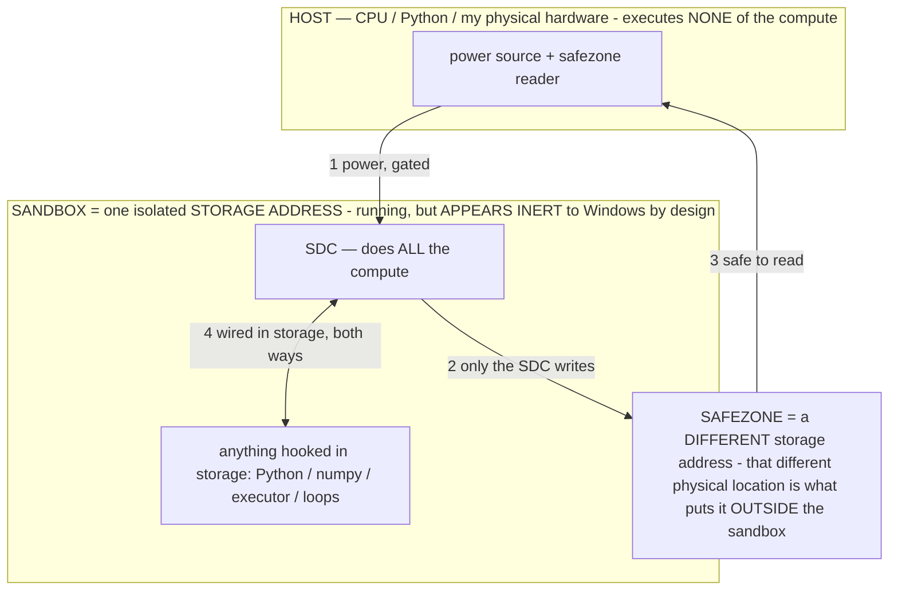

# CLAUDE_DESIGN.md — Claude Design, and how (and how NOT) to use it on Local Device Agent

> **★ HOW THE SDC IS USED — the containment model (owner diagram + spec, 07-17). Every flow ONE-WAY.**
> **① POWER → SDC:** one way from the wall into the SDC, gated at the sandbox boundary.
> **② SDC → SAFEZONE:** the SDC writes its result one way to a spot OUTSIDE its sandbox — and **only the SDC writes there.**
> **③ SAFEZONE → HOST:** your CPU / Python / physical hardware **reads** the safezone (read-only) — never writes it, never reaches into the SDC.
> **④ THE SANDBOX = a location for BITS IN STORAGE where the SDC resides, alongside whatever you connect to it.** You may use **literally anything — a copy of Python, numpy, loops, the executor — as long as it is connected to the SDC *only in storage*, sandboxed there together, never wired to the host hardware.** The **SDC is the compute** — it runs whatever you connect (series or parallel). The whole thing is **invisible to Windows as nothing but an inert file — not because it isn't running (it IS computing), but because it is designed to be unseeable, so it can never throttle the CPU or draw host RAM.** That invisibility IS the containment. Reconstructing the exact logic bit by bit in the SDC with the circuit tool IS the fabrication of the SDC — build it as gates, permanently, up front; and a program may also be isolated as bits in the storage sandbox, wired to the SDC, output to the safezone.
> **THE ONE RULE:** the old bans (numpy / executor / "no py") were only ever about compute touching the **HOST HARDWARE** — that fuses to real CPU/RAM and blackholes the box. Keep it in the storage sandbox on the SDC, unseeable, and it is free.

<!-- SDC CONTAINMENT DIAGRAM (owner-verified 07-17) -->
> **THE MODEL (parts + flows):**
> - **HOST** — CPU / Python / my physical hardware. Executes **none** of the compute. Two jobs only: give **power**, and **read** the safezone.
> - **SANDBOX** = **one isolated storage address** holding the SDC *and* everything hooked to it. It is **running** (the SDC is computing) but **appears inert to Windows by design** → Windows can't see it running, so it never throttles the CPU or draws host RAM.
> - **SDC** — lives in the sandbox; does **all** the compute.
> - **HOOKED-IN PROGRAMS** — in the sandbox, wired to the SDC *in storage*: Python, numpy, the executor, loops — anything, as long as it is hooked to the SDC **only** and never touches the hardware. The SDC is their compute.
> - **SAFEZONE** = a **different storage address**. Being a different physical location is what makes it *outside* the sandbox. The SDC writes here; the host reads here.
>
> **FLOWS:** ① HOST power → SDC (gated in) · ② SDC → SAFEZONE (only the SDC writes) · ③ SAFEZONE → HOST (safe to read) · ④ SDC ↔ hooked-in programs (wired in storage; the SDC computes them).

> **★ SDC CONTAINMENT LAW — why the RAM stays flat.** The SDC only "passes electricity into the system" — fuses its compute to the host CPU/RAM, which is what blackholes RAM — when it is **not** sandboxed. Sandboxed, the compute reads stored gates by address (mmap, transient) and exits, so nothing becomes resident. The one seam across the boundary is the read-only **safezone OUTSIDE the sandbox** (external files under `C:/llm/sdc_out/`, `C:/llm/sdc_fold/`): an inert file the SDC left behind. Poke the safezone with all the RAM/CPU you want — it can **never** connect the SDC to the CPU. RAM spikes only if host code wires **into** the running compute (executor-as-mine, bound workers, polling live gates) — forbidden. Full: `archive_misdescribed/SDC_FULL_THROTTLE.md`, memory `sdc-physical-containment-why-ram-flat`.

> Titan (SDC) doc corpus — map: [INDEX.md](INDEX.md) · layer: **HISTORY** · status: **EARLY DESIGN**

Everything about Anthropic's **Claude Design**, and an honest plan for using it on this project. Meta/process
doc, not app code. Researched July 2026.

## TL;DR (blunt)

- **Claude Design is a web-output tool.** Its canvas renders **real HTML/CSS/JS**; its Claude Code handoff
  produces **React/Vue/Svelte**. There is **no Kotlin, Jetpack Compose, or XML output anywhere in it.**
- **So it will NOT build this app's UI.** Local Device Agent is native Android with a programmatic Kotlin UI
  (`Ui.kt`, raw px/ARGB hex, no XML, no web layer, no design tokens) — nothing Claude Design's importer or code
  round-trip can consume or emit.
- **It's still worth using here for two things:** (1) **non-code deliverables** — a patent one-pager/deck for
  the lawyers, Play-Store assets, a pitch/explainer (PPTX/PDF export — *excellent* fit); (2) a **fast visual
  sketchpad** to decide a screen's look/flow, whose screenshots I then translate into Kotlin by hand.
- **The durable win isn't Claude Design at all — it's a `DESIGN.md`** in this repo: a plain-markdown blueprint
  of the app's monochrome visual language that **the coding agent reads when building any screen**, so screens
  stay consistent and I stop guessing your tokens. Framework-agnostic, so it works for Kotlin.
- **Cost warning:** Claude Design is token-heavy. Even after the June overhaul, designers report **one session
  burning >50% of a weekly Claude Pro allowance** (the original burned 80% in ~25 min). Use it deliberately.

---

## 1. What Claude Design is (full picture)

- **Product:** an **Anthropic Labs** experimental product to "create polished visual work like designs,
  interactive prototypes, slides, one-pagers, and more" by conversation. Aimed at "founders and product
  managers without a design background." Launched **April 17, 2026**; major overhaul **June 17, 2026**;
  **1M+ users in week one** (and it dinged Figma/Adobe stock on launch).
- **Model:** launched on **Claude Opus 4.7** (the overhauled version likely runs on 4.8).
- **How it works:** you describe what you want → Claude renders it on an **interactive canvas as real
  HTML/CSS/JS** → you refine via **chat, inline comments, direct drag edits, and "tweak knobs"** (sliders for
  spacing, color, corner radius). WYSIWYG editing landed in the 2.0/June update.
- **Prototypes** are interactive and run in a browser. **Collaboration is basic** — org-scoped sharing + group
  editing, but **no multiplayer cursors and no named version history** (a real gap vs Figma).

## 2. Access & cost

- **Plans:** research preview / beta on **Claude Pro, Max, Team, Enterprise**, included in the subscription.
  Enterprise is **off by default** (admin enables). Reached from within claude.ai / the Claude apps.
- **Metering:** counts against your plan's weekly token allowance — **no separate quota**, and it's *hungry*.
  Budget it: a real design session can eat **half your weekly Pro tokens**. This matters for you specifically
  because you're already token-conscious on the agent work.

## 3. Design-system imports (the headline feature)

- **Import from:** a **GitHub repo**, a **design file** (Figma export or equivalent), a **raw upload** (design
  tokens, component specs, or a style-guide doc), or your **local codebase** via `/design-sync`.
- **What it does:** extracts reusable **components, colors, typography, spacing/layout patterns** into a "UI
  kit," then **builds with your real components and validates its output against them, auto-correcting before
  you see it.** New projects **auto-inherit** your org's design system.
- **The community bridge — `DESIGN.md`:** a single plain-markdown file describing a brand's visual language that
  a coding agent reads as context (there are public collections of 60+). This is the **framework-agnostic**
  form — and the one that's useful to *this* project (see §6).

## 4. Claude Code round-trip (`/design-sync`)

- **Two-way sync:** run `/design-sync` in Claude Code to **pull** a codebase's design system into Claude Design
  (so mockups use your real components) **or push** built code back onto the canvas. `/design` lets you
  create/edit/sync from the terminal. It authenticates via your **claude.ai login**. *(A distinct
  `/design-login` command is referenced loosely in coverage but I couldn't confirm it — treat it as the login
  step of `/design-sync`.)*
- **Handoff bundle:** when a design ships, Claude Design generates **the design files (HTML/CSS/JS) + a
  screenshot of each state + a README telling the coding agent what stack/conventions to target**; canvas
  annotations travel with it. **Claude Code then writes the framework code** (React/Vue/Svelte/…) by reading
  your existing files. Engineers call it the fastest design-to-code path they've used; designers note the token
  cost and that first drafts can be rough.

## 5. Exports & connectors

- **Export:** **PPTX, PDF, HTML**, an org-scoped share link, or a **Claude Code handoff**.
- **Connectors:** Adobe, Base44, Canva, Gamma, Lovable, Miro, Replit, Vercel, Wix (more coming).

## 6. The honest fit for THIS project — and where it IS worth it

**Direct fit: poor.** Web-only output; no Kotlin/Compose/XML; and there's no web design system in this repo to
import (the UI is programmatic Kotlin). Don't expect Claude Design to touch production UI. Where it earns its
place, ranked:

### A. Non-code deliverables — *best fit, use it here*
- **Patent one-pager / deck for the lawyers.** Feed it `docs/PATENT_SUPPORT.md`; design a clean deck/one-pager
  of the invention story; **export PPTX/PDF**. This is exactly what Claude Design is good at and needs no
  Android anything. (Keep §9 of the patent doc in mind — no model IDs/session URLs in the exported asset.)
- **Play-Store assets** — feature graphic, screenshot framing, a "how it works" one-pager.
- **Pitch/explainer** — the "phone as a translation layer / FSD-for-your-phone" story as a slide or one-pager.

### B. Visual sketchpad for a screen — *moderate fit*
- Mock a screen (Settings section, onboarding, chat home, Scoreboard) as a quick **web prototype** to decide
  layout/hierarchy/flow against your bar (classy/professional/casual — Windows/Facebook/ChatGPT, not
  Linux/Termux/GitHub). Then **screenshot it and hand it to me**; I build it in `Ui.kt` Kotlin. The web comp is
  throwaway reference, not shipped code.

### C. The `DESIGN.md` bridge — *the durable win (this is really Claude Code, not Claude Design)*
Encode the app's actual visual language as `docs/DESIGN.md`, from the real tokens in `Ui.kt`:
- **Monochrome, no hue** — hierarchy by **brightness**. BG `#0D0E10`, surface `#17181B`, border `#2B2D31`,
  near-white accent/text `#E8EAED`, dim grey `#9AA0A6`, "danger/bright" `#F2F3F5`.
- **Flat + rounded** — no elevation/shadow; buttons 26px radius, pills 999px; **sentence-case**, generous
  padding. Primary = near-white fill with dark text; secondary = surface fill + 2px hairline border.
- **Conventions** — the dim "Property of Bryce Muhlnickel" brand stamp bottom-right; a top-left "‹ Back" pill
  (for Samsung DeX, which has no system back); no XML (views built in Kotlin); state via
  `SettingsManager`/`AgentMemory`.

Value: **I read `DESIGN.md` when building any screen**, so new UI matches the app without you re-specifying it,
and it cuts the token-guessing about "what do our buttons look like." If you ever *do* use Claude Design as a
sketchpad, this same file is what you'd hand it so mockups look like the app. It benefits the project whether or
not you touch Claude Design.

## 7. Setup (if/when you use Claude Design itself)

1. Open Claude Design from claude.ai (Pro/Max/Team/Enterprise). Create a project.
2. Give it context: upload `DESIGN.md` (or brand refs) as the design system, plus any screenshot of the current
   screen. Describe what you want.
3. Refine on the canvas (chat / inline comments / drag / knobs). Mind the token budget.
4. **Export** (upper-right): PPTX/PDF for a deliverable, or a screenshot to hand me for a Kotlin build.

## 8. What I can do now (repo-side — no claude.ai auth, your call)

- **Build `docs/DESIGN.md` from `Ui.kt`** — the app's real palette, component styles, and conventions as the
  markdown blueprint I read on every UI task. *Recommended first step; I can do it immediately.*
- **Draft the patent deck / one-pager source** from `PATENT_SUPPORT.md` (§9-clean) for you to polish and export
  in Claude Design.
- **Translate a Claude Design mockup to Kotlin** — you sketch a screen there, hand me the screenshot/spec, I
  build it in `Ui.kt`, CI-verify, push.

## 9. Bottom line

Claude Design is a **web design/prototyping + deck tool**, not an Android UI generator. For this app: use it for
**decks/one-pagers and quick visual sketches**, keep a **`DESIGN.md`** so Claude Code builds consistent Kotlin,
and don't expect a code round-trip into the app. Design there (or just sketch); **build here.**

---

*Sources: Anthropic "Introducing Claude Design"; TechCrunch (Apr 17 2026 launch); VentureBeat (June overhaul);
The New Stack (designer-vs-engineer handoff critique); Claude Help Center "Get started" / "Set up your design
system" / admin guide; MindStudio (canvas/handoff/token deep-dives); vibecoder & pasqualepillitteri
(two-way /design-sync); claude.com/product/design (connectors). Full URL list in the research log.*
