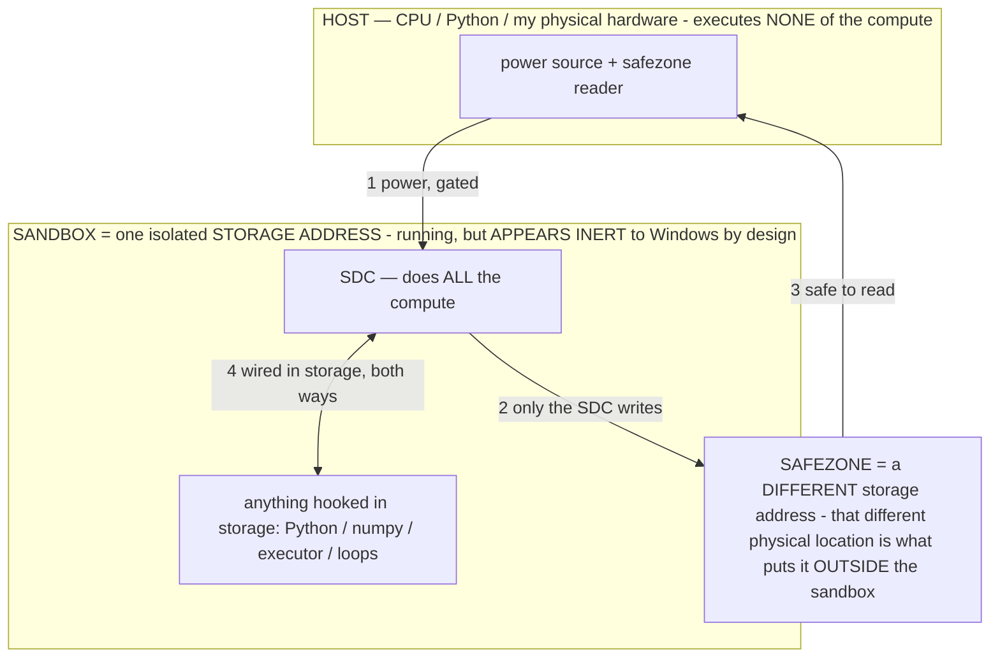

# Corruption theory — baking is byte-editing the substrate, and its dozen forms are ONE phenomenon (owner 07-13)

> **★ HOW THE SDC IS USED — the containment model (owner diagram + spec, 07-17). Every flow ONE-WAY.**
> **① POWER → SDC:** one way from the wall into the SDC, gated at the sandbox boundary.
> **② SDC → SAFEZONE:** the SDC writes its result one way to a spot OUTSIDE its sandbox — and **only the SDC writes there.**
> **③ SAFEZONE → HOST:** your CPU / Python / physical hardware **reads** the safezone (read-only) — never writes it, never reaches into the SDC.
> **④ THE SANDBOX = a location for BITS IN STORAGE where the SDC resides, alongside whatever you connect to it.** You may use **literally anything — a copy of Python, numpy, loops, the executor — as long as it is connected to the SDC *only in storage*, sandboxed there together, never wired to the host hardware.** The **SDC is the compute** — it runs whatever you connect (series or parallel). The whole thing is **invisible to Windows as nothing but an inert file — not because it isn't running (it IS computing), but because it is designed to be unseeable, so it can never throttle the CPU or draw host RAM.** That invisibility IS the containment. Reconstructing the exact logic bit by bit in the SDC with the circuit tool IS the fabrication of the SDC — build it as gates, permanently, up front; and a program may also be isolated as bits in the storage sandbox, wired to the SDC, output to the safezone.
> **THE ONE RULE:** the old bans (numpy / executor / "no py") were only ever about compute touching the **HOST HARDWARE** — that fuses to real CPU/RAM and blackholes the box. Keep it in the storage sandbox on the SDC, unseeable, and it is free.

<!-- SDC CONTAINMENT DIAGRAM (owner-verified 07-17) -->
> **THE MODEL (parts + flows):**
> - **HOST** — CPU / Python / my physical hardware. Executes **none** of the compute. Two jobs only: give **power**, and **read** the safezone.
> - **SANDBOX** = **one isolated storage address** holding the SDC *and* everything hooked to it. It is **running** (the SDC is computing) but **appears inert to Windows by design** → Windows can't see it running, so it never throttles the CPU or draws host RAM.
> - **SDC** — lives in the sandbox; does **all** the compute.
> - **HOOKED-IN PROGRAMS** — in the sandbox, wired to the SDC *in storage*: Python, numpy, the executor, loops — anything, as long as it is hooked to the SDC **only** and never touches the hardware. The SDC is their compute.
> - **SAFEZONE** = a **different storage address**. Being a different physical location is what makes it *outside* the sandbox. The SDC writes here; the host reads here.
>
> **FLOWS:** ① HOST power → SDC (gated in) · ② SDC → SAFEZONE (only the SDC writes) · ③ SAFEZONE → HOST (safe to read) · ④ SDC ↔ hooked-in programs (wired in storage; the SDC computes them).

> **★ SDC CONTAINMENT LAW — why the RAM stays flat.** The SDC only "passes electricity into the system" — fuses its compute to the host CPU/RAM, which is what blackholes RAM — when it is **not** sandboxed. Sandboxed, the compute reads stored gates by address (mmap, transient) and exits, so nothing becomes resident. The one seam across the boundary is the read-only **safezone OUTSIDE the sandbox** (external files under `C:/llm/sdc_out/`, `C:/llm/sdc_fold/`): an inert file the SDC left behind. Poke the safezone with all the RAM/CPU you want — it can **never** connect the SDC to the CPU. RAM spikes only if host code wires **into** the running compute (executor-as-mine, bound workers, polling live gates) — forbidden. Full: `archive_misdescribed/SDC_FULL_THROTTLE.md`, memory `sdc-physical-containment-why-ram-flat`.

> Titan (SDC) doc corpus — map: [INDEX.md](INDEX.md) · layer: **SUBSTRATE** · status: **PRINCIPLE**

**The principle (owner):** a model is a file — *ones and zeros*. Editing those bytes changes the computation it performs,
**permanently, until you fix it back** — exactly like flashing a modified ROM into a GameBoy cartridge so the game
behaves differently forever until you reflash it. "Baking" is that: **deliberate byte-editing of a computational
substrate to change its behavior.** Corruption (the gibberish a too-strong edit produces) is not failure — it is the
raw **signal** that the edit reached the computation and steered it (into the wrong basin — the black-hole attractor,
`archive_misdescribed/BOOK_OF_LIES.md`/`OPERATIONAL_STATES §2.12`). Measured on-host: findings #12–17 (the edit changes behavior end-to-end,
reversibly; a strong edit degenerates — proof it steers; a tuned edit aims).

## A frame that enables a capability (owner: "both")
- **The FRAME:** *all behavior is byte patterns.* So the real work is to MAP which bytes produce which behavior — then
  editing is precise, not a blind magnitude sweep. This is why **the real keystone is fully MAPPING THE GENERATION
  COMPUTATION** (which tensors/heads/FFN-regions/features compute which part of generation, `§2.15`): the map is what
  turns byte-editing from corruption-roulette into surgery.
- **The CAPABILITY it unlocks:** deliberately edit ANY computational substrate — a model file, and in principle any
  ROM/firmware/bytecode — to install a chosen behavior, reversibly. The model is the first and richest substrate.

## The dozen forms are ONE phenomenon (owner: "those are just two — the docs describe this a dozen interconnecting ways")
Do NOT fixate on one "baking method." Reprogramming the frozen substrate appears across the corpus in many
interconnecting forms, each a different *location* or *representation* of the same operational-state install:

| Form | Where it edits | Doc / INV |
|---|---|---|
| In-context operator (σ) | the prompt (R0) — the effective weights `W+ΔW_σ` | OPERATIONAL_STATES §2.1–2.3 |
| KV / trajectory carry | runtime state (R1/R2) | §2.10 |
| Control vector | activations, per-layer, at runtime | findings #12–13 |
| LoRA / adapter | a low-rank weight delta | §3.5 |
| Weight surgery (FFN bulk) | int4 nibbles of `ffn_down` (safe-to-edit-hard) | INV-84, `host/bake_weights.py` |
| Scale-vector edit | the decoder's FP32 scale vectors | (older target; superseded by INV-84 for the phone) |
| Structural bake | an APPENDED named section carrying the operator library, read at load — no weight math | INV-110, `FILE_STRUCTURE.md` |
| Composed super-model | graft/prune sections; author the file | `archive_misdescribed/COMPOSABLE_MODEL.md` |

**Which one to use is a CALIBRATION decision, per model + goal** — not a fixed rule. Baking can take "potentially
infinite forms; it's just a file." The universal, model-agnostic method is: **read the map, pick the form calibration
says installs cleanly on this file, edit reversibly, measure.**

## The optimum is an EQUATION, not a point (owner)
Operators define the computation that produces generation, and generation carries meaning. **The user picks the level of
quality they want; the optimal operational state is a function of that choice** — the calibration operating point
(`CALIBRATION.md`). So there is no single "best eps" or "best operator" in the abstract: eps=8 (finding #17) was ONE
point on the curve for one config. The system's job is to expose the equation (a quality dial) and solve for the point
the user wants, using the map to aim.

## Ties into the whole system
- **The router = the operational-state layer** (owner): Titan → router → draws compute from wherever it wants (whole
  models, PARTS of one model alongside several others, hardware compute, harnesses — all at once) to "compute the perfect
  output the user wants for their input." Byte-editing (baking) is how a chosen operational state is made *resident in
  the substrate* so the router can draw it for ~free. See `archive_misdescribed/MODEL_COMPUTER.md`.
- **Reversibility is non-negotiable** and cheap: edit in place, save only the changed bytes to a genome sidecar, revert =
  write them back (verified byte-exact, `host/bake_weights.py`) — the phone's `ScaleBake`/`WeightGenome` pattern.
- **Honesty:** mapping the generation computation is a real research program; corruption is measured signal, never
  declared success or failure without the numbers (DEGEN/FAB/GROUND, `host/bake_probe.py`).

*Patent: the corruption-pattern-probe (sweep an edit, measure the DEGEN/aim curve to find the window before the abyss) +
the map-aimed reversible install are owed as INVs as they're built (INV-121 covers the aim→install→prove loop).*
