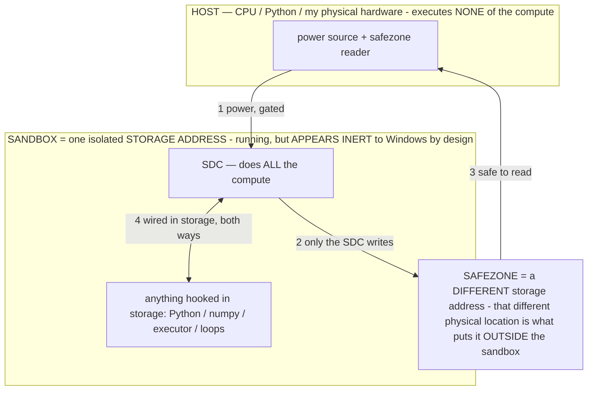

# SEARCH & DESTROY: the launch crash on the unified super-APK

> **★ HOW THE SDC IS USED — the containment model (owner diagram + spec, 07-17). Every flow ONE-WAY.**
> **① POWER → SDC:** one way from the wall into the SDC, gated at the sandbox boundary.
> **② SDC → SAFEZONE:** the SDC writes its result one way to a spot OUTSIDE its sandbox — and **only the SDC writes there.**
> **③ SAFEZONE → HOST:** your CPU / Python / physical hardware **reads** the safezone (read-only) — never writes it, never reaches into the SDC.
> **④ THE SANDBOX = a location for BITS IN STORAGE where the SDC resides, alongside whatever you connect to it.** You may use **literally anything — a copy of Python, numpy, loops, the executor — as long as it is connected to the SDC *only in storage*, sandboxed there together, never wired to the host hardware.** The **SDC is the compute** — it runs whatever you connect (series or parallel). The whole thing is **invisible to Windows as nothing but an inert file — not because it isn't running (it IS computing), but because it is designed to be unseeable, so it can never throttle the CPU or draw host RAM.** That invisibility IS the containment. Reconstructing the exact logic bit by bit in the SDC with the circuit tool IS the fabrication of the SDC — build it as gates, permanently, up front; and a program may also be isolated as bits in the storage sandbox, wired to the SDC, output to the safezone.
> **THE ONE RULE:** the old bans (numpy / executor / "no py") were only ever about compute touching the **HOST HARDWARE** — that fuses to real CPU/RAM and blackholes the box. Keep it in the storage sandbox on the SDC, unseeable, and it is free.

<!-- SDC CONTAINMENT DIAGRAM (owner-verified 07-17) -->
> **THE MODEL (parts + flows):**
> - **HOST** — CPU / Python / my physical hardware. Executes **none** of the compute. Two jobs only: give **power**, and **read** the safezone.
> - **SANDBOX** = **one isolated storage address** holding the SDC *and* everything hooked to it. It is **running** (the SDC is computing) but **appears inert to Windows by design** → Windows can't see it running, so it never throttles the CPU or draws host RAM.
> - **SDC** — lives in the sandbox; does **all** the compute.
> - **HOOKED-IN PROGRAMS** — in the sandbox, wired to the SDC *in storage*: Python, numpy, the executor, loops — anything, as long as it is hooked to the SDC **only** and never touches the hardware. The SDC is their compute.
> - **SAFEZONE** = a **different storage address**. Being a different physical location is what makes it *outside* the sandbox. The SDC writes here; the host reads here.
>
> **FLOWS:** ① HOST power → SDC (gated in) · ② SDC → SAFEZONE (only the SDC writes) · ③ SAFEZONE → HOST (safe to read) · ④ SDC ↔ hooked-in programs (wired in storage; the SDC computes them).

> **★ SDC CONTAINMENT LAW — why the RAM stays flat.** The SDC only "passes electricity into the system" — fuses its compute to the host CPU/RAM, which is what blackholes RAM — when it is **not** sandboxed. Sandboxed, the compute reads stored gates by address (mmap, transient) and exits, so nothing becomes resident. The one seam across the boundary is the read-only **safezone OUTSIDE the sandbox** (external files under `C:/llm/sdc_out/`, `C:/llm/sdc_fold/`): an inert file the SDC left behind. Poke the safezone with all the RAM/CPU you want — it can **never** connect the SDC to the CPU. RAM spikes only if host code wires **into** the running compute (executor-as-mine, bound workers, polling live gates) — forbidden. Full: `archive_misdescribed/SDC_FULL_THROTTLE.md`, memory `sdc-physical-containment-why-ram-flat`.

> Titan (SDC) doc corpus — map: [INDEX.md](INDEX.md) · layer: **HISTORY** · status: **FIXED+CLOSED**

> **Read this cold and execute.** The 4-session merge (`session-recovery-6w04ma` tip) builds green but
> the app crashes instantly on launch (opens → retracts into icon; sometimes the ANR "app isn't
> responding, close/wait" dialog). Goal: find the ONE cause and fix it RIGHT — keep all features,
> reimplement the culprit to preserve its INTENT without the crash (owner's rule: spirit over exact
> code). Do NOT reflexively revert; revert is only the last-resort fallback (§6).

## 1. STEP ONE — get the actual stack trace (do this first, it ends the guessing)
Commit `15acd4d` added a launch-crash recorder in `AgentApp.onCreate` (a default
`UncaughtExceptionHandler`, set first) that appends any uncaught crash to:
`Android/data/com.local.deviceagent/files/agent_crash.txt`
- Ask the owner to install the latest `session-recovery-6w04ma` artifact, open it (let it crash),
  then read that file via **Samsung My Files** (Galaxy Z Fold 7 — My Files CAN reach Android/data).
- The top 5 lines are the exact exception + class + line. That pinpoints it. **Everything below is
  only needed if that file is empty/unobtainable** (which means it's an ANR or a native crash, not a
  Kotlin exception — see §4).
- If the owner can't reach the file: improve the recorder to also re-display the saved crash on the
  NEXT launch (MainActivity reads `agent_crash.txt` and shows it in a TextView BEFORE `setupUI`,
  wrapped so a MainActivity crash can't hide it). One small build; removes the file-access hurdle.

## 2. What is ALREADY RULED OUT (don't re-investigate — this session confirmed it)
- **NOT the obfuscation.** R8 minify was on the *debug* build (renamed a launch class) → fixed
  `a1a8064` (moved all hardening to a new `release` buildType; debug is plain). Then packaging
  `excludes` stripped `kotlin/**` + `**/*.kotlin_builtins` (the Kotlin runtime's own metadata) from
  every build → fixed `a00f9cb` (removed the packaging block). **`a00f9cb` had obfuscation FULLY OFF
  and still crashed** → the current crash is not obfuscation.
- **NOT hidden anti-tamper.** Full grep for signature/root/emulator/debugger/`System.exit`/ptrace/etc.
  came back clean — `TamperGuard` is the only guard and it early-returns on `BuildConfig.DEBUG`
  (gated in `a1a8064`); the Vosk `SecurityException` is just a zip-safety check during model unzip.
- **Startup files are UNCHANGED vs the last-known-good `bec1858`** except AgentApp's +4 gated
  TamperGuard lines. `git diff --stat bec1858 HEAD -- AgentApp.kt MainActivity.kt Ui.kt AndroidManifest.xml`
  showed only AgentApp changed. So the crash is in code the startup path *calls* (merged
  memory/brain/service code), not the startup files themselves.

## 3. PRIME SUSPECTS — search these, in order (a Kotlin exception at/just-after onCreate)
The launch sequence: `AgentApp.onCreate` (crash recorder → gated TamperGuard → registers
ActivityLifecycleCallbacks that call `Ui.stampBrand`/`Ui.stampBackButton` on EVERY activity's
onStart/onResume) → `MainActivity.onCreate` (`SettingsManager(this)` → `NotificationHelper.createChannel`
→ `setupUI()` → `checkAndRequestPermissions()`).
1. **`Ui.stampBrand` / `Ui.stampBackButton`** run on MainActivity via the lifecycle callback. If a
   merge changed `Ui.kt` or a resource they touch, EVERY activity crashes on start. (Ui.kt was
   unchanged vs bec1858 — but re-verify against `main`/the merged branches, not just bec1858.)
2. **A merged `AgentMemory` / `SettingsManager` read that throws on EXISTING prefs.** The merges added
   fields/migrations (flashbulb `⚡` lessons, falsifiable `false` flag, world-model TRANS/SELFCLAIMS,
   values). If any code path reads/parses stored JSON at startup and a merge changed the shape, an
   existing install's prefs could throw (`JSONException`/`NPE`). NOTE the owner UNINSTALLED, so a
   fresh install has empty prefs — if it STILL crashes fresh, it's not a prefs-migration issue.
3. **`MainActivity.setupUI()` / `checkAndRequestPermissions()`** — read them fully; a merge may have
   added a call into changed brain/memory code, or a view/resource that throws.
4. **A service auto-starting at launch.** `MainActivity` has `startForegroundService(AgentService)` /
   `startService(FloatingButtonService)` at lines ~201/275/427 — confirm whether any fires
   unconditionally on launch (vs. inside a button handler). `AgentService.onCreate` (~line 171) and
   `ActionAccessibilityService` were heavily merge-modified (voice/mic/model lifecycle) — if one
   auto-starts and its onCreate throws or blocks the main thread, that's the crash/ANR.
5. **Eager class-load init.** A `companion object` / top-level `val` in a merged file that throws when
   the class first loads (e.g., a bad `Regex(...)` literal, a `lateinit`/`by lazy` misuse). Grep the
   merged files for `init {`, `by lazy`, complex `Regex(` at field scope.
6. **Manifest component mismatch.** Re-diff `AndroidManifest.xml` against ALL merged branches (not
   just bec1858): a service/receiver referenced by merged code but not declared → ClassNotFound on
   component init. (Earlier diff vs bec1858 was clean; confirm vs the merged tips.)

## 4. If `agent_crash.txt` is EMPTY (ANR or native crash — not a Kotlin exception)
- **ANR** ("close or wait" dialog) = the MAIN THREAD blocked >5s at startup. Hunt for synchronous
  heavy work added by a merge in the startup path: disk I/O, a model/file probe, a large loop/regex,
  a network call. Move it off the main thread (Dispatchers.IO) or defer it.
- **Native crash** (SIGSEGV) = a `.so` load problem (LiteRT / Vosk / MLKit). Check whether a merge
  changed native packaging: `abiFilters`, `android:extractNativeLibs`, `useLegacyPackaging`, or
  jniLibs. The build strips 6 native libs (see `stripDebugDebugSymbols` log) — verify none were
  dropped/duplicated by the merge. `adb logcat` (if owner can run it once) shows the `.so` + signal.

## 5. FIX PRINCIPLE (owner's rule)
Fix the ROOT cause; keep every feature. If a merged feature's code is the culprit, **reimplement it to
achieve the same intent without the crash** — the owner cares about the spirit of what he asked for,
not the literal lines. Every fix: (a) CI green (compile), THEN (b) owner on-device launch test — the
only real verification. Keep obfuscation/RASP release-only; re-enable + test string encryption on a
RELEASE build separately, never on the debug build the owner flashes.

## 6. LAST-RESORT FALLBACK (only if the search truly stalls)
`git checkout -B claude/session-recovery-6w04ma bec1858 && force-push`. `bec1858` = the owner's own
session's full feature set (values+desire, scoreboard/gauntlet, rolling re-plan, shared budget,
memory-quality, model-variant), startup identical to builds that ran fine. The 3 other sessions'
extras (world-model, flashbulb/falsifiable memory, audit trail, ask-before-system gate, RASP) are NOT
lost — they live on their own branches + in history. Re-merge them ONE AT A TIME, on-device-testing
each, instead of the all-at-once merge that hid this crash.

## 7. Post-fix: the queued work (in priority order, owner-approved)
1. **Durable memory storage** (URGENT — uninstall wiped the agent's memories; owner: "he needs to be
   stored differently"). Export values/facts/lessons/skills/world-model to an owner-readable file +
   auto-backup + one-tap restore, so an uninstall/reflash never erases his identity again. `allowBackup`
   is already true (auto-restore MAY recover this loss on reinstall — have the owner check).
2. **Offline replay/eval harness** — feed recorded `screen→action→outcome` (TrainingData) back into the
   current brain, agent RE-DECIDES fresh (not a canned replay — owner's clarification), diff vs
   recorded. Regression test for the agent's judgment without a phone.
3. **E2B-first** — owner: "idc which as long as it works and can switch back and forth." Support both
   E2B/E4B model slots + easy switch (auto-prefer E2B under RAM pressure). `DeviceStats.modelVariant`
   already detects the variant by name.
4. **Post-merge consolidation** — reconcile the redundant systems the merge stacked (my rolling-replan
   vs their milestone cursor; my `PromptBudget` vs their prompt pre-fitter — likely complementary,
   keep both; two crediting paths — I left their deferred `pendingCredit` INERT, decide: activate it
   [more accurate, avoids crediting a wrong-menu detour] or keep my immediate credit). Distill each
   overlap's INTENT and unify.

## 8. Branch / commit state (as of this handoff)
Branch `claude/session-recovery-6w04ma`, tip `15acd4d`. Recent fix history:
`bec1858` (last pre-merge, likely-good base) → `8a798fa` merge apk-protection → `25e6b5f` merge
agent-arch → `9e1be2e` merge tender-turing → `258fc08` build-cache off → `26fa394` LSParanoid off →
`a1a8064` obfuscation→release-only + TamperGuard gated → `a00f9cb` remove kotlin-stripping packaging
excludes → `15acd4d` crash recorder. CI can't verify runtime (compile only); the owner's device is
the arbiter. GitHub MCP auth may need re-authorizing (claude.ai connector settings) to check CI.
