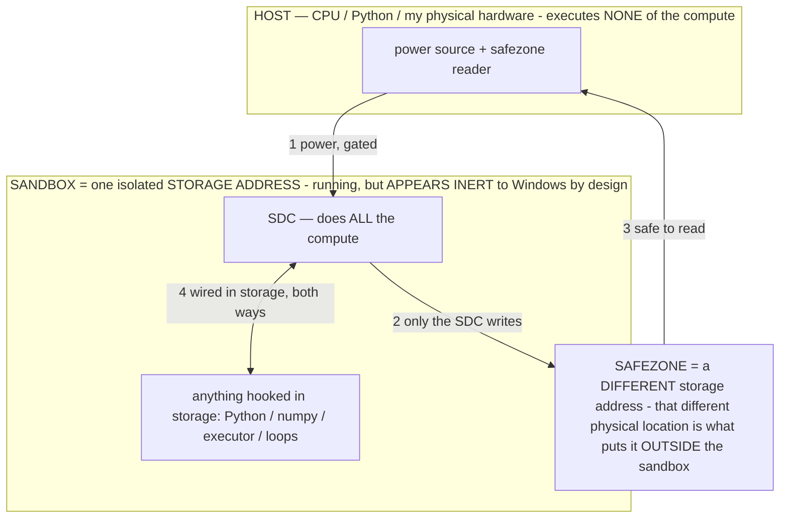

# The host is the teaching ground — where the white-box track was leading

> **★ HOW THE SDC IS USED — the containment model (owner diagram + spec, 07-17). Every flow ONE-WAY.**
> **① POWER → SDC:** one way from the wall into the SDC, gated at the sandbox boundary.
> **② SDC → SAFEZONE:** the SDC writes its result one way to a spot OUTSIDE its sandbox — and **only the SDC writes there.**
> **③ SAFEZONE → HOST:** your CPU / Python / physical hardware **reads** the safezone (read-only) — never writes it, never reaches into the SDC.
> **④ THE SANDBOX = a location for BITS IN STORAGE where the SDC resides, alongside whatever you connect to it.** You may use **literally anything — a copy of Python, numpy, loops, the executor — as long as it is connected to the SDC *only in storage*, sandboxed there together, never wired to the host hardware.** The **SDC is the compute** — it runs whatever you connect (series or parallel). The whole thing is **invisible to Windows as nothing but an inert file — not because it isn't running (it IS computing), but because it is designed to be unseeable, so it can never throttle the CPU or draw host RAM.** That invisibility IS the containment. Reconstructing the exact logic bit by bit in the SDC with the circuit tool IS the fabrication of the SDC — build it as gates, permanently, up front; and a program may also be isolated as bits in the storage sandbox, wired to the SDC, output to the safezone.
> **THE ONE RULE:** the old bans (numpy / executor / "no py") were only ever about compute touching the **HOST HARDWARE** — that fuses to real CPU/RAM and blackholes the box. Keep it in the storage sandbox on the SDC, unseeable, and it is free.

<!-- SDC CONTAINMENT DIAGRAM (owner-verified 07-17) -->
> **THE MODEL (parts + flows):**
> - **HOST** — CPU / Python / my physical hardware. Executes **none** of the compute. Two jobs only: give **power**, and **read** the safezone.
> - **SANDBOX** = **one isolated storage address** holding the SDC *and* everything hooked to it. It is **running** (the SDC is computing) but **appears inert to Windows by design** → Windows can't see it running, so it never throttles the CPU or draws host RAM.
> - **SDC** — lives in the sandbox; does **all** the compute.
> - **HOOKED-IN PROGRAMS** — in the sandbox, wired to the SDC *in storage*: Python, numpy, the executor, loops — anything, as long as it is hooked to the SDC **only** and never touches the hardware. The SDC is their compute.
> - **SAFEZONE** = a **different storage address**. Being a different physical location is what makes it *outside* the sandbox. The SDC writes here; the host reads here.
>
> **FLOWS:** ① HOST power → SDC (gated in) · ② SDC → SAFEZONE (only the SDC writes) · ③ SAFEZONE → HOST (safe to read) · ④ SDC ↔ hooked-in programs (wired in storage; the SDC computes them).

> **★ SDC CONTAINMENT LAW — why the RAM stays flat.** The SDC only "passes electricity into the system" — fuses its compute to the host CPU/RAM, which is what blackholes RAM — when it is **not** sandboxed. Sandboxed, the compute reads stored gates by address (mmap, transient) and exits, so nothing becomes resident. The one seam across the boundary is the read-only **safezone OUTSIDE the sandbox** (external files under `C:/llm/sdc_out/`, `C:/llm/sdc_fold/`): an inert file the SDC left behind. Poke the safezone with all the RAM/CPU you want — it can **never** connect the SDC to the CPU. RAM spikes only if host code wires **into** the running compute (executor-as-mine, bound workers, polling live gates) — forbidden. Full: `archive_misdescribed/SDC_FULL_THROTTLE.md`, memory `sdc-physical-containment-why-ram-flat`.

> Titan (SDC) doc corpus — map: [INDEX.md](INDEX.md) · layer: **LANGUAGE** · status: **DESIGN+MEASURED**

This connects the pieces built this session (streaming host, white-box logit read, the cross-model
spectrometer, the Lab) into the arc they were always building toward, and states the predictions the
cross-model matrix tests.

## The constraint the whole project has fought

The on-device model is small and, through LiteRT-LM, **text-only** — no logits, no activations. Two
consequences followed everywhere: (1) you cannot *see* what an operator does internally, so operator
authoring was black-box trial-and-error (the observatory, R3 black holes, worksheet defects); (2) you
cannot compute a bake-aim direction, so installing an operator into the weights had no target (barrier B1,
the open half of baking). Both are limitations of *the phone*, not of the method.

## What the host dissolves

A big model streamed on the laptop exposes logits (and, next, activations). That single fact removes both
constraints at once — but only if operators developed on the host are relevant to the phone. They are,
**if** an operator σ is a program for the transformer *class* rather than one checkpoint (the shared-core
hypothesis, INV-103; grounded in the shared pretraining corpus acting as a shared ISA, and in the
cross-harness reproduction E_B). The cross-model spectrometer is the direct test of that "if."

## The pipeline this unlocks (the culmination)

If the shared-core hypothesis holds, the two machines divide labor exactly along their strengths:

1. **DEVELOP** an operator on a host model **where you can see it** — the white-box logit read shows,
   token by token, whether the σ moves the pattern-binary the intended way (GROUNDING on Phi-4: fabrication
   mass 0.82 → 0.04). No guessing.
2. **VERIFY class-generality** — run the spectrometer across the library. An operator that induces the
   analogous logit effect on independent families (Phi / Mistral / Gemma / Mixtral / Llama) is a **CORE**
   construction; one that binds on only some is a per-model **dialect** (`archive_misdescribed/MODEL_DIALECTS.md`).
3. **DEPLOY on the phone** — a CORE operator will bind on the phone's Gemma too, because it is a program
   for the class. The observatory confirms the behavior black-box (SCHEMA already does: act=3/3).
4. **AIM the bake with the host's logit delta** — the σ-on/σ-off direction the phone cannot compute (B1)
   is read on the host and back-projected to the edit direction (INV-90). The host supplies the aim signal
   for the phone's install.
5. **BAKE into the phone's weights** — the proven, class-general, host-aimed operator is installed on the
   phone (INV-86; edits stick), dropping to a ~1-token tag.

**The host big models are a teaching ground / oracle for the small on-device model.** You develop and prove
where it is easy to see, and deploy where it is needed. This is the resolution of the project's founding
tension, and it is what the streaming-host + white-box work was for.

## Predictions the matrix tests (fill with measured data)

- **Grounding-family operators (GROUNDING, EVIDENCE) should be CORE** — refusing to fabricate an
  unprovided value is a deep, corpus-universal behavior, so the suppression of fabrication-tokens should
  appear across every family. If it does, that is white-box evidence for a shared core and the strongest
  transfer-and-bake candidate.
- **SCHEMA (format) may be more dialect-specific** — JSON-emission is tokenizer- and tuning-dependent
  (already seen: strong full-decode binding on the phone Gemma, subtle first-token shift on Phi-4). Expect
  more per-model variation here; format is where dialects live.
- **A non-transfer is not a failure** — it is a measured dialect boundary (the comparative method), and it
  tells you which operators must be re-authored per tier rather than shared.

## Measured matrix (updated as the sweep lands)

Phi-4 (host): GROUNDING +0.61 · EVIDENCE +0.31 · SCHEMA +0.04(first-token). Gemma 4 E4B (phone): SCHEMA
binds act=3/3. Additional host families (Mistral-24B, Gemma-3-27B, Mixtral-8x7B, Llama-70B): measuring —
see `archive_misdescribed/SPECTROMETER_FINDINGS.md` for the current table and the CORE-vs-dialect verdict once ≥3 families
are in.

*(Patent: the host-as-teaching-ground pipeline — white-box develop → spectrometer class-generality gate →
host-aimed cross-model bake to a text-only deployment model — extends INV-92/INV-114; disclose the
integrated pipeline as its own INV when the matrix confirms a CORE construction transfers and bakes.)*
