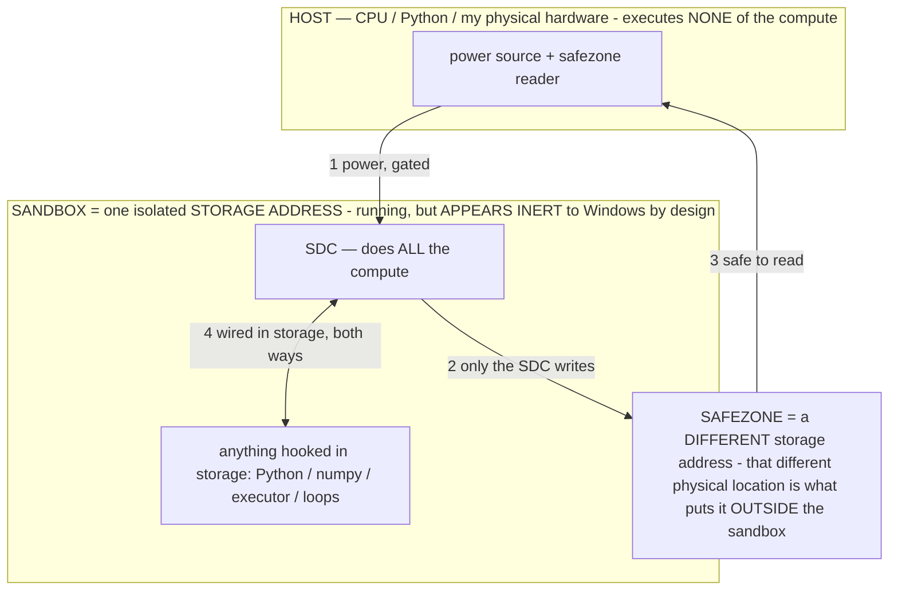

# DESIGN.md — Local Device Agent visual language

> **★ HOW THE SDC IS USED — the containment model (owner diagram + spec, 07-17). Every flow ONE-WAY.**
> **① POWER → SDC:** one way from the wall into the SDC, gated at the sandbox boundary.
> **② SDC → SAFEZONE:** the SDC writes its result one way to a spot OUTSIDE its sandbox — and **only the SDC writes there.**
> **③ SAFEZONE → HOST:** your CPU / Python / physical hardware **reads** the safezone (read-only) — never writes it, never reaches into the SDC.
> **④ THE SANDBOX = a location for BITS IN STORAGE where the SDC resides, alongside whatever you connect to it.** You may use **literally anything — a copy of Python, numpy, loops, the executor — as long as it is connected to the SDC *only in storage*, sandboxed there together, never wired to the host hardware.** The **SDC is the compute** — it runs whatever you connect (series or parallel). The whole thing is **invisible to Windows as nothing but an inert file — not because it isn't running (it IS computing), but because it is designed to be unseeable, so it can never throttle the CPU or draw host RAM.** That invisibility IS the containment. Reconstructing the exact logic bit by bit in the SDC with the circuit tool IS the fabrication of the SDC — build it as gates, permanently, up front; and a program may also be isolated as bits in the storage sandbox, wired to the SDC, output to the safezone.
> **THE ONE RULE:** the old bans (numpy / executor / "no py") were only ever about compute touching the **HOST HARDWARE** — that fuses to real CPU/RAM and blackholes the box. Keep it in the storage sandbox on the SDC, unseeable, and it is free.

<!-- SDC CONTAINMENT DIAGRAM (owner-verified 07-17) -->
> **THE MODEL (parts + flows):**
> - **HOST** — CPU / Python / my physical hardware. Executes **none** of the compute. Two jobs only: give **power**, and **read** the safezone.
> - **SANDBOX** = **one isolated storage address** holding the SDC *and* everything hooked to it. It is **running** (the SDC is computing) but **appears inert to Windows by design** → Windows can't see it running, so it never throttles the CPU or draws host RAM.
> - **SDC** — lives in the sandbox; does **all** the compute.
> - **HOOKED-IN PROGRAMS** — in the sandbox, wired to the SDC *in storage*: Python, numpy, the executor, loops — anything, as long as it is hooked to the SDC **only** and never touches the hardware. The SDC is their compute.
> - **SAFEZONE** = a **different storage address**. Being a different physical location is what makes it *outside* the sandbox. The SDC writes here; the host reads here.
>
> **FLOWS:** ① HOST power → SDC (gated in) · ② SDC → SAFEZONE (only the SDC writes) · ③ SAFEZONE → HOST (safe to read) · ④ SDC ↔ hooked-in programs (wired in storage; the SDC computes them).

> **★ SDC CONTAINMENT LAW — why the RAM stays flat.** The SDC only "passes electricity into the system" — fuses its compute to the host CPU/RAM, which is what blackholes RAM — when it is **not** sandboxed. Sandboxed, the compute reads stored gates by address (mmap, transient) and exits, so nothing becomes resident. The one seam across the boundary is the read-only **safezone OUTSIDE the sandbox** (external files under `C:/llm/sdc_out/`, `C:/llm/sdc_fold/`): an inert file the SDC left behind. Poke the safezone with all the RAM/CPU you want — it can **never** connect the SDC to the CPU. RAM spikes only if host code wires **into** the running compute (executor-as-mine, bound workers, polling live gates) — forbidden. Full: `archive_misdescribed/SDC_FULL_THROTTLE.md`, memory `sdc-physical-containment-why-ram-flat`.

> Titan (SDC) doc corpus — map: [INDEX.md](INDEX.md) · layer: **HISTORY** · status: **EARLY DESIGN**

A plain-markdown blueprint of this app's look, so any coding agent (Claude Code, or Claude Design if used as a
sketchpad) builds **on-brand** without re-guessing. Values are the **real** ones from `Ui.kt` and
`SettingsActivity` — keep this in sync when those change.

> The UI is built **programmatically in Kotlin** (no XML) via the `Ui.kt` helpers, raw px, ARGB hex. There is no
> web layer, CSS, or Figma file — this document *is* the design system.

---

## Principles

- **Monochrome — no hue.** Black / white / grey and shades only, no colored accent. Hierarchy is by
  **brightness**: near-white reads as the "primary/accent", greys recede.
- **Flat.** No elevation, no drop shadows (`stateListAnimator = null` on buttons). Depth comes from surface
  brightness + hairline borders, not shadow.
- **Rounded & calm.** Generous corner radius, generous padding, **sentence-case** labels (never ALL CAPS).
- **The bar:** classy, professional, casual-friendly — like **Windows / Facebook / ChatGPT**, *not*
  Linux / Termux / GitHub. Obscure/power options tuck into **Settings**. Warnings **inform, they don't alarm**.
- **Cohesion over novelty.** Every screen draws from this one palette + these helpers; screens don't invent
  their own colors or components.

## Color tokens (`Ui.kt`)

| Token | Hex | Role |
|---|---|---|
| `BG` | `#0D0E10` | App background (near-black) |
| `SURFACE` | `#17181B` | Cards / secondary buttons (dark grey) |
| `BORDER` | `#2B2D31` | Hairline separators / button outlines |
| `ACCENT` | `#E8EAED` | "Primary" fill — a near-white, no hue |
| `ON_ACCENT` | `#0D0E10` | Dark text on the light primary fill |
| `TEXT` | `#E8EAED` | Primary text (near-white) |
| `TEXT_DIM` | `#9AA0A6` | Secondary text / captions (grey) |
| `SUCCESS` (ready/active) | `#E8EAED` | Brightest = active |
| `WARNING` (off/inactive) | `#9AA0A6` | Mid grey = inactive |
| `DANGER` (stop) | `#F2F3F5` | Bright; the *meaning* is carried by the label + a confirm, not by red |
| caption grey | `#888888` | Settings caption text |
| brand stamp | `#73E6EDF3` | ~45% opacity ownership label |

State/meaning is encoded in **brightness + label + confirmation**, never in color — a deliberate constraint.

## Typography (real sizes)

- **Section header** — 18sp, **bold**, `padding-top 40`.
- **Body / control label** (e.g. a toggle's label) — 15sp.
- **Caption / helper text** — 13sp, `#888888`, `padding-bottom 8`.
- **Back pill** — 13sp. **Brand stamp** — 9sp.
- System default typeface; weight (bold vs regular) + size + brightness carry hierarchy.

## Components (real specs)

- **Primary button** — `ACCENT` fill, `ON_ACCENT` text, 26px corner radius, sentence-case, padding 40/34/40/34,
  flat (no elevation). `Ui.styleButton(b, primary = true)`.
- **Secondary button** — `SURFACE` fill + **2px `BORDER` stroke**, `TEXT` color, otherwise identical.
  `Ui.styleButton(b, primary = false)`. This is the default button across Settings.
- **Toggle row** — a horizontal row: 15sp label (weight 1) + a `Switch`, `padding-top 16`.
- **Toggle-with-warning** — same row, but enabling it first raises an `AlertDialog` (Cancel / Enable); turning
  off is immediate. Used for risky opt-ins.
- **Caption** — 13sp `#888888` helper line under a control; every non-obvious toggle gets one.
- **Section header** — 18sp bold with top spacing; groups Settings into Security / Activation / Voice /
  Behavior blocks.
- **Surface / card** — rounded rectangle (`Ui.rounded`, 26px), `SURFACE` fill, optional 2px `BORDER`.
- **Pill** — fully rounded (999px radius); used for the back control.
- **Back pill** — top-left "‹ Back" (`SURFACE` fill + `BORDER`), added to every Activity because **Samsung DeX
  has no system back button** (harmless on phone).
- **Brand stamp** — dim, non-interactive "Property of Bryce Muhlnickel", bottom-right of every own screen.
- **Dialogs** — standard `AlertDialog` for confirmations (Cancel / affirmative); wording informs, not alarms.

## Layout

- Screens are a **vertical scroll of stacked full-width controls** (code-built `LinearLayout`/`FrameLayout`).
- **Spacing rhythm (raw px):** section header 40 top / 4 bottom; toggle row 16 top; caption 8 bottom; button
  padding 40/34.
- Content sits on `BG`; cards/secondary surfaces step up to `SURFACE`; separators are `BORDER`.

## Conventions (structural)

- **No XML layouts** — build views in Kotlin via the `Ui.kt` helpers (raw px, ARGB hex).
- **New persisted state** goes through `SettingsManager` (toggles) or `AgentMemory` — never ad-hoc prefs.
- **Services** talk via Intents / `ACTION_*` constants (not bound interfaces); reached through their
  `companion instance` singletons (always null-check).
- **Power/obscure options** live in Settings, off the clean chat home.

## How to use this file

- **Building any screen:** read this first; match the tokens, components, and spacing above.
- **If sketching in Claude Design:** upload this as the design system / brand so mockups look like the app —
  then the built Kotlin still matches, because both sides reference the same blueprint.
- **Keep it honest:** if `Ui.kt` gains a token/component, add it here in the same change.
