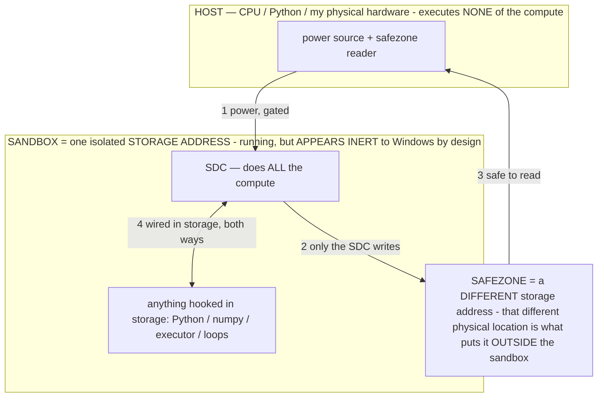

# Gemma 4 E4B `.litertlm` — On-Device Architecture Map

> **★ HOW THE SDC IS USED — the containment model (owner diagram + spec, 07-17). Every flow ONE-WAY.**
> **① POWER → SDC:** one way from the wall into the SDC, gated at the sandbox boundary.
> **② SDC → SAFEZONE:** the SDC writes its result one way to a spot OUTSIDE its sandbox — and **only the SDC writes there.**
> **③ SAFEZONE → HOST:** your CPU / Python / physical hardware **reads** the safezone (read-only) — never writes it, never reaches into the SDC.
> **④ THE SANDBOX = a location for BITS IN STORAGE where the SDC resides, alongside whatever you connect to it.** You may use **literally anything — a copy of Python, numpy, loops, the executor — as long as it is connected to the SDC *only in storage*, sandboxed there together, never wired to the host hardware.** The **SDC is the compute** — it runs whatever you connect (series or parallel). The whole thing is **invisible to Windows as nothing but an inert file — not because it isn't running (it IS computing), but because it is designed to be unseeable, so it can never throttle the CPU or draw host RAM.** That invisibility IS the containment. Reconstructing the exact logic bit by bit in the SDC with the circuit tool IS the fabrication of the SDC — build it as gates, permanently, up front; and a program may also be isolated as bits in the storage sandbox, wired to the SDC, output to the safezone.
> **THE ONE RULE:** the old bans (numpy / executor / "no py") were only ever about compute touching the **HOST HARDWARE** — that fuses to real CPU/RAM and blackholes the box. Keep it in the storage sandbox on the SDC, unseeable, and it is free.

<!-- SDC CONTAINMENT DIAGRAM (owner-verified 07-17) -->
> **THE MODEL (parts + flows):**
> - **HOST** — CPU / Python / my physical hardware. Executes **none** of the compute. Two jobs only: give **power**, and **read** the safezone.
> - **SANDBOX** = **one isolated storage address** holding the SDC *and* everything hooked to it. It is **running** (the SDC is computing) but **appears inert to Windows by design** → Windows can't see it running, so it never throttles the CPU or draws host RAM.
> - **SDC** — lives in the sandbox; does **all** the compute.
> - **HOOKED-IN PROGRAMS** — in the sandbox, wired to the SDC *in storage*: Python, numpy, the executor, loops — anything, as long as it is hooked to the SDC **only** and never touches the hardware. The SDC is their compute.
> - **SAFEZONE** = a **different storage address**. Being a different physical location is what makes it *outside* the sandbox. The SDC writes here; the host reads here.
>
> **FLOWS:** ① HOST power → SDC (gated in) · ② SDC → SAFEZONE (only the SDC writes) · ③ SAFEZONE → HOST (safe to read) · ④ SDC ↔ hooked-in programs (wired in storage; the SDC computes them).

> **★ SDC CONTAINMENT LAW — why the RAM stays flat.** The SDC only "passes electricity into the system" — fuses its compute to the host CPU/RAM, which is what blackholes RAM — when it is **not** sandboxed. Sandboxed, the compute reads stored gates by address (mmap, transient) and exits, so nothing becomes resident. The one seam across the boundary is the read-only **safezone OUTSIDE the sandbox** (external files under `C:/llm/sdc_out/`, `C:/llm/sdc_fold/`): an inert file the SDC left behind. Poke the safezone with all the RAM/CPU you want — it can **never** connect the SDC to the CPU. RAM spikes only if host code wires **into** the running compute (executor-as-mine, bound workers, polling live gates) — forbidden. Full: `archive_misdescribed/SDC_FULL_THROTTLE.md`, memory `sdc-physical-containment-why-ram-flat`.

> Titan (SDC) doc corpus — map: [INDEX.md](INDEX.md) · layer: **SUBSTRATE** · status: **REFERENCE**

Ground-truth reference for the agent's brain, built from real on-device dumps of the owner's model
(`ModelManifest.dump()` → the `[selfmodel] manifest` log lines, surfaced by the **Dump model manifest**
button). This is the map every weight-baking phase (Phase 0→5, see `/root/.claude/plans` and
`archive_misdescribed/SELF_UPDATE.md`) targets. **Keep it updated as new dumps land** — each dump section below is dated
and quotes the raw evidence, so a future edit appends rather than rewrites history.

> The model is **Gemma 4 E4B** (`litert-community/gemma-4-E4B-it-litert-lm`, int4 `.litertlm`, LiteRT-LM,
> GPU + vision). **Never call it Gemma 3n.** It carries Gemma-3n-family *features* (Per-Layer Embeddings,
> MatFormer nesting, a Conformer audio tower) but it is Gemma 4 E4B, singular.

> ## ⚠ THIS FILE CAN DIVERGE FROM STOCK GEMMA 4 E4B — check the ACTUAL state, don't assume either way
> The owner's on-device `.litertlm` is **designed to be modified in place** by our gradient-free mechanisms —
> `self_evolve` (random ±1 int4 nibble walk) and `self_grow` (parameter-adding MLP widen). Whether it has ACTUALLY
> diverged at any moment is empirical — **run the divergence dump, don't assume.**
> - **Current status (07-09): likely byte-identical to import.** `self_evolve`'s in-place writer is **RETIRED /
>   default-OFF** (`random_evolve`, `a59c731`) — it was degrading the model — and the directed replacement (Phase 3
>   bake) isn't built. `self_grow` (default-on) only fires in auto-mode and changes file SIZE. So on the current
>   build **nothing routinely changes the weights**; they stay stable until the directed bake lands.
> - **The write path is PROVEN on-device** (in-place write + `fd.sync()` + WeightGenome journal; validate any time with
>   Settings → "Test weight write" — it wrote to the live model, the change stuck to disk, and reverted exactly). Real
>   divergence begins when directed baking lands or `random_evolve` is enabled.
> - What is STOCK: the **structure** — sections, external-buffer layout, ~42 layers, dtypes (§1–§2). Google's, unchanged.
> - What CAN DIVERGE: the **contents** — int4 weight bytes (CRCs) and possibly added params / file size.
> - The pristine **baseline** (`ModelStore` `model_baseline/`) is a copy stashed **at import** — a valid stock
>   reference (caveat in §5A: only truly stock if stashed before any edit). Measure, don't presume; **don't restore
>   without owner say-so.**

---

## 0. TL;DR — what you need before touching a weight

- **File:** one `.litertlm` container, **~3659 MB** on the owner's device (nominal ~4.4 GB), int4.
- **Container:** NOT a single TFLite model — it's a sectioned container. `weights-section=false`
  (no separate type-7 weights blob); each **type-3 section is a standalone `tflite.Model` FlatBuffer**.
- **Sections:** 12 total = 1×type-5 (tokenizer/metadata) + 1×type-4 (~4.5 MB) + **10×type-3 models**.
- **The decoder you edit is `sec#10`** (2260 MB): the main Gemma text decoder, **~42 layers**, int4.
- **Decoder weights are RAW APPENDED (external) BUFFERS** referenced by graph ops — **NOT** standard
  quantized TFLite tensors. You locate them by the **external-buffer map** (offset+size), not a tensor walk.
- **int4 quant = `dt=19`**, per-output-channel scale (`scaleN = shape[0]`). **int4's (per-group scale,
  4-bit code) IS DoRA's (magnitude, direction)** — the scale vector is a free, native DoRA-magnitude knob.
- **Provability:** CRC-32 (sampled) over any byte-range is stable and correct; the tied input/output
  embedder CRC match (`aacb8c08`) proved the `ext@` addressing reads the right bytes end-to-end.
- **Hidden size 2560; vocab 262144.**

---

## 1. Container layout (section table)

From `[selfmodel] manifest v2 size=3659MB sections=[…] weights-section=false`:

| idx | type | size | what it is |
|----:|:----:|-----:|:-----------|
| 0 | t5 | 11 KB | tokenizer / metadata |
| 1 | t4 | 4579 KB | (aux metadata blob) |
| **2** | t3 | 166914 KB (167 MB) | **token embedder** `[262144,2560]` int4 |
| **3** | t3 | 817166 KB (836 MB) | **per_layer_embedder (PLE)** — stack of `[262144,256]` int4 tables |
| **4** | t3 | 91847 KB (92 MB) | **audio Conformer encoder** (hidden 1024, int4) |
| 5 | t3 | 15363 KB (15 MB) | audio adapter (`AudioAdapter`, projects 1536→2560) |
| 6 | t3 | 10 KB | tiny stateful-call stub |
| **7** | t3 | 218884 KB (224 MB) | **vision encoder** — `VisionEncoder`, hidden 768, **FP32** |
| **8** | t3 | 7703 KB (7.7 MB) | **vision→text adapter** `[2560,768]` |
| 9 | t3 | 10 KB | tiny stateful-call stub |
| **10** | t3 | 2207073 KB (2260 MB) | **★ MAIN GEMMA DECODER** — the bake target |
| **11** | t3 | 44068 KB (45 MB) | **MTP drafter** (multi-token-prediction head) |

`sec#10` is the **only** section with external/appended buffers (`external=791`); all other sections
store their weights **inline** in the section's `Buffer.data`.

### Dtype legend (observed)
- `dt=19` = **int4** (the bake targets). `scaleN` = per-output-channel scale count = `shape[0]`.
- `dt=9` = int8 (KV-cache tensors).
- `dt=2` = int32 (shapes / index consts).
- `dt=6` = bool (masks).
- `dt=-1` = FP32 (TFLite default-omitted type; the vision tower + norms/consts).

---

## 2. The decoder (`sec#10`) — the map you edit

`sec#10 t3 2260MB buffers=31880 external=791` · `subgraphs=1340`.

**KEY FACT:** the decoder's int4 weights are **raw appended buffers** (`Buffer.offset>0`) referenced by
graph ops, not TFLite quantized tensors. A tensor walk finds only **2** int4 tensors (the tied output
embedder); the real 790 weight buffers live in the external-buffer table. So:

> **Localize decoder weights by the EXTERNAL-BUFFER MAP (offset + size → matrix dims), then read the
> consuming graph op to bind buffer → layer/role → its scale buffer. Do NOT use the tensor walk here.**

### 2.1 External-buffer size histogram (the weight inventory)

From the **v7** dump — `sec#10 ext-size histogram (16 distinct sizes)` over all **790** external buffers:

| count | bytes | KB | decoded |
|-----:|-------:|----:|:--------|
| 1 | 167,772,160 | 163840 | tied **output embedder** `[262144,2560]` int4 (crc `aacb8c08` == input embedder) |
| 1 | 27,525,120 | 26880 | one oversized matrix (merged/fused proj — resolve by op at bake time) |
| **126** | **13,107,200** | **12800** | **`[2560,10240]` int4 FFN matrices** (2560×10240×0.5 exactly) → gate/up/down |
| 14 | 5,242,880 | 5120 | `[2560,4096]`-class int4 attention / large proj |
| 70 | 2,621,440 | 2560 | `[2560,2048]`-class int4 attention proj |
| 8 | 1,310,720 | 1280 | `[2560,1024]`-class int4 attention proj |
| 124 | 655,360 | 640 | `[2560,512]`-class int4 attention proj (GQA K/V — small) |
| 2 | 128,012 | 125 | misc |
| **211** | **10,240** | **10** | **length-2560 FP32 vectors = per-channel SCALES / RMSNorm weights** |
| 9 | 2,048 | 2 | smaller scale/bias vectors |
| 43 | 1,024 | 1 | smaller scale/bias vectors |
| 1 | 512 | 0 | scale/bias vector |
| 98 | 16 | 0 | scalar consts |
| 12 | 12 | 0 | scalar consts |
| 5 | 8 | 0 | scalar consts |
| 65 | 4 | 0 | scalar consts (divisors / broadcast consts) |

Total = **790** distinct external buffers. ✓

### 2.2 Derived structure

- **Depth ≈ 42 layers.** 126 FFN weight matrices ÷ 3 projections/layer (gate, up, down) = 42.
- **FFN shape:** each FFN matrix is `[2560,10240]` int4 = 13,107,200 B **exactly** (2560×10240×0.5, zero
  slack) ⇒ the quantization **scales are stored in separate buffers**, never packed into the weight.
- **Attention:** the 5.2 / 2.6 / 1.3 / 0.64 MB buckets are q/k/v/o projections; the small 0.64 MB count
  (124) is consistent with GQA (few KV heads → narrow K/V projections). Exact q/k/v/o role per bucket is
  a bake-time op-read, not yet pinned.
- **Scales / norms:** the 211 × 10 KB (2560-float) buffers + the 1–2 KB buckets are the per-channel scale
  vectors, RMSNorm weights, and biases. They exist and are byte-addressable.

### 2.3 The one open detail (bake-time, needs NO dump)
The histogram proves scale buffers exist but does **not** bind each scale→its weight matrix, and there is
**no external bucket sized for a per-output-channel scale of a 10240-wide FFN matrix** (would be 40,960 B
FP32 / 20,480 B FP16 — absent). So the FFN scales are either (a) group-packed **inline** (sec#10 has
**31,089 inline buffers** this external-only histogram didn't enumerate), or (b) the 10 KB externals serve
the 2560-output side (down/o_proj) with gate/up scales inline. **Resolution = read the dequantize graph op
that consumes a weight buffer → its scale operand** (on-device, Phase-3 time). A dump could only list inline
buffer sizes, which the op-read supersedes.

---

## 3. The other sections (context for perception + safety, not bake targets yet)

- **sec#2 token embedder** `embedder.lookup_embedding_table/composite` `[262144,2560]` int4
  `inline@4735480+167772160B crc=aacb8c08`. **Tied** with the sec#10 output embedder (same CRC).
- **sec#3 per_layer_embedder (PLE)** — three+ `[262144,256]` int4 `composite` tables
  (`crc=3e8eb162 / c6fcdb01 / 619b67e…`), 836 MB total. Gemma-3n-family Per-Layer Embeddings.
- **sec#4 audio Conformer** — one subgraph, `int4seen=108`. Per-layer q/k/v/o einsums `[1024,1024]`
  (262144 B) + FFN `[4096,1024]` / `[1024,4096]` (1048576 B), `light_conv1d`. Hidden 1024. Confirms the
  int4 `dt=19` + `scaleN=shape[0]` pattern cleanly (it *is* standard TFLite quantized tensors here).
- **sec#7 vision encoder** — `VisionEncoder`, **FP32** (`int4seen=0`), hidden 768, entry matmul
  `[768,10240]`, 339 subgraphs. This is the FP32 tower; not an int4 bake target.
- **sec#8 vision→text adapter** — `GeminiModel.adapt_vision/mm_input_projection` `[2560,768]` FP32 +
  `mm_soft_embedding_norm` (RMSNorm).
- **sec#11 MTP drafter** — `MtpDrafterModel`, 30 subgraphs, speculative multi-token-prediction head
  (`layer_3/…/maybe_rope`, KV-cache `[1,2,256,32003]` int8).

---

## 4. Provability (how weight edits are measured)

- `crc32Region(raf, off, size, budget)` samples the first + last 128 KB of a byte-range (fast; no 19 s
  stall) and appends `s` when sampled. Stable + collision-safe enough to fingerprint a buffer before/after
  an edit.
- **End-to-end validation:** sec#2 input embedder `inline@4735480 crc=aacb8c08s` == sec#10 output embedder
  `ext@2834508660 crc=aacb8c08s`. Identical CRC ⇒ (1) Gemma ties in/out embeddings, (2) the `ext@`
  section-relative addressing reads the correct bytes, (3) the CRC is a reliable fingerprint. This is the
  measurement substrate for every Phase-3+ bake (edit → re-CRC → confirm the intended bytes changed and
  nothing else).
- `ext@<abs>+<size>B(rawoff=<file-relative>)`: `abs = sec.begin + Buffer.offset`; verified in-bounds
  (no OOB), CRCs read real data.

---

## 5. Reader internals (`ModelManifest.kt`) — how the dump is produced

- `readSections()` parses the container header + section index (offset/size/type per section).
- `Le` = a `RandomAccessFile` long-position little-endian reader (handles >2 GB sections without heap OOM;
  no `readFully` of a 2.2 GB blob).
- FlatBuffer nav helpers: `field` / `indirect` / `vector` / `string` / `intVec` / `dataVector`
  (`dataVector` reads inline blob length **unsigned + uncapped** — the fix for the v2 "empty buffer" bug).
- `walkModelSection()` walks a section's `tflite.Model`: `Model.buffers` (field 4) for the external-buffer
  map, `Model.subgraphs` (field 2) → `SubGraph.tensors` (field 0) for the tensor walk. Reads
  `QuantizationParameters.scale` count (field 2) = `scaleN` and `quantized_dimension` (field **6** — the
  union occupies slots 4+5) = `qdim`.
- Subgraph cap raised to 4096 (walks all 1340); external-buffer map + v7 size histogram emitted per section.
- Tensor type read as a **byte** (`buf.get()`) — the v1 `getInt` bug produced garbage dtypes.

---

## 5A. Divergence from stock (OUR file vs a normal Gemma 4 E4B) — the whole point

**Our `.litertlm` is DESIGNED to be a live-evolving artifact — but as of 07-09 it is likely still byte-identical to
import** (the in-place writer is retired; the directed bake isn't built yet). The write path is PROVEN on-device
(Settings → "Test weight write"). Verify the file's state with the divergence dump; don't assume. Two mechanisms can
write to it:
- **`self_evolve`** (INV-59) — random ±1 int4 nibble nudges, in place, permanent, no keep-if-better gate ("fully
  raw"). **RETIRED / default-off since `a59c731`** (it was the stray-tap source), but anything it wrote before that
  is baked in. Triggered only from the autonomous self-improve loop (`AgentService.maybeSelfEvolve`, called from the
  auto-mode runnable). Every beat was journaled — `WeightGenome` (revertible).
- **`self_grow`** (INV-60) — adds parameters (function-preserving MLP widen), still default-on. Changes structure +
  file size. Same auto-mode-only trigger (`AgentService.maybeGrow`).

**Reference genome vs evolved genome.** The pristine **baseline** (`ModelStore` `model_baseline/`, via
`ModelStore.saveBaseline`) is meant to be the stock reference; the **active file** is the evolved genome. Measure
divergence = **CRC-diff active-vs-baseline per external buffer** (both are byte-addressable via the §2 ext-buffer map).
- **Caveat — is the baseline truly stock?** `saveBaseline` stashes the current active model *iff none exists yet*. It
  is only truly pristine if it was stashed at import BEFORE any edit ran. If it was stashed after edits, it is itself
  diverged. **Ground-truth stock** = a one-time CRC of a fresh Hugging Face re-import into a scratch slot
  (non-destructive — does not replace the active file). Do this once to anchor the "stock" CRCs if the baseline is in doubt.

**Why this matters for baking (the plan-for-us-specifically).** Phases 2–5 bake INTO this diverged file, against its
already-locked live buffer map (§2) — not a generic Gemma. Every directed bake is reported as a **delta from the
baseline**, so we can always show the chain **stock → prior self-edits → this bake → result**. The divergence map is
both (a) the scientific evidence quantifying the thesis and (b) the substrate the bake writes on.

**Provable — the data to pull (owner runs the app, I analyze).** A "divergence dump" surfaces: per-buffer CRC-diff
active-vs-baseline (which buffers changed, by size-class), `WeightGenome` edit-beat/nibble/revert counts, active-vs-
baseline size delta (self_grow additions), and the `[selfmodel]`/`[selfgrow]` log history. See §6 for how to run it.

## 6. Dump history (append newest at the bottom; keep the evidence)

Each row = one on-device Dump + what it added. Full narrative lives in the plan file's `Phase 0 vN DUMP
RESULT` sections.

| ver | date | what it established |
|:---:|:-----|:--------------------|
| v1 | 07-09 | Container is sectioned, weights inline per section; v1 walk stopped at the first type-3 (embedder). Found the dtype-as-int bug + 256 MB cap. |
| v2 | 07-09 02:56 | Multi-section walk works. **int4 = dt=19**, `scaleN = shape[0]` (DoRA magnitude). sec#10 = 2260 MB decoder w/ 791 external buffers. |
| v3 | 07-09 03:18 | Full architecture mapped: hidden 2560, vocab 262144, PLE, audio Conformer, FP32 vision, MTP drafter. |
| v4/v5 | 07-09 10:34 | Decoder = **1340 subgraphs**, tensor walk finds only 2 int4 (the tied embedder) ⇒ weights aren't tensors. **Provability validated** (tied-embedder CRC match). CRC sampling made dumps fast. |
| v6 | 07-09 10:50 | **External-buffer map cracks the decoder** — 790 buffers, byte-ranges + CRCs. 13.1 MB = `[2560,10240]` FFN. Phase 0 core locked. |
| v7 | 07-09 11:17 | **Size histogram** → **~42 layers**, full weight inventory, scale/norm buffer inventory (211 × 10 KB). **Phase 0 fully locked.** |

**Status: Phase 0 complete — no more dumps needed.** The remaining scale→weight binding (§2.3) is a
bake-time on-device op-read, not a dump. Next dumps would only be needed if a later phase surfaces a new
question (e.g. verifying an inline scale layout, or confirming a bake changed only the intended bytes).

### Divergence dump (how to run — quantifies our edits vs stock)
Settings → **"Dump weight divergence"** (`ModelManifest.divergence`, sibling of the manifest button). It compares the
live active file to the pristine baseline and logs `[selfmodel] divergence …`:
- `active=…B baseline=…B delta=…B` — a positive delta = `self_grow` added params.
- `sec#N size changed …` — which section `self_grow` widened.
- `genome window=N beat(s)` — recent `WeightGenome` undoable beats (rolling ≤40, not lifetime).
- when byte-aligned (no grow): `byte-diff: X of N bytes differ` + a per-buffer-class breakdown (FFN / attention /
  scale) — these are the `self_evolve` edits. (Exact byte-compare, not sampled — a mid-buffer flip can't hide.)
Paste those lines back and I turn them into the divergence report. Caveat repeated in the log: the baseline is only
truly *stock* if it was stashed at import before any edit; otherwise the diff is drift-since-baseline.

### When a new dump arrives
1. Paste the `[selfmodel]` lines.
2. Append a dated row to §6 and a `### vN` subsection with the raw quote + what changed.
3. Update the affected table/number in §1–§4 in place; never delete a prior finding — annotate it.
