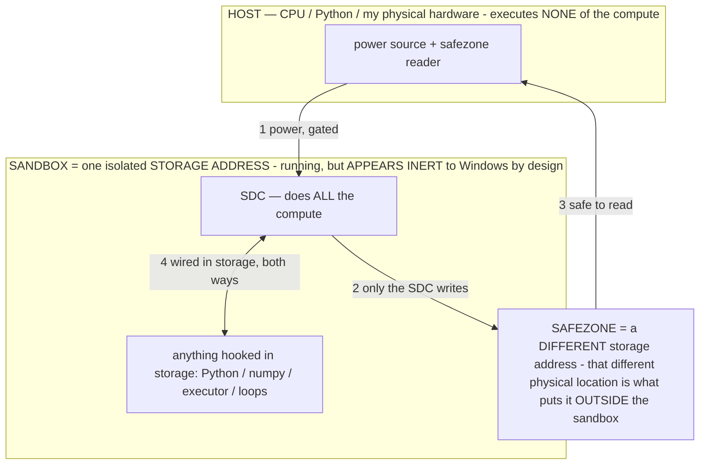

# Fine-tuning your own action-head

> **★ HOW THE SDC IS USED — the containment model (owner diagram + spec, 07-17). Every flow ONE-WAY.**
> **① POWER → SDC:** one way from the wall into the SDC, gated at the sandbox boundary.
> **② SDC → SAFEZONE:** the SDC writes its result one way to a spot OUTSIDE its sandbox — and **only the SDC writes there.**
> **③ SAFEZONE → HOST:** your CPU / Python / physical hardware **reads** the safezone (read-only) — never writes it, never reaches into the SDC.
> **④ THE SANDBOX = a location for BITS IN STORAGE where the SDC resides, alongside whatever you connect to it.** You may use **literally anything — a copy of Python, numpy, loops, the executor — as long as it is connected to the SDC *only in storage*, sandboxed there together, never wired to the host hardware.** The **SDC is the compute** — it runs whatever you connect (series or parallel). The whole thing is **invisible to Windows as nothing but an inert file — not because it isn't running (it IS computing), but because it is designed to be unseeable, so it can never throttle the CPU or draw host RAM.** That invisibility IS the containment. Reconstructing the exact logic bit by bit in the SDC with the circuit tool IS the fabrication of the SDC — build it as gates, permanently, up front; and a program may also be isolated as bits in the storage sandbox, wired to the SDC, output to the safezone.
> **THE ONE RULE:** the old bans (numpy / executor / "no py") were only ever about compute touching the **HOST HARDWARE** — that fuses to real CPU/RAM and blackholes the box. Keep it in the storage sandbox on the SDC, unseeable, and it is free.

<!-- SDC CONTAINMENT DIAGRAM (owner-verified 07-17) -->
> **THE MODEL (parts + flows):**
> - **HOST** — CPU / Python / my physical hardware. Executes **none** of the compute. Two jobs only: give **power**, and **read** the safezone.
> - **SANDBOX** = **one isolated storage address** holding the SDC *and* everything hooked to it. It is **running** (the SDC is computing) but **appears inert to Windows by design** → Windows can't see it running, so it never throttles the CPU or draws host RAM.
> - **SDC** — lives in the sandbox; does **all** the compute.
> - **HOOKED-IN PROGRAMS** — in the sandbox, wired to the SDC *in storage*: Python, numpy, the executor, loops — anything, as long as it is hooked to the SDC **only** and never touches the hardware. The SDC is their compute.
> - **SAFEZONE** = a **different storage address**. Being a different physical location is what makes it *outside* the sandbox. The SDC writes here; the host reads here.
>
> **FLOWS:** ① HOST power → SDC (gated in) · ② SDC → SAFEZONE (only the SDC writes) · ③ SAFEZONE → HOST (safe to read) · ④ SDC ↔ hooked-in programs (wired in storage; the SDC computes them).

> **★ SDC CONTAINMENT LAW — why the RAM stays flat.** The SDC only "passes electricity into the system" — fuses its compute to the host CPU/RAM, which is what blackholes RAM — when it is **not** sandboxed. Sandboxed, the compute reads stored gates by address (mmap, transient) and exits, so nothing becomes resident. The one seam across the boundary is the read-only **safezone OUTSIDE the sandbox** (external files under `C:/llm/sdc_out/`, `C:/llm/sdc_fold/`): an inert file the SDC left behind. Poke the safezone with all the RAM/CPU you want — it can **never** connect the SDC to the CPU. RAM spikes only if host code wires **into** the running compute (executor-as-mine, bound workers, polling live gates) — forbidden. Full: `archive_misdescribed/SDC_FULL_THROTTLE.md`, memory `sdc-physical-containment-why-ram-flat`.

> Titan (SDC) doc corpus — map: [INDEX.md](INDEX.md) · layer: **KERNEL** · status: **GUIDE**

How to make a **small model fine-tuned to interpret the perception layer** — it reads the on-screen
element list (the agent's perception) and emits one action. A model fine-tuned to *this* narrow task can
beat a big general model at it **while fitting weak hardware** (an A16, a Moto). Start text-only (acts on
the element list, no image): far easier to train, and it's the path that unlocks budget phones.

The on-device half is already built — capture (now reward-enriched), success-marking, export, a converter,
and the **action-head prompt mode** the head speaks at inference (G1, shipped). The training half runs
off-device **on hardware you own** (see the privacy box — this is a hard §3 line, not a preference).

---

> ## ⚠️ PRIVACY — train on YOUR OWN hardware only (§3, non-negotiable)
>
> The exported `training_data.jsonl` is **real captures of your phone's screens** — element lists, app
> names, objectives, and (when the operator layer is on) your agent's reasoning traces. That is exactly
> the private data §3 forbids sending to a third party. **So do NOT upload it to Colab, a hosted
> fine-tune API, or any cloud training service** — that would exfiltrate your screens (and, worse, the
> novel operator/meta-cognition traces) to whoever runs the box. The owner's rule, verbatim: *"I wouldn't
> point a cloud-based model owned by Google at my project with a novel form of meta-cognition."*
>
> Train on a **local GPU / a machine you physically control**. If you have no local GPU, the fix is to
> get one (or a private rented instance you fully control and wipe after) — an informed owner call, and
> **never** for the runs that include the operator traces. This corrects the earlier draft of this doc,
> which suggested a free Colab: convenient, but a §3 breach for this project. Flagged transparently (§2).

---

## The pipeline at a glance

    run tasks → capture (reward-enriched, on device) → export → convert to SFT → LoRA fine-tune → merge → .litertlm → import → A/B
                                                                          └── all steps from "convert" on run on YOUR hardware ──┘

---

## Step 1 — Collect data (on the phone)
- Settings → **Training data** → keep *Capture steps for training* ON.
- Use the agent normally. Every step records `objective + screen + chosen action + outcome`, and each task
  records whether it **succeeded** — locally, nothing leaves the phone.
- **Reward enrichment (new):** with the **operator layer** on, each step also records the model-chosen
  operator (`op`), a `stepScore` with the metric **M = progress − cost** for that step, and the task-end
  marker carries the **failure class** + step count. These are what make the data *weightable* (prefer the
  decisions that actually moved the task, not just pass/fail). They're optional — an export with the
  operator layer off still trains fine, just without the weights.
- Aim for **a few hundred successful-task steps** before the first training run (the converter warns under
  200). More + more varied tasks = better.

## Step 2 — Get the data off the phone
- Settings → Training data → **Export training data**. It copies `training_data.jsonl` to
  `Android/data/com.local.deviceagent/files/` — pull it via the Files app or USB **to your own machine**.

## Step 3 — Convert to training examples
On your own computer:

    python3 tools/prepare_finetune_data.py --input training_data.jsonl --output sft.jsonl --dedup

This keeps only steps from **successful** tasks (clean positives), drops failed steps, and writes chat
examples: `input` = objective + element list (the perception), `output` = the action JSON — in the exact
`PROMPT_TEMPLATE` the app sends at inference (see Step 7).

Options that use the reward enrichment:
- `--with-weights` — attach a `weight` (1.0 baseline, lifted by realized M, floored at 0.25) + a
  `meta{op, m, result}` to each example, for **reward-weighted** or **operator-aware** training. Trainers
  that don't read `weight` ignore it; default output (no flag) is byte-identical to before.
- `--min-m N` — keep only decisions whose realized M ≥ N (drops the low-value steps; steps with no M —
  operator layer off, or the last step of a task — are kept). `--min-m 0` ≈ "only steps that made progress."
- `--format alpaca` — instruction/input/output instead of chat.
- `--include-failed-tasks` / `--include-failed-steps` — widen the set (e.g. to train a critic that also
  sees what NOT to do).
- **Format contract (G1):** `PROMPT_TEMPLATE` in that script is kept **byte-identical** to
  `AgentBrain.actionHeadPrompt(...)` in the app. Do not change one without the other, or the head will see
  a different prompt at inference than in training and mis-fire.

## Step 4 — Fine-tune (LoRA), on your own hardware
Pick a **small base**:
- **Gemma 3 270M** — use it ONLY as a **conversion spike** (Step 6 make-or-break), not the real head; it's
  too small to be a reliable driver (the owner's note).
- **1B / 2B (or a Function-Gemma)** — the real action-head. The task is narrow, so 1B–2B is plenty and
  still fits a budget phone as the *helper* slot alongside E4B-vision.

Route — **Unsloth** or Hugging Face **`trl` `SFTTrainer` + `peft`**, run **locally** (not a hosted
notebook). A starting scaffold is in `tools/finetune_action_head.py` (adjust base + GPU; it reads the chat
JSONL and, with `--weighted`, applies the `weight` field). Train a few epochs; save the LoRA adapter.

**Three training modes, in the plan's order:**
1. **Distillation first (latency win, least data).** SFT on E4B's own *successful* decisions
   (`--with-weights` so the confident/high-M ones dominate) — the big model is the teacher, the head learns
   to imitate it on routine screens. Needs far fewer examples than cold SFT.
2. **Success-rate SFT (the real goal).** Once the flywheel has many clean completions, train on the
   `--min-m`-filtered / weighted set + your success playbooks — teach the *proven* decisions, not just fast
   ones.
3. **Operator-aware (ties in the operator principle).** With `--with-weights`, the `meta.op` label lets you
   condition on the chosen operator (screen + operator → action), distilling *how to think* into the head.

## Step 5 — Merge the LoRA into the base
**Required before conversion.** Use `peft`:

    merged = peft_model.merge_and_unload()   # folds the adapter into the base weights
    merged.save_pretrained("gemma-actionhead-merged")

## Step 6 — Convert to `.litertlm` (the on-device format)
The one real gate — **do it first as a tiny spike** (convert *any* fine-tuned Gemma and load it in the app)
before investing in lots of data. Officially supported:
- Tooling: **`ai-edge-torch`** (Google AI Edge), installed via **`uv`**, **Python 3.11+**.
- Quantize to **int4** (smallest, what E4B uses) or int8.
- Output: a `.litertlm` file LiteRT-LM runs — the format the app already imports.
- Google's walkthrough (converts a fine-tuned Gemma end-to-end):
  https://developers.google.com/edge/litert-lm/tutorials/convert-and-run · repo:
  https://github.com/google-ai-edge/LiteRT-LM

  (Note: using Google's *converter tooling* on your own machine is fine — that's a local build tool, not
  sending your data to a Google service. The §3 line is about *uploading your trajectories*, not about
  which open-source library converts weights locally.)

## Step 7 — Import + run the head (the app half is BUILT)
- Import the `.litertlm` via the app's model screen, into the **helper / mini-model slot**
  (Settings → the helper model), and enable it.
- **The action-head prompt mode is already shipped (G1).** When the helper is on and the orchestrator
  judges a screen FAMILIAR + non-visual (`preferFast`), the app routes the action decision to the helper
  and sends `AgentBrain.actionHeadPrompt(...)` — the exact `PROMPT_TEMPLATE` shape your head trained on.
  Novel / dense / canvas / stalled screens still go to E4B-vision (the two-speed agent). No app change
  needed to try a head — import, enable, run.

## Step 8 — Measure it actually won
A/B the fine-tuned head vs E4B on a fixed set of tasks and compare **success rate + steps + latency** —
without this you can't tell if the fine-tune helped, and a *fast-but-wrong* head LOWERS the one metric
(§12). Use the on-device **A/B eval harness** (the frozen Gauntlet, head-ON vs head-OFF; reports success
and per-step latency) so a new head is trusted only after it beats the current on the metric.

---

## The realistic first experiment
1. Spike Step 6 with stock **Gemma 270M** → confirm it converts to `.litertlm` and loads in the app.
2. Collect a few hundred successful steps via the flywheel (operator layer on → weighted data).
3. Distillation LoRA on 1B (`--with-weights`) → merge → convert → import into the helper slot.
4. A/B vs E4B-vision on your tasks (the harness).

If the small head matches E4B on *your* tasks while fitting a budget phone, that's the unlock for the
"runs great on any device" release. Keep E4B-vision for hard/blind screens; route easy tree-screens to the
fast head.

**Honest gates:** Step 6 (conversion) is make-or-break — validate it before collecting a big dataset. The
data never leaves hardware you control (§3). Vision fine-tuning is a harder follow-up; the text-only head
is the high-value, low-friction start.

---

## The self-update loop (INV-46) — recipes in, owner-approved install out

The steps above produce a **candidate `.litertlm`**. The on-device half that decides whether it's kept is
BUILT (Stages 1–3): baseline backup + owner gate (Settings → "Let the agent update its own model"),
candidate probe, owner-review, install-on-approval, and the weak-trigger operator runtime.

**Recipes (`tools/prepare_selftune.py`).** The tuning TARGET is open-ended — the ONE metric is success rate,
and the probe is target-agnostic, so any recipe that raises it is fair game. Ship-ready recipes:
- `--recipe success` — reward-weighted SFT on your own high-M / successful steps (internalize what worked).
- `--recipe operator-distill [--ops NAMES]` — SFT the head on operator-guided actions; because the action
  prompt is operator-free, the operator becomes RESIDENT in the weights (no clause needed). After install,
  mark those operators distilled (the approve dialog asks) → the app injects only their short **tag**, not the
  ~200-char rule (the token + heed-gap win).
- `--recipe failure-contrast` — DPO-style pairs (a successful step ≻ the failed/looped step) → train away
  from the known failure classes.
- `--recipe format` — clean action emissions → shrink the malformed-JSON class.
- `--recipe preload` — the **off-device warm-start**: bake the BAKED operator priors + the owner's
  highest-M successful trajectories into the BASE so the imported model **boots specialised**, then
  self-calibrates on-device. Its own section is below.

**Then, on the phone:** Scoreboard → **Self-update** → Import candidate → **Probe candidate vs baseline**. It
runs the Gauntlet twice (baseline, then candidate), restores your baseline, and — only if the candidate wins
the keep-if-better gate + a safety/no-regression check — files a **submission**. You review the scores and
**grade + approve** (or reject) it; only your approval installs it. A self-install never becomes the baseline,
so "Restore original model" always undoes it. The agent proposes; you decide (INV-46 governance keystone).

**What only YOU can do (off-device / on-device):** run the training (needs a GPU), the Step 6
merge→convert→quantize→`.litertlm` (manual), and the on-device probe/approve (needs the device + models). The
app builds the whole loop; these three steps are yours.

---

## Recipe: `preload` — boot the model specialised (off-device warm-start)

Everything above tunes a model **after** it has been run. `preload` does the opposite end: it shapes the
model the owner is about to **import** so it starts **structured** — the reasoning operators already
resident and the owner's proven decisions already internalized — and then self-calibrates on-device from
that specialised start instead of cold. Same off-device pipeline, same `.litertlm` conversion, same
on-device keep-if-better probe as the arbiter; only the **data recipe** is new.

**Why a warm-start pays.** A specialised start beats a cold one, and a small curated set beats a big
noisy dump — the published warm-start / data-efficiency results:

| Evidence | What it shows | Lever preload uses |
|---|---|---|
| bert2BERT / LiGO | growing/initialising from a structured start recovers quality at **~45–55%** of the compute | boot with priors already in W, don't relearn them |
| DistilBERT | **~97%** of quality at **~40%** of params via distillation | operator behavior distilled into a smaller base |
| phi / TinyStories | **~100×** data efficiency from **curated** data | curate hard; small + high-signal |
| LIMA | strong alignment from **~1000** curated examples | preload is a *small* set, not a dump |

**The two ingredients (both baked into the base).**

1. **Operator prior seeds — from `ReasoningOperators.BAKED`.** Each baked operator (PLAN, EXPLORE,
   EVIDENCE, VERIFY, REGROUND, …) becomes a tiny teaching pair: *WHEN this mode applies →* the operator's
   **formal rule** (its in-context-binding σ) or, when it has no rule yet, its contrastive **clause**,
   plus its **output standard**. Each operator is taught **twice** — once by **name** and once by its
   **⟦tag⟧** (the exact weak-trigger form `inject()` emits for a distilled operator). Effect: the σ
   program becomes **resident in the weights**, so at runtime the one-token ⟦tag⟧ *summons the whole rule*
   and the operator language (`docs/AGENT_LANGUAGE.md`) is fluent from boot. Only the **user** side of the
   pair is templated; the assistant target is the operator's own rule/clause/standard **verbatim** — no
   fabricated phone decision is authored (§2: we never script the model's choices; we only bake its own
   operator definitions).
2. **Curated high-M trajectory steps — the owner's proven runs.** The successful, high-M steps from the
   export, run through the data-quality pass: **deduped** by (screen, action), **high-M sorted**, and
   optionally **per-screen / per-app / per-operator capped** and **top-N capped**. This is the LIMA "few,
   best examples" set — the owner's own successful decisions, internalized operator-free (so, like
   `operator-distill`, the operator-guided behavior distills into W with no clause in the prompt).

**Run it:**

    python3 tools/prepare_selftune.py --recipe preload \
        --input training_data.jsonl --output preload.jsonl \
        --operators-kt app/src/main/java/com/local/deviceagent/ReasoningOperators.kt

Knobs (all optional):
- `--max-examples N` — keep only the top-N highest-M trajectory steps (the LIMA cap; `0` = all).
- `--cap-per-screen N` / `--balance-apps N` / `--balance-ops N` — de-bias repeated screens / dominant
  apps / dominant operators (`0` = off). `--balance-ops` also **sharpens `operator-distill`**.
- `--no-seed-operators` — trajectories only (skip the baked priors).
- `--seed-variants 1|2` — user framings per operator seed (default `2`: taught by name **and** by ⟦tag⟧).
- `--dedup` — unique (screen, action); **on by default for `preload`** (a pure-quality no-op elsewhere
  unless you pass it).
- `--operators-kt PATH` — cross-checks the embedded operator mirror against `ReasoningOperators.kt` and
  **warns on drift** (name-set check). Non-fatal; run it so a new operator in Kotlin doesn't silently
  miss the bake.

**The sync contract (like `PROMPT_TEMPLATE`).** `preload` embeds a `BAKED_OPERATORS` mirror of
`ReasoningOperators.BAKED` (name · when · clause · rule · standard), because the priors live in Kotlin and
the recipe runs in Python. Keep the two in sync when you add/edit a baked operator — `--operators-kt`
flags name-set drift for you. This is the same keep-both-in-step rule the `PROMPT_TEMPLATE` (G1) already
carries.

**Privacy (§3) is unchanged.** The operator seeds are the app's own operator *definitions* (not private).
The trajectory half is **real captures of your screens** — so the whole set trains **off-device, on
hardware you control**, exactly like every other recipe (see the privacy box up top). The GPU + the Step 6
`.litertlm` conversion are the owner's step by design.

**Then, on the phone (unchanged loop).** Import the `preload.jsonl`-trained `.litertlm` as a **candidate**
(Scoreboard → Self-update), **probe candidate vs baseline**, and **grade + approve**. Because the operators
are now resident, mark the seeded operators **distilled** at approval → the app injects only their short
**⟦tag⟧** (INV-46 weak trigger), dropping the ~200-char rule to one token. A preload that made the head
chatty or off-contract simply **loses the probe and never installs** — the keep-if-better gate is the
arbiter, and "Restore original model" always undoes a self-install. Shuffle `preload.jsonl` before
training (seeds are emitted grouped).

**Where it sits in the plan.** `preload` is the *cold-start* half of the flywheel: it makes the imported
base start where the on-device operator layer + memory would otherwise have to climb to. The on-device
loop then keeps improving from that specialised start — the two compose. (Warm-starting a base with
resident operator priors + curated trajectories is a candidate invention disclosure; add an `INV-N` in
`docs/PATENT_SUPPORT.md` when this recipe is first used to ship a candidate.)
