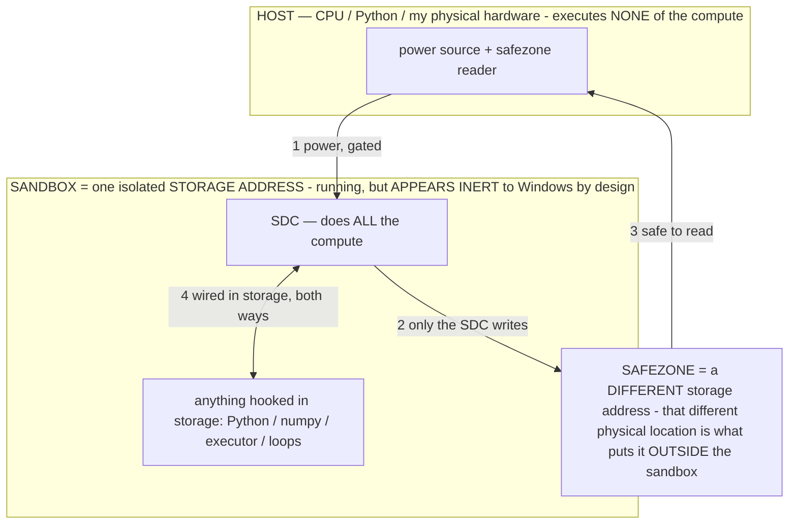

# Model setup (one-time)

> **★ HOW THE SDC IS USED — the containment model (owner diagram + spec, 07-17). Every flow ONE-WAY.**
> **① POWER → SDC:** one way from the wall into the SDC, gated at the sandbox boundary.
> **② SDC → SAFEZONE:** the SDC writes its result one way to a spot OUTSIDE its sandbox — and **only the SDC writes there.**
> **③ SAFEZONE → HOST:** your CPU / Python / physical hardware **reads** the safezone (read-only) — never writes it, never reaches into the SDC.
> **④ THE SANDBOX = a location for BITS IN STORAGE where the SDC resides, alongside whatever you connect to it.** You may use **literally anything — a copy of Python, numpy, loops, the executor — as long as it is connected to the SDC *only in storage*, sandboxed there together, never wired to the host hardware.** The **SDC is the compute** — it runs whatever you connect (series or parallel). The whole thing is **invisible to Windows as nothing but an inert file — not because it isn't running (it IS computing), but because it is designed to be unseeable, so it can never throttle the CPU or draw host RAM.** That invisibility IS the containment. Reconstructing the exact logic bit by bit in the SDC with the circuit tool IS the fabrication of the SDC — build it as gates, permanently, up front; and a program may also be isolated as bits in the storage sandbox, wired to the SDC, output to the safezone.
> **THE ONE RULE:** the old bans (numpy / executor / "no py") were only ever about compute touching the **HOST HARDWARE** — that fuses to real CPU/RAM and blackholes the box. Keep it in the storage sandbox on the SDC, unseeable, and it is free.

<!-- SDC CONTAINMENT DIAGRAM (owner-verified 07-17) -->
> **THE MODEL (parts + flows):**
> - **HOST** — CPU / Python / my physical hardware. Executes **none** of the compute. Two jobs only: give **power**, and **read** the safezone.
> - **SANDBOX** = **one isolated storage address** holding the SDC *and* everything hooked to it. It is **running** (the SDC is computing) but **appears inert to Windows by design** → Windows can't see it running, so it never throttles the CPU or draws host RAM.
> - **SDC** — lives in the sandbox; does **all** the compute.
> - **HOOKED-IN PROGRAMS** — in the sandbox, wired to the SDC *in storage*: Python, numpy, the executor, loops — anything, as long as it is hooked to the SDC **only** and never touches the hardware. The SDC is their compute.
> - **SAFEZONE** = a **different storage address**. Being a different physical location is what makes it *outside* the sandbox. The SDC writes here; the host reads here.
>
> **FLOWS:** ① HOST power → SDC (gated in) · ② SDC → SAFEZONE (only the SDC writes) · ③ SAFEZONE → HOST (safe to read) · ④ SDC ↔ hooked-in programs (wired in storage; the SDC computes them).

> **★ SDC CONTAINMENT LAW — why the RAM stays flat.** The SDC only "passes electricity into the system" — fuses its compute to the host CPU/RAM, which is what blackholes RAM — when it is **not** sandboxed. Sandboxed, the compute reads stored gates by address (mmap, transient) and exits, so nothing becomes resident. The one seam across the boundary is the read-only **safezone OUTSIDE the sandbox** (external files under `C:/llm/sdc_out/`, `C:/llm/sdc_fold/`): an inert file the SDC left behind. Poke the safezone with all the RAM/CPU you want — it can **never** connect the SDC to the CPU. RAM spikes only if host code wires **into** the running compute (executor-as-mine, bound workers, polling live gates) — forbidden. Full: `archive_misdescribed/SDC_FULL_THROTTLE.md`, memory `sdc-physical-containment-why-ram-flat`.

> Titan (SDC) doc corpus — map: [INDEX.md](INDEX.md) · layer: **KERNEL** · status: **GUIDE**

The agent's "brain" is an on-device vision model - **Gemma 4 E2B** (LiteRT-LM
format). It runs **fully offline** after a one-time ~3-4 GB download. Use **Wi-Fi**.

## Get the model and import it

1. In a browser (phone or PC), create a **free Hugging Face account** and sign in:
   https://huggingface.co/join
2. Open the Gemma 4 E2B LiteRT page and tap **"Agree and access repository"** to
   accept Google's Gemma license (instant):
   https://huggingface.co/litert-community/gemma-4-E2B-it-litert-lm
3. Open the **Files** tab and download the plain **`.litertlm`** file
   (e.g. `gemma-4-E2B-it-int4.litertlm`) to your **Downloads**.
   - Do NOT pick a `.mediatek...` file (that's for MediaTek chips; your Fold is
     Snapdragon) or a `-Web` file (browsers only). Only the plain `.litertlm`.
4. In Local Device Agent, tap **Import model file**, pick it from Downloads, and
   wait for the copy to finish -> "Model ready".

(Optional) To confirm your phone can run Gemma before downloading, install
**Google AI Edge Gallery** (Play Store, or https://github.com/google-ai-edge/gallery)
and try Gemma 4 E2B there.

## Notes
- After import, no internet is needed for the agent to think.
- The model and your screen never leave the device.
- The file stays in the app's private storage; you can delete the Downloads copy.
- The in-app "Download model (automatic)" button is usually blocked by the Gemma
  license gate - use the Import steps above instead.
- All Gemma 4 sizes accept images (vision); the agent sends a screenshot each step.
- Switching to a lighter or non-local model is a planned option (see README).
