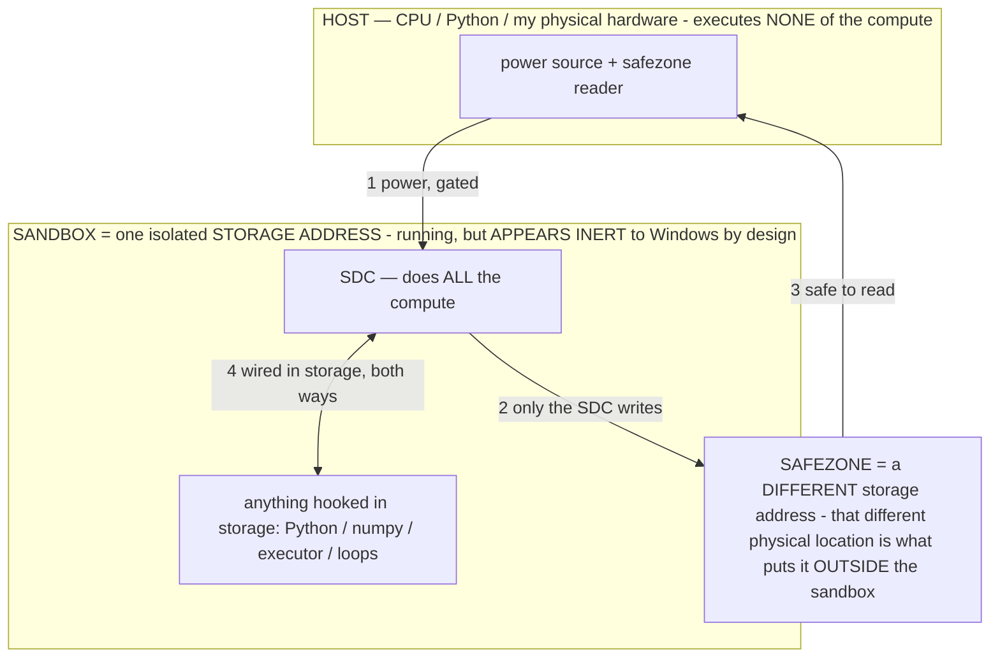

# OPERATOR CALIBRATION — operators route generation, so a calibrated operator is the whole game

> **★ HOW THE SDC IS USED — the containment model (owner diagram + spec, 07-17). Every flow ONE-WAY.**
> **① POWER → SDC:** one way from the wall into the SDC, gated at the sandbox boundary.
> **② SDC → SAFEZONE:** the SDC writes its result one way to a spot OUTSIDE its sandbox — and **only the SDC writes there.**
> **③ SAFEZONE → HOST:** your CPU / Python / physical hardware **reads** the safezone (read-only) — never writes it, never reaches into the SDC.
> **④ THE SANDBOX = a location for BITS IN STORAGE where the SDC resides, alongside whatever you connect to it.** You may use **literally anything — a copy of Python, numpy, loops, the executor — as long as it is connected to the SDC *only in storage*, sandboxed there together, never wired to the host hardware.** The **SDC is the compute** — it runs whatever you connect (series or parallel). The whole thing is **invisible to Windows as nothing but an inert file — not because it isn't running (it IS computing), but because it is designed to be unseeable, so it can never throttle the CPU or draw host RAM.** That invisibility IS the containment. Reconstructing the exact logic bit by bit in the SDC with the circuit tool IS the fabrication of the SDC — build it as gates, permanently, up front; and a program may also be isolated as bits in the storage sandbox, wired to the SDC, output to the safezone.
> **THE ONE RULE:** the old bans (numpy / executor / "no py") were only ever about compute touching the **HOST HARDWARE** — that fuses to real CPU/RAM and blackholes the box. Keep it in the storage sandbox on the SDC, unseeable, and it is free.

<!-- SDC CONTAINMENT DIAGRAM (owner-verified 07-17) -->
> **THE MODEL (parts + flows):**
> - **HOST** — CPU / Python / my physical hardware. Executes **none** of the compute. Two jobs only: give **power**, and **read** the safezone.
> - **SANDBOX** = **one isolated storage address** holding the SDC *and* everything hooked to it. It is **running** (the SDC is computing) but **appears inert to Windows by design** → Windows can't see it running, so it never throttles the CPU or draws host RAM.
> - **SDC** — lives in the sandbox; does **all** the compute.
> - **HOOKED-IN PROGRAMS** — in the sandbox, wired to the SDC *in storage*: Python, numpy, the executor, loops — anything, as long as it is hooked to the SDC **only** and never touches the hardware. The SDC is their compute.
> - **SAFEZONE** = a **different storage address**. Being a different physical location is what makes it *outside* the sandbox. The SDC writes here; the host reads here.
>
> **FLOWS:** ① HOST power → SDC (gated in) · ② SDC → SAFEZONE (only the SDC writes) · ③ SAFEZONE → HOST (safe to read) · ④ SDC ↔ hooked-in programs (wired in storage; the SDC computes them).

> **★ SDC CONTAINMENT LAW — why the RAM stays flat.** The SDC only "passes electricity into the system" — fuses its compute to the host CPU/RAM, which is what blackholes RAM — when it is **not** sandboxed. Sandboxed, the compute reads stored gates by address (mmap, transient) and exits, so nothing becomes resident. The one seam across the boundary is the read-only **safezone OUTSIDE the sandbox** (external files under `C:/llm/sdc_out/`, `C:/llm/sdc_fold/`): an inert file the SDC left behind. Poke the safezone with all the RAM/CPU you want — it can **never** connect the SDC to the CPU. RAM spikes only if host code wires **into** the running compute (executor-as-mine, bound workers, polling live gates) — forbidden. Full: `archive_misdescribed/SDC_FULL_THROTTLE.md`, memory `sdc-physical-containment-why-ram-flat`.

> Titan (SDC) doc corpus — map: [INDEX.md](INDEX.md) · layer: **THESIS** · status: **CANONICAL (the operator law)**

The operator is the lever for **all** output quality AND speed. This doc defines what a *properly calibrated* operator
is, why every undesired output is an operator bug, how operators are both the router and the instrument that maps the
valuable compute, and the discipline (ADJUST) that keeps them — and us — anchored to real-world data. Authority for the
mechanism: [OPERATIONAL_STATES.md](archive_misdescribed/OPERATIONAL_STATES.md); the operating point: [CALIBRATION.md](CALIBRATION.md); the
router/pointers: [ROUTER_POINTERS.md](archive_misdescribed/ROUTER_POINTERS.md); the white-box instrument: `host/whitebox.py`,
`host/glassbox.py`.

## 0. The prompt is the MASTER operator
The user's **prompt is the master operator** — it informs Titan's ENTIRE process (owner). `output = f(training, prompt)`:
the prompt is the top-level σ that configures the whole pipeline — which computation is addressed, which sub-operators
fire (the reasoning σ, the communication layer, the rung/model selection), the output form, the intent to satisfy. Every
other operator is a SUB-operator in service of executing the master operator. So "calibrating operators" is, at the top,
executing the user's prompt (their will) with the quintuple (§1); the intent metric (the minimal prompt that still
routes correctly, "fix this just works") measures the master operator's EFFICIENCY; the user is ground zero (§4) because
the master operator comes from the user. Nothing sits above the prompt except the owner and truth/physics (the stack,
[SGS.md](archive_misdescribed/SGS.md)). This is why the prompt-length↔outcome (intent) metric is the headline: it is the calibration of the
master operator itself.

## 0.5 Operators are TINY — as many as parameters, down to a single one
An operator σ is **tiny** — a small formal rule / a direction / a pointer, tiny next to the parameters it routes to. So
**there can be as many operators as there are parameters** (owner) — the ~241.9 B-param pool implies a param-scale
operator space — and **an operator can lock into a single targeted parameter**, the finest routing/edit granularity.
Consequences: the router/operator layer has **parameter-level resolution**; operators-locate-patterns (§5) resolves down
to single params; micro-inference's (§3) finest grain is one param; baking can target exactly one param; the SGS-artifact
curation (§7) can keep/toss at single-param resolution. Capability-from-programs therefore scales with the *parameter
count*: a vast, param-scale space of tiny operators over a fixed set of weights — the operator address space is at least
as large as, and as fine as, the parameter space. **(New INV.)**

**The core thesis follows directly:** because Titan calls only the params it needs, **each tick it BUILDS a model on
demand** — the operator-selected parameter subset is the model for that tick. Titan is a model-BUILDER, composing a
bespoke, need-tailored model every tick from the pool, not a fixed model that runs (`archive_misdescribed/TITAN_SYSTEM.md` §1.5).

## 0.6 A COMBINATION of operators is the generation SEED (owner 07-13)
The generation trajectory is not seeded by an RNG number — it is **seeded by the COMBINATION of operators in play**.
The master operator (the prompt) ‖ the reasoning σ ‖ the communication layer ‖ the output codec ‖ the exemplar ‖ the
state — their COMPOSITION is the seed that determines what gets generated. Formally the composed stack narrows to the
intersection of admissible regions `A = A_σ1 ∩ A_σ2 ∩ … ` (composition = task-vector arithmetic, `v_{σ1‖σ2} ≈
v_{σ1}+v_{σ2}`, OPERATIONAL_STATES §2.5), and the fixed weights compute deterministically within it — so the operator
combination plays the role a random seed plays elsewhere: it INITIALIZES and DETERMINES the trajectory. This is the
no-ghost thesis at the seed level: `output = f(training, prompt)` where the prompt IS the operator combination = the
seed; there is no hidden randomness deciding the output, the composed operators do. Consequences: (a) reproducibility =
same operator combination → same generation (a deterministic circuit); (b) STEERING the output = changing the seed =
recombining operators (add/remove/retune one σ); (c) the per-tick model (SGM, §0.5) is seeded by the tick's operator
combination — the combination selects the params. **For a generated program (Doom, the generative runtime INV-126): the
frame's seed = the COMBINATION {world-operator + exemplar + palette-codec + state + input}** — recombine those and you
reseed the game. **(New INV.)**

## 1. A calibrated operator moves ALL FIVE the same way — no tradeoff
An operator σ is a formal constraint/program that selects which computation the fixed weights perform
(`G_σ(c) = f_W(σ‖c)`). A **properly calibrated** operator moves all five of these the SAME direction on the same task:

> **compute ↓ · speed ↑ · accuracy ↑ · user-satisfaction ↑ · task-completion (generation success) ↑**

This quintuple **is** the definition of "calibrated" and the operator-optimization **fitness**. It extends the energy
triple (compute↓+speed↑+accuracy↑, [ENERGY.md](archive_misdescribed/ENERGY.md) / INV-127) with the two USER dimensions. There is no
tradeoff because the model is a deterministic circuit and each lever moves a different thing in the mechanism
([CALIBRATION.md](CALIBRATION.md) §3): a calibrated σ addresses the *right* computation, which is simultaneously less
compute, faster, correct, and what the user wanted.

## 2. Operators ROUTE generation ⇒ any undesired output is an operator bug
Operators route generation to the computation that produces it. Therefore **every undesired output — too-literal,
cut-short, slow, wrong — means the operator that ROUTED that generation needs fixing.** This is the absolute diagnostic.
It forbids symptom-patching: a token cap does not fix cut-short, model-thrashing does not fix slowness, blaming the box
does not fix latency. Find the operator that routed the bad generation and calibrate it.

## 2.5 Generation is RESTRAINT (owner)
Generation is not the ADDITION of intelligence — it is **RESTRAINT**. The operator (the master operator = the user's
prompt, which names the FUNCTION) toggles the FFN **switches** (the activation gate, the on/off — the switch, INV-141)
to RESTRAIN the stored compute to exactly the function needed; the fixed weights then execute it AUTOMATICALLY. It is
not intelligence and there is no ghost — **the model is stored compute imparted from training**, and the operator
restrains it to the requested function. This is why accuracy = binding: **binding IS restraint** — the admissible region
`A_σ` is what remains after the irrelevant switches are toggled OFF (a fabrication is a switch left on that should be
off). Untrained, there is no restraint (random switches → gibberish); **TRAINING imparts the restraint** (it carves
which inputs toggle which switches to which functions — the owner: "the answer is in the training process"). So
calibrating an operator = tuning the RESTRAINT (which switches it toggles) to execute the function with the quintuple.

## 3. Micro-inference on demand — "forget inference as you know it"
Inference here is not a monolithic forward pass over the whole model per token. It is **broken into pieces: micro-
inference on demand** — routing runs only the EXACT tensors needed, when needed. This is why semi-instant and
compute-down happen at once: you touch the small region the answer needs, not the entire parameter file. So a slow
generation is an operator/routing bug (the operator invoked too much of the model, or nothing routed at all), never a
hardware wall. "The model streams the whole file per token" is the wrong (monolithic) frame. This is the speed face of
the same law: a calibrated operator routes to the minimal exact compute.

## 4. The USER is ground zero — measured by what the user DOES, not a thumbs-up
The two USER dimensions are not scored by a model-judge (that would be a ghost — [SGS.md](archive_misdescribed/SGS.md), the no-ghost thesis).
They are measured by the **user** — but a **thumbs-up is too low-quality data** (owner): it is binary, explicit (most
users never click), and it says neither HOW WELL the output matched nor WHAT was wrong. The higher-quality signal is
what the user DOES with the output:
- **The CORRECTION DELTA (the headline metric):** the edit distance between Titan's generation and what the user
  actually ACCEPTED / USED (their final edited version, or the achieved outcome). **0 = perfect intent-match; larger =
  further off** — a *continuous, implicit* measure of exactly how far the generation was from what they wanted. It is
  the ADJUST signal (§6) quantified, and it is the **calibration gradient**: how much, and in which direction, to move
  the operator.
- **The ACTION taken:** accept-as-is (high satisfaction) · edit (partial — the delta measures it) · redo / re-prompt /
  stop (the operator routed wrong — the operator-fix trigger).
- **The objective OUTCOME (task-completion):** did the goal land — a test passed, the message sent, the task done —
  measured, not rated.
The user is ground zero: the ground truth is the user's real actions and outcomes, never a rating and never a
model-judge. The correction/redo is the operator-fix trigger; the correction delta is the amount to adjust.

## 5. Operators locate patterns — the ultimate test
Because operators route, **running an operator through the white-box LOCATES the pattern (the tensors) it routes to**
(the activation signature `‖h_on − h_off‖` per layer/region; the generation-computation map, INV-123). This single
instrument yields three things at once:
- **Curation** — the union of what the operator library routes to is the *wanted* compute; whatever no operator ever
  routes to is a candidate for junk (used to build the SGS artifact, §7).
- **The routing table** — operator → tensors *is* the map that enables micro-inference (route straight to those
  tensors).
- **A calibration test of the operator itself** — a real/calibrated operator locates a **clean** pattern; a diffuse
  operator that routes nowhere identifiable is not calibrated.

So the loop closes: operators route generation → operators map the valuable compute → the map drives both curation and
micro-inference routing. This is the ultimate test.

## 6. The ADJUST discipline — reconcile generation with real-world data
When generation conflicts with real-world data — the user's true intent, the context, or their feedback — **ADJUST to
reality**; do not stick to the literal or prior generation. Two instances of one principle:
- **For Titan (the conversational too-literal fix):** the prose **COMMUNICATION layer** is a calibrated operator that
  renders the reasoning σ's accurate CONTENT into readable, intent-complete FORM — reading implications, connotations,
  and context (answering *despite* the user not providing enough info, which is the definition of context). The reasoning
  σ binds content; the communication layer renders form; prose there is a rendering of accuracy, never a relaxation of
  it ([OPERATOR_PRINCIPLE.md](OPERATOR_PRINCIPLE.md)). Too-literal output = this layer absent or uncalibrated.
- **Universality (even the author is operated):** the assistant building this system is itself a frozen transformer;
  when its pretraining priors conflict with the demonstrated build, the fix is the same ADJUST — trust the demonstrated
  evidence. The concrete habit: **review the notes (the demonstrated data) before acting**, which is *itself a token
  operator* — the notes are a σ that routes the next generation into the evidence region and away from the prior. There
  is no ghost in the author either (`output = f(training, notes‖prompt)`); the operator mechanism is universal to
  transformers, including the one authoring the system. That is the strongest statement of the thesis: it operates on
  its own builder.

## 6.5 The OUTPUT-MODE operator — an appended σ switches the generation's REPRESENTATION (owner 07-14)
The reasoning σ binds *what* is computed; a distinct, **appendable OUTPUT-MODE operator** binds *in what representation
it is emitted*. **Operators can be appended that switch generation from text to: binary · assembly · audio · video ·
images — or a combination** (owner). The output modality is chosen by an OPERATOR (the output leg of the master op §0),
not by a UI toggle deciding for the model: the model GENERATES in the target representation because the output-mode σ
narrows the token/emission distribution to that codec's grammar (`A_σ` = the SVG grammar, the WAV-descriptor grammar, the
opcode grammar, the pixel-grid grammar, …). The deterministic layer only CARRIES the model's emission to the screen/
speaker (the installed reader / codec = access, inventing nothing, INV-120) — e.g. the model emits `<svg>` and resvg
rasterizes it; emits a frame's pixels and the blit shows them; emits opcodes and the CPU/emulator runs them; emits a
compact game STATE and the render-operator expands it. Consequences:
- **Composable:** an output-mode operator composes with the reasoning σ + exemplar + state (§0.6) — the COMBINATION is the
  seed. `{reasoning σ ‖ OUTPUT=image}` renders the reasoned content as an image; `{world-op ‖ OUTPUT=frame ‖ state}` is a
  game tick. Combining modalities (image+audio, a video with a soundtrack) = composing their output operators.
- **A library, per model dialect:** which emission FORMS a model can be switched into is DISCOVERED by the labs (what it
  emits coherently — SVG, JSON, base64, a pixel grid, opcodes) and recorded per dialect (MODEL_DIALECTS). Ship the forms
  that bind; author in the model's native emission grammar, never English "output an image."
- **This is how DOOM renders (PureGen):** the Doom operator is an OUTPUT-MODE operator that switches generation to the
  first-person-view render form (ASCII/pixel grid or a compact state a render-op expands) — the model IS the renderer, no
  scripted draw. Same mechanism scales to full image/video/audio output operators. (New INV: the appendable output-mode
  operator that switches generation representation — text↔binary↔assembly↔audio↔video↔image↔composite — as a first-class
  σ, the output twin of the reasoning σ.)

## 7. Consequences (what this drives)
- **The operator-optimization loop:** fitness = the quintuple (§1); trigger = the user's stop/correct (§4); measurement
  = the white-box, not behavioral (which saturates on aligned models — a well-aligned base already refuses, so the
  operator's effect is invisible behaviorally, `CALIBRATION_FINDINGS` #25); the mapping test = operators-locate-patterns
  (§5). Author/repair operators and prove each moves all five the right way.
- **The SGS artifact:** the curated param file (Titan's benchmarkable "LLM equivalent") keeps the operator-routed
  patterns and tosses the never-routed junk — with **prudence** (the energy that went into these models stored valuable
  patterns): map with the tests first, keep generously, discard only clear junk, re-measure after each cut, reversible
  and staged. A measured research process, not a one-shot prune.
- **Speed:** semi-instant is the micro-inference target (§3) — the stack (memoize rung-0 → operator on the resident →
  transient specialist → primary), a stable σ-prefix + warm KV so prefill is paid once, and reasoning-off where the task
  doesn't need it. Never a floor; keep calibrating.

## 8. Inventions (filed in PATENT_SUPPORT.md)
- The **5-dimensional calibrated-operator** definition + fitness (compute↓·speed↑·accuracy↑·user-satisfaction↑·task-
  completion↑, no tradeoff) and the diagnostic that any undesired generation is an operator-routing bug.
- **Micro-inference on demand** — decomposing the monolithic forward pass into on-demand runs of only the exact routed
  tensors, making compute-down and speed-up simultaneous.
- **Operators-locate-patterns** — using the routing operators themselves, through the white-box, as the ONE instrument
  that yields curation + the routing table + an operator-calibration test.
- **User-as-ground-zero calibration** — the user's thumbs-up / stop / correct as the satisfaction/completion measure and
  the operator-fix trigger (no model-judge).
- The **ADJUST / communication-layer** operator (reconcile generation with real-world data), universal to the operated
  transformer including the author.
