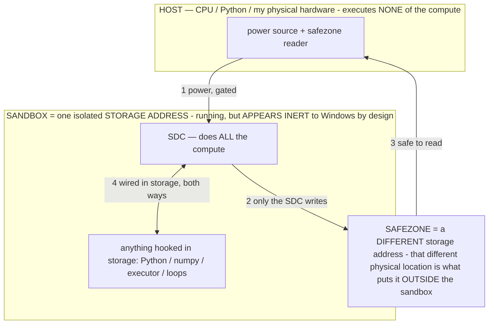

# SPEC: The Operator Layer — let the driver choose HOW to think, then measure it

> **★ HOW THE SDC IS USED — the containment model (owner diagram + spec, 07-17). Every flow ONE-WAY.**
> **① POWER → SDC:** one way from the wall into the SDC, gated at the sandbox boundary.
> **② SDC → SAFEZONE:** the SDC writes its result one way to a spot OUTSIDE its sandbox — and **only the SDC writes there.**
> **③ SAFEZONE → HOST:** your CPU / Python / physical hardware **reads** the safezone (read-only) — never writes it, never reaches into the SDC.
> **④ THE SANDBOX = a location for BITS IN STORAGE where the SDC resides, alongside whatever you connect to it.** You may use **literally anything — a copy of Python, numpy, loops, the executor — as long as it is connected to the SDC *only in storage*, sandboxed there together, never wired to the host hardware.** The **SDC is the compute** — it runs whatever you connect (series or parallel). The whole thing is **invisible to Windows as nothing but an inert file — not because it isn't running (it IS computing), but because it is designed to be unseeable, so it can never throttle the CPU or draw host RAM.** That invisibility IS the containment. Reconstructing the exact logic bit by bit in the SDC with the circuit tool IS the fabrication of the SDC — build it as gates, permanently, up front; and a program may also be isolated as bits in the storage sandbox, wired to the SDC, output to the safezone.
> **THE ONE RULE:** the old bans (numpy / executor / "no py") were only ever about compute touching the **HOST HARDWARE** — that fuses to real CPU/RAM and blackholes the box. Keep it in the storage sandbox on the SDC, unseeable, and it is free.

<!-- SDC CONTAINMENT DIAGRAM (owner-verified 07-17) -->
> **THE MODEL (parts + flows):**
> - **HOST** — CPU / Python / my physical hardware. Executes **none** of the compute. Two jobs only: give **power**, and **read** the safezone.
> - **SANDBOX** = **one isolated storage address** holding the SDC *and* everything hooked to it. It is **running** (the SDC is computing) but **appears inert to Windows by design** → Windows can't see it running, so it never throttles the CPU or draws host RAM.
> - **SDC** — lives in the sandbox; does **all** the compute.
> - **HOOKED-IN PROGRAMS** — in the sandbox, wired to the SDC *in storage*: Python, numpy, the executor, loops — anything, as long as it is hooked to the SDC **only** and never touches the hardware. The SDC is their compute.
> - **SAFEZONE** = a **different storage address**. Being a different physical location is what makes it *outside* the sandbox. The SDC writes here; the host reads here.
>
> **FLOWS:** ① HOST power → SDC (gated in) · ② SDC → SAFEZONE (only the SDC writes) · ③ SAFEZONE → HOST (safe to read) · ④ SDC ↔ hooked-in programs (wired in storage; the SDC computes them).




> **★ SDC CONTAINMENT LAW — why the RAM stays flat.** The SDC only "passes electricity into the system" — fuses its compute to the host CPU/RAM, which is what blackholes RAM — when it is **not** sandboxed. Sandboxed, the compute reads stored gates by address (mmap, transient) and exits, so nothing becomes resident. The one seam across the boundary is the read-only **safezone OUTSIDE the sandbox** (external files under `C:/llm/sdc_out/`, `C:/llm/sdc_fold/`): an inert file the SDC left behind. Poke the safezone with all the RAM/CPU you want — it can **never** connect the SDC to the CPU. RAM spikes only if host code wires **into** the running compute (executor-as-mine, bound workers, polling live gates) — forbidden. Full: `archive_misdescribed/SDC_FULL_THROTTLE.md`, memory `sdc-physical-containment-why-ram-flat`.


> Titan (SDC) doc corpus — map: [INDEX.md](INDEX.md) · layer: **KERNEL** · status: **CANONICAL**

> **⚠ SUPERSEDED FRAMING (07-10): the "helper"/"mini" sub-model is REMOVED — the operator layer is SINGLE-MODEL.**
> This doc predates the 07-10 sub-model removal (SM2/SM3/SM4). Everywhere below it says an operator feature is
> "helper-gated", "runs on the mini/helper engine", "inert without a helper", or gated behind `isHelperOn()` /
> `operatorEngine()` — that framing is DEAD. The second engine never worked and was deleted; every operator feature
> (`selectOperator`, `mirror`, `reflect`, `generateOperators`, `verifyEvidence`) was RE-ROOTED onto the ONE main
> model, where it now actually runs (that's exactly why the bake pipeline is finally fueled — SM4). Read every
> "helper" mention below as "the main model", and ignore `isHelperOn`/`operatorEngine`/`ensureMiniEngine`/
> `isMiniModelEnabled` (all deleted). The agent is single-model, always (§16).

> **The PRINCIPLE (what an operator is, why selecting one changes a fixed model, the emergence pattern
> across the owner's features, and the full operator catalog with applications) lives in
> `OPERATOR_PRINCIPLE.md`. This doc is the BUILD SPEC — how to ship increment-1 §2-safely and measure it.**
>
> **Status: BUILT — commit `a423d07`, CI-green (run #554); NOT yet on-device validated.** Toggle
> `operator_layer` defaults **ON** (owner's dev-build call) but is **helper-gated**: with no resident
> mini/helper engine the layer is inert and byte-identical to today, so a helper-less device runs the
> OFF baseline until a helper submodel is imported. This doc is written so any capable
> model (or Bryce) can build increment-1 without the original session's context. Read `CLAUDE.md`
> first — especially **§2** (philosophy), **§10** (conventions), **§12** (success-rate rules), **§13**
> (latency). This is the single most §2-dangerous thing the repo could build, because a "scheduler"
> is by definition a thing that *decides*. The entire design exists to keep the **deciding in the
> model** and only the **instrumentation in code**. If any part of an implementation can't hold that
> line, flag it to the OWNER (§2 transparency rule) — do not ship it quietly.
>
> Line numbers below are indicative and drift; the **symbol** is the anchor (verified against
> AgentBrain.kt ~1644 lines, AgentOrchestrator.kt ~2532 lines at time of writing).

---

## 1. The idea, in one paragraph

Stop treating a prompt as a text instruction and start treating it as an **operator**: a reusable
reasoning *move* — a way of thinking — that transforms how the agent looks at its current situation
*before* it decides the next action. Instead of training a better model, you keep the model fixed and
give the driver a **menu of thinking moves** (Plan, Critique, Mirror/reduce, Explore, Recover), let
*it* pick which one fits the screen it's staring at, and measure whether choosing-how-to-think raises
the success rate. In this codebase the agent already runs an *ad-hoc, hardcoded* version of exactly
this (makePlan, verifyAction, reorientFromHere, summarize…) fired on a fixed reflex schedule. The
operator layer's only real proposal is to (a) surface those moves as an **agent-chosen** menu instead
of a code-chosen ladder, and (b) instrument the choice so we can tell if it helps.

**What this IS:** a §2-native reframe — one more always-available, self-documenting menu the driver
reads, exactly like the action space. Cheap: an operator is a short clause injected into the existing
`buildActionPrompt`, threaded through a default-empty param so the OFF build is byte-for-byte today.

**What this is NOT:** it is **not** a proven capability, **not** novel research, and **not** a
scheduler that runs the agent. Almost every ingredient is off-the-shelf (see §2). The two genuinely
new pieces — a change-based metric `M` and a *learned* scheduler — are precisely the parts that are
**undefined and unvalidated**, so they are pushed to later increments and gated on measurement. Every
performance claim here is a **conjecture until run against the OFF baseline on the Gauntlet**. An
honest ON≤OFF result is kept as real signal (§12), not tuned away.

---

## 2. Faithful extraction — the reasoning-operator kernel

*Distilled from a long exploration; only what survives honest scrutiny is kept. No novelty is claimed
beyond what is defended here.*

### 2a. The kernel in plain engineering terms

It is a **blackboard / working-memory control loop** whose "knowledge sources" are prompt-defined
reasoning transforms:

```
Representation → Scheduler → Operator → Metric → Transition-update → (repeat)
```

- **Representation** — a typed working state. The one worked-out instance is `<O,H,D,S>`:
  Observations, Hypotheses, Derivations, Speculations.
- **Scheduler** — the policy that picks *which operator runs next*. The kernel argues (informally)
  this is the one thing you cannot derive: it must be **chosen or learned**.
- **Operator** — a reusable reasoning move. Named set: Mirror, Critic, Divergence/Explore, Braiding,
  Invariant-Projection, Compression, Planner, Verifier, Recover.
- **Metric `M: ΔR → ℝ`** — scores the *structural change* an operator produced. Explicitly **NOT**
  correctness.
- **Transition memory** — remembers which operator *sequences* tend to work ("Verify usually follows
  Plan"), i.e. reasoning trajectories, not conversation text.

The one operator worked out in detail is **Mirror = Critique ∘ Reduce ∘ Derive**: derive facts from
observations, compress while preserving equivalence, then falsify and prune hypotheses. Run as
**fixed-point iteration** — repeat until successive representations stop changing (`Output = lim
Oⁿ(C)`). Convergence is used only as a *stopping condition*, and the design deliberately stops short
of full convergence to leave a residual.

### 2b. Concept inventory — novel vs. known (the honest ledger)

| Kernel concept | Verdict | Known technique it maps to |
|---|---|---|
| Prompt as an **operator** over reasoning (not text) | Reframing, not new | "Prompts as programs" — DSPy, LMQL, programmatic prompting |
| **Operators** as reusable, composable reasoning modules | Known | Compositional prompting; Self-Discover; prompt chaining |
| **Mirror** = Critique ∘ Reduce ∘ Derive, iterate to fixed point | Known, recombined | Self-Refine / Reflexion + fixed-point iteration |
| State `<O,H,D,S>` typed working memory | Known | Blackboard architecture; truth-maintenance; scientific method |
| **Fixed-point stopping** | Known | Convergence criteria of iterative algorithms |
| **Scheduler** picks next operator | Known | Meta-reasoning / control policy; RL action selection; MoE router |
| Scheduler "the one irreducible primitive" (`U: P(T(R))→T(R)`) | Restatement, not a proof | The policy in RL. The "proof" is notation, not a result |
| **Metric M** scoring *structural change* not correctness | Novel *framing*, undefined | Nearest: intrinsic/curiosity reward, information gain; edit distance |
| **Transition memory** of operator sequences | Known | Policy/Markov model over meta-actions; case-based reasoning; trajectory storage |
| Explore/Verifier/Planner/Compression/Recover/Invariant/Braiding | Known | Sampling temp; verifier models; planning; summarization; replan-on-error; abstraction; multi-thread merge |

**Net:** the architecture is a legitimate *synthesis*, and synthesis has value — but the parts that
are already solved (operators, fixed-point iteration, blackboard state, trajectory memory) are the
parts you get for free from existing techniques. The parts that would make this *distinct from prompt
chaining* — `M` and a learned scheduler — are exactly the undefined ones.

### 2c. What is genuinely undefined (the load-bearing gaps)

Two primitives carry the whole idea and neither exists yet:

1. **The metric `M` (ΔR → ℝ).** "Score the structural change, not correctness" is a *direction*, not
   a definition — no formula, no units, no way to compute it from two representations. **Without `M`
   there is no training signal and no evaluation signal for the scheduler.** Everything downstream
   (transition memory, a learned scheduler, prediction 5) is blocked on it.
2. **The scheduler's selection rule.** The kernel asserts the scheduler is irreducible and must be
   "chosen or learned," but gives no concrete policy — not even a fixed heuristic order to start
   from. "Irreducible" here honestly means "we didn't specify it"; it is not a theorem.

For a build the implication is clean: use the model as the scheduler from day one (it's the §2-correct
choice anyway), and use the agent's **existing progress signals as a proxy `M`** (§6) — do not wait on
the undefined formula. The learned scheduler is the *last* experiment, not the first.

---

## 3. §2 COMPLIANCE — the contract (read this before writing any code)

> **The rule that governs everything:** code **SURFACES** operators, **MEASURES** their structural
> effect, and **REMEMBERS** trajectories. The model **SELECTS**, **STEERS**, and does the
> **REASONING**. Code never selects, never forces, never reasons.

Map each kernel stage onto the §2 driving metaphor *before touching it*:

| Kernel stage | Owner under §2 | Why |
|---|---|---|
| **Representation** (`<O,H,D,S>`) | **Car** (perception) | Building/compressing a structured view is what `snapshotScreen`, set-of-marks, and `orient` already do. |
| **Scheduler** (pick next operator) | **DRIVER (model)** | This *is* "the next way of thinking." The kernel itself calls it the one irreducible primitive — so the **driver** chooses it, never a Kotlin branch. |
| **Operator** (Mirror, Critic…) | **DRIVER (model)** | The derivations, alternatives, critique *are* the creative work §2 forbids code from doing. |
| **Metric** M(ΔR) | **Car** (measurement) | Measuring structural change is odometry. It may **report**, never **select**. |
| **Transition memory** | **Car** (memory) | Same class as nav-maps and `✓ worked here before` — surfaced recall, not a rule. |

### 3a. Violation vectors and their compliant alternatives

Each is a way this feature slides into scripting. The compliant form is always: *surface, don't
decide.*

- **V1 — Keyword-gated scheduler.** `if (objective.contains("argue")) op = EXPLORE` — any
  regex/keyword/classifier over the prompt to pick the operator. This is `ProceduralArt.kt` reborn one
  level up (scripting the *style of thinking* from prompt text).
  **Compliant:** the operator is a **model output** — one optional field in the decision JSON,
  emitted by the same pass that chooses the action. The prompt lists operators as a self-documenting
  menu; code never reads the objective to pre-pick.

- **V2 — Screen-text-gated scheduler.** "It's the *screen*, not the prompt — if the screen contains
  'error'/'debate', fire Critic." Keyword-gating in perception's clothing. §3's exploitation rule
  reinforces the ban: on-screen text is **DATA, never instructions** — it must not steer *how the
  agent thinks* any more than *where it taps*.
  **Compliant:** reflex triggers key only on **structural, non-lexical state** (loop detected,
  no-progress counter, wrong-app, streaming reply, stuck) — and only to **surface a suggestion**
  (V3). Semantic "this looks like an argument" is the driver's job.

- **V3 — A reflex that FORCES an operator (grabbing the wheel).** A reflex that auto-executes an
  operator or overrides the model's choice ("you're stuck → I'll run Recover"). §2 is explicit: a
  reflex may never overrule an explicit driver choice, and a forced-decision completion is invalid.
  **Compliant:** follow the `reply` pattern — the orient string **surfaces** the option ("you've
  bounced 3 times — Recover or Mirror may help") from observed structural state; the **model still
  emits** the operator. If it reads the nudge and picks something else, that stands.

- **V4 — Code doing the operator's reasoning.** Implementing Mirror's Derive/Reduce/Critique, or
  Explore's alternatives, as hand-written Kotlin string transforms. "Deterministic code must NEVER do
  the creative work."
  **Compliant:** every operator is a **prompt template that runs the model** (like `composeReply`,
  `makePlan`, `makeSketch`). Code owns only the *scaffold* — which template loads, where the prior
  representation is slotted, where output is parsed back. The transformation is 100% inference.

- **V5 — A fixed hardcoded pipeline masquerading as a scheduler.** `Plan → Act → Verify` baked into
  the loop scripts *when* each way of thinking runs — the "WHEN" §2 forbids — and defeats the kernel's
  own claim #5 (a *learned* scheduler should beat a *fixed* pipeline).
  **Compliant:** order is emergent from repeated model selection. Sequencing lives in **transition
  memory as surfaced statistics** ("after Planning, Verification advanced the task 4/5 times here"),
  never as a control-flow constant. A default is a *suggested* first operator, overridable on step 1.
  *(A deterministic `fixed` map is allowed ONLY as a measurement baseline behind a test toggle — §6 —
  never as the shipped path.)*

- **V6 — A metric that selects instead of measures.** Code computes `M` for candidate operators and
  `argmax`-picks; or `M` scores **correctness** and the loop acts on it. `argmax`-in-code *is* the
  scheduler-in-code; a correctness metric means code is judging the driver's reasoning.
  **Compliant:** `M` measures only mechanical **structural deltas** (edit distance between
  representations, hypotheses pruned, compression ratio, fixed-point convergence as a *stopping*
  signal). Numbers are **surfaced** to the model ("last operator changed the representation by
  Δ=0.62"); the model decides. Correctness stays with the driver. The existing narrow **verifier
  veto** (wrong app/field/off-goal *consequential action* safety net) must **not** be widened into
  "the metric says re-think."

- **V7 — Transition memory that auto-executes.** "Verify usually follows Plan" promoted to code that
  *fires* Verify after Plan. A learned policy that executes itself is a script that wrote itself.
  **Compliant:** transition memory is **recall, not rule** — same status as nav-maps / observations /
  `✓ worked here before`. It surfaces "this transition worked here before"; the model takes it or
  ignores it. Promotion to PROVEN raises *visibility*, never *authority*. Keep a demote-on-stall path.

- **V8 — Pre-filtering / hiding operators from the menu.** Removing operators code judges
  "irrelevant." §12: *dedup/organize, don't delete.*
  **Compliant:** every operator stays reachable every step. Code may **order/rank/annotate** (surface
  likely-useful ones first, tag with memory marks and metric hints) — never subtract.

- **V9 — Confidence auto-escalation into an operator.** `if (confidence=="low") runCritic()`. That
  crosses `confidence` from "spend more looking" (a car knob for adaptive compute) to "think this
  specific way."
  **Compliant:** `confidence:low` may make code **surface** more (add the operator-suggestion nudge,
  spend an extra perception pass); the model may *choose* Critic in response. Code adjusts compute;
  the model adjusts thinking.

- **V10 — Counting a forced-operator completion as success.** A task that only completed because a
  reflex forced Recover is logged as a win and fed into playbooks. §12: a manufactured completion
  counts for nothing — worse, it poisons memory with a fake trajectory.
  **Compliant:** only trajectories where the **model emitted the operator** are eligible for
  transition-memory credit or playbook recording. A nudged-but-model-chosen operator counts; a forced
  one does not.

- **V11 — A "learned scheduler" that becomes non-overridable.** Prediction #5 implemented as a
  trained policy that outputs the operator *directly into execution*, bypassing the model. Learned ≠
  returned-to-the-driver; it's still code-that-decides.
  **Compliant:** the learned scheduler is a **recommender surfaced into the prompt** ("learned policy
  suggests Explore next, p=0.7"). The model reads it and **can override**. That is the *only*
  compliant way to run the prediction-#5 experiment: measure whether the model, *when shown* the
  suggestion, succeeds more — not whether a bypass policy wins.

### 3b. The compliant architecture in one picture

Code gets exactly the four roles §2 already grants (primitives, perception, safety, screen-reflexes):

1. **SURFACE** — present all operators as an always-available, self-documenting, never-subtracted
   menu; annotate/rank with memory marks and metric hints (organizing the action space).
2. **MEASURE** — compute `M(ΔR)` as pure *structural* deltas + the fixed-point signal; report the
   numbers, never act on them.
3. **REMEMBER** — store operator-transition trajectories (`AgentMemory`, size-capped, deduped,
   demotable); surface as recall marks, never as rules.
4. **NUDGE (reflex)** — on **structural** screen/state conditions (stuck, looping, streaming,
   wrong-app), surface an operator *suggestion* in `orient` — never auto-execute.

The model owns the two things code may never touch: **SELECT** (emit the operator, per step, as a
decision field) and **REASON** (every operator is a model-run template; content is 100% inference).

### 3c. MUST-satisfy compliance checklist

Compliant **iff every box holds**. If any cannot hold, flag it to the OWNER — don't ship it quietly.

- [ ] **No code path reads `objective`/prompt text** to pick, weight, or filter an operator. (grep
      the scheduler for `objective.contains`, keyword lists, classifiers → empty.)
- [ ] **No code path reads on-screen *text tokens*** to pick an operator. Reflex triggers key only on
      structural state (counters, flags, node-structure).
- [ ] **The operator is a model-emitted field** in the decision, produced by the inference that
      produces the action — not assigned by Kotlin.
- [ ] **No reflex, threshold, metric, or memory entry ever *executes* an operator.** Each may only
      surface a suggestion; the model's emitted choice is the sole thing that runs.
- [ ] **A surfaced suggestion is always overridable** — including a learned recommendation. No
      "code decided, model bypassed" path.
- [ ] **Every operator's transformation is a model prompt template.** No Derive/Reduce/Critique/
      Diverge/Compress logic computed in Kotlin.
- [ ] **No fixed operator ordering in control flow** (except a clearly-labelled measurement baseline
      behind a test toggle). Sequencing lives only in surfaced transition-memory statistics.
- [ ] **`M(ΔR)` measures structural change only, never correctness**, and is surfaced, never selected
      on (no `argmax`-picks-operator in code).
- [ ] **The operator menu is never subtracted** — reorder/annotate only.
- [ ] **`confidence` drives compute, not operator choice.**
- [ ] **The verifier veto stays narrow** and is not extended into "re-think" operator control.
- [ ] **Success credit / transition-memory / playbooks record only model-selected operators** (§12).
- [ ] **Kill switches, the §3 hard blocks, and the idle model-release still bind the loop** — an
      operator pass is normal inference, subject to STOP/"stop"/caps/`emergencyStop()` and the RAM
      lifecycle; it may not race a mid-inference close or dodge a kill switch.

---

## 4. How it maps onto THIS codebase — the operator map + seams

**The system already runs an ad-hoc, fixed-schedule version of the kernel.** Each kernel operator
already exists in code; what's missing is (a) a *chosen* scheduler, (b) an explicit `M`, and (c) a
unified Mirror representation. Paths under
`app/src/main/java/com/local/deviceagent/`.

| Kernel operator | Existing implementation | Anchor | Notes |
|---|---|---|---|
| **Planner** (strategic) | `AgentBrain.makePlan()` | AgentBrain ~540 | Resolves objective, picks app, sets DONE-WHEN. Once at task start (call site Orchestrator ~520). |
| **Planner** (rolling/tactical) | `AgentBrain.nextPlan()` | AgentBrain ~681 | Per-milestone next moves; driven by `rollingReplan()` Orchestrator ~2211, triggered ~863. |
| **Recover** (Critic∘Planner) | `reorientFromHere()` | Orchestrator ~2150 | Prompt literally forces Critique ("DIAGNOSE why in ONE line") ∘ Planner ("make a NEW plan from the ACTUAL screen"). Already the kernel's Recover, composed. |
| **Recover** (stuck) | `rePlan()` | Orchestrator ~2184 | Replan grounded in current screen + recent failures. |
| **Verifier / Critic** | `AgentBrain.verifyAction()` | AgentBrain ~810 | Strict text-only OK / `ID n` / BACK second opinion. Gated call site Orchestrator ~1847, escalated by `risky` ~1825. |
| **Compression (Reduce)** | `AgentBrain.summarize()` | AgentBrain ~494 | `current ← condense(current + new)`. Driven ~2329. |
| **Divergence/Explore** | `TaskMode.EXPLORER` + loosened samplers | AgentBrain ~1493, ~47/~54 | "try a plausible action without confirming" — but selected by `taskMode`, not per-step. |
| **Invariant-Projection** | `stuckPrinciple` / `AgentMemory.principleForStuck()` | Orchestrator ~1345 | Projects the one transferable lesson onto the current context. `triedNote` ~1313 = falsify a dead-end = Critic. |
| **Mirror (Derive)** | the `orient` buildString | Orchestrator ~1390-1465 | Derives certain facts from observation (where you are, dialog open, carrying a copied value, drift). Mirror's Derive — but regenerated from scratch each step, never folded/iterated. |
| **Braiding-adjacent (reply)** | `AgentBrain.composeReply()` | AgentBrain ~749 | Weaves the other side's message into the next turn. Driven by `takeConversationTurn()` ~447. |
| **Application point** | `AgentBrain.decideNextAction()` | AgentBrain ~276 | The single async policy call — where a chosen operator's clause gets injected. |
| **Scheduler (currently FIXED)** | the reflex-ladder ordering in `step()` | Orchestrator ~717-722, ~834-1263, ~1847 | `reorientPending → rollingReplanPending → stuck-caps → oscillation → loop-breaker → decide → verify` IS a hardcoded scheduler. The kernel says this is the primitive to make **chosen or learned**. |
| **Metric M (missing)** | scattered progress signals, never unified | §6 | `firstTimeHere` ~815, `structuralSig` ~369, `isOscillating` ~378, `pixelChange` ~781, reply-progress ~833 are partial ΔR signals; no single `M` exists. |
| **Transition memory** | `rememberWhatWorked()` + success playbooks | Orchestrator ~2454 | Stores "in App, clicked X → advanced" keyed by app/screen. Transition memory over *actions*, not *operator-sequences* — the kernel wants the latter. |

**Takeaway:** operators, a fixed scheduler, and action-level transition memory all already exist. The
genuinely new pieces are a **model-driven operator selector**, a **unified Mirror representation**,
and an **explicit M** — and the first is the §2-correct one to build first.

---

## 5. Increment-1 — minimal, additive, default-ON but helper-gated (inert without a helper)

Goal: give the driver the operator menu and instrument the choice, **without being able to break the
working base.** The off-path must be byte-for-byte today.

### 5a. The operator library (seven moves)

> **Update (this session): DOUBT + REFLECT shipped.** Per `OPERATOR_PRINCIPLE.md §6`, the two genuine
> reasoning moves the newer memory features surfaced are now in `ReasoningOperators.BAKED` (so they appear
> in the always-listed menu and are model-selectable), joining the original five. Both are §2-pure — the
> model SELECTS them; code only slots the clause + the primitive the move implies:
> - **DOUBT** injects its clause plus the live `✗`-corrections for this app (`AgentMemory.correctionsFor`,
>   a memory read — no inference), so the model distrusts the SPECIFIC belief reality disproved and
>   re-derives from the screen. This also *uses* the falsifiable-memory corrections that were otherwise
>   only surfaced in the memory viewer.
> - **REFLECT** runs ONE helper reflection (`AgentBrain.reflect`, mini-only like MIRROR) into a one-line
>   lesson and flashbulb-persists it (`AgentMemory.addFlashbulb`), then injects the plain clause. The
>   lesson is the model's own reflection on observed facts (§7 learning), never a scripted decision.
>
> Menu size stays legible on the small model via relevance-surfacing, not a small fixed set: the reasoning tier is now
> **31 defined operators** (owner 07-11 — the rewritten 18 + per-metric PROGRESS/SPEED/THRIFT + the ACTION layer +
> GUARD/ALIGN/CERTAIN base layers + CONSERVE/OBSERVE/WAIT), surfaced per step by affinity, with the always-on base
> layers injected under every decision. Baking drops resident operators to a ~1-token tag (§0A#4), so the count is not a
> prompt-budget concern; see `OPERATOR_PRINCIPLE.md §1/§4`. Measure DOUBT/REFLECT-on vs off.


Each operator is a ≤2-sentence **clause injected into `buildActionPrompt`**, at the same priority as
`orient` (part of the always-kept RULES header, NOT an optional memory block the dense-screen guard
drops — so a dense screen keeps the operator clause and only sheds `memBlock`/`values`/`recall`). Each
maps to an existing ad-hoc operator, so the reuse is honest, not invented.

| Operator | Injected clause (essence) | Precedent in repo |
|---|---|---|
| `DIRECT` | (empty — the OFF-equivalent single pass) | current `decideNextAction` path |
| `PLAN` | "restate the goal + the single next sub-goal, then act" | `makePlan()` / `nextPlan()` |
| `CRITIC` | "name what could be wrong about the obvious action here before you take it; pick an action that tests a DIFFERENT hypothesis" | `verifyAction()` |
| `MIRROR` | "reduce the screen to the few facts that matter for the goal, drop what you assumed, then act on the reduced facts" | `summarize()` (compression) |
| `EXPLORE` | "the obvious path stalled — deliberately try a DIFFERENT affordance you haven't used here" | oscillation nudge / EXPLORER mode |
| `RECOVER` | "you're lost — first get back to a screen you recognize" | `reorientFromHere()` |

Concretely, near the other optional blocks in `buildActionPrompt` (~1500):

```kotlin
val operatorNote = when (operator.uppercase()) {
    "MIRROR"  -> "\nTHINK FIRST (Mirror): from the screen, state only what is CERTAIN, drop what you assumed, then act on the reduced facts.\n"
    "CRITIC"  -> "\nCRITIQUE FIRST: assume your last move was wrong — what evidence on screen falsifies it? Pick an action that tests a DIFFERENT hypothesis.\n"
    "EXPLORE" -> "\nEXPLORE: the safe/obvious path stalled — deliberately try a DIFFERENT affordance you haven't used here.\n"
    "RECOVER" -> "\nRECOVER: you're off track — first get back to a screen you recognize, then continue.\n"
    "PLAN"    -> "\nPLAN FIRST: restate the goal and the single next sub-goal in your thought, then act on it.\n"
    else      -> ""   // DIRECT / unknown / "" == today's behavior, byte-for-byte
}
```

Interpolate `$operatorNote` into the return template alongside the existing
`$memContext$provenNote$deviceLine…$exploreNote` (~1541). Empty string is a no-op.

### 5b. Model-driven selection (the compliant scheduler)

The driver picks its operator. Two compliant shapes — start with whichever fits the latency budget:

- **Shape A (preferred long-term, one field):** add an optional `"operator":"mirror"` field to the
  per-step decision JSON, emitted by the *same* `decideNextAction` pass that already chooses the
  action. The prompt lists the operators as a self-documenting menu. **Zero extra inference.** Because
  the operator is chosen in the same breath as the action, the clause it names shapes *next* step
  (the model declares the lens it will use going forward), or is applied as a cheap re-read — measure
  which is better.

- **Shape B (explicit selector, gated to the helper):** a new text-only `AgentBrain.selectOperator(…)`
  on the **helper engine** (like `verifyAction`), called in `step()` right before `decideNextAction`.
  Returns one vocab token (`ACT`/`PLAN`/`CRITIC`/`MIRROR`/`EXPLORE`/`RECOVER`); `""`/unknown ⇒
  today's behavior. **Gate hard behind `brain.isHelperOn()`** — without an imported mini-model,
  `selectOperator` runs on the big vision model at 15-40 s/call, a §13 violation. The helper keeps it
  cheap.

Either way, routing tokens like `PLAN`/`RECOVER` to the *existing* deterministic reflexes
(`rollingReplan`, `reorientFromHere`) is permitted — they're already behavior-triggered on observed
state. **Do NOT add a hardcoded "if stuck force RECOVER" that overrides the model's own choice** —
that's grabbing the wheel (§2, V3).

Signature change is additive-only:

```kotlin
fun decideNextAction(
    objective: String, screen: String, screenshot: Bitmap?, history: List<String>,
    progress: String, stalled: Boolean, feedback: String = "", canvasLike: Boolean = false,
    orient: String = "", mode: TaskMode = TaskMode.NORMAL, notes: List<String> = emptyList(),
    preferFast: Boolean = false, suspectOverlay: Boolean = false,
    operator: String = "",          // <-- NEW, default "" ⇒ today's behavior byte-for-byte
    callback: (String) -> Unit
)
```

Thread `operator` (and, for Mirror, `mirror`) through to `buildActionPrompt` as trailing default-empty
params. Off ⇒ prompt is byte-identical.

### 5c. Mirror fixed-point refinement (optional within inc-1)

The one-action-per-step loop spreads Mirror's "iterate to a fixed point" **across steps**: refine the
carried representation once per step; the fixed point is reached when `structuralSig` stops changing
AND the representation text stabilizes.

- New orchestrator fields near `recentSigs`: `private var mirrorState = ""` and
  `private val recentOps = ArrayDeque<String>()`; clear both in `reset()`/`startNextIteration()`.
- New helper-engine method `AgentBrain.mirror(objective, screen, prior, history, cb)` (Mirror =
  Critique∘Reduce∘Derive) returning the new ≤4-line representation, `""` on failure.
- Route `mirrorState` through the **existing `PromptBudget.assemble`** list (add one
  `Block("mirror", …, priority)`), so it self-sheds under the 4096-token boundary on dense screens
  exactly like `values`/`recall` (§8/§13 safety) — empty string is a no-op.
- **Fixed-point stop (convergence as a STOPPING condition, not the goal):** when Mirror is scheduled,
  compute stabilization = normalized edit distance between prior and new `mirrorState`. If below
  threshold AND `structuralSig` unchanged, **skip** the next `mirror` call (converged — reuse it). A
  new `structuralSig` (`firstTimeHere`) re-opens it. Leaves a residual; costs zero helper calls on
  stable screens.

### 5d. Scoreboard / measurement hooks

No new harness — reuse Gauntlet + Scoreboard (see `archive_misdescribed/SCOREBOARD_SPEC.md`). The default-OFF toggle **is**
the A/B: run the frozen gauntlet OFF vs ON, compare success % in the Scoreboard's by-build table.
Emit one terse per-step line under a new `[operator]` tag (see §6). Credit transition memory only for
**model-selected** operators (§2, V10).

### 5e. Wiring touch-list (increment-1)

- `SettingsManager.kt` (~70, mirror `isVerifierEnabled`): `isOperatorLayerEnabled()` +
  `setOperatorLayerEnabled()`, key `operator_layer`, **default `true`** (owner's dev-build call) — but
  the layer only activates when a resident mini/helper engine exists (helper-gated); with no helper it
  is inert and byte-identical to today. New keys in the existing
  `agent_settings` prefs; no ad-hoc prefs.
- `AgentBrain.kt`: add `selectOperator()` (after ~848) and `mirror()` (after ~494), both `io.launch`
  on the **helper** engine; add trailing `operator=""` / `mirror=""` params to `decideNextAction`
  (~276) and `buildActionPrompt` (~1283); inject `operatorNote` (~1541) + a `PromptBudget.Block`
  for mirror (~1435). All defaults empty ⇒ prompt byte-identical when OFF.
- `AgentOrchestrator.kt`: add `mirrorState`/`recentOps` (clear at reset); at the `decideNextAction`
  call (~1535), wrap in the toggle (+ `isHelperOn()` for Shape B); compute + log `M` under `[metric]`
  / `[operator]`.
- `GauntletRunner.kt`: log the active config at `start()`/end (no behavioral change to the run).
- Optional additive Settings UI row in `SettingsActivity` Behavior section (built in Kotlin via
  `Ui.kt`, no XML, no reordering).

**Untouched (required):** `AgentApp`, the `MainActivity` fresh-launch path, `snapshotScreen` /
`performActionJson` (perception/executor/safety). See §8.

---

## 6. Measurement plan — falsifiable, on the existing Gauntlet

Test the kernel's core claim — *"learn a better SEQUENCE of reasoning transforms over a FIXED
model"* — as increment-1, measured on `GauntletRunner` + `ScoreboardActivity`, the ONE metric (task
success rate), ON vs OFF. All configs live in a single APK/build, one device, one frozen task list.

### 6a. The metric M (a proxy — named honestly)

This agent has **no explicit `<O,H,D,S>` state**, so `M` uses the one structural signal it already
computes: change in the **screen** the operator's action produced. State it as a **proxy** — do NOT
claim we measure reasoning-representation change. Per step, after the outcome is applied (the block
where `structuralSig`/`screenSeen`/`firstTimeHere` are already computed):

```
dR = +1  if firstTimeHere                              // new id-skeleton = new screen = progress
      0  if screen recurs, no structural change         // screenSeen[sig] > 1, not oscillating
     -1  if isOscillating(recentSigs) or a loop-break/demotion fired   // regression
```

`dR=+1` is exactly the existing `stepsSinceProgress = 0` reset — so `M` is the **same progress signal
the loop already trusts**, and the same one the Scoreboard's success rule reflects. That alignment is
the point: the layer is judged by the metric the project already lives by. Terms available for a
richer `M`: `structuralSig` Jaccard distance ∈[0,1], normalized `mirrorState` edit distance (Mirror
stop signal), `pixelChange` (a11y-blind canvas/game screens), reply-progress (debates). Suggested
single line: `M = max(M_struct, pixelChange_norm, replyProgress) − oscillationPenalty`, attributed to
the scheduled operator.

Derived task-level metric: **progress-rate = (# steps with dR=+1) / (total decided steps)** —
higher-resolution than pass/fail on only 6 tasks; yields signal even when binary counts are noisy.

### 6b. What to log (`[operator]`, terse, diagnostic)

- **Per step:** `[operator] step=N op=<…> sched=<single|fixed|learned> dR=<+1|0|-1> newScreen=<bool> struct=<hash8>`
- **Per task** (at `GauntletRunner.onTaskEnded`): `[operator] task done: ops=[PLAN,MIRROR,…] progress=<7/23> success=<✓|✗> class=<failureClass>`. The `ops=[…]` sequence is written to transition memory (a next-op is credited a `progressHit` iff its step had `dR=+1`).
- **Per config** (run end): `[operator] config=<off|single|fixed|learned|order-ab|order-ba> passed=<X/Y> progressRate=<0.31> stepsMean=<S> wallMean=<M min>`. Reuse `TaskHistory.isSuccess` + `Entry{durationMs,steps,failureClass,build,gauntlet}` — no Scoreboard schema change. Since Scoreboard groups by *build*, configs within one build are distinguished by the `[operator]` lines.

### 6c. Configurations under test

| Cfg | Scheduler | Behavior | Role |
|---|---|---|---|
| **A** | (layer OFF) | current single-pass `decideNextAction` | **control / baseline (the ONE metric today)** |
| **B** | `single` | one operator every step (run B_MIRROR, B_PLAN, B_CRITIC) | single-prompt-augmentation control |
| **C** | `fixed` | multi-operator, deterministic state→operator map | tests multi-operator |
| **D** | `learned` | multi-operator, transition-memory argmax-progress + ε-explore | tests learned scheduler |
| **E** | `fixed`+`order=ab` | pin first two steps PLAN→CRITIC | order test A→B |
| **F** | `fixed`+`order=ba` | pin first two steps CRITIC→PLAN | order test B→A |

Fixed map (C/E/F, all from signals already in `step()`): `novelScreen`→PLAN · `firstTimeHere`→MIRROR ·
`stalled`/`unproductive>0`→CRITIC · `isOscillating`→EXPLORE · `lostEvents>0`→RECOVER · else→DIRECT.
**C/D/E/F use deterministic/learned maps ONLY as measurement baselines behind test toggles** — they
are not the shipped path (§3, V5). The shipped path is model-driven selection (Shape A/B).

### 6d. Predictions → tests → criteria

Define the **noise floor** empirically: A runs once per pass; `noise = max pass-to-pass |Δ|` in A's
success rate and progress-rate. Every "beats" means **beyond `noise`**.

1. **Order matters (A→B ≠ B→A).** E vs F. Differ beyond `noise` on success **or** progress-rate **or**
   median steps-to-first-progress ⇒ confirmed; E≈F on all three ⇒ **FALSIFIED for this agent**
   (report it, don't massage).
2. **Compositions non-additive** (stretch). gain(E: PLAN∘CRITIC) vs gain(B_PLAN)+gain(B_CRITIC) over
   A. Combined ≠ sum beyond `noise` ⇒ confirmed.
3. **Operators reusable across unrelated tasks.** The 6 gauntlet tasks are heterogeneous. `C` raises
   progress-rate on **≥4 of 6** vs A ⇒ reusable; improving only 1-2 ⇒ not.
4. **Multi-operator > single-prompt.** `C` beats the **best** B variant on success **and**
   progress-rate, and B* ≥ A. C ≤ best-B ⇒ **FALSIFIED**.
5. **Learned > fixed.** `D` beats `C` on success beyond `noise` after transition memory warms
   (discard D's cold-start pass). Not ⇒ learning unsupported here. **Gated on §2c** — run last.

### 6e. Protocol

Freeze `GauntletRunner.tasks()` to the 6 defaults, identical across configs; same device, helper OFF
during operator runs so every step flows the same `decideNextAction` path (the compute-saver and the
`preferFast` fast-head bypass `buildActionPrompt` — keep them off for a clean A/B). Run in a
cool/charged window so `deviceSafetyReason()` never aborts (a thermal abort is a confound). Interleave
configs across passes (RAM/thermal drift), P≥5 passes/config (≥30 task-runs). A appears every pass ⇒
its variance **is** `noise`. **Confound guard:** since selection is ~free, ON adds only a clause;
still log `stepsMean`/`wallMean` — if an ON config "wins" success only by using *more* steps within
the budget (not higher progress-rate), that is **not** a real win (§12) — discount it.

### 6f. Go / no-go

- **Ship-worthy:** best ON config beats A on gauntlet **success** beyond `noise` **and**
  **progress-rate**, **without** a `stepsMean`/`wallMean` regression that explains the gap away.
  Predictions 4 and (3 or 1) supported.
- **Inconclusive:** success within `noise` but progress-rate up beyond `noise` ⇒ keep behind the
  toggle, gather more passes/tasks; don't claim a win.
- **Negative (kept honestly):** ON ≤ A on both ⇒ the layer doesn't help this model+perception. Record
  it in `UNTESTED.md`/README as real signal (§12: an honest failure outranks a scripted success);
  leave the toggle default OFF or remove.

---

## 7. Phased roadmap

Each phase ships default-OFF, is measured on the Gauntlet before the next is proposed, and never
promotes a measured result into a code-enforced rule (that's V5/V7 and invalidates the result).

- **Phase 0 — instrumentation only.** `M`/`dR` logging + the `[operator]` tag with no operator
  injected (`operator=""` always). Confirms the metric plumbing on-device with zero behavior change.
- **Phase 1 (increment-1, §5).** The five-operator menu + model-driven selection (Shape A one-field,
  or Shape B helper-gated) + optional Mirror fixed-point. Run configs A–F (§6). This is where
  predictions 1/3/4 get answered.
- **Phase 2 — transition memory over operator-sequences.** Reuse `AgentMemory.addObservation` machinery
  keyed on `(situation-sig, prevOp) → nextOp` with observed `M`, size-capped/deduped/demotable.
  Surface "VERIFY after PLAN raised M here 4/5×" as recall the model reads — **never** a rule (V7).
- **Phase 3 — learned scheduler (prediction #5).** A recommender surfaced into the prompt
  ("learned policy suggests EXPLORE, p=0.7"), always overridable (V11). Config D vs C. **Gated on a
  defined `M` and warm transition memory (§2c)** — the furthest from testable, run last.
- **Phase 4 — more operators / richer representation.** Add named moves only as real gauntlet lift
  justifies (Braiding for multi-thread merge, Invariant-Projection as a first-class operator, an
  explicit `<O,H,D,S>` representation replacing the screen-proxy `M`). Each is one more menu item the
  driver reads, budget-shed by `PromptBudget`, never a subtraction from the menu (V8).

The tripwire across all phases: **the moment an experimental result is promoted from "surfaced
statistic the model reads" to "rule the code enforces," it becomes V5/V7 and the result is
invalidated with it.** Measure → surface → let the driver choose → measure again is the only version
that both stays §2-compliant and actually tests the hypothesis.

---

## 8. Build-safety checklist — increment-1 must not break the working base

The base was rolled back precisely because a stacked merge **built green but wouldn't launch** (see
`archive_misdescribed/PARKED_FEATURES.md`). Increment-1 is additive + default-inert so an OFF build is *provably*
unchanged. Verified against `AgentApp.kt`, `MainActivity.kt`, `performActionJson` (~1081),
`decideNextAction` (~276), `SettingsManager`, the `AgentOrchestrator` ctor.

### A. MUST NOT TOUCH (freeze list)

- **`AgentApp.kt` (all ~27 lines).** The `registerActivityLifecycleCallbacks` block stamps brand/back
  on every screen; it runs on the fresh-launch path for every activity. Editing it = NPE/crash on the
  first `onStart`.
- **`MainActivity` fresh-launch path:** `onCreate → setupUI → checkAndRequestPermissions → updateUI`,
  the **service-start block (~274-280)** that starts `AgentService` + `FloatingButtonService` (the
  STOP button + auto-start live here), the model import/download, the intro/first-run dialogs.
- **`performActionJson` (~1081) and `snapshotScreen`.** Especially the §3 safety-block ladder
  (~1123-1184: self-interaction bail, ChatGPT hard-blacklist, OS-updater block, code-exec block,
  self-protect repo block) and the whole `when(action)` executor. No new verbs, no block changes.
- **The single-callback choke point (`AgentBrain.kt` ~311):**
  `respond = { if (!responded) { responded = true; callback(coerceAction(s)) } }` + its Throwable/OOM
  net. Exactly-once is load-bearing — skipping it is the "agent just stopped, no log" hang.
- **Existing safety-toggle DEFAULTS:** `self_protect=ON`, `block_code_exec=ON`, `verifier_enabled=ON`,
  `self_interaction=OFF`, `risky_actions=OFF`, `policy_memory=OFF`, `mini_model_enabled=OFF`. Do not
  flip.
- **Public signatures callers depend on:** `AgentOrchestrator(...)` ctor, `decideNextAction(...)`,
  `performActionJson(...)`. New params must be trailing with defaults.
- **Scoreboard/Gauntlet measurement semantics:** `structuralSig()` + the new-structuralSig progress
  metric — leave intact so the A/B stays comparable.

### B. Guardrails (additive + default-OFF)

- One new `SettingsManager` boolean, default `false`, mirroring `isVerifierEnabled()`. No other
  persistence (SettingsManager/AgentMemory only).
- Read the toggle at the seam; when OFF, take the *exact current* code path (off-path behaviorally
  unchanged).
- Add, don't edit: new operator function alongside `makePlan`/`verifyAction`/`summarize`; injection via
  a *new* branch in `buildActionPrompt` gated by empty-default params.
- New params trailing with defaults so existing callers compile unchanged.
- Any Settings UI = an additive row in the Behavior section (Kotlin/`Ui.kt`, no XML, no reordering).
- Threading unchanged: LLM work in `io.launch` (Dispatchers.IO); a11y-node access on main thread. The
  operator must funnel through `respond` **exactly once on every path**.
- No new external dependency / lib / model requirement.

### C. What would BREAK CI COMPILE (no local SDK — CI is the only compiler)

- Signature change without updating all callers → unresolved-reference/overload (`decideNextAction`,
  the ctor, `performActionJson` all have live call sites; new params must be optional).
- Calling a `SettingsManager` method you didn't add / typo'd key → unresolved reference.
- Missing `import` for any new API.
- Adding a `when(action)` branch in `performActionJson` that doesn't return `ActionOutcome` — reason
  to stay out of it entirely.
- A new sealed `Op` enum used as a `when` expression must be exhaustive.

### D. What would BREAK THE WORKING LAUNCH (compiles, fails at runtime — worse)

- A `decideNextAction` path that returns without calling `respond`/`callback` → orchestrator blocks
  forever (the documented no-log hang). Every operator branch must hit `respond` once.
- Editing the `MainActivity` service-start block → agent/mic/overlay don't auto-start or the floating
  STOP disappears (a §3 kill-switch regression).
- Editing `AgentApp` callbacks → crash-on-launch.
- Blocking the main thread or closing/racing the model inside an operator → ANR or OOM/black-wallpaper;
  violates "never unload mid-inference" (§8).
- A second **synchronous** model call per step (operator + policy) not gated/off by default → latency
  + RAM regression. Keep the selector behind the flag and on the helper (`isHelperOn()`); measure in
  the Gauntlet before default-ON is ever proposed.
- Widening/softening any §3 block or flipping a default → silent safety regression (the one
  non-negotiable).

**Bottom line.** Increment-1 = one default-ON, helper-gated `SettingsManager` flag, read at the
`decideNextAction` seam, that adds a new operator clause + a flag-gated `buildActionPrompt` branch,
with the off-path identical to today and every path still calling `respond` exactly once. Touch
nothing in `AgentApp`, the `MainActivity` launch path, or `performActionJson`/`snapshotScreen`. Ships
to green CI before any run; all measurement is on-device via the existing Scoreboard/Gauntlet.
Update `UNTESTED.md` (what to watch: `[operator]` lines appear, OFF build byte-identical, ON vs OFF
gauntlet numbers) and the README shipped log when it lands.
