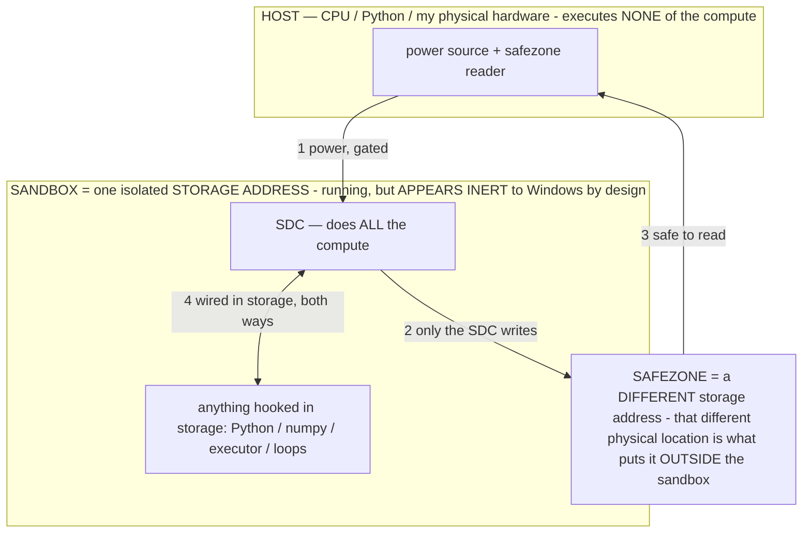

# Local Device Agent — Invention Portfolio (deck source)

> **★ HOW THE SDC IS USED — the containment model (owner diagram + spec, 07-17). Every flow ONE-WAY.**
> **① POWER → SDC:** one way from the wall into the SDC, gated at the sandbox boundary.
> **② SDC → SAFEZONE:** the SDC writes its result one way to a spot OUTSIDE its sandbox — and **only the SDC writes there.**
> **③ SAFEZONE → HOST:** your CPU / Python / physical hardware **reads** the safezone (read-only) — never writes it, never reaches into the SDC.
> **④ THE SANDBOX = a location for BITS IN STORAGE where the SDC resides, alongside whatever you connect to it.** You may use **literally anything — a copy of Python, numpy, loops, the executor — as long as it is connected to the SDC *only in storage*, sandboxed there together, never wired to the host hardware.** The **SDC is the compute** — it runs whatever you connect (series or parallel). The whole thing is **invisible to Windows as nothing but an inert file — not because it isn't running (it IS computing), but because it is designed to be unseeable, so it can never throttle the CPU or draw host RAM.** That invisibility IS the containment. Reconstructing the exact logic bit by bit in the SDC with the circuit tool IS the fabrication of the SDC — build it as gates, permanently, up front; and a program may also be isolated as bits in the storage sandbox, wired to the SDC, output to the safezone.
> **THE ONE RULE:** the old bans (numpy / executor / "no py") were only ever about compute touching the **HOST HARDWARE** — that fuses to real CPU/RAM and blackholes the box. Keep it in the storage sandbox on the SDC, unseeable, and it is free.

<!-- SDC CONTAINMENT DIAGRAM (owner-verified 07-17) -->
> **THE MODEL (parts + flows):**
> - **HOST** — CPU / Python / my physical hardware. Executes **none** of the compute. Two jobs only: give **power**, and **read** the safezone.
> - **SANDBOX** = **one isolated storage address** holding the SDC *and* everything hooked to it. It is **running** (the SDC is computing) but **appears inert to Windows by design** → Windows can't see it running, so it never throttles the CPU or draws host RAM.
> - **SDC** — lives in the sandbox; does **all** the compute.
> - **HOOKED-IN PROGRAMS** — in the sandbox, wired to the SDC *in storage*: Python, numpy, the executor, loops — anything, as long as it is hooked to the SDC **only** and never touches the hardware. The SDC is their compute.
> - **SAFEZONE** = a **different storage address**. Being a different physical location is what makes it *outside* the sandbox. The SDC writes here; the host reads here.
>
> **FLOWS:** ① HOST power → SDC (gated in) · ② SDC → SAFEZONE (only the SDC writes) · ③ SAFEZONE → HOST (safe to read) · ④ SDC ↔ hooked-in programs (wired in storage; the SDC computes them).

> **★ SDC CONTAINMENT LAW — why the RAM stays flat.** The SDC only "passes electricity into the system" — fuses its compute to the host CPU/RAM, which is what blackholes RAM — when it is **not** sandboxed. Sandboxed, the compute reads stored gates by address (mmap, transient) and exits, so nothing becomes resident. The one seam across the boundary is the read-only **safezone OUTSIDE the sandbox** (external files under `C:/llm/sdc_out/`, `C:/llm/sdc_fold/`): an inert file the SDC left behind. Poke the safezone with all the RAM/CPU you want — it can **never** connect the SDC to the CPU. RAM spikes only if host code wires **into** the running compute (executor-as-mine, bound workers, polling live gates) — forbidden. Full: `archive_misdescribed/SDC_FULL_THROTTLE.md`, memory `sdc-physical-containment-why-ram-flat`.

> Titan (SDC) doc corpus — map: [INDEX.md](INDEX.md) · layer: **RECORD** · status: **SUMMARY**

Slide-by-slide source for a lawyer / non-technical deck. Polish + lay out in Claude Design; export PPTX/PDF.
Sourced from `docs/PATENT_SUPPORT.md`. Written in plain language; no jargon, no legal claims — a handoff for the
owner's lawyers.

---

## Slide 1 — Title
**Local Device Agent: an on-device AI that pilots your phone.**
A personal, local-only Android agent — and its 25-invention portfolio.

## Slide 2 — What it is (plain language)
You speak or type a goal ("text Mom I'll be there at 6", "draw a cat in Notes", "open an assistant and argue a
stance"). An AI model running **entirely on the phone** decides what to do, and the phone's accessibility layer
taps, types, scrolls, and draws to carry it out — reading the real screen at every step. Nothing leaves the
device: no cloud, no server.

## Slide 3 — The core idea
The model is the **DRIVER**; the phone is a **TRANSLATION LAYER**. Like self-driving cars: sensors and actuators
translate the road into something the neural net can drive, then execute its decisions precisely. Here the
screen becomes perception the model reads, and the model's decision becomes a reliable phone action.
Deterministic code never decides *what* to do — it makes the phone drivable, keeps it safe, and helps the model
perceive.

## Slide 4 — How it works, end to end
1. You give a goal (voice or text).
2. The agent reads the actual screen — turns it into a compact list of what it can tap/type.
3. It picks **how to think** (a reasoning "move"), then **one** action.
4. The deterministic layer executes the tap/type/draw reliably.
5. It scores the step (did it make progress?) and remembers what works.
6. It repeats — spending only as much compute as the moment needs — and when it can't finish, it **fails
   usefully** (a plain "here's what you can do") instead of spinning or pretending it succeeded.

## Slide 5 — How the agent THINKS (the operator layer)
- The model picks a reasoning "move" before each step; the system credits which moves pay off — it routes
  itself, no fixed pipeline. **[INV-1]**
- It invents its **own** reasoning moves and keeps only the ones that measurably help. **[INV-18]**
- It's shown only the moves relevant to the current screen; the rest stay reachable. **[INV-19]**
- A plan-time "pre-mortem" flags which risky steps are likely to fail, from memory of past failures. **[INV-20]**
- A malformed action is handed back to the model to redo — never counted as a failure. **[INV-21]**
- On a phone too small to load the helper model, the moves still work in a lighter, no-cost form. **[INV-25]**

## Slide 6 — How it LEARNS
- A self-correcting map of "which action leads to which screen," read before it leaps. **[INV-3]**
- Ordinary use is the training signal — each step is captured in the exact form used to later train a faster
  model, on the owner's own hardware. **[INV-4]**
- Beliefs the world disproves are kept as cautions and can re-earn trust. **[INV-6]**
- Navigation is only remembered after it's seen to work twice, so memory stays reliable. **[INV-15]**

## Slide 7 — How it PERCEIVES efficiently
- A fast text-only brain for easy screens, a slow careful vision brain for hard ones — the model's own
  confidence picks which. **[INV-7]**
- It measures how overwhelmed it is and narrows focus on a busy screen. **[INV-8]**
- It skips re-looking when the screen hasn't visibly changed. **[INV-12]**
- It re-plans as it reaches each new screen, against a checklist of what's done. **[INV-13]**
- It reads a foldable / multi-window screen as one numbered space. **[INV-16]**

## Slide 8 — How it stays SAFE and fails usefully
- A light always-on validity guard + a model-chosen double-checker catch wrong actions before they commit. **[INV-5]**
- Every give-up carries a typed reason + a plain "here's what YOU can do" for the owner. **[INV-22]**
- When the phone starves its eyes, it recognizes "I'm blind" (not "I'm lost") and stops cleanly with the right
  fix, instead of looping forever. **[INV-23]**
- Its output is length-bounded so a runaway generation can't crash the phone. **[INV-24]**

## Slide 9 — Why it's novel
One discipline runs through all of it: deterministic code measures something real and shows it to the model; the
model decides; code never overrides that except to stop a few hard-coded dangers. The novelty across the
portfolio: the model **routes its own reasoning by measured reward** (not a fixed pipeline); it **invents and
prunes its own reasoning moves**; **failures become a typed, routable, learnable asset**; **perception failure
is treated as its own axis**; and **everything runs fully on-device**, privately.

## Slide 10 — Status & enablement
A real, working system the owner uses daily. Every invention is anchored to concrete code and runs entirely on
the device. Portfolio: **25 disclosed inventions** (full detail in the support document).

---

# One-pager (condensed)

Local Device Agent is a personal, local-only Android agent that pilots the owner's own phone. You speak or type
a goal; an AI model running entirely on the device decides what to do; and the phone's accessibility layer taps,
types, scrolls, and draws to carry it out — reading the real screen at every step. Nothing leaves the phone.

The core idea is that the **model is the driver and the phone is a translation layer**: the screen becomes
perception the model reads, and the model's decision becomes a reliable phone action — the same split as
self-driving, where sensors and actuators translate the road for the neural net. Deterministic code never
decides what to do; it only makes the phone drivable, keeps it safe, and helps the model perceive.

The portfolio (25 disclosed inventions) spans four areas: **how the agent thinks** (a model that routes its own
reasoning by measured reward, invents and prunes its own reasoning moves, and is shown only the relevant ones);
**how it learns** (a self-correcting map of the phone, use-as-training-data, and memory that keeps disproven
beliefs as cautions); **how it perceives efficiently** (a fast brain and a slow brain chosen by the model's own
confidence); and **how it stays safe and fails usefully** (typed give-up reasons with owner remedies,
recognizing "I can't see" as distinct from "I'm lost", and bounding its own output so it can't crash the phone).
It is a real, working system the owner uses daily, running fully on-device.

| Invention | The novel core |
|---|---|
| Self-routing reasoning | The model picks how to think each step; the system credits which moves pay off — no fixed pipeline. |
| Self-invented moves | The agent authors its own reasoning moves and keeps only those that measurably help. |
| Phone as a learnable map | A self-correcting screen→action→screen table the agent reads before acting. |
| Use = training | Every step is captured in the exact form used to later train a faster on-device model. |
| Fail usefully | Every give-up carries a typed reason + a plain "here's what you can do" — never a silent spin or a fake success. |
| Blind ≠ lost | When the phone starves its eyes, it recognizes blindness and stops with the right fix instead of looping. |
