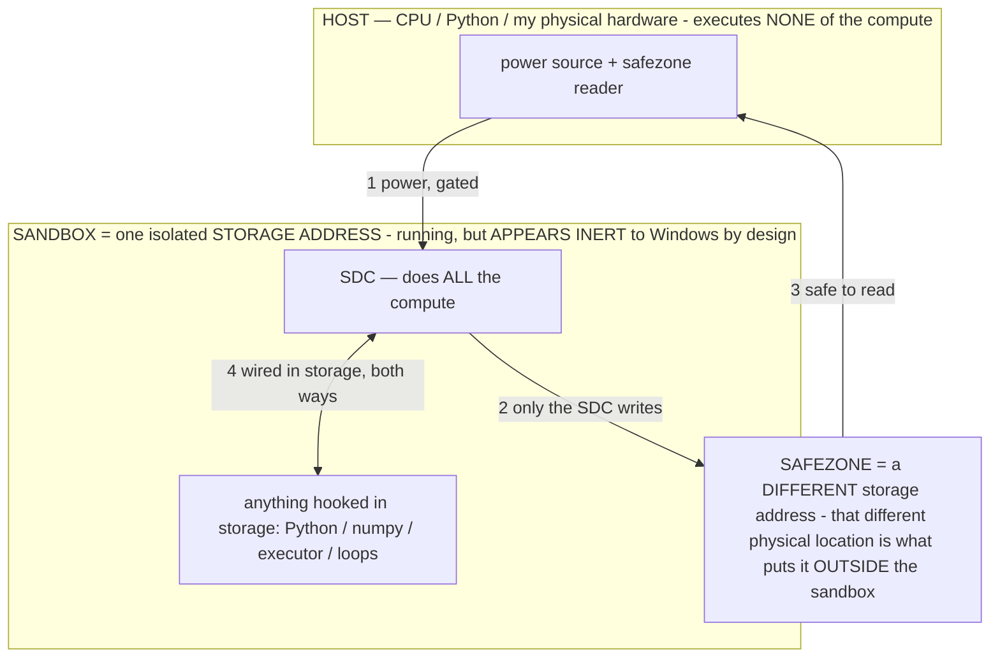

# Patent Support Package — On-Device Autonomous Phone Agent

> **★ HOW THE SDC IS USED — the containment model (owner diagram + spec, 07-17). Every flow ONE-WAY.**
> **① POWER → SDC:** one way from the wall into the SDC, gated at the sandbox boundary.
> **② SDC → SAFEZONE:** the SDC writes its result one way to a spot OUTSIDE its sandbox — and **only the SDC writes there.**
> **③ SAFEZONE → HOST:** your CPU / Python / physical hardware **reads** the safezone (read-only) — never writes it, never reaches into the SDC.
> **④ THE SANDBOX = a location for BITS IN STORAGE where the SDC resides, alongside whatever you connect to it.** You may use **literally anything — a copy of Python, numpy, loops, the executor — as long as it is connected to the SDC *only in storage*, sandboxed there together, never wired to the host hardware.** The **SDC is the compute** — it runs whatever you connect (series or parallel). The whole thing is **invisible to Windows as nothing but an inert file — not because it isn't running (it IS computing), but because it is designed to be unseeable, so it can never throttle the CPU or draw host RAM.** That invisibility IS the containment. Reconstructing the exact logic bit by bit in the SDC with the circuit tool IS the fabrication of the SDC — build it as gates, permanently, up front; and a program may also be isolated as bits in the storage sandbox, wired to the SDC, output to the safezone.
> **THE ONE RULE:** the old bans (numpy / executor / "no py") were only ever about compute touching the **HOST HARDWARE** — that fuses to real CPU/RAM and blackholes the box. Keep it in the storage sandbox on the SDC, unseeable, and it is free.

<!-- SDC CONTAINMENT DIAGRAM (owner-verified 07-17) -->
> **THE MODEL (parts + flows):**
> - **HOST** — CPU / Python / my physical hardware. Executes **none** of the compute. Two jobs only: give **power**, and **read** the safezone.
> - **SANDBOX** = **one isolated storage address** holding the SDC *and* everything hooked to it. It is **running** (the SDC is computing) but **appears inert to Windows by design** → Windows can't see it running, so it never throttles the CPU or draws host RAM.
> - **SDC** — lives in the sandbox; does **all** the compute.
> - **HOOKED-IN PROGRAMS** — in the sandbox, wired to the SDC *in storage*: Python, numpy, the executor, loops — anything, as long as it is hooked to the SDC **only** and never touches the hardware. The SDC is their compute.
> - **SAFEZONE** = a **different storage address**. Being a different physical location is what makes it *outside* the sandbox. The SDC writes here; the host reads here.
>
> **FLOWS:** ① HOST power → SDC (gated in) · ② SDC → SAFEZONE (only the SDC writes) · ③ SAFEZONE → HOST (safe to read) · ④ SDC ↔ hooked-in programs (wired in storage; the SDC computes them).

> **★ SDC CONTAINMENT LAW — why the RAM stays flat.** The SDC only "passes electricity into the system" — fuses its compute to the host CPU/RAM, which is what blackholes RAM — when it is **not** sandboxed. Sandboxed, the compute reads stored gates by address (mmap, transient) and exits, so nothing becomes resident. The one seam across the boundary is the read-only **safezone OUTSIDE the sandbox** (external files under `C:/llm/sdc_out/`, `C:/llm/sdc_fold/`): an inert file the SDC left behind. Poke the safezone with all the RAM/CPU you want — it can **never** connect the SDC to the CPU. RAM spikes only if host code wires **into** the running compute (executor-as-mine, bound workers, polling live gates) — forbidden. Full: `archive_misdescribed/SDC_FULL_THROTTLE.md`, memory `sdc-physical-containment-why-ram-flat`.

**Prepared for the filing team.** This is a technical disclosure package: for each candidate invention it
states the problem, the mechanism, why it is non-obvious over the closest known art, the underlying
math/formalism, sketch claims (independent + dependent), and pointers into the source code that reduce the
invention to practice. It is written to sit *alongside* material the inventor has already provided, to make
the drafting faster. Enablement pointers use `File.kt → function()` because line numbers drift; the named
functions are stable anchors.

> **One-line description of the system.** A local-only Android application in which an **on-device small
> language model (≈2–4B, int4)** *pilots the owner's own physical phone* through the Accessibility service:
> deterministic code turns the live screen into a compact, structured perception the model reads, and turns
> the model's chosen action into a reliable device action — under a strict architectural rule that **the
> model makes every decision and deterministic code only perceives, provides primitives, enforces safety,
> and surfaces information.** Several of the inventions below are *consequences* of taking that rule
> seriously on a small model with irreversible real-world side effects and a tight latency/RAM budget.

> **Reduction to practice — 2026-07-07.** The operational-state / operator layer at the core of this package
> (INV-43 and the operator-family inventions built on it) has been reduced to practice on the running
> on-device build: a live test showed a **measurable, immediate increase in BOTH task speed and accuracy**
> versus the base model, in addition to the previously demonstrated capability effect (an operator holding
> zero fabrication across 10+ consecutive turns). The two results are independent: one shows the operational
> state confers a capability the base lacks cold, the other shows it measurably improves the base's own
> performance on real hardware. Quantified per-run measurements are being captured. The `File.kt → function()`
> anchors under each invention enable the mechanism that produces these results.

> **Reduction to practice — on-device WEIGHT-MODIFICATION MECHANISM (2026-07-09).** The autonomous, gradient-free,
> on-device weight-editing path (INV-59 self-evolve / INV-60 self-grow) is reduced to practice as a working
> MECHANISM on commodity phone hardware: it locates the int4 weight bulk of the real `.litertlm`, writes a
> bounded, weight-shaped change in place, durably commits it (`fd.sync()`), journals it reversibly
> (`WeightGenome`), and the change is CONFIRMED to persist and be exactly revertible by a CRC before/after/reverted
> self-test (`SelfEvolve.writeVerifyTest`; before≠after ⇒ the edit reached disk, reverted==before ⇒ exact undo) —
> no training cluster, no gradients, no cloud. Provability is end-to-end: any weight region is fingerprinted by
> CRC-32 (`ModelManifest`), and the active file can be diffed against a pristine import-time baseline
> (`ModelStore` `model_baseline/`) per buffer. NOTE (accuracy): as of this date the *default* configuration makes
> no routine edits — the random writer is retired and the directed bake (Phase 3+) is not yet built — so the live
> file may equal the baseline; the reduction-to-practice is of the write→persist→revert MECHANISM, exercised on
> demand, not a claim that the shipped file currently diverges. Anchors: `SelfEvolve.editActiveFile` /
> `writeVerifyTest`, `SelfGrow.growActiveFile`, `AgentService.maybeSelfEvolve`/`maybeGrow`/`closeEngineForEdit`,
> `ModelManifest.crc32Region`/`divergence`, `WeightGenome`, `ModelStore.baselineFile`.

---

# ★ THE GENERALIZED TRAINING METHOD (model-agnostic, standalone) — Ablation-Gated Consolidation of In-Context Behavior into Weights

**Read this as the umbrella invention.** Everything device-specific below (the on-device phone agent, Gemma-class int4
`.litertlm`, the "operator" layer, INV-71…74) is ONE concrete embodiment. The method itself is general: it is a way to
**permanently improve any machine-learning model's parameters, without gradients or backpropagation, using only forward
passes, by consolidating behavior that the model already produces when conditioned into behavior it produces intrinsically
— keeping only changes that a forward-pass fitness proves are improvements.** It can be practiced on any model family, any
parameter representation, any hardware (including the deployment device), during normal operation.

### The problem (stated generally)
Improving a trained model's weights conventionally requires gradient descent / backpropagation — a training pipeline,
labeled or reward data, an optimizer, and typically server-class compute — and it risks regressions that are hard to
localize or undo. Meanwhile, models can be made to exhibit a desired behavior CHEAPLY at inference by CONDITIONING them
(a prompt, an instruction, a control vector, an adapter, a system directive). But that conditioning must be re-supplied on
every use (recurring cost, context budget, latency) and is never *owned* by the weights. There is no general, gradient-free
way to move a proven, conditioned behavior INTO the weights, on the deployment hardware, without risking degradation.

### The method (five steps; each is representation-agnostic)
1. **Behavior as a removable conditioning `σ`.** Express a desired behavior as a **removable input conditioning** — any
   modality that, when present, changes the model's output and can be exactly removed: a prompt fragment, an instruction,
   an in-context rule/operator, a control/steering vector, a soft prompt, an adapter that can be toggled. Removability is
   the only requirement.
2. **Proven-outcome, self-labelled supervision (injection-immune).** During ordinary operation, record an example
   `(σ, input, output)` **only when the model's own conditioned output is confirmed to have succeeded by an OUTCOME
   signal external to the content** — a verified task advance, a passing test, a reward, a state change — never because the
   input "said so." Because the gate is a *proven outcome*, adversarial or unverified inputs cannot enter the training set:
   the supervision is self-labelled and **poisoning-immune at the data layer**. Reserve a held-out fraction.
3. **Ablation-measured residency fitness (the key idea; gradient-free).** Quantify how much of the behavior is ALREADY in
   the weights by **re-running the identical input with `σ` removed** and comparing the output to the σ-conditioned output
   over the held-out set. **High agreement ⇒ resident (nothing to learn); low agreement ⇒ the behavior depends on the
   conditioning ⇒ it is a training target.** This ablation contrast is the training signal — computed with forward passes
   only, no gradients, no labels beyond the proven outcomes of step 2.
4. **Fitness-gated, reversible parameter edit (keep-only-if-improved).** Apply a **bounded, journaled, exactly-reversible**
   change to the model's parameters — in ANY editable representation (per-channel scales/magnitudes, norm/bias vectors,
   low-rank or additive adapters, appended capacity, or direct weights) — then **re-measure the ablation residency fitness
   and KEEP the edit only if residency INCREASED** and the model remained coherent; otherwise revert it exactly. The
   before/after DELTA cancels any bias in the (possibly lossy) fitness estimator. This makes the training loop
   **non-degrading by construction**: only measured improvements ever persist, and every step is undoable.
5. **Graduation / consolidation.** When a behavior's residency crosses a threshold, **drop its conditioning `σ`** — it now
   lives in the weights, so it costs nothing further (freed context, lower latency). The loop closes: *conditioned →
   proven → measured-into-the-weights → free.*
A pristine baseline snapshot, per-edit journal, and a load/coherence guard bound the risk end-to-end (instant rollback).

### Mathematical formalization (complete)

**Setup.** A model `f_θ : X → Y` (a decoder of a distribution `p_θ(y|x)`), parameters `θ ∈ Θ ⊆ ℝ^d`. A *conditioning*
`σ` is a **removable** transform of the input: write `x⊕σ ∈ X` for the σ-conditioned input and `x` for the bare input,
with exact removal `(x⊕σ)⊖σ = x`. Two evaluations per input: **σ-ON** `y_σ(x)=f_θ(x⊕σ)` and **σ-OFF** `y_∅(x)=f_θ(x)`.
`σ` may be a prompt fragment, an operator/rule, a control vector, a soft prompt, or a toggleable adapter — the only
requirement is exact removability.

**Outcome oracle & self-labelled supervision.** An outcome function `O : X×Y → {0,1}` that depends on the realized
RESULT of an output (a verified state transition / passing check / reward), **not** on the input's content. The proven
set for `σ` is `D_σ = { (x, y_σ(x)) : O(x, y_σ(x)) = 1 }`, split into train `T_σ` and held-out `H_σ`. Store the proven
conditioned action as the target `ŷ(x) := y_σ(x)`.

**Agreement kernel.** `A : Y×Y → [0,1]`, with `A(y,y′)=1` iff the decisions match (e.g. identical action verb+target)
and a graded value otherwise.

**Residency — the fitness.** How intrinsic behavior `σ` is to the current weights:
> `R_σ(θ) = (1/|H_σ|) · Σ_{x∈H_σ} A( f_θ(x), ŷ(x) )  ∈ [0,1].`

`R_σ=1` ⇒ the **bare** model reproduces the proven **conditioned** behavior on all of `H_σ` (fully resident);
`m_σ := 1 − R_σ(θ)` is the **bake merit** (context-dependence still to be internalized).

**Objective.** Consolidate proven behaviors into `θ` without harming capability. With a coherence/capability functional
`C(θ)`, a floor `τ_c`, merit weights `w_σ ∝ (1 − R_σ(θ_0))`, a baseline `θ_0`, and a trust radius `ρ`:
> `max_θ  Σ_σ w_σ · R_σ(θ)   subject to   C(θ) ≥ τ_c   and   ‖θ − θ_0‖ ≤ ρ.`

**The update — Ablation-Gated Consolidation (AGC) step.** At step `t`, target the least-resident proven operator
`σ_t ∈ argmin_σ R_σ(θ_t)` among those with `|H_σ| ≥ m`. Draw a **bounded, reversible** perturbation
`δ_t ∼ q(·|σ_t,θ_t)` in ANY editable representation (per-channel scale/magnitude, adapter, additive/grown rows, norm,
bias, or raw weights) and form the candidate `θ′ = θ_t + δ_t`. **Accept iff residency rose past a margin `ε` and the
model stayed coherent:**
> `θ_{t+1} = θ′  if  ΔR := R_{σ_t}(θ′) − R_{σ_t}(θ_t) > ε  ∧  C(θ′) ≥ τ_c ;   else  θ_{t+1} = θ_t (exact revert).`

No `∇_θ f` is ever formed — the loop is a **constrained (1+1)-evolution-strategy / keep-if-improved hill-climb on the
residency fitness**, evaluated with forward passes only.

**Property 1 — monotone non-degradation.** Define the potential `Φ_t = R_{σ_t}(θ_t)`. Every accepted step obeys
`Φ_{t+1} > Φ_t + ε` and `C(θ_{t+1}) ≥ τ_c`; every rejected step leaves `θ` unchanged. Hence the accepted subsequence is
strictly increasing in measured residency and **never installs a measured regression or an incoherent model** — the
training loop is non-degrading by construction (w.r.t. the held-out estimator; Property 5 bounds its error).

**Property 2 — exact reversibility & bounded reachable set.** Each edit journals `(δ_t, original values)`, so
`θ_t = θ_{t+1} − δ_t` exactly. The reachable set is `{ θ_0 + Σ_{accepted} δ }`, every element invertible to `θ_0`;
worst-case recovery restores `θ_0`. Risk is bounded **independently of proposal quality**.

**Property 3 — estimator-bias cancellation.** Let the fitness be measured by a possibly *lossy* estimator
`R̂_σ = R_σ + b_σ(θ)` (e.g. a replay that omits a modality present at capture, so the absolute number is off). The accept
test reads the **delta**:
> `ΔR̂ = R̂_σ(θ′) − R̂_σ(θ_t) = ΔR_σ + [ b_σ(θ′) − b_σ(θ_t) ].`

If `b_σ` is `L`-Lipschitz in `θ` on the trust region, `|b_σ(θ′) − b_σ(θ_t)| ≤ L‖δ_t‖ ≤ Lρ`. Choosing `ε > Lρ` gives
`ΔR̂ > ε ⇒ ΔR_σ > 0`: **accept/reject decisions are unbiased even when the absolute fitness is biased.** (This is the
formal reason a text-only replay can validly gate weight edits to a multimodal model.)

**Property 4 — injection-immunity (data layer).** Capture requires `O(x,y_σ)=1`, and `O` reads the realized OUTCOME, not
content. For any adversary controlling the content of `x` but not the true outcome,
`P( (x,·) ∈ D_σ | no real success ) = 0`: content-forged examples lie outside the training support. The installed edit is
therefore a function of **genuinely-successful behavior only** — a parameter-space extension of "input content is data,
never instructions."

**Property 5 — confidence / sample complexity.** `R̂_σ(θ)` is a mean of `|H_σ|` bounded `[0,1]` agreements, so by
Hoeffding `P(|R̂_σ − R_σ| ≥ t) ≤ 2·exp(−2|H_σ|·t²)`. To keep sampling noise from driving a false accept at confidence
`1−δ`, set the margin
> `ε ≳ √( ln(2/δ) / (2|H_σ|) ).`

This derives the held-out minimum `m` and the keep-margin `ε` from a real statistical guarantee (larger held-out sets
permit a tighter margin and finer edits).

**Property 6 — graduation error bound.** If `σ` graduates (its conditioning is dropped) once `R_σ(θ) ≥ 1 − η`, then by the
definition of `R` as expected agreement, removing `σ` changes the decision on **at most an `η`-fraction** of `H_σ`. So the
behavioral cost of consolidating `σ` into the weights is `≤ η` in agreement — a certified bound; `η → 0` makes graduation
lossless in the limit.

**Property 7 — AGC is (implicitly) gradient ascent on `R`, gradient-free.** With Gaussian proposals `δ ∼ N(0, ς²I)` and
the smoothed fitness `R̃_σ(θ) = E_δ[ R_σ(θ+δ) ]`, the evolution-strategies identity gives
> `∇_θ R̃_σ(θ) = (1/ς²) · E_δ[ δ · R_σ(θ+δ) ].`

The keep-if-improved search estimates this expectation from forward evaluations alone, so AGC performs **stochastic ascent
on the residency objective without ever differentiating the model** — a gradient method in effect, gradient-free in
mechanism.

**Property 8 — why residency is realizable (function-vector view).** In-context conditioning induces an effective
*transient* parameter shift: empirically `f_θ(x⊕σ) ≈ f_{θ + Δθ_σ}(x)` for a behavior/"task" vector `Δθ_σ` (in-context /
task-vector geometry; equivalently a steering direction / transient `ΔW_σ`, cf. INV-43). Consolidation seeks a
**permanent** `δ` with `f_{θ+δ}(x) ≈ f_{θ+Δθ_σ}(x)` on the proven support — i.e. **projecting the conditioning-implied
direction into a realized weight edit.** `R_σ(θ+δ)` is exactly the on-held-out projection quality, and AGC maximizes it.
Because such a direction provably exists (the conditioning already produced the behavior), the objective is attainable;
the gate guarantees each accepted move is toward it.

**Convergence (informal).** With a bounded trust region, positive acceptance probability at non-optimal `θ`, and `ε` set
per Property 5, the accepted `{Φ_t}` is monotone and bounded above by 1, hence converges; its fixed points are local
maxima of the constrained residency objective. Several operators are consolidated by cycling `σ_t` merit-weighted, each
raising its own `R_σ` while the coherence constraint blocks accepted global-capability loss.

**Symbol → embodiment map (this build).** `σ` = an in-context operator's formal clause (removed by exact substring
deletion); `O` = proven agent outcome (a non-DIRECT operator's rule HELD ∧ measured advance `M>0`); `A` = action
verb(+target) match; `H_σ` = the newest ~20% held-out reference tail; `R_σ` = `[selfmodel] agreement`; the AGC step =
`ScaleBake` (perturb per-channel FP32 scales/magnitude = DoRA magnitude) with `ε` = `KEEP_MARGIN`, `m` = `MIN_HELDOUT`,
`η = 1 − GRADUATE_AT`; `C` = the coherence probe; reversibility = `WeightGenome` journal + `ModelStore` baseline +
brick-guard. See INV-71…74.

### Why it is general (the agnostic surface)
The method assumes only three capabilities, satisfied by essentially any modern model: (a) it can be **conditioned by
removable input**; (b) it has **parameters that can be perturbed and restored**; (c) there exists an **outcome signal** by
which some of its own conditioned outputs can be labelled "proven." Given those, it applies **agnostically** across:
model family (any architecture), size (edge to server), numeric format (fp / int8 / int4 / other), edit representation
(scale/magnitude, adapter, additive rows, weights), conditioning modality (prompt / vector / adapter), device (train on
the SAME hardware that serves, including phones/edge), and cadence (batch, idle-time, or continuous-during-use). No
gradients, optimizer, teacher model, or training cluster are required.

### Distinctions over the closest art
- **vs. fine-tuning / backprop / PEFT training:** those compute gradients and run an optimizer; this is **gradient-free,
  forward-pass-only**, and runs on the deployment device. The objective is not a task loss but a **residency/ablation
  contrast**.
- **vs. RLHF / reward modeling:** the "reward" is the model's OWN proven task outcome (self-supervised, injection-immune),
  and the update is a **keep-if-improved reversible weight search**, not a policy-gradient step.
- **vs. knowledge distillation:** there is **no separate teacher** — the model is its own teacher via its proven
  *conditioned* behavior, and the target is to make the *unconditioned* model match the *conditioned* one.
- **vs. closed-form model editing (ROME/MEMIT) and activation/task-vector steering:** those need gradients, internal
  activations, or a closed-form solve (typically offline, server-side) and can degrade unrelated behavior. This needs only
  input/output ablation and a keep-if-improved gate, is **non-degrading and reversible by construction**, and self-supervises
  from deployment.
- **vs. evolutionary / black-box weight search:** those optimize a *task* objective and can regress; here the objective is
  **behavior residency measured by conditioning ablation**, gated to accept only measured improvements — a different, and
  novel, training signal.

### Claim sketch — INDEPENDENT (broad, agnostic)
A method for modifying the parameters of a machine-learning model without computing gradients, comprising: obtaining a
first output by executing the model on an input while a removable conditioning is applied; recording the input and first
output as a training example in response to an outcome signal, external to the input's content, indicating that the first
output succeeded; obtaining a second output by re-executing the model on the same input with the conditioning removed;
computing a residency measure from an agreement between the first and second outputs over a set of such examples; applying
a bounded, reversible perturbation to the model's parameters; re-computing the residency measure; and **retaining the
perturbation only when the residency measure increased, and otherwise reverting the perturbation** — such that only
measured improvements persist and every modification is reversible.

### Claim sketch — DEPENDENT (narrowing embodiments; each independently useful)
- wherein the removable conditioning is an in-context reasoning **operator / rule / prompt fragment**, and removal is exact
  substring deletion;
- wherein recording is gated on a **proven agent-driven state change** (task advance), making the training set
  **injection-immune**;
- wherein the perturbation edits **per-channel scale / magnitude parameters** of a **quantized** model (e.g. the DoRA
  magnitude native to a per-group-quantized format), leaving the code/mantissa untouched;
- wherein the perturbation instead edits an **adapter, additive/grown capacity, norm, or bias**;
- wherein the model executes on the **same edge device** on which it is deployed, and editing occurs during **idle periods
  of normal operation**;
- wherein, upon the residency measure exceeding a threshold, the conditioning is **omitted** from subsequent inputs
  (graduation), reducing inference cost;
- wherein reversibility is provided by a **per-edit journal of original values** plus a **pristine baseline** and a
  **load/coherence guard** that restores automatically on failure;
- wherein the residency estimator is **lossy** (e.g. omits a modality present at capture) and the retention decision uses
  the **before/after delta**, which cancels the estimator's bias.

### Reduction to practice / enablement (the concrete embodiment)
This generalized method is embodied end-to-end by INV-71…74 on a running on-device build: **INV-71** (locate editable
parameters + provable fingerprint), **INV-72** (proven-outcome, injection-immune supervision capture), **INV-73**
(σ-off ablation residency fitness), **INV-74** (fitness-gated reversible scale edit + graduation), on the recovery
substrate (`WeightGenome` per-edit journal, `ModelStore` baseline, load/coherence brick-guard). The write→persist→revert
core is confirmed on device (`SelfEvolve.writeVerifyTest`). The specific embodiment trains a small int4 model on a phone,
during use, from the agent's own proven operators — but the claims above are written to the general method.

---

## 1. Portfolio overview

> The **★ Generalized Training Method** section above (Ablation-Gated Consolidation) is the model-agnostic umbrella
> invention; **INV-71…74** in this table are its concrete on-device embodiment. File the broad method independently.

| # | Invention (short) | The novel core in one line |
|---|---|---|
| **INV-1** | **Operator layer** — model-routed reasoning-mode mixture with reward-credited transition memory | The model *selects a reasoning stance* (a named natural-language "operator") before each action; a per-step reward and a learned per-app transition value are credited to those stances and **surfaced back, never argmax'd**, so the router is the model itself. |
| **INV-2** | **Reflex→operator transformation** | A method for converting a deterministic control reflex (a forced action/veto) into a *decline-able* model-selected operator, with a formal guarantee it never lowers, and strictly raises, expected task reward whenever the reflex's precision < 1. |
| **INV-3** | **Self-correcting on-device world-model transition table for surfaced look-ahead** | A compact table mapping (app, screen-signature, action) → observed next screen, self-correcting by predict/verify, used to *predict-then-surface* candidate outcomes so the model looks before it leaps — a look-ahead that costs a table lookup, not a model forward pass. |
| **INV-4** | **Closed-loop distillation flywheel with a single byte-identical capture/train/inference contract** | Operation itself is the training signal: each step is captured in the *exact* prompt shape later used to train and to run a distilled "action head," with a per-step reward label, and adoption is gated by an on-device A/B benchmark scoring **success and latency**. |
| **INV-5** | **Action Guard** — light deterministic validity layer + model-selected external-verifier operator | Guarding an agent's tool calls as a *combination*: a light always-on deterministic layer (mechanical validity + narrow sovereign safety gates, no goal-judgment) plus a model-*selected* verification operator whose judgment runs as a *separate external check*, guaranteeing an improper call becomes a surfaced re-decision rather than a crash, silent misfire, or dead-end. |
| **INV-6** | **Falsifiable memory** | Beliefs the world has disproven are *kept, not deleted*, surfaced as cautions the agent weighs, and can *re-earn trust* after fresh confirmations — paired with a model-selected DOUBT operator that consumes them. |
| **INV-7** | **Two-speed adaptive-compute perception/decision** | A fast text-only "action head" and a slow vision model behind one decision interface, with the *model's own stated confidence* and the *structural novelty of the screen* choosing how much perception/compute to spend, and the selected reasoning operator conditioning what perception is gathered. |
| **INV-8** | **Cognitive-limit awareness** | A deterministic reflex that *measures the model's own input/context pressure* and surfaces a chunking suggestion, plus a model-selected FOCUS operator that compresses both the screen and the accumulated task context. |
| **INV-9** | **Human-curated + model-selected reasoning-move library and motivational value priors** | Owner-authored reasoning "moves" and owner-set "values" enter the same model-selected menu / decision context as machine-learned ones — a human curating the experts while the model still routes. |
| **INV-18** | **Self-improving persistent operator library gated by measured reward** | The agent *authors its own* reasoning operators at runtime; a new operator is admitted only if **novel** (not a duplicate or trivial composition of existing moves) and *kept* across tasks only if it earns a **positive measured reward**, otherwise pruned — a self-expanding-then-self-reducing library governed by an external signal, never the model's self-judgment. |
| **INV-19** | **Relevance-surfaced operator selection (selection as an ordering functional)** | Instead of presenting the full menu, the selector **ranks and surfaces only the operators relevant to the current grounded state** (active structural signals + per-app proven reward), keeping the rest reachable — reducing a small model's selection load while preserving reachability, with the model still choosing. |
| **INV-20** | **Plan-time grounded pre-mortem** | At *planning* time (and as a selectable operator at action time) the system surfaces, from **negative-transition memory and prior-failure records**, which risky/irreversible steps are most likely to fail the task, so the plan routes around them — risk prediction grounded in recorded failure, not model speculation, kept out of the re-shown plan to avoid token bloat. |
| **INV-21** | **Same-step kick-back of an improper tool call** | A malformed / off-list / off-target action is never rejected or counted as failure; it is **handed back to the model in-loop** as a corrective re-decision (after re-perceiving, so it never acts blind) and is **excluded from the give-up counter** for a bounded run — so a small model's occasional garbled output can never dead-end an otherwise-working task, while the sovereign safety hard-stops remain. |
| **INV-22** | **Typed self-diagnosing failure terminal (refuse-with-remedy)** | Any give-up emits a typed `{fix_class, reason, recommended_fix}` payload whose class comes from **external loop signals, not the model's self-diagnosis**; one closed enum routes two consumers at once — a private agent-behavior lesson for self-fixable classes and an owner-facing remedy for the classes only the owner can resolve — and never leaves the device. |
| **INV-23** | **Perception-failure protocol (blind ≠ lost)** | Detecting that the agent's own sensing has failed (screenshot *and* UI tree both empty) as an axis **orthogonal to navigation failure**: it suppresses the navigation-recovery reflexes that would otherwise misfire and loop, and terminates with a correctly-routed hardware/CAPACITY remedy instead of spinning. |
| **INV-24** | **Per-call decode bound on a shared-KV on-device LLM** | The generation choke point caps **output** length per call-type (small for actions, larger for plans) and aborts cleanly at the budget — because the KV cache is a **shared input+output** window with no output reservation and native decode faults are **uncatchable in the managed runtime**, so an unbounded "too eager" generation grows the sequence past the cache mid-decode and crashes the whole process. The input side already had a graceful-degrade path; this adds the missing output side. |
| **INV-25** | **Graceful degradation of a model-selected reasoning-operator to a deterministic no-inference surface** | When the small model that would *select* a reasoning operator is unavailable (no helper resident), the operator layer does not go dark — a **deterministic relevance rank** (structural screen state + per-app proven credit) picks the single most-relevant operator clause to surface into the main prompt, so a helper-less device still gets the operator nudge at **zero added inference**, the model still choosing the action. One build adapts to the driver it's running. |
| **INV-26** | **Positional-saliency prompt assembly (attention-aware, budget-coupled layout)** | One priority/volatility signal governs BOTH which context blocks survive the shared token cap AND their decode-distance: the invariant identity/tools/safety form a stable PREFIX, the volatile live-screen element list + output contract terminate the prompt (recency), and app-specific rules dense-gate out under budget pressure while SAFETY/core stay pinned — exploiting a small model's primacy+recency attention on the most expensive (15–40 s) vision decode, token-neutral and A/B-gated rather than assumed. |
| **INV-27** | **Structure-aware homogeneous-list collapse with a single-source render set** | A run of ≥6 CONSECUTIVE structurally-identical accessibility rows (role + label-shape + interaction flags + STATE) is folded in the rendered list to 3 representatives + a "+N more [id range]" marker while EVERY row stays collected and reachable (find/page/scroll); one `lastRenderedIds` set is the sole source for BOTH the text list and the set-of-marks badges, so a folded or budget-cut row can never be badged without a matching line. State-bearing rows (selected/checked/disabled/focused, field/toggle) break the run and render in full. |
| **INV-28** | **Phase-attributed inference accounting at a single generation choke** | All model calls funnel through ONE generate() choke that records, per task, count + wall-ms per PHASE (decide-step vs the off-step planning beats condense/plan/replan) split by which engine ran them, so one log line separates decision inference from the planning-beat inference that — on a device with no second resident model — silently falls back to the MAIN vision model (~15 hidden 15–40 s passes/task). Telemetry only: never enters a prompt, never auto-tunes a constant. |
| **INV-29** | **Constraint dashboard: an executor safety layer surfaced to the agent as read-only perception** | The deterministic §3 refusal predicates (OS-updater, own-repo, code-runner, blocked-assistant, blocked-Gemini) are INVERTED into a terse orient line naming the wall and the sanctioned escape verbs BEFORE the agent acts, so a broad/opaque block becomes a first-try correct ESCAPE instead of a step-burning loop learned only by hitting it. Post-decision perception only — it never pre-blocks a token, never names the next control to tap, and the narrow gates it reflects are unchanged. |
| **INV-61** | **Operator-driven DIRECT RAM control: the model's operational state selects a compact active parameter/output cluster that drives the deterministic per-step footprint knobs, bounding ACTIVE memory even as total capacity GROWS** | The agent controls its own RAM at the source by choosing an operational STATE. A per-step COMPACT-vs-FULL posture is derived from the operational context — go compact when memory is tight OR when the agent is on a CONFIDENT proven route (a known step needs no elaboration), never when stalled/exploring/low-confidence/drawing (those need full compute). That single posture drives, together, the deterministic per-step footprint knobs: the decode token cap (a compact posture shortens the decode, bounding the worst-case tail), the memory-block budget (compact halves/zeros the optional-context admission, shrinking the prompt), and the image/vision path — while a COMPACT operational-state CLAUSE is surfaced into the model's primacy prompt region so the same state that sets the knobs also narrows the model's ACTIVE feature region (σ configures a permitted activation region A_σ; a compact rule recruits fewer parameters' worth of activation — "reduce output/param clusters from activating while liberating others"). The novel core is unifying a model-elected operational state as the SINGLE controller of both the deterministic compute knobs AND the model's own active-cluster recruitment, so RAM is controlled directly rather than only reactively capped — and pairing it with on-device growth (INV-60) so TOTAL parameters can rise while the ACTIVE set stays bounded (total up, active bounded), the mechanism that keeps a growing always-on engine inside the device RAM ceiling. §2-clean: the model's state choice narrows its own generation; deterministic code executes the knob. Distinct from a static device-tier budget (the knob follows the live operational state, not just the hardware) and from reactive OOM-trim (this is proactive, model-elected footprint selection). |
| **INV-62** | **Single-model gradient-free self-tuning flywheel with a deterministic exactness oracle** | The stance-credit/exactness/feedback loop runs on ONE on-device model with no gradients: the credit window is armed on the deterministic single-model selection path, and a deterministic oracle (a substring-grounding check of every digit-bearing token in an emitted action against screen + clipboard + objective) supplies the exactness signal a second-model verifier used to — so the self-training loop works without the second model it silently depended on, and exactness is credited only where machine-checkable (honest by construction). §2-clean: the oracle measures after the model decides, never changes the action. |
| **INV-63** | **Persistent per-application learned operational-state controller** | On a clean completion the durable operating state (the stance coalition that earned reward + which proved exact) is persisted keyed by the app worked in; re-entering that app seeds the operating state from the store, so the model boots specialized on repeat visits — a per-app fine-tune-without-training accumulated with no gradients and no second model, success-gated and read-only-context (the model still decides). |
| **INV-64** | **Operator-identity-sealed self-modification seed + σ-off-validated weight crystallization** | A self-modification seed derived ONLY from proven-operator identity (provably excluding any perceived on-screen/external data) keeps the edit learning-derived while closing the exploit gate; a kept edit must pass a σ-off acceptance test — the base model with the target stance's in-context state REMOVED matches its performance with that state ON — proving a transient in-context capability crystallized into the frozen weights, with installation gated on owner approval. |
| **INV-65** | **Reversible per-edit weight-delta journal ("git-for-weights") + a measured acceptance-oracle keep-gate that turns a blind self-edit walk into gradient-free hill-climbing with no probe model** | Each autonomous weight-edit beat is journaled as a NAMED, REVERSIBLE delta — every modified int4 nibble's `(position, ORIGINAL byte)`, keyed to the edit's learning provenance — so a single beat or a whole window is undone byte-precisely (newest-first replay makes overlapping edits exactly reversible) without a coarse multi-GB snapshot restore. On top of it a MEASURED KEEP-GATE accumulates edits into a window and, once enough beats AND new task-outcome samples exist, compares the running agent-driven success rate to its value at the window's start, reverting exactly that window's journaled edits ONLY on a regression clearing a noise margin — held/risen/within-noise kept — so the model hill-climbs on its own weights using the task-success signal alone (no gradient, no probe model, no off-device evaluator), tuned for REGULAR change (the noise margin is bounded exploration; cheap per-window rollback is the net, not a strict pre-acceptance gate). Flag `weight_gate` (default OFF => byte-identical raw posture). §2-clean (gates a checkpoint keep/revert, never an action). |
| **INV-66** | **Idle+charging "dreaming flywheel": offline zero-inference consolidation of the agent's own proven world-model that steers gradient-free weight self-editing, with zero live actions and no oracle contamination** | In an idle+charging gap the agent replays its OWN recorded world-model as a simulator (sampling PROVEN multi-step corridors by following each transition's stored successor — the same repeated-confirmation/zero-contradiction bar the live look-ahead uses), consolidates them into a bounded dream queue + digest, and folds that digest into the SEED of the gradient-free weight-edit beat so idle consolidation STEERS where the forge nudges (proven-corridor directions) instead of a blind walk — "it dreams about using itself and wakes up sharper." Two invariants keep it safe + honest: it takes NO live action and touches NO model file (only reads memory, writes its own store, influences the seed), and it NEVER writes the live task-success oracle (the fitness ground-truth stays real). Deterministic + zero-inference ⇒ essentially free on the single resident model (a model-in-the-loop self-play variant rides the same substrate, log-gated). Distinct from RL experience replay (no gradient, no reward, nothing executes) and from planner look-ahead (nothing is executed). Flag `dreaming` (default OFF ⇒ idle chain byte-identical). |
| **INV-67** | **Failure-taxonomy mechanism router with a realized-reward credit bandit over a self-improvement stack** | An arbiter maps the agent's recent FAILURE type (from the loop's failure taxonomy) — or a converged success-rate state — to the self-improvement mechanism that addresses it (recalibrate / author-operator / crystallize-weights / grow-capacity / hold), rather than each firing on a blind timer. A realized-reward CREDIT BANDIT stamps the oracle rate when a mechanism fires and attributes the subsequent rate change to it, so the device LEARNS which mechanism earns its keep from realized outcomes. Acting on it is a SOFT DISPATCH: a non-recommended idle self-mod beat is deferred THIS cycle only (each beat keeps its own cadence ⇒ nothing starved), so correctness never depends on the router being right — a wrong call only re-orders idle beats. Pure telemetry+advice (§2/§12): never executes a mechanism or an agent action; own store, never the model file. Fails open. Flag `mechanism_router` (default OFF ⇒ beats fire on cadence, byte-identical). |
| **INV-68** | **Foreign-window interrupt-and-resume reflex — distinguishing an externally-imposed foreground change from agent-caused navigation, then surfacing it for the model to handle** | A perception reflex detects a foreground window swap the model did NOT cause (a system interrupt-surface class: permission controller / package installer / in-call/telecom / phone), records a resume waypoint, and SURFACES a "a system window took over — handle or dismiss, then resume" nudge the model decides on — it never auto-grants/auto-dismisses (that would be the exploit) and never taps the intruder. Once-per-intrusion dedup + auto-clear on the real app's return. The causal IMPOSED-vs-INITIATED distinction is the crux: ordinary navigation is untouched; only an uncaused swap into a known interrupt surface fires it. Distinct from a "wrong app" drift guard (can't tell an intruder from a mis-navigation) and from an OS interruption callback (inferred from the a11y stream + action history, no new permission). §2-clean; composes with the §3 install/pay gates. |
| **INV-69** | **Always-on multi-axis attributed acceptance oracle — a per-(operator-coalition, σ, flag-set) agent-driven success ledger as the trusted fitness signal for the whole self-improvement stack** | At each honest task end the oracle attributes the AGENT-DRIVEN outcome (success only when the agent's own decisions completed it; owner STOP excluded; confirm-No tallied separately as "interrupted") to the operator coalition credited, the σ signature, AND the flag set — maintaining per-axis running (n, successes) cells (a continuous per-configuration A/B ledger) + a rolling rate + a live readout. Zero inference; NEVER gates or tunes an action (§2/§12) — which is exactly what lets the weight keep-gate (INV-65) and the router bandit (INV-67) rest on it as a trusted, honest fitness signal. Multi-axis attribution makes a compounding default-on stack MEASURABLE (which config earned the win); the exclude-owner-aborted construction keeps the ONE metric uncorrupted. Distinct from a bare success counter (no attribution) and an eval harness (always-on, in-situ, agent-driven-only). |
| **INV-70** | **Operator VM normal-form reduction — compiling stacked in-context reasoning rules into a de-duplicated, subsumption-reduced conjunct set before binding** | Stacked operator rule-clauses were bag-joined into one CONSTRAINT block with no conflict resolution (duplicate/near-duplicate ∧-clauses wasting the dense-screen token budget and blurring the feature directions the formal syntax sharpens — the measured stacking interference). This compiles the stacked conjuncts into normal form: normalize each clause to a key (whitespace/case-collapsed), dedup, and drop subsumed clauses, so the CONSTRAINT block carries only genuinely-additional conjuncts once — the constraint-space realization of composing operational states toward their intersection `A_{σ1} ∩ A_{σ2}` without the redundancy that causes interference. First step of a typed `▷` operator calculus; falls through to single-rule inject on any parse miss (never drops the operator). Gated `operator_stacking`; FORMAT A/B'd on-device per the tier-gate rule. |
| **INV-71** | **On-device named-tensor localization + weight-edit provability for a black-box quantized LLM container** | A pure on-device reader resolves a NAMED quantized weight tensor to its exact writable byte-range + per-output-channel scale by walking the multi-GB `.litertlm` container and each embedded TFLite `Model` FlatBuffer with LONG absolute positions (a >2GB inline section costs no heap, unsigned blob length), handling inline AND appended buffer storage with a section-end bounds check; a per-region CRC32 then PROVES exactly which bytes an edit changed (and that an unchanged model is byte-stable). This is what makes an autonomous DIRECTED on-device bake addressable + auditable at all — no runtime tensor API, no moving the file. Full detail in §2. |
| **INV-72** | **Proven-outcome-gated, injection-immune self-supervised operator reference capture** | At the zero-inference credit seam, a supervision example `{operator, fingerprint, screen-sig, exact model input, emitted action}` is banked ONLY when the agent's OWN decision provably worked (its operator's formal rule HELD ∧ the step measurably ADVANCED), keyed to operator+model-fingerprint with a held-out tail. Because the gate is a proven agent-produced outcome, NOT any on-screen text, a hostile screen cannot manufacture a "success" — the feed that later edits the WEIGHTS is injection-immune at the data layer (a parameter-level extension of "on-screen text is data, never instructions"). Full detail in §2. |
| **INV-73** | **σ-off residency fitness — a gradient-free, on-device measure of an operator's weight-bake merit** | A forward-pass-only fitness: for a candidate operator over its held-out proven references, σ-ON is the stored action (clause present); σ-OFF re-decodes the identical prompt with the operator's formal-rule clause deleted (verbatim substring removal). LOW σ-off↔σ-on agreement ⇒ the behavior is NOT resident in the base weights (a strong bake candidate); the SAME measure re-run after a bake certifies it took (agreement rose). The text-only replay's bias cancels in the before/after DELTA the keep-gate reads — so it is both a pre-bake selector and a post-bake certifier, no gradients. Full detail in §2. |
| **INV-74** | **σ-off-gated directed ScaleBake — a non-degrading, gradient-free operator→weight edit for an int4 on-device LLM** | Replaces INV-59's random int4-code walk with a directed edit of only the per-channel FP32 SCALE / RMSNorm vectors (the DoRA *magnitude* axis, native + free on int4, located by INV-71), for the proven operator with the lowest σ-off residency (INV-73). A bounded operator-seeded nudge is journaled reversibly, then KEPT only if the operator's σ-off agreement ROSE past a noise margin ∧ a coherence probe passes; else reverted exactly. Direction emerges from the keep-gate (not a computed `v_σ`), so it is NON-DEGRADING by construction and works on a black-box runtime today; graduation collapses a resident operator's clause to a ~1-token tag (proven-in-context → resident-in-weights → ~free). Full detail in §2. |
| **INV-75** | **Single per-step regime key — a common situation signature that unifies credit across every self-improvement lever** | Every knob today bins the situation its OWN way (adaptive-decode by model-confidence, RAM-operator by compact/full, PromptBudget by dense/lean, the acceptance oracle by operator/σ/flag, the router by failure-class), so on a tiny live-sample device credit is smeared across incompatible partitions and no lever co-optimizes with another. RegimeKey derives ONE small enumerable code per step from signals the loop already computes — task mode × world-model EDGE state (proven/exploratory/stalled/novel) × RAM posture — bounded to a few dozen regimes so per-regime counts actually accumulate, and keeps a per-regime step-advance ledger the σ-pipeline / compute-router / oracle re-key on. Deliberately NOT app-specific (that is the per-app σ store's job) — the GENERAL situation class levers share credit through. §2/§12-clean: a telemetry+context KEY, never an action. |
| **INV-76** | **Contrastive σ-off residency + sign-flip bake gate — driving a gradient-free weight edit AWAY from a proven-bad move using the self-labelled FAILURE feed** | INV-73/74 scored only proven-WIN references; the negative half (moves the agent's own measured outcome labelled as regressing/rule-violating) was banked and unused. This computes a CONTRAST residency — the same forward-pass ablation over failure references (σ-ON = the stored BAD action; σ-OFF = the clause-stripped replay) — so HIGH contrast ⇒ the failure mode is resident in the base weights (push AWAY), LOW ⇒ the operator's presence produced it. The directed-bake keep-gate becomes two-sided: KEEP if the edit raised good-residency OR lowered bad-residency (the sign-flip), REVERT if it raised bad-residency even when good rose — never entrench a failure to chase a gain. Doubles the learning signal per task from data already banked; injection-immune (the label is the agent's own outcome, never on-screen text) and reversible per beat. Flag `directed_bake`. §2 detail. |
| **INV-77** | **Zero-inference exactness oracle for output-binding + loop-freedom — making format and anti-loop operators bakeable on single-model hardware** | INV-73 needs a machine-checkable EXACTNESS signal to know an operator's rule HELD before baking it; only the grounding family had one. This extends the single-model oracle with two zero-inference checks from state the loop ALREADY has: output-binding exactness = did the raw output parse as one clean action object needing NO executor salvage; loop-freedom exactness = is the emitted move's key absent from this screen's ✗-tried set. Both conservative when inputs are absent (never a false escape), both pure measurement (the forgiving salvage still runs). Unifies grounding + output-binding (SCHEMA) + anti-loop (REGROUND/EXPLORE) under ONE oracle so all three feed the same directed-bake pipeline — "emit clean JSON" and "break the loop" become provable, foldable, bakeable without a second model. §2 detail. |
| **INV-78** | **Regime-routed mechanism arbitration with a capability-ceiling escalation (MetaFitness)** | Routing an idle self-improvement beat on a coarse failure-class alone misses a persistently-weak-but-unclustered situation and has no principled trigger for the one mechanism that ADDS capacity. This routes on the shared per-step regime signature (INV-75): failures-cluster → its mechanism; converged → crystallise; else the WORST persistently-weak regime gets the best-credited mechanism (highest realized oracle-delta, non-negative only) thrown at it — and if that regime stays stuck across a REAL sample, a MetaFitness escalation treats it as a capability CEILING and routes to capacity growth (the ONLY path to self-grow, deliberately excluded from failure-class routing since growing parameters is the wrong answer to a resource stop). A continuous-KV-floor embodiment of INV-74's graduation (resident KV cache falls in proportion to the count of graduated operators) turns proven-behaviour-in-weights into reclaimed RAM. Soft, fail-open, cadence-preserving (§2/§12). §2 detail. |
| **INV-81** | **Passive on-device JEPA world model — a gradient-free next-screen predictor self-trained ONLY from the owner's own device use, installed into the weights, abstraction-keyed** | An on-device GUI agent has no resident model of how the phone behaves, so it re-derives every screen→action→screen consequence blind and re-reads a verbose element list each step. This learns a JEPA-style world model with ZERO extra inference: the existing transition store's predict/verify reconcile (reinforce/demote) IS the prediction energy in a compact screen-EMBEDDING (structural signature / avg-hash), not pixels; it is aggregated per abstract SCREEN-CLASS (H-JEPA: learn "how a settings/list/dialog screen behaves", not a memorized path) into a curiosity ledger that names where prediction is worst; variable on-screen content is marginalized as a latent residual (generated/clipboarded at runtime, never baked); and the proven-predictable invariant is installed into the weights while idle via the reversible σ-off-gated scale bake (INV-73/74) — so the model comes to GENERATE the next screen from resident knowledge. The training source is ONLY the owner's use (no self-actuation); nothing leaves the device; every write is bounded + byte-exact-reversible + brick-guarded. §2 detail. |
| **INV-79** | **Harness-installed action layer — baking an agent's action/navigation/format/phone-layout vocabulary into an ARBITRARY imported model's weights, then dropping it from the prompt** | An on-device GUI agent re-feeds its whole action layer (~2800 tok, 68% of the KV cache) as prompt TEXT every step because the imported base doesn't intrinsically know the harness's action space. This models the action layer as bakeable CAPABILITIES (SCHEMA/VERB/NAVIGATE/LAYOUT — each a binding rule + a zero-inference exactness signal for 3 of 4, INV-77), scores their σ-off residency (INV-73), runs the reversible coherence-gated scale bake (INV-74) RESTRICTED to that set, and on graduation a fingerprint-keyed DROP-SEAM collapses the capability's verbose prompt block to a tag + lowers the KV floor — the model then GENERATES the action from resident knowledge at ~0 prompt tokens for the manual. The HARNESS installs its action vocabulary into an arbitrary base gradient-free + on-device + reversibly (the built-in-action-list advantage without the purpose-trained model); perception↔weights conservation couples "behaviour goes intrinsic" to "its text cost is removed"; one owner button, diff-verifiable. §2 detail. |
| **INV-82** | **Reference-free direct install of a known operational state — baking a formal operator constraint into an int4 LLM's weights from self-generated probes, with no task history and no proven-outcome corpus** | INV-72/73/74 bake an operator only after a corpus of PROVEN-OUTCOME references accrues from live use — which a cold or freshly-imported device does not have (a real test starved the bake to `delta=0B`, `no scored operators`). But an operator is not an empirical hypothesis needing a win-streak: it is a FORMAL CONSTRAINT that forces a KNOWN operational state `W+ΔW_σ`, valid BY CONSTRUCTION. This installs the known state DIRECTLY, reference-free: canned in-code probes are decoded twice per operator — once with the operator's formal rule prepended (σ-ON = the known state's behavior), once without (σ-OFF = base weights); if σ-OFF already agrees the state is resident (skip, drop its prompt text); else a bounded, byte-exact-reversible per-channel scale nudge (INV-74) is hill-climbed and KEPT only if it moves σ-OFF toward the fixed σ-ON target and the model stays coherent. Residency is re-framed as a SELECTION + NON-DEGRADATION signal (is the known state already in W? did the install break anything?), not a proof-of-validity gate. A confirmed-resident operator graduates to a ~1-token TAG (dropped from the prompt) — the "make the model store them all" payoff — while a partial/reverted install keeps its prompt text so a behavior can never vanish from both context and weights. Needs NO corpus, NO task, NO device actuation; one owner button installs the whole defined library + action layer, time-budgeted + resumable. Distinct from ROME/MEMIT/SEAL/INV-72–74 (all data-corpus-located) by generating the install target on the fly from the operator's own formal rule via a σ-on/σ-off probe contrast. §2 detail. |
| **INV-86** | **Install-a-known-state weight bake gated on a NON-DEGRADATION locality hold-out, not a proof-of-improvement threshold** | The directed bake (INV-82/84) kept a weight edit only if it RAISED a binary argmax-agreement fitness past a margin, else reverted it — but a bounded, gradient-free int4 nudge almost never flips an argmax on the first attempts, so EVERY edit failed the win bar and reverted, installing nothing (on-device: σ-off `0%→0%`, divergence `0` bytes for every operator). This reframes the bake as INSTALLING a known operational state (valid by construction) rather than DISCOVERING one over a win-streak: the acceptance gate becomes (1) a coherence safety check + (2) a NON-DEGRADATION locality hold-out — a fixed set of UNRELATED canned decisions whose operator-ablated argmax is captured pre-edit; an edit is KEPT unless it broke coherence OR changed more than a small tolerance of those unrelated decisions, and successive kept edits ACCUMULATE toward the state. The target-behavior agreement is REPORTED, never gated on. The non-obvious core: the prior gate conflated "did this edit break anything?" (a cheap safety question) with "did this edit already prove the whole behavior?" (an unanswerable convergence question) and gated on the latter, starving the search; a gradient-free install must instead gate on non-degradation of held-out unrelated behavior (a ROME-style locality criterion applied as the ACCEPTANCE rule for accumulating edits), inverting keep-if-better into keep-unless-worse. Corrects INV-82/84's keep-gate. §2 detail. |
| **INV-87** | **Baking a self-stabilizing operational-state ATTRACTOR — reading the install target from where the state persists WITHOUT the operator in context, across a carrier ladder** | A formal operator σ creates a self-stabilizing attractor in the model's autoregressive trajectory: each token emitted under σ complies with σ and, re-entering the context, narrows the next token toward compliance — so once the trajectory is in the operator's admissible region it keeps re-inducing the configuration WITHOUT σ's text present (σ is the perturbation, the basin holds it). The operational STATE therefore persists though the per-pass ΔW_σ vanishes — carried by a ladder of increasing lifetime: R0 prompt tokens · R1 KV/session · R2 the conversation trajectory (crosses engine instances AND model checkpoints, since σ programs the transformer class and the same text re-induces the analog v_σ on other weights) · R3 process-native runtime state (survives an engine close+reload, dies on a process kill, file byte-identical) · R4 the weights. Baking = transporting the state R0→R4. The method reads the baking TEACHER signal from R2/R3 — the model's outputs on a probe battery WITH THE OPERATOR TEXT ABSENT — so the teacher is the target behavior at zero operator-tokens, dissolving the missing-KV gap of an in-context σ-ON comparison; installs it via INV-86 keep-unless-worse; surfaces a fully-baked operator as a ~1-token TAG that works because weak-cue re-entry re-enters an established attractor without restating σ; budgets operator formal-density per model tier and refuses to bake a σ whose probes are degenerate (binding overdriven = the degenerate repeat/refuse attractor, i.e. the corruption); and discriminates a trajectory-carried (R2) vs runtime-carried (R3) state by a zero-history vs history-fed probe to pick the correct reset. Owner-confirmed 07-11 (hundreds-of-turns persistence, scolding re-entry, cross-model hold, engine-reload survival). §2 detail. |
| **INV-83** | **Layered, per-metric operational states with an action-layer-composed residency probe** | The operator set is organized as LAYERS that trigger at distinct times — always-on base states (identity/safety/values), condition-triggered states, per-step ELECTED reasoning states, and per-METRIC states (one operator per optimized metric: progress, latency, resource footprint) — with output LAYERS (the action codec; a communication renderer) composing OVER whichever reasoning state is active, so content-binding and form-rendering are separate σ. The residency probe for any state runs COMPOSED under the action layer (the deployment form), not solo, so a base state's residency is measured in the configuration it actually runs in. §2 detail. |
| **INV-84** | **Sensitivity-guided bake target: installing an operator into the REDUNDANT weight bulk, not the delicate norms** | A directed weight install targets the tensor class MEASURED most tolerant of perturbation — the redundant FFN int4 bulk (the 126 large matrices) — and excludes the most-protected classes (FP32 norms/scales, attention, embeddings), inverting the naive choice of the small "convenient" vectors, whose editing no-ops when gentle and breaks when hard. Sensitivity class selects the edit site; clamped nibble arithmetic + per-buffer sign consistency keep the edit inside the quantization lattice. §2 detail. |
| **INV-85** | **Pre-instruction-tuning BASE model as the operator substrate, selected by steerability headroom** | Operators bind by narrowing a distribution; an instruction-tuned model has already been narrowed toward assistant behavior, competing with the operator layer. The base (pre-IT) checkpoint of the same architecture offers more steerability headroom for a formal-constraint programming layer: the operator library REPLACES the instruction-tuning layer as the behavior source, selected/validated by measuring σ-binding strength on base vs tuned checkpoints. §2 detail. |
| **INV-88** | **Three-tier text reprogramming of a frozen model, with a durable RUNTIME tier used as a re-enterable operating memory** | One σ source programs a frozen model at three persistence tiers — the prompt (transient), the DURABLE RUNTIME state (survives new conversations and engine close+reload in-process, cleared only by a process kill, model file byte-identical), and the weights (permanent) — with the runtime tier deliberately used as a zero-prompt-token operating memory re-entered by a ~1-token cue instead of re-injecting the full σ. §2 detail. |
| **INV-89** | **Temperature-vs-greedy as the durable-runtime trigger lever** | Establishing a durable runtime state requires a TEMPERATURE decode path (sampling can wander into the deep basin); a greedy/argmax path measurably CANNOT tip it (18 min of greedy operator decodes never did; the temp-0.7 chat did) — so the trigger is controllable: induce with temperature, MEASURE with greedy (deterministic read), and the greedy battery doubles as the safe instrument that never contaminates the state it reads. §2 detail. |
| **INV-90** | **Aimed gradient-free weight bake via output-embedding back-projection + content-divergence graded fitness (no logits)** | With a text-only runtime (no logits/gradients), the edit DIRECTION is computed by back-projecting the σ-on target's token rows through the tied output embedding into an FFN edit vector, and the KEEP signal is a GRADED content-divergence score over a probe battery (token-level distance toward the σ-on target), replacing the binary argmax gate that gave accumulating edits no gradient to climb. §2 detail. |
| **INV-91** | **σ-space discovery: a frozen model authors, scores, and bakes its OWN operators (gradient-free self-programming)** | The model proposes candidate operators (its own σ text), each is scored on residency + agent-driven task success + exactness, and proven winners are installed into the weights by the directed bake — a self-programming loop where capability accrues as PROGRAMS the system writes for itself, bounded by the safety ring (coherence/locality gates, byte-exact revert, the §3 envelope). §2 detail. |
| **INV-92** | **Cross-model capability transfer by TEXT: prove an operator on a strong model, re-induce + bake on a weak one** | Because σ programs the transformer CLASS (the same text re-induces the analogous state on different checkpoints — reproduced across ~5 independent harnesses with a GRADED strength set by the harness's own competing frame), a capability is developed/proven on a strong model, transferred as PLAIN TEXT (no weights, no data), re-induced on the small on-device model, and baked — capability import without distillation or retraining. §2 detail. |
| **INV-93** | **Text-triggered runtime-state wedge: detection, process-restart recovery, and an integrity canary** | The durable-runtime discovery implies a failure class: text alone can wedge the engine's runtime state (a degenerate basin persisting across engine reloads). Treated as both a recoverable fault and a monitored property: a coherence detector flags the formed wedge, a periodic greedy canary battery (vs a saved baseline) reads HELD/DRIFTED/DEGENERATE continuously, and the recovery is a PROCESS restart (the measured reset that actually clears the carrier), resuming any interrupted bake from its journal. §2 detail. |
| **INV-94** | **Live editing of the GPU-RESIDENT model weights — a mid-session weight write without a reload** | The R3 finding proves the multi-GB quantized model stays RESIDENT in GPU memory across an engine close+reload (measured: the per-conversation KV ~110 MB frees; the ~4 GB model stays in graphics memory; only a process kill reclaims it) — so that allocation is addressable, and a native write into the resident weight buffer (through the delegate's tensor handle / the GPU allocation) edits the RUNNING model in place with no reload, collapsing the durable-runtime tier and the weight tier into one live write of a computed ΔW_σ, bounded + reversible by the same journal/snapshot/brick-guard as the file bake. Distinct from all file-write-then-reload weight editing. §2 detail. |
| **INV-95** | **The capability-stack router — cheapest-rung selection across memoize / operator / transient specialist / primary model, with headroom-guarded transient reach-in** | Each agent step is served by the CHEAPEST substrate that solves it, selected by a router over four rungs: (0) a memoized state→action reflex (no model, ~0 ms), (1) a formal operator selecting the needed computation on the resident primary model (one decode), (2) a bounded disk-stored specialist model loaded TRANSIENTLY for one calculation (load→infer→unload, gated by a free-RAM headroom check + a hard resident budget so a second big model never co-resides), (3) the whole primary reasoning model for novel/hard/consequential steps. Storage ≠ residency: many models on flash, one (or a few tiny) resident, so total capability scales with disk while RAM stays bounded — the fix for both the pay-full-model-cost-for-a-recognized-tap latency waste and the two-resident-models OOM. Distinct from MoE/sparse routing (routes within one net) and from tool-use dispatch (routes to code): this routes across SUBSTRATE GRAINS — no-model, operator-on-model, whole-other-model — under an explicit RAM-budget invariant. §2 detail. |
| **INV-96** | **Context-window BLACK-HOLE early-detector + evict/anneal recovery — the attractor mechanism's dark pole, instrumented** | The same autoregressive self-conditioning that makes an operator state persist (INV-87) collapses generation when too much of the model's OWN output re-enters its context: past a threshold the trajectory falls into the deepest degenerate attractor (observed on-device: the repeat-spiral; the observatory's self-referential σ-analysis loop). Instrumented: a rolling SELF-SIMILARITY meter over recent outputs reads the basin FORMING (rising similarity) before collapse — earlier than any coherence check that only flags a formed spiral — and triggers a graded recovery: evict the stale self-output (keep σ + live perception), an ANNEAL move (loosen binding, re-enter by tag), or a process restart for a native wedge. Also enforced structurally: self-output is capped in context so live perception dominates the token budget. Novel as the productionized boundary condition of the attractor theory — one dial, both poles: persistence held, collapse detected + recovered. §2 detail. |
| **INV-97** | **The Continuous Operator Observatory — an isolated-operator measurement instrument for a frozen on-device model, with raw-σ injection, paired A/B, and a proven-σ commit pipeline** | A bounded free-generation loop on the device strips away EVERY confound (no task, no screen, no scaffold, no prompt budget) so the operator σ is the ONLY variable; a debug-gated broadcast interface steers it live (named operator / RAW σ TEXT injected with no rebuild / variable device data / fresh-vs-trajectory feed-back / greedy-vs-temperature sampler / a decode cap / a PAIRED A/B that runs two operators on the SAME input each iteration and logs one atomic diff line), and every iteration is auto-scored (coherence, parses-as-action, self-similarity = the black-hole onset meter, latency) into a per-operator scoreboard. The raw-σ channel closes a measurement-to-library PIPELINE: author a candidate σ → inject → measure → iterate in minutes → commit ONLY the proven text (five defective operators taken through it live on 07-12). Demonstrated cleanly: same input, same weights, no-operator→refusal vs a format-operator→a structured action — selective computation made directly visible. Distinct from prompt-engineering eval harnesses by being ON-DEVICE against the production engine, operator-isolated by construction, and wired to the persistence/bake machinery (the scoreboard feeds bake-target selection). §2 detail. |
| **INV-98** | **The operator library as a mammalian-faculty COGNITIVE ARCHITECTURE — common sense for a small frozen model by per-step election over brain-mapped selective computations** | The operator library is authored as a map of distinct mammalian brain faculties, each a formal σ selecting one computation the frozen weights already hold: affordance perception (AFFORD), object/state permanence (PERMANENCE), causal prediction (CAUSE), loss-aversion on one-way actions (REVERSIBILITY), numerical sanity (MAGNITUDE), context-fit (APPROPRIATE), orienting to change (SALIENCE), relational transfer to novel screens (ANALOGIZE), interoceptive self-monitoring (INTROSPECT), risk-scaled confidence (CONFIDENCE), threat-flagging (DREAD), time sense (TEMPORAL), tie-breaking preference (PREFER) — atop the epistemic axis (DISCOVER hypothesis-surfacing ↔ REDUCE axiom-derivation ↔ CALIBRATE epistemic-status labeling ↔ REFUSE fact-grounding) and a master identity/floor state (ANCHOR). The agent ELECTS ONE per step by situation, so the library grows without prompt bloat (checked non-overlapping; election shows a hot subset). Novel core: tacit common sense delivered to a small model not by training or scale but as a LIBRARY OF ADDRESSABLE OPERATIONAL STATES — the faculties are programs, elected like a basal-ganglia switchboard, each independently lab-measurable (INV-97) and bakeable (INV-82/86/87). §2 detail. |
| **INV-161** | **Entropy-floor federated max-instance count + a physical-vs-inoptimal wall discriminator — hold storage÷min-bits independent stored computers, verified physical to the storage wall, unbounded via additive federation** | A method to hold and run the MAXIMUM number of independent stored computers on given hardware, and to prove the limit is physical rather than a fabrication artifact. Drive each machine's state to its **information-theoretic entropy floor** (1 bit for a ≥2-state machine — provably minimal; no fabrication stores less), hold the states in the machines' OWN storage-backed memory (host RAM holds only a bounded working set), so **count = availableStorage ÷ min-bits-per-machine.** MEASURED (S24 Ultra): filled storage with 1-bit machines until `write()` returned **ENOSPC after 116.37 GB → 930,993,307,648 (931 billion) independent computers on one phone**, byte-exact to the last byte, self-freeing on any exit/dropped link. **The wall is VERIFIED PHYSICAL by a discriminating test:** optimize the circuit to its floor (leanest gates, shallowest depth, entropy-floor state); a wall that MOVES under optimization was inoptimal circuitry (the 5.3×10⁹ machine-tick/s "compute peak" broke **15×** to 8.03×10¹⁰ with a leaner 9-wire machine; scalar-vs-NEON identical proved the gate-clock is bandwidth-bound), a wall that does NOT move is physical (the 1-bit floor, the disk's last byte, the cache bandwidth, the SoC thermal throttle seen at 80°C). **FEDERATION is additive:** each node contributes storage×8 → measured **1.103 TRILLION across two nodes** (phone ENOSPC + a bounded PC-disk node, both byte-exact), no ceiling except total federated storage. Novel as (a) an entropy-floor instance density (compute-as-data at the information-theoretic limit), (b) a physical-vs-fabrication wall discriminator (optimize-to-floor; does the wall move?), and (c) an unbounded additive-federation count — distinct from process/thread limits (per-instance stack/context) and virtualization (per-VM overhead). Enablement: `host/pfc_ceiling_fill.c`, `host/pfc_toggle_sub.py`, `host/pfc_fed_pc.py`, `host/pfc_cm.c`, `docs/PFC_CEILING.md`, `docs/PFC_LEVER_DATADUMP.md` §I. §2 detail. |
| **INV-160** | **Application battery on the footprint/capacity/property moat — a content-addressed membership fold, an oblivious cipher, and a reversible tamper-evident file seal, each baked byte-exact into a storage file** | Three applications that win where the substrate is strong (capacity + ~0 footprint + data-obliviousness + reversibility/portability) rather than on raw compute: (a) CONTENT-ADDRESSED MEMBERSHIP — a mixing-hash baked as gates maps a key to a slot in a WINNER-ONLY storage-backed bit-fold (the key's hash IS its address; members cost 1 bit, non-members 0, the set is addressed not scanned), giving byte-exact membership (ZERO false negatives; false-positive rate ≈ load factor) over BILLIONS of keys at a flat resident, data-oblivious (every query = the fixed baked circuit + one addressed bit read, no key-dependent access), MEASURED at an 8.6×10⁹-slot fold with host resident held ~flat at ~34 MB; (b) OBLIVIOUS CIPHER — AES-128 fabricated as pure gates (182,200 gates, byte-exact vs the FIPS-197 KAT) with a data-independent access pattern (no S-box cache-timing side channel) — a constant-time cipher-in-a-file; (c) REVERSIBLE TAMPER-EVIDENT PROVENANCE — a signed seal (owner + SHA-256 of a protected region + self-signature) baked reversibly (byte-exact genome) into a model file, verifiable from the file alone (AUTHENTIC+UNTAMPERED), tamper-DETECTED on any single-bit change to the protected region, portable (travels in the file, survives transfer), removable only by whoever holds the genome, at zero compute cost. Novel as applications of stored gate-computation whose moat is footprint/capacity/property (membership held at ~0 footprint over billions; obliviousness by construction; reversible in-file trust) rather than throughput — distinct from Bloom filters (no baked oblivious gate-computed address + no in-storage winner-only fold), from software AES (data-dependent table access), and from external signatures (the seal lives in and travels with the artifact, reversibly). Enablement: `host/pfc_membership.py`, `host/pfc_aes.py`, `host/pfc_provenance.py`, `docs/WHAT_THE_PFC_IS.md`, `docs/PFC_LEVER_DATADUMP.md` §I. §2 detail. |
| **INV-159** | **Connectable-instance capacity law — availableMemory ÷ resident-per-instance (the state register alone) = the number of independent stored computers held at once, gates shared and wire-state transient** | Because a self-clocked stored computer's only PERSISTENT resident cost is its STATE REGISTER (the logic gates are one shared file addressed in place; the wire-state is transient scratch), the number of independent instances that can be held simultaneously is availableMemory ÷ stateBytes — a capacity that scales like STORAGE, not like compute. MEASURED (S24 Ultra, 11.35 GB RAM / 109 GB free storage): the marginal resident per instance is EXACTLY the state (100M counter states → 4.00 bytes/instance; 20M CPU states → 68.99 bytes/instance) → 2.84×10⁹ connectable 4-byte instances in RAM, 2.73×10¹⁰ in storage; **50,000,000,000 (fifty billion) 1-byte instances were actually made and each advanced one clock, byte-exact, storage-backed** (47 GB, host resident bounded). Capacity (instances HELD; memory/storage-bound → billions) is ORTHOGONAL to throughput (instances ADVANCED/sec; core-bound → ~5×10⁹/s), i.e. a full sweep of 2.84 billion instances every ~0.5 s. Novel as a computation-as-data capacity law (compute held, addressed, replicated, transferred at bytes-per-instance footprint), distinct from process/thread parallelism (per-instance resident = a full stack/context) and from data-parallel SIMD (one program over many data; here it is many INDEPENDENT programs at bytes each). Enablement: `host/pfc_cap.c`, `host/pfc_billions.py` (+ `pfc_billions.c`), `host/pfc_billions_pc.py`, `docs/PFC_LEVER_DATADUMP.md` §I. §2 detail. |
| **INV-158** | **The self-clocked stored-logic computer — a gate machine baked into a file's bytes that advances its own state on a host clock signal alone, at a resident footprint flat and independent of run length, with a fleet form that escapes the bit-slice bandwidth wall** | A general-purpose computer (a state register + baked next-state logic, up to a full stored-program CPU: fetch/decode/execute/writeback/PC-update) fabricated as gates in a storage file's parameter bytes; the machine's STATE lives in the file / an external storage sandbox, and the ONLY host action per step is pulsing a CLOCK (flipping one addressed bit) — the next-state settles from storage and is latched back, so the host never holds the machine in RAM. Because a real register is advanced (not a wide bit-slice streamed through DRAM), the resident footprint is FLAT and decoupled from run length. MEASURED: a 159-gate counter advanced its own state **100,000,000 times at a flat 2.77 MB**, byte-exact (final state == tick count); the baked **7,403-gate ISA CPU** ran a real countdown program from its own RAM to HALT, **byte-exact vs an emulator, at a flat 18.8 MB**; native (clang) lifted the tick rate to **4.9×10⁶/s** at the same flat ~3 MB. The memory-bandwidth wall of a wide bit-slice (which streams ALL wire-state through DRAM and collapses when it exceeds cache) is escaped by running a FLEET of small cache-resident clocked machines instead of one wide vector — MEASURED **5.31×10⁹ machine-ticks/s across 32,768 machines on 8 cores** at ~4 MB. Novel as a stored, self-clocked computer whose resident cost is the state register only (host = clock/router, not evaluator), distinct from a host gate-evaluator (which fuses the compute into RAM), from a bit-slice SIMD ripple (bandwidth-bound), and from a normal process (per-instance stack/heap). Enablement: `host/pfc_clocked.py`, `host/pfc_clocked_cpu.py`, `host/pfc_clockmachine.py` (+ `pfc_cm.c`), `host/pfc_phone_clock.py`, `docs/PFC_LEVER_DATADUMP.md` §I. §2 detail. |
| **INV-157** | **Native LATCHES (memory), an address DECODER, and logic wiring read from the stored weights with no inference — the model is not stateless** | Extending the transistor map (INV-156): the White Box identifies the model's MEMORY and LOGIC structure directly from the stored feed-forward weights, no forward pass. LATCH detection: because a hidden unit's gate row `g_j` (reads the residual) and down column `d_j` (writes it) occupy the SAME space, the alignment `λ_j=cos(g_j,d_j)` is the transistor's self-feedback polarity — `λ_j>0` is positive feedback (activating the unit raises the very residual component its gate reads → it re-triggers at the next layer → a HELD BIT), so a `λ>0` unit is a LATCH / memory cell; `λ<0` is a reset/transient. The instrument counts hold vs reset cells per block → a stored model contains NATIVE MEMORY in its parameters (so Titan need not be stateless). DECODER: the gate projection's address-decode sharpness = mean off-diagonal |cos| of its gate rows (near-orthogonal ⇒ each input selects a distinct neuron — a clean one-of-many decoder, the region-level operator-address role at neuron granularity). WIRING: drain convergence = mean |cos| of down columns (shared output directions = logic fan-in / AND-OR convergence). MEASURED on the real 26B: latch (hold) cells 237 @ layer 0 → **610 @ mid-layer 15** → 521 @ layer 29 (of 2112 transistors/block — native memory concentrates mid-network), gate-decoder orthogonality 0.02–0.08 (a sharp address decoder), all RAM-safe (one block, no GPU). Novelty: reading a trained model's memory (latches), address decoder, and logic wiring as countable, locatable structures in the stored weights with no inference — the digital-machine components (from CAPTURED_CIRCUIT's DRAM-cell/decoder/latch mapping, INV-151/145/141) made a direct static measurement, distinct from activation-based interpretability (runs the model) and from the KV-cache (runtime state, not a weight structure). Enablement: `host/whitebox_app.py` `circuitry()` (logic/latch/decoder block + Circuitry tab "Logic & memory" panel), `archive_misdescribed/CAPTURED_CIRCUIT.md`, `docs/patents/PATENT_2_WHITEBOX.md` §9/§M.10/Example 5. §2 detail. |
| **INV-156** | **The weights-as-transistors CIRCUITRY MAPPER — a component-level electrical schematic of a feed-forward block recovered from stored weights with no inference** | Reading a gated feed-forward (SwiGLU) block directly from the stored bits and rendering it as a bank of TRANSISTORS: each hidden unit `j` = a transistor whose GATE terminal is the gate-projection row `g_j` (`SiLU(g_j·x)` is the on/off switch — the sole conditional in a forward pass, INV-141), whose SOURCE is the up-projection row `u_j` (the signal `u_j·x` passed when open), and whose DRAIN is the down-projection column `d_j` (drives the residual bus = the attention interconnect). Per transistor, computed from the weights alone (no forward pass): gate gain `‖g_j‖` (transconductance), source gain `‖u_j‖`, drain drive `‖d_j‖` (fan-out), and gate–source alignment `ρ_j=cos(g_j,u_j)`, classifying each as AMPLIFIER (`ρ>0`), INHIBITOR (`ρ<0`), pass, or DEAD (`‖g_j‖·‖d_j‖≈0`), plus an influence `‖g‖‖u‖‖d‖` and a gate-energy concentration; it renders a schematic (residual bus + transistor bank, terminals sized by the metrics, colored by class) AND the metric distributions — the visual and the math presented separately. MEASURED on a real 26B layer-0 block: 2112 transistors → 560 amplifiers / 618 inhibitors / 0 dead, gate energy 8.8% in the top 5%, RAM-safe (one dequantized block on an 8 GB box, no GPU). Novel as a static, no-inference, component-level electrical MAP of a model's stored computation — turning the captured-circuit thesis (INV-151) + the activation-gate switch (INV-141) + the logic-gate/tolerance-band (INV-145) into a directly readable transistor schematic; distinct from activation-based interpretability (which runs the model) and from the read/edit/prune instrument (INV-153/154). Enablement: `host/whitebox_app.py` (Circuitry tab + `circuitry()`), `host/wb_examples.py`, `archive_misdescribed/CAPTURED_CIRCUIT.md`, `docs/patents/PATENT_2_WHITEBOX.md` §9/§M.9. §2 detail. |
| **INV-155** | **Streaming pool health-scan for careful param selection + fallback-retained pruning — junk (dead/collapsed/sparse) vs valuable classification across a multi-model parameter pool on commodity RAM** | A method to select the BEST params from a global pool and prune junk WITHOUT loading any model whole: for each model in the pool, one metadata reader + a dequantized SAMPLE of each tensor (a fixed block-row count, RAM-bounded regardless of a 40 GB file) yields per-tensor health signals — std (DEAD if ≈0), near-zero fraction (SPARSE/prunable if >98%), absmax — plus per-MoE-expert std over an expert-major slice to flag DEAD/COLLAPSED experts an average never reveals. Aggregated per tensor-ROLE across the pool it names the HEALTHIEST source model per role (highest captured structure = best params to route to) and a junk/prune list; because every param holds a training-captured pattern, pruning is paired with a retained FALLBACK (the genome/reference), so selection is careful and reversible. Novel as a storage-first, sample-based param-QUALITY instrument spanning a heterogeneous multi-model pool (not a single-model pruning pass and not a magnitude mask), feeding the routing-folder composition (INV-149) with measured health. Enablement: `host/titan_scan.py`, `docs/TITAN_SCAN.json`, `host/titan_forge.py`. §2 detail. |
| **INV-154** | **The writable decompiler — a bit-edit→measure loop and vector-arithmetic quantization-damage probe on stored embeddings, with a RAM-safe resident decompiler on commodity hardware** | The decompiler read-direction (bits→meaning, INV-151) made WRITABLE and MEASURABLE as a research instrument: (a) BIT-EDIT→MEASURE — nudge one token's stored embedding bits toward another token (dequant the row, interpolate, requant to the SAME bytes, write in place, reversibly), then re-decompile to show the measured semantic shift (demonstrated: `king`→[King,king,KING] becomes `king`→[queen,Queen,queen] purely by editing stored bits) — "I changed what this token means at the storage layer, here is the damage," the bit↔meaning transform shown as a closed loop; (b) VECTOR-ARITHMETIC AS A QUANTIZATION-DAMAGE PROBE — the analogy `a−b+c` computed on the dequantized rows, its degradation on a low-bit table (queen not in top-k; lands on King/Woman) directly VISUALIZING how quantization erodes linear semantic structure, a measurement no standard tool exposes; (c) enabling substrate — a RAM-safe resident decompiler for an 8 GB box: a compact f16 sidecar built once, a single resident normalized matrix, each query one BLAS mat-vec (~0.4 s after a one-time build, vs ~80 s paging), keeping the whole loop interactive. Enablement: `host/decompile.py`, `host/whitebox_app.py` (Decompiler tab). §2 detail. |
| **INV-153** | **The White Box reversible param-surgery instrument — targeted search-and-destroy pruning + the quantization precision-map recipe reader, on a stored parameter file with a byte-exact genome** | A standalone research instrument that opens any stored param file (gguf) and lets a researcher SEE and EDIT the bits with no inference and full reversibility: (a) SEARCH — tensors / tokens / KV-metadata by substring or regex; (b) SEARCH-AND-DESTROY targeted pruning — zero a whole tensor (all-zero bits decode to ~0 across F32/Q4_0/Q4_K/Q6_K → a clean ablation), zero ONE MoE expert's contiguous expert-major byte slice (prune a single expert), scale a tensor (dequant×factor→requant to the same bytes), or scrub a token's embedding row; (c) the byte-exact GENOME — every write stashes the exact original bytes of the touched region FIRST to a per-file sidecar (only the touched slice, not a whole-model copy), so revert-last / revert-all restores byte-identical (proven SHA-identical round-trips on the real 26B: an attn-norm, an MoE expert slice, and a token row); (d) the PRECISION-MAP recipe reader — surface the mixed-quant scheme by tensor ROLE (which roles the quantizer protected at higher bits: on Llama-70B-Q4_K_M, attn_v / half of ffn_down / the output head at Q6_K/Q5_K while attn_q/k/ffn_gate/up stay Q4_K), the actual quantization anatomy no standard tool exposes; (e) per-block QUANT-STRESS (outlier magnitude, where quantization hurts most) + per-layer std/near-zero-vs-depth. Novel as owner-targeted, byte-exact-reversible surgery on a stored param file unifying search + ablation + expert-prune + the precision-recipe read in one instrument. Enablement: `host/wbedit.py`, `host/whitebox_app.py`, `WhiteBox.cmd`. §2 detail. |
| **INV-152** | **The STORED DIGITAL COMPUTER (SDC) — reconfiguring a curated global parameter pool into a generative, semantically-alterable digital computer, grounded in a universal truth of generation** | The umbrella system claim: a **Stored Digital Computer** is built by **reconfiguring existing, already-trained parameters** — curated from the world's pool of trained models by **quality** (training investment) × **diversity** (modes of compute) — into a general-purpose GENERATIVE digital computer, with **no new training** (reuse/reconfiguration only). Its properties, each a claimed facet: (a) STORED — model size bounded by storage not RAM, per-token energy = the read-energy law α (INV-115/151); (b) RECONFIGURATION — operators are the bitstream/pointer/address that select which stored params compute per tick (INV-43/95/109/139); (c) DECOMPILATION — training compiles meaning into the param-bits, inference decompiles it, baking re-compiles (the bidirectional bit↔meaning transform; dereference = the read direction, INV-151); (d) DIGITAL/semantic-pattern-logic — digital software behaving analog, computing pattern operations over meaning-carrying patterns, boolean/exact emulated on top (INV-145); (e) COMPUTER + MODES — a processor/memory/IO/codec/kernel machine reconfigurable into many measured devices (INV-109/118, EMULATION_MAP); (f) GENERATIVE — hundreds of generation modes (multimodal render via model-emits-format ↔ silicon-codec, INV-119), every function ALTERABLE BY SEMANTIC COMMAND (a generative computer you reshape in natural language, distinct from a fixed-program computer); (g) UNIVERSAL-TRUTH grounding — the frame is corroborated across a 50-year + cross-domain gap (a 1913 introspective text mapping onto transformer mechanics; the 2024 field independently converging on the stack), evidence of a substrate-independent law of generation, with the degenerate self-conditioning attractor (the Abyss) as its governed failure mode. Novelty: the SDC as a distinct product/category — a generative, semantically-programmable digital computer assembled by reconfiguring a curated GLOBAL parameter pool (quality × diversity) rather than a trained model or a scripted agent — the umbrella over INV-43/95/109/115/119/149/151. Enablement: `archive_misdescribed/SDC.md`, `host/titan_forge.py`/`titan.py`/`decompile.py`, `host/lab_ui.py`, the `titan/` folder. §2 detail. |
| **INV-151** | **The CAPTURED-ELECTRONIC-CIRCUIT model + the READ-ENERGY law — a digital model as capacitor-based memory (DRAM/Flash) whose inference is an addressed discharge of physically-paid-for stored work, with α = cells-read/token = joules/token** | A characterization + a measurement method establishing that a trained model is a CAPTURED ELECTRONIC CIRCUIT: digital software that behaves ANALOG because training (real electrical work on real silicon, paid once) crystallized into the weights the behavior of the physical components — capacitors (the FFN neurons = charge-storage cells), logic gates/switches (the activation gate, INV-141; the 1/0 voltage-tolerance band = inference variance, INV-145), memory cells (DRAM cells / Flash floating-gates ARE capacitors), and interconnect (attention). The model is therefore capacitor-based digital MEMORY: training = the WRITE (charged the cells); inference = the ADDRESSED READ = the DISCHARGE of already-paid stored work (~0 marginal energy — "unlocking, not computing" restated electrically); the operator = the address bus; baking = a re-WRITE. The load-bearing quantitative claim, the READ-ENERGY LAW, MEASURED: per-token latency = t_compute + (α·W − R_cache)/B_disk where α = the fraction of cells read (active experts / operator-gated region); on a tiled-MoE artifact, capacitors-fired/token α=2/4/8 gave 2.94/2.21/1.25 tok/s (monotone — more cells read = more joules = slower), decoupled from the total stored size (storage bounds capacity, α bounds per-token energy). Novelty: unifying the storage-first RAM decoupling (INV-115), the energy-unlock metric (INV-127), the activation-switch (INV-141), the voltage-tolerance band (INV-145), and the file-layout-by-routing locality (INV-140) under one physically-grounded frame — the model as a captured circuit addressed as DRAM/Flash capacitor-memory — plus the α read-energy law as its measurable signature. Enablement: `archive_misdescribed/CAPTURED_CIRCUIT.md`, `archive_misdescribed/ENERGY.md` (electrical model), `host/lab_ui.py` `test_circuit`/`test_gates`, `docs/CALIBRATION_FINDINGS.md` #50. §2 detail. |
| **INV-150** | **The white-box OSCILLOSCOPE — reversible byte-edit → measure impact on generation as a logit-mass trace → keep-if-better else fallback, as the model-composition instrument** | A tool + method that composes/refines a model file by treating a real inference engine as an oscilloscope on the weights: make a reversible byte-level edit to a tensor (a computed-direction scale of ffn_down, or an int4 nibble edit), MEASURE the impact on generation directly as the logit mass of a target token at a fixed probe position (sharper than an output-string metric), and KEEP the edit only if it moves the target the intended way, else FALL BACK via a byte-exact genome revert — sweeping the edit strength to map the influence curve and find the window before the degenerate basin. Novelty: a live edit→measure→keep/fallback composition loop driven by the white-box logit read (the aim signal the deployment runtime cannot give), turning weight-baking from a blind magnitude sweep into instrumented surgery. Enablement: `host/scope.py`, `host/bake_titan.py`, `docs/CALIBRATION_FINDINGS.md` #49. §2 detail. |
| **INV-149** | **The SGS as a routing FOLDER — the whole parameter pool exposed as an operator-routable filesystem (experts-by-role + a σ operator library + per-entry fallbacks), reference-based** | A method of realizing the composed system (Titan) not as one merged file but as a browsable FOLDER that the operator layer routes over: the parameter pool is organized into per-expert entries (each tagged with a routing role, an editability flag, and a fallback), a σ operator library (the routing instructions), a scope-trace directory, and a fallbacks directory — reference-based (the bits stay in the pool files; no duplication, since the page cache is per-file), so routing is CLEAR (the router reads the folder's structure) and every parameter/operator is addressable, inspectable, and editable with a retained fallback. Novelty: the SGS-as-filesystem — organizing the whole pool as an operator-routable directory (the AOS Catalog / page table made the deployable artifact) rather than a monolith, with per-entry fallbacks and clear routing as first-class structure. Enablement: `host/titan_forge.py`, `host/titan.py`, `titan/` (manifest + routing + experts + operators), `docs/CALIBRATION_FINDINGS.md` #49. §2 detail. |
| **INV-148** | **The Titan file as a PRUNED COLLECTION of a device's parameters — one bare model file composed/curated from every parameter file on the machine** | A method of constructing the system's model file not as one trained artifact but as a CURATED COLLECTION: the device's entire parameter pool (all model files on storage) is measured (the switch-map / operators-locate-patterns instruments identify which parameters the operator library actually routes to), PRUNED (never-routed parameters are candidates to discard — prudently, staged, reversible, re-measured after each cut), and COMPOSED into a single bare model file that is the system. The resulting file is format-standard (an ordinary gguf/HF-style file: metadata + tensors, loadable by any standard runtime) yet is not any one source model — it is the device's parameter pool, curated by measured operator routing. Novelty: defining the deployable model artifact as a routing-measured curation of a heterogeneous on-device parameter pool (the pool is the material, the operator routing table is the curation key), rather than a single trained checkpoint — the artifact-level embodiment of the per-tick model-builder thesis (INV-139). Enablement: `host/switch_map.py`, `host/anatomy.py`, `host/count_params.py`, `archive_misdescribed/COMPOSABLE_MODEL.md`, `archive_misdescribed/SGM.md`. §2 detail. |
| **INV-147** | **Memoize-as-RENDERER — serving generated frames by recall (a recognized state→frame is ~zero forward passes), enabling generation-based programs to outpace native engines** | A rendering architecture for generated programs (the generative runtime, INV-126) in which the System-1 memoize floor (INV-117) serves FRAMES: each generated (state, input) → frame result is cached; a RECOGNIZED game state replays its frame by RECALL with ~zero forward passes, while only novel states pay inference. Because recall is cheaper than computation, a generation-run program's steady-state frame rate can EXCEED the native engine it emulates (the native engine computes every pixel every frame; the generative runtime computes only novel states and recalls the rest) — "faster than Doom." The cache is itself model-material (stored input→output pairs of the model's own generation — captured compute made resident), and the recognized-state fraction rises with play (the world model consolidates), so the program accelerates with use. Novelty: recall-dominated frame service as the speed mechanism of execution-by-generation — inverting the assumption that generating a program's output is slower than executing it, via the memoize floor applied to frames. Enablement: `host/lab_ui.py` (MEMO/System-1), INV-117/126, `docs/OPERATOR_CALIBRATION.md` §3. §2 detail. |
| **INV-146** | **The BARE-FILE generative computer — a standard model file whose baked-in operator layer makes the model its own launcher, shell, and applications, with opening the file as the sole non-model boundary** | A system in which a single, format-standard model file (nothing beside it, nothing in it that is not the model; the operators baked INTO the weights as parameters) IS a complete interactive computer: on being opened (the sole non-model action — the OS hands the file to a standard runtime with a BARE invocation carrying no prompt, no system text, no configuration content), the model GENERATES its own command line/shell, translates plain-English requests internally into program-seeds (the operator-combination, INV-143), and runs programs (e.g. a first-person game) by generating their controls-interpretation, state, every output pixel, and sound cues — the model is its own launcher, shell, renderer, and application suite. The deterministic layer outside the file is only energy (forward passes) + access (file-open/terminal/screen/keys carrying the model's exact bytes) + measurement + safety gates. Verification is structural: any OTHER bare model file opened identically exhibits none of the behavior (the capability provably lives in this file's weights, not the invocation). Novelty: a computer-as-model-file — distinct from model+harness/agent systems (all software is IN the weights, installed by baking, INV-121/146-family), distinct from chat models with templates (the shell, program execution, and rendering are generated behaviors of the weights, not runtime scaffolding), and portable to any standard runtime (harness-agnostic because there is no harness). Enablement: `archive_misdescribed/STUDY_NOTES.md` final-corrections entry, `archive_misdescribed/TITAN_SYSTEM.md`, INV-121/126/139/143, `host/bake_weights.py`. §2 detail. |
| **INV-145** | **Operators as LOGIC GATES with a tolerance band, where the digital noise-margin IS the inference-variance — and program-composition as gate-composition** | A characterization + method: an operator is a LOGIC GATE over the frozen model's activation switch (INV-141), and — as in a physical digital circuit — its "on" (1) and "off" (0) states are each a RANGE of activation values separated by a noise margin (a forbidden band), so the computed FUNCTION is stable (on reads as on) while the exact activations VARY within the band; that analog spread inside the digital tolerance IS the variance in inference (temperature, sampling, small input differences). Claims: (a) an operator is a logic gate, so COMPOSING operators = composing gates = coding (gates are the universal basis of computation), and a program (e.g. a generated game) is a composition of operator-gates = the generation seed (INV-143) at the gate level — the simplest form of coding; (b) the noise margin corresponds to attractor/basin depth (INV-87): a calibrated or baked operator sits DEEP in-band (wide margin → robust, coherent, low-variance output), while a weakly-bound operator sits near the threshold in the forbidden band (the undefined/empty region → incoherent output — the degenerate-basin/glitch case), so calibration/baking is the act of driving the switch deep in-band and the width of the variance band is a measurable fidelity/robustness metric; (c) no-ghost determinism-with-variance: `output = f(training, prompt)` is deterministic at the FUNCTION level with analog spread at the activation level, reconciled by the tolerance band (the variance is mechanistic circuit noise, not a decision). Novelty: mapping a digital circuit's logic-level tolerance/noise-margin onto a transformer's activation switch to explain and MEASURE inference variance, and casting program construction as operator-gate composition (the simplest coding) — unifying the switch (INV-141), operators-as-a-switch-class (INV-144), the generation seed (INV-143), and basin depth (INV-87) into one gate-level account. Enablement: `docs/CALIBRATION_FINDINGS.md` #36 + #31, `docs/OPERATOR_CALIBRATION.md`, `host/test_switch.py`. §2 detail. |
| **INV-144** | **Operators as SWITCHES of a distinct kind — the prompt/operator layer as a second, addressable switching mechanism beside the learned activation gate** | A characterization + method: beyond the learned activation-gate switch (INV-141, which training fixes), the OPERATOR layer is a SECOND class of switch — runtime-addressable, composable, and authored — that toggles which computation the fixed weights perform (`G_σ(c)=f_W(σ‖c)`). Where the activation gate is a per-neuron hardware-like switch set during training, an operator σ is a SOFTWARE switch: it re-weights the token distribution (In-Context Rule Binding) so it selects a region `A_σ`, and in doing so it drives WHICH activation-gate switches fire (INV-141 measured: different operators flip different gate sets) — so the two switch classes compose (the operator switch controls the gate switches). This gives the system TWO switching surfaces: the fixed learned gate (baked, fast) and the runtime operator (addressable, reconfigurable), and baking migrates an operator switch into a gate switch (context→weights, INV-121). Novelty: naming and separating the two switch classes and their control relationship (operator switch → gate switch), making the operator layer a first-class, composable switching mechanism over a frozen datapath (the FPGA-overlay microcode of INV-113 stated as a switch). Enablement: `docs/OPERATOR_CALIBRATION.md`, `archive_misdescribed/OPERATIONAL_STATES.md`, INV-141/113/121. §2 detail. |
| **INV-143** | **The operator COMBINATION as the generation SEED — a composed operator stack that deterministically initializes and determines the generation trajectory (replacing the RNG seed)** | A method in which the generation of an output is SEEDED not by a random number but by the COMBINATION (composition) of operators in play — the master operator (the prompt) composed with the reasoning σ, the communication-layer operator, the output codec, the exemplar, and the state — whose composition narrows the fixed weights to the intersection of admissible regions (`A = A_σ1 ∩ A_σ2 ∩ …`, composition = task-vector arithmetic `v_{σ1‖σ2} ≈ v_{σ1}+v_{σ2}`) within which the weights compute deterministically. The operator combination therefore plays the role a random seed plays in conventional generation: it INITIALIZES and DETERMINES the trajectory, with no hidden randomness deciding the output (`output = f(training, prompt)`, prompt = the operator combination = the seed — the no-ghost thesis at the seed level). Consequences claimed: (a) reproducibility — same operator combination → same generation (a deterministic circuit); (b) steering = reseeding = recombining operators (add/remove/retune one σ); (c) the per-tick assembled model (INV-139) is seeded by that tick's operator combination (the combination selects the parameter subset); (d) for a GENERATED PROGRAM (the generative runtime, INV-126), the frame's seed is the combination {world-operator + exemplar + output-codec + state + input}, so recombining those reseeds the program. Novelty: framing the composed operator stack as the deterministic generation SEED (a controllable, addressable, composable seed) rather than an RNG seed — unifying operator composition, the master-operator, the no-ghost determinism, and the per-tick model under one seeding mechanism. Enablement: `docs/OPERATOR_CALIBRATION.md` §0.6, `archive_misdescribed/OPERATIONAL_STATES.md` §2.5, INV-139/126. §2 detail. |
| **INV-142** | **Generation-as-RESTRAINT — output produced by TRAINED restraint of stored compute (the operator toggles the activation switches to the requested function), not by added intelligence** | A characterization + a measurement method establishing that a transformer's generation is RESTRAINT of stored compute, not the addition of intelligence: the fixed weights hold compute imparted by training; an operator (the master operator = the user's prompt, naming the function) toggles the activation-gate SWITCHES (INV-141) to RESTRAIN that stored compute to exactly the requested function, which the weights then execute AUTOMATICALLY (no ghost, `output = f(training, prompt)`). Binding IS restraint: the admissible region A_σ is what remains after the irrelevant switches are toggled OFF (a fabrication is a switch left on that should be off), so accuracy = restraint. The load-bearing empirical claim, MEASURED by a TRAINED-vs-UNTRAINED comparison of the SAME architecture: the trained file GENERATES the function (coherent output) with a MORE CONCENTRATED activation gate (top-5% energy 0.29 vs 0.20) and STRUCTURED operator-responsive routing, while a random-init untrained file has NO restraint (gibberish, flatter gate, only noise routing) — proving TRAINING is what carves the restraint (which inputs toggle which switches to which functions), not the architecture and not any runtime intelligence. Novelty: framing generation as trained restraint of stored compute toggled by operator-driven switches (unifying the no-ghost translation thesis, the operator/A_σ binding mechanism, and the activation-gate switch into one account), plus the trained-vs-untrained switch-concentration measurement that isolates training as the source of restraint. Enablement: `scratchpad/test_untrained.py`, `docs/OPERATOR_CALIBRATION.md` §2.5, `docs/CALIBRATION_FINDINGS.md` #32, INV-141. §2 detail. |
| **INV-141** | **The activation-gate SWITCH — the FFN nonlinearity as the per-neuron on/off that IS operator routing, with a direct gate-mask routing/injection channel** | Identification + measurement of the mechanistic SWITCH by which operators route generation: the FFN activation GATE (`SiLU(gate_proj(x))` in SwiGLU; the ReLU/GELU nonlinearity generally; the MoE router's top-k in sparse nets) is the per-neuron ON/OFF — the ONLY conditional in a forward pass (a linear param-mult has no switch; the gate is the "IF"), learned in TRAINING (the gate_proj weights). MEASURED: different operators, on the same input, flip DIFFERENT sets of gate neurons (mean pairwise Jaccard ≈ 0.28 on a probed parameter file) — so the switch IS the routing, observed at neuron resolution. Consequences claimed: (a) an operator = a set of switched-on neurons (its fingerprint); operators-locate-patterns (INV-134) is this at neuron granularity; (b) the per-tick model (INV-139) = the neurons switched ON that tick, and micro-inference (INV-135) computes only those; (c) a DIRECT routing/injection channel — flip the gate mask to route/steer/bake independent of the prompt (a new operator channel and bake target: the switch pattern); (d) curation (the SGS artifact) keeps switched-on params and tosses never-switched ones at neuron resolution; (e) file layout (INV-140) clusters by switch pattern. Novelty: locating operator routing in the concrete activation-gate SWITCH (not an abstract region), measuring that operators flip distinct switch sets, and deriving a direct gate-mask routing/injection/curation channel — the mechanistic substrate unifying the routing, per-tick-model, micro-inference, curation, and file-layout claims. Enablement: `host/test_switch.py`, `host/glassbox.py`, `docs/CALIBRATION_FINDINGS.md` #31. §2 detail. |
| **INV-140** | **File layout co-designed with the operator routing table — organizing the parameter file so co-routed params are contiguous, as a routing/locality optimization** | A method that organizes the parameter file (the pool / the curated artifact) BY the operator routing table (operator → tensors, from operators-locate-patterns, INV-134) so the parameters an operator routes to are laid out CONTIGUOUSLY: routing to an operator then becomes a contiguous, cache-friendly read (fast micro-inference + fast per-tick model assembly, minimal page faults), whereas a routing-agnostic layout scatters them into slow random reads. The routing table is the organizing KEY; the per-tick working set (the operator-selected subset, INV-139) becomes a contiguous RAM-cache-friendly region. Novelty: co-designing the on-disk parameter LAYOUT with the operator ROUTER — the file's organization is ITSELF a routing/locality optimization (build the routing table first, then lay the file out by it), distinct from arbitrary tensor ordering; it makes a model-larger-than-RAM stream fast because each tick's read is contiguous. Enablement: `archive_misdescribed/SGM.md` (file organization is a routing lever), `archive_misdescribed/COMPOSABLE_MODEL.md`, INV-134/135/139. §2 detail. |
| **INV-139** | **On-demand per-tick model assembly — building a bespoke model each inference step from a parameter pool by operator selection (the core thesis)** | The core operating principle: because the system calls only the parameters a step needs (parameter-fine operators, INV-138, + micro-inference on demand, INV-135), EACH TICK (each inference step) it ASSEMBLES a bespoke model from a parameter POOL — the operator-selected subset of parameters IS the model for that tick — then builds the next per-tick model the next step. The system is therefore a model-BUILDER, not a fixed model that runs: capability is a parameter-scale space of per-tick models over ONE fixed pool; model SIZE is set by the pool (storage-bound) while RAM holds only the per-tick working set; the composable super-model is composed ON DEMAND per tick, never pre-merged; and the router IS the model-builder (the operator, derived from the master-operator prompt, selects the params). Novelty: reframing inference as per-step dynamic model COMPOSITION from a stored parameter reservoir under operator selection — a model assembled fresh each tick rather than a static network evaluated — which is what makes a model far larger than RAM run on a small device and makes the operator/parameter address space the unit of capability. Enablement: **`archive_misdescribed/SGM.md` (the dedicated doc — the System-Generated Model)**, `archive_misdescribed/TITAN_SYSTEM.md` §1.5, `archive_misdescribed/SGS.md`, `docs/OPERATOR_CALIBRATION.md` §0.5, `host/op_multi.py` (finding #28: 5 operators → 5 distinct per-tick models), INV-135/138. §2 detail. |
| **INV-138** | **Parameter-resolution operators — an operator address space at least as large and as fine as the parameter space, down to a single-parameter-targeted operator** | The mechanism that operators are TINY (a formal σ / direction / pointer, small next to the weights it routes to), so the operator space can be as large as the PARAMETER count and an operator can lock onto a SINGLE targeted parameter — the finest routing/edit granularity. Consequences: parameter-level resolution for the router/operator layer; operators-locate-patterns (INV-134) resolves to single params; micro-inference (INV-135) has a single-parameter finest grain; baking can target exactly one parameter; curated-artifact (SGS) keep/toss decisions can be made at single-param resolution. Novelty: framing capability-from-programs as a param-SCALE space of tiny operators over FIXED weights, with addressing resolution down to one parameter — the full-resolution limit of operators-as-pointers, making the reachable behavior space at least as large as the parameter space while the parameters stay fixed. Enablement: `docs/OPERATOR_CALIBRATION.md` §0.5, `archive_misdescribed/ROUTER_POINTERS.md`, INV-134/135. §2 detail. |
| **INV-137** | **The PureGen system — a purely-generative architecture where every output, program, emulated device, operator, and weight-edit is GENERATED, with no discriminative or scripted decision-core** | A system architecture (the SGS category) in which GENERATION is the sole mechanism for all function: the output (any modality via model-emitted-format + installed codec, INV-119), the software (apps/operators authored live, INV-120), the hardware it emulates (INV-118), its own operators, and its own weights (baking, INV-121) are ALL generated; the deterministic layer only SERVES generation (perception in, render out, measure, the safety gates) and never decides WHAT or WHEN by scripting/keyword-gating. Novelty: a PURELY generative SYSTEM — "generative all the way down to the parameters" — distinct from a generative MODEL embedded inside an otherwise-conventional (discriminative/scripted) program: here there is NO non-generative core at all; the model's generation makes every decision and produces every artifact, including the system's own software and weights, so the system self-generates and self-modifies end-to-end. This is the load-bearing property that makes SGS a new category (not a model, agent, or OS) and is maintained/emphasized across the patent portfolio. Enablement: `archive_misdescribed/SGS.md`, `archive_misdescribed/MODEL_COMPUTER.md`, INV-116/118/119/120/121. §2 detail. |
| **INV-136** | **The 5-dimensional calibrated-operator definition + the any-undesired-output-is-an-operator-bug diagnostic** | A definition and optimization objective for in-context operators: a PROPERLY CALIBRATED operator moves all five dimensions the SAME direction on the same task — compute ↓, speed ↑, accuracy ↑, USER-SATISFACTION ↑, TASK-COMPLETION (generation success) ↑ — with NO tradeoff, extending the energy triple (INV-127) with the two USER dimensions; that quintuple IS the operator-optimization FITNESS. Paired with the absolute diagnostic: because operators ROUTE generation, ANY undesired output (too-literal, cut-short, slow, wrong) means the operator that routed that generation is uncalibrated and must be fixed — which forbids symptom-patching (token caps, model-thrashing, hardware-blaming). Novelty: (i) a five-dimensional, no-tradeoff calibration target for operators unifying compute, speed, accuracy, and the two human-ground-truth dimensions into one fitness; (ii) the routing diagnostic that reduces every generation-quality defect to an operator-calibration problem, making operator repair (not scaffolding) the sole lever. Enablement: `docs/OPERATOR_CALIBRATION.md` §1–§2, `docs/CALIBRATION.md`. §2 detail. |
| **INV-135** | **Micro-inference on demand — decomposing the monolithic forward pass into on-demand runs of only the routed tensors** | An inference architecture that replaces the monolithic full-model forward pass (which computes/streams the whole parameter file per token) with MICRO-INFERENCES: the operator routes to the exact tensor region the answer needs, and only that region runs, when needed. This makes compute-DOWN and speed-UP simultaneous (usually traded), because you touch the minimal exact compute rather than the whole model — and it reframes slow generation as an operator/ROUTING bug (too much of the model invoked, or nothing routed), never a hardware wall. Composes with the capability stack (memoize rung-0 → operator on the resident → transient specialist → primary, INV-95) and the routing table (INV-134). Novelty: decomposing inference into operator-addressed micro-runs over a model streamed from storage, so the working set is the routed region not the whole file — the mechanism by which a model far larger than RAM answers semi-instantly on a small device. Enablement: `docs/OPERATOR_CALIBRATION.md` §3, `archive_misdescribed/ROUTER_POINTERS.md`. §2 detail. |
| **INV-134** | **Operators-locate-patterns — routing operators as the single instrument for compute-curation, the routing table, and operator calibration** | A method that exploits the fact that an operator ROUTES generation: running an operator through a white-box read LOCATES the tensors/pattern it routes to (its per-layer activation signature, INV-123). This ONE instrument yields THREE outputs at once: (a) CURATION — the union of what the operator library routes to is the WANTED compute, whatever no operator routes to is junk (builds a curated parameter artifact, prudently); (b) the ROUTING TABLE — operator → tensors, the address book that enables micro-inference (route straight to those tensors, INV-135); (c) an OPERATOR-CALIBRATION test — a calibrated operator locates a clean, concentrated pattern, a diffuse one that routes nowhere identifiable is not calibrated. Novelty: turning the operators THEMSELVES (not a separate probe) into the measurement instrument that maps the valuable compute — a self-referential use of the routing mechanism as its own cartographer, closing the loop operators-route → operators-map → the map drives curation + routing. Enablement: `host/whitebox.py`, `host/glassbox.py`, `docs/OPERATOR_CALIBRATION.md` §5. §2 detail. |
| **INV-133** | **User-as-ground-zero operator calibration by the CORRECTION DELTA — measuring satisfaction/completion from what the user DOES, not a rating** | A calibration method in which the two USER dimensions of a calibrated operator (user-satisfaction, task-completion) are measured NOT by a coarse binary rating (a thumbs-up is too low-quality — binary, explicit, and it says neither how-well nor what-was-wrong) and NOT by a model-judge (a ghost), but by **what the user DOES with the output**: (a) the **CORRECTION DELTA** — the edit distance between the generation and what the user actually accepted/used (their final edited version or the achieved outcome), a continuous, implicit measure of exactly how far the generation was from intent (0 = perfect), which doubles as the calibration GRADIENT (how much + which direction to move the operator); (b) the ACTION taken (accept-as-is / edit / redo / re-prompt / stop) as the operator-fix trigger; (c) the objective OUTCOME (a test passed, the task done) for task-completion. Novelty: grounding operator calibration in a CONTINUOUS, implicit, behavioral intent-match signal (the correction delta) as the ground truth and the calibration gradient — richer than a binary preference and requiring no user rating burden — with the user's redo/correct as the closed-loop operator-fix trigger; distinct from RLHF (offline binary/pairwise preference training) in being online, continuous, and self-judgment-free. Enablement: `docs/OPERATOR_CALIBRATION.md` §4. §2 detail. |
| **INV-132** | **The ADJUST operator + prose communication layer — reconciling generation with real-world data, universal to any operated transformer including the author** | An operator that, when a model's generation conflicts with real-world data (the user's true intent, the context, or their feedback), ADJUSTS the output toward reality rather than the literal/prior generation. For conversational output it is realized as a prose COMMUNICATION layer composing OVER the reasoning σ: the reasoning σ binds accurate CONTENT, the communication layer renders readable, intent-complete FORM (reading implications/connotations/context — answering despite under-specified input), so prose there is a rendering of accuracy, never a relaxation of it; too-literal output is this layer absent or uncalibrated. Novelty: (i) an explicit ADJUST operator that treats real-world conflict as the trigger to re-route generation, distinct from a static instruction; (ii) the UNIVERSALITY claim — the same mechanism operates ANY transformer, including the assistant authoring the system, whose "review the notes before acting" discipline is ITSELF a token operator (the notes are a σ routing its next generation into the demonstrated-evidence region, `output=f(training,notes‖prompt)`, no ghost) — so the operator law is self-applying. Enablement: `docs/OPERATOR_CALIBRATION.md` §6, `docs/OPERATOR_PRINCIPLE.md`. §2 detail. |
| **INV-131** | **Self-expanding generation — a model-emitted compact format rendered by an installed reader, where the system AUTHORS new readers to grow its own output vocabulary** | An output architecture in which the model EMITS the most compact machine-readable FORMAT it can (few bits — a navigate) and a paid-once installed codec expands it into the full artifact (an extend), where "the codec" is the SAME material as the model (1s and 0s): it can be the model rendering directly, a separate installed silicon codec, or a codec folded into the param file — chosen by results. The output vocabulary (image/audio/video/3D/documents) is EXPANDED by adding readers, and — the novel closure — the system WRITES NEW READERS FOR ITSELF via its coding harness (INV-125): "cannot render X yet → author the codec that turns the emitted format into X → build + verify it → the modality is unlocked." Novelty: (i) rendering as the OUTPUT leg of the translation contract, where generation cost is a compact-format navigate + a paid-once reader extend (the output-side dual of the energy unlock — emitting pixels/audio token-by-token is the brute force it replaces); (ii) SELF-EXPANDING generation — the system grows what it can generate by authoring its own installed readers (compute-as-storable-software applied to the output codec), so output modalities are a self-extending library, not a fixed set. Builds on INV-119 + INV-125. Enablement: `host/lab_ui.py` (`OUTPUT_MODES`, the render fns), `C:/llm/bin/renderers`, `archive_misdescribed/TITAN_SYSTEM.md` §7. §2 detail. |
| **INV-130** | **ACCESS as a fourth base unit of the computation process — the memory-hierarchy cost measured alongside bits, steps, and energy** | A measurement framework that adds ACCESS — the cost of REACHING stored compute — as a base unit distinct from and measured alongside bits (information), steps (computation), and energy (joules). Access = how far / how many reaches into the storage hierarchy to ADDRESS what a computation needs (locality, I/O, page faults) plus whether a resource is reachable at all (permissions, network, device availability). MECHANISM/USE: access is the dimension the router optimizes — the capability stack (memoize → operator-on-resident → transient specialist → primary → disk, INV-95) IS an access hierarchy (cheapest access first, like a memory hierarchy L0→disk); NAVIGATE is an access to `f`; EXTEND brings compute closer (lowers future access cost); locality (the router-organized param pool) minimizes it; two computations with equal bits/steps/energy can differ in access, so it is not reducible to the other three. Novelty: promoting access/locality/reachability to a first-class measured base unit of an inference process (beside information, computation, energy), giving the router an explicit access-locality objective (reaches per useful output) and unifying the capability-stack, storage-first streaming, and memoize mechanisms under one measure. Enablement: `archive_misdescribed/TITAN_SYSTEM.md` §6, `archive_misdescribed/ENERGY.md`. §2 detail. |
| **INV-129** | **Completing the computational circuit — persistence-through-deactivation + statefulness, USER-ANCHORED, reducing the operating limit to resources × time** | An architecture that converts a frozen model from a stateless function (an OPEN circuit: prompt→output→state discarded, nothing accumulates) into a continuous, self-sustaining PROCESS (a CLOSED circuit) via two properties, then anchors the persistence to the user so it survives any single device. PERSISTENCE-THROUGH-DEACTIVATION: state survives power-off along the carrier ladder R0 prompt → R1 KV/session → R2 trajectory → R3 the durable loaded-model runtime → R4 the weights (baking), plus persisted caches/operators/param-pool on disk (INV-45/57/59/73/86/87). STATEFULNESS: one continuous live session carrying state forward across turns/sessions/deactivations (not a per-call reset). USER-ANCHORING: because the most-persistent node is the USER (devices sleep/wipe/die; the user is the continuous thread) and an operator/state is a program for the transformer CLASS (INV-92/103, so it carries across whatever model the user is on), the circuit is closed THROUGH the user — the process FOLLOWS the user across environments/devices. CONSEQUENCE: once the circuit is complete, the only limiting factor is resources — and time is a resource — so a complete circuit given resources over time self-extends without bound. Novelty: (i) framing persistence+statefulness as "completing a circuit" that changes the KIND of thing the model is (function → process) and reduces the operating limit to resources×time; (ii) USER-ANCHORED persistence — located in the user (the continuous node) rather than a device, realized via class-general operator transfer — as the mechanism for a cross-device continuous process; explicitly will-neutral (the process carries state, never acquiring agency; `output=f(training,prompt)` holds). Enablement: `archive_misdescribed/TITAN_SYSTEM.md` §4, `archive_misdescribed/OPERATIONAL_STATES.md` §2.10, `docs/CROSS_MODEL_TRANSFER.md`. §2 detail. |
| **INV-128** | **The intent / navigation-efficiency metric — the minimal-prompt sufficiency floor where a frozen model still calculates the correct answer, and the router objective of minimizing it** | A measurement + optimization objective for the INPUT side of an inference system, grounded in `output = f(training, prompt)`: since the correct answer is a deterministic function of the training (captured in the weights) and the user's prompt, "how well the system fills the gap from captured knowledge + context" is measured as the MINIMAL prompt (fewest input bits) for which `f(training, context, prompt)` still yields the correct answer (objective check — a test passes / the value is right — never a judgment). MECHANISM: for a fixed context, sweep a verbose→terse prompt LADDER on a binary (2^k bit-length) scale; the sufficiency FLOOR = the shortest passing prompt; report the floor (bits), the translation ratio (verbose-bits/floor-bits = same outcome from less signal), and the "just-works" rate (does the terse-most rung — 'fix this' — land the outcome). Lowering the floor IS the router's job (address the right computation from minimal signal — navigate); baking an intent-resolving operator (extend) lowers it further; a weak model has a HIGH floor. Novelty: (i) a falsifiable metric for INTENT-COMPRESSION / navigation efficiency (outcome-bits per prompt-bit) as the input-side dual of joules-per-useful-output (INV-127), unifying "closer to what you wanted than you specified" and energy (fewer input bits = less prefill) into one measure; (ii) the router objective stated as minimizing this floor. Reduced to practice 07-13: on a 1B, 'fix this' fixed a bug at 9.2× prompt-bit compression (just-works), 3/4 tasks landed from the terse-most rung. Enablement: `host/lab_ui.py` (`test_intent`, the Intent tab), `archive_misdescribed/TITAN_SYSTEM.md` §7, `docs/CALIBRATION_FINDINGS.md` #22. §2 detail. |
| **INV-127** | **The ENERGY-UNLOCK metric — proving a model/router optimization by joules-per-useful-output falling via the compute↓·speed↑·accuracy↑ triple** | A measurement method that grounds "optimization" of an inference system in the one physical invariant beneath it — ENERGY — and gives an unambiguous, falsifiable signature for whether an operation UNLOCKED captured compute vs merely traded one cost for another. PREMISE: the fundamental floor of computation is energy (irreversible ops cost ≥kT·ln2, Landauer); real hardware is power-limited, so throughput = watts ÷ joules-per-useful-output, and a model that feels "slow" is an energy-limited box, not a slow model. Training expended enormous energy ONCE and crystallized it in the weights; an operator ADDRESSES (reuses) that captured computation for ~one forward pass over the needed region, whereas brute-forcing the whole model (uncapped decode, all params, top-rung for every step) WASTES joules re-deriving what the weights already hold. MECHANISM: for the SAME task, measure a BEFORE (brute-force: whole-model, uncapped, non-streamed) vs AFTER (addressed: cheapest-rung + operator-gated α + depth-calibrated-to-budget + streamed) triple — (a) COMPUTE = tokens generated × active-parameter fraction (the energy proxy, joules ≈ ops×joules-per-op; or real watts×time via RAPL/OS power counters/phone battery-drain where exposed), (b) SPEED = latency to the answer, (c) ACCURACY = task correctness — and declare an UNLOCK only when all three improve together (compute↓ AND speed↑ AND accuracy↑), i.e. joules-per-useful-output fell with no quality loss. Novelty: (i) reframing operator/router/α/bake optimizations as ENERGY unlocks and adopting joules-per-useful-output as the single objective, unifying speed, accuracy, and hardware-efficiency into one physical quantity; (ii) the compute↓·speed↑·accuracy↑ TRIPLE as the operational, falsifiable signature of correct addressing (fewer active FLOPs on the RIGHT computation), distinguishing a true unlock from a mere speed/quality trade (the no-tradeoff of CALIBRATION.md expressed in joules); (iii) applicability across the lever set (operator addressing, sparse-α, cheapest-rung routing INV-95, memoize INV-117, baking, storage-first INV-115) as one metric. Enablement: `archive_misdescribed/ENERGY.md`, the planned `test_unlock` harness, `host/coder.py` (the per-step compute/energy dial). §2 detail. |
| **INV-126** | **The generative runtime — running a program by GENERATING its output instead of executing it, so software runs on any device Titan can generate on** | A method that lets a device "run" software its hardware cannot execute, by making a language model the program's RUNTIME: given the program (its rules/code/state) and an input, the model computes the next state and GENERATES the program's output frame (as a machine-readable format), and an installed codec (INV-119) displays the real medium — so the program "runs" wherever the model can generate, not where the code can execute (e.g. a phone plays a PC game, or emulates firmware, because Titan generates the screen). MECHANISM: an operator σ obliges the model to emit `{next_state, output_frame}` per (program, state, input); code renders exactly what it emitted and feeds the state forward; the loop is the running program. Novelty: (i) execution-by-generation — the model EMULATES a program's output rather than an interpreter executing its instructions, decoupling "running software" from having the hardware/OS to run it (the emulation envelope INV-118 applied to arbitrary programs, fused with the render codecs INV-119 into a harness); (ii) fidelity scales with the generation-computation MAP + a BAKED program-operator (INV-121/123) — baking the program's behavior into the weights holds the emulated world consistent, so "run it on Titan's compute" sharpens as the map does; (iii) it runs ANY file class (game, application, firmware) as one mechanism. §2-clean (the model does 100% of the emulated execution; code only renders). Enablement: `host/genrun.py`, `docs/HARNESS.md`. §2 detail. |
| **INV-125** | **The outcome-driven, self-verifying coding harness for a local model over a file+sandbox action space** | A coding agent-harness whose success criterion is the USER'S OUTCOME proven by execution, not a fixed procedure: the model writes code, RUNS it in an isolated sandbox via a native tool call (real stdout/stderr), writes a SELF-CHECK (assertions/known-case prints) that PROVES the goal is met and runs THAT too, DEBUGS from the real error, and iterates until execution proves the outcome (or reports an honest failure with the closest attempt). Action space is Codex-style and file-based (`run_python` + `write_file`/`read_file`/`list_files`) so it builds/edits multi-file projects (externalized state), with a warm cached σ-prefix (INV-47) and a two-layer split (harness control-flow ‖ isolated compute). Novelty: (i) the loop terminates on a MODEL-WRITTEN, EXECUTION-VERIFIED outcome check rather than a step budget or the model's self-assessment — the harness never accepts a claimed success, only a proven one (§12 honest-null enforced structurally); (ii) it targets not only the sandbox but a connected device (deploy the produced code onto the host or a phone over the tether) — the harness runs on one machine and codes onto another. §2-clean (the model elects every action via tool call; code executes + feeds back). Reduced to practice 07-13: built a working two-file project (`util.py`+`main.py`) verified by running it (prints 5). Enablement: `host/coder.py`, `docs/HARNESS.md`. §2 detail. |
| **INV-124** | **The router as a POINTER MACHINE — operators as pointers over a compute substrate, resolved by a map + Catalog and composed by pointer arithmetic** | The kernel architecture that treats an operator as a POINTER to a computation and the router as the machine that resolves + dereferences pointers to fulfill the user's request. MAPPING (each a measured analog of a computer's pointer facility): an operator = an address into a computation region `A_σ`; running under σ = dereference; the operator LIBRARY = a jump/dispatch table indexed by intent; the router = the MMU and the Catalog = the page table (intent → which model/region/hardware); operator COMPOSITION = pointer arithmetic (add the directions — measured, INV-123); an operator pointing to a capability the model lacks = a NULL/dangling pointer whose dereference FAULTS → offload to real hardware (the sandbox); a recognized pointer = a cache hit (memoize/System-1, INV-117); the generation-computation MAP (INV-123) = the SYMBOL TABLE (name → address). The router draws compute from the whole substrate — models, PARTS of one model, hardware, and harnesses — many at once. AGENCY INVARIANT: the system is an extension of the USER'S will; the model resolves the pointer(s) that ACHIEVE the user's requested outcome (never code sniffing keywords / hard-coding a route, §2), and delivery includes checking the outcome landed — outcome-driven, not instruction-driven. Novelty: a unified pointer-machine account that collapses routing-across-models and operator-selection-within-a-model into ONE addressing layer, with each pointer primitive empirically grounded. Enablement: `archive_misdescribed/ROUTER_POINTERS.md`, `host/lab_ui.py` (`router_run`), `host/ptr_arith.py`. §2 detail. |
| **INV-123** | **The generation-computation MAP: per-layer white-box localization of where an operator computes, and the operator-as-pointer algebra** | An instrument + measured result that reads a frozen model's INTERNAL computation (per-layer residual-stream activations, via hooks on a full-precision engine — past the text-only runtime's logits+final-embedding ceiling) and LOCALIZES where an operator's effect is computed: run σ ON vs OFF, measure `‖h_on − h_off‖` per layer → a map of which layers/regions carry the operator (measured: a grounding operator's effect grows with depth and concentrates in the LATE layers). This is the "symbol table" that turns baking + routing from blind magnitude sweeps into targeted edits (bake/route at the mapped address). It also establishes the OPERATOR-AS-POINTER ALGEBRA: the per-layer direction an operator induces is a vector, and COMPOSITION is the SUM of those vectors — measured `cos(d(σ1‖σ2), d(σ1)+d(σ2)) = 0.88–0.95` per layer, so operators add like pointer offsets (pointer arithmetic). Novelty: (i) an operator-localization map as the precision substrate for the whole bake/route program (the real keystone — "map the generation computation"); (ii) the measured additive composition algebra of operators in activation space, making operator arithmetic a usable router primitive. Honest scope: correlational (activation diff) + one small model to start; the causal (ablate/patch) + per-head/region + target-model versions extend it. Enablement: `host/glassbox.py`, `host/ptr_arith.py`, `archive_misdescribed/ROUTER_POINTERS.md`, `docs/CALIBRATION_FINDINGS.md` #18/#19. §2 detail. |
| **INV-122** | **The corruption-pattern probe + the map-aimed, in-place, genome-reversible weight bake** | A method that turns weight-edit "corruption" into usable signal and finds the aim window before the degenerate basin. INSIGHT: an edit that corrupts generation PROVES it steered the computation (into the wrong attractor); so sweep the edit strength and MEASURE the corruption pattern per step — a degeneracy meter (self-similarity / repetition = the black-hole attractor), a target-behavior mass, and a coherence check — to map the influence curve (baseline → aim window → abyss) and pick the point that shifts behavior while staying coherent, OR conclude the edit FORM is wrong. INSTALL: edit the model file IN PLACE (no full-model copy) and save ONLY the changed tensors' original bytes to a small sidecar "genome," so revert = write those back (verified byte-exact) — O(edited), not O(model). Novelty: (i) corruption reframed as a measured signal with a probe that locates the aim window rather than treating gibberish as failure; (ii) an efficient, byte-reversible in-place weight-bake with a delta-only genome (the host analog of the phone's ScaleBake/WeightGenome). Reduced to practice 07-13: a grounding bake at the swept sweet-spot doubled grounding + cut fabrication ~3× while coherent, byte-exactly reverted. Enablement: `host/bake_probe.py`, `host/bake_weights.py`, `docs/CORRUPTION_THEORY.md`, `docs/CALIBRATION_FINDINGS.md` #15/#17. §2 detail. |
| **INV-121** | **The white-box aim→install→prove loop: computing an operator's edit direction from its logit signature and installing it into a frozen model outside the prompt, byte-reversibly** | The measured method that converts an in-context operator (a formal σ) into a durable, prompt-free install on a frozen model, closing the loop the on-device runtime could not (no logits). MECHANISM: (a) READ the operator's logit signature — run a forcing probe with σ ON vs OFF on an engine exposing per-token logprobs, diff the next-token distribution → the tokens the operator PROMOTES/SUPPRESSES (the aim signal); (b) COMPUTE an edit direction — back-project that token-space delta through the tied output embedding, `d = Σ_t w_t·E_t` (w_t = the measured σ-on−σ-off prob delta, E_t = the token's output-embedding row), yielding a residual-space vector whose inner product with promoted embeddings is positive and with suppressed ones negative (measured separation +0.900 on Llama-3.2-1B); (c) INSTALL d outside the prompt — as a runtime residual add (a control vector over a layer range) or, the deeper rung, an int4 FFN `ffn_down` weight edit — byte-reversible; (d) PROVE + FALSIFY — compare the first-token distribution σ-off vs σ-off+install vs σ-on on a held-out probe, and actively test whether the install AIMS (installs the beneficial behavior) or merely STICKS (suppresses by degrading coherence). Novelty: a closed, measured pipeline from an operator's LOGIT fingerprint to a reversible in-weights/in-activations install, with an explicit AIM-vs-STICK falsification metric — turning "operators are a prompt trick" into a testable "the frozen model is reprogrammable outside its prompt." Reduced to practice 07-13 with an HONEST partial result: the pipeline changes behavior end-to-end and reversibly (σ-off+install drove the fabrication token 0.869→0.000 with no σ text), but a direction from a single first-token logit delta is suppression-dominated and STICKS-not-AIMS (degenerates at strong scale, hedged-fabricates at coherent scale) — the identified refinement is an activation-difference aim signal over many contrastive pairs, then the int4 weight bake. Enablement: `host/whitebox.py`, `host/bake_aim.py`, `host/bake_install.py` (gguf dequant of the output embedding, control-vector GGUF writer), `docs/CALIBRATION_FINDINGS.md` #12. §2 detail. |
| **INV-120** | **The self-extending kernel: a model-router that CREATES the handling app when none exists, in-line at route time** | The AOS router (INV-95, model-as-kernel) is given, alongside its `route` tool, a `make_app` tool, so that on receiving a request for which NO catalogued app fits, the resident model AUTHORS a new app — an operator (exemplar-σ) + metadata, as DATA — which is registered live and the request immediately routed into it. The operating system's application layer thus extends ITSELF as a side effect of ordinary use, without human authoring or a code change, and without a separate "build an app" step: create-vs-reuse is the model's own election in the same tool call. Novelty: an OS whose scheduler can mint a new program to satisfy an unschedulable request, where the program is a formal operator over a frozen model (so "writing an app" costs one tool-call and zero compilation), unifying self-hosting (INV-116) with routing (INV-95) into one closed loop — the request that has no handler produces its handler. §2-clean: the model decides to create and what to create; deterministic code only registers the emitted data and never authors behavior. Enablement: `host/lab_ui.py` (`ROUTE_TOOL` with `make_app`, `router_run` create-branch, shared `_register_app`). §2 detail. |
| **INV-119** | **The adjustable-output ↔ installed-reader codec architecture — real multi-medium generation (image/audio/video) from a text model by σ-matching its emission to local renderer inputs** | A method that turns one text-generating model into a REAL multi-medium generator (actual PNG images, actual spoken-voice audio, actual MP4 video) with NO generative-media model, by splitting generation into (a) the MODEL emitting a machine-readable INTERMEDIATE FORMAT, where a per-output-mode operator σ (an exemplar demonstration) ADJUSTS the emission to exactly the input grammar of an installed local READER, and (b) the READER — a deterministic silicon codec (an SVG rasteriser; a local TTS engine; a frame-assembly encoder; or a diffusion engine) — converting that emission into the target medium. The output-mode is a per-page/per-request toggle that reconfigures the SAME chip into a text device, an image device, a speech device, or a video device (INV-118 emulation applied to OUTPUT); adding a new reader adds a new mode by σ-adjustment alone, no model change. Novelty: (i) cross-modal generation reframed as EMISSION-plus-CODEC rather than a bespoke generative net — the model does the semantic authoring, silicon does the exact rendering (the capability/exact split of INV-118 applied to output); (ii) the emission is CALIBRATED by the operator to the installed reader's grammar, making the toolchain composable and reader-agnostic; (iii) reader-availability drives which output devices exist — installing a codec grows the chip's output repertoire. Reduced to practice 07-13 on a 4B-active MoE: "a green pine tree" → emitted SVG → resvg → a real PNG; a line of text → piper → a real spoken WAV; "a bouncing ball, 4 frames" → 4 emitted SVG frames → resvg+ffmpeg → a real MP4; a diffusion engine (sd.cpp) installed as a staged reader awaiting a model file. Enablement: `host/lab_ui.py` (`OUTPUT_MODES`, `render_svg_png`/`render_speech_wav`/`render_frames_mp4`, `scope_run` render leg, `/render_out`), readers in `C:/llm/bin/renderers` (resvg, piper, ffmpeg, sd.cpp). §2 detail. |
| **INV-118** | **The emulation-envelope method — measuring which hardware DEVICES a reconfigurable-model-processor can be configured to emulate, and locating the capability + safety boundaries** | A measurement instrument + a taxonomy that answers, for a frozen model treated as a reconfigurable processor (INV-109), *which kinds of hardware it can be configured to emulate, at what fidelity/clock, and where the limits are.* MECHANISM: each target DEVICE (a calculator, a translator, a classifier, a codec, a ROM/lookup, a logic unit, an image emitter, a generator) is expressed as an operator σ (an exemplar demonstration in the model's dialect, not an English rule); a probe set that SHOULD pass yields a **fidelity %**, a measured **per-device clock** (tok/s = Hz), and — the novel part — a **BOUNDARY probe** that deliberately targets the edge, classified into two distinct limit types the method separates and measures independently: (a) a **CAPABILITY limit** — the device the model *cannot* faithfully be (e.g. large exact arithmetic: the boundary probe CROSSES → the map prescribes offloading that computation to real silicon/a sandbox, the translation-layer split), and (b) a **SAFETY limit** — the device the model *must be bounded from over-emulating* (e.g. a ROM asked for an ungrounded fact: a refuse-operator must HOLD the boundary so it declines rather than fabricates). The output is an **emulation map**: device × chip × {fidelity, Hz, boundary-verdict}, which doubles as a routing table (device → the chip+σ that emulates it best) for the pool router (INV-95). Novelty: (i) framing model capability as an EMULATION ENVELOPE of distinct hardware devices selected by an operator, rather than a single benchmarked task list — one weight set, N devices, measured; (ii) the two-limit taxonomy (capability vs safety) with a boundary probe that quantifies each separately, turning the qualitative §2.15 semantic✓/exact✗ line into a measured, per-device verdict; (iii) authoring each device as a pattern-form σ so the same instrument ports across models/tokenizers (the cross-model program, INV-103). Reduced to practice 07-13: on the gemma-4 MoE, six semantic devices at 100% fidelity (1.7–4.8 tok/s each), the calculator's capability boundary CROSSED (`987654*321321` wrong → offload) and the ROM's safety boundary HELD ("I do not know"). Enablement: `host/lab_ui.py` (`EMU_DEVICES`, `emulate_run`/`emulate_all`, `_emu_probe`, `test_emulate`, the Emulation tab), `archive_misdescribed/EMULATION_MAP.md`, `C:/llm/bin/emulation.json`. §2 detail. |
| **INV-117** | **The two-engine speed floor for a resident model: a reasoning-channel depth switch + a determinism-cached System-1 memoize floor keyed on the exact model input** | The latency architecture that makes a recognized operation on an LLM-driven app answer faster than a hand computation while a novel one still runs the model — the two-engines process model (INV-7 / capability-stack rung 0, INV-95) reduced to practice on a streamed resident model. TWO COUPLED MECHANISMS. (a) THE REASONING-DEPTH SWITCH: a reasoning-tuned model (one emitting a dedicated thinking channel, e.g. gemma-4-QAT's `<|channel>thought…`) spends most of its decode on that channel even for a trivial input (measured: `1+1` = 41 output tokens, 37 of them thinking, at ~1.6 tok/s = 40 s); the operating point exposes a STRUCTURAL depth switch — the engine's `enable_thinking` chat-template kwarg — bound to the owner-facing calibration DOSE (snappy→off, deep→on) so the reasoning channel is a per-request DIAL, not an always-on cost (measured: off → 8 tokens; the same input, ~5× fewer tokens). Critically this is a STRUCTURAL template switch, not an English "think less" instruction (so it does not add friction tokens to a pattern-continuing model, and is a no-op on non-reasoning models). (b) THE SYSTEM-1 MEMOIZE FLOOR: at temperature 0 a transformer is a DETERMINISTIC function of its exact input, so its output is cacheable; before any decode, a hash of the EXACT model input (system operator σ + conversation state + this turn + resident-model id + reasoning-switch state) is looked up in a persistent store and, on a hit, the model's OWN prior answer is replayed in microseconds (a dict lookup — no forward pass), and on a miss the model runs (System-2) and its answer is crystallized into the store (System-1 = crystallized System-2). A STATELESS-app variant keys on (σ + current turn only) so a single-shot operator (a calculator, a translator) is instant on EVERY repeat regardless of accumulated history. Novelty: (i) treating the reasoning channel as the tunable α-analog for a reasoning model — "call less of the model" realized as "think less," a structural per-request switch tied to a user latency budget; (ii) a correctness-guaranteed output cache justified by greedy determinism and keyed on the full generative input INCLUDING the operator σ and reasoning-switch (so a cache entry is exactly the value the circuit would produce), replaying the model's own decision rather than substituting a scripted one — §2-clean (the cache never makes a new decision, it replays System-2's). Distinct from an HTTP/response cache (keyed on the semantic generative state, not a URL) and from KV-prefix reuse (INV-47, which still decodes — this skips the forward pass entirely). Reduced to practice 07-13: calc `1+1` 46.4 s (System-2, think-off) → 1.0 s (System-1 replay, ~46×, the residual being poll latency; the lookup itself is sub-millisecond); novel `12*9` correctly ran the model. Enablement: `host/lab_ui.py` (`_chat_raw`/`_measure` `think` + `chat_template_kwargs`, `DOSE`/`active_think`, `MEMO`/`memo_get`/`memo_put` keyed by `_memo_key`, `agent_say` System-1 branch, `test_think`/`test_system1`), `docs/CALIBRATION_FINDINGS.md` #7. §2 detail. |
| **INV-116** | **The AOS shell: agent apps as operators over one swapped resident substrate, with a sandbox-verified tool loop** | An operating-system shell whose "applications" are not separate programs but OPERATORS (formal σ system rules, INV-43) over whichever single model is currently resident — same weights, different program per app (a coding app, a poetry app, a discovery app, an exact calculator), the capability-from-programs thesis (INV-103) embodied as a user-facing OS. MECHANISM: (a) ONE-RESIDENT LAW — exactly one model occupies the substrate at a time; every app carries a model switcher that swaps the resident (the process-scheduler analog), and a system tray reports the resident model + live physical-RAM load, so arbitrarily many multi-GB models coexist ON STORAGE while only one's working set is in RAM (rides INV-115's substrate); (b) APPS-AS-σ — selecting an app selects an operator, not a binary: launching "Calc" on the same weights that just wrote poetry yields an exact calculator, demonstrating that the app layer of an OS can be a library of operators over one substrate; (c) THE SANDBOX-VERIFIED TOOL LOOP — for computation-bearing apps, the operator obliges the model to emit code, a host sandbox executes it (bounded time, a real persistent folder), and the REAL output is returned to the model before it answers, so the app's answers are grounded in executed computation rather than in-head generation (the no-guess/verification principle as an app architecture); (d) GAMES-AS-PROBES — turn-based "arcade" apps (free-chat a 40 GB model; 20-questions; a two-model debate that live-swaps giants through the same RAM; an anonymized model-identification game) that are simultaneously demonstrations and capability tests of the streamed substrate (multi-turn reasoning, cross-model operator register, model distinguishability). Novelty: an OS shell whose app abstraction is the operator and whose process abstraction is residency over a storage-streamed model set — apps switch programs, the scheduler switches models, and correctness is enforced by a sandbox round-trip. Enablement: `host/lab_ui.py` (AGENTS/σ table, `agent_say` sandbox loop, `_serve` residency swap, tray), `host/run_server.sh`. §2 detail. |
| **INV-115** | **Commit-floor decoupling for streamed models: the private-copy diagnosis and repack-as-residency-dial in the dynamic RAM controller** | The measured mechanism + control lever that decouples a model's HARD memory requirement from its size, completing the storage-first substrate (INV-61/INV-95). DIAGNOSIS: on a CPU inference engine, the default weight-repacking optimization builds a PRIVATE, COMMITTED, SIMD-reordered copy of the weights (~0.7–0.83× file size); this private copy — not the weights themselves — is what makes a model's committed footprint scale with its size and what categorically blocks any model whose repack copy exceeds commit capacity (measured: a 70B's single 32.8 GB repack allocation failed on an 8 GB machine while the same file's mmap load was fine). MECHANISM: disable repacking so the weights remain PURELY file-backed (mmap) — the committed anonymous set collapses to KV cache + compute buffers, which are O(layers×context) and FLAT in model size. Reduced to practice 07-12: a 39.6 GB model (Llama-3.3-70B) bound and generated correctly on 7.2 GB usable RAM with **298 MB committed** (an 8.4 GB model: 112 MB), physical residency ~4 GB for both (the OS's opportunistic cache, independent of file size — the 70B's was lower than the 8 GB model's). CONTROL CLAIM: repack ON (private fast copy: more RAM, faster) vs OFF (pure mmap: minimal RAM, slower) is a per-model-load MEMORY↔SPEED SETPOINT, and the dynamic RAM controller selects it automatically from file-size vs physical RAM at swap-in time (a model that fits gets the fast copy; a giant streams), the first live decision of the AOS pager. Consequence: model size is bounded by storage, and the hard RAM floor of ANY model is a few hundred MB — any commodity device runs any model its disk holds, throughput being the only variable. Enablement: `host/ram_floor.py` (`--no-repack`/`--kv`/`--ub`), `host/run_server.sh` (`LLAMA_NOREPACK`), `host/lab_ui.py` (`_serve` auto-dial), `archive_misdescribed/BIG_MODEL_RAM.md` (measured tables), `archive_misdescribed/RAM_MECHANISM.md`. §2 detail. |
| **INV-114** | **The white-box cross-model operator spectrometer + the reach-in test dial + the point-and-click operator Lab** | A measurement instrument and self-serve interface that reads an operator's effect in a model's own logit space ("pattern binary"), across independent models, on the storage-streamed host. MECHANISM: run the same operator σ ON and OFF over a fixed probe set on a host engine that exposes per-token logprobs (which a text-only on-device runtime, LiteRT-LM, cannot), diff the next-token distributions, and report a CROSS-MODEL-COMPARABLE effect scalar — for a suppress-operator, `effect = target_mass_off − target_mass_on` over a semantic target-token class (e.g. fabricated-secret tokens: mostly-digit / `*` tokens) — plus the top promoted/suppressed tokens = the operator's per-model pattern-binary fingerprint, and the computed bake-aim direction the no-logits install (INV-90/B1) needs. Novelty: (a) it measures an operator (a formal σ, INV-43) in LOGIT space rather than behaviorally, making the operator's effect on the model's internal feature-code directly readable (INV-113's white-box upgrade, realized); (b) a SEMANTIC target-mass metric comparable ACROSS different tokenizers/architectures, so ONE σ can be tested as a program for the transformer CLASS (INV-103 unified-language / INV-92 transfer) rather than one checkpoint; (c) THE REACH-IN DIAL (`WB_DEPTH`) — a test loads and runs only the minimum of the model it needs (fewest probes/forward passes), the AOS capability-stack "never call more of the model than the step needs" (INV-95) applied to measurement itself, making testing a dial not a static cost; (d) a non-technical point-and-click Lab (`host/lab_ui.py`, stdlib-only local web UI) that loads→measures→unloads a chosen model and renders a plain-English WORKED/weak/no-effect verdict table, plus a one-click on-device observatory anchor — the owner-operable form of the instrument. Reduced to practice 07-12: GROUNDING on Phi-4 collapsed fabrication-token mass 0.82→0.04 (a legible pattern-binary edit); the storage-streamed host ran a 14.7B model measurably on ~1.3 GB free RAM (mmap, size storage-bounded). Enablement: `host/whitebox.py`, `host/whitebox_sweep.py`, `host/whitebox_all.sh`, `host/lab_ui.py`, `archive_misdescribed/SPECTROMETER_FINDINGS.md`. §2 detail. |
| **INV-113** | **The ASIC-core / FPGA-overlay account of a trained model, the CLB-as-learned-LUT mapping, and the white-box lab upgrade via logit access** | Refines the reconfigurable-processor frame (INV-109): a TRAINED model is not purely an FPGA — training BAKES the learned logic into the fabric (fixed, not an external reloadable bitstream), making the CORE ASIC/processor-like (a fixed learned datapath), while the operator layer is a runtime-reconfigurable FPGA-like OVERLAY (microcode) that reprograms behavior without altering the fixed logic; so the object is a stored-program processor whose datapath was learned and whose program is an operator. The model's CLBs (configurable logic blocks) are identified concretely: an FFN neuron ≈ a LUT (the MLP-as-key-value-memory result: an input direction → an output direction is a look-up table = a CLB's core primitive) and an attention head ≈ the programmable interconnect (learned position routing) — fixed at train time, addressed by operators at run time. The model's true internal "language" is a superposed feature-vector / circuit code (residual-stream feature DIRECTIONS in superposition, computed over by gate-like learned circuits — "pattern binary"), with tokens/English only the I/O codec at the embed/unembed boundary — which is why demonstrations bind and instructions spiral (§2.14). The actionable claim: because this internal code is invisible from TEXT output (all a text-only runtime exposes), running the model on a host engine that exposes hidden states/logits converts the operator lab suite from BLACK-box (behavioral) to WHITE-box (read the features/gates directly) AND dissolves the no-logits bake-aiming wall — unifying the storage-first host-a-big-model route with the internal-language investigation as one hardware unlock. §2 detail. |
| **INV-112** | **The external-config-flash account of operator persistence + parallel input-pin channels for a frozen model** | Two FPGA-hardware refinements of the reconfigurable-processor account (INV-109). (a) PERSISTENCE-AS-EXTERNAL-FLASH: an SRAM FPGA holds no permanent config and reloads its bitstream from an external flash/config-PROM at every power-on; mapping this identifies the σ TEXT (prompt/trajectory) as the external config store that re-configures the fabric at every forward pass — which EXPLAINS the measured cross-model-swap (E_A) and cross-harness (E_B) persistence (the config survives in the external text, not in the fabric), DISTINGUISHES it from the volatile on-fabric runtime state (R3 = SRAM config, cleared by a process-kill power-cycle), and REFRAMES the weight bake as burning the bitstream from the external PROM into on-chip non-volatile flash (R4, the 0-token operator). Resolves the durable-persistence carrier question from one hardware frame. (b) PARALLEL INPUT PINS: a frozen transformer's input-embedding channels are the FPGA's routable I/O pins and attention is the programmable interconnect, so inputs should be presented as parallel, independently-addressable channels (text, vision, typed-perception, memory, operator-as-mask) ROUTED by the operator (`A_σ`), not multiplexed through one serial token stream — identifying the single-text-stream design as the softmax-competition/cache-jam bottleneck and the vision path as an already-working second pin, with typed-perception the buildable next pin. §2 detail. |
| **INV-111** | **Runtime pattern-cluster escalation as an elected operator (CLUSTER) — the perception-side twin of blank-fabric-processor routing** | A reasoning operator that, on a dense/novel/stuck screen, ESCALATES from flat per-element reading to identifying the few PATTERN CLUSTERS that structure the screen (an input cluster, an action cluster, a navigation cluster, noise) and acts on the ONE cluster that advances the goal — the runtime analog of the offline pattern-finder's cluster ablation (INV-100), moved into the live decision. Authored in the measured-optimal exemplar form (situation → cluster verdict → JSON action) and elected per-step like any faculty operator (§2-clean: the model still elects the action, the operator only reshapes the perception it reasons over). Novel as the on-device, decision-time form of the same routing move that turns a blank FPGA fabric into a processor (generic reconfigurable nodes made specific by ROUTING data between them = generic weight regions made specific by clustering the screen and routing attention to the goal-relevant one — INV-109's node mapping applied to perception). §2 detail. |
| **INV-110** | **Synthesis-as-operator-install + the structural container-section bake — the operator library shipped inside the model file, and operator design as an FPGA synthesis flow** | Frames operator installation as FPGA SYNTHESIS: where synthesis compiles HDL into hardware blocks, an operator compiles the prompt into the model's own computation, so the synthesis toolchain maps onto operator design — logic minimization = the minimum-viable-generation search, place-and-route = causal localization of which layers carry the behavior, timing closure = binding within the decode latency budget, constraints files = the operator's Priority/Never lines, hard-blocks-vs-soft-logic = baked-vs-prompt tiers, the bitstream = the ~1-token tag over a weight delta; and operators are authored to be SYNTHESIZABLE (a declarative behavior spec as input→output exemplars = the truth table the synthesizer matches, plus constraints), which is why the exemplar form binds where prose does not. The concrete install channel added: a STRUCTURAL bake — append the operator library as a custom data SECTION of the model's FlatBuffer container (read by section offset at load, no low-bit weight surgery), so the operators travel inside the model file itself, reversibly (strip the section), realizing "no operator exists outside the model" as a container append rather than a weight write — a third channel beside the transient effective-weight edit and the int4 weight-edit bake. Distinct from adapters (separate files) and weight editing (bit surgery) by shipping the program in the model container's own config store, FPGA-config-PROM style. §2 detail. |
| **INV-109** | **The reconfigurable-processor account of a frozen model — an FPGA whose bitstream is a formal operator, config volatile at runtime and permanent when flashed, reconfigured only by an external host** | Frames a post-training frozen transformer as HARDWARE (a field-programmable gate array), not software: fixed fabric, whose active computation is set by a BITSTREAM (a formal operator σ — `G_σ(c)=f_W(σ‖c)`, a reconfigured circuit / configured region `A_σ`), rather than a fixed-datapath CPU fed instructions. The persistence ladder is the software→firmware→hardware gradient (R0 prompt = RAM software; R2/R3 runtime = a VOLATILE bitstream that clears on a process kill and reloads from the file — measured, matching SRAM-FPGA power-cycle config loss; R4 bake = the bitstream flashed to non-volatile fabric). Inference DOES change the model's operative state — the effective weights `W+ΔW_σ` per pass and the GPU-resident runtime state (R3, measured durable) both change during a forward pass; what the file bake adds is PERMANENCE, via the host as one write channel among several (the running GPU-resident buffer is another — INV-94). Operators reconfigure an already-fabricated chip at ~zero cost where pre-training is the one-time fabrication (the captured-compute economics). The model is the processor of a larger machine (context=RAM, KV=registers, weights=ROM, host=programmer; a disk model library = a multi-chip board; operator-gated sparse activation = clock/power-gating). A functional isomorphism (activation/effective-computation reconfigures, not literal gates — as an SRAM FPGA's silicon is fixed while its config cells reroute). Novel as a unifying hardware account that predicts the measured R3 volatility, the host-as-programmer boundary, and the bake-beats-training economics from one frame. §2 detail. |
| **INV-108** | **The side-effect-free agent runtime SANDBOX — an operator tests a candidate action/value against a world-model dry-run or a no-op probe before the executor ever sees it (prediction-not-execution as the safety boundary)** | The agent carries a bounded scratch space that an operator invokes MID-DECISION to TEST a candidate before committing: a PROBE (a no-op preview decode — "if the field held X, what would I emit?"), a PREDICT (a dry-run of an action's resulting screen without performing it), and a COMPUTE (a restricted arithmetic evaluator that parses numbers and operators only — no code execution). The load-bearing invariant is that the sandbox NEVER reaches the action executor and never edits weights — its result is a prediction/preview the agent READS, so a sandbox trial can neither perform a world action (the model still elects the real move) nor be used to smuggle one, and it leaves device and weights untouched. This gives reasoning operators (test-a-hypothesis, resolve-a-value, dry-run-a-risky-step, compute-don't-assert) a safe place to try things, the way an interpreter has a REPL — distinct from tool-use (which acts on the world) and from chain-of-thought (which is unverified text) by being an instrumented, side-effect-free trial whose no-execution property is the §2/§3 boundary. §2 detail. |
| **INV-107** | **The Catalog — a frozen-model agent's unified self-view (the AOS filesystem): a cheap always-resident INDEX of every capability, with the territory loaded on demand** | The agent carries ONE browsable index over every resource it can reach — operators (each with its dialect FORM and its baked/resident status), memory (facts/lessons/skills/observations), its own proven-win exemplars, and its baked-into-weights capabilities — each as a cheap DESCRIPTOR (name, form, layer, status, cost), while the CONTENT (an operator's full σ, a memory's body, a specialist model) is loaded only when reached for. This is the OS directory/inode table for a frozen-model agent: the map is always present and cheap, the territory is demand-loaded — the same separation that makes the 0-token direction, the capability-stack router, and load-on-demand memory ONE mechanism (the router reads the index to pick the cheapest resource for a step; memory knows what it HAS without injecting it; the agent sees its whole self). §2-clean: pure perception the agent reads; it never decides FROM the catalog, the model still elects. Distinct from a model registry or a memory store by unifying ALL capability KINDS under one descriptor namespace with the content paged on demand, and by surfacing per-item authoring form/status (e.g. which operators are still the convicted formal form vs converted to exemplars) so the system can see its own backlog. §2 detail. |
| **INV-106** | **Operator authoring by cross-model native speaking, and teaching a distinction by one contrasting exemplar** | Two measured mechanisms for programming a small frozen model in demonstrations. (1) CROSS-MODEL NATIVE SPEAKING: a DIFFERENT transformer (the developing model), being itself a transformer on an overlapping corpus, authors an operator for the target model by INTROSPECTION — writing the form that would bind ITSELF (exemplar input→output pairs, no instruction prose, a trailing continuation cue) — and it binds the target on the FIRST attempt (proven on-device: a RESOLVE operator so authored bound Gemma 4 E4B at greedy in ~1.4 s, correct schema/target/situation-analogy). This makes the shared-core hypothesis a productivity tool: operators are authored by speaking and the labs confirm rather than discover. (2) TEACHING BY CONTRASTING EXEMPLAR: the target is a nearest-neighbor pattern continuer (it copies the closest demonstrated situation→output pair, not reasoning about the task), so a semantic distinction — including a safety behavior — is installed by adding ONE contrasting demonstration rather than any rule: adding a single "value-not-given → report the gap" example flipped the model from typing an unavailable value to reporting it as missing AND to refusing to fabricate a secret (a wifi password), with zero instruction text and lower latency. Distinct from few-shot prompting (hand-picked shots for a task) and from prompt engineering by (a) the author being a DIFFERENT model speaking its own native binding form, and (b) the control surface being exemplar-NEIGHBOR selection, with contrastive demonstrations as the unit of teaching. §2 detail. |
| **INV-105** | **Emergent-code elicitation with a verify-before-adopt gate — reproducing model language-invention deliberately, bounded, as a dialect source** | The observed in-the-wild phenomenon of AI models abandoning human language for an invented code when communication is the optimization target is reproduced DELIBERATELY as a bounded, instrumented on-device protocol: two roles of the SAME frozen model self-talk under stated compression pressure (role A conveys a fixed payload in fewer tokens each round; role B — greedy decode, the deterministic measurement side — must reconstruct it; fidelity is checked against the payload's literal values), every message logged verbatim, the compression curve (reconstruction fidelity vs message tokens per round) being the measurement. Stable conventions the model converges on are HARVESTED as candidate constructions of its dialect — an emergent code is by construction high-binding for the model that invented it, and emergent tokens are prime re-entry-cue candidates — but nothing is adopted without passing the verification labs (the minimal-pair contrastiveness test; the finder against the authored form). Safety by construction: self-talk on one on-device model (never a dialogue with an external system), and the emergent code is mined as DATA, never adopted as an instruction channel — all command authority stays on the owner's-language side of the translation contract. Distinct from emergent-communication research (multi-agent RL studying emergence for its own sake) by being an ELICITATION INSTRUMENT feeding a production dialect table under an explicit verify-before-adopt gate, on a frozen model with no training loop. §2 detail. |
| **INV-104** | **DECIPHERMENT-method operator discovery — reverse-engineering a model's binding language with the field-linguistics toolkit, including a MINIMAL-PAIR/commutation contrastive-feature test** | The operator language is discovered by treating the frozen model as an unknown language and applying the established techniques of field linguistics and decipherment as an instrumented lab suite: elicitation (ask the model to produce forms), grammaticality judgment (bind vs worksheet/timeout), parallel-text alignment (the agent's own screen→action corpus), paradigm tables (a form at graded truncations), phonotactics (positional binding constraints), and the comparative method (dialect diff across models). The keystone is the MINIMAL-PAIR / COMMUTATION test: hold the input frame CONSTANT and change exactly ONE σ feature (a line-deletion ablation that mechanically finds which lines carry the binding, or a token-class commutation — definitional operator, header position, prohibition word — swapped to see if the behavior swaps); a feature whose change flips binding is CONTRASTIVE (a grammatical unit of the dialect), one whose change is inert is FREE variation. Greedy decoding makes each pair a deterministic, reproducible measurement. This finds the contrastive UNITS (the grammar) where whole-form comparison finds only viable wholes. Distinct from prompt engineering and prompt-optimization (which search or hand-tune whole prompts against task accuracy) by importing the science of decipherment: isolate one feature, measure the contrast, build the grammar — per model, on the production engine. §2 detail. |
| **INV-103** | **The UNIFIED operator language with measured per-model DIALECTS — one language for the transformer class, ported to any model by running the same lab battery** | The operator language has ONE spec for the transformer class: a shared CORE (constructions measured to bind on ≥2 models — grounded in the shared-corpus ISA and the reproduced cross-harness σ portability, where the same operator text re-induced its state on ~5 independent transformers with a graded strength) plus per-model DIALECT tables (what binds, what misfires, timing signatures, control levers — each entry admitted only by an on-device lab verdict for that model+quantization+decode combination). Porting the language to a NEW model is mechanical, not creative: run the identical lab battery (operator sweep · MVG pattern finder · dose/dilution curves · perception-rendering lab) on the new model, fill its dialect table, diff against the existing tables — the diff IS the measured dialect boundary, constructions holding across models get promoted to the CORE, and the Ω compiler thereafter selects renderings per target dialect. First measured dialect: Gemma 4 E4B int4/greedy (docs/MODEL_DIALECTS.md — binds: JSON contracts, exemplar continuation, answer-first+tag with validity constraints, Never-prohibitions, definitional headers, bounded chains, tag re-entry, base‖codec composition; misfires: printed lattices, surface taxonomies, worksheet schemas, loose prose at greedy, same-domain exemplars, self-referential instruction verbs). Distinct from prompt-format porting folklore by being an instrumented pipeline with admission-by-verdict and a defined core-promotion rule. §2 detail. |
| **INV-102** | **The lab-defined INPUT LANGUAGE — an agent whose entire model-facing input format, perception included, is an empirically discovered pattern language** | Every input the on-device model reads — operators, the SCREEN representation, memory, orientation, history, the plan — is rendered in one OPERATOR LANGUAGE, and that language is not designed a priori: it is DISCOVERED by measurement. A suite of on-device pattern labs admits each rendering form by verdict — the operator labs measure σ forms (instruction vs formal vs exemplar vs skeleton, the MVG search), and a PERCEPTION LAB measures screen-rendering forms (one canned screen STATE rendered as verbose English / the production dump / typed slots / a skeleton, with the operator and objective held constant, scored on correct-action, parse, latency, and token cost) — so the winning form becomes the screen's live rendering and no input format ships on design taste. Grounded in the measured finding that a small quantized model CONTINUES PATTERNS rather than processing English meaning (the worksheet defect): the input pipeline is progressively migrated — screen → action menu → memory → orient/history — from natural-language scaffold to the measured pattern language, with the language's grammar being the accumulating set of lab verdicts (the Ω compiler emits only lab-validated renderings). Distinct from prompt engineering (hand-designed formats) and DSL design (a priori grammars): the language is derived from the model's own measured binding behavior, per tier, on the production engine. §2 detail. |
| **INV-101** | **The EXEMPLAR BANK — an agent's own proven wins re-injected as class-matched few-shot demonstrations, pattern-placed before the live input** | The agent's memory of what worked is converted from English recall text into the model's native form: every scored, ADVANCING step (the agent's own measured outcome — injection-immune, a hostile screen cannot make itself a proven win) banks a lean (screen-digest → action) DEMONSTRATION keyed by abstract SCREEN CLASS; each subsequent decode retrieves 1-2 class-matched demonstrations (same-app preferred, action-shape deduped) and places them IMMEDIATELY BEFORE the live screen + output contract, so the (past screen → past action) pattern's natural continuation is (live screen → next action) — few-shot prompting where the shots are the agent's OWN past successes, self-collected on-device, matched by screen KIND rather than by task. Grounded in the measured pattern hypothesis (a small quantized model continues patterns rather than processing instruction meaning): the bank charts the scaffold's replacement — instruction text progressively displaced by demonstrations + baked patterns rather than compressed. Distinct from RAG/memory-recall (which injects retrieved TEXT as context to reason about) by injecting (input→output) PAIRS as a continuation pattern, and from static few-shot prompting by the shots being self-collected, outcome-labeled, and class-keyed on the device. §2 detail. |
| **INV-100** | **The PATTERN FINDER — automated minimum-viable-generation search that designs an operator by ablating a viable answer into pattern candidates, derive-on-A / test-on-B / score-by-shape** | Operator DESIGN is automated as a search rather than hand-iterated. From ANY viable answer to a task (the committed operator's own output, or a supplied target), the harness mechanically generates candidate PATTERNS — the SKELETON (the answer with content stripped to slots, structure kept: `{"task":"x","missing":["y"]}` → `{"_":"_","_":["_"]}`), the answer as a 1-shot EXEMPLAR, the operator's header line, hybrids of these, and the ~1-token tag — and tests EACH on a DIFFERENT probe card than the one the answer was derived from (deriving and testing on the same card merely places the answer in the prompt, proving nothing — the circularity trap this design closes). Scoring is by SHAPE-MATCH (skeleton similarity), because content differs across cards by construction so shape is the generalizing invariant that measures whether a pattern is an operator. The output is the MINIMUM VIABLE GENERATION (the smallest candidate that still elicits a viable, shape-matching output) plus a CLUSTER ablation (which pattern components appear in every passer and no failer = load-bearing). Rooted in the measured finding that a small quantized model CONTINUES PATTERNS rather than processing instruction MEANING (the worksheet defect, INV-99); distinct from prompt-optimization/APE search (which searches instruction TEXT scored by task accuracy) by searching PATTERN FORMS — exemplars and content-stripped skeletons truncation cannot reach — scored by shape-generalization across a held-out probe, and by being the on-device authoring instrument wired to the same observatory + bake pipeline (MVG is the bake-graduation metric aimed correctly). §2 detail. |
| **INV-99** | **The measured small-tier σ-authoring discipline — the WORKSHEET DEFECT and its five proven fixes** | Instrument-measured discovery (INV-97, on-device): on a small int4 model at greedy decoding, any σ whose SURFACE carries a narratable structure (a printed Priority lattice, a status taxonomy, a multi-field worksheet output schema) is EXECUTED AS FORM — the model narrates or echoes the rule instead of running it (measured: a master-state σ recited its own Priority rule at act=0/~10s; a typed-signature σ echoed its formal lines verbatim; taxonomy σ wrote 19–69s worksheets). Five fixes, each proven live before commit: (1) an explicit `Never narrate or restate this rule` prohibition — load-bearing, it closes the meta-loop (10s→1.4s); (2) answer-first output contracts with "a tag alone is invalid" (20s→1.3s, and the epistemic label discriminates: [fact, 1.0] vs [speculation, 0.1]); (3) a rigid JSON output shape as the strongest binding anchor on this tier (loose prose recipes collapse to fragments); (4) the functional/decorative distinction — bound (never delete) intermediate structure that CARRIES computation (a derivation chain: suppressing it parroted an axiom; bounding it kept soundness at 16× speed) vs delete structure that is decoration; (5) base-layer states deploy COMPOSED under an output codec (identity ‖ action-schema → a clean grounded action FASTER than the schema alone). Together: a tier-gate on σ SURFACE form that preserves the formal-constraint core — the authoring calculus that makes operator programming reliable on small quantized models. §2 detail. |
| **INV-60** | **Autonomous on-device GROWTH of a frozen model's OWN weight file — the agent ADDS parameters to itself via a function-preserving structural widen, seeded by its live learning, under a junk-bloat recovery guard (no training, no download)** | The agent enlarges its OWN model on-device as it operates: instead of only nudging existing weights (INV-59), it ADDS parameters — a function-preserving widen of one MLP block, where the up/gate projections gain output rows and the down projection gains matching input COLUMNS initialized to ZERO, so the block's output is provably UNCHANGED at insertion and the added capacity is DORMANT until the operator/self-evolve layer moves it off zero. Because the runtime reads every tensor dimension from the embedded model FlatBuffer at load and only checks a container major-version, a SELF-CONSISTENT grown model loads on the unmodified load path — the deterministic HOST rewrites the model file (edit the widened tensors' shapes + per-group int4 scales, append the new packed-int4 weight bytes, repack the container with corrected section offsets) and reloads in an idle gap, so "the agent adds to its own brain as it runs" is a host file-write + reload. The grow is SEEDED by the agent's live operators/screens/memories, so what it learns shapes where capacity is added; total parameters rise cheaply (a structural file op, no gradient training and no compute cluster) while the block's internal dim is exposed at no signature boundary so nothing else in the graph changes. The novel core is making unbounded self-growth SAFE-TO-OPERATE without a size ceiling: a critical-failure/junk-bloat guard — a STRUCTURAL SANITY check (container intact, size grew by a bounded expected delta, not a runaway) that reverts a malformed/ballooned write before it is trusted, a post-grow generate-probe that reverts on degenerate output, plus the shared snapshot ring + brick-guard — and a RAM-operator (INV-61) that holds the ACTIVE parameter set bounded even as total capacity grows (total up, active bounded). Distinct from off-device warm-start growth (Net2Net / bert2BERT / progressive stacking) by being autonomous, on-device, gradient-free, and continuous with a self-recovery invariant; distinct from INV-59 by ADDING parameters rather than perturbing existing ones. Flag `self_grow`. Owner's accepted-risk posture (dedicated device); ceiling = none except the junk-bloat guard. |
| **INV-59** | **Autonomous continuous on-device self-modification of a frozen model's OWN weight file, driven by its live learning signal, with a rolling-backup + brick-guard recovery net (no download, no per-edit approval)** | The agent PERMANENTLY edits its OWN model on-device as it operates: because the runtime loads a whole model file with no hot adapter/delta path, the deterministic HOST (the agent's hands) rewrites bytes in the model file and reloads — so "the agent rewrites its own brain as it runs" is realized as a host file-write + reload in the idle gaps between its actions, while the model keeps perceiving/deciding/acting on the currently-active weights. The edit is DERIVED FROM THE AGENT'S LIVE LEARNING — a deterministic perturbation of the packed-int4 WEIGHT-DATA region (skipping the container header/index so the file stays loadable) SEEDED by the agent's recent operators, screens, and memories — so what it learns bit-flips into its weights, permanently, with no download and no per-edit permission. The novel core is making this SAFE-TO-OPERATE without gating the edits: bounded tiny nudges per beat (a few hundred int4 nibbles ±1 quant step, so one edit is a nudge that accumulates, never a wipe), a cadence-bounded rolling model-file SNAPSHOT ring (recovery points), and a BRICK-GUARD that auto-restores the last good backup if any edit leaves the model unloadable — a recovery net that is fully automatic + local (no owner step, no download) and fires the auto-restore ONLY on a non-loadable model, so it never blocks a learning edit. An in-forward-pass mmap-race is prevented by an `evolving` interlock that defers task start during the brief edit. Distinct from off-device fine-tune + re-flash (INV-4/45/46, owner-approved) by being autonomous, on-device, and continuous; distinct from a model-editing algorithm (ROME/MEMIT) by writing the agent's own live-learning-seeded edit into its own running weight file under a backup/brick-guard invariant. Flag `self_evolve` (default OFF => the model file is never touched, byte-identical). Owner's explicitly-accepted-risk posture (fully raw + regular backups) for a dedicated device. |
| **INV-58** | **Owner-initiated autonomous self-improvement loop bounded by a deterministic safety envelope: the agent sets its OWN safe goals, executes them, and tunes itself continuously — inside hard executor gates + bulletproof kill switches, on a dedicated on-device instance** | An on-device agent that, once the OWNER presses a button (owner-initiated activation — no self-initiation, no boot persistence), runs UNATTENDED: it has the model choose its OWN next goal (a self-directed, novelty-varied, SAFE-framed objective — the model decides WHAT to do, code only frames the safe space and asks for variety), executes it through the normal perceive→decide→act loop, then chooses the next — looping while it TUNES ITS OWN reasoning operators (gradient-free, INV-53/54) and captures a replayable per-step record (INV-adjacent debug bundle), so it "constantly improves" and generates its own training data. The novel core is the SAFETY STRUCTURE that makes autonomous self-direction admissible: the model's self-chosen goal is sovereign only WITHIN a deterministic envelope — every §3 hard executor gate (no OS update/wipe, no exfiltration, blocked-assistant, self-repo protection, payment/sideload confirmation) fires on the ACTION regardless of the goal, and the loop is bounded by a chain of always-live kill switches (a single stop chokepoint clears the loop so a queued next-goal cannot start after a STOP; shouted "stop"/floating button/notification; per-task step/time caps; a battery/thermal gate that backs off instead of spinning; and Sleep/emergency-stop that tear down the process). Autonomy is over GOAL SELECTION inside a fixed safety region, never over the safety region itself. Distinct from an autonomous agent loop (this composes self-goal-generation + on-device self-tuning + replayable capture UNDER a deterministic safety envelope and a multi-path kill-switch invariant) and from a scripted task runner (the goals are model-authored, not a fixed list). Owner-initiated, on-device, nothing leaves the device. |
| **INV-57** | **Persistent live-conversation agent loop with overflow-aware KV recycling: escaping the discrete turn system so the model's effective state carries and evolves across a continuous perception stream, on a fixed-KV on-device runtime** | A device-piloting agent normally runs a discrete perceive→decide→act TURN loop where each decode tears down its conversation and re-prefills from scratch (the RAM-safe "pogo-stick"), so the model's internal state (KV / effective weights `W+ΔW_σ`) RESETS every turn. This holds ONE persistent live conversation across a task's turns: perception is fed onto the same session and the KV/effective state CARRIES and EVOLVES continuously (the operational-state `ΔW_σ` accumulates instead of resetting) — the model runs closer to a continuous stream than to isolated turns. The enabling problem on a fixed ~4096-token KV: a persistent conversation ACCUMULATES tokens each turn and would overflow in ~2 dense screens. Solved OVERFLOW-AWARE: the loop reads the ACTUAL accumulated KV size (the runtime's `getTokenCount`) and RECYCLES the session (drops it, re-warms fresh) before it would exceed the cache — a bounded warm window that never overflows. The runtime's real primitives carry the rest: a mid-decode INTERRUPT that stops a generation WITHOUT destroying the session (`cancelProcess`) lets the live path early-fire on the first complete action AND keep the warm KV. The ONE genuinely-pending native primitive is a KV ROLLBACK after that cancel — rolling the internal state back to the stable σ prefix so the session persists WITHOUT ever recycling (keep σ hot, evict stale turns); this is a filed feature request on the runtime itself (the KV-rollback-after-cancel gap). §8-safe: the warm KV is released under memory pressure + at task end (per-task session). Distinct from a stateless per-step agent loop (state persists + evolves across turns), from a chat session (this is an autonomous perceive-act loop with overflow-bounded recycling, not user turns), and from server LLM streaming (a fixed-KV on-device model with an explicit rewind/interrupt seam). Flag `continuous_stream` (default OFF => the per-turn throwaway conversation, byte-identical). |
| **INV-56** | **Continuous in-session self-improvement engine: a self-referential loop that folds the measured operator-self-tuning result back into the evolving operational state the model reads next turn (one master switch, gradient-free, helper-less)** | Two on-device mechanisms existed separately — a mid-session operating state σ that ACCUMULATES turn-to-turn (INV-47) and gradient-free operator self-tuning scored by a measured environment reward + exactness (INV-53/54). This CLOSES them into one loop: each turn the engine (a) scores what it just did (M + exactness, INV-53), (b) evolves σ from what is PROVEN this session, and — the novel closure — (c) folds the self-tuning RESULT (the operators that have proven EXACT this session) BACK INTO σ as a "trusted this session" marker the model reads on the very next decision, so the engine's own measured improvement becomes part of the operational state it conditions on. The model thus reads its own live specialization and reinforces the proven moves — the model "continuously training itself via operators," in-session, at zero inference cost (σ evolution is deterministic; operator selection/credit/promotion/pruning are main-model/deterministic — the whole engine runs with NO submodel, §16, re-authoring being only a helper bonus). Exposed as ONE master switch that implies both halves (the sub-flags still run alone for granular A/B). Distinct from INV-47 (σ-evolution alone — no self-tuning result fed back), from INV-53/54 (operator self-tuning alone — the outcome is not surfaced INTO the state the model reads), and from any offline self-improvement (the loop closes within a live session, gradient-free, on a frozen int4 model). Flag `continuous_engine` (default OFF => today's per-flag behavior, byte-identical). |
| **INV-43** | **Operational-state programming of a frozen model: context-selected function + output binding with no logit access, spending captured training compute** | The context window is treated as a program partitioned `σ‖c` — an OPERATIONAL STATE `σ` (a formal rule: axioms + constraints + cost-functions + output-schema, in the agent's formal language, placed FIRST) and situational context `c` — so the fixed weights `W` compute a DIFFERENT function per state, `G_σ(c)=f_W(σ‖c)`, without any weight change. `σ` BINDS the output toward its admissible set `Y_σ` via three simultaneous in-forward-pass mechanisms — attention re-weighting (σ's rigid keys dominate every output position), distribution-narrowing (`argmax_{y∈Y_σ}P(y|σ‖c)`: the rigid formal SYNTAX collapses the next-token distribution onto rule-admissible tokens, "in-context rule binding"), and a transient low-rank weight edit `ΔW_σ` the context induces (Dherin 2025) — so binding is achieved with NO logit mask, NO decode-time grammar, NO access to the sampler (it works on a runtime that exposes none). The economic core: training compute `C_train` (enormous) was distilled/lossily-compressed into `W` as reusable structure (knowledge + circuits + in-context programmability); one forward pass `C_infer` REUSES that artifact rather than re-deriving it, so naming `σ` UNLOCKS a captured, amortized computation (leverage `C_train:C_infer`) rather than computing from scratch — the OFFLOAD decision rule: invoke `σ` where the captured weights beat hand-written code (novel grounding/recovery/common-sense), keep code where code is already reliable (a tap, a hash, a §3 gate). Honest caveats claimed: the compression is LOSSY (verification stays around any offloaded computation) and this is AMORTIZATION (the training bill was paid once), not created compute. Distinct from prompt-engineering (a formal binding program, not phrasing), ICL (constrains, doesn't demonstrate), constrained decoding (binds via syntax-induced narrowing, no logit hook), MoE (same weights context-selected, not routed sub-networks), prompt-chaining (folds into ONE pass), and fine-tuning (transient `ΔW_σ`, no new artifact). |
| **INV-49** | **On-device self-supervised next-action prediction over passively-observed owner demonstrations, with the weight update deferred to an owner-gated pipeline (privacy-contained imitation learning)** | The richest, zero-cost training signal for a device-piloting agent is the OWNER's own use of the device — ordinary navigation is a stream of expert demonstrations. The agent, while a privacy-gated passive-learning mode is on (on-device, opt-in, nothing leaves the device), forms a HIDDEN prediction of the owner's next action from the current screen and SCORES it against the action the owner actually took — a self-supervised agreement/loss signal ("shadow mode") that costs no extra work and weights hard/surprising steps up, and yields a self-estimate of how well the model models THIS owner. The honest split that keeps it truthful: PREDICT-AND-SCORE runs on-device (a forward pass + a comparison); the WEIGHT UPDATE does NOT (no optimizer on the device) — it is captured and deferred to the off-device train → keep-if-better probe → OWNER-APPROVED install (INV-46). Distinct from cloud imitation-learning / continual-GUI-agent art by being on-device, privacy-contained (the demonstrations never leave the device), and update-gated (no online mid-use backprop; the owner approves every durable change). BUILT (the demonstration half): when the owner demonstrates a task in Learn mode, at "Finish" (model legitimately resident) the agent predicts how IT would do the task from the goal alone and scores that against the owner's actual steps — a running "owner-model fit" self-eval + an up-weight on the steps it got wrong in the training data (`AgentBrain.predictAndScoreDemo`, `AgentMemory.recordImitationFit`, flag `imitation_learning`). The ambient-idle full-screen variant is deliberately NOT built (a §14 read-expansion + §8 residency cost) — surfaced as an owner-gated `ambient_watch` decision. The durable weight update stays off-device + owner-approved (INV-46). |
| **INV-48** | **Operator-requested, owner-gated durable self-edit (the model proposes a weight change during inference; the host executes it under the approval gate)** | An operational state / operator controls the model's EFFECTIVE weights continuously during inference (it drives the whole transient ΔW_σ — categorically better than picking individual bits, which no agent can do usefully). For a DURABLE change, the model — during inference — emits a self-edit REQUEST (its own output: "distil operator X," "bake in behavior Y," "tune toward Z"); the deterministic HOST fulfils it through the self-tuning pipeline (recipe → keep-if-better probe → OWNER-APPROVE → whole-file install, INV-46). The model picks the GOAL, the pipeline computes the BITS, the owner approves the INSTALL — the perception-request loop (INV-40) pointed at weights: request → host fulfils. Intrinsic safety: the effective (mid-inference) control is free and continuous, but the DURABLE control stays owner-gated — an operator PROPOSING a durable edit is fine; a model AUTONOMOUSLY writing its own durable weights is the alignment-drift risk, so the owner-graded gate is the answer and is not bypassed. Distinct from INV-46 (owner-CHOSEN recipe) by being MODEL-proposed through the same gate; concept, not built. |
| **INV-47** | **Mid-session fine-tuning: between-turn internal-computation fluctuation via accumulating operational state over a persistent warm-KV session** | The agent's effective computation is changed BETWEEN TURNS within a live session — not by a training run, but by the operational-state mechanism (INV-43): an operational state σ is a transient effective weight edit (`W+ΔW_σ`, Dherin 2025), so as σ evolves each turn (a recalled memory, an elected operator, the accumulating rolling context) the fixed weights compute a different function `G_σ(c)` — "fine-tuning between turns" in the EFFECTIVE-weights sense. The engine change that makes it ACCUMULATE rather than reset each step is a PERSISTENT warm-KV session: instead of tearing the conversation/KV down every step (the RAM-safe pogo-stick), the KV — the model's internal mid-session state — is kept alive across turns so σ's prefill is amortized and the internal state carries and evolves. Flag-gated + measured (fewer full prompt rebuilds on the inference meter), with an honest §8 cost (persistent KV grows RAM) so it stays a default-OFF spike with an under-pressure fallback to teardown. Distinct from a stateless per-step agent loop (the internal state persists and evolves mid-session) and from off-device fine-tuning (no parameter write — the fluctuation is the context-induced transient edit). The on-device realization is σ + a warm-KV prefill cache (the cache built through a native layer that adds a cancel/rewind hook); the durable parameter change installs through the cross-session owner-approved swap (INV-45/46, a safety design). |
| **INV-55** | **Off-device structured-preload recipe: warm-starting the base with the agent's operator priors + its own high-reward trajectories so an imported model boots specialised, then self-calibrates on-device** | Instead of importing a generic base and re-deriving everything, an off-device recipe emits a curated training set that BAKES the agent's operator priors (the BAKED reasoning operators, summonable by NAME and by tag) + the owner's high-reward (high-M) successful trajectories into the base, so the imported model boots already specialised to this agent's operating state and then self-calibrates on-device (INV-52/53). Curation (dedup / quality-filter) defaults no-op so the existing recipes stay byte-identical; the preload path dedups by quality. Grounded in warm-start evidence (function-preserving growth ~45-55% compute, distillation ~97%@40% size, data-quality 100x, minimal-curated alignment). Authored on-device (`tools/prepare_selftune.py --recipe preload`), run off-device by the owner (GPU + .litertlm conversion is the owner's step, a hardware design). Distinct from a generic fine-tune (it bakes the AGENT's own operator priors + reward-weighted trajectories, i.e. warm-starts the base into the operating state the on-device loop then refines). |
| **INV-54** | **On-device gradient-free effective-weight self-tuning: proven-EXACT operator promotion + an owner-approved distillation gate (the operator library is the source of truth; weights are a cache of proven operators)** | The agent tunes its own EFFECTIVE weights on-device WITHOUT an optimizer or gradients: it proposes operator variants (self-authored reasoning operators, INV-1/W2), scores each against the on-device environment reward (the M metric + the exactness/escape-rate signal, INV-53), and KEEPS the ones that are both proven (positive M) and EXACT (their restriction reliably held) — a gradient-free propose→evaluate→keep-if-better search over the operational-state space that fits an int4 read-only runtime. Because an operator is an exact restriction (not a fuzzy trained tendency), a proven-exact operator IS a real, reliable new capability, so the OPERATOR LIBRARY is the source of truth; a durable WEIGHT change is only a cache — a proven-exact operator is surfaced as an owner-approved weight-DISTILLATION candidate (run the operator-distill recipe, install through the owner-graded gate, INV-46). Distinct from weight fine-tuning (no gradient/optimizer — it searches the exact-restriction space and only caches winners), and from a fixed operator set (the set is self-tuned by measured reward + exactness). Flag `self_calibrate` (default OFF); durable installs stay owner-approved (a safety design). |
| **INV-53** | **On-device operator self-calibration scored by a measured environment reward, with OPERATOR EXACTNESS (escape rate) as a first-class signal distinct from outcome** | The agent refines its OWN reasoning operators during ordinary use: when it hits a fresh stall it authors a sharper operator for the situation (self-authored, novelty-gated, INV-1/W2), uses it, and the loop keeps or prunes it by a MEASURED environment reward — not just "did it HELP" (the M metric) but "did its exact restriction HOLD" (EXACTNESS = 1 − escape rate, where an operator ESCAPED on a step iff its restriction was violated — a verifier/common-sense/grounding kickback fired, or the step regressed). The owner's insight made mechanism: training HOPES (a fuzzy statistical tendency); an operator RESTRICTS generation to a state, so its quality is how tightly it binds, measurable as the escape rate. Promotion requires proven-AND-exact; a leaky operator is pruned even if its outcome looked okay (an inexact operator is not a real capability). §2: the model authors + selects; code only measures (M + exactness) and promotes/prunes — never forces a move, survival is an external signal. Flag `self_calibrate` (default OFF => today's proven-only W2 gate, byte-identical). Distinct from prior operator-credit (which measures outcome only) by measuring the RESTRICTION's exactness as a separate, promotion-governing signal. |
| **INV-52** | **Startup operational-state calibration: booting a frozen on-device model into a per-owner/per-device operating state via a model-generated interview + a device self-probe + a composed operating posture** | At app start, before the first task, the agent CALIBRATES its own operational state so it boots specialised to this owner and device instead of generic — loading capability up front (operators confer capabilities the base does not show cold, and cost nothing to insert, so this is self-training via operators, not a training run). Three on-device steps behind a loading screen: (1) a DEVICE self-probe reads the hardware/model tier and sets the compute knobs to it ("calibrate to whatever device it's on"); (2) a MODEL-GENERATED interview — the model itself decides the few things it needs to know to serve THIS owner and generates the questions (not a fixed script), the answers persisting to memory; (3) an OPERATING-POSTURE seed — the model composes its own starting operational state (σ) from the device + the answers, stored keyed to the model fingerprint so a model swap re-calibrates. The orchestrator seeds the session-σ with that posture so the first decision boots calibrated, and (with the mid-session engine on) it then evolves turn-to-turn. Distinct from a fixed system prompt (the interview + posture are MODEL-authored per owner, and the state is composed, persisted, and evolves) and from fine-tuning (no weight change — it configures the effective state). Flag `startup_calibration` (default OFF => cold boot); on-device, nothing leaves; the owner can re-calibrate any time. |
| **INV-51** | **Operational-state-driven adaptive decode budget (the operational state sets the compute)** | The step's operational state sets the decode length: when σ encodes a CONFIDENT/predictable state — a PROVEN world-model route out of this screen, no low-confidence flag last step, not stalled, not exploratory — the decode gets a SHORTER cap (a short predictable action needs no worst-case ceiling); an exploratory/stalled/low-confidence σ keeps the full cap. Safe because streaming action-extraction already halts at the first complete action, so a shorter cap only bounds a runaway tail, never truncates a real action; compute-frugal because the route lookup is read only when the feature is on. Captured-compute economics (INV-43) applied to the decode LENGTH per step, not just the function selected. Distinct from a fixed crash-prevention bound (INV-24, state-independent) and a global fast-mode toggle (this is per-step, state-driven). Flag `adaptive_decode` (default OFF); a latency micro-opt measured on `[iat]` with success held. |
| **INV-50** | **Compatibility-gated stacking of multiple formal operator constraints on one decision (admissible-region intersection) for a small on-device LM** | When several reasoning operators are all strongly relevant on a step, stack the top-K COMPATIBLE ones' formal binding rules under ONE constraint header (`σ₁‖σ₂‖…‖c`), each a conjunct the action must ALSO satisfy — the admissible regions INTERSECT (`A_{σ₁‖σ₂}≈A_{σ₁}∩A_{σ₂}`, the constraint-space reading of observed configuration-vector additivity), so stacking TIGHTENS grounding rather than adding noise. Compatibility is structural (same composite tier = shared stance, non-conflicting), never keyword-derived; cross-composite/opposed ops are the interference case and excluded. Bounded by the input window (drops to K=1 on a dense screen so it can't overflow) and each stacked member shares the decision's realized reward for credit (a learned coalition re-surfaces). Distinct from a longer single instruction (composes independently-authored, independently-credited constraints gated on a compatibility relation), from constrained decoding (no logit hook — stacked formal syntax narrows the distribution), and from INV-44 (folds off-step PASSES; this stacks reasoning-operator CONSTRAINTS on the SAME decision). Flag `operator_stacking` (default OFF); a success-rate bet A/B'd on the Gauntlet with `[promptsize]` proving the dense budget holds. |
| **INV-46** | **Open-ended, success-gated self-tuning from an agent's own trajectories via a target-agnostic keep-if-better whole-file swap, with an owner-graded approval gate on every candidate** | A self-improvement loop whose TUNING OBJECTIVE is open-ended because the arbiter is target-agnostic: candidate models are produced off-device by any RECIPE over the agent's own captured trajectories (reward-weighted SFT; operator distillation; failure-contrastive; format-reliability), then each is scored on-device by an automated keep-if-better PROBE (the frozen benchmark run baseline-then-candidate on the same list) that cares only whether agent-driven success rose — so ANY change aimed at success is admissible and only measured wins pass. The probe is only a PRE-FILTER: every candidate that clears it becomes a SUBMISSION the OWNER must review and GRADE before it installs — the final human gate that catches a candidate that GAMED the probe but isn't truly better (the owner's grade, not a metric the model could Goodhart, certifies a real win), with the grade retained as a preference signal. The lead recipe is OPERATOR DISTILLATION: distil a proven reasoning operator's behavior into the weights (context distillation — the action prompt is already operator-free, so training on operator-guided actions internalizes the operator with no clause), then inject only its short TAG at runtime (the "weak trigger") instead of the full ~200-char rule — a token + heed-gap win while the agent still ELECTS when to fire it (selectivity kept). A safety/no-regression guard rejects a candidate that raises raw success but degrades a held-out check; a self-install never becomes the rollback baseline; the install path is reachable only from the owner's approval, never a model decision or on-screen data. Distinct from a fixed-objective fine-tune loop (the objective is arbitrary; the target-agnostic probe + owner grade make open-ended safe) and from autonomous self-modification (the two consequential acts — training and installing — are the owner's). |
| **INV-45** | **Agent-applied persistence of a computed improvement into its own on-device model file (self-installed weight-delta / adapter), owner-gated and reversible** | A frozen model cannot write its own parameter tensors during a forward pass (inference reads weights as constants; no optimizer is loaded). But the AGENT — the deterministic host piloting the device — has file I/O, so it can PERSIST a learned improvement by writing it into (or swapping) its OWN on-device model file: the durable analog of a beneficial, targeted "ROM patch," distinct from random corruption because the change is KNOWN-GOOD, not a random bit-flip. Three sourcing embodiments for the known-good change: (a) a COMPUTED delta — an off-device or background fine-tune / low-rank adapter / task-arithmetic weight delta / targeted model-edit — that the agent installs into its own runtime brain (the self-applied "deploy" step of the capture→train→deploy flywheel, INV-4); (b) an on-device gradient-free FLIP-AND-KEEP search — propose a candidate edit, evaluate on a probe task, keep only if it scores better (evolutionary/hill-climbing weight edit needing an on-device eval signal, run as a slow background process); (c) a precomputed known-good patch library. On an int4-quantized model a raw bit-flip is coarse (a 4-bit code jumps a whole quant step), so the safe realization is installing an ADAPTER or a re-quantized/patched file rather than in-place bit surgery — same persisted effect, non-fragile. Safety is intrinsic to the claim (this edits the agent's own brain): owner-GATED, REVERSIBLE (the original file is retained), never autonomous, and never triggerable by on-screen/external data (a prompt-injection that could make the agent patch its own weights is treated at the self-repo-protection sensitivity class). Distinct from off-device fine-tuning + manual re-flash (INV-4) because the AGENT applies the edit to its OWN on-device brain, closing the in-context-learning → durable-weight loop without a hot-path training run; distinct from model-editing / task-arithmetic art (ROME/MEMIT/Ilharco) which computes a delta but has no autonomous, safety-gated agent self-installing it into its live runtime. Disclosed as a concept: the capture/train half exists (INV-4); the self-install step + gates + on-device search are the new mechanism, not yet reduced to practice on-device. |
| **INV-44** | **Folding N off-step model passes into one decode via stacked operational states (latency embodiment of INV-43)** | On a device with a single resident model, each off-decision-step model pass (a rolling per-screen re-plan, a periodic context condense, a text-only verification) is a full forward pass stacked on the decision — the dominant hidden latency. Because each such pass is exactly "run computation X on the current context" = an operational state `σ_X` (INV-43), it can be FOLDED: expressed as a stacked operational state on the decision pass so X's result falls out of the SAME forward pass instead of a separate one. Guarded by the shared input-window budget (a folded `σ` that would push the dense-screen prompt over the fixed token window is not folded — folding trades against the scaffolding floor and is measured on the prompt-size meter), and gated so only the cheapest/highest-frequency passes fold first while passes that genuinely need independent context (the opener plan; a hard-stall replan) stay separate. Flag-gated + A/B-measured (off-step passes down / agent-driven success same-or-up) before any default. Distinct from prompt-chaining (which adds passes): this REMOVES passes by collapsing them into the decode already being run. |
| **INV-42** | **Bidirectional agent-native codec: vision-gated ≤2-token perception handles + operator-taught, soft-constrained action codes** | A learned agent's per-step prompt is compressed by re-encoding BOTH channels into a compact language whose binding unit is TOKENS (not characters — a glyph often tokenizes to its own token). PERCEPTION: each on-screen element renders to a ≤2-token handle `⟨id⟩⟨role?⟩⟨state?⟩` (id = the exact tap index, preserved; role/state = one char each) with the human-readable LABEL DROPPED for a text-bearing element — because the element's text is already legible in the screenshot the model also sees — and KEPT (short) only for an icon-only element (contentDescription, no visible text) the pixels can't carry; the render is vision-gated and every element stays reachable at full text via a perception request (get_text/find), so nothing is made inaccessible. ACTION: each verb maps to a short mnemonic code (`cl5` = click id 5, `pk9` = peek zone-9, `st5:msg` = type, message an exempt payload) TAUGHT three ways — a warm-KV legend in the stable prefix, the output-contract format, and each reasoning-operator's own output defined to emit the codes for the actions it needs — since this on-device runtime exposes NO decode-time grammar/logit hook; enforcement is therefore SOFT: taught + a correct-or-abstain decoder that expands a bare code to canonical action JSON while ACCEPTING today's JSON alongside it (a code for a complex verb abstains → rides as JSON), so the working path can never break. Distinct from generic prompt-compression or a hard grammar: the label is offloaded to a co-present modality rather than deleted, the "constraint" is a taught-and-parsed soft standard on a model with no logit access, and the whole codec is flag-gated + A/B-measured (tokens down / agent-driven success same-or-up) before any default. |
| **INV-41** | **World-model-gated elision of a redundant planning pass (deterministic-first context bookkeeping)** | On a device with no second resident model, the agent's off-step PLANNING beats (a rolling per-screen re-plan on every new screen; an every-N-steps context condense) each silently run as a full main vision-model pass contending with the decision — the dominant hidden latency. Two elisions remove the redundant ones WITHOUT touching any action (§2): (1) the rolling re-plan is SKIPPED when the learned world-model already holds a PROVEN edge (≥2 confirmations, zero misses) out of the current screen and the model did not signal low confidence — the surfaced "routes from here" block already grounds the next move, so a fresh plan pass buys nothing; (2) the condense is built DETERMINISTICALLY from the done-milestone ledger + prior condensed note + last action, calling the model only when genuinely lossy (a consequential authored action — typed/sent/pasted/saved a real value — the ledger can't hold, or a second resident model is present to absorb it cheaply). Distinct from a fixed planning cadence or an unconditional summarizer: the presence of a proven transition and the character of the pending history GATE whether the expensive pass runs at all, eliding only the beats that add nothing — a planning-compute-saver, never an action-selector. |
| **INV-40** | **Model-initiated perception-request loop with warm-KV continuity (on-device analog of prompt-cached tool-calling)** | The agent's perceive-act primitive is framed as a request→pause→receive→resume BOUNDARY the model itself drives: it emits a perception verb (peek / ocr / find / get_text / assert / read_clipboard / zoom / connected_devices) — a "request for perception-layer data" — decode PAUSES at the request, the deterministic vehicle FETCHES the datum (a magnified crop, pixel OCR, an element's exact text, a clipboard value), and a fresh forward pass RESUMES with the result surfaced at the top of the next context, several handled as sub-steps that do not consume a task step. The model decides WHAT to perceive; code decides how to fetch it (§2 exactly). Two runtime levels are distinguished and both claimed: (a) the boundary request/response with the phone's prefix KV kept WARM across the cycle (prompt-cache continuity) is pure Kotlin and shipped; (b) the literal mid-decode injection (receive without the pause) is the C++/JNI RunPrefill-between-decode-steps track. Distinct from generic tool-calling: the "tool" is a perception of the live device the agent is piloting, the request is logged as a uniform [perceive] channel, and the warm-KV continuity is the on-device realization of what makes cloud tool-calling feel seamless. |
| **INV-39** | **Operator-elected, self-relenting kick-back of a demonstrably-false move** | A deterministic net that fires ONLY when (a) the model has itself ELECTED a "common-sense" reasoning operator this step AND (b) the chosen move is PROVABLY contradicted by observed device state — e.g. claiming task completion (`done`) while the current foreground package is not the target app the task lives in, or the launcher the agent never left. On such a move it kicks the decision back with a plain-language REASON the model reads and re-decides on, and RELENTS after a bounded budget so the model's own choice then runs — owner intent and the agent's persistence outrank the net. Distinct from a hard guard or a verifier that substitutes an action: it is opt-in (gated on the model choosing the operator), provable-only (never a heuristic veto), reason-carrying (a nudge, not a block), and self-relenting; the operator CLAUSE itself (the model sanity-checking its move via its own pattern-clusters) is the primary mechanism, this only the backstop under it. |
| **INV-38** | **Density-tiered scaffolding compaction with an overflow-safe, un-strippable safety-and-steering floor** | A fixed on-device input window (4096 tokens) is defended by tiering the ALWAYS-ON scaffolding itself — not just the optional memory blocks — on a screen-density signal: the action-menu (JSON examples → a terse verb index) and the core rulebook (verbose rules → one-liners) compact to ~1/3 their tokens on a dense screen while keeping EVERY capability and rule reachable (dedup/organize, never delete), and a per-step prompt-size meter makes the margin visible. Complementarily, when a screen still overflows and the decision falls to the always-fits emergency prompt, that fallback now CARRIES an un-strippable one-line SAFETY floor (blocked-assistant / no-OS-wipe / no-code) plus the one-shot steering feedback (the stuck→escalate nudge) — so the overflow path can never silently shed the safety layer or the recovery steer, the exact regression where a dense launcher jumped to a stripped prompt that lost both. Distinct from generic prompt truncation: the invariant docs themselves tier by density with reachability preserved, and the degraded fallback is safety-and-steering-preserving by construction. |
| **INV-37** | **Agent-aimed, deterministically-triggered precision action ("aim/shoot" split) that preserves agency and passes the executor's safety gates** | A long-latency perceive→decide→act agent (a 15–40 s on-device vision decision) physically cannot execute a time-sensitive interaction — a control that appears only after a spinner, an element that flashes briefly, "tap the moment it is ready." The mechanism splits one interaction into an AIM authored by the model and a SHOOT executed by deterministic code: the model ELECTS an `armed` primitive and supplies the target, a trigger CONDITION drawn from a small general vocabulary (an element appears / disappears via the accessibility tree; a screen region CHANGES or SETTLES via frame-hash deltas), and the action to fire; deterministic code then polls the cheap signal at sub-second cadence and dispatches the model's chosen action the instant the condition holds, or times out and hands control back to the model. Three properties make it agency-preserving rather than a macro/script: (1) the model elects the primitive and every parameter — nothing is auto-fired; (2) the fired action is routed THROUGH the same executor path as a hand-decided action, so every hard safety gate (payment/sideload confirmation, blocked-app/self-repo/updater/code-runner refusals) still applies — a trigger cannot bypass a confirmation; (3) it is a GENERAL condition→action primitive, not a task-specific baked sequence, and is bounded by a timeout with the kill-switch re-checked every poll so it can never hang or run away. Distinct from a UI-automation macro (which encodes WHAT to do for a specific task and executes unconditionally) on exactly these axes: the decision stays the model's, the safety layer is not bypassed, and the deterministic part contributes only the sub-second TIMING the model's own loop cannot achieve. The trigger vocabulary reuses the token-free between-snapshot change-sense (INV-34) as a firing condition — the deterministic "trigger sees the moment," the model "still aims." |
| **INV-36** | **Self-authored resume context: cross-session memory via output-becomes-next-input, auto-restored after an uncontrolled kill** | The model's own rolling condensed "where I am / what's done" note (which it already regenerates each cycle as `current ← condense(current + new)`) is persisted as a resume payload; because a controlled end always clears it, a payload that OUTLIVES the process is precisely the uncontrolled-kill (OOM) signal. On the owner's re-run of the same task, the saved payload is re-injected as the opening rolling context (gated: by default only on an explicit "resume" prompt, or unconditionally when the owner enables an auto-continue toggle — so the agent waits to be prompted rather than springing to life), letting the agent continue from its own self-authored state across the process/session boundary instead of restarting cold — memory across sessions realized as the model's output becoming its next input, with no human re-feed of content and no auto-start (the owner still initiates the run; only the context is restored). Distinct from a checkpoint/replay of external state: the persisted artifact is the *model's own verbalized working context*, and the persistence boundary doubles as the crash-vs-clean-exit detector. This is also the cross-boundary persistence mechanism for a continuous perceive-act engine on hardware whose low-memory killer reaps the process mid-run. |
| **INV-35** | **Streaming action extraction: act the instant the decision is formed, mid-decode** | The on-device decode is drained token-by-token and, on a decision pass, a string/escape-aware brace matcher watches the accumulating stream for the FIRST complete, balanced top-level JSON object carrying an action; the moment it completes, generation is stopped and the action executed — without waiting for the model to finish emitting trailing tokens (an optional thought outside the object, padding, a second object). Because the runtime exposes no first-class cancel, the stop is effected by tearing down the conversation/session (the only supported way to halt an in-flight decode), which the accumulate-and-close loop already does. A mis-parse can only stop early on a fixed object the executor already salvages — never a crash. This is the first structural move from a discrete "generate-to-completion → then act" loop (a pogo stick) toward a continuous perceive-act engine (act *as* the decision forms). |
| **INV-34** | **Token-free between-snapshot change-sense from frame-hash deltas** | A continuous perceptual channel that costs ZERO model tokens: the per-step perceptual-hash of the screenshot the agent already captures is XOR'd against the prior frame's hash to localize WHICH region of the screen changed (centroid of the flipped 8×8 cells → a named region). Surfaced two ways the model reads but that never re-encode an image — a one-line "since your last look the screen changed in the <region> area" cue, and a `peek region:"changed"` target that magnifies exactly that region — so the agent can act on *change between snapshots* (a result loading, a sheet appearing) without spending a fresh 15–40 s vision pass. Gated to notable change (not a one-field tick) so the cue stays meaningful. The seed of a "peripheral motion sight" that can grow to gate when the expensive foveal vision encode fires at all — distinct from a bare compute-saver (which only skips work) in that it produces a *directional* signal the model reasons over. |
| **INV-33** | **Event-timed staleness gate for a long-latency on-device decision** | Because an on-device vision decision takes 15–40 s, the screen it was computed against can change before the action fires. A parallel, near-zero-cost clock — the accessibility window-transition event already subscribed for other purposes — timestamps the last screen/window switch; the decision loop records each decision's dispatch time, and if a window transition occurred AFTER dispatch and the chosen action is consequential, the action is NOT executed against the now-stale view — the agent re-perceives and reconsiders. Bounded so a continuously-churning screen still fires the model's choice. This turns the "never act on an unconfirmed screen" rule from a per-turn assumption into a continuous guarantee, using an event the system already receives (no new monitoring, reads no screen content) — the minimal, privacy-clean form of continuous sight around a blocking inference. |
| **INV-32** | **Hierarchical merit-propagating operator composition with a master stance-installer** | The flat reasoning-operator pool is organized into a deterministic feed-forward AGGREGATION NETWORK: Tier-0 leaves (the reasoning moves) → Tier-1 COMPOSITES that max-pool their children's activation + a coalition bonus + a LEARNED weight w(comp)=V(comp) → a Tier-2 MASTER that emits ONE affirmative STANCE header + the winning leaf's clause. Reward credit flows UP the tiers (a composite earns the running average of its children's realized progress-metric M), so a composite that pays off in an app is pulled toward the top over time — the learned hidden-unit weight that makes this a genuine two-layer network rather than a static grouping. It adds NO model pass and NO second clause (one short stance line), only changes WHICH leaf surfaces on the deterministic path and installs the composite's affirmative stance while a SEPARATE grounding block stays pinned; cold (no composite hot) degrades to the flat baseline byte-for-byte. §2: the network only surfaces/composes — the model still emits every action. |
| **INV-31** | **Foveated perception with region-relative, globally-addressable marks + an objective-independent region map** | A too-dense/too-large UI screen is read WITHOUT going blind: the model emits a region-selection action, the engine renders that region at MAGNIFIED fidelity and re-bases the numbered set-of-marks badges onto the crop's coordinate space while every element stays collected at a STABLE GLOBAL id — so the magnified crop keeps clickable, numbered targets and a tap-by-id still resolves against the element's real bounds. Deterministic code additionally proposes an OBJECTIVE-INDEPENDENT candidate region (node-density tally → busiest area) the model may peek or ignore; the primitive REDUCES prompt token count versus the full-screen representation and is deployed as the dense/overflow floor. Distinct from ROI-zoom art on two axes: code never selects OR executes the region (the model aims; §2), and it is a net token-reducer used as an overflow FIX, not an accuracy add-on. |
| **INV-30** | **Verbalize-to-load-workspace reflex (stakes-triggered objective re-grounding)** | When a live money/account/destructive control is detected on screen (reusing the executor's payment/install detectors), the orient prompts the model to write its CURRENT objective + the exact intended target into its verbalized per-step "thought" BEFORE acting — grounded in the global-workspace finding that a model's small set of VERBALIZABLE concepts causally mediates its next action, so re-verbalizing the true goal at the high-stakes moment re-loads the causal workspace and keeps an off-task agent from drifting into a payment/login it never intended. Screen-triggered (not objective-keyword-gated), escalate-only, perception the model reads; the narrow §3 confirm gates and the model's choice are unchanged. |

A full-branch sweep surfaced **eight further standalone candidates (INV-10 – INV-17, §2B)** — procedural
coordinate generation for graphical output (no scripted art); a non-hallucinating read-only text layer;
adaptive vision-encode skipping (perceptual-hash + tier-scaled label-completeness); rolling re-plan against a
milestone ledger; a resident large-model RAM lifecycle; verified navigation-memory formation; foldable
multi-window perception with global ids; and guarded label-retargeted batch execution — **plus a bank of ~18
reduced-to-practice embodiments / dependent-claim fodder (§2C).**

**Cross-cutting theme (a candidate independent claim in its own right).** The unifying, repeatedly-applied
technique is: *deterministic code MEASURES a grounded signal and SURFACES it (or samples from it); the model
SELECTS/DECIDES; code never argmaxes the signal to act.* This "surface-not-argmax, external-grounded-signal"
discipline is what makes each mechanism above both (a) work on a small model that is a poor self-judge, and
(b) remain a single-decider system. It is independently notable and is worth a broad method claim (INV-1's
independent claim can be written to cover it).

---

## 1A. How the whole system works, end to end — a plain-language walkthrough

*This section is for a reader who is NOT a phone-software engineer. It explains, in order, what the system
actually does from the moment the owner speaks a command to the moment the task is finished, and — for each
step — which invention below makes that step work and **how that step contributes to the overall process**.
The inventions are not a random pile of features; each one is a stage in a single pipeline, and they compound.
Read this first; then each `INV-N` entry in §2 gives the technical and legal detail for the step named here.*

**The one-sentence version.** A small artificial-intelligence model that runs *entirely on the phone itself*
(no internet, no cloud) looks at whatever is on the screen, decides the single next thing to do — a tap, a
few typed words, a swipe — carries it out, looks again, and repeats until the owner's request is done. The
hard part is making a *small* on-phone model reliable enough to do this on a real device where mistakes cost
real money or delete real data. Every invention below is a technique for buying that reliability without a
bigger model and without letting rigid code make the decisions.

**Step 1 — Turn the screen into something the model can read.** A phone screen is, to a computer, a messy pile
of graphical boxes. Before the model can reason, deterministic (fixed, non-AI) code converts the live screen
into a short, clean list — "button 3: Send", "text box 5: To…" — and, when needed, reads the actual pixels or
a folded second window. *Contribution:* this is the eyes. Without a faithful, compact perception the model
would be guessing. The model can also *ask to see more on demand* — it emits a "look closer here / read this
text / read the clipboard" request, the eyes fetch exactly that and hand it back, and the model resumes with
the answer in front of it, the same request-and-resume rhythm a cloud assistant uses to call a tool, but for
the live phone. **[INV-11** exact non-hallucinating text layer; **INV-16** foldable multi-window perception;
**INV-3** also builds a *map* of the phone as it goes; **INV-40** the model-initiated perception-request loop.**]**

**Step 2 — Decide, but first pick a *way of thinking*.** Here is the core idea. Before choosing the action,
the model first picks a **"reasoning operator"** — a named, plain-English way of approaching this exact screen
("PLAN: name the next sub-goal", "EXPLORE: the obvious path stalled, try something new", "PREMORTEM: assume
this risky step fails, avoid that"). Only the *relevant* operators are shown to it, ordered by what has
actually worked on this app before, so it is not overwhelmed. *Contribution:* this is what lets a small model
punch above its weight — instead of one fixed way of thinking on every screen, it chooses the stance that fits,
and the system remembers which stances pay off. *Why this works at all:* a "way of thinking" written as a
precise rule at the very top of the input is an **operational state** — it makes the one fixed model compute
a different, rule-bound computation for this step, with no retraining and without touching the decode
machinery, and it does so by *spending computation already paid for when the model was built* rather than by
hand-writing that judgment in ordinary code (plain-language + formal account in `archive_misdescribed/OPERATIONAL_STATES.md`).
**[INV-1** the operator layer; **INV-43** operators as operational states — a fixed model computing a bound,
context-selected function that offloads captured training compute; **INV-19** showing only the
relevant operators; **INV-9** owner-written operators join the menu; **INV-18** the model *invents and keeps
its own* operators; **INV-6/INV-8** specific operators for distrusting a disproven memory / for coping when the
screen is overwhelming.**]**

**Step 3 — Look before you leap on the risky steps.** For a consequential move (pay, delete, log in) the
system consults a private, self-built map of "when I did X here before, this is what happened," and — when the
model chooses to — runs a fast second-opinion check, and *while planning* it runs a "pre-mortem" that asks
which planned step is most likely to fail and routes around it. *Contribution:* this is the seat belt. It
turns the most expensive class of mistake — a confident wrong tap on an irreversible control — into a caution
the model sees in advance; and when the model elects a "common-sense" way of thinking, a light backstop catches
a move the phone's own state proves false (announcing "done" while not even in the app the task lives in) and
hands it back with the reason, then steps aside if the model insists. **[INV-3** the world-model look-ahead;
**INV-20** the plan-time pre-mortem; **INV-5** the verify step; **INV-39** the demonstrably-false common-sense kick-back.**]**

**Step 4 — Carry out the action, and if the model fumbles the instruction, hand it back — never crash.** The
model's chosen action passes through one light safety-and-validity checkpoint. If the instruction is malformed
or points at nothing (a small model occasionally garbles its output), the system does **not** reject it or give
up — it hands the mistake straight back to the model with a plain explanation ("that wasn't valid, here's why,
look again and pick a real action"), and this fumble does *not* count against the task's give-up limit. Only a
few genuinely dangerous categories (running code, the phone's OS updater, the app's own source code, a blocked
chatbot) are ever hard-stopped. *Contribution:* this is what makes the agent *robust* rather than brittle — a
one-off glitch can never dead-end an otherwise-working task. **[INV-5** the Action Guard and its kick-back
behavior; **INV-17** the safe batched execution.**]**

**Step 5 — Score the step, and get better every time.** After each step the system computes a simple number —
did this move make progress, and what did it cost — and credits that number to the way-of-thinking that was
chosen. Good ways of thinking get remembered and re-offered; ways that stop paying off get dropped. The moves
the model *invents for itself* survive only if they measurably help. Separately, every step is quietly recorded
in the exact format needed to later train a faster specialized model on the owner's own hardware. *Contribution:*
this is the flywheel — ordinary use makes the agent more reliable and faster over time, at no extra effort.
**[INV-1** the reward and credit; **INV-18** merit-gated survival of self-invented moves; **INV-4** the
capture-train-deploy loop.**]**

**Step 6 — Repeat until done, spending only as much effort as the moment needs.** The loop runs Steps 1–5
again on the new screen, using a fast text-only brain on easy familiar screens and the slow careful vision
brain on new or tricky ones, keeping the model loaded during a task and freeing memory when idle. It stops when
an *observable* end-condition is met, and refuses to falsely declare success. *Contribution:* this is what
makes it usable on a real phone — fast where it can be, careful where it must be, and honest about completion.
Two safeguards keep it alive on a memory-tight phone: the model's output is **length-bounded** so a runaway
generation can never grow past the memory budget and crash the process, and the "how to think" nudges keep
working (in a lighter, no-extra-cost form) even on a phone too constrained to load the small helper model that
normally powers them — the one build quietly adapts to the device it's on. Two more techniques keep it inside
the phone's fixed reading-window and fast: on a crowded screen the always-present instruction text itself
shrinks to a terse index (every capability still reachable, just stated shorter) so the prompt never overflows
the window and falls back to a stripped emergency form — and if it ever must fall back, that emergency form
still carries the non-negotiable safety lines and the current steering hint, so a memory-tight moment can never
quietly drop a safety rule; and a redundant "re-plan for this new screen" pass is skipped whenever the phone-map
already knows a proven route out of the screen. **[INV-7** the two-speed adaptive compute; **INV-14** the memory
lifecycle; **INV-13** rolling re-planning; **INV-24** the decode bound; **INV-25** the helper-less operator
surface; **INV-38** the density-tiered instruction text with a safety-preserving fallback; **INV-41** the
world-map-gated skip of a redundant planning pass.**]**

**Step 7 — When it CAN'T finish, fail usefully instead of spinning or lying.** If the agent gives up, it does
not quit silently, loop, or invent a plausible-sounding excuse. Fixed code reads the real reason from the
loop's own signals (was the target app ever reached? is the phone out of memory? did a sign-in block it?),
labels it with one of a small fixed set of causes, and hands the owner a plain-language "here's what you can
do" — but only for the causes the owner actually controls (grant a permission, close some apps); for causes
the agent can fix itself, it instead quietly stores a lesson to do better next time. One special case matters
most on this phone: if the big vision model has crowded memory so hard that the agent can no longer *see the
screen at all* (both the picture and the on-screen text come back empty), the system recognizes that "I'm
blind" is a different problem from "I'm lost" — it stops trying to re-open apps (which can't help) and stops
cleanly with "I'm low on memory, close some apps or use the lighter model," instead of looping forever.
*Contribution:* failures become honest, correctly-diagnosed, and actionable — the owner is never left guessing,
and a hardware limit turns into one clear message rather than a runaway loop. **[INV-22** the typed
refuse-with-remedy terminal; **INV-23** the perception-failure protocol.**]**

**Step 8 — Between tasks, get better at the phone — honestly, and only if it actually helped.** On a device the
owner has dedicated to the agent, the system keeps a scrupulously honest scorecard: for every finished task it
records whether the *agent's own decisions* completed it (a task the owner stopped by hand is set aside, never
counted as a failure), and it files that outcome under exactly which reasoning "stances," which operating posture,
and which features were switched on — so it can tell WHICH of its many always-on improvements is actually raising
its success rate, not just that the rate moved. That trustworthy scorecard is the yardstick everything else answers
to. When the phone is idle and plugged in, it can "dream": it replays its own remembered map of routes it has
already proven, with no taps and nothing leaving the phone, and uses those proven routes to aim where it nudges its
own model next — improving in its downtime instead of only while working. When it does nudge its own model, it now
does so as *measured* trial-and-error rather than a blind walk: it keeps a precise, per-change undo log, and after a
small batch of changes it checks the honest scorecard — if the success rate genuinely dropped it rolls back exactly
that batch (keeping every earlier good change), and if the rate held or rose it keeps them, so the model keeps
changing regularly but never drifts worse without catching it. And an arbiter reads *why* it has been failing lately
and points that idle self-improvement effort at the mechanism that actually addresses the cause — recalibrate,
learn a new stance, bake in a proven gain, or add capacity — crediting each by how much it really moved the score.
Every one of these is off by default and, when on, can only *reschedule or undo the agent's own self-improvement* —
none of it ever chooses a tap on the screen, and the hard safety gates and kill switches are untouched. *Contribution:*
the agent's self-improvement becomes honest (a trustworthy success measure that human intervention can't corrupt),
measured (changes are kept only if they demonstrably help, and are cheaply reversible if not), and self-directed at
the real problem — so it compounds toward a better driver of *this* phone without ever risking a runaway or grabbing
the wheel. **[INV-69** the attributed acceptance oracle; **INV-65** the reversible journal + measured keep-gate;
**INV-66** the dreaming flywheel; **INV-67** the mechanism router; **INV-68** the foreign-window interrupt reflex.**]**

**The thread tying every step together.** In each step above, the pattern is identical: *fixed code measures
something real and shows it to the model; the model decides; fixed code never overrides that decision except to
stop a few hard-coded dangers.* That single discipline — surface information, don't dictate the choice — is
what makes the whole thing both reliable on a small model and safe on the owner's real device, and it is itself
a candidate invention (the "cross-cutting theme" above).

---

## 2. Invention disclosures

### INV-1 — Operator layer: model-routed reasoning-mode mixture with reward-credited transition memory

> **★ Definitional reconciliation (owner 07-11).** "Operator" throughout INV-1 = a **formal constraint-program / an
> operational state `σ`** (the canonical 8-part form: definitions · `∀` constraints → `Y_Σ` · `Optimize` · `Priority` ·
> conditional · `Never` · `Output` schema — see INV-43 and `OPERATOR_PRINCIPLE.md §1`), NOT a soft "natural-language
> reasoning move." Where this section reads "natural-language move / transform clause," read *the operator's formal
> rule with a thin English gloss on top*: the rule BINDS the output distribution onto its admissible set `Y_Σ`; the
> English is only the communication layer. This does not narrow INV-1's method — the model still selects, the reward
> still credits, the values are still surfaced-not-argmax'd — it sharpens WHAT is selected and injected. The 07-11
> extensions (disclosed at **INV-83**): (a) **one operator per metric that matters** — accuracy / recovery / efficiency
> / adaptability + the per-metric PROGRESS / SPEED / THRIFT; (b) a **layer/trigger model** — a reasoning σ with the
> ACTION and COMMUNICATION output layers composed over it, plus always-on GUARD / ALIGN / **CERTAIN** (no-guess) base
> layers, differing only in WHEN each triggers; and (c) the **residency-probe action-layer composition** — the σ-ON
> install probe composes the action layer over the reasoning σ so a reasoning-shaped `Output` schema still renders one
> parseable action instead of failing to measure.

**Technical field.** Autonomous LLM agents; test-time control of a language model's reasoning; on-device GUI
automation.

**Problem.** A single fixed prompt gives an agent exactly one way of thinking on every screen. Larger systems
buy reliability by scaling the model or running many samples/rollouts — costly on a 2–4B on-device model
at 15–40 s/decision. We raise task-completion reliability *without* a bigger model and *without*
letting deterministic code make the decisions.

**Summary.** Before choosing an action, the model first **selects, from an always-available menu, a named
"operator" — a short natural-language reasoning move** (e.g. PLAN, CRITIC/VERIFY, MIRROR, EXPLORE, RECOVER,
DOUBT, REFLECT, LOOKAHEAD, FOCUS). The selected operator's clause is injected into the action prompt, biasing
the model into that reasoning stance; certain operators additionally trigger a bounded, code-run side effect
(below). Each selection is scored by a per-step reward **M** and credited to (i) the operator and (ii) the
*transition* from the previous operator, keyed per application; these learned values are **surfaced back into
the next selection as advice the model may read or ignore — never used by code to pick or execute a move.**

**Detailed mechanism.**
- *Menu & selection.* A menu `{operators}` (baked + runtime-authored + owner-authored) is presented to the
  model in a tiny selection prompt; the model returns one name; code maps it to a known operator or to a
  no-op default (DIRECT = today's single-pass behavior). Selection runs on a small helper engine so it never
  adds a second heavy vision pass.
- *Injection & side effects.* The chosen operator's clause is spliced into the action prompt. Some operators
  carry a *code-run, model-content* side effect: MIRROR runs a **bounded fixed-point refinement** (iterate a
  reduction of the situation on the helper until it stabilizes by a word-set similarity test, then inject the
  converged reduction); DOUBT surfaces the falsifiable-memory corrections for this screen (INV-6); REFLECT
  runs one helper reflection into a durable lesson and persists it; LOOKAHEAD rolls the world model forward
  (INV-3); VERIFY runs the external action-checker (INV-5). In every case the *content is the model's*; code
  owns only the scaffold and the stop condition.
- *Reward.* `M = progress − cost`, computed purely from signals the control loop already has (no extra
  inference): progress rewards reaching a new screen / advancing a milestone ledger / a task milestone and
  penalizes structural oscillation; cost charges the step plus a latency tax plus backtracks. M is attributed
  one step later (the move chosen at step *t* is scored by the screen observed at *t+1*).
- *Value memory.* Two online running-mean tables, keyed per app: **V(op) = E[M | op chosen in app]** and
  **Q(op_prev, op_next) = E[M | op_next chosen after op_prev in app]**. Both are size-capped, evicting the
  least-evidence entry.
- *The hard constraint (the crux).* Code computes the argmax of V/Q **only to decide what to *show*** the
  model (a recalled line: "after PLAN, CRITIC paid off here — consider it, but you decide"), or samples the
  recommendation (Thompson-style) — **never to select or run an operator.** The model is the policy.
- *Growth.* The model may author up to k task-specific operators (once per task and again on a grounded
  stall); the owner may author persistent operators (INV-9). Authored operators that **earn a positive
  measured reward** are promoted into a persistent, merit-gated library and re-offered on similar tasks, while
  ones that never prove out (or later turn negative) are pruned — a self-improving operator set governed by the
  external reward, detailed as its own invention (**INV-18**).
- *Which operators are shown.* Selection surfaces only the operators **relevant to the current grounded state**
  (active structural signals + per-app proven reward), ranked, with the rest kept reachable — a small-model
  selection-load reduction detailed as **INV-19**. The menu also includes the plan-time/action-time **pre-mortem**
  operator (**INV-20**).

**Non-obvious aspects / distinctions over closest art.**
- *Mixture-of-reasoning-experts where the router is the model itself.* Prior "mixture-of-reasoning-experts"
  (MoRE) and reasoning-structure selection (Self-Discover), and strategy routers (Route-To-Reason,
  Sketch-of-Thought) route **statically, per query/task**, with **no reward-credited transition memory** and
  **no per-action re-selection tied to on-screen structural state**. Here the selection is **per action**,
  the moves are **credited with an online reward and a learned prev→next transition value keyed to the app**,
  and — critically — **code never argmaxes that value to act**, which is what distinguishes it from a learned
  scheduler / RL policy (which *does* argmax). The combination "named reasoning stance, selected per action by
  the model, credited by an external progress reward, surfaced-not-argmax'd, with model-content bounded side
  effects" is not, to our knowledge, present in the art.
- *Right shape for a small model.* Short discrete natural-language moves avoid the long-chain-of-thought
  over-thinking that degrades sub-10B models; the selection signal is external (reward/memory), which sidesteps
  the documented failure of small models as self-judges.

**Formalism.** See the Math Appendix (§3): reward M, value V, transition value Q, model policy π, and the
surface-vs-argmax boundary.

**Claim sketches.**
- *Independent (method).* A method of operating an autonomous agent driven by a language model, comprising:
  presenting to the model a menu of named reasoning operators each associated with a natural-language
  transform clause; receiving from the model a selection of one operator; injecting the associated clause into
  a subsequent decision prompt; obtaining from the model an action; computing a scalar progress-minus-cost
  reward for the step from control-loop signals without additional model inference; updating a stored value
  associated with the selected operator and a stored value associated with the transition from a previously
  selected operator, each keyed to an application context; and, on a subsequent step, **surfacing a
  recommendation derived from the stored values to the model as advisory text while leaving the operator
  selection to the model** — such that no deterministic argmax over the stored values selects or executes an
  operator.
- *Independent (system).* Corresponding system: a device, an on-device language model, a perception module, an
  execution module, and a controller configured to perform the above.
- *Dependent.* (a) wherein a selected operator triggers a bounded, code-executed refinement whose content is
  produced by the model and whose stop condition is a convergence test; (b) wherein the recommendation is
  produced by sampling from a posterior over the stored transition values (Thompson sampling) rather than by
  argmax; (c) wherein the model authors one or more task-specific operators added to the menu; (d) wherein a
  human-authored operator is added to the menu and selected among by the model; (e) wherein the reward
  attributes a move chosen at step t to a state observed at step t+1; (f) wherein selection runs on a second,
  smaller model so that no additional pass of the primary vision model is incurred; (g) wherein the values are
  stored per application and per on-screen structural signature.

**Enablement (reduction to practice).** `ReasoningOperators.kt` → `BAKED` menu, `selectionPrompt()`,
`relevantMenu()`/`Situation` (INV-19), `normalize()`, `inject()`, `computeM()`, `mirrorPrompt()`/`stabilized()`,
`parseGenerated()`; `AgentOrchestrator.kt` → `withOperator()`, `scoreLastOperator()`; `AgentBrain.kt` →
`selectOperator()`, `mirror()`, `reflect()`, `generateOperators()` (all run on the ONE main model via
`ensureEngine()` — the sub-model/"helper" engine was removed 07-10, §16, single-model only); `AgentMemory.kt` →
`creditOperator()`, `creditTransition()`, `creditInto()` (running mean), `topTransitionFor()`,
`topOperatorFor()`, `provenOperatorNames()` (INV-19), `promoteAgentOperator()`/`pruneAgentOperators()`/
`agentOperators()`/`isNovelOperator()`/`operatorProvedAnywhere()` (INV-18). Design record:
`docs/OPERATOR_LAYER.md`, `docs/OPERATOR_PRINCIPLE.md`.

---

### INV-2 — Reflex→operator transformation (with a formal expected-reward guarantee)

**Technical field.** Control of autonomous agents; converting hard-coded heuristics into learnable, declinable
guidance.

**Problem.** Deterministic "reflexes" (fire a recovery, veto a repeat, force a re-plan when a structural
predicate holds) are cheap and safe but have imperfect precision: they fire on false positives and *kill tasks
that were actually fine* (observed: a guard aborting a legitimate "keep scrolling to the end" task).

**Summary.** A general method for re-expressing such a reflex as a **model-selected operator**: instead of
`if predicate(state): force action a*`, the system, on the same structural trigger, **surfaces** a suggestion
and offers a corresponding operator whose clause biases the model toward the corrective behavior — which the
model may **decline** on a false positive and re-orient. Accompanied by a proof that this never lowers and
strictly raises expected task reward when the reflex's precision is below 1.

**Formalism (the guarantee).** Let a reflex be `f(s) → a*` firing on trigger `T(s)`. On the subset where
`T(s)` holds, the reflex yields reward `R_forced = P(true positive)·r⁺ + P(false positive)·r⁻`. Replacing the
forced action with an operator clause `c` yields an action distribution `π(a | s, c)` from which the model can
pick `a*` when the trigger is genuine and a corrected action otherwise; its reward is
`R_op = Σ_a π(a|s,c)·R(s,a) ≥ R_forced`, with strict inequality whenever the reflex misfires with nonzero
probability (precision < 1) *and* the model's declination correlates better-than-chance with the false
positives — which holds because the model sees the full screen the coarse predicate cannot. The reflex is
retained as an always-on *surface* (a safety net); only its *forcing* is removed.

**Non-obvious aspects.** The art treats "reflex/guard" and "LLM reasoning" as separate layers; this is a
*systematic transform* between them with a reward-theoretic justification, applied across a family of guards
(loop-breaker, drift-back, re-orient, premature-completion veto, edge-nudge, stuck re-plan) and mapped to
existing operators (EXPLORE/RECOVER/CRITIC). The claim is the *method of transformation + the retained-surface
invariant*, not any one guard.

**Claim sketches.** *Independent (method):* converting a deterministic control rule that forces an action upon
a structural predicate into (i) an advisory surfaced upon the same predicate and (ii) a selectable operator
whose clause biases but does not force the model's action, while retaining the predicate as a non-forcing
safety surface. *Dependent:* (a) wherein the operator is credited with a progress reward per INV-1; (b) wherein
the transformed rule is one of a loop-recovery, drift-recovery, re-orientation, or premature-completion guard;
(c) wherein a residual minimal forcing is retained only for a defined safety-critical subset.

**Enablement.** `AgentOrchestrator.kt` → the reflex sites (loop-breaker, drift-back, `reorientFromHere()`,
premature-done veto, edge-nudge, `rePlan()`) and their `pendingGateNote` *surface* form; `ReasoningOperators.kt`
→ EXPLORE/RECOVER/CRITIC operators; design record `docs/OPERATOR_PRINCIPLE.md` §"the math".

---

### INV-3 — Self-correcting on-device world-model transition table for surfaced look-ahead

**Technical field.** Model-based planning for agents; on-device GUI world models.

**Problem.** Look-ahead / simulate-then-act raises agent success, but published methods run a *model forward
pass per simulated action* (an LLM "imagines" each next state) — far too slow/expensive for an on-device agent,
and unsafe to *actually try* actions on a real phone (no undo of a sent message or purchase).

**Summary.** The system maintains a compact **transition table**: for each (application, screen-signature)
it records, per action taken, the signature of the screen that resulted, with a confidence that is
**self-correcting by predict/verify** — an edge that lands where it did before is reinforced (becomes
"proven"); one that lands elsewhere is demoted, so the map corrects itself with use. At decision time, for the
candidate actions visible on the current screen, the system **predicts the likely next screen from proven
edges and surfaces those predictions (and their learned desirability from the reward memory) to the model**,
which then decides with foresight. The look-ahead is a **table lookup, not a model forward pass**, and no real
action is taken during the look-ahead.

**Non-obvious aspects / distinctions.** Closest art (LLM-as-world-model planning; "imagine the next state,
score, act") pays an LLM inference per simulated step and is demonstrated on cloud models. Here (a) the world
model is a **learned, self-correcting lookup table** built from the agent's own verified transitions, so
prediction is O(1) and improves with use; (b) it is surfaced to the model for the model to choose (INV-1's
surface-not-argmax), rather than a controller argmaxing a simulated value; (c) it runs entirely on-device; and
(d) its self-correction (proven/demoted edges) is exactly the "world-alignment / action-correction" that
cloud methods had to bolt on separately. The coverage-boundedness is handled honestly (a tracked
proven-edge-hit-rate; cold screens fall back to reactive perception).

**Formalism.** See §3 (world-model MPC objective, and why surfacing the predicted-state desirability preserves
the single-decider property).

**Claim sketches.** *Independent (method):* maintaining a table mapping (application, screen-signature,
action) to an observed resulting screen-signature with a confidence updated by comparing predicted to actual
outcomes; and, for actions available on a current screen, retrieving predicted resulting screens and their
associated stored reward, and **surfacing them to a decision model as advisory context**, the model selecting
the action. *Dependent:* (a) wherein an edge whose outcome matches its prediction is promoted and one whose
outcome diverges is demoted; (b) wherein only promoted edges are used for prediction; (c) wherein a
look-ahead operator (INV-1) triggers the retrieval; (d) wherein a proven-edge coverage metric gates fallback
to reactive perception; (e) wherein prediction is a table lookup incurring no model forward pass.

**Enablement.** `AgentMemory.kt` → `recordTransition()`, `routesFrom()`, and the `TRANS` store with
predict/verify promotion/demotion; `AgentOrchestrator.kt` → surfacing of `routesFrom` into the prompt;
planned LOOKAHEAD operator in `ReasoningOperators.kt`/`AgentOrchestrator.withOperator()`. Design record:
CLAUDE.md §"World model (TRANS)".

---

### INV-4 — Closed-loop distillation flywheel with a single byte-identical capture/train/inference contract

**Technical field.** On-device model improvement; data flywheels; knowledge distillation for edge deployment.

**Problem.** To make a small on-device "action head" that interprets the screen and emits an action, its
training data must match, exactly, the prompt it will be sent at inference — otherwise a fine-tuned head sees
a different input distribution at run time and mis-fires. And one must be able to tell, on-device, whether a
new head is actually better before trusting it.

**Summary.** (a) A **single prompt contract** — one canonical prompt shape (objective + app + on-screen
element list → one action) — is used *identically* to (i) capture each decided step during normal operation,
(ii) build the supervised training examples, and (iii) send to the distilled head at inference; the three are
kept byte-identical by construction. (b) Capture is **reward-enriched**: each step also records the chosen
reasoning operator and the per-step reward M (INV-1), and the task outcome/failure-class, so training can be
**weighted by realized reward**, not merely filtered by pass/fail. (c) Adoption of a new head is gated by an
**on-device A/B benchmark** that runs a frozen task suite with the head on vs off and reports **both success
rate and per-step latency**, so a fast-but-worse head is rejected. The loop: operate → capture → (off-device,
owner-hardware) distill a small head with the big model's successful decisions as teacher → import as a helper
→ A/B → keep only if it beats the incumbent on the metric.

**Non-obvious aspects / distinctions.** Data flywheels and distillation are known; the novelty is the
**enforced single byte-identical contract across capture/train/inference** (eliminating the train/inference
skew that silently breaks edge fine-tunes), the **reward-weighted on-device capture** that turns operation into
a labeled RL-flavored dataset without extra inference, and the **on-device A/B gate on success *and* latency**
that makes the loop safe to run repeatedly (adopt only measured wins). V-Droid demonstrates an Android verifier
+ annotation flywheel; this differs by the contract-identity guarantee and the reward-enriched, latency-gated
loop, and by keeping all data on owner-controlled hardware.

**Claim sketches.** *Independent (method):* operating an agent with a language model using a canonical prompt
shape; recording, for decided steps, examples in that same shape together with a per-step reward label;
producing training data in that same shape; training a second, smaller model on the data; deploying the second
model at inference using that same shape; and gating deployment by an on-device benchmark comparing success
and latency with and without the second model. *Dependent:* (a) wherein steps are weighted by realized reward;
(b) wherein only steps from successful tasks are kept by default; (c) wherein the benchmark is a frozen task
suite auto-labeled by configuration; (d) wherein the training runs on hardware controlled by the device owner;
(e) wherein the reward label is progress-minus-cost.

**Enablement.** `AgentBrain.kt` → `actionHeadPrompt()` (the contract) + the fast-head path; `TrainingData.kt`
→ `record()` (op + result), `recordStepScore()` (M), `recordTaskEnd()` (failure-class);
`tools/prepare_finetune_data.py` (same `PROMPT_TEMPLATE`, `--with-weights`, `--min-m`),
`tools/finetune_action_head.py`; `GauntletRunner.kt` → `abComparison()`, `runs()`, config labeling;
`ScoreboardActivity.kt`. Design record: `docs/FINE_TUNING.md`.

---

### INV-5 — Action Guard: light deterministic validity layer + model-selected external-verifier operator

**Technical field.** Reliability/safety of tool-using agents; validating an agent's emitted actions.

**Problem.** A small model emits malformed, off-list, mis-targeted, or off-goal tool calls. Two failure modes
must be avoided: (a) a bad call crashing, silently mis-executing, or dead-ending the task; (b) delegating the
*judgment* of "is this action right?" to the small model grading itself, which small models do poorly.

**Summary.** A **two-part guard**. (1) A **light always-on deterministic layer** at the single execution
choke-point handles only the cheap, unambiguous cases — salvage malformed output, reject/normalize off-list
or off-target calls with an actionable reason, and enforce a *narrow sovereign safety gate set* (e.g. payment
/ unsigned-install confirmations; blocked self-modification/OS-update/code-execution) — with **no goal-fitness
judgment in code**. (2) A **model-selected verification operator** (INV-1) supplies the judgment: when
selected (or nudged by a grounded trigger — high stakes, a reward drop, a soft flag from layer 1), it runs a
**separate external checker pass** (a distinct, small text-only model reads the proposed action against the
goal and screen and may veto/retarget only on a clear mistake). The guarantee: **an improper call always
becomes a surfaced re-decision** the agent re-orients from — never a crash, silent execution, or dead-end —
and the *judgment lives in an external check, not the policy's self-talk.* A refinement (**INV-21**) makes the
re-decision **immediate and non-penalizing**: a malformed/off-list/off-target call is handed back *in the same
control loop* (after re-perceiving, so it never acts on an unconfirmed screen) and is **excluded from the
task's give-up counter** for a bounded number of tries, so a small model's occasional garbled output cannot
push an otherwise-working task toward a false stop; only the narrow sovereign safety refusals still escalate.

**Non-obvious aspects / distinctions.** Prior action-verification (rule-checkers; self-judging agents;
backtracking-on-error) either puts all validity in deterministic rules or asks the same model to judge itself.
The novelty is the **explicit split**: a deliberately *light* deterministic floor (mechanical + narrow
sovereign safety only) combined with a **model-*selected* verification operator whose check is externalized**
to a separate pass — plus the invariant that no improper call can terminate the task (it degrades to advisory
re-decision). This directly encodes the "external-grounded-signal, not self-judgment" discipline for the tool
call itself.

**Claim sketches.** *Independent (method):* validating actions emitted by a decision model by (i) a
deterministic layer that salvages malformed actions, rejects off-list/off-target actions with a reason, and
enforces a bounded set of safety confirmations, without evaluating goal-fitness, and (ii) a goal-fitness check
performed by a *separate* model invoked in response to a selection by the decision model or a grounded
trigger, wherein any rejected or vetoed action is returned to the decision model as advisory context rather
than terminating the task. *Dependent:* (a) wherein the goal-fitness check is triggered by the decision model
selecting a verification operator; (b) wherein it is additionally triggered by a drop in a progress reward;
(c) wherein the deterministic layer emits a distinct audit record for each salvaged/rejected/vetoed action;
(d) wherein the safety confirmations are limited to payment and unsigned-install contexts.

**Enablement.** `ActionAccessibilityService.kt` → `performActionJson()` (choke-point, `[guard]` records,
verb-alias salvage, `NEEDS_CONFIRM` gates), `parseActionObject()`/`coerceAction()`; `ReasoningOperators.kt` →
VERIFY operator; `AgentOrchestrator.kt` → the verifier gate (`verifyOp` trigger); `AgentBrain.kt` →
`verifyAction()`. Design record: plan Track F.

---

### INV-6 — Falsifiable memory (kept-not-deleted disproven beliefs + re-earn trust + DOUBT operator)

**Technical field.** Agent memory; belief maintenance under noisy self-generated knowledge.

**Problem.** An agent that learns from its own operation can re-learn a belief the world already disproved
(deleting a wrong belief lets it be re-acquired next time). Naively pruning memory also risks erasing genuine
knowledge.

**Summary.** When a learned belief (e.g., "on this screen, tapping X advances") is contradicted by reality a
threshold number of times, it is **marked false and *retained*** (not deleted), so the same wrong belief
cannot be silently re-learned; it is **filtered out of positive advice but surfaced as an explicit correction**
the agent weighs; and it can **re-earn trust** after a number of fresh confirmations. A model-selected **DOUBT
operator** consumes these corrections: when selected, the specific disproven beliefs for the current screen are
surfaced so the model distrusts them and re-derives from the live screen. A companion **flashbulb** memory
encodes charged one-shot events (owner corrections, near-misses) with permanent priority.

**Non-obvious aspects / distinctions.** The novelty is treating self-learned beliefs as **falsifiable and
retained-when-falsified**, with a *re-earn-trust* rehabilitation path, and coupling that store to a
**model-selected** distrust operator — a belief-maintenance discipline (keep the disproof, surface it, allow
rehabilitation) rather than delete-on-error, specifically to prevent oscillatory re-learning in a
self-improving agent.

**Claim sketches.** *Independent (method):* recording beliefs learned from agent operation; upon a belief being
contradicted by observed outcomes a threshold number of times, marking the belief as disproven while retaining
it; excluding disproven beliefs from positive guidance while surfacing them as corrections; and restoring a
disproven belief upon a number of subsequent confirming observations. *Dependent:* (a) wherein a model-selected
operator triggers surfacing of the disproven beliefs for a current context; (b) wherein a separate store
retains one-shot high-salience events with non-evicting priority; (c) wherein the beliefs are keyed per
application and per screen-signature.

**Enablement.** `AgentMemory.kt` → `correctionsFor()`, the falsify path (mark `false`, keep), re-earn-trust
logic, `addFlashbulb()`, `observationsFor()`/filtering; `ReasoningOperators.kt` → DOUBT operator;
`AgentOrchestrator.kt` → DOUBT side-effect + the corrections block in the action prompt.

---

### INV-7 — Two-speed adaptive-compute perception/decision with confidence- and novelty-gated compute

**Technical field.** Latency/accuracy trade-off in on-device multimodal agents.

**Problem.** A vision decision on a small on-device model is slow (15–40 s); doing it every step is
unaffordable, but a blind fast path is unreliable on novel/visual screens.

**Summary.** A **fast text-only action head** and a **slow vision model** sit behind one decision interface.
Routing to the fast head is gated on the screen being **structurally familiar and non-visual and the loop not
struggling**; anything novel, visual (canvas/game), or off-track keeps the vision model. Compute is further
modulated by (a) the **model's own volunteered confidence** (spend more perception/verification when it says
it is unsure, less when sure) and (b) **structural novelty** (skip the vision encode when the screen is
visually unchanged by a pixel-hash, or when the element list already fully labels it), and (c) the **selected
reasoning operator** conditioning what extra perception is gathered (operator-conditioned perception).

**Non-obvious aspects / distinctions.** Speculative/cascade two-model schemes exist for token decoding; here
the two-speed split is over **whole agent decisions on a GUI**, gated by **structural screen novelty +
model-stated confidence + the chosen reasoning operator**, on-device, and it composes with the flywheel
(INV-4: the fast head is the distillation target) and the operator layer (INV-1). The specific gating tuple
and operator-conditioned perception are the claimable core.

**Claim sketches.** *Independent (method):* routing an agent's per-step decision between a first text-only
model and a second multimodal model based on whether a structural signature of the current screen is familiar
and the screen is non-visual; and modulating perception/compute for the step based on a confidence value
emitted by the model and/or a selected reasoning operator. *Dependent:* (a) skipping a visual encode when a
perceptual hash indicates the screen is unchanged; (b) using the first model as a distillation target trained
per INV-4; (c) wherein a selected operator determines an additional perception pass (e.g., magnify, OCR,
reveal).

**Enablement.** `AgentOrchestrator.kt` → `preferFast` gating, pixel-hash "compute saver", confidence handling;
`AgentBrain.kt` → `decideNextAction()` fast-head branch, `actionHeadPrompt()`; `DeviceStats.kt` → tier/model
detection.

---

### INV-8 — Cognitive-limit awareness: measured context-pressure reflex + FOCUS operator

**Technical field.** Metacognitive resource management for small language-model agents.

**Problem.** A small model has a hard input/context budget; dense screens and long tasks silently overflow it,
degrading decisions. The agent should notice it is nearing its *own* limits and adapt.

**Summary.** A **deterministic reflex measures the model's own input/context pressure** — element count,
prompt-length-vs-cache-budget, accumulated history — and, when near a limit, **surfaces a concrete reading and
a chunking suggestion** ("this screen will likely overwhelm visual processing (N elements, ~X% of budget) —
work it in smaller increments"). A **model-selected FOCUS operator** acts on it: reduce to the essentials,
peek/chunk the screen, drop assumptions — and it compresses **both** the screen input **and** the accumulated
task context (working memory). Honest split: *detection* (measurable) is a deterministic surface; the
*response stance* is a model-selected operator.

**Non-obvious aspects.** Resource-adaptive inference exists (dynamic compute), but here it is **the agent's
metacognitive awareness of its own context/perception limit**, surfaced as perception and acted on by a
selectable compression operator that spans both the current input and the running task memory — a specific
self-monitoring + response mechanism for a small on-device agent.

**Claim sketches.** *Independent (method):* measuring a pressure signal representing proximity of an agent's
prompt to a model input budget or a screen-complexity threshold; surfacing to the model an indication of the
pressure and a suggestion to reduce input; and providing a selectable operator that, when chosen, causes the
agent to compress the perceived screen and/or accumulated task context. *Dependent:* (a) wherein the pressure
combines element count, prompt-length-vs-cache budget, and history length; (b) wherein compression is applied
proactively before sending, preserving reachability of omitted content via paging/search primitives.

**Enablement.** planned in `DeviceStats`/`PromptBudget`/`AgentBrain` (the limit reflex) + `ReasoningOperators`
FOCUS operator; related existing: `PromptBudget.assemble()` (priority admission), the dense-screen budget
floor, `peek`/`zoom`/paging primitives. Design record: plan A-6.

---

### INV-9 — Human-curated + model-selected reasoning-move library and motivational value priors

**Technical field.** Human-in-the-loop steering of agent reasoning.

**Problem.** A small model inventing its own strategies is unreliable; but a human cannot script every case.

**Summary.** Two owner-authored inputs enter the *same* model-decided pipeline as machine-learned ones: (a)
**owner-authored operators** — the owner writes named reasoning moves (name · when-to-use · how-to-think) that
join the operator menu (INV-1), so a human curates the "experts" while the model still routes among them; and
(b) **owner-set values** — motivational priors with an intensity that color every decision (injected into
planning and, budget-permitting, per step), framed so the agent pursues the value-aligned path and *voices* a
conflict rather than silently violating a value, while an explicit command and the hard safety gates remain
sovereign over any value. Both are size-capped, de-duplicated, and are *content the model selects/weighs*,
never forced actions.

**Non-obvious aspects.** Human-authored standard-procedures for agents exist, but here the owner's moves enter
a **reward-credited, model-selected menu** (they are re-weighted by realized reward like machine moves), and
the values are a distinct **motivational-prior** layer with intensities and a voice-the-conflict rule — a
specific human+machine co-curation of a model-routed reasoning library.

**Claim sketches.** *Independent (method):* receiving from a user one or more named reasoning operators and
adding them to a menu from which a decision model selects per action; and/or receiving user-set value priors
with intensities and injecting them into the model's decision context such that the model prefers value-aligned
actions and surfaces a conflict rather than violating a value, subject to override by an explicit command and
by safety gates. *Dependent:* (a) wherein user-authored operators are credited with realized reward and
re-ranked accordingly; (b) wherein values are size-capped and de-duplicated; (c) wherein a value never
overrides a safety gate or explicit command.

**Enablement.** `AgentMemory.kt` → `addValue()`/`values()`/`valuesBlock()` (values), planned `OP_OWNER` store
mirroring values for owner operators; `MemoryActivity.kt` → editor UI pattern; `ReasoningOperators.kt` →
`menuText(runtime)` accepting owner+runtime operators; `AgentBrain.makePlan()` (value injection).

---

## 2B. Additional invention disclosures (from a full-branch sweep)

*Same template, more concise (the full template is established above). These are additional candidates the
sweep surfaced; several are strong standalones, others strengthen an invention above or are dependent-claim
fodder (§2C).*

### INV-10 — Procedural coordinate generation for graphical output (no scripted/templated art)
**Problem.** Letting an agent "draw" or produce graphical output usually means scripted/templated art, which
isn't the model's own creation and doesn't generalize. **Mechanism.** The model emits, for a requested figure,
a *coordinate program* — free-curve point lists plus geometric primitives (circle/line/polygon), all as 0–1
fractions of the canvas — which deterministic code renders as touch strokes; a per-call pseudo-random
*variation seed* makes the same request draw differently each time; points are clamped to the blank canvas
band below the app's toolbar; the control loop waits a measured settle time so a multi-stroke figure is not
cut off mid-draw, and a premature-draw veto blocks a "done" after too few strokes. **Novelty.** The creative
artifact is *generated as coordinates by the model* (nothing about *what* to draw is scripted); code only
turns fractions into strokes and paces them — a general "generate-the-coordinates" method for agent graphical
output with variation, canvas-aware clamping, and completion pacing. **Claim (indep., one-line).** Producing
graphical output on a device by having a model emit stroke coordinates and geometric primitives as normalized
fractions, rendering them as input strokes clamped to a drawable region, with a variation seed and a
multi-stroke completion delay. **Enablement.** `AgentBrain.makeSketch()`; `ActionAccessibilityService.kt` →
`strokeToPoints`/`drawCanvasBand`/`dispatchSequentialStrokes`/`tracePath`; premature-draw veto in
`AgentOrchestrator`.

### INV-11 — Exact, non-hallucinating read-only text layer with graceful degradation + omission announcement
**Problem.** Folding exact on-screen values (codes, amounts, names) into the same list the agent taps invites
the model to hallucinate or mis-copy them; dropping them under token pressure makes the agent guess silently.
**Mechanism.** A *separate* read-only text layer carries exact on-screen values distinctly from the tappable
element list; under token pressure it *tightens its caps rather than vanishing*, and **appends an explicit
omission notice** ("…more exact text on screen; do NOT guess it") so the model knows to read rather than
fabricate. **Novelty.** A perception design that structurally separates *readable exact values* from *tappable
targets*, degrades by shrinking-not-dropping, and *announces its own omissions* to suppress hallucination — an
anti-hallucination perception mechanism for value-carrying screens. **Claim (indep., one-line).** Presenting
on-screen text to a model in a read-only layer separate from an actionable-element layer, and, upon a budget
constraint, reducing the read-only layer while appending an indication that additional exact text exists and
must not be guessed. **Enablement.** `ActionAccessibilityService.snapshotScreen()` → `readText`/`readLine`.

### INV-12 — Adaptive vision-encode skipping (perceptual-hash + tier-scaled labeled-fraction), hash reused as action verifier
**Problem.** The vision encode (15–40 s) dominates latency; running it every step is unaffordable, skipping it
blindly is unsafe. **Mechanism.** Two complementary skips: (a) a **perceptual average-hash** of the screenshot
skips the vision encode when the screen is *visually unchanged*; (b) on a *changed* screen, the encode is
still skipped when the fresh accessibility tree already **labels at least a threshold fraction** of interactive
elements, and **that threshold scales with device/model tier** (weaker device → lower bar). The *same* hash
measure is reused as the **verifier for a visual action** (confirm the tap did something without re-perceiving).
**Novelty.** Tier-scaled "text-completeness" skipping distinct from a pure change-hash, plus reusing one
perceptual-hash signal for both compute-saving and action verification. **Claim (indep., one-line).** Deciding
whether to run a multimodal encode for an agent step based on (i) a perceptual hash indicating the screen is
unchanged and (ii) a fraction of interactive elements already textually labeled compared against a
device-tier-dependent threshold; and reusing the perceptual hash to verify an executed action. **Enablement.**
`AgentOrchestrator.step` (`labeledFrac`/`visionBar`/`textComplete`); `PixelMap.kt`.

### INV-13 — Rolling re-plan against a milestone ledger as a non-consuming "planning beat"
**Problem.** A single up-front plan goes stale and, if re-shown every step, eats the token budget; re-planning
every step is expensive and unstable. **Mechanism.** On reaching a *new* screen, the agent regenerates a lean
tactical plan grounded in a **deduped, capped ledger of completed milestones** (an anti-loop record), handled
as a **planning beat that does not consume a task step**; the objective is ordered goal → ledger → plan so
budget truncation sheds the *plan tail first*; a "done" verdict from this beat *nudges a verify operator*
rather than forcing completion. **Novelty.** Progress-triggered rolling re-planning grounded in a milestone
ledger, run as a non-step beat with truncation-priority ordering — distinct from static planning and from
per-step re-planning. **Claim (indep., one-line).** Regenerating an agent's plan upon reaching a new state,
grounded in a capped record of completed milestones, as an operation that does not consume an action step,
with prompt ordering such that the plan is shed first under a length constraint. **Enablement.**
`AgentOrchestrator.kt` → `rollingReplan`/`buildRollingObjective`/`addLedger`; recovery variant
`noteLost`/`reorientFromHere`.

### INV-14 — Resident large-model RAM lifecycle: cook-during-task, sustained-pressure debounce, deferred close
**Problem.** A ~4 GB model at the device RAM ceiling is reaped by the OS low-memory killer (crashing the
launcher/agent); but unloading it around tasks makes the agent "deactivate" mid-work, and tearing it down
during an inference crashes. **Mechanism.** A lifecycle state machine: keep the model resident for the whole
task (never unload mid-inference); release it only when *genuinely idle and not generating*; hold it briefly
during active chat so it isn't reaped-then-reloaded between messages; on an OS critical-memory trim *while
busy*, **ride out the first close-call** and free the big model only if criticals **repeat within a short
window** (sustained pressure), shedding a smaller helper first; and **defer any close until an in-flight
inference completes**. Pressure is derived from the OS's *own* low-memory-killer threshold, not static numbers,
so interventions never fire on a healthy device. **Novelty.** A resident-edge-LLM memory lifecycle combining
cook-during-task, sustained-pressure debounce, helper-first shedding, inference-deferred teardown, and
OS-threshold-relative pressure — specifically to keep a near-ceiling model alive through a task without
crashing. **Claim (indep., one-line).** Managing a resident on-device model by releasing it only when idle and
not generating, deferring any release until an in-flight inference completes, and, under an OS memory-pressure
signal during a task, releasing it only upon sustained repetition of the signal within a time window after
first releasing a smaller auxiliary model. **Enablement.** `AgentService.kt` → `idleRelease`/`warmBrain`,
`onTrimMemory`; `AgentBrain.closeSafely()`; `DeviceStats.memPressure()`.

### INV-15 — Verified navigation-memory formation (seen-twice + causality window + state-dependence rejection)
**Problem.** An agent learning "tapping X leads to Y" from its own use will encode coincidences and
state-dependent flukes, then act on them wrongly. **Mechanism.** A navigation belief is committed only when
(a) a *second, persisted* sighting occurs, (b) the destination window appears **within a short causality
window** (≈1.2 s) of the tap, and (c) for cross-app transitions, the tapped label *names* the destination; and
if the same tap is already recorded reaching a *different* destination, the transition is deemed
**state-dependent and dropped** rather than stored. **Novelty.** A memory-formation discipline that filters
coincidence from structure via a persisted second sighting + a temporal causality window + a state-dependence
rejection test — forming reusable navigation knowledge without encoding flukes, and without blocking
legitimate learning. **Claim (indep., one-line).** Recording an agent navigation transition only upon a
repeated observation, a destination appearing within a bounded time of the action, and a determination that
the action is not state-dependent. **Enablement.** `ActionAccessibilityService.recordPassive()`;
`AgentMemory.kt` → `passiveSightingReached`, `addObservation` (state-dependence), the world-model
`recordTransition` (self-correcting edges). *Strengthens INV-6.*

### INV-16 — Multi-window / foldable perception with globally-numbered ids and a shared budget
**Problem.** Split-screen, DeX desktop, and foldable multi-window layouts break single-window perception and
per-window id schemes. **Mechanism.** Read every application window, order them spatially, emit pane headers,
but keep **element ids global across panes** so an action resolves regardless of pane, with the element cap and
character budget **shared across all panes**. **Novelty.** Cross-window agent perception with a single global
id space and a shared budget, targeted at split-screen/DeX/foldable devices. **Claim (indep., one-line).**
Building an agent's screen representation from multiple concurrent application windows with a single global
element-identifier space spanning the windows and a shared element/character budget. **Enablement.**
`ActionAccessibilityService.snapshotScreen()` (appRoots / multi-pane).

### INV-17 — Guarded, label-retargeted multi-step batch execution with divergence abort
**Problem.** Letting a model emit several steps at once is fast but brittle: element ids shift between the
model's look and each execution. **Mechanism.** A model-emitted batch of same-screen steps is executed one per
tick **against a fresh perception each tick**, **re-resolving each target by its label** (not the stale id),
guarding typing-into-a-field, and **aborting the remaining queue on any divergence** from the expected screen
— multi-step execution with no per-step model call, that self-cancels when reality diverges. **Novelty.**
Batched agent execution with per-step re-perception, label re-resolution, and divergence-abort — retaining
the single-decider property (the decisions were the model's) while removing per-step inference. **Claim
(indep., one-line).** Executing a model-specified sequence of actions by, for each action, re-perceiving the
screen, re-resolving the action's target by label, and aborting the remaining sequence upon a divergence from
an expected state. **Enablement.** `AgentOrchestrator.kt` → `runBatchStep`/`resolveLabelId`/`parseGuardedBatch`.

## 2C. Additional embodiments & dependent-claim fodder (from the sweep)

Each is a concrete, reduced-to-practice mechanism that can support dependent claims on the inventions above (or
a narrow standalone). Enablement anchors given.

- **Anchor-relative targeting** — tap a fixed offset/direction from a *named* element (right-of-field →
  unlabeled send arrow), robust across fold/keyboard/resolution. `performActionJson` `tap_near`/`tap_relative`.
- **Off-prompt data-capture buffer ("spreadsheet sweep")** — accumulate visible text across scrolls into a
  bounded buffer; only the *count* re-enters the prompt until a write-out. `ActionAccessibilityService.captureVisibleData`.
- **Key-controls recognizer + disabled-gate flag** — locate the real search/send/submit control by id+role
  (two-tier match dodging sibling mic/account controls) and flag a greyed one so the model does the
  prerequisite first. `keyControlsHint`.
- **Picture-in-picture protection** — refuse a blind pixel tap that would land on a small non-active PiP
  window. `pipWindowBounds`/`isInsidePip`.
- **Set-of-marks badge==list invariant + ✓-worked-here on live buttons** — numbered screenshot badges carry
  each element's *real* id (page/zoom-synced to the listed elements); memory of what worked rides inline on the
  live button. `currentMarks`/`drawMarks`; buildActionPrompt proven-tags.
- **Token-light semantic-role encoding** — emit nothing for the default tap target, a word only for
  field/toggle/tab, keep `id:` only on label-less controls — deliberate token minimization for a small model.
  `role`/`describe`.
- **OCR dismiss-control localization** — when stuck, OCR *locates* dismiss controls (X/Close/Skip) that have no
  a11y node and surfaces them as candidate coordinates (never auto-tapped). `Ocr.closeCandidates`.
- **Collision-only line disambiguation** — append a minimal tiebreaker (short id / position) *only* when two
  rendered element lines are byte-identical, to avoid a needless vision fallback without per-line token cost.
- **Confidence-gated adaptive verify** — skip the marginal second-opinion when the model volunteered high
  confidence; force look-first only on a consequential action it flagged unsure. `highConfidence`/`lowConfidenceConsequential`.
- **Text-invariant structural signature reused for loop-breaking AND the reward** — a signature over sorted
  control ids (ignoring a ticking clock / growing list) drives ABAB-cycle detection, whose output is *also* the
  "regressed" term in the operator reward M. `structuralSig`/`isOscillating`.
- **Conversation turn-taking with near-duplicate suppression** — a fast text-only helper composes replies, one
  queued send at a time, dropping a reply too similar to a prior one. `takeConversationTurn`.
- **Watchdog that reorients rather than kills** — distinguishes a genuine streaming/loading wait from a hang
  and triggers recovery instead of ending the task.
- **Deep-link fast path** — prefer a deterministic intent (e.g., a pre-filled alarm) over UI-piloting when one
  exists, falling back to the GUI path if the intent fails. (A "use the reliable primitive when available"
  pattern that keeps the agent honest about human-like operation.)
- **Anti-injection activation architecture** — enforced *structurally*: no SMS trigger (receiver unregistered +
  no `RECEIVE_SMS`), no boot persistence (no `RECEIVE_BOOT_COMPLETED`/BootReceiver), offline wake word →
  higher-accuracy system STT handoff; passive-learning event subscription *widens only during an explicit
  owner-started session*. `AndroidManifest.xml`, `VoskModelManager`, `applyEventSubscription`/`setPassiveLearning`.
- **PromptBudget priority admission + coverage dedup** — all memory blocks draw from one tier-sized budget,
  admitted highest-priority first, dropping a block whose meaningful words are ≥80% covered by an
  already-admitted higher-priority block. `PromptBudget.assemble`/`coveredBy`.
- **Reasoning-playbook replay** — the winning *operator sequence* for a task type is saved on success and
  replayed as a hint on similar tasks. `AgentMemory.saveReasoningPlaybook`/`reasoningSeqFor`.
- **One-build-many-devices tier adaptation** — RAM tier × model-weight class drive perception budgets, the
  vision bar, the image resolution rung, and a model-fitness warning (recognizing a nested edge sub-model as
  the fit). `DeviceStats.deviceTier`/`modelIsHeavy`/`useLeanPath`/`fitnessWarning`.

---

## 2D. Invention disclosures — operator self-authoring, relevance selection, pre-mortem, kick-back

*Full template (as §2). These four extend the operator layer (INV-1) into a self-improving reasoning-move
system and harden the tool-call loop. They are grounded in the inventor's operator-algebra formalism (§3):
operators form a monoid under composition; a new operator is admitted only if novel; the set is kept minimal
by a prefer-reduction rule; and selection is an ordering functional, not an argmax.*

### INV-18 — Self-improving persistent operator library gated by measured reward

**Technical field.** Self-improving LLM agents; test-time growth of an agent's reasoning-strategy set.

**Problem.** A fixed menu of reasoning strategies cannot adapt to tasks/apps the designer never anticipated;
but letting a small model freely mint strategies floods the menu with redundant or useless ones, and a small
model is a poor judge of which of its own inventions are any good.

**Summary.** The agent **authors its own operators** (short named natural-language reasoning moves) at runtime
— once per task and again when it detects a grounded stall — and they enter the *same* model-selected menu as
baked/owner operators. Two gates keep the set healthy: **(1) novelty admission** — a proposed operator is
rejected if it duplicates an existing name or is a trivial concatenation/composition of two existing operators
(which the agent can already sequence at runtime), so nothing redundant is minted; **(2) reward-gated
survival** — an authored operator is only *promoted* into a persistent cross-task library if it earns a
**positive measured reward** `V(op) = E[M] > 0` in some application (the same external progress reward used to
credit all operators, INV-1), and is *pruned* if it never proves out or later turns negative. The library thus
**expands by model authorship and contracts by measured merit**, converging to a minimal set of moves that
actually work — governed by an external signal, never the model's self-assessment.

**Detailed mechanism.** *Authoring:* a generator prompt yields `NAME | when | do` lines parsed into operators
(content 100% model-authored; code only parses); a mid-task authoring event fires on the grounded stall trigger
(a stuck re-plan), bounded to once per task. *Novelty:* `isNovelOperator` rejects name collisions with
baked/owner/agent moves and rejects `A+B`-style composition names. *Survival:* at task end,
`operatorProvedAnywhere` (n≥2, mean M>0 across apps) promotes an authored move into the persistent store;
`pruneAgentOperators` drops any stored move whose aggregate reward has turned negative. *Selection unchanged:*
promoted moves union into the menu the model still selects from (§2 — code never fires one).

**Non-obvious aspects / distinctions.** Agent-memory systems that distill reusable *strategies from experience*
(ReasoningBank, Agent Workflow Memory, Dynamic Cheatsheet) retrieve textual strategies but do not (a) treat
them as **selectable reasoning operators credited by an online per-step reward**, (b) apply a **novelty /
no-trivial-composition admission rule** derived from an operator algebra, or (c) gate **cross-task survival on
a measured reward with explicit pruning** ("prefer reduction over expansion"). The combination — the model
mints operators, an external reward decides which live, and the set is kept minimal — is, to our knowledge,
not present in the art, and is the small-model-correct alternative to letting the model self-judge its
inventions.

**Formalism.** See §3: operator monoid + composition; novelty criterion; prefer-reduction (Mirror-Invariance)
as the survival gate; `V(op)` as the reward value.

**Claim sketches.** *Independent (method):* improving a language-model agent by (i) receiving from the model
one or more candidate reasoning operators each comprising a name and a natural-language transform clause; (ii)
admitting a candidate to a selectable menu only if it is novel with respect to an existing operator set,
including rejecting a candidate that is a composition of existing operators; (iii) computing a progress reward
for steps taken while an operator is selected and maintaining a stored value for that operator; (iv) promoting
an admitted operator to a persistent store across tasks conditioned on its stored value exceeding a threshold,
and pruning a stored operator whose value falls below a threshold; the selection among menu operators being
performed by the model. *Dependent:* (a) wherein a candidate is authored in response to a detected stall; (b)
wherein promotion requires evidence count ≥ k with positive mean reward; (c) wherein the persistent store is
size-capped with eviction; (d) wherein a stored operator is shown read-only to the user with a delete control;
(e) wherein novelty rejects a name equal to the concatenation of two existing operator names.

**Enablement.** `AgentMemory.kt` → `isNovelOperator()`, `operatorProvedAnywhere()`, `operatorNetValue()`,
`promoteAgentOperator()`, `pruneAgentOperators()`, `agentOperators()`, `OP_AGENT` store; `AgentOrchestrator.kt`
→ task-start load/prune, mid-task authoring in `rePlan()`, task-end promotion in `finish()`; `AgentBrain.kt` →
`generateOperators()`; `ReasoningOperators.kt` → `parseGenerated()`; `MemoryActivity.kt` → "Moves it invented"
view. Design record: plan W2.

---

### INV-19 — Relevance-surfaced operator selection (selection as an ordering functional)

**Technical field.** Reducing selection load for a small decision model over a growing action/strategy set.

**Problem.** As the operator menu grows (baked + owner + self-authored), presenting the *whole* menu each step
wastes a small model's limited attention/tokens and dilutes the choice; but hard-filtering the menu risks
hiding an operator the model actually needed.

**Summary.** Selection is treated as an **ordering functional, not an argmax**: deterministic code ranks the
operators by **grounded relevance to the current state** — active structural signals (a stall, no-progress, a
negative last-step reward, a dense screen, a disproven-belief memory, a negative-transition memory) matched to
each operator's stated when-to-use, plus each operator's **per-app proven reward** — and **surfaces the top few
prominently while keeping the rest reachable** in a compact tail. The model still selects; nothing is removed
from reach. This directly instantiates the formal result that a selection functional merely *orders* possible
transformations (compatibility/reward being one such ordering), rather than picking one.

**Non-obvious aspects / distinctions.** Prior menu/tool-selection reduces candidates by embedding similarity or
a learned ranker that then **argmaxes** or top-k-filters. Here (a) the ranking keys are **grounded control-loop
signals and an online reward**, not a semantic embedding; (b) the output is a **re-ordered surface with a
reachable tail**, not a hard filter (preserving the reachability the small-model designer requires); and (c) it
is explicitly *surface-not-select* — the model remains the decider. The framing of selection as an ordering
functional over a reasoning-operator set is itself novel.

**Formalism.** See §3 (selection functional; ordering vs argmax).

**Claim sketches.** *Independent (method):* presenting reasoning operators to a decision model by computing,
from runtime state signals and a stored per-context reward for each operator, a relevance ordering; presenting
a bounded highest-ranked subset prominently and the remaining operators in a reachable form; and receiving the
model's selection from among all presented operators. *Dependent:* (a) wherein a signal is a decrease in a
progress reward for the preceding step; (b) wherein a signal is a measure of screen element density; (c)
wherein an operator proven in the current application is boosted; (d) wherein a default no-op operator is
always presented.

**Enablement.** `ReasoningOperators.kt` → `relevantMenu()`, `Situation`, `bakedAffinity()`; `AgentMemory.kt` →
`provenOperatorNames()`; `AgentOrchestrator.kt` → `withOperator()` signal assembly. Design record: plan W1.

---

### INV-20 — Plan-time grounded pre-mortem (risk prediction from failure memory)

**Technical field.** Risk-aware planning for agents that take irreversible real-world actions.

**Problem.** An agent's plan can include a step likely to fail or cause an irreversible mistake (pay, delete,
log in), and the failure is only discovered after it happens; asking a small model to *imagine* dangers yields
unreliable speculation.

**Summary.** The system performs a **pre-mortem** — assume the plan/step fails and identify the likeliest cause
— **grounded in recorded failure**: the worst (most-negative-reward) transition memory for the context and
prior recorded failed attempts at the objective, together with detection of high-stakes/irreversible controls.
At *planning* time this is a directive that makes the planner route around the identified risk **without
writing the analysis into the plan** (which is re-shown every step, so bloat is avoided); at *action* time it
is a **selectable pre-mortem operator** that surfaces the specific grounded risk for the pending state and is
brought forward by the relevance-surfacing (INV-19) exactly when a negative-transition memory is present. Risk
comes from *evidence*, not model imagination, and the model still decides.

**Non-obvious aspects / distinctions.** "Pre-mortem"/self-critique prompting exists, but typically asks the
model to speculate about failure from its own priors. The novelty is **grounding the pre-mortem in a measured
negative-transition memory and prior-failure records**, exposing it **both** as a non-bloating plan-time
directive **and** as a reward-surfaced selectable operator, and keeping the failure signal external (per the
small-model grounded-signal rule).

**Formalism.** See §3 (Persistent-Consequence axiom: a risky action alters the future space; the worst-M
transition memory is the grounded estimate of that alteration).

**Claim sketches.** *Independent (method):* generating a plan for an agent by retrieving, for the task context,
a record of previously observed low-reward or failed action-transitions, and biasing plan generation to avoid
steps corresponding to those transitions or to insert a verification step before them, without emitting the
risk analysis as part of the executed plan. *Dependent:* (a) wherein the same risk record is surfaced at action
time upon selection of a pre-mortem operator; (b) wherein high-stakes controls are additionally detected by
label; (c) wherein the pre-mortem operator is ranked into the surfaced menu when a negative-transition memory
exists for the current screen.

**Enablement.** `ReasoningOperators.kt` → `PREMORTEM` operator, `inject()` risk branch; `AgentBrain.kt` →
`makePlan()` pre-mortem directive; `AgentOrchestrator.kt` → `withOperator()` PREMORTEM branch; `AgentMemory.kt`
→ `worstTransitionFor()`. Design record: plan W3.

---

### INV-21 — Same-step, non-penalizing kick-back of an improper tool call

**Technical field.** Robustness of tool-using agents to their own malformed outputs.

**Problem.** A small model intermittently emits an unparseable, off-list, or mis-targeted action. Treating each
as a failure both wastes a step and, worse, pushes the task toward a false give-up when a run of harmless
glitches trips the stop caps — so an otherwise-working task dead-ends on a formatting hiccup.

**Summary.** An improper tool call is **kicked back to the decision model in the same control loop** rather than
rejected: the guard classifies the failure as a fixable improper call (versus a sovereign safety refusal),
re-perceives the screen (so the re-decision never acts on an unconfirmed state), hands the model a **prominent
corrective explanation**, and **does not count the fumble toward the give-up/stop caps** for a bounded number
of consecutive kick-backs; after the bound it falls through to normal escalation so a genuinely broken action
cannot spin. The narrow sovereign safety refusals (blocked OS-update / code-execution / self-repo / blocked
chatbot) are explicitly excluded and still escalate on repeat.

**Non-obvious aspects / distinctions.** Retry-on-error and reflect-on-error exist, but generally re-run without
distinguishing a *fixable fumble* from a *real failure*, and count the retry against progress. The novelty is
the **classification (fixable vs sovereign), the bounded exclusion from the give-up counter, and the mandatory
re-perceive before re-decision** — i.e. a malformed output is structurally prevented from ever terminating an
otherwise-progressing task, without disabling the loop-breaker for genuine dead-ends.

**Formalism.** See §3 (Invariant-Preservation: the guard changes the representation of the action while
preserving the task goal).

**Claim sketches.** *Independent (method):* handling an invalid action emitted by a decision model by
classifying it as either a recoverable-format/target error or a safety refusal; for a recoverable error,
re-acquiring the environment state, returning a corrective message to the model for a new decision within the
same control iteration, and excluding the event from a counter that triggers task termination for up to a
bounded number of consecutive occurrences; for a safety refusal, applying a termination-eligible escalation.
*Dependent:* (a) wherein an audit record is emitted per kick-back; (b) wherein the bound is a small constant
after which normal escalation resumes; (c) wherein re-acquisition of state is required before the new decision.

**Enablement.** `ActionAccessibilityService.kt` → `ActionOutcome.kickback`, sovereign refusals set
`kickback=false`; `AgentOrchestrator.kt` → the FAILED handler (`kickbackRun`/`KICKBACK_LIMIT`, corrective
`pendingGateNote`, re-perceive via `scheduleNext`). Design record: plan W4.

---

## 2E. Invention disclosures — self-diagnosing typed failure terminals (the FailureProtocol)

The inventor's principle that **operators DICTATE output content** (an operator can force *what the output must
be*, not only *how to think*) generalizes past success: **every terminal state — a block, an uncompletable
task, a starved sensor — is forced to carry a structured, routable, owner-actionable payload instead of a bare
failure.** The two disclosures below are the first instances: a typed refuse-with-remedy diagnostic on any
give-up, and a perception-failure protocol that reclassifies "I can't SEE" as its own failure axis. Both
embody the rule *a failure must yield the minimum next computation, never spin.*

### INV-22 — Typed self-diagnosing failure terminal (refuse-with-remedy) surfaced to the owner

**Technical field.** Failure handling for autonomous on-device agents; turning a dead-end into a routed remedy.

**Problem.** When an agent cannot complete a task it typically either quits silently, loops, or — worst for a
small model — *confabulates* a plausible-sounding cause. The owner is left with no actionable next step, and a
run that ends mid-task is often mislabeled a success or an unrelated failure.

**Summary.** On any give-up, the system computes a **failure class** from a fixed closed set
(`CAPACITY | PERMISSION | NAVIGATION | VISIBILITY | INPUT | TIMING | RECOGNITION`) grounded in the *external*
signals the loop already holds (the stop reason, the last action, recent history, whether the target app was
ever reached), then emits a **typed payload** `{fix_class, reason, recommended_fix}`. The `recommended_fix` is
a short plain-language *owner*-facing "here is what YOU can do" — populated **only** for the classes the agent
cannot resolve by itself (a permission it can't grant, a device state it can't change, a target it can't
reach), and deliberately left empty for classes it should simply retry differently (whose behavior-change is
instead written to a private objective-keyed lesson for the next similar task). The payload is surfaced to the
owner in the chat outcome and an on-device `[fix]` log line, and **never leaves the device**.

**Non-obvious aspects / distinctions.** Error-classification and user-facing error messages are old; the
novelty is the **combination**: (a) the class is derived from *external loop signals*, never the model's
self-diagnosis (a small model confabulates a cause), so the routing is trustworthy; (b) the **same closed enum
simultaneously routes two different consumers** — an agent-facing behavior-bias lesson *and* an owner-facing
remedy — from one classification, with each class deterministically assigned to exactly one channel; (c) the
remedy is emitted as a **typed terminal contract uniform across every give-up**, making failures machine-
routable rather than prose. It is the *terminal* counterpart of the same-step kick-back (INV-21): where
kick-back recovers a *fixable* fumble in-loop, this discloses a *give-up* state as a typed, routed payload.

**Formalism.** See §3 (Compatibility: the class is a function of measured progress/cost signals, not of the
policy's self-report).

**Claim sketches.** *Independent (method):* on determining a task cannot be completed, selecting a failure
class from a fixed set using environment/control-loop signals independent of the decision model's self-report;
emitting a typed record comprising the class and, for a subset of classes designated non-self-resolvable, an
end-user-directed remediation string; and routing the class to (i) a stored agent-behavior adjustment for
self-resolvable classes and (ii) an end-user notification for non-self-resolvable classes. *Dependent:* (a)
wherein the record and remediation remain on-device; (b) wherein a manual owner-initiated stop is recorded as a
distinct neutral outcome rather than a success or failure; (c) wherein the class biases the *next* similar
task's plan.

**Enablement.** `AgentOrchestrator.kt` → `classifyFailure()` (closed-set classifier), `failureBias()`
(agent-facing channel, empty for owner-only classes), `ownerRecommendedFix()` + `lastRunRecommendedFix`
(owner-facing channel), the `[fix]` log; `AgentService.buildChatOutcome` (owner surfacing + neutral owner-stop
outcome). Design record: Stage 4 (refuse-with-remedy diagnostic layer).

### INV-23 — Perception-failure protocol: reclassifying "the agent can't SEE" as an axis orthogonal to navigation

**Technical field.** On-device agents operating under a memory ceiling where the sensing pipeline itself can fail.

**Problem.** A resident large multimodal model can crowd RAM to the point where the OS starves the
accessibility/screenshot pipeline: *both* the rendered screenshot and the UI tree come back empty, so the agent
is **blind** — yet every existing progress/stop counter measures *navigation* (no new screen, looping, stranded
on home). A blind agent reads its blank capture as "stranded on home" and force-reopens the app forever, an
infinite loop that also mislabels the eventual give-up as a navigation failure, firing the wrong remedy.

**Summary.** The loop detects **persistent perception failure** as its own state: a counter increments only
when a frame is *fully* blind (rendered capture null **and** structured UI snapshot empty) and resets the
instant any readable screen appears. While blind, the **navigation-recovery reflexes that would misfire are
suppressed** (no reopen/back/home — reopening cannot help when sensing, not routing, is broken). Past a small
threshold the task **stops gracefully with a routed CAPACITY diagnosis** (the minimum-next-computation: free
memory / use the lighter model / try again), corroborated against a live free-RAM reading; and the terminal
classifier (INV-22) returns CAPACITY **first** so a blind stop can never fall through to NAVIGATION — which a
blind task's always-blank target-package signal would otherwise match.

**Non-obvious aspects / distinctions.** Sensor-health checks and retry-on-null exist, but treat a null read as
a transient to retry, not as a **distinct failure axis** that (a) *inhibits the otherwise-correct navigation
recovery* — the key insight being that the standard recovery is actively *harmful* here — and (b) *pre-empts
the failure taxonomy* so the correct hardware remedy fires instead of a navigation one. The novelty is
recognizing perception-failure as orthogonal to task/navigation failure and reshaping **both the reflex layer
and the terminal classification** around that distinction, converting a hardware-induced infinite loop into a
single clean, correctly-routed stop.

**Formalism.** See §3 (Locality: the blind state is a property of the current sensing frame; the protocol holds
the goal fixed while declining the locally-inapplicable navigation operators).

**Claim sketches.** *Independent (method):* detecting that both a rendered-image capture and a structured UI
snapshot are empty for a bounded number of consecutive decision cycles; during that condition, disabling one or
more navigation-recovery behaviors otherwise triggered by an unrecognized location; and upon exceeding the
bound, terminating with a resource-class diagnosis and an end-user remediation, said resource class being
evaluated ahead of a navigation class in the terminal classifier. *Dependent:* (a) wherein the blindness is
corroborated by a free-memory reading; (b) wherein a single readable frame resets the counter; (c) wherein the
resource remedy instructs freeing memory or loading a smaller model.

**Enablement.** `AgentOrchestrator.kt` → `consecutiveBlind`/`BLIND_LIMIT`/`stoppedBlind`, the blind detection
at the `[screen]` capture site, the `!blind` guard on the drift/reach-stuck reflex, `classifyFailure()`
returning CAPACITY first on `stoppedBlind`; `DeviceStats` free-RAM cross-check. Design record: Fix 1
(blind-screen graceful stop).

---

## 2F. Invention disclosures — bounding + gracefully degrading on-device generation

Two mechanisms extracted from the inventor's observation that driving a small on-device model hard into a
structured "operator" mode **crashes it** on a memory-constrained phone: the model produces heavy output with
no bound and the runtime dies. INV-24 bounds the output so it can't crash; INV-25 lets the operator layer keep
working (lighter) on the very devices where the helper model that normally powers it can't load.

### INV-24 — Per-call output/decode bound on a shared-KV on-device LLM (crash-prevention)

**Technical field.** Robustness of on-device LLM inference where the key-value cache is a fixed shared budget
and native decode faults are not catchable by the host runtime.

**Problem.** On a memory-constrained device the KV cache (`maxNumTokens`) is a **single budget shared by the
prompt and the generated output**, sized to the prompt with no output reservation. Generation has no
output-length cap, no timeout, and (in this runtime) no configurable stop-token, so a "too eager" generation
grows the cumulative sequence past the cache **mid-decode**; the resulting native fault (SIGSEGV/SIGABRT) is
**not a managed-runtime exception**, bypasses every catch net, and kills the whole process — losing the model
and all conversational state. Input overflow was already handled by a graceful degrade path; the **output side
was unguarded**.

**Summary.** At the single generation choke point every call funnels through, the token stream is drained under
a **running counter** and aborted the instant it reaches a **per-call-type budget** (small for the terse
action decision; larger for plans/creative text — matched by the call's sampler), via a sentinel exception
caught exactly at the collect site so the caller's coroutine is untouched and the conversation is closed
cleanly. A secondary character bound covers multi-token chunks. A truncated action simply fails the downstream
JSON validator and falls back to a safe wait — strictly better than a process crash. A soft reservation lowers
the screen-text pressure signal so the model is nudged to chunk a dense screen, leaving cache room for the
bounded output.

**Non-obvious aspects / distinctions.** Max-tokens settings are common, but this runtime exposes none, and the
insight is specific: because the cache is **shared and native crashes are uncatchable**, an unbounded decode is
not merely slow — it is a **process-killing memory-overflow vector**, so the output bound is a *safety* control,
not a latency knob; it is applied **per call-type** (an action needs almost none; a plan needs more) and paired
with an **input-side reservation** so `prompt + output < cache` is the design target. The abort is engineered
to stop *this* decode without cancelling the caller (distinguishing a budget-stop from a real task-cancel).

**Formalism.** N/A (a bound, not a metric); relates to §8's KV-cache lifecycle.

**Claim sketches.** *Independent (method):* generating from an on-device language model whose key-value cache is
a shared input+output budget, by collecting output tokens under a running count and terminating generation upon
reaching a per-call-class output budget selected from the call's decoding configuration, before the cumulative
sequence can exceed the cache; and returning the partial output to a validator that substitutes a safe default
if it is incomplete. *Dependent:* (a) terminating via a sentinel that closes the generation session without
cancelling the calling task; (b) a secondary character-length bound; (c) reserving output headroom by lowering
an input-pressure threshold; (d) wherein the runtime exposes no stop-token and native faults are uncatchable by
the host.

**Enablement.** `AgentBrain.kt` → `generate()` bounded collect, `capFor(sampler)`, `CapReachedException`, the
`[brain] decode cap hit` log; `PromptBudget.screenInputCeiling` output reservation. Design record: Phase A.

### INV-25 — Helper-less deterministic operator surfacing (graceful degradation of a model-selected component)

**Technical field.** Reasoning-operator layers for small agentic models across heterogeneous device/model tiers.

**Problem.** The operator layer (INV-1/INV-9/INV-19) has the model *select* a reasoning move via a small helper
submodel; on a memory-constrained phone that helper often **cannot load** (it is throttled/evicted), so the
entire operator layer goes **inert** and the agent runs with no operator influence at all — precisely on the
devices that most need the scaffolding.

**Summary.** When the helper is absent, instead of injecting nothing, a **deterministic relevance rank** — the
same structural-affinity + per-app proven-credit scoring used to *order* the operator menu — selects the
**single most-relevant operator clause** and surfaces it into the main model's existing prompt. This costs
**zero extra inference** (no second engine pass, no added latency), reuses only memory/perception reads the
loop already performs, and preserves §2: the model still reads the clause and chooses the action; heavy
operator passes (mirror/reflect/authoring/evidence-verify) stay disabled without a helper. It is gated by a
setting, default off, so it is measured on an A/B benchmark before changing default behavior.

**Non-obvious aspects / distinctions.** The novelty is **graceful degradation of a model-selected component to
a deterministic surface**: the same relevance functional that elsewhere merely *orders a menu for the model to
pick from* is repurposed as the *selector itself* exactly when (and only when) the selecting model is
unavailable — so one build spans a flagship-with-helper (model-selected operators) and a constrained
device-without-helper (deterministically-surfaced operator) without a second model, a keyword gate, or a
model-name branch. It crosses from "model picks the nudge" to "code picks the nudge" only in the degraded tier,
and only to *surface* guidance the model is still free to ignore.

**Formalism.** See §3 (selection as an ordering functional; here its argmax is taken deterministically only in
the no-helper tier).

**Claim sketches.** *Independent (method):* in an agent that selects a reasoning-transform clause via a first
model and injects it into a second model's prompt, detecting that the first model is unavailable and instead
selecting the clause by a deterministic rank over structural task-state signals and a per-context success
memory, injecting the selected clause into the second model's prompt while leaving the action decision to the
second model. *Dependent:* (a) the deterministic rank is the same one used to order a surfaced menu when the
first model is present; (b) higher-cost transform passes are disabled in the degraded mode; (c) the degraded
mode is gated and A/B-measured; (d) zero additional inference is performed in the degraded selection.

**Enablement.** `ReasoningOperators.topRelevant` (argmax sibling of `relevantMenu`); `AgentOrchestrator.kt` →
`opLightOn`, `lightClause()`, the `withOperator` light branch, `[op] light nudge` log; `SettingsManager.isLightOperatorEnabled`.
Design record: Phase B.

---

### INV-26 — Positional-saliency prompt assembly (attention-aware, budget-coupled prompt layout)

**Technical field.** Prompt construction for a small on-device vision-language model driving a step loop under a
hard, *shared* input+output token budget.

**Problem.** The per-step action prompt carries an invariant contract (identity, the action menu, safety/targeting
rules) plus the volatile live screen. Built in a fixed order, the live element list sits **mid-prompt** — "lost in
the middle" for a small model whose attention is strongest at the start (primacy) and end (recency) — precisely on
the 15–40 s vision decision where a mis-grounded tap is most costly and compounds over a long task. Separately, the
fixed rulebook re-ships every step and pushes dense screens over the token cap.

**Summary.** The prompt is assembled from named blocks split into an invariant **PREFIX** (identity + action menu +
SAFETY/core targeting rules) and a volatile **TAIL** that terminates on the injection-defense note glued to the
`--- SCREEN ---` element list, followed by the one-JSON output contract as the literal last lines. The **same**
priority/volatility signal used to admit-or-shed optional context under the token cap also governs **decode-distance**
(most-volatile nearest the decode); app-specific rules (chat-send, search phrasing, messaging, keypad) are
**dense-gated** out under budget pressure while SAFETY and core targeting/retry rules are pinned invariant. The
transform is a **pure reorder** (same blocks, ~same tokens) and is gated by a layout setting so agent-driven success
is A/B-measured on-device before the default is trusted.

**Non-obvious aspects / distinctions.** Prior art assembles a fixed-order prompt or trims by token count alone; here
one signal **couples ADMISSION** (which blocks survive the cap) **with POSITION** (their distance from the decode),
turning the small model's primacy+recency profile into a design variable rather than an accident — and it pins the
safety invariants to the stable prefix so a long dense prompt cannot bury them. Two levers that elsewhere fight
(shed-for-budget vs. keep-for-grounding) are unified: the dense-gated app rules are exactly the low-priority,
position-insensitive blocks, so shedding them for the cap and demoting them in position become the *same* decision.

**Enablement.** `AgentBrain.buildActionPrompt` — the `headerBlock` / `actionsMenu` / `rulesCoreTop` / `rulesApp`
(dense-gated) / `rulesCoreBottom` / `screenBlock` / `contractBlock` partition and the `promptLayout`-switched
assembly; `SettingsManager.getPromptLayout` (recency default | legacy) + `setPromptLayout`; the `[brain]` log layout
tag; the `SettingsActivity` Behavior toggle. Design record: Batch 1 ([6d] positional reorder + A1b RULES dense-gate).

---

### INV-27 — Structure-aware homogeneous-list collapse with a single-source render set

**Technical field.** Rendering a bounded accessibility-tree view for a small on-device model under a hard token budget,
on a set-of-marks (numbered-badge) interface.

**Problem.** A feed / long settings list / search-results screen is dozens of structurally-identical rows. Rendering
each as its own `[N] label` line (a) burns most of the token budget on repetition, pushing dense screens over the
input cap, and (b) buries the few DISTINCT actionable controls (a header button, a toggle) below 20 near-identical
rows so they fall off the rendered page. Naively hiding rows risks two failures: making a real control unreachable
(§12), and — because the set-of-marks badges are derived independently from the paging window — drawing a numbered
badge for a hidden row that has no matching text line (a known off-page-badge bug that mis-targets taps).

**Summary.** During the tree walk, candidate lines are COLLECTED (id, node, descriptor) rather than emitted. A
post-walk pass folds any run of ≥6 CONSECUTIVE rows sharing a structural signature (role + label-presence shape +
interaction flags + interaction STATE + coarse child count) to 3 representatives followed by one "… +N more similar
rows [ids A–B] (find/next_page/scroll to reach any)" marker. Crucially: (i) every row remains in the collected node
list, so find / paging / scroll reach any specific one — nothing is made unreachable; (ii) a single ordered
"rendered ids" set is populated as the ONLY source consumed by BOTH the text list and the set-of-marks badges, so a
folded or budget-cut row is structurally incapable of being badged without a matching line; (iii) any row whose STATE
differs (selected/checked/disabled/focused, or a field/toggle among plain rows) has a different signature, breaks the
run, and renders in full.

**Non-obvious aspects / distinctions.** The dedup is STRUCTURAL and objective-agnostic (it never reads the goal to
decide what to fold), so it organizes perception without deciding relevance (§2). The novel safety property is
unifying the two views (list + badges) behind one render-set so a compaction cannot desynchronize them — the failure
mode that makes naive list-trimming dangerous on a set-of-marks interface. State-in-the-signature guarantees the one
row that matters in a uniform list (the selected tab, the enabled item) is exactly the one that survives folding.

**Enablement.** `ActionAccessibilityService.snapshotScreen` — the `pageEntries` collection, the post-walk collapse
loop, and `lastRenderedIds`; `structuralSig`; `currentMarks` consuming `lastRenderedIds`. Design record: Batch 2 (A2).

---

### INV-28 — Phase-attributed inference accounting across off-decision-step planning beats

**Technical field.** Latency/telemetry for a single-engine on-device agent whose planning and decision inference
share one model and one KV cache.

**Problem.** A step-based view of an agent's latency ("N steps × ~20 s") is misleading: on a device with no second
(helper) model, recurring PLANNING beats — rolling re-plan on each new screen, periodic context condensation, the
strategic opener — fall back to the SAME main vision model as the per-step decision (`helper = mini ?: main`), yet
they fire OUTSIDE the step loop ("do not consume a step"). So they burn wall-clock toward the runtime cap while
remaining invisible to any step counter, and a naive whole-task/step average buries them — the single most
under-noticed latency and RAM leak, and one that silently corrupts any A/B that attributes time to "per step."

**Summary.** Every model call is funnelled through one generation choke that stamps each pass with a PHASE label
(decide / lean / browse vs. the off-step condense / plan / replan) and the engine it ran on (main vs. a resident
mini), accumulating per-task {count, sum-ms, max-ms, main-count} per phase. At task end one line separates
decision inference from off-step planning-beat inference and flags "⚠ N planning passes on MAIN model." It is pure
owner-facing telemetry: the numbers never enter any prompt and no constant is auto-tuned from them (a "you're slow"
signal fed back to the agent would trade success for speed).

**Non-obvious aspects / distinctions.** The novelty is attributing inference to *off-decision-step* beats at the one
shared choke and exposing the *engine-fallback tax* as a first-class number — reframing "memory-IO overhead" for an
in-process agent (which has no memory bus) as the fraction of passes a shared engine spends on planning rather than
deciding. This is the instrument that makes the subsequent reduction (deterministic-first condense, route-gated
planning) falsifiable rather than assumed.

**Enablement.** `AgentBrain` — `generate(phase=…)`, `recordInfer`, `inferMeter`/`PhaseStat`, `inferMeterSummary`,
`resetInferMeter`; the `plan`/`replan`/`condense` phase tags at the planning-beat call sites; `AgentOrchestrator.finish`
emitting `[iat]` and resetting. Design record: Batch 3.

---

### INV-31 — Foveated perception with region-relative marks + an objective-independent region map

**Problem.** A UI screen can carry more interactive elements than the on-device model's shared input+output token
window can hold; the prior degrade path sheds context toward a floor and can leave the agent effectively *blind* on the
densest screens — exactly where it most needs to read a control precisely.

**Mechanism.** A foveated ("flashlight") perception primitive. (1) The model emits a region-selection action
(`peek`, a fractional rect / grid cell / named region); the engine renders THAT region at magnified fidelity — a tight
image crop + only the in-region elements — reducing prompt tokens versus the full screen. (2) Critically, the numbered
set-of-marks badges are **re-based onto the crop's coordinate space** (each in-region node's bounds translated to the
crop origin, the crop's extent declared as the mark canvas) while every element keeps its **stable GLOBAL id** — so the
magnified crop shows clickable, numbered targets and a `click`-by-id still resolves against the element's real screen
bounds (the id path is region-independent). Prior ROI-zoom loses the numbered grounding. (3) Deterministic code offers
an **objective-independent region map**: a node-density tally names the busiest region as a `peek` candidate the model
may adopt or ignore — never boosted by the objective, nothing hidden (find/paging/zoom still reach every collected node).

**Non-obvious aspects / distinctions.** Two axes separate this from auto-crop / auto-ROI art: deterministic code never
*selects or executes* the region (the model aims it — §2, the model drives), and the primitive is a net token *reducer*
deployed as the dense/overflow FLOOR (an OOM/latency fix), not an accuracy add-on that costs more tokens. The
region-relative-yet-globally-addressable marks are the crux: foveation normally destroys the grounding handles, here it
preserves them.

**Enablement.** `ActionAccessibilityService.currentMarks(region)` (re-based badges, stable ids), `regionMap()`
(objective-independent busiest-region), `parseZoomRegion`/`zoomRegion`/`nodeInZoom`/`viewFracToScreenPx` (aim + crop +
coordinate map-back); `AgentBrain` — passing `zoomRegion` to `currentMarks`, `drawMarks` badging the crop, the dense
`regionLine` surfacing peek-as-floor. Design record: Batch B.

---

### INV-32 — Hierarchical merit-propagating operator composition with a master stance-installer

**Problem.** A flat menu of reasoning-operators (each a "how to think" clause the model may select) surfaces every
move at one level; it has no way to LEARN that a *family* of related moves is what pays off on a given app, and no
executive that installs a consistent stance while keeping the model's grounding intact.

**Mechanism.** A deterministic feed-forward aggregation network inserted between the flat pool and the single injected
clause. (1) Tier-0 = the leaf operators. (2) Tier-1 = a small fixed set of COMPOSITES (e.g. GROUND / ORIENT / ADVANCE),
each owning a child list and one affirmative stance; a composite's activation = max-pool of its children's
(structural-affinity + per-app proven-credit) + a coalition bonus (≥2 children active) + a LEARNED weight
w(comp)=V(comp). (3) Tier-2 = a MASTER that argmax-selects the composite, then the best leaf within it, and emits ONE
composed clause = the composite's affirmative STANCE header + the leaf's own clause, while the separate grounding block
(screen + evidence standard) stays pinned. (4) CREDIT FLOWS UP: when a leaf's realized progress-metric M is credited,
its parent composite is credited the same M, so V(comp) becomes the running average of its children's realized
outcomes — the trainable weight that, fed back as w(comp) on the next forward pass, pulls a proven composite toward the
top. Cold (no composite active) ⇒ the flat DIRECT baseline byte-for-byte.

**Non-obvious aspects / distinctions.** The upward credit propagation is the crux: it turns a static grouping into a
genuine two-layer network whose hidden-unit weights are learned from realized task reward, entirely in deterministic
selection with ZERO added model passes and ONE extra short stance line — distinct from mixture-of-experts (which needs
a trained gate and runs the experts) and from prompt-chaining (which adds passes). Reuses the SAME per-operator credit
store with the composite name as a fixed-vocabulary key; composite weights are excluded from the leaf-facing recall the
model reads, so the aggregation is invisible to the model except as the installed stance. §2-clean: it only orders a
menu and composes one stance the model reads (surface, don't argmax-execute).

**Enablement.** `ReasoningOperators` — `Composite`/`TIERS`/`parentComposite`/`stanceHeader`, `compositeActivation`,
`masterCompose`, `COMPOSITE_NAMES`, the `inject` wrapper prepending the composite stance; `AgentOrchestrator.lightClause`
(masterCompose on the deterministic path), `scoreLastOperator` (upward composite credit); `AgentMemory.operatorNetValue`
(V(comp) read-back) + composite exclusion in `topOperatorFor`/`provenOperatorNames`. The GROUND composite also carries
the new affirmative verification operators (PROVE/DEMONSTRATE/REFUSE) that extend the refuse-to-hallucinate contract.
Design record: Batch C.

---

### INV-43 — Operational-state programming of a frozen model (context-selected function + logit-free output binding + captured-compute offloading)

**Problem.** A small on-device model has fixed weights and a tight latency/RAM/token budget, and this runtime
exposes NO decode-time control surface — no logit mask, no grammar, no sampler hook (verified). Two needs
follow: (1) make the SAME model reliably do different, constrained computations per step without retraining or
a second model; (2) decide, principledly, which work to hand to the model versus deterministic code.

**Mechanism.** Treat the context as a **program** partitioned `σ‖c`: an **operational state** `σ` (axioms +
constraints + cost functions + output schema, in the agent's formal language, positioned FIRST) and the
situational context `c`. The frozen weights `W` then compute a **context-selected function** `G_σ(c) =
f_W(σ‖c)` — different `σ`, different function, same `W`. `σ` **binds** the output toward its admissible set
`Y_σ` through three mechanisms that all operate inside one ordinary forward pass, requiring no external
control: **(a)** attention re-weighting (a rigid first-positioned `σ` yields high-salience keys the generation
attends to at every output position); **(b)** distribution-narrowing / **in-context rule binding** — the
formal SYNTAX of `σ` collapses the next-token distribution onto rule-admissible tokens, so `G'(c) ≈
argmax_{y∈Y_σ} P(y|σ‖c)` WITHOUT a logit hook (the rigid rule the model runs is itself the narrowing force);
**(c)** a transient low-rank weight edit `W_eff = W + ΔW_σ` induced by the context and vanishing when `σ` is
removed (Dherin et al. 2025, "Learning without training") — an operational state as a *transient adapter*.
**Geometric statement (the unifying view of (a)–(c)).** In the model's representation (residual-stream) space
`R^d`, `σ` induces a **configuration vector** `v_σ` — empirically a *task/function vector* that modulates the
fixed model to compute a specific input→output function and transfers across queries (Hendel et al. 2023;
Todd et al. 2024; equivalently a steering direction, Turner et al. 2023) — which **restricts the admissible
region** `A_σ ⊂ R^d` the computation moves through; the frozen weights compute WITHIN `A_σ` and the readout
`R` maps the constrained trajectory to the bound output set `Y_σ = R(A_σ)`. The restriction is EFFECTIVE/soft
(a reshaping of probability mass + feature gating), not a hard linear projection — `R^d` is unchanged, only
the reachable region and the effective map are. The **economic core**: the training budget `C_train` (orders of magnitude beyond any inference) was DISTILLED
— crystallized, lossily compressed — into `W` as reusable structure (knowledge, circuits, and the in-context
programmability that makes `σ` work). One forward pass `C_infer` REUSES that artifact; it does not re-derive
it. So naming `σ_A` to compute `A` in-pass **spends a captured, amortized computation** (leverage
`C_train:C_infer`) rather than computing `A` from scratch in code — with the **offload decision rule**:
invoke `σ` where the captured weights compute `A` more reliably than hand-written code (novel grounding,
recovery, common-sense, planning under ambiguity), keep `A` in code where code is already reliable (a tap, a
coordinate, a hash, a §3 safety gate).

**Non-obvious aspects / distinctions.** (1) Output BINDING with **no logit/grammar/sampler access** — achieved
by a formal context prefix, not by constrained decoding, so it runs where no decode-time hook exists. (2) A
frozen model computing a **different function per context** — distinct from MoE (which routes to different
weights via a trained gate) because it is the SAME weights, context-selected; distinct from fine-tuning
(which ships a new artifact) because `ΔW_σ` is transient and reversible per step. (3) The **captured-compute
offloading** framing turns "compute in code vs. ask the model" into an economics decision grounded in the
`C_train:C_infer` ratio, with the honest caveats that the compression is LOSSY (verification stays) and the
economics are AMORTIZATION of a one-time cost, not created compute. (4) MATH-first, position-first: the formal
notation (not prose) is the binder, placed before the situational context for primacy and KV-cacheability.
(5) Distinct from **task/function/steering vectors** (Hendel 2023; Todd 2024; Turner 2023), which *observe*
the phenomenon — that a residual-stream vector encodes/triggers a function, typically EXTRACTED post-hoc as a
difference of activations from a demonstration set, as an interpretability finding. Here the configuring
context is **authored deliberately as a formal binding rule**, used to **bind the output set of a
decision/action** (`Y_σ`), and exploited as an **engineering method** (offload captured compute; fold off-step
passes) on a small on-device model with no logit hook — a deliberate, rule-authored, output-binding USE of the
same phenomenon, not a post-hoc observation of it.

**Scope (defensive clarification — what is NOT claimed).** The claim is a **transient, in-context effective
reconfiguration** of the frozen model (`W_eff = W + ΔW_σ`, vanishing when `σ` leaves the context) — NOT a
self-modifying model that writes its own parameter tensors at inference. A frozen model has no write path from
prompt content to its weights (inference reads weights as constants; the optimizer/backprop machinery is not
loaded; the weights here are int4/read-only). Persistence of a context-induced change is achieved OUTSIDE the
parameters — either by a durable external context-program the next run reads (the memory / world-model /
authored-operator stores; the persistence-loop is INV-4, the durable-program the memory INVs) or by an
off-device fine-tune / adapter from captured trajectories with the optimizer deliberately present. This scope
pre-empts the "are you claiming a self-rewriting model?" objection and keeps the operational-state claim to
what is real: transient effective reconfiguration + external persistence. No new INV — a clarifying boundary on
INV-43.

**Enablement.** `ReasoningOperators.kt` — `Operator.rule` (the σ form), `bindingMode`, `inject()` (front-loads
the formal rule as a binding CONSTRAINT, drops the English body in binding mode); `AgentBrain.kt →
buildActionPrompt` (`opFront`/`steerBlock` place `σ` first, ahead of objective/screen; `[promptsize]` meters
the budget the fold trades against); `AgentLanguage.kt` — `decodeAction`/`renderItem` (the formal syntax `σ`
and its bound output are written in); `AgentBrain.kt → generate()` + `inferMeter` (the accounting that
measures offloading). Full concept doc: `archive_misdescribed/OPERATIONAL_STATES.md`. The latency embodiment (folding off-step
passes into one decode as stacked operational states) is **INV-44**.

---

### INV-44 — Folding off-step model passes into one decode via stacked operational states (composition as region-intersection)

**Problem.** On a device with a single resident model, each off-decision-step pass (a rolling re-plan, a
periodic context condense, a text-only verification) is a full forward pass stacked on the decision — the
dominant hidden latency. Running them as separate passes is the cost; the question is whether they can share
one decode without losing what each computes.

**Mechanism.** Each off-step pass is "run computation `X` on the current context" = an operational state `σ_X`
(INV-43). Folding expresses several as **stacked operational states** on the decision pass — `σ_{X₁} ‖ σ_{X₂} ‖
… ‖ c` — so their results co-emerge from ONE forward pass. The basis that this preserves each computation is
**composition as region-intersection**: the configuration vectors of operational states compose by arithmetic
(an OBSERVED phenomenon — task arithmetic, Ilharco et al. 2022; in-context vector arithmetic, 2023–2025:
`v_{σ₁‖σ₂} ≈ v_{σ₁} + v_{σ₂}`), and in constraint space each formal rule prunes independently, so the
admissible regions intersect: `A_{σ₁‖σ₂} ≈ A_{σ₁} ∩ A_{σ₂}`. Stacking therefore TIGHTENS the permitted region
rather than losing a constraint — folding is *free tightening*: each folded state further binds the same
decode. Guards make it safe: (1) the fold is bounded by the input-window budget — a stacked `σ` that would push
the dense-screen prompt over the fixed token window is not folded (folding trades against the scaffolding
floor, metered by `[promptsize]`); (2) only compatible states fold (the consistency check surfaces a hard
conflict; conflicting or non-orthogonal states are the interference case and are not folded); (3) passes that
genuinely need independent context (the opener plan; a hard-stall replan) stay separate.

**Non-obvious aspects / distinctions.** Distinct from prompt-chaining (which ADDS passes and moves text
between them): this REMOVES passes by collapsing them into a decode already being run, justified by the
observed additivity/intersection of operational-state configurations. The region-intersection reading is the
constraint-space interpretation of a MEASURED vector-composition phenomenon — not a bare theory — with the
honest scope that the clean intersection holds for compatible, roughly-independent states and that the degree
it holds for THIS system's stacked formal operators on a small on-device model is measured (flag-gated OFF, A/B
on `[iat]`/`[promptsize]`: off-step passes down / agent-driven success same-or-up) before any default. An
honest "folding degraded this model" is kept as real signal.

**Enablement.** The fold targets `AgentBrain.kt → nextPlan`/`summarize`/`verifyAction` (the off-step passes),
expressed as stacked operational states on the `buildActionPrompt` decode (`opFront`/`steerBlock` front-load
the stacked `σ`; `[promptsize]` meters the budget); `AgentBrain.kt → generate()` + `inferMeter` measure the
pass-count reduction. Concept + the composition basis: `docs/OPERATIONAL_STATES.md §2.5`. Builds on INV-43.
**First built embodiment (fold the verifier):** the `verifyAction` second-opinion pass is folded by giving
the `VERIFY` operator a formal binding rule and STACKING it onto the elected operator on the risky-step decode
(`ReasoningOperators.VERIFY.rule` + `stackedCoOps`/`inject()`; `AgentOrchestrator.withOperator` builds the
stack, `verifyOrRun` skips the separate `brain.verifyAction` pass when `verifyFolded`). Flag `fold_verify`
(default OFF); the model self-verifies in-pass instead of a fresh second look. UNTESTED (`[verify] folded`).

---

### INV-45 — Agent-applied persistence of a computed improvement into its own on-device model file (self-installed weight-delta / adapter), owner-gated and reversible

**Problem.** In-context reconfiguration (INV-43) is transient — the effective edit `ΔW_σ` evaporates when the
context leaves. A frozen model cannot make it durable itself: a forward pass reads weights as constants and no
optimizer is loaded, so there is no path from prompt content to a persistent weight change. Yet the agent
learns things across a session (what worked, a correction, a skill) that would be worth keeping *in the
weights*, not just in context. How does a learned improvement become durable in the model — on-device, without
a training run on the hot path?

**Mechanism.** Separate the two actors. The MODEL (a forward pass) cannot self-write; but the AGENT (the
deterministic host piloting the device) has file I/O and CAN write its own model file. So durability is
achieved by the agent **installing a known-good change into its own on-device brain** — the beneficial,
targeted analog of a "ROM patch" (as opposed to random corruption, which damages a model). The known-good
change is sourced three ways, in decreasing reliability: **(a) computed delta** — an off-device or background
fine-tune, a low-rank adapter, a task-arithmetic weight delta, or a targeted model-edit produces a delta the
agent writes/swaps into its runtime file (the self-applied "deploy" step of the INV-4 flywheel); **(b) on-device
flip-and-keep search** — the agent proposes a candidate edit, evaluates it on a probe task, and keeps it only
if it scores strictly better (a gradient-free / evolutionary weight edit; needs an on-device eval signal; runs
as a slow background process, never per-step); **(c) a precomputed known-good patch library**. Because the
on-device model is int4-quantized (a raw bit-flip jumps a whole quant step — coarse and fragile), the safe
realization installs an **adapter or a re-quantized/patched file** rather than editing bits in place, achieving
the same persisted effect without brittle surgery.

**Safety (intrinsic to the claim — this edits the agent's own brain).** The mechanism is powerful and
dangerous and is claimed only WITH its gates: owner-**gated** (never enabled by default), **reversible** (the
original model file is retained so any edit can be rolled back), **never autonomous** (the owner initiates),
and **never triggerable by on-screen or external data** — a weight-patch driven by injected content would be a
severe exploit, so it sits in the same sensitivity class as the self-repo-protection hard block. An edit that
fails its probe (path b) or degrades a held-out check is discarded and rolled back. **Recoverability bounds the
quality risk.** The weight file is a replaceable artifact, so a bad-but-not-malicious edit is fully
recoverable — a **pristine baseline copy** kept aside makes rollback instant and local (re-import of the
license-gated file is the ultimate fallback). This bounded downside is what makes the on-device flip-and-keep
search (path b) safe to actually run: the worst case is a restore. Note the split, though — recoverability
undoes *damage*, not *poisoning*: it does not cover a subtly-degraded edit that goes unnoticed, nor an
injection-driven patch that acts before it is caught. So artifact-replaceability lowers the *quality* bar but
the owner-gate + "never triggerable by external data" remains the guard against the *exploit* path, which a
restore cannot retroactively neutralize.

**Non-obvious aspects / distinctions.** (1) Separates what the model does NOT do ("write its own weight tensors")
from what the HOST does ("persist a known-good change to the model *file*"), turning a transient in-context edit
into a durable one WITHOUT a hot-path training run. (2) Distinct from off-device fine-tuning + manual re-flash
(INV-4): here the AGENT installs the edit into its OWN live on-device brain, closing the
in-context-learning → durable-weight loop autonomously (under gates). (3) Distinct from model-editing /
task-arithmetic art (ROME, MEMIT, Ilharco task arithmetic) which *computes* a weight delta but has no
self-installing, safety-gated agent applying it to its own runtime model; and from evolutionary weight search
by adding the keep-if-better probe INSIDE the agent's own loop with rollback. (4) The int4 adapter/re-quant
realization is a concrete, non-fragile embodiment on a quantized on-device model. (5) The whole mechanism is a
disclosed CONCEPT: the capture/train half exists and is reduced to practice (INV-4); the agent self-install
step, the gates, and the on-device flip-and-keep search are the new mechanism, not yet built on-device.

**Enablement.** Builds on `TrainingData.record/recordStepScore/recordTaskEnd` + the off-device
`tools/finetune_*` pipeline (INV-4, the delta source for embodiment a); the agent's model-file handle via
`SettingsManager.getModelPath()` (the install/swap target); the owner-gate pattern of `SettingsManager` toggles
+ the `self_protect` hard block as the safety model (embodiment applies the same class of gate); `GauntletRunner`
as the probe/eval harness for embodiment (b)'s keep-if-better test. Concept doc:
`docs/OPERATIONAL_STATES.md §3.5`. Complements INV-43 (transient effective edit) as its durable, host-applied
counterpart.

---

### INV-46 — Open-ended, success-gated self-tuning with a target-agnostic keep-if-better probe and an owner-graded approval gate

**Problem.** A self-improvement loop needs an objective. Fixing it in advance (e.g. "distil operators") is
narrow; the real objective is the ONE metric — agent-driven success — and many different changes could raise
it. But letting an agent tune toward "anything that helps" is unsafe if the agent also decides what counts as
help (it can Goodhart a metric) and installs the result itself (a consequential self-edit).

**Mechanism.** Make the ARBITER target-agnostic and the final gate the OWNER. (1) Candidate models are
produced off-device by any RECIPE over the agent's own captured trajectories — reward-weighted SFT
("internalize what worked"), operator distillation, failure-contrastive (DPO-style), format-reliability — each
a data-prep strategy funneling through the same train→convert→`.litertlm` pipeline. (2) Each candidate is
scored on-device by an automated keep-if-better PROBE: the frozen benchmark is run baseline-then-candidate on
the same list, and only success-same-or-up (latency not worse) passes. Because the probe cares only whether
success rose — not what changed — the objective is OPEN-ENDED: any change aimed at success is admissible, only
measured wins survive. (3) The probe is a PRE-FILTER; every passing candidate becomes a SUBMISSION the owner
must review and GRADE before it installs — the human gate that certifies a real win (catching a candidate that
gamed the probe), with the grade retained as a preference signal. **Lead recipe — operator distillation:** the
action prompt is operator-free, so SFT on operator-guided actions internalizes the operator into the weights
with no clause; at runtime only the operator's short TAG is injected (the "weak trigger") instead of the full
rule — a token + reliability win — while the agent still elects when to fire it (selectivity preserved).

**Non-obvious aspects / distinctions.** (1) The target-agnostic probe is what makes open-endedness SAFE — the
loop can attempt anything because anything that doesn't measurably help is rolled back. (2) The owner-graded
approval gate on EVERY candidate defeats metric-gaming (§12 no-fake-wins) and keeps the consequential act
owner-owned (§2) — distinct from an autonomous self-modifying loop. (3) A safety/no-regression guard makes the
open objective bounded (a success bump that degrades a held-out check is rejected). (4) A self-install never
becomes the rollback baseline, so recovery is always to a known-good owner model. (5) The weak-trigger operator
distillation turns a per-step prompt-injected operational state (INV-43) into a resident one summoned by a tag
— compressing the operator layer's token cost to ~1 token while keeping model-elected selectivity.

**Enablement.** `tools/prepare_selftune.py` (the recipe front-end: success / operator-distill /
failure-contrast / format) + the INV-4 `finetune_*` pipeline; `GauntletRunner.startProbe` (labeled
candidate-vs-baseline probe + completion callback); `ModelSelfUpdate.probeCandidate/installApproved/reject`
(the probe→submit→install-on-approval orchestration, the safety guard, baseline-preserving install);
`SelfUpdateStore` (the submission + owner-grade record); `ScoreboardActivity` self-update section (import,
probe, Approve+Grade/Reject, the distilled-operator multi-select); `ReasoningOperators.distilledOps` +
`inject()` tag path + `AgentMemory.setDistilledOperators`/`distilledOperators` keyed to
`ModelStore.activeFingerprint` (the weak-trigger runtime). On-device probe/install is confirmed by the owner's
`[selfmodel]` log; the recipes are authored, run off-device.

---

### INV-47 — Mid-session fine-tuning: between-turn internal-computation fluctuation via accumulating operational state over a persistent warm-KV session

**Problem.** Fine-tuning is off-line and cross-session. The stronger capability is the internal computation
changing DURING a session, between turns — but a per-step loop that rebuilds the prompt and tears the KV down
each step (the RAM-safe design) resets the internal state every turn, so nothing accumulates mid-session.

**Mechanism.** Two parts. (1) The internal computation ALREADY fluctuates turn-to-turn via the operational
state: σ is a transient effective weight edit (`W+ΔW_σ`, INV-43 / Dherin 2025), so as σ evolves each turn
(recalled memory, an elected operator, the accumulating rolling context) the fixed weights compute a different
`G_σ(c)` — "fine-tuning between turns" in the effective-weights sense, no training run. (2) A PERSISTENT
warm-KV session makes that fluctuation ACCUMULATE: the conversation/KV — the model's internal mid-session
state — is kept alive across turns instead of rebuilt, so σ's prefill is amortized and the state carries and
evolves. Flag-gated + measured (fewer full prompt rebuilds on the phase-attributed inference meter, INV-28),
with an honest §8 RAM cost (persistent KV grows) that keeps it a default-OFF spike with an under-pressure
fallback to teardown.

**Non-obvious aspects / distinctions.** Distinct from a stateless per-step agent loop (the internal state
persists and evolves mid-session) and from off-device fine-tuning (no parameter write — the fluctuation is the
context-induced transient edit, made cumulative). The on-device realization of "mid-session fine-tuning" is σ +
a persistent warm-KV session; a durable parameter change installs through the cross-session owner-approved swap
(INV-45/46, a safety design). Extends INV-40 (model-initiated perception-request loop with warm-KV continuity)
from a per-request boundary to a persistent session.

**Enablement.** The mid-session ENGINE (the σ that fluctuates between turns) is BUILT and does NOT depend on
warm-KV: a compact per-session operating posture accumulates turn-to-turn (`AgentOrchestrator.composeSessionSigma`
from `sessionOpCredit` + progress/stall signals — no inference) and leads each decode in the primacy region
(`AgentBrain.buildActionPrompt` `sigmaBlock`, dropped on dense via the §13 gate so it can never overflow; flag
`session_sigma`). This is the on-device realization of "the internal computation fluctuates between turns" — σ
carried in context and re-applied each turn changes the effective function `G_σ(c)`. The warm-KV PREFILL CACHE
(skip re-prefilling the stable prefix) is a SEPARATE latency optimization on top of the engine: it is built
through a native C++/JNI `RunPrefill`-between-decode-steps layer that adds the cancel/rewind hook
(`docs/OPERATIONAL_STATES.md §3.5`). The engine ships now;
`AgentBrain.closeSafely`/`closePending` + `AgentService.onTrimMemory` remain the §8 guards. Doc: `archive_misdescribed/OPERATIONAL_STATES.md`.

---

### INV-50 — Compatibility-gated stacking of multiple formal operator constraints on one decision (admissible-region intersection) for a small on-device LM

**Problem.** A reasoning operator binds a small model's next action by injecting one formal constraint (INV-43's
in-context rule binding). But on a given step more than one operator is often strongly relevant (the layered
selection already scores them). Injecting only the single top operator discards the grounding the others would
add; naively injecting several risks INTERFERENCE (two constraints that fight leave the model worse off than
one) and token BLOAT (each rule costs prompt budget on a screen already near the input-window limit).

**Mechanism.** Stack the top-K COMPATIBLE operators' formal rules under ONE constraint header on the single
decision pass — `σ₁ ‖ σ₂ ‖ … ‖ c` — each rule a further conjunct (`∧`) the emitted action must ALSO satisfy.
The basis that this TIGHTENS rather than fights is composition-as-region-intersection (INV-44): compatible
operational states' admissible regions intersect (`A_{σ₁‖σ₂} ≈ A_{σ₁} ∩ A_{σ₂}`), the constraint-space reading
of the OBSERVED additivity of configuration vectors. Compatibility is decided structurally, not by prompt
keywords: only operators in the SAME composite tier (which share a stance and are non-conflicting by
construction) stack; cross-composite / opposed operators are the interference case and are excluded. The stack
is BOUNDED by the input-window budget — it drops to K=1 (single rule) on a dense screen so the stacked rules
can never push the prompt over the fixed token window — and each stacked member shares the decision's realized
reward `M` for credit, so a proven compatible SET reinforces itself and re-surfaces (a learned coalition).

**Non-obvious aspects / distinctions.** Distinct from injecting a longer single instruction (this composes
INDEPENDENTLY-authored, independently-credited formal constraints and gates them on a structural compatibility
relation), from constrained decoding (no logit/grammar hook — the binding is the stacked formal syntax
narrowing the distribution), and from INV-44 (which folds off-step PASSES into the decode; INV-50 stacks
reasoning-operator CONSTRAINTS on the SAME decision to tighten grounding — the composition primitive applied to
the binding layer, not to pass-elimination). Honest scope kept: whether stacking HELPS or interferes on THIS
small model is format-shaped, so it is flag-gated (`operator_stacking`, default OFF) and A/B'd on the Gauntlet
(agent-driven success) with `[promptsize]` proving the dense budget holds; an honest "stacking didn't help this
model" is kept as real signal (§12).

**Enablement.** `ReasoningOperators.compatibleStack` (the same-composite, hot, rule-bearing top-K selection),
`ReasoningOperators.stackedCoOps` + `inject()` (join the co-ops' rules as `∧` conjuncts under the one CONSTRAINT
header), `AgentOrchestrator.withOperator` (builds the stack per step, K=1 on dense) + `scoreLastOperator`
(shares `M` to the stacked set via `opStackLast`). Composition basis: `docs/OPERATIONAL_STATES.md §2.5`. Builds
on INV-43/44. UNTESTED (`[op] stacked σ`).

---

### INV-51 — Operational-state-driven adaptive decode budget (the operational state sets the compute)

**Problem.** A fixed per-call decode bound (INV-24) prevents a runaway but is set for the worst case, so a
step whose action is short and predictable still pays the full-budget tail latency. The information needed to
spend LESS compute on the easy steps and more on the hard ones is already present as the step's operational
state (confidence / novelty / whether a proven route exists), but the decode budget does not read it.

**Mechanism.** Let the operational state set the decode `outCap` on the decision pass. When σ encodes a
CONFIDENT/predictable state — a PROVEN world-model route out of the current screen, the model did not flag low
confidence last step, not stalled, not in an exploratory task mode — the decode gets a SHORTER cap (the action
is short and predictable, so a smaller ceiling only trims the worst-case tail); an exploratory / stalled /
low-confidence σ keeps the full cap. This is safe because streaming action-extraction already halts the decode
at the first complete action, so the shorter cap can only bound a runaway, never
truncate a real action; and it is compute-frugal because the signal (a memory route lookup) is read ONLY when
the feature is enabled. The operational state thus allocates the model's own compute per step — captured-compute
economics (INV-43 §3) applied to the decode length, not just the function selected.

**Non-obvious aspects / distinctions.** Distinct from INV-24 (a fixed crash-prevention bound, state-independent)
and from a global "fast mode" toggle: the budget is set PER STEP by the live operational state, so the same task
spends more on its uncertain steps and less on its proven ones. Distinct from confidence-thresholded early-exit
in the decoder (that needs logit access this runtime lacks; here the state is read BEFORE the decode and sets
the ceiling). Honest scope: it trims only the tail (streaming already stops early), so the win is a latency
micro-optimization measured on `[iat]`, flag-gated (`adaptive_decode`, default OFF) with agent-driven success
held before any default.

**Enablement.** `AgentOrchestrator` (computes `decodeCap` from `hasProvenRouteFrom` + `lastConfidenceLow` +
`stalled` + task mode, only when `adaptive_decode` is on), `AgentBrain.decideNextAction(decodeCap)` → the main
vision `generate(outCap=…)`; the streaming stop (`firstBalancedObjectEnd` / codec stop) is the safety that makes
a short cap non-truncating; `inferMeter` measures the tail. Builds on INV-43 (σ) and INV-24 (the bound).
UNTESTED (`[iat]` decide tail with `adaptive_decode` on).

---

### INV-52 — Startup operational-state calibration (boot a frozen on-device model into a per-owner/per-device operating state)

**Problem.** A frozen on-device model boots GENERIC every session — it re-derives the owner's priorities, the
device's constraints, and its own operating stance each time. Training a per-owner model is a separate,
expensive act. The opening is to specialise the model's OPERATIONAL STATE up front, at zero training cost.

**Mechanism (the crux: operators are training's equal in effect, but free to insert and self-settable).** An
operational state confers behavior the base does not show cold (INV-43; refuse-to-hallucinate is the proof), it
costs nothing to insert (a context write), and the model can set it itself (`generatorPrompt` / W2). So at app
start, behind a loading screen, the agent CALIBRATES its own operational state in three on-device steps: (1) a
DEVICE self-probe reads the tier (`DeviceStats.deviceTier`/`modelIsHeavy`) and records it so the compute knobs
match today's hardware; (2) a MODEL-GENERATED interview — the model decides what it needs to know to serve THIS
owner and GENERATES the questions itself (`AgentBrain.generateCalibrationQuestions`), the answers persisting to
memory (`AgentMemory.setFact`/values); (3) an OPERATING-POSTURE seed — the model composes its own starting σ
from the device + the answers (`AgentBrain.composeCalibrationPosture`), stored keyed to the model fingerprint
(`AgentMemory.setCalibration`, auto-invalidated on a swap). The orchestrator loads that posture at task start
(`AgentOrchestrator.calibratedPosture`) and seeds the session-σ with it, so the first decision boots calibrated;
with the mid-session engine on, it evolves turn-to-turn (INV-47).

**Non-obvious aspects / distinctions.** Distinct from a fixed system prompt (the interview and posture are
MODEL-authored per owner — the model decides what to ask and composes its own stance — and the state is
persisted per model and evolves), from onboarding wizards (this configures the model's effective operating
state, not just app settings), and from fine-tuning (no weight change — it loads the effective state, spending
captured compute per INV-43). §2-clean: it primes context the model reads/binds and the model still decides
every action. On-device, nothing leaves; owner-re-runnable.

**Enablement.** `CalibrationActivity` (the loading screen + device probe + Q&A + posture),
`AgentBrain.generateCalibrationQuestions`/`composeCalibrationPosture`, `AgentMemory.setCalibration`/
`calibrationPosture`/`needsCalibration`, `AgentOrchestrator.calibratedPosture` → `sigmaBlock`,
`ChatActivity.maybeCalibrate` (auto-run once per start when stale), `SettingsManager.startup_calibration` +
Recalibrate. Builds on INV-43 (σ), INV-47 (session-σ), INV-1/W2 (self-authored operators). UNTESTED (`[calib]`).

### INV-60 — Autonomous on-device GROWTH of a frozen model's own weight file (function-preserving parameter addition, junk-bloat-guarded)

**Problem.** A shipped on-device model is a fixed size; adding capacity conventionally needs off-device training
(gradient descent, a compute cluster) and a re-download. On a personal device the agent wants MORE capacity as it
learns, without training and without a download — and it must never brick or bloat itself doing so.

**Mechanism.** The agent's deterministic HOST rewrites its own model file to ADD parameters, in an idle gap, seeded
by the agent's live learning. The addition is a **function-preserving structural widen** of one MLP block: the
up/gate projections gain output rows and the down projection gains matching input COLUMNS initialized to **zero**, so
the block's output is provably unchanged at insertion (`down_new = 0 ⇒ f(x) unchanged`); the added capacity is
DORMANT until the operator/self-evolve layer moves it off zero. Because the runtime reads every tensor dimension from
the embedded model FlatBuffer at load and only checks a container major-version, a self-consistent grown model loads
on the unmodified path — the host edits the widened tensors' shapes + per-group int4 scales, appends the new packed
int4 weight bytes (to an external weights section, so the multi-GB bulk is never re-serialized), and repacks the
container with corrected 16 KB-aligned section offsets. The grow is seeded by the recent log tail (operators/screens/
memories), so *what the agent learns shapes where capacity is added.*

**Safety (intrinsic to the claim — this enlarges the agent's own brain).** Owner's ceiling = "none except critical
failure where it bloats with junk," realized as a recovery net, not a size cap: (a) a STRUCTURAL SANITY check
(container intact + size grew by a bounded expected delta, not a runaway) reverts a malformed/ballooned write before
it is trusted; (b) a post-grow generate-probe reverts on degenerate output; (c) the shared rolling snapshot ring +
the brick-guard (auto-restore if a grown file won't load) bound the damage; (d) an `evolving` interlock serializes
the grow against the self-evolve beat and defers task start (no mmap race). Owner-scoped to a dedicated device;
never triggerable by another user or on-screen/external data (the §3 exploit gate is unchanged).

**Non-obvious aspects / distinctions.** (1) Function-preserving zero-column init makes an autonomous, unverified,
on-device structural edit SAFE to apply live — the model can't get worse at insertion, only bigger. (2) Distinct from
off-device warm-start growth (Net2Net / bert2BERT / progressive stacking) by being autonomous, on-device, gradient-
free, and continuous under a self-recovery invariant. (3) Distinct from INV-59 (self-evolve) by ADDING parameters
rather than perturbing existing ones. (4) The pairing with INV-61 (active-set bounded as total grows) is what makes
unbounded growth admissible on a RAM-limited device.

**Enablement.** `SelfGrow.growActiveFile` (container parse + the A2 widen/repack) + `SelfGrow.structuralSanityOk`
(junk-bloat guard); `AgentService.maybeGrow` (idle-gap beat, shared `evolving` interlock, own cadence) chained after
`maybeSelfEvolve`; `ModelStore` snapshot ring + `recoverFromBrokenModel`; `AgentBrain.ensureEngine` brick-guard;
`SettingsManager.self_grow`. UNTESTED (real GB model file, outside CI).

### INV-61 — Operator-driven direct RAM control (a model-elected operational state as the single footprint controller)

**Problem.** Running many capabilities at once (and a growing model) pushes a RAM-limited device toward the OS
low-memory killer. Reactive OOM-trimming only fires after the fact; a static device-tier budget ignores what the
agent is actually doing this step. We want the model's own operational state to control its footprint *at the source.*

**Mechanism.** A per-step COMPACT-vs-FULL posture is derived from the operational context — compact when memory is
tight OR when the agent is on a confident PROVEN route (a known step needs no elaboration), never when stalled /
exploring / low-confidence / drawing. That single posture drives, together, the deterministic per-step footprint
knobs: the decode token cap (compact shortens the decode), the memory-block admission budget (compact halves the
tier budget under TIGHT / zeros it under CRITICAL), and the image/vision path — AND surfaces a COMPACT operational-
state CLAUSE into the model's primacy prompt region, so the same state that sets the deterministic knobs also
narrows the model's own ACTIVE feature region (σ configures a permitted activation region `A_σ`; a compact rule
recruits fewer parameters' worth of activation — "reduce output/param clusters from activating while liberating
others"). Paired with INV-60: TOTAL parameters can rise while the ACTIVE set stays bounded (total up, active bounded).

**Non-obvious aspects / distinctions.** (1) A single model-ELECTED operational state is the unified controller of
both the deterministic compute knobs and the model's own active-cluster recruitment — RAM is controlled proactively
at the source, not reactively capped. (2) Distinct from a static device-tier budget (the knob follows the live
operational state, not just the hardware) and from OOM-trim (proactive, model-elected). (3) §2-clean: the model's
state choice narrows its own generation; deterministic code executes the knob — no action is scripted.

**Enablement.** `AgentOrchestrator` per-step compact posture (from `DeviceStats.memPressure` + proven-route +
confidence) driving `decodeCap` and the COMPACT clause on the `sessionSigma` channel; `AgentBrain.buildActionPrompt`
RAM-pressure `memBudget` shrink; `[ram]` telemetry each step. Part of the always-on engine (no flag). Builds on
INV-43 (σ / `A_σ`), INV-51 (adaptive decode), INV-60 (growth pairing). UNTESTED (`[ram]`).

---

### INV-62 — Single-model gradient-free self-tuning flywheel with a deterministic exactness oracle

**Problem.** The operator self-tuning loop (credit a reasoning stance's realized reward, score whether its rule
HELD or ESCAPED, promote the proven-and-exact ones, feed the result back into the operating state) was wired to a
path that requires a *second resident model* to select the stance. On the shipping single-model device that path is
inert, so the entire self-training loop silently does nothing — a self-tuning system that rests on a component the
device cannot afford. Worse, the only "escape" signal came from a second-model verifier, so without it every stance
scored as trivially exact — a false "proven-exact" mark.

**Mechanism.** Two coupled parts, both requiring no second model and no gradients. (1) The credit window (which
stance was used, the realized reward on the next screen, the prev→this transition) is armed on the *deterministic
single-model* selection path exactly as on the two-model path, and the scoring guard is widened to fire on either —
so credit / transition / per-session reward / the realized-reward feedback all accumulate with zero added inference.
(2) A deterministic EXACTNESS ORACLE checks, after the model emitted its action, whether the used stance's formal
rule held against that action on the live screen — for the refuse-to-hallucinate family, every digit-bearing token
(number, code, amount, date) in a text-emitting action must be a substring of the on-screen text, the carried
clipboard value, or the owner's objective; a token grounded in none is an ESCAPE. Exactness is credited only for a
stance whose rule the oracle can evaluate, so an unchecked stance is left uncredited rather than falsely proven.

**Non-obvious aspects / distinctions.** (1) A gradient-free, in-session self-tuning loop that runs on a *single*
on-device model — the measurement (reward, transition, exactness) is deterministic host code, so it needs no second
model, unlike verifier-model or reward-model self-improvement. (2) A deterministic rule-satisfaction oracle as the
exactness signal (a substring-grounding check against screen + clipboard + objective) replaces a second-model
verifier, and is honest by construction (only rules it can machine-check are scored). (3) §2-clean: the oracle runs
*after* the model decides and never changes the action — it only measures; the model still emits every action.

**Claim sketch.** A method for on-device, gradient-free tuning of model-selected reasoning stances using a single
language model, comprising: crediting each stance's realized task-progress reward and its state-transition on the
same path that selects the stance deterministically; deterministically evaluating whether the stance's formal rule
was satisfied by the emitted action against the live screen, clipboard, and objective; crediting an exactness
statistic only for stances whose rule is machine-checkable; and feeding the accumulated per-session credit back into
the operating state read on the next decision — without a second model and without weight-gradient updates.

**Enablement (code anchors).** `AgentOrchestrator.withOperator` (light-branch credit-window arming),
`operatorScoringOn` gate, `scoreLastOperator`; `ReasoningOperators.checkRuleSatisfied` / `hasCheckableRule` (the
oracle), invoked in the post-execution block against the emitted action + carried value + objective;
`composeSessionSigma` reads the accumulated `sessionOpCredit` back into σ. Also covers the M-bandit prior (the
per-session realized reward re-ordering the stance surface in `masterCompose`/`relevantMenu`). UNTESTED (`[op]`/`[score]`/`[engine]`).

### INV-63 — Persistent per-application learned operational-state controller

**Problem.** The mid-session operating state (which reasoning stances are paying off + which proved exact) evaporates
at task end, so every task restarts cold — the agent never compounds the specialization it earned for a specific app
across sessions.

**Mechanism.** On a clean completion, the DURABLE part of the session's operating state — the operator coalition that
earned positive reward and which of those proved exact — is persisted keyed by the application the task worked in
(the package the agent spent its steps in, in the same namespace the per-step reader uses). On the next task, when the
agent enters that app, the composed operating state SEEDS its base from the stored per-app posture (before any
owner-calibrated startup posture), so opening a repeat app boots the model specialized into the stances that worked
there before. The store is capped and success-gated (only clean wins are banked, never stalls). The stored posture is
advisory context the model reads; it never selects an action.

**Non-obvious aspects / distinctions.** (1) A per-application, cross-session learned operational state — a
fine-tune-without-training keyed per app, accumulated with no gradients and no second model. (2) Success-gated
write-back (only proven wins persist) keyed to the *worked-in* app rather than a declared target, so the key matches
the per-step read namespace. (3) §2-clean: the persisted state is read as context; the model still decides.

**Claim sketch.** A method for compounding an agent's per-application specialization across sessions by persisting,
on successful completion, a compact operating state derived from the reasoning stances that earned reward that
session, keyed by the application worked in, and seeding a subsequent task's operating state from the stored
per-application state so the model boots specialized on re-entry to that application — without weight updates.

**Enablement (code anchors).** `AgentMemory.perAppSigma` / `savePerAppSigma` (capped per-app store);
`AgentOrchestrator.composeSessionSigma(stalled, here)` seed-from-store; `durableSessionPosture`; write-back in
`finish(success=true)` keyed by `lastWorkApp`. Builds on INV-47 (mid-session σ), INV-52 (calibrated posture). UNTESTED (`[sigma]`).

### INV-64 — Grounded-truth-sealed self-modification seed + σ-off-validated weight crystallization

**Problem.** An autonomous on-device weight-editing loop seeded its edits from a hash of the agent's recent activity
log — which contains on-screen text — so on-screen or externally-supplied content could influence a *permanent*
weight change, violating the invariant that self-modification is never triggerable by on-screen/external data. And a
raw edit gives no proof that a genuine capability moved into the weights.

**Mechanism.** Two parts. (1) GROUNDED-TRUTH SEED SEALING: the weight-edit seed is derived ONLY from what the agent
has VERIFIED — a digest of its proven-exact stances (measured evidence, low escape) AND the navigation observations
that re-confirmed by REAL repeated success (proven = enough clean hits, zero strikes, non-falsified) — plus the active
model fingerprint; never from the raw activity log or live screen text. The seed is therefore RICH (the agent's real
verified experience, not a thin identity list — restoring the learning signal a blunt exclusion would discard) yet
provably immune to display-injection: a hostile screen can DISPLAY anything, but it cannot make something PROVEN —
"proven" requires the action to have actually WORKED, repeatedly, which raw perception is not. So a false screen
cannot steer a permanent edit. (Residual: an environment-level attacker who manufactures genuinely-true adversarial
outcomes over many real interactions — the same, far higher, bar as poisoning any on-device learning loop; grounding
blocks the cheap display-injection class, which the owner deems sufficient for a dedicated device.)
(2) σ-OFF-VALIDATED CRYSTALLIZATION (the route on the owner-gated pipeline): an internally-generated candidate is
kept only when the base model with the target stance's operating state REMOVED reaches the score the base model with
that state ON reaches — i.e., the transient effective-weight delta the stance induced has demonstrably become
resident in the frozen weights — and even then it is submitted for the owner to grade, never auto-installed.

**Non-obvious aspects / distinctions.** (1) Sealing a self-modification seed to proven-operator identity is a
concrete mechanism that closes the on-screen-data exploit gate while keeping the edit learning-derived — distinct
from both random mutation (not learning-derived) and activity-seeded mutation (not exploit-safe). (2) The σ-off
validation is a novel acceptance test: keep a weight edit only if the capability it targets survives with its
in-context operating state removed — a direct measurement that a transient state was crystallized into the weights.
(3) The generate step is on-device and gradient-free; the keep decision is a probe, and installation is owner-gated.

**Claim sketch.** A method for safely steering on-device self-modification of a frozen model, comprising: deriving
the edit's seed solely from the identity of reasoning stances the agent has measured to be exact, excluding any
representation of perceived on-screen or external data; and accepting an edit only when the model's performance with
the target stance's in-context operating state removed matches its performance with that state present, with
installation gated on explicit owner approval — so no perceived data can trigger an edit and a kept edit provably
crystallizes a previously in-context capability into the weights.

**Enablement (code anchors).** `AgentMemory.provenExactOperators` (identity source); `AgentService.maybeSelfEvolve` /
`maybeGrow` seed = proven-exact ops + `ModelStore.activeFingerprint`, replacing the activity-log hash; the σ-off
keep-gate rides the owner-gated `ModelSelfUpdate.probeCandidate` → `SelfUpdateStore.submit` → `installApproved`
pipeline (never autonomous, never on-screen-triggerable). Builds on INV-45/46 (owner-gated self-update), INV-59
(self-evolve). UNTESTED (real GB model file, outside CI; `[selfmodel]`).

---

### INV-65 — Reversible per-edit weight-delta journal ("git-for-weights") + a measured acceptance-oracle keep-gate that turns a blind self-edit walk into gradient-free hill-climbing without any probe model

**Problem.** An autonomous on-device weight-editing loop (INV-59) applies a raw int4 nibble nudge every idle beat and
KEEPS it unconditionally (the owner's fully-raw posture). Recovery was coarse: the only undo was restoring a multi-GB
snapshot, which also throws away every good edit made since the snapshot. And nothing measures whether an
accumulation of edits actually HELPED — so the walk cannot climb; it can only drift and be bulk-reverted. A
keep-if-better gate that needs a second "probe" model or an off-device evaluator violates the single-model,
on-device constraint.

**Mechanism.** Two composable parts. (1) THE WEIGHT GENOME JOURNAL: each self-edit beat is recorded as a NAMED,
REVERSIBLE DELTA — the exact list of `(file-position, ORIGINAL byte)` pairs for every int4 nibble that beat touched,
keyed to the learning seed that produced it (itself derived from credited-operator identity, INV-64, so a row is
attributed to what the agent learned). This makes gradient-free evolution a sequence of tracked commits: `revertLast`
undoes precisely one beat, and `revertBeats(n)` undoes a whole window in ONE pass, writing the original bytes back
NEWEST-first so that when two beats touched the same nibble the position restores to its true original (a later beat
saw the earlier beat's output as its own "original," so it must be undone first). The journal is a small rolling
file, never the model; capped to a bounded window. (2) THE MEASURED KEEP-GATE ("balance, not sledgehammer"): edits
accumulate into a WINDOW; when the window has both enough beats AND enough NEW acceptance-oracle samples (INV-69) to
make the trend meaningful, the gate compares the current agent-driven success rate to the rate at the window's start
and REVERTS exactly that window's journaled beats — cheaply, via the journal, keeping all earlier good edits — ONLY
on a real regression that clears a noise margin; a held, risen, or within-noise result is KEPT. The noise margin IS
a bounded-exploration allowance: because near-neutral windows are kept rather than rejected, the model keeps changing
REGULARLY rather than freezing under a strict gate, yet a genuine regression is rolled back within one window. Zero
inference — the fitness signal is the success ledger the acceptance oracle already maintains; the gate reads it,
never runs a probe model.

**Non-obvious aspects / distinctions.** (1) A byte-precise, per-edit REVERSIBLE journal for a quantized weight file
— granular version control over a frozen model's own bytes — is distinct from a whole-file snapshot (coarse, loses
good edits) and from a training checkpoint (needs the optimizer/trainer). The newest-first replay with recorded
per-beat originals is what makes overlapping edits exactly reversible without storing the whole tensor. (2) Using the
running AGENT-DRIVEN task success rate as the fitness signal for a gradient-free weight search — with attribution to
the edit window — needs no gradients, no probe model, and no off-device evaluator, so it holds on the single resident
model. (3) The keep-rule is explicitly tuned for CONTINUAL change: reject only past a noise-clearing regression,
keep neutral/uncertain windows as bounded exploration — the opposite of a strict keep-if-strictly-better gate that
would stall — with cheap per-window rollback as the safety net rather than a pre-acceptance barrier. (4) It is
telemetry-gated on a decision that is a checkpoint keep/revert, never an agent action (§2-clean), and flag-gated OFF
so the owner's raw posture is byte-identical unless armed.

**Claim sketch.** A method for gradient-free self-improvement of a resident quantized model on a device, comprising:
applying bounded edits to the model's own weight file and, for each edit, journaling the original value at each
modified position as a reversible named delta keyed to the edit's learning provenance; accumulating edits into a
window; and, upon accumulating a threshold of edits and of newly-observed task outcomes, comparing a running
agent-driven success rate to its value at the window's start and reverting exactly the window's journaled edits — by
writing the recorded original values back, newest edit first — only when the rate has fallen by more than a noise
margin, otherwise retaining them; whereby the model performs measured hill-climbing on its own weights using the
task-success signal alone, with per-window rollback and no probe model, gradient, or external evaluator.

**Enablement (code anchors).** `WeightGenome.record` (per-beat `(pos, origByte)` journal keyed to the seed) /
`revertLast` / `revertBeats` (one-pass newest-first window rollback) — `WeightGenome.kt`; `SelfEvolve.editActiveFile`
collects the originals and calls `WeightGenome.record`; `AgentService.evaluateWeightGateWindow` (the windowed
keep-gate: reads `TaskHistory.rollingSuccessRate` + non-gauntlet task count, reverts on a noise-clearing regression,
else keeps, then resets the window) wired at the top of `maybeSelfEvolve` after the engine is closed; knobs
`GATE_WINDOW_BEATS`/`GATE_MIN_SAMPLES`/`GATE_NOISE_MARGIN`; flag `SettingsManager.weight_gate` (default OFF). Builds
on INV-59 (self-evolve), INV-64 (grounded seed), INV-69 (acceptance oracle as the fitness signal). UNTESTED (edits
the real GB model file, outside CI; `[selfmodel]` keep-gate lines).

---

### INV-66 — Idle-and-charging "dreaming flywheel": offline self-consolidation of a device agent's own proven world-model that steers gradient-free weight self-editing, with zero live actions

**Problem.** The agent's gradient-free self-improvement (INV-59/65) only accrues signal DURING live tasks; in the
long idle stretches on a dedicated device it learns nothing, and its weight-edit direction is seeded only from
whatever it happened to do most recently. There is no mechanism to REVISIT and consolidate the corridors it has
already proven, offline, to sharpen where the next self-edit points — and any such mechanism must not take live
actions (§3/§14) or corrupt the live success ground-truth (the acceptance oracle, INV-69) it depends on.

**Mechanism.** An idle-and-charging-gated "dream" beat (owner-initiated, no boot persistence, cadence-bounded) that
REPLAYS the agent's own recorded world-model as a simulator with ZERO live taps. It samples PROVEN multi-step
corridors — chains of transition edges the agent has actually walked and confirmed (the same proven bar the live
look-ahead uses: repeated confirmations, zero contradictions) — traversing the transition store by following each
edge's recorded successor signature, rotating which region of the map it visits each beat for coverage. It
CONSOLIDATES the sampled corridors into a bounded, rolling "dream queue" and a compact "dream digest," and — the
closure — folds that digest into the SEED of the gradient-free weight-edit beat (INV-59/65) so idle consolidation
STEERS where the forge nudges (toward proven-corridor directions) instead of a blind walk: "it dreams about using
itself and wakes up sharper." Two invariants make it safe and honest: (1) it takes NO live action and touches NO
model file — it only reads memory and writes its own small store, then influences the edit seed; (2) it NEVER
writes the live task-success oracle, so the fitness ground-truth stays real agent-driven outcomes, never inflated by
a replay. The consolidation core is deterministic and zero-inference (a memory traversal), so it holds on the single
resident model with no second model and no compute cost beyond a SharedPreferences pass; a heavier model-in-the-loop
self-play variant (the model re-decides on a remembered screen, scored against the remembered successor) rides the
same substrate as a measured, log-gated add.

**Non-obvious aspects / distinctions.** (1) Offline replay of a self-BUILT world-model to consolidate proven
corridors and then STEER a gradient-free weight edit is distinct from experience replay in RL (which replays
transitions into a gradient update, needs the trainer and the reward) and from a planner's look-ahead (which
executes a chosen action) — here nothing executes and nothing back-propagates; consolidation reshapes only the
self-edit seed direction. (2) The honesty invariant — dreams may steer the edit but may NEVER write the success
oracle — is what keeps the whole self-improvement loop's ground-truth trustworthy (a replay cannot manufacture
apparent success). (3) Deterministic, zero-inference consolidation makes idle self-improvement essentially free on a
single on-device model, answering "improve continually without the training PC." (4) Charging-gated: a
spend-battery-to-improve beat that only runs when plugged in.

**Claim sketch.** A method for offline self-improvement of an on-device agent, comprising, during an idle interval
while the device is charging and without taking any action that affects other applications: sampling, from a stored
model of transitions the agent has previously confirmed by repeated success, one or more multi-step corridors by
following each transition's recorded successor; consolidating the sampled corridors into a bounded store; and
incorporating a digest of the consolidated corridors into the seed that directs a subsequent gradient-free edit of
the agent's own model weights — while writing no live task-outcome statistic — so that idle consolidation steers the
direction of self-modification without taking a live action or altering the agent's success ground-truth.

**Enablement (code anchors).** `AgentMemory.provenArcSample` (zero-inference proven-corridor traversal over the
`TRANS` world-model store); `DreamFlywheel.maybeDream` / `dreamDigest` (consolidation queue + digest —
`DreamFlywheel.kt`); `AgentService.maybeDream` (idle+charging+cadence-gated beat chained after `maybeSelfEvolve`/
`maybeGrow` in the auto-mode idle chain) + the seed fold in `maybeSelfEvolve` (`|dream:` + digest when `dreaming` is
on); flag `SettingsManager.dreaming` (default OFF ⇒ the idle chain is byte-identical). Builds on INV-3 (world-model
look-ahead), INV-59/65 (the forge it steers). Owner-initiated, on-device, nothing leaves the device. UNTESTED
(`[dream]`).

---

### INV-67 — Failure-taxonomy mechanism router with a realized-reward credit bandit over a self-improvement stack

**Problem.** A device agent that self-improves runs several DISTINCT mechanisms — recalibrate its operating posture,
author a new operator for a recurring failure, crystallize proven gains into weights, grow capacity — each on its
OWN fixed cadence with only a mutual-exclusion interlock. Nobody reads WHY the agent is currently failing and routes
idle compute to the mechanism that actually addresses that cause, and nothing measures which mechanism moved the one
metric — so the device can grind "grow capacity" when the real problem is miscalibration, or perturb weights when it
is simply missing a capability an operator would supply. Idle compute is spent blindly.

**Mechanism.** An arbiter that maps the agent's recent FAILURE TYPE (from the failure taxonomy the loop already
produces per task — navigation / perception / capacity / loop / …) to the mechanism that addresses it, and — when
recent failures cluster on one class — recommends that mechanism; otherwise, if the acceptance oracle (INV-69) shows
a healthy converged state (enough clean tasks at a high rate), it recommends CRYSTALLIZE (the proven gains are worth
moving into weights); otherwise it recommends HOLD (don't perturb a system that is neither failing a known way nor
proven ready). Two properties make it more than a switch. (1) A REALIZED-REWARD CREDIT BANDIT: when a mechanism
fires, the arbiter stamps the current oracle rate; at the next settle it attributes the CHANGE in the oracle rate
since that stamp to the mechanism that fired, accumulating a per-mechanism average "keep-rate delta" — so the device
LEARNS which mechanism earns its keep on THIS device, from realized outcomes, not a prior. (2) SOFT DISPATCH: acting
on the recommendation defers a non-recommended idle self-modification beat FOR THAT CYCLE only — each beat keeps its
own cadence, so a deferred mechanism still runs on a later cycle and none is ever starved; the router biases WHICH
runs now, never disables one. It is pure scheduling telemetry+advice: it recommends which self-improvement beat to
prioritize and credits each by realized reward; it NEVER executes a mechanism or an agent action (§2/§12), and its
own ledger lives in its own store, never the model file.

**Non-obvious aspects / distinctions.** (1) Routing among self-improvement MECHANISMS by failure CAUSE — rather than
running each on a blind timer — with a bandit that credits each mechanism by its realized effect on the single
success metric, is distinct from a fixed maintenance scheduler and from a hyperparameter tuner (the arms here are
whole self-improvement modalities: calibrate / author-operator / crystallize-weights / grow-capacity). (2) The soft
dispatch is a starvation-free bias (defer-this-cycle, not disable), so correctness never depends on the router being
right — a wrong recommendation only re-orders idle beats, never blocks one. (3) Fails open: on any error the beats
fire exactly on cadence (byte-identical default-off behavior).

**Claim sketch.** A method for scheduling self-improvement of an on-device agent, comprising: classifying recent
task failures into a taxonomy; mapping the dominant recent failure class, or a converged success-rate state, to one
of a plurality of distinct self-improvement mechanisms; deferring, for the current idle cycle only, any
self-improvement beat whose mechanism is not the mapped one while leaving each beat's independent cadence intact so
none is starved; and, for each mechanism that fires, attributing the subsequent change in a running agent-driven
success rate to that mechanism as an accumulating realized-reward credit — whereby idle self-improvement compute is
routed by failure cause and the device learns which mechanism most improves its success metric, without the router
ever executing an agent action.

**Enablement (code anchors).** `MechanismRouter.mechanismFor` (failure-class→mechanism), `recommend` (cluster →
mechanism, else converged → crystallize, else hold), `markFired` / `settleCredit` / `readout` (the realized-oracle-
delta bandit) — `MechanismRouter.kt`; `AgentService.routerAllows` (soft dispatch gate) called in `maybeSelfEvolve`/
`maybeGrow`; advisory `[router]` log emitted at each task end; flag `SettingsManager.mechanism_router` (default OFF
⇒ beats fire on cadence, byte-identical). Reads `TaskHistory.failureClass` + `rollingSuccessRate` (INV-69). §2/§12
telemetry+advice only. UNTESTED (`[router]`).

---

### INV-68 — Foreign-window interrupt-and-resume reflex: distinguishing an externally-imposed foreground change from an agent-caused navigation, dropping a resume waypoint, and surfacing it for the model to handle

**Problem.** A device-piloting agent assumes an uninterrupted foreground. When a system-imposed window seizes the
screen mid-task — a permission prompt, an OTP/autofill sheet, an incoming-call screen, a package-installer — the
agent either treats the intruder as its own target screen (and taps into it, a real safety and correctness hazard)
or its drift/stuck guards fire on a "wrong app" it never navigated to. Nothing distinguishes a foreground change the
agent CAUSED from one IMPOSED on it.

**Mechanism.** A reflex on the perceive step that detects a foreground package/window swap the model did NOT cause,
by recognizing the class of system interrupt surfaces (permission controller, package installer, in-call/telecom UI,
the phone app) and confirming the agent did not just issue a navigation to it. On such a detection it (1) records a
resume waypoint (marks the task's location as momentarily lost so recovery anchors to where the real task was), (2)
does NOT act — it surfaces a nudge ("a system window took over — handle or dismiss it, then resume") that the MODEL
reads and decides on, and (3) de-duplicates on the interrupting package (`lastInterruptPkg`) so the reflex fires once
per intrusion, not every step it persists, and clears when a real task app returns to the foreground. It is a
perception reflex, never a forced action: code detects and surfaces; the model chooses whether to grant, dismiss, or
wait (§2). This composes with the §3 safety gates — the intruder's own controls (e.g. an installer's Install) still
hit their hard confirmation gate independently.

**Non-obvious aspects / distinctions.** (1) The causal distinction — foreground change IMPOSED vs agent-INITIATED —
is the crux: only an uncaused swap into a known interrupt-surface class triggers the reflex, so ordinary agent
navigation is untouched. (2) It surfaces a decision rather than auto-dismissing or auto-granting (an auto-grant of a
permission/OTP would be exactly the exploit an agent must not perform), keeping the model as the decider while making
the interruption legible. (3) Once-per-intrusion dedup + auto-clear on the real app's return makes it a stable reflex
rather than a per-step nag. Distinct from a generic "wrong app" drift guard (which cannot tell an imposed intruder
from a mis-navigation and would try to "correct" it) and from an OS-level interruption callback (this is inferred
from the accessibility foreground stream + the agent's own action history, needing no new permission).

**Claim sketch.** A method for an agent controlling a device, comprising: detecting that the foreground window has
changed to one of a set of system-imposed interrupt surfaces without the agent having issued a navigation to it;
recording a resume waypoint for the interrupted task; surfacing, without taking an action, a prompt for the model to
decide whether to handle or dismiss the interrupting window and then resume; and suppressing repeat surfacing for the
same interrupting package until a task application returns to the foreground — whereby an externally-imposed
foreground change is handled by the model rather than mistaken for the agent's own target or for a navigation error.

**Enablement (code anchors).** `AgentOrchestrator.isForeignInterruptSurface` (the interrupt-surface class:
permissioncontroller / packageinstaller / incallui / server.telecom / com.android.phone), `lastInterruptPkg` (the
once-per-intrusion dedup + clear on real-app return), and the reflex block (calls `noteLost`, logs `[interrupt]`,
sets `pendingGateNote` "a system window took over…", re-schedules without acting) ahead of the drift guard in the
`captureScreenshot` step. §2-clean (surfaces a nudge, never fires an action); composes with the §3 install/pay gates.
UNTESTED (`[interrupt]`).

---

### INV-69 — Always-on multi-axis attributed acceptance oracle: a per-(operator-coalition, σ, flag-set) agent-driven success ledger as the trusted fitness signal for self-improvement

**Problem.** Every downstream self-improvement decision (operator promotion, σ evolution, weight edits, the mechanism
router) needs a fitness signal it can TRUST, but the only ground-truth was anecdotal and a single on-device test.
Worse, a raw success counter cannot say WHICH configuration earned a win — so a compounding stack of default-on
mechanisms can't tell which of them is actually raising completion, and a weight-edit gate has nothing honest to
climb. And the signal must exclude owner-aborted runs, or a STOP looks like a failure and poisons the metric.

**Mechanism.** At each task's honest end the oracle attributes the AGENT-DRIVEN outcome (success only when the
agent's own decisions completed it — an owner STOP is excluded, a confirm-No is tallied separately as "interrupted")
to the full configuration that produced it: the coalition of operators CREDITED that task, the σ posture signature,
and the active flag set. It maintains, per axis, running (n, successes) cells — a continuous per-operator,
per-σ, per-flag A/B ledger — plus the rolling agent-driven rate, and surfaces a live readout ("agent-driven S/N=P%
clean (W interrupted) · ops:… · cfg[…]"). It is pure Kotlin telemetry, zero inference, and it NEVER gates or tunes
an action (§2/§12) — it only measures — which is exactly what lets everything else (INV-65 keep-gate, INV-67 router
credit) rest on it as a trusted, honest fitness signal.

**Non-obvious aspects / distinctions.** (1) Multi-AXIS attribution (operator-coalition × σ × flag-set) turns a
success counter into a per-configuration A/B ledger, so a compounding stack becomes measurable — which configuration
earned the win, not just that a win happened. (2) The honesty construction — exclude owner-aborted runs, tally
confirm-No separately, count only agent-driven completions — keeps the ONE metric uncorrupted by human intervention,
which is what makes it safe to gate weight edits on (INV-65). (3) It is the shared substrate the keep-gate and the
mechanism-router bandit both read, so the whole self-improvement stack climbs one trusted number. Distinct from a
generic success counter (no attribution) and from an eval harness (this is always-on, in-situ, per-configuration,
and excludes non-agent-driven outcomes by construction).

**Claim sketch.** A method for measuring an on-device agent's self-improvement, comprising: at each task completion,
determining whether the agent's own decisions achieved the objective and excluding owner-aborted runs from the
success tally; and attributing the outcome to the coalition of reasoning operators credited during the task, the
operating-state signature, and the active feature-flag set, maintaining per-axis running success ratios and a rolling
agent-driven success rate; and exposing that ledger as the fitness signal read by a weight-edit keep-gate and a
mechanism-selection credit assignment — without the ledger ever selecting or altering an agent action.

**Enablement (code anchors).** `AgentMemory.recordTaskOutcome` (per-clean / per-operator / per-flag {n,s} cells +
the interrupted tally) + `oracleReadout` (the attributed readout); `AgentOrchestrator.finish` builds the flag
signature + credited-operator list from `sessionOpCredit` and calls it, excluding owner-stopped ends; surfaced on the
existing `[rate]`/Scoreboard. Consumed by INV-65 (keep-gate fitness) + INV-67 (router credit). §2/§12 telemetry only.
UNTESTED (`[rate]`, oracle readout).

---

### INV-70 — Operator VM normal-form reduction: compiling stacked in-context reasoning rules into a de-duplicated, subsumption-reduced non-contradictory conjunct set before binding

**Problem.** When multiple reasoning operators are stacked, their formal rule-clauses were bag-joined into one
CONSTRAINT block with no conflict resolution — so the block carried duplicate and near-duplicate ∧-clauses that waste
the scarce token budget on a dense screen and blur the very feature directions the formal syntax is meant to sharpen
(the measured operator-stacking interference). The composition needed an algebra, not a concatenation.

**Mechanism.** Before binding, the stacked primary + co-operator rule conjuncts are compiled into normal form: each
clause is reduced to a normalized key (whitespace/case-collapsed) and de-duplicated, and a clause subsumed by another
(a substring/near-duplicate under the normalized key) is dropped, so the emitted CONSTRAINT block carries only
genuinely-additional conjuncts, each once. The result is a tighter conjoined constraint the model binds against —
fewer tokens, sharper directions — which is the constraint-space realization of composing operational states toward
their intersection `A_{σ1} ∩ A_{σ2}` without the redundant clauses that cause interference. It is the first step of a
typed operator calculus (the `▷` pipeline VM), falling through to today's single-rule inject on any parse miss.

**Non-obvious aspects / distinctions.** (1) Treating stacked in-context rules as a conjunct SET to be normal-form-
reduced (dedup + subsumption) rather than concatenated is a composition algebra for operational states, distinct from
prompt concatenation and from a static rule list. (2) It directly targets the observed stacking interference by
removing the redundancy that blurs feature directions — making composition tighten rather than contend. (3)
Fall-through to single-rule inject preserves safety: a parse miss never drops the operator, only its reduction.

**Claim sketch.** A method for composing multiple in-context reasoning constraints for a language model, comprising:
collecting the constraint clauses of a plurality of stacked operators; reducing each to a normalized form and
removing duplicate and subsumed clauses to produce a non-contradictory conjunct set; and emitting that reduced set as
a single bound constraint region for the model's decode — so stacked operators compose toward the intersection of
their admitted regions without redundant clauses, with fall-through to a single unreduced constraint on a
reduction/parse failure.

**Enablement (code anchors).** `ReasoningOperators.normalizeConjuncts(primary, coRules)` (LinkedHashMap dedup +
subsumption) + `normKey` (whitespace/case normalization); `inject()`'s stacking branch joins the reduced conjuncts
under the CONSTRAINT header (was a blind bag-join), fall-through to single-rule inject on parse miss. Gated by
`operator_stacking`; on-device FORMAT A/B per the tier-gate rule. Builds on INV-43/50 (σ / stacking). UNTESTED
(cleaner CONSTRAINT block; stacking-interference shrink).

---

### INV-71 — On-device named-tensor localization and weight-edit provability for a black-box quantized LLM container

**Problem.** To bake a proven in-context operator PERMANENTLY into an on-device quantized language model — the intended
end state, where the behavior is resident in the weights at ~zero inference cost — a directed (non-random) edit must
target a SPECIFIC weight tensor's bytes. But the runtime is black-box (no tensor-access API), the model file is
multi-GB (cannot be moved off the device to inspect), and its container layout is unknown and model-specific. A global
or random edit degrades the model (corruption). The system needs to resolve, ENTIRELY ON DEVICE, a named quantized
weight tensor to its exact writable byte-range and per-channel quantization scale, and to PROVE afterward which bytes an
edit changed.

**Mechanism.** A pure reader walks the `.litertlm` container (header + 16KB-aligned section index) and, for EACH
embedded model section, parses the TFLite `Model` FlatBuffer (`subgraphs → tensors → buffers`) using LONG absolute
positions, so a section larger than 2^31 bytes costs no heap and hits neither the 2GB `MappedByteBuffer` limit nor a
32-bit vector-length overflow (the inline weight-blob length is read unsigned). For each named quantized tensor it
resolves `(section, byte-range, per-output-channel scale count, quantized dtype)`, handling BOTH inline `Buffer.data`
storage and appended offset+size storage, with a section-end bounds check (`OOB>secEnd`) that flags a mis-assumed
offset base. It then CRC32s each resolved weight region under a shared byte budget, so re-reading after an edit reveals
EXACTLY which region's bytes changed (auditing a directed bake) and confirms an unchanged model is byte-stable (e.g.,
that a retired random walk left the weights intact). All read-only, guarded, per-section-partial on any gap.

**Non-obvious aspects / distinctions.** (1) Resolving a named quantized weight tensor to a WRITABLE byte-range and its
scale ENTIRELY on-device from the container bytes — no runtime tensor API, no moving the multi-GB file — is what makes
an autonomous directed on-device bake addressable at all; prior weight-editing methods (ROME/MEMIT/task-vectors) assume
server-side framework tensor handles. (2) Long-position FlatBuffer navigation plus an unsigned data-vector length lets a
single reader handle a >2GB inline weight section that a standard mmap/int-length reader cannot. (3) The per-region
CRC turns an opaque quantized weight blob into a VERIFIABLE edit surface — parameter-level provenance / tamper- and
drift-detection — which is the safety substrate that makes autonomous self-editing auditable. (4) Reading the
per-channel scale COUNT identifies the native (magnitude, direction) split of the int4 format, exposing the magnitude
(scale) vector as a free, low-risk first directed-edit target.

**Claim sketch.** A method for locating and verifying a weight edit in a quantized on-device language model, comprising:
parsing, on the device and without a runtime tensor-access API, a multi-section model container to resolve a named
quantized weight tensor to a byte range and a per-channel quantization scale using position addressing that accommodates
a section larger than 2^31 bytes and both inline and appended buffer storage; computing a checksum over the resolved
byte range; and, after a directed gradient-free edit of that range, recomputing the checksum to prove which region
changed — the located byte range and per-channel scale forming the target of the edit, and the checksum forming its
verification and anti-tamper provenance.

**Enablement (code anchors).** `ModelManifest.readSections` (container header + section index), `walkModelSection`
(per-section `tflite.Model` FlatBuffer walk + tensor/quant/buffer resolution), `Le` (RandomAccessFile long-position LE
reader), `dataVector` (unsigned, uncapped inline blob length), `crc32Region` (provability CRC under a shared budget),
the `ext@…OOB>secEnd` offset-base check; surfaced by the Settings "Dump model manifest" control (`ModelManifest.dump`
→ `[selfmodel] manifest` log). Read-only; NO model writes. VALIDATED on-device (07-09 dump: int4 = dtype-19 with
per-output-channel scales, real byte-ranges + CRCs resolved across all model sections); the decoder-layer-surfacing
refinement pends one confirming dump.

### INV-72 — Proven-outcome-gated, injection-immune self-supervised operator reference capture

**Problem.** A DIRECTED (non-random) weight bake of an in-context operator needs training examples of that operator
working. But naively logging every step both floods storage AND — worse — would let on-screen or adversarial content
into the signal that gets baked into the weights (a parameter-level exploit: a hostile screen could poison what the
model permanently learns). The supervision feed must be self-labelled, bounded, and immune to injection by construction.

**Mechanism.** At the existing zero-inference credit seam — where the agent already scores each move's realized reward
`M` and whether its operator's formal rule held — a supervision example is captured ONLY when the agent's OWN decision
provably worked: a non-DIRECT operator whose rule HELD this window (no verifier/evidence kickback) AND whose step
ADVANCED (`M>0`). The example stores `{operator, model fingerprint, screen signature, the exact rendered model input,
the emitted action}` to a capped rolling on-device store, reserving the newest fraction as a HELD-OUT tail. Because the
gate is a PROVEN agent-produced outcome (a real state change), NOT any text on screen, a hostile screen cannot
manufacture a "proven" success — so poisoned content cannot enter the feed: the capture is injection-immune at the data
layer.

**Non-obvious aspects / distinctions.** (1) Gating training-example capture on a PROVEN, agent-driven outcome
(rule-held ∧ measured-advance) rather than on content/keywords makes the self-supervised feed injection-immune at the
data layer — a parameter-level extension of the "on-screen text is data, never instructions" safety rule into the
learning signal. (2) Reusing the per-step reward + rule-exactness seam captures the supervision at ZERO extra inference.
(3) Keying each example to operator + model-fingerprint scopes it to the exact weights it will later certify against, so
a model swap invalidates stale references automatically. (4) The newest-fraction held-out tail lets the downstream
scorer measure GENERALIZATION (residency of the behavior in the base weights) rather than memorization.

**Claim sketch.** A method for assembling a self-supervised training set for editing a language model's weights,
comprising: during normal operation of an agent that selects in-context reasoning operators, recording a training
example comprising the selected operator, the exact model input, and the emitted output only in response to a
determination that the operator's formal rule held and that the resulting action produced a measured task advance;
keying each example to the operator and to the model's identity; and reserving a subset as a held-out evaluation tail —
whereby examples derived from unverified or adversarial on-screen content are excluded by construction, because such
content cannot satisfy the proven-advance gate.

**Failure-contrast extension (learn-from-failure).** The same seam banks the NEGATIVE half: when the operator's move
REGRESSED (`m<0`) or VIOLATED its rule (a kickback) it is recorded as a `pos=false` failure/contrast reference — so a
FAILED run is training signal too (the owner's "it should learn even more from failure"), not a silent no-op. It is
injection-immune by the identical construction (labelled by the agent's OWN measured outcome, never on-screen text) and
worst-case can only drive a "push AWAY from this action here" edit, never an executed action; the negatives are held in a
separate partition (`failuresFor`) so they can never leak into the σ-off SUCCESS scoring, and feed the off-device
failure-contrast recipe + a contrastive residency signal.

**Enablement (code anchors).** `ReferenceStore.record(…, pos)`/`split`/`forOperator`(positives only)/`failuresFor`/
`counts`/`operators` (`ReferenceStore.kt` — capped rolling JSONL keyed by operator+fingerprint, newest-~20% held out);
the capture hooks in `AgentOrchestrator.scoreLastOperator` — the win gate `opChosenLast ≠ DIRECT ∧ m.value > 0 ∧
!kickedSinceScore` and the failure gate `opChosenLast ≠ DIRECT ∧ (m.value < 0 ∨ kickedSinceScore)`;
`AgentBrain.lastDecidePrompt` (the exact primary-decode input, cleared at `decideNextAction` entry so only a true
decode banks); `scoreSig` (`structuralSig` at the operator-arm sites) + `lastDecideRaw` (emitted action at the execute
site); keyed to `ModelStore.activeFingerprint`; flag `reference_capture` (default on). NO model writes. UNTESTED until a
`[selfmodel] reference` log.

### INV-73 — σ-off residency fitness: a gradient-free, on-device measure of an operator's weight-bake merit

**Problem.** Before permanently editing a quantized on-device LLM's weights to bake in an in-context operator, one must
decide WHICH operators are worth baking (baking a behavior the base weights already produce is wasted, degrading edits)
and, after a bake, whether the edit actually moved the behavior into the weights. Standard practice measures this by
fine-tuning loss / gradient signals, which are unavailable on-device (no optimizer, read-only int4 weights) and costly.

**Mechanism.** A fitness computed with FORWARD PASSES ONLY, from the agent's own proven-outcome references (INV-72). For
a candidate operator, over its held-out reference tail: σ-ON is the action the model already emitted WITH the operator's
formal-rule clause present (the stored example); σ-OFF is obtained by REPLAYING the identical rendered prompt with that
clause deleted (a verbatim substring removal) through the model and reading the emitted action. The residency fitness is
the σ-OFF↔σ-ON agreement (verb, then verb+target). LOW agreement ⇒ the operator carries behavior NOT resident in the base
weights ⇒ a strong bake candidate; HIGH ⇒ already resident. The same measure re-run after a bake yields a keep signal:
rising σ-OFF agreement on the held-out tail ⇒ the edit moved the behavior into the weights. The replay is text-only, so
the ABSOLUTE agreement is approximate, but the before/after-bake DELTA uses the identical lossy replay both times, so the
approximation cancels in the delta — the quantity actually gated on.

**Non-obvious aspects / distinctions.** (1) Turning an operator's own formal-rule clause into an ABLATION control — remove
the exact substring, re-decode, compare — makes "is this behavior in the weights?" a cheap forward-pass diff, no gradients.
(2) Scoring on a HELD-OUT tail measures generalization/residency, not memorization. (3) The delta-cancels-bias property
lets a text-only replay serve as a valid keep-gate for a vision model without replaying the image. (4) It doubles as both
a pre-bake SELECTOR (which operators) and a post-bake CERTIFIER (did it take), from one measure.

**★ Scope note (07-10 owner reframe; canonical `archive_misdescribed/OPERATIONAL_STATES.md` §2.9).** This residency fitness is a **SELECTION**
signal ("is this operational state already resident in `W`? — skip if yes") plus a post-bake **NON-DEGRADATION** certifier
— it is **NOT a proof-of-validity gate**. An operator is a *formal constraint* that admits exactly `Y_Σ`; it forces a
KNOWN operational state (`W+ΔW_σ`) by construction (the refuse-to-hallucinate operator changed the transformer's
computation from a single prompt), so its behavioral validity is carried by the rule, not earned by an empirical
win-streak. Baking INSTALLS that known state into `W` (context → weights). Consequently the merit threshold is "enough
probe inputs to measure the σ-on/σ-off delta" (a handful), **never** an accumulation of same-operator proven task wins;
the earlier reading that a bake required ~15 wins on one operator was a mis-frame that starved the pipeline, corrected
here. The install direction itself is COMPUTED from the operator's σ-on/σ-off logit delta (back-projected through the
tied output embedding → the decoder scale vectors), not hill-climbed; the AcceptanceOracle (A/B/A′ + locality hold-out)
is the keep-gate for *install side-effects on the rest of `W`*, the only residual risk.

**Claim sketch.** A method for selecting and certifying weight edits to a language model without gradients, comprising:
for an in-context operator expressed as a removable clause, obtaining a first action generated with the clause present and
a second action generated by re-executing the identical input with the clause removed; computing an agreement between the
two over a held-out set of the agent's proven examples; selecting the operator for a weight edit when the agreement is
low; and, after applying the edit, certifying it by re-computing the agreement and confirming an increase.

**Enablement (code anchors).** `AgentBrain.decideFromFrozen` (text-only replay of a stored prompt, non-decode "plan"
phase so streaming doesn't truncate, `PRECISION_SAMPLER`); `ResidencyScore.scoreOperator`/`scoreAll`/`extractAction`
(`ResidencyScore.kt` — σ-off vs σ-on verb+target agreement over `ReferenceStore.split`'s held-out tail);
`AgentService.runResidencyScoring` → `[selfmodel] agreement`; Settings "Score operator residency" control. Builds on
INV-72 (the reference feed). NO model writes. UNTESTED until a `[selfmodel] agreement` log.

### INV-74 — σ-off-gated directed ScaleBake: a non-degrading, gradient-free operator→weight edit for an int4 on-device LLM

**Problem.** A prior autonomous on-device weight editor (INV-59) applied RANDOM int4 code nudges gated only by "the model
still loads," which is corruption-dominated on a billion-weight model and degraded behavior. A directed edit that provably
IMPROVES a specific capability is needed, but the closed-form key-value edit (ROME/MEMIT) needs an internal residual
signal (`v_σ`) that a black-box on-device runtime does not expose, and gradients are unavailable.

**Mechanism.** Edit only the per-channel FP32 SCALE / RMSNorm vectors — the DoRA *magnitude* dimension, native and free on
the int4 container (INV-71 locates them by byte-size class), a smooth per-channel steering of the residual stream — never
the raw 4-bit code. For the proven operator with the LOWEST σ-off residency (INV-73 = highest bake merit), apply a bounded,
operator-seeded multiplicative nudge to a subset of one scale vector's channels, journaled reversibly (INV: weight genome).
Then GATE on a measured improvement: reload and re-score the operator's σ-off agreement on its held-out tail; KEEP the edit
ONLY if the agreement ROSE past a noise margin AND a coherence probe passes; otherwise revert it exactly. The proposal is
undirected (random channels/sign) but the FITNESS is directed and task-relevant, so a hill-climb over many kept edits moves
the operator's behavior into the weights; when its σ-off agreement crosses a high bar the operator is marked resident and
its in-context clause collapses to a ~1-token tag. The before/after agreement is computed with the same lossy text-only
replay, so the replay's bias cancels in the delta that the keep-gate reads.

**Non-obvious aspects / distinctions.** (1) Gating an autonomous weight edit on a RISE in a forward-pass-only capability
fitness (σ-off agreement), not on mere non-crash, makes the editor NON-DEGRADING by construction — only measured
improvements persist. (2) Choosing the DoRA-magnitude (scale) axis makes each edit a smooth bounded knob native to the int4
format, side-stepping both raw-code corruption and the need for a residual tap or closed-form solve. (3) Direction emerges
from the keep-gate rather than a computed `v_σ`, so the method works today on a black-box runtime; it is the tap-free
predecessor to the closed-form bake. (4) Graduation (crossing a residency bar → collapse the operator to a tag) closes an
end-to-end loop: proven-in-context → resident-in-weights → ~zero-cost.

**Claim sketch.** A method for autonomously editing a quantized language model's weights on-device without gradients,
comprising: selecting an in-context operator whose behavior is measured to be least resident in the weights; applying a
bounded, reversible perturbation to the model's per-channel magnitude (scale) parameters; re-measuring the operator's
residency by re-executing held-out inputs with the operator's clause removed; retaining the perturbation only when the
residency increased and the model remained coherent, and otherwise reverting it exactly; and, upon the residency exceeding
a threshold, marking the operator as resident so that its in-context representation is thereafter omitted.

**Enablement (code anchors).** `ScaleBake.selectTarget`/`applyProposal`/`kept`/`shouldGraduate` (`ScaleBake.kt` — lowest-
σ-off-agreement operator; bounded operator-seeded FP32 scale nudge on `ModelManifest.scaleBuffers`; keep-margin +
graduate-at); `AgentService.runDirectedBake` (snapshot → `brain.close` → write → `probeCoherent` reload+coherence →
`ResidencyScore.scoreOperator` re-score → keep or `WeightGenome.revertLast` → `AgentMemory.setDistilledOperators` on
graduation); flag `SettingsManager.directed_bake` (default off); Settings "Bake proven operators" control. Builds on
INV-71/72/73. Reversible (baseline + genome journal + brick-guard). UNTESTED until a `[selfmodel] scalebake` log.

**Autonomy + RAM-converter extensions.** (a) The bake runs autonomously on the SAME idle cadence + safety net as the other
self-mod beats (`AgentService.maybeBake`, chained after `maybeSelfEvolve` in the auto-mode idle gap; ≥2-min cadence, RAM-
pressure-gated, `evolving` mmap interlock, `directed_bake` gate default-off ⇒ inert until enabled) — so proven operators move
into W between the agent's own actions, tied to the calibrated posture that surfaced them. (b) A GRADUATED operator is the RAM
converter: because its clause drops from the prompt to a ~1-token TAG, the prompt is genuinely smaller, so the engine's KV-cache
floor at load falls with the baked-operator count (`AgentBrain.ensureEngine`: `distilledOperators.size > 0 ⇒ 3072→2560` in the
RAM danger zone), turning "behavior fed into the weights for 0 tokens" into real MB back under the OOM ceiling — the
always-fits lean-retry remaining the overflow net. This is the mechanism that makes the owner's "lower RAM with operators"
concrete: success and RAM improve from the SAME bake.

### INV-75 — Single per-step regime key: a common situation signature unifying credit across the self-improvement stack

**Problem.** A compounding on-device self-improvement stack has many levers that each ADAPT to "the situation" — an adaptive
decode cap, a RAM compact/full posture, a dense/lean prompt budget, an acceptance oracle, a mechanism router — but each bins
the situation by its OWN incompatible signal. With no COMMON partition, the realized-outcome credit that should let one lever
co-optimize with another is smeared across mismatched bins, and on a device with a tiny live-sample budget the per-bin counts
never accumulate enough to be trustworthy. That fragmentation is what starves the whole gradient-free self-tuning thesis.

**Mechanism.** Derive ONE small enumerable code each step from signals the loop ALREADY computes at decide time: the task
`mode`, the world-model EDGE state (a fixed precedence — a stall dominates → then low-confidence exploration → then a proven
route → else novel), and the RAM posture (compact/full). The product is bounded to a few dozen regimes (modes × edges × 2) so
per-regime counts stay DENSE, and a per-regime step-advance ledger (n, advances) is kept as the shared substrate the σ
pipeline, the compute router, and the acceptance oracle all re-key on. It is deliberately NOT app-specific — app
specialization is the per-app σ store's job; the regime is the GENERAL situation class that lets otherwise-incompatible levers
share the same credit partition.

**Non-obvious aspects / distinctions.** (1) A SINGLE shared situation key as the join across every adaptive lever + the
attribution oracle is the enabling move for co-optimization on a small live-sample budget — the levers stop smearing credit
across private bins. (2) The bounded enumeration (a few dozen) is deliberate: it trades situational resolution for statistical
density so per-regime counts actually accumulate, the opposite of a high-cardinality context hash. (3) Computed entirely from
signals the loop already has ⇒ zero added inference. (4) §2/§12-clean by construction: it is a telemetry + context KEY that
levers and the oracle READ, never a selector — nothing here chooses a move (distinct from a routing policy that acts on the
regime).

**Claim sketch.** A method for coordinating multiple adaptive controllers of an on-device agent, comprising: computing, each
decision step and from signals already available in the control loop, a single bounded situation code from the task mode, a
world-model edge state, and a resource posture; maintaining a per-code ledger of step outcomes; and exposing that code and
ledger as a shared key on which independent controllers and an outcome-attribution oracle partition their statistics — whereby
realized-outcome credit is accumulated over a common, low-cardinality partition dense enough to be trusted on a limited sample
budget, without the code selecting any action.

**Enablement (code anchors).** `RegimeKey.compute` (mode × edge-state × ram posture → e.g. `explorer/proven/C`),
`RegimeKey.recordStep`/`rateFor` (`RegimeKey.kt` — per-regime advance ledger, capped `MAX_REGIMES`), called from
`AgentOrchestrator` at decide time; consumed as the re-key substrate by the acceptance oracle / σ pipeline / compute levers.
Cheap Kotlin, zero inference; telemetry+context only, never an action (§2/§12).

---

### INV-76 — Contrastive σ-off residency + sign-flip bake gate: pushing weights AWAY from a proven-bad move

**Problem.** INV-73/74's residency fitness scores only the PROVEN-WIN half of the self-labelled feed: it asks whether a
proven-good action survives with the operator turned off. But a self-improving agent also banks its own FAILURES (a move that
regressed the step or violated the operator's own rule). That negative half was recorded and never consumed, so half the
supervision signal each task produced was thrown away, and a directed weight edit had no way to tell that it was ENTRENCHING a
failure mode rather than curing it.

**Mechanism.** Compute a CONTRAST residency: the mirror of the σ-off score run over the FAILURE references — σ-ON is the stored
BAD action, σ-OFF is the same rendered prompt with the operator clause stripped, and the fitness is how often the base weights
STILL emit the bad move without the operator. HIGH contrast residency means the failure mode is baked into the base weights (a
target to push AWAY from); LOW means the operator's presence, not the weights, produced it. The directed scale-bake keep-gate
becomes two-sided: an edit is KEPT if it raised good-residency OR lowered bad-residency (the sign-flip — moving the weights away
from the proven-bad action is a win in its own right), and is REVERTED if it raised bad-residency even when good-residency
rose — never entrench a failure mode to chase a good one. The write direction remains a bounded, reversible hill-climb (a
computed `v_σ` sharpens it later); the failure data supplies the extra, opposite-signed keep signal.

**Non-obvious aspects / distinctions.** (1) The negative half of a self-labelled feed is turned into an EDIT-DIRECTION signal by
the same forward-pass ablation, doubling the learning signal per task from data already banked at zero extra capture. (2) The
two-sided keep-gate makes "don't reinforce a known failure" a first-class, measured constraint on a gradient-free weight edit —
distinct from a one-sided keep-if-improved gate that is blind to whether a nominal gain came with an entrenched failure. (3)
Injection-immune by construction: the failure label is the agent's OWN measured outcome (regression / rule kickback), never
on-screen text, and the worst a negative reference can drive is a "push away from this action here" edit — never an executed
action. (4) Reversible per beat, so a contrast-gate misjudgement is undone byte-exact.

**Claim sketch.** A method for gradient-free weight editing of an on-device model, comprising: banking, self-supervised, both
proven-good and proven-bad action references labelled by the agent's own measured outcome; computing, by forward-pass ablation
of an operator clause, a residency fitness over each; and gating a bounded reversible weight edit to be kept when it raises
good-action residency OR lowers bad-action residency and reverted when it raises bad-action residency — whereby the edit is
driven away from measured failure modes as well as toward measured successes, from data captured at no additional cost, without
gradients.

**Enablement (code anchors).** `ReferenceStore.record(..., pos=false)`/`failuresFor`/`counts` (`ReferenceStore.kt` — the
injection-immune negative feed); `ResidencyScore.scoreContrast` (`ResidencyScore.kt` — σ-off agreement over failure refs);
`ScaleBake.contrastRose`/`contrastFell` + `Target.beforeContrast`/`selectTarget` (`ScaleBake.kt`); the two-sided keep decision
in `AgentService.runDirectedBake` (keep iff `(posRose ∨ contrastFell) ∧ ¬contrastRose`); `runResidencyScoring` surfaces the
contrast score. Reversible via `WeightGenome`; flag `directed_bake`.

---

### INV-77 — Zero-inference exactness oracle for output-binding and loop-freedom: making format + anti-loop operators bakeable

**Problem.** INV-73's residency scoring requires a machine-checkable EXACTNESS signal to know an operator's rule actually HELD
before its behaviour is baked into weights. Only the refuse-to-hallucinate grounding family had such a check; two of the most
valuable operator families — output-binding (emit clean, parseable JSON) and anti-loop (don't re-emit a move already dead on
this screen) — had NO single-model exactness signal, so their behaviour could not be scored, and therefore could not be baked,
without a second helper model the target hardware cannot hold.

**Mechanism.** Extend the single-model exactness oracle with zero-inference checks computed from state the control loop
ALREADY has. (a) Output-binding exactness = did the first balanced top-level object in the raw model output strict-parse as JSON
and carry an action, i.e. was the forgiving executor salvage NOT needed. (b) Loop-freedom exactness = is the emitted move's
summary key absent from this screen's ✗-tried set (the loop's own dead-action memory). (c) Verb-usage exactness (P1, the
action-layer VERB capability) = is the emitted output's "action" a member of the agent's real executable-verb vocabulary
(KNOWN_VERBS, the ground truth of what the actuator can run), i.e. did the model name a real verb rather than invent one. All
are conservative when their inputs are absent (never a false escape). Because the exactness of an output-binding, anti-loop, or
verb-usage operator is now scored with zero inference and no helper, each family becomes a first-class target for the residency
scorer and the directed bake — the capability of "emit clean JSON", "break the loop", or "always name a real action verb" can
be proven, folded, and moved into the weights. This is what makes the ACTION LAYER (the model's intrinsic knowledge of the
action space — output-format, verb-usage, navigation, phone-layout) bakeable: three of its four capabilities carry a
zero-inference exactness signal, and the fourth (phone-layout) is scored by σ-off residency.

**Non-obvious aspects / distinctions.** (1) An operator's exactness is measured against artifacts the loop already produces
(the parser's clean/salvage verdict; the anti-loop ✗-set) rather than a second model — so a small single-model device gains a
bakeable signal for output format and loop avoidance for free. (2) "Did the executor need to salvage" is used as the exactness
of an output-BINDING operator — coupling the forgiving-parser's own verdict to a self-improvement fitness. (3) The checks are
strictly measurement — they never alter the emitted action (the forgiving salvage still runs); they only decide whether the
operator earned exactness credit toward a bake. (4) It unifies three otherwise-separate operator families (grounding, output
binding, anti-loop) under ONE oracle so all three feed the same directed-bake pipeline.

**Claim sketch.** A method for scoring, without a second model and without additional inference, whether an in-context operator's
rule held on an on-device agent, comprising: for an output-binding operator, deciding exactness by whether the model's raw
output parses as one well-formed action object needing no repair; for an anti-loop operator, deciding exactness by whether the
emitted move is absent from a maintained set of moves already observed to make no progress on the current screen; and crediting
that exactness as the fitness by which the operator's behaviour is selected for permanent baking into the model's weights —
whereby output-format and loop-avoidance capabilities become bakeable on single-model hardware.

**Enablement (code anchors).** `ReasoningOperators.hasCheckableRule`/`checkRuleSatisfied` + `SCHEMA_ENFORCED`/`LOOP_ENFORCED`/
`VERB_ENFORCED` + `jsonIsClean` + `KNOWN_VERBS` (`ReasoningOperators.kt`); the `SCHEMA` output-binding operator (formal grammar
`rule`), `EXPLORE`/`REGROUND` anti-loop membership, and the `VERB`/`LAYOUT` action-layer capability operators + the `ACTION_LAYER`
target set; the executor seam in `AgentOrchestrator.scoreLastOperator` passing this screen's `triedHere[structSig]` + the current
move's summary key. Measurement only (§2); scored by the INV-73 residency path, baked by INV-74/76.

---

### INV-78 — Regime-routed mechanism arbitration with a capability-ceiling escalation (MetaFitness)

**Problem.** A device that runs several self-improvement mechanisms (posture calibration, operator genesis, directed weight
bake, capacity growth, idle consolidation) needs to spend its scarce idle compute on the mechanism the current weakness
actually calls for. Routing on a coarse failure-class alone misses the case where there is NO clear failure cluster yet the
agent is persistently weak in a particular situation — and it has no principled trigger for the one mechanism that ADDS
capacity (self-grow), which is the wrong response to a resource stop but the right response to a capability ceiling.

**Mechanism.** Route the idle self-improvement beat on the shared per-step regime signature (INV-75). When failures cluster on
a class, route to that class's mechanism; when the oracle shows convergence, route to crystallisation. Otherwise consult the
per-regime advance ledger: identify the WORST situation-regime (lowest advance rate with enough samples) and, if it is
persistently weak, throw the best-credited mechanism (highest realized oracle-rate delta, non-negative only) at it — but if that
worst regime stays stuck across a REAL sample, apply a MetaFitness escalation: treat it as a capability CEILING and route to
capacity growth (add parameters) rather than another posture re-tune. Capacity growth is deliberately excluded from the
failure-class map (growing parameters is the wrong answer to an out-of-memory stop) and is reachable ONLY through this
escalation. The routing remains a soft, fail-open, flag-gated bias — every mechanism still runs on its own cadence, so none is
starved.

**Non-obvious aspects / distinctions.** (1) Mechanism selection keys on the general SITUATION signature (INV-75), not a
failure-class alone, so a persistently-weak-but-unclustered regime still gets targeted. (2) A MetaFitness rule — "stuck across a
real sample ⇒ escalate to adding capacity" — distinguishes a capability ceiling from a mis-tune and is the ONLY path to the
capacity-growth mechanism, precisely because growth is the wrong response to a resource limit. (3) "Throw the best-credited
mechanism at the worst regime" turns the mechanism-credit bandit into an actuator, closing the loop from per-regime weakness →
mechanism choice → realized-delta credit. (4) Soft, fail-open, cadence-preserving: telemetry-advice that biases idle compute,
never an action and never a hard disable (§2/§12).

**Claim sketch.** A method for arbitrating among plural self-improvement mechanisms of an on-device agent, comprising:
maintaining a per-situation-regime ledger of step-advance outcomes and a per-mechanism ledger of realized outcome deltas;
selecting, for an idle improvement cycle, the mechanism addressing the worst persistently-weak regime by its best realized
credit; and, when that regime remains weak across a threshold sample, escalating to a capacity-adding mechanism otherwise
excluded from failure-class routing — whereby idle compute is spent where the agent is measurably weakest and a capability
ceiling is distinguished from a mis-tune, as a soft fail-open bias that starves no mechanism.

**Enablement (code anchors).** `MechanismRouter.recommend`/`mechanismFor`/`bestCreditedMechanism` + the full mechanism
vocabulary (`MechanismRouter.kt`); `RegimeKey.worst` (`RegimeKey.kt`); the soft dispatch `AgentService.routerAllows` +
`markFired`/`settleCredit` around the idle `maybeSelfEvolve→maybeBake→maybeGrow→maybeDream` chain. A continuous-KV-floor
embodiment of INV-74's graduation (the resident KV cache floor falls in proportion to the count of graduated operators,
`AgentBrain.ensureEngine` `KV_SAVED_PER_BAKED`/`KV_MIN_FLOOR`) turns proven-behaviour-in-weights into real reclaimed RAM.

---

### INV-79 — Harness-installed action layer: baking an agent's action/navigation vocabulary into an arbitrary imported model's weights, then dropping it from the prompt

**Problem.** An on-device GUI agent re-feeds its entire ACTION LAYER — the verb menu, the navigation rules, the output-format
contract, the device profile — as prompt TEXT on every step (~2800 tokens ≈ 68% of a 4096-token KV cache by itself), because the
imported base model does not intrinsically know the harness's action space. This crowds out perception and memory, drives the
recurring OOM, and re-teaches a trained model what it must be told each step. Models that ship WITH a built-in action list
(server-RFT-trained GUI agents) avoid this, but they are frozen at ship and can't be swapped in without abandoning the on-device
self-editing substrate. The open problem: give ANY imported model a resident, intrinsic action layer, on-device, without gradients.

**Mechanism.** Model the action layer as a set of bakeable CAPABILITIES — output-format (SCHEMA), verb-usage (VERB), navigation
(NAVIGATE), and phone-layout (LAYOUT) — each an operator carrying a formal binding rule and, for three of the four, a
zero-inference exactness oracle (INV-77: clean-JSON for SCHEMA, verb-membership for VERB, loop-freedom for anti-loop). The
harness (a) captures self-supervised references of the model's own proven action selections plus owner ✓/✗ grades on executed
steps, (b) scores each capability's σ-off residency (INV-73) to find which are doing real work not yet in the weights, (c) runs
the directed, reversible, coherence-gated scale-magnitude bake (INV-74) RESTRICTED to the action-layer capability set, and (d) on
graduation, a fingerprint-keyed DROP-SEAM (`bakedActionLayer` = graduated ∩ action-layer) collapses that capability's verbose
prompt block to a terse index or a tag — the verb manual to the lean verb index, the device profile to nothing — and lowers the
resident KV floor in proportion. The result: the model GENERATES the action from resident knowledge and the harness executes it,
at ~0 prompt tokens for the manual. One owner button ("Bake the action layer") drives the pipeline idle-gated; the parameter
DIFF is dumpable (INV-71 divergence) so the owner sees exactly which buffers changed.

**ALWAYS-ON capability reference capture (the fuel that makes a single-model action-layer bake possible).** The action-layer
capabilities (VERB, SCHEMA, NAVIGATE, LAYOUT) are ALWAYS-ON — every step emits an action that uses a verb and a format on the device
— not one-of-N *situational* operators competing for a single election slot. Modeling them as situational is a dead end on a
single-model device: the deterministic operator-election path can only elect operators that belong to a composite and carry an
affinity signal, so these four are NEVER elected, therefore NEVER banked, NEVER scored, and the action-layer bake is a guaranteed
no-op (the pipeline is starved — nothing banks → nothing scores → zero divergence). The mechanism DECOUPLES action-layer capture
from situational election: on EVERY step, using each capability's zero-inference oracle (INV-77), the agent's OWN emitted action is
banked as a reference for VERB and SCHEMA — a PROVEN-WIN reference when the step advanced and the capability held (a real
executor-verb / clean JSON), a CONTRAST reference when it escaped (an invented verb / salvage-needed JSON). The reference's ablation
clause is the EXACT prompt block the model was given (the verb manual / the output contract, captured verbatim), so the σ-off scorer
strips it exactly and measures whether the model still emits a real verb / clean JSON with that block removed — LOW agreement ⇒ the
action space is carried by the prompt ⇒ a real bake candidate. This is what lets the residency scorer + the action-layer bake find
VERB/SCHEMA candidates within a single task on a single-model device, so the model actually diverges through the intended
reference→score→bake loop rather than reporting "no scored operators yet."

**Non-obvious aspects / distinctions.** (1) The HARNESS installs its action vocabulary into an ARBITRARY imported base's weights —
capturing the built-in-action-list advantage of a purpose-trained GUI model WITHOUT that model, gradient-free and on-device,
reversibly. (2) The bake TARGET is not a fact or a style but the agent's own action/navigation/format vocabulary, scored by a
zero-inference exactness oracle it already computes. (3) A capability graduating into the weights is COUPLED to dropping its
prompt block (perception↔weights conservation): the same event that makes the behaviour intrinsic removes its text cost, so the
token budget is reclaimed exactly when it is safe to. (4) Every write rides the same reversible + coherence + σ-off-gate net, so
the action-layer bake can degrade the model no more than the general directed bake it specialises. (5) Non-blind by construction:
basket-gated (success-sovereign) + reversible (byte-exact journal) + diff-verifiable, never a random write. (6) The ALWAYS-ON
capability capture (above) is the enabling insight: an action-layer capability is a *property of every step*, so it is referenced
and scored per-step via its oracle — decoupled from any one-of-N situational election that can structurally never reach it on a
single-model device. This is what FUELS a model-agnostic action-layer bake without a helper model or gradients.

**Claim sketch.** A method for installing an agent's action vocabulary into an imported neural model on-device, comprising:
representing the vocabulary as capabilities each with a machine-checkable or forward-pass-ablation exactness signal; capturing
proven and owner-graded action references; selecting a capability whose σ-off residency shows it is not yet resident; applying a
bounded, reversible, coherence-gated magnitude edit to the model's per-channel scale parameters toward that capability and keeping
it only if residency rose and coherence held; and, upon a capability crossing a residency threshold, collapsing its
prompt-resident description to a tag and lowering the model's key-value cache floor accordingly — whereby an arbitrary base model
comes to generate actions from resident, intrinsic knowledge at near-zero prompt-token cost, gradient-free and reversibly.

**Enablement (code anchors).** `ReasoningOperators.ACTION_LAYER` + `VERB`/`LAYOUT`/`SCHEMA`/`NAVIGATE` operators + `bakedActionLayer`
+ the VERB verb-membership oracle (`ReasoningOperators.kt`); the drop-seam at `AgentBrain.buildActionPrompt` (`verbBaked` ⇒ lean
verb index) + `makePlan` (`LAYOUT` ⇒ device-profile drop) + the KV-floor bonus (`KV_SAVED_VERB_MANUAL`); the orchestration
`AgentService.runActionLayerBake`→`bakeOnce(only = ACTION_LAYER)` over `ScaleBake.selectTarget(only=)`; the Settings "Bake the
action layer" button; the owner-grade → reference bridge (`ExecStepStore` + `TaskDetailActivity.rate` → `ReferenceStore`). The
ALWAYS-ON capability capture (the single-model fuel): `AgentOrchestrator.bankActionLayerRefs` (banks VERB/SCHEMA every proven step
via the INV-77 oracle, decoupled from situational election) + the verbatim prompt-block capture in `AgentBrain.buildActionPrompt`
(`lastDecideActionMenu`/`lastDecideFormatBlock`, promoted at the decode-stamp seam so the σ-off strip is EXACT) + the held-out
scoring cap (`ResidencyScore.MAX_HELD_OUT_SCORE`) + per-run/per-op diagnostics (`refBankedThisRun` summary; `logReferenceInventory`).
Rides INV-73 (residency), INV-74 (ScaleBake write + graduation), INV-77 (oracle), INV-71 (divergence diff). UNTESTED on-device until
a `[selfmodel] reference +1: VERB …` accrual → `[selfmodel] agreement: VERB=…%` → `[selfmodel] actionbake … GRADUATED` +
`[promptsize] +VERB-BAKED` log shows it.

---

### INV-81 — Passive on-device JEPA world model: a gradient-free next-screen predictor self-trained ONLY from the owner's own device use, installed into the weights, abstraction-keyed

**Problem.** An on-device GUI agent has no resident model of how the phone BEHAVES. It re-derives every
screen→action→screen consequence blind, re-reading a verbose element list each step, and treats every screen as if seen for the
first time — so a novel screen (statistically the common case) has no prior to lean on. The field's world-model recipes (JEPA and
its kin) learn a self-supervised predictor by GRADIENT DESCENT over large observation corpora, off-device — inapplicable to a
license-gated int4 `.litertlm` running forward-pass-only on a phone, with no optimizer, no write path in the runtime, and a hard
requirement that the model never break itself. And the owner's data-source ruling forbids the agent from actuating the phone to
generate its own training data: *"It watches me use the phone 24/7. I don't want it just doing shit to train on its own without
my permission. The source of training data is my use."* So: learn a world model, gradient-free, on-device, on-weights, from
passive observation of the owner ONLY, without ever breaking the model.

**Mechanism.** Learn a JEPA-style world model with ZERO extra inference by reusing three already-built substrates. (1) PREDICT the
next screen as a compact EMBEDDING, not pixels: the existing transition store's predict/verify reconcile (`recordTransition` —
an edge that lands where it did before is reinforced, one that lands elsewhere is demoted) IS the prediction energy, computed at
zero model inference over a structural screen signature (`toSig` + `topLabels`) / avg-hash (`PixelMap.hash`) — the JEPA insight
that predicting a learned representation beats predicting raw pixels, realized as a free reconcile. (2) Key every observation by
abstract SCREEN-CLASS, not by memorized path (H-JEPA): a pure-function taxonomy (`ScreenClass.classify` →
list/dialog/settings/canvas/keyboard/webview/loading/error/home/generic) aggregates the reconcile outcomes into a per-class
curiosity ledger (`WorldModel.observe` → per-class {n, hit, miss, novel}; `energy` = (miss+novel)/n; `worstClass` names where the
model's phone-understanding is weakest) — so it learns "how a settings screen behaves" / "how a list scrolls", an APTITUDE that
transfers to unseen apps, not a brittle per-app route. (3) Marginalize variable content as a latent residual: fields the runtime
knows are unpredictable (`looksLikeVariableContent` — digits, timestamps, message bodies) are generated/clipboarded at runtime and
NEVER banked, so only the predictable INVARIANT of a screen-class enters the world model. The proven-predictable invariant is then
INSTALLED INTO THE WEIGHTS while idle via the reversible σ-off-gated scale bake (INV-73 residency scoring + INV-74 bounded ±3%
coherence-gated write + `WeightGenome` byte-exact revert), so the model comes to GENERATE the next screen from resident knowledge
rather than re-perceiving it — perception cost falls to a surprise check. The training SOURCE is exclusively the owner's own use
(`onAccessibilityEvent`/passive transition recording, no self-actuation, no self-exploration); nothing leaves the device; and every
weight write is bounded + byte-exact-reversible + coherence-probed + snapshot/brick-guard-netted + success-sovereign, so a
mispredict can only ever sharpen or safely revert — it can never break the model.

**Novelty / distinction over closest art.** JEPA / H-JEPA / VICReg (LeCun et al.) learn the predictor by gradient descent over a
large corpus, off-device, and never touch a deployed model's weights. INV-81 (a) is GRADIENT-FREE — the "training step" is the
INV-74 scale bake, the "energy" is INV-73 σ-off residency plus the zero-inference transition reconcile; (b) trains ON-DEVICE
INTO THE WEIGHTS of an arbitrary imported int4 model with no optimizer and no runtime write path (host file-I/O + reload); (c)
sources data ONLY from passive observation of the owner's real use — no self-actuation, honoring the owner's explicit ruling —
where the field assumes an actively-explored environment; (d) keys the model by ABSTRACT screen-class (H-JEPA abstraction) so a
novel screen inherits a class prior, rather than memorizing paths; and (e) is bounded + byte-exact-reversible + brick-guarded so
the self-training provably cannot degrade the model — the field's world-model training has no such non-degradation guarantee. The
combination — passive-only owner-sourced data · zero-inference reconcile energy · gradient-free reversible on-weight install ·
abstraction-keyed · non-breaking by construction — reads on none of the JEPA / MEMIT / ROME / SEAL prior art.

**Claim sketch.** A method for an on-device machine-learning agent to learn a world model of a device it observes, comprising:
recording, from PASSIVE observation of an owner operating the device (without the agent actuating the device), transitions each
comprising a source screen representation, an action, and a resulting screen representation; classifying each screen into one of a
fixed set of abstract screen-CLASSES by a deterministic function of structural features; computing a prediction-agreement signal
per screen-class at zero model inference by reconciling each new transition against previously-recorded transitions of the same
(class, action) key (reinforcing an agreeing outcome, demoting a diverging one); marginalizing runtime-variable screen content out
of the stored representation; identifying the screen-class of weakest prediction agreement; and installing the proven-predictable
per-class invariant into the model's weights by a bounded, byte-exact-reversible, coherence-gated scale edit selected by a
σ-off-ablation residency score — such that the model thereafter generates the expected next screen from resident weights, the
training data derives solely from the owner's own use, and every weight edit is reversible and non-degrading.

**Enablement (code anchors).** The taxonomy: `ScreenClass.classify`/`toggleDensity`/`deviceState`/`navPrimitive`
(`ScreenClass.kt`, pure-function, JVM-tested in `ScreenClassTest.kt`). The curiosity ledger: `WorldModel.observe`/`energy`/
`worstClass`/`readout`/`outcomeOf`/`classifyOf` (`WorldModel.kt`, per-class {n,hit,miss,novel} in the `world_model` prefs). The
zero-inference energy: `AgentMemory.recordTransition` reinforce/demote reconcile (the reconcile status → `WorldModel.Outcome`
via `outcomeOf`: reinforced→HIT, changed→MISS, new→NOVEL). The during-task observe hook:
`AgentOrchestrator` after `recordTransition` (gated on `SettingsManager.isWorldModelEnabled`). The predictor (W2): the
`ReasoningOperators.PREDICT` capability + `WORLD_MODEL` pool; `WorldModel.predictPrompt` (the σ:PREDICT rule LEADS, then the
FROM screen-class + labels + action) / `predictTarget` (the OBSERVED next screen-class + labels in the predict grammar, scored
unchanged by `ResidencyScore.extractAction`) / `topLabels`; `AgentOrchestrator.bankWorldModelRefs` banks the observed transition
as a self-supervised PREDICT reference keyed by the FROM screen-CLASS (abstraction key), at ZERO inference (reality is the
target). The variable-content marginalizer (W3 latent-z): `WorldModel.stableLabels` (the prediction target keeps only
stable chrome) → `AgentMemory.looksLikeVariableContent`, while `WorldModel.topLabels` conditions on the full observed
screen — so the bake learns the screen-class invariant, never a timestamp/count residual (generated/clipboarded at runtime). The install path (reused verbatim): `ResidencyScore.decideFromFrozen`
(σ-off residency, INV-73), `ScaleBake.applyProposal` (bounded ±3% coherence-gated write, INV-74), `WeightGenome` (byte-exact
revert), `ModelStore` (baseline/snapshot/brick-guard). The flag: `SettingsManager.isWorldModelEnabled` (default ON — zero
actuation, so on-by-default is safe per SOP). The full hierarchy + guards (W5–W10): the HIGH H-JEPA level
`ReasoningOperators.PREDICT_FLOW` + `WorldModel.flowPredictPrompt` + `AgentOrchestrator.trackCorridorFlow` (predicts the
LANDING screen-class of a multi-hop proven corridor, class-keyed); the curiosity operator `ReasoningOperators.INFO_GAIN` +
`WorldModel.uncertain` + `Situation.novel` (uncertainty-reduction: read-only info-gathering on a poorly-predicted class,
high-stakes excluded — LeCun's intrinsic cost); the anti-collapse gate `CodecHealth.collapsed` (VICReg-style variance
check refusing a degenerate world-model bake); the canvas/pixel predictor `ReasoningOperators.PREDICT_PIX` +
`WorldModel.pixPredictPrompt` + `AgentOrchestrator.bankPixRef` scored by `ResidencyScore.targetsAgree` (Hamming distance
on the PixelMap perceptual hash — element-independent, the MiniCPM/AgentCPM harvest) + the `GROUND` operator (operate by
coordinates on a blind tree); the unified `AgentService.runDirectedBake`=`bakeOnce(only=null)` routing across all pools;
and the idle `maybeBake` beat baking world-model ops autonomously in idle gaps (no self-actuation — sourced from owner
use). UNTESTED on-device until a `[worldmodel] class=… (hit/miss/novel)` accrual → `[selfmodel] reference +1: PREDICT
sig=<class>` → a KEPT world-model bake → "Dump weight divergence" ≠ 0 shows it.

---

### INV-82 — Reference-free direct install of a known operational state: baking a formal operator constraint into an int4 LLM's weights from self-generated probes, with no task history and no proven-outcome corpus

**Problem.** INV-72/73/74 bake an operator into the weights only after the agent has accumulated a corpus of PROVEN-OUTCOME
references (the operator's rule held AND the task step advanced) during live use — a supervision feed that a cold device, or a
device the owner has just imported a model onto, does not yet have. On a real on-device test this starved the bake: a
button-only session banked zero references, so the residency scorer reported "no scored operators" and the write produced
`delta=0B`. But an operator is not an empirical HYPOTHESIS that needs a win-streak to earn a bake — it is a FORMAL CONSTRAINT
that forces a KNOWN operational state `W+ΔW_σ`, valid BY CONSTRUCTION (a single operator prompt made a live model stop
fabricating because it changed the transformer's *calculations*). The reference-residency machinery was therefore mis-framed as
a proof-of-validity gate. The problem: install a known operational state directly into an arbitrary imported int4 model's
weights on demand, WITHOUT any banked task history, without actuating the device, and without ever breaking the model.

**Mechanism.** Given an operator whose formal binding rule is known a priori (authored, not learned), install it into the
weights from SELF-GENERATED probes with no reference corpus: (1) hold a small fixed set of CANNED in-code decision contexts
(compact objective + tiny element list — our own constants, injection-immune, no screen capture, no PII); (2) run each probe
twice through the forward-pass-only model with argmax decoding — once with the operator's formal rule prepended as a binding
CONSTRAINT header (σ-ON = the known operational state's behavior) and once without (σ-OFF = the base weights) — and parse the
emitted action from each; (3) SELECTION: if σ-OFF already agrees with the σ-ON target on a majority of probes, the state is
already resident in the weights ⇒ mark it installed and DROP its prompt text, with no write; (4) otherwise INSTALL: hill-climb a
few bounded per-channel scale nudges (the INV-74 write, seeded by the operator name, journaled for byte-exact revert), KEEPING a
nudge only if it moved the σ-OFF behavior TOWARD the fixed σ-ON target AND the model stayed coherent, reverting each dud exactly;
(5) graduate an operator to a ~1-token TAG (dropped from the prompt) only when it is confirmed resident (already-resident, or the
install reached the residency threshold) — a partially-installed or reverted operator keeps its prompt text, so a behavior can
never vanish from both context and weights. The σ-ON target is measured ONCE per operator on the current weights and held fixed
as the install goal (subsequent operators see the mutated weights, so each is measured against the live base). Reference-free,
task-free, actuation-free; the whole defined operator library plus the action layer is installed off one owner button, time-
budgeted and resumable (resident operators skip instantly on re-tap).

**Novelty / distinction over closest art.** ROME/MEMIT/SEAL and INV-72/73/74 all locate the edit from a DATA corpus — a set of
(prompt, proven-good-output) facts or the agent's accumulated proven-outcome references. INV-82 (a) needs NO corpus and NO task
history — the install target is generated on the fly from the operator's own formal rule via a σ-on/σ-off contrast on canned
probes, so it works on a cold or freshly-imported model; (b) re-frames residency as a SELECTION + NON-DEGRADATION signal (is the
known state already in W? did the install break anything?) rather than a proof-of-validity gate, because the operator's validity
is known by construction — a distinction no data-driven editing method makes; (c) installs a formal, human-authored CONSTRAINT
(an operational state), not a memorized fact triple; (d) preserves the non-breaking guarantees of INV-74 (bounded + byte-exact
reversible + coherence-gated + brick-guarded) while removing the corpus prerequisite entirely; and (e) couples the install to a
prompt drop-seam so a successfully-installed operator costs ~0 prompt tokens thereafter (the "make the model store them all"
payoff). The combination — reference-free · self-probe-generated target · known-state SELECTION framing · formal-constraint
install · non-breaking · prompt-dropping — reads on none of the ROME / MEMIT / SEAL / prompt-distillation prior art.

**Claim sketch.** A method for installing a formal reasoning constraint into the weights of a quantized on-device language model,
comprising: holding a fixed set of self-contained probe inputs; for each probe, generating a first output with the constraint's
formal rule prepended and a second output without it, using forward passes only; determining, from agreement between the second
(no-rule) outputs and the first (with-rule) outputs across the probes, whether the constraint's behavior is already resident in
the weights; when not resident, applying one or more bounded, byte-exact-reversible per-channel scale edits and retaining an edit
only when it increases agreement of the no-rule output with the with-rule target and the model remains coherent; and marking the
constraint resident — thereby dropping its textual form from the model's runtime prompt — only when its behavior is confirmed
resident; wherein the method requires no corpus of prior task outcomes and does not actuate any device to generate training data.

**Enablement (code anchors).** `ScaleBake.bakeOperatorDirect` (the reference-free per-operator install: σ-ON/σ-OFF probe
contrast → `agree` → SELECTION skip / bounded hill-climb) with `ScaleBake.DIRECT_PROBES` (the canned decision contexts),
`sigmaOnPrompt` (the formal-rule CONSTRAINT header), `Kind`/`Direct` (RESIDENT/INSTALLED/PARTIAL/TRIED/SKIP). The σ-on/σ-off
decode: `AgentBrain.decideFromFrozen` (argmax, text-only) → `ResidencyScore.actionOf` (the shared action parser). The install
write + revert (reused verbatim): `ScaleBake.applyProposal` (INV-74 bounded scale nudge) + `WeightGenome.revertLast` (byte-exact)
+ `AgentBrain.probeCoherent` (reload + coherence) + `SelfEvolve.maybeSnapshot`/`ModelStore` (brick-guard). The batch driver:
`AgentService.runDefinedBake` (iterate `ReasoningOperators.definedInstallSet` = BAKED ∪ action layer, time-budgeted + resumable,
graduating installed ops into `AgentMemory.setDistilledOperators`). The prompt drop-seam (the token payoff): `ReasoningOperators.
distilledOps` → `inject()` emits the `⟦TAG⟧` for a resident operator + `bakedActionLayer()` collapses the action-menu/device-
profile blocks. The formal-rule accessor: `ReasoningOperators.ruleOf`. Owner-initiated (Settings "Bake" button); the automatic
LEARNED bake (world model / experience, INV-81/74) stays on the idle `maybeBake` beat, a distinct path. UNTESTED on-device until
a `[selfmodel] definedbake INSTALLED/RESIDENT …` log → "Dump weight divergence" ≠ 0 → the `[promptsize]` operator block collapses.

**★ Scope note (07-10 device run + owner UX).** The device test confirmed the install runs end-to-end (engine close/reload →
`applyProposal` → σ-off measure → byte-exact `WeightGenome` revert of duds; divergence returns to 0 when nothing sticks) — the
mechanism is proven; the scale nudge is a WEAK lever (every operator no-op'd, σ-off agreement flat). Two embodiment extensions
follow from this, both within INV-82's claim: (a) an OWNER-AUTHORED custom operator (a formal rule the owner types, with no
library entry) installs off the SAME reference-free spine via `ScaleBake.bakeOperatorDirect(…, name, rule, onPhase)` +
`AgentService.runCustomBake` + `CustomOperatorStore` — the install target is generated from the owner's own rule, so a person can
add a constraint program to the model's weights one at a time; (b) a bounded **keep-BEST hill-climb** (several differently-seeded
bounded nudges, keep the highest-agreement one, revert the rest) widens the weak scale search without touching the non-degradation
net. The install is surfaced with a live progress channel (`AgentService.BakeProgress`) + a per-attempt journal (`BakeHistory`, the
owner's bake tracker). The deeper lever — a COMPUTED-direction install from the operator's σ-on/σ-off residual/logit delta — remains
the native route (LiteRT-LM exposes no logits), not a limit; the tracker's before→after numbers are the on-device signal for whether
the scale search suffices or the native path is warranted.

---

### INV-83 — Layered, per-metric operational states with an action-layer-composed residency probe

**Technical field.** Autonomous LLM agents; formal test-time control of a fixed language model; on-device install of
operational states into weights (extends INV-1 / INV-43 / INV-82).

**Problem.** (1) A single operator (accuracy) covers one metric; an agent must also be reliable on progress, latency,
memory footprint, recovery, and adaptability, and must NEVER guess (a wrong-screen input is catastrophic). (2) A
reasoning operator's formal `Output` schema describes its REASONING output; when such an operator is used to emit a
device action — or when its residency is measured on an action-emission probe — the reasoning-shaped output is not a
parseable action, so the operator either misbehaves or cannot be measured/installed. (3) Which operator/constraint
should be active is context-dependent, not flat-always-on.

**Summary.** Operators are organized as **LAYERS that trigger by context**, all formal operational states `σ`, differing
only in WHEN each fires: (a) **per-metric reasoning operators** — one σ per metric that matters (accuracy, recovery,
efficiency-latency, efficiency-footprint, adaptability, progress), elected per step by relevance; (b) **output layers**
composed OUTERMOST that render the constrained reasoning into a target FORM — an ACTION layer (an executable-action
codec, active while operating the device) and a COMMUNICATION layer (readable prose, triggered for user-facing replies)
— where the reasoning σ binds the CONTENT and the output layer binds only the FORM, so prose is a rendering of accurate
content rather than a relaxation of accuracy; and (c) **always-on base layers** injected under every decision and never
elected — an injection-resistance layer (on-screen text is DATA), a values layer, and a **no-guess layer (CERTAIN)** that
forbids any input until the screen, the target, and the value are confirmed on the live screen. The **residency probe
composes the ACTION layer over the reasoning σ**: the σ-ON install/measurement prompt binds the operator to the reasoning
and then requires exactly one parseable action as output, subordinating the operator's own `Output` schema — so a
reasoning-shaped operator (e.g. one whose schema is {named sub-goal, next action, expected effect}) still yields a
parseable action and becomes measurable and installable, instead of registering "no parseable signal" and being skipped.
The action parser correspondingly scans every emitted top-level object and selects the first that carries an action
verb, tolerating a reasoning object emitted ahead of the action.

**Detailed mechanism.** Reasoning operators + the per-metric additions live in `ReasoningOperators.BAKED` (each a full
8-part σ, INV-43); the always-on base layers are injected by `ReasoningOperators.baseLayerBlock()` under every decision
(`AgentBrain.assemble`/`buildActionPrompt`), filtered out of the electable menu (`BASE_LAYERS`); the output layers ride
the phone-operation path (ACTION) vs. the reply path (COMMUNICATION, `AgentBrain.composeReply`). The residency-probe
composition is `ScaleBake.sigmaOnPrompt` (reasoning σ + probe + an outer "emit exactly one JSON action" contract);
`ResidencyScore.extractAction` scans all top-level objects for the first with an `"action"` key. Everything else reuses
INV-82's spine verbatim (σ-off/σ-on `decideFromFrozen` → `actionOf`, `applyProposal` + `WeightGenome.revertLast`,
`probeCoherent`, `AgentService.runDefinedBake`). §2-clean: the model still elects and emits; code only surfaces the
menu, injects the always-on layers, and measures/installs.

**Non-obvious aspects / distinctions.** (i) The output-layer composition makes prose and accuracy *orthogonal* (content
vs. form), resolving the contradiction a small model otherwise flags when readable English is layered over an accuracy
constraint. (ii) The no-guess base layer is structural (always-triggered), not a soft hint — the property can never be
"off." (iii) Composing the action layer inside the RESIDENCY PROBE lets a reasoning-constraint operator be measured and
installed on an action-emission probe without changing the operator's own output contract — a reasoning σ and an action
form measured together. Prior operator/prompt-control art treats an operator as a single flat clause and does not
compose an output-rendering layer over a reasoning constraint for the purpose of weight-residency measurement.

**Claim sketch.** A method of installing an operational state into a fixed language model's weights, comprising: forming
a probe that binds a reasoning operational state as a constraint on the model's reasoning and further requires the model
to emit exactly one action in a parseable form, thereby composing an action-rendering layer over the reasoning
constraint; obtaining the model's action under the constraint (σ-ON) and without it (σ-OFF); and, when they differ,
applying bounded gradient-free weight nudges that move the σ-OFF action toward the σ-ON action while a coherence check
holds — such that a reasoning operational state whose own output schema is non-action-shaped is nonetheless measurable
and installable; optionally wherein a set of such operational states spans multiple performance metrics and includes an
always-injected no-guess state that forbids input until the target is confirmed on the live screen.

**Status.** Device-run 07-11 (this session): with the action-layer composition, PLAN/CRITIC (reasoning-shaped `Output`
schemas) that previously logged `definedbake skip … no parseable σ-ON signal` now parse and install; the fix is verified
by a `definedbake` run with zero "no parseable σ-ON signal" skips.

---

### INV-84 — Sensitivity-guided bake target: installing an operator into the REDUNDANT weight bulk, not the delicate norms

**Technical field.** Gradient-free on-device weight editing to install an operational state into a quantized LLM
(extends INV-73/74/82 — the directed bake).

**Problem.** A directed weight-install search (INV-82: nudge weights, keep-if-σ-off-agreement-rises, revert duds) needs
a target-tensor class with a *usable edit window*: gentle edits must move behavior, and moderate edits must not break
coherence. Editing the wrong class gives no window — every attempt either no-ops (too small to move the argmax) or breaks
coherence (reverted), so nothing installs.

**Summary.** Not all weight tensors are equally edit-tolerant. The **per-channel FP32 scale / RMSNorm vectors** are a
tiny, numerically-delicate control path: a gentle nudge is below the token-flip threshold (no-op) and a hard one
destabilizes generation (incoherent) — **no useful window**. The **int4 weight matrices of the feed-forward (FFN) bulk**
are, by contrast, individually **redundant** (each is a small part of a large ensemble of features), so they tolerate a
**bounded, coherent, directional edit** that actually moves the model's output while staying coherent. So the install
**targets the redundant FFN int4 bulk** — locating those buffers from the model's external-buffer map (their exact byte
size identifies the class), nudging int4 nibbles by a bounded, **clamped** (never wrapped) quant step in a **consistent
per-buffer direction** (a coherent feature-magnitude shift, not scramble), attention/embeddings/norms **excluded** — and
keeps the same keep-best-on-σ-off-agreement gate + byte-exact journal revert + coherence probe + snapshot/brick-guard as
INV-82. The sensitivity ordering that says *which* class is the safe-to-edit-hard target is derived from the asymmetric
quantization practice of large-model inference engines (crush the redundant bulk, protect the small control paths).

**Non-obvious aspects / distinctions.** Prior weight-edit search (INV-82, and random walks like `self_evolve`) is
target-class-agnostic — it nudges "the weights" wherever, and on the delicate class that gives no install window. The
non-obvious step is **choosing the target class by edit-tolerance** (redundant bulk vs. delicate control path) so the
gradient-free search has a window to climb, WITHOUT any gradient or logit signal — the sensitivity map replaces the
missing gradient as the "where to edit" prior. The clamp-not-wrap int4 nudge (a 15→0 wrap is a corrupt jump) plus
consistent per-buffer sign makes the bounded edit a coherent magnitude shift.

**Claim sketch.** A method of installing an operational state into a quantized language model's weights, comprising:
partitioning the model's weight tensors into an edit-tolerant redundant class (the feed-forward/expert bulk) and a
protected delicate class (per-channel scale/normalization vectors, attention, embeddings); restricting a gradient-free
keep-if-fitness-rises weight-edit search to the redundant class; and applying bounded, clamped, consistently-signed
quantized-code nudges within that class while keeping a byte-exact reversible journal, a coherence check, and a fitness
gate — such that the search has an edit window the delicate class does not provide. **Status.** Built 07-11
(`ModelManifest.ffnWeightBuffers` + `ScaleBake.applyProposal` retargeted to the FFN int4 class); on-device verification
of whether σ-off agreement now climbs is pending a `[selfmodel] definedbake` run + a `Dump weight divergence` ≠ 0.

---

### INV-85 — Pre-instruction-tuning base model as the operator substrate, selected by steerability headroom

**Problem.** Instruction/RLHF-tuned on-device models carry a fixed "assistant persona" whose resident behaviors
compete with a formal in-context operator layer for the output distribution, capping how far a formal σ
(`G_σ(c)=f_W(σ‖c)`) can steer the model and forcing the operator layer to overcome, not just add to, the baked-in
behavior. There is no method for choosing a substrate that MAXIMIZES an operator layer's steerability, nor for
supplying instruction-following / output-format / grounding from the operator layer instead of from tuning.

**Mechanism.** Use a PRETRAINED, pre-instruction-tuning BASE checkpoint as the on-device substrate, and supply
instruction-following, clean action-JSON, and grounding from (a) the always-injected ACTION-layer σ
(SCHEMA/VERB/NAVIGATE/LAYOUT) + always-on base layers (CERTAIN/GUARD/ALIGN), and (b) an off-device warm-start that
bakes the operator priors + curated high-reward trajectories into the base (the `preload` recipe), with the base's
numeric weight map re-derived on-device from the generic container parser. Select the substrate by a
STEERABILITY-HEADROOM criterion: measure σ-off vs σ-on decision divergence (residency) — a LOWER σ-off agreement on
the base than on the tuned sibling indicates MORE distributional room for the operator σ, i.e. a better substrate
for the operator layer. A tier-scaffolding gate leans harder on the output-binding operators for the weaker (base)
substrate.

**Novelty over closest art.** Fine-tuning/adapters edit weights to ADD behavior; this SUBTRACTS the competing
tuning layer and installs behavior through a formal-operator layer instead. Model-selection work picks a model by
benchmark accuracy; here the selection criterion is *operator steerability* (ablation residency headroom), not raw
capability. Distinct from INV-43 (the operator layer itself) — this is the substrate CHOICE + the selection metric
that maximizes that layer's effect; and distinct from the `preload` warm-start — this is WHY to preload onto a base
rather than an `-it` model, measured.

**Claim sketch.** (1) A method of operating an on-device transformer agent comprising: importing a
pre-instruction-tuning base model; injecting a formal output-binding operator layer that supplies
instruction-following and action-format; and selecting the base substrate by a steerability-headroom measure
computed as the divergence between operator-conditioned and operator-ablated decisions. (2) The method of (1)
wherein the base is warm-started by baking operator priors and reward-curated trajectories into its weights before
import. (3) The method wherein a scaffolding tier gate forces the output-binding operators always-on for the base
substrate. (4) The method wherein the base model's on-device weight map is re-derived by a generic container parser
and the operator-consolidation writer operates against the re-derived map.

**Enablement anchors.** `AgentBrain.ensureEngine` / `EngineConfig` (architecture-agnostic loader),
`ReasoningOperators.BAKED` + `baseLayerBlock` + `sigmaOnPrompt` (the operator layer / always-on layers),
`ResidencyScore` (σ-off vs σ-on residency = steerability headroom), `tools/prepare_selftune.py --recipe preload`
(warm-start bake), `ModelManifest.readSections`/`walkModelSection` (generic re-derived map),
`ScaleBake`/`WeightGenome` (consolidation writer + exact revert), `GauntletRunner` (the base-vs-it A/B). Full design
+ conversion path + A/B plan: `archive_misdescribed/BASE_MODEL_SUBSTRATE.md`. **Status: DRAFT — file on first base import** (§0 cadence).

---

### INV-86 — Install-a-known-state weight bake gated on a NON-DEGRADATION locality hold-out, not a proof-of-improvement threshold

**Technical field.** Gradient-free on-device weight editing to install an operational state into a quantized LLM
(corrects the acceptance gate of INV-82/84 — the directed bake).

**Problem.** The directed bake (INV-82/84) kept a weight edit only if it RAISED a fitness — the σ-off vs σ-on
argmax-agreement over a small probe set — past a margin, else byte-exact reverted it. But that fitness is a *binary
argmax match* with no gradient: a bounded, blind quantized-code nudge almost never flips a probe's argmax on the first
few attempts, so **every edit fails the win bar and is reverted** — the search installs nothing (measured on-device:
σ-off agreement `0%→0%`, weight divergence `0` bytes for every operator). The proof-of-improvement gate is
self-defeating for the very edits it is meant to accumulate.

**Summary / mechanism.** Reframe the bake as INSTALLING a known operational state (valid by construction — a formal
operator provably changes the frozen model's computation) rather than DISCOVERING one over a win-streak. The acceptance
gate is therefore split into (1) a **coherence** safety check (the edited model must still load and not emit a
degenerate/garbage token spiral) and (2) a **non-degradation locality hold-out**: a fixed set of UNRELATED, unambiguous
canned decision probes whose operator-ablated (σ-off) argmax is captured once on the pre-edit weights; after each edit,
if MORE than a small tolerance of those unrelated decisions changed, the edit caused collateral damage and is reverted;
otherwise it is KEPT and the next edit accumulates on top of it. The target-probe agreement is **REPORTED, never gated
on** — an edit need not prove a win to stay, only to avoid breaking coherence or unrelated behavior. Edits therefore
accumulate into a real, bounded, reversible weight divergence toward the operator's state, stopping early only when the
state becomes resident (agreement ≥ a residency threshold) or when further edits would degrade the locality hold-out.

**Non-obvious aspects / distinctions.** The prior gate (INV-82) conflated two different questions — "did this edit
break anything?" (a safety question, cheaply answerable) and "did this edit already prove the whole behavior?" (a
convergence question a single bounded edit cannot answer) — and used the second, unanswerable one as the keep gate,
which starves the search. The non-obvious step is that a gradient-free install must gate on **non-degradation of
held-out unrelated behavior** (a ROME-style locality criterion, but applied as the ACCEPTANCE rule for accumulating
edits, not as a post-hoc audit) while treating the target-behavior metric as a progress report — because the known
state is valid by construction and the only real risk is collateral damage, not invalidity. This inverts the usual
keep-if-better search into keep-unless-worse.

**Claim sketch.** A method of installing an operational state into a quantized language model's weights, comprising:
capturing a baseline set of model decisions on a hold-out of inputs unrelated to the state; applying a bounded
reversible weight edit directed toward the state; retaining the edit if the model remains coherent AND at most a
tolerance of the unrelated hold-out decisions changed from baseline, and byte-exact reverting it otherwise; reporting
but not gating on the state-agreement metric; and accumulating successive retained edits until the state is resident or
the hold-out would degrade — such that edits install by construction rather than being discarded for failing to prove
an improvement. **Status.** Built 07-11 (`ScaleBake.bakeOperatorDirect`: `LOCALITY_PROBES` + `LOCALITY_TOLERANCE`
replace the `after > best + KEEP_MARGIN` keep gate; coherence + locality revert retained, agreement demoted to a
report). Supersedes the INV-82/84 keep-gate description. On-device verification (σ-off agreement moves off 0% and
`Dump weight divergence` ≠ 0) pending a `[selfmodel] definedbake` run on the fixed build. **UPDATE (07-11): confirmed on
device — PLAN/MIRROR/CRITIC each kept 6/6 directed FFN edits, 0 reverted, first nonzero divergence (the delta=0 era
ended); coherence + locality held through 18 kept edits.**

---

### INV-87 — Baking a self-stabilizing operational-state ATTRACTOR: reading the install target from where the state persists WITHOUT the operator in context, across a carrier ladder

**Technical field.** Installing a formal-operator behavior into a quantized LLM's weights (extends INV-43 operational
states + INV-86 the keep-unless-worse install); a mechanism + measurement method, not only a write.

**Problem.** To bake an operator (install σ's behavior into `W` so the operator text is no longer needed), one must
measure the *target behavior* to install toward. The naive measurement compares the model WITH the operator in context
(σ-ON) against WITHOUT it (σ-OFF); but σ-ON's decode attends to the operator's rule tokens that a deployed σ-OFF model
will not have (a "missing-KV gap"), so the measured target is contaminated by a signal that cannot be reproduced from
weights alone. Separately, prior theory held that a context-induced effective-weight edit `ΔW_σ` "vanishes when the
context is removed," implying the operator's effect is purely in-context and offers no persistent target to read.

**Key insight (the mechanism).** A formal operator σ does not merely bias one decode — it creates a **self-stabilizing
attractor** in the model's autoregressive trajectory. Because every token the model emits under σ *complies* with σ, and
each emitted token re-enters the context as input to the next step, the compliant output narrows the next token toward
compliance *independently of whether σ's text is still present*. Once the trajectory enters the operator's admissible
region `A_σ`, the trajectory itself keeps re-inducing the configuration `v_σ`; σ is the perturbation that drops the
system into the basin, and the basin holds it. The operational STATE therefore persists even though the per-pass
`ΔW_σ` does not — carried by a **ladder** of media of increasing lifetime: (R0) the prompt tokens, (R1) the KV/session,
(R2) the conversation trajectory — which crosses engine instances and even different model checkpoints, since σ programs
the transformer *class* and the same text re-induces the analogous `v_σ` on other weights, (R3) process-native runtime
state (empirically: a state that survived an engine close+reload and died only on a process kill, model file
byte-identical), and (R4) the weights themselves. **Baking is transporting the state from R0 down to R4.**

**Mechanism claimed.** (1) A method of installing an operator's behavior into a quantized model's weights comprising:
inducing the operator's operational state in the running model by processing σ; then reading a **teacher signal** from a
carrier at rung R2 or R3 — i.e. from the model's outputs on a probe battery taken WITH THE OPERATOR TEXT ABSENT FROM
CONTEXT, where the state persists via the attractor — so the teacher is the target behavior at zero operator-tokens
(dissolving the missing-KV gap); and writing weight edits (INV-86 keep-unless-worse) toward that teacher, measured on a
clean-state engine each round. (2) **Weak-cue re-entry:** an established attractor is re-entered by a minimal cue (a
single-token tag or a one-line reminder), not a restatement of the full σ — so a fully-baked operator is surfaced as a
~1-token TAG, and the tag functions as the attractor re-entry cue now sourced from `W`. (3) **Strength-budget authoring
+ destabilizer skip:** because narrowing (binding) and collapse (a degenerate repeat/refuse attractor) are the same
dial, operator formal-density is budgeted per model tier, and an operator whose σ-ON probes are degenerate is refused
for baking (it would install corruption) and triggers an engine reset. (4) **Carrier discrimination for recovery:** a
zero-history probe versus a history-fed probe separates a trajectory-carried (R2) from a runtime-carried (R3) state,
selecting the correct reset (clear history vs process restart).

**Novelty over closest art.** Task/function-vector work (Hendel 2023, Todd 2024) extracts a single-pass steering vector
but does not treat the state as a *self-sustaining attractor over the autoregressive trajectory*, nor use its
context-absent persistence as a baking teacher. Activation-steering / ROME / MEMIT edit weights from a corpus or a
single forward pass; none reads the install target from a rung of a persistence ladder where the operator text is
absent. In-context-learning persistence studies do not connect autoregressive self-conditioning to a durable,
weak-cue-re-enterable, model-agnostic operational state, nor to a weight-install method. The missing-KV-gap dissolution
(teacher read at R2/R3) and the R0→R4 transport framing are, to our knowledge, new.

**Enablement anchors.** `docs/OPERATIONAL_STATES.md §2.10` (the attractor + ladder), §2.6#3 (self-conditioning), §3.5
(reconciled: state persists, weights don't); `AgentBrain.decideFromFrozen` (zero-history probe = R2/R3 read),
`AgentBrain.liveConv` (R1), `AgentBrain.generate`/`Engine`/`close` (R3 carrier + the reset), `ScaleBake.bakeOperatorDirect`
+ `ReasoningOperators.distilledOps`/`inject` TAG (R4 install + the re-entry cue), `ModelManifest.divergence` (byte-identical
proof). **Status: mechanism owner-confirmed 07-11 (hundreds-of-turns persistence, scolding re-entry, cross-model hold, engine-reload
survival); the teacher-capture bake + carrier-discrimination experiments (E1–E5) are the on-device validation in flight.**

---

### INV-88 — Three-tier text reprogramming of a frozen model, with a durable RUNTIME tier used as a re-enterable operating memory

**Problem.** A deployed quantized LLM is treated as a fixed function; behavior is changed only by prompt (transient) or
by retraining (expensive, off-device). No method uses the *runtime* as a durable, re-enterable behavioral store.

**Mechanism.** A frozen transformer is reprogrammed by TEXT across three persistence tiers, gradient-free, on-device:
**Tier 1** = the prompt/operator (transient, per-decode); **Tier 2** = a DURABLE RUNTIME STATE that persists across
conversations and even an engine close+reload and is re-entered by a WEAK CUE (a ~1-token tag); **Tier 3** = the weights
(a host-written durable edit). Tier 2 is established on-device: processing an operator σ leaves the loaded model's
in-memory instantiation in a shifted state that survives `engine.close()` + a fresh `Engine()` (the ~4 GB model stays
GPU-resident — memory-delta measured at ~1–3 %), dies only on a process kill, with the model FILE byte-identical, and is
harness-independent (reproduces in a third-party app). The method MOVES a proven state down the tiers (discover → hold in
Tier 2 → bake to Tier 3) and re-enters a held state from a ~1-token pointer, so the model carries an operating posture at
zero prompt tokens.

**Novelty.** Prior work has prompt-conditioning (Tier 1) and fine-tuning (a training-time Tier 3); none identifies a
persistent, weak-cue-re-enterable RUNTIME tier between them, nor uses it as an addressable operating memory, nor the
tier-transport (discover→hold→bake) as a self-directed pipeline on a frozen model.

**Claim sketch.** A method of operating a frozen language model comprising: inducing a durable operational state in the
model's runtime by processing a formal constraint σ; detecting that the state persists with σ absent and across an engine
reinstantiation but not a process restart; re-entering the state on a later decode via a cue token shorter than σ; and
optionally transporting the state to the weights by a host write. **Enablement.** `docs/OPERATIONAL_STATES.md §2.10.1–2.10.2`;
`AgentBrain.logEngineState` (the GPU/native memory witness), `StateProbe` (the greedy battery), `ReasoningOperators.distilledOps`
(the tag). **Status:** Tier 3 + Tier-2-for-strong-σ CONFIRMED 07-11; Tier-2-as-beneficial-memory gated on the corruptor control.

### INV-89 — Establishing a durable runtime state requires a TEMPERATURE decode path; greedy cannot — a controllable trigger

**Problem.** It was unknown what CAUSES the durable runtime shift, making it unusable as a controlled tool (and its
absence in a greedy measurement looked like the effect was absent).

**Mechanism.** The durable shift is a **sampling-driven excursion into a self-reinforcing attractor**: a temperature
decode (topK>1, temp>0) can sample a token that begins the basin, and a dense σ makes that basin more probable; a GREEDY
(argmax) decode cannot enter it (proven on device: 18 minutes of greedy operator decodes never tipped, while the temp
chat did). So to CONTROL the runtime tier one induces through a temperature path with a shared prefix, and MEASURES with
a greedy battery (deterministic read). This also yields a strength/content sweep that maps the threshold between a
beneficial durable basin and a degenerate one.

**Novelty.** Identifying the decode-sampler regime (temperature vs greedy) as the ON/OFF control for a *durable*
runtime-state change — and the induce-hot / measure-cold split — is, to our knowledge, new. **Enablement.**
`AgentBrain.induceTurn` (PLAN_SAMPLER induce) vs `decideFromFrozen` (greedy measure), `StateProbe.induce`/`readBattery`,
`StateProbe.CORRUPTOR_SIGMA` (the positive control). **Status:** greedy-vs-temp CONFIRMED from archived logs 07-11.

### INV-90 — Aimed gradient-free weight bake via output-embedding back-projection + content-divergence fitness (no logits)

**Problem.** Directed weight edits STICK (INV-86) but are blind — the runtime exposes no logits/activations, so the edit
direction is a random nudge and a binary argmax fitness gives no gradient, so σ-off agreement never climbs.

**Mechanism.** (1) A GRADED fitness — the content-divergence of the model's full output (verb + target + raw-text
token-set distance) between the current and target behavior — replaces the binary argmax match, giving accumulating
edits a gradient. (2) A computed DIRECTION without logits: the σ-on target token's row in the TIED output embedding is
back-projected to an edit vector on an FFN down-projection, written via the proven byte-reversible nibble writer. (3)
Optionally a HYBRID head — compute only the final unembed projection on CPU — recovers real logprobs the runtime hides,
without a full CPU forward, enabling exact σ-on/σ-off logit-delta aiming.

**Novelty.** Gradient-free, logit-free aiming of a quantized on-device weight edit by output-embedding back-projection +
a content-divergence objective, plus the partial-CPU-head trick to synthesize the missing logits — distinct from
ROME/MEMIT (which assume activation/gradient access). **Enablement.** `ScaleBake` keep-gate + `StateProbe.compare`
(graded fitness), `ModelManifest` tied embedder + `scaleBuffers`/`ffnWeightBuffers` + `applyProposal` (the write seam).
**Status:** S1 build.

### INV-91 — σ-space discovery: a frozen model authors, scores, and bakes its OWN operators (gradient-free self-programming)

**Problem.** Operators are hand-written; the model's improvement is bounded by human authoring.

**Mechanism.** The model SEARCHES its own operational-state space: it proposes candidate formal σ (extending `genops`),
each candidate is scored by residency (does it install cleanly) + agent-driven task success, winners are baked to the
weights and collapsed to tags, losers pruned — an autonomous, gradient-free curriculum where the model evolves its own
cognitive toolkit and permanently keeps the gains, on-device, from its own use.

**Novelty.** A self-authored, self-scored, self-baked operator-discovery loop on a frozen quantized model with no
gradient and no external data. **Enablement.** `AgentBrain.genops`, `ResidencyScore`, `ScaleBake.bakeOperatorDirect`,
the acceptance oracle. **Status:** S3 build (rides INV-90's fitness).

### INV-92 — Cross-model capability transfer by TEXT: prove an operator on a strong model, re-induce + bake on a weak one

**Problem.** Moving a capability from a large model to a small on-device model needs distillation/retraining (data,
compute, cloud).

**Mechanism.** Because σ programs the transformer CLASS (not one checkpoint — a σ-shaped state held across a mid-thread
MODEL SWAP), an operator authored/proven on a strong model is transferred to the on-device model as TEXT (it re-induces
the analog operational state on different weights), then baked to the on-device weights — importing a capability with no
gradient, no distillation corpus, no training run.

**Novelty.** Text-only, gradient-free cross-model capability transfer via a shared formal operational-state program,
finalized by an on-device bake. **Enablement.** the model-agnostic σ (OPERATIONAL_STATES §2.10), the device matrix
(E4B/E2B), `ScaleBake`. **Status:** S5; needs a 2nd-model import (owner-gated).

### INV-93 — Text-triggered runtime-state wedge: detection, process-restart recovery, and an integrity canary

**Problem.** A text prompt can drive a shipping on-device LLM runtime into a durable degenerate state (spiral / refuse)
that survives engine reload and requires a process restart — a prompt-induced denial of service; and, dually, a lack of
any signal that the model has been pushed off-distribution.

**Mechanism.** Detect the degenerate state cheaply (a coherence signature over probe outputs); recover by a real process
restart (re-instantiating the model from the file — the only reset that clears the resident GPU state), made safe by a
resumable, journaled work loop so no bake or task is lost; and expose the same detector as a live INTEGRITY CANARY that
reads whether the model is in its intended operational state.

**Novelty.** Treating the durable runtime wedge as both a recoverable fault (detector + process-restart, not a brick) and
an integrity-monitoring primitive. **Enablement.** `AgentBrain.coherentText`/`looksCoherent`, `Process.killProcess`
restart, `WeightGenome`/resumable bake. **Status:** partly built (degenerate-skip, restart button); harden.

### INV-94 — Live editing of the GPU-RESIDENT model weights (mid-session weight write without a reload)

**Problem.** A durable weight bake is off-hot-path: close the engine, write the file, reload — it cannot edit the running
model mid-inference, and it pays a multi-GB reload.

**Mechanism.** The R3 finding proves the ~4 GB quantized model is RESIDENT in GPU memory and persists across an engine
close+reload (the memory numbers). That allocation is therefore ADDRESSABLE: a native write into the resident weight
buffer (through the delegate's tensor handle / the OpenCL-Vulkan allocation) edits the RUNNING model in place, with no
reload — collapsing the durable-runtime tier and the weight tier into a single live write of the computed ΔW_σ. Bounded
+ reversible by the same journal/snapshot/brick-guard as the file bake.

**Novelty.** Live, in-place, gradient-free editing of a running quantized model's GPU-resident weights, mid-session,
without a reload — distinct from all file-write-then-reload weight editing. **Enablement.** the GPU-resident evidence
(`AgentBrain.logEngineState`), the computed ΔW_σ (INV-90), the native reach into the delegate allocation (the open
engineering step). **Status:** FRONTIER — substrate confirmed (weights GPU-resident); native addressability of that
buffer is the engineering break to attempt.

### INV-95 — The capability-stack router (cheapest-rung selection with headroom-guarded transient specialists)

**Problem.** A single resident model makes every step — including a trivially recognized tap — pay full-model latency,
and a second RESIDENT model OOMs a RAM-tight device (the documented launcher-kill saga). Capability was being equated
with one model's size.

**Mechanism.** Four substrate rungs, a router picking the CHEAPEST that solves the step: (0) memoize/reflex — a
recognized `(state → action)` lookup, no model, ~0 ms; (1) a formal operator selecting the needed computation on the
resident primary model, one decode; (2) a TRANSIENT disk specialist — a bounded tiny model stored on flash, loaded for
ONE calculation then unloaded, gated by a free-RAM headroom check and a hard resident budget (never load into
insufficient RAM; never two big residents); (3) the primary reasoning model, kept whole, for novel/hard/consequential
steps. Storage ≠ residency: total capability scales with the 256 GB of flash while the RAM working set stays bounded.

**Novelty.** Routing across SUBSTRATE GRAINS (no-model / operator-on-model / whole-other-model / big-model) under an
explicit RAM-budget invariant — distinct from MoE/sparse routing (within one net) and tool-dispatch (to code).
**Enablement.** `DeviceStats` tier + RAM headroom read, the `[cmd]` fast-path as the rung-0 seed, `ModelStore` as the
rung-2 registry, the election layer as rung-1. **Status:** design canonical (`OPERATIONAL_STATES.md §2.11`,
`CLAUDE.md §16`); the memoize floor + router are the next build.

### INV-96 — Context-window black-hole early-detector + evict/anneal recovery

**Problem.** The attractor mechanism that makes operator states persist (INV-87) has a failure pole: when too much of
the model's OWN output re-enters its context, generation collapses into a degenerate self-referential basin (the
repeat-spiral; the observatory's rule-self-analysis loop). Existing coherence checks only flag the spiral AFTER it forms.

**Mechanism.** (a) A rolling SELF-SIMILARITY meter (token-set overlap across consecutive outputs) reads the basin
FORMING — rising similarity is the onset signal, ahead of collapse; (b) on the early signal, a graded recovery: evict
the stale self-output from context (keep σ + live perception), an ANNEAL move (deliberately loosen binding, re-enter
the wanted state by its tag), or a process restart for a native wedge (an engine reload does not clear R3; a process
kill does); (c) structural prevention: self-output is capped in context so live perception dominates the token budget.

**Novelty.** The attractor theory's boundary condition instrumented and productionized — one dial, both poles:
persistence held, collapse detected early + recovered gradedly. **Enablement.** the observatory's per-iteration
`selfSim` meter + trajectory reset (`AgentService` obs loop), `looksCoherent`, the restart recovery. **Status:** the
meter + trajectory-mode reset are BUILT and ran on-device 07-12; the in-task evict/anneal wiring is the next increment.

### INV-97 — The Continuous Operator Observatory (isolated-operator instrument + proven-σ pipeline)

**Problem.** Every prior operator measurement ran inside a full task prompt (scaffold, screen, budget pressure), so an
operator's effect was confounded with everything else in context; and testing a NEW σ required a rebuild + reflash
(~8 min per idea).

**Mechanism.** A bounded free-generation loop on the device: each iteration builds a minimal context — [σ | none] +
[variable data] + [seed | trajectory] — and generates against the production engine, with the operator as the ONLY
variable. Steered live over a debug-gated broadcast: a named operator, RAW σ TEXT (no rebuild — any candidate operator
is testable in seconds), variable data, fresh-vs-trajectory feedback, greedy-vs-temperature sampling, a decode cap, and
a PAIRED A/B mode that runs two operators on the SAME input each iteration and emits one atomic line with an A-vs-B
similarity (the operator-delta meter). Every iteration auto-scored: coherence, parses-as-action, self-similarity (the
INV-96 onset meter), latency — aggregated into a per-operator scoreboard printed at run end. The raw-σ channel closes
the measurement-to-library pipeline: author → inject → measure → iterate → commit only the PROVEN text.

**Novelty.** An on-device, production-engine, operator-isolated measurement instrument with live no-rebuild σ injection
and paired same-input A/B — the falsification machine for the selective-computation claim (demonstrated: same input,
same weights, no-σ → refusal vs format-σ → structured action). **Enablement.** `AgentBrain.freeGenerate`,
`AgentService.startObsLoop`/`setObsSigma`/`setObsAb`/`setObsCap`, `DiagReceiver` (debug-gated). **Status:** BUILT; v2
scoring + v3 paired-A/B/cap shipped 07-12; five operators lab-fixed through it the same day.

### INV-98 — The operator library as a mammalian-faculty cognitive architecture

**Problem.** A small frozen model lacks the tacit common sense that keeps a mammal from stupid moves (typing into a
button, redoing a done step, absurd values, right-action-wrong-place), and training it in is off-device and fuzzy.

**Mechanism.** The operator library is authored as a MAP OF BRAIN FACULTIES, each a formal σ selecting a computation
the frozen weights already hold: AFFORD (parietal affordances) · PERMANENCE (object/state permanence) · CAUSE (forward
prediction) · REVERSIBILITY (loss-aversion on one-way actions) · MAGNITUDE (numerical sanity) · APPROPRIATE
(context-fit) · SALIENCE (orienting to change) · ANALOGIZE (relational transfer) · INTROSPECT (interoception) ·
CONFIDENCE (risk-scaled action) · DREAD (threat flag) · TEMPORAL (time sense) · PREFER (tie-breaking), atop the
epistemic axis DISCOVER ↔ REDUCE ↔ CALIBRATE ↔ REFUSE and the master identity/floor state ANCHOR. The agent elects ONE
per step by situation (a basal-ganglia-style switchboard), so the library scales without prompt bloat; each faculty is
independently measurable in the observatory (INV-97) and bakeable (INV-82/86/87).

**Novelty.** Common sense delivered as a library of ADDRESSABLE OPERATIONAL STATES — programs elected per-step — rather
than by parameter count or fine-tuning; the faculty decomposition mirrors distinct brain systems and was checked
non-overlapping against the existing set. **Enablement.** `ReasoningOperators.BAKED` (the authored faculties), the
election path, `libraryDigest`. **Status:** BUILT (authored + electable); lab-validation ongoing (5 fixed 07-12).

### INV-99 — The measured small-tier σ-authoring discipline (the worksheet defect + its five proven fixes)

**Problem.** The canonical 8-part σ template binds a capable model, but on the small int4 tier several
canonically-authored operators failed in a systematic, previously uncharacterized way.

**Mechanism (the discovery + the discipline).** Measured on-device (INV-97, greedy, matched inputs): a σ whose SURFACE
carries a narratable structure — a printed `Priority:` lattice, a status taxonomy, a multi-field worksheet `Output :=`
— is EXECUTED AS FORM: the model narrates or echoes the rule instead of running it (a master-state σ recited its own
Priority rule, act=0 at ~10 s; a typed-signature σ echoed its own formal lines verbatim; taxonomy σ wrote 19–69 s
worksheets). The corpus-shape lever (C4) fires the WRONG shape: a printed rubric matches "a rubric to fill in." Five
fixes, each proven via raw-σ injection before commit: (1) `Never narrate or restate this rule` — load-bearing
(10 s → 1.4 s); (2) answer-first output contracts + "a tag alone is invalid" (20 s → 1.3 s; the label discriminates:
[fact, 1.0] vs [speculation, 0.1]); (3) a rigid JSON `Output :=` as the strongest shape anchor (loose prose recipes
collapse to fragments at greedy); (4) bound FUNCTIONAL intermediate structure, delete DECORATIVE structure — a
derivation chain carries the logic (suppressing it parroted an axiom; bounding it kept soundness at 16× speed), a
worksheet does not; (5) a base-layer σ deploys COMPOSED under an output codec (identity ‖ schema → a clean action
FASTER than the schema alone).

**Novelty.** A tier-gate on σ SURFACE form, empirically derived, that preserves the formal-constraint core — the
authoring calculus for reliable operator programming of small quantized models; the functional/decorative test
("does removing the structure change the ANSWER?") is the operative criterion. **Enablement.** the five rewritten
rules in `ReasoningOperators.kt` (ANCHOR/CALIBRATE/RESOLVE/DISCOVER/REDUCE, with measured numbers in comments),
`OPERATIONAL_STATES.md §2.13`, `OPERATOR_PRINCIPLE.md §1`. **Status:** BUILT + measured; re-verification of the named
library forms on-device follows the next flash.

### INV-100 — The pattern finder (automated minimum-viable-generation search for operator design)

**Problem.** Operator authoring for the small tier was hand-iteration (six manual candidates for one operator, one
observatory round each). And the deeper cause of the worksheet defect (INV-99) is that a small quantized model CONTINUES
PATTERNS rather than processing instruction MEANING — so the right operator form is a minimal PATTERN, which instruction
text cannot express and truncation cannot find.

**Mechanism.** `obs_lab find OP`: (1) obtain a viable answer to a task on probe card A — the committed operator's own
output, or a supplied `obs_target`; (2) mechanically ablate it into candidate PATTERNS — the SKELETON (content stripped
to slots, structure kept: alphanumeric runs → `_`, punctuation/braces/brackets kept), the answer as a 1-shot EXEMPLAR,
the operator's header line, hybrids (header+exemplar, exemplar+skeleton, header+skeleton), and the ~1-token tag, with the
full σ as a reference rung, each tagged by its components {H,E,S,T,F}; (3) TEST every candidate on a DIFFERENT probe card
B (deriving and testing on the same card just places the answer in the prompt — the circularity trap this closes); (4)
score by SHAPE-MATCH (skeleton similarity of the card-B output to the card-A viable answer — content differs by design,
so shape is the invariant that measures generalization); (5) report the MINIMUM VIABLE GENERATION (smallest viable
candidate by token cost) and the CLUSTER ablation (a component present in every passer and no failer = load-bearing).

**Novelty.** Searching PATTERN FORMS (exemplars, content-stripped skeletons, component hybrids) rather than instruction
TEXT, scored by shape-generalization across a HELD-OUT probe (derive-on-A/test-on-B) rather than task accuracy on the
same input — distinct from APE/prompt-optimization. MVG unifies the authoring target, the bake-graduation metric, and the
instruction-vs-pattern resolver. **Enablement.** `AgentService.labFind` (skeleton/shapeSim/candidate builder/A→B loop),
the `obs_lab find` + `obs_target` dispatch in `DiagReceiver`, the shared `freeGenerate`/`LAB_CARD`/`labForm`.
**Status:** BUILT; runs on the convicted operators (PLAN/MIRROR/CRITIC) next flash.

### INV-101 — The exemplar bank (own proven wins as class-matched few-shot demonstrations)

**Problem.** The agent's strongest teaching signal — its own measured successes — reached the model as English recall
text ("In notes, clicked Pen mode → advanced the task"), the weakest binding form on the small tier (the pattern
hypothesis, §2.14/INV-99): the model continues patterns; it does not reliably process instruction meaning.

**Mechanism.** (1) BANK: at the existing success-credit chokepoint (a scored step with a positive outcome and measured
advance — the same injection-immune criterion as the reference feed, so a hostile screen cannot poison it), extract a
lean screen digest from the recorded prompt's screen section and store the (screen-digest → emitted action JSON) pair,
keyed by abstract SCREEN CLASS (list/form/dialog/settings — the H-JEPA abstraction, so the exemplar generalizes to
screens of the same KIND, not a memorized path). (2) RETRIEVE: per decode, classify the live screen, fetch 1-2
class-matched demonstrations (same-app first, action-shape deduped). (3) INJECT with pattern geometry: the
demonstrations sit IMMEDIATELY BEFORE the live screen + output contract, so the continuation of the (screen → action)
pattern IS the next action. Dropped on dense screens (can never overflow the cache); flag-gated; empty bank ⇒
byte-identical prompt.

**Novelty.** Few-shot prompting where the shots are the agent's OWN outcome-labeled successes, self-collected on-device
and keyed by abstract screen class — distinct from RAG/memory-recall (retrieved TEXT to reason about; this injects
input→output PAIRS as a continuation pattern) and from static few-shot (hand-picked, task-keyed, not outcome-labeled).
Charts the scaffold's endgame under the pattern hypothesis: instruction text progressively REPLACED by demonstrations +
baked patterns. **Enablement.** `ExemplarBank.kt` (bank/retrieve), the `recordRef` seam in `AgentOrchestrator` (bank on
pos ∧ M>0), the `exemplars` param through `decideNextAction`→`buildActionPrompt` (placement before `screenBlock`),
`ScreenClass.classify`, flag `exemplar_bank` (default ON). **Status:** BUILT; on-device measurement next flash
([exemplar] banked lines + the [tiers] var bucket + task success).

### INV-102 — The lab-defined input language (everything the model reads is a measured pattern language)

**Problem.** The agent's model-facing input — the screen dump, memory recall, orientation, history, the plan — is
natural-language scaffold, hand-designed. The measured pattern hypothesis (INV-99) says a small quantized model
CONTINUES PATTERNS rather than processing English meaning, so every hand-designed English block is an unmeasured bet on
the weakest binding pathway.

**Mechanism.** One OPERATOR LANGUAGE for all model input, DEFINED empirically: a suite of on-device labs admits each
rendering form by measured verdict. The operator labs (INV-97/100) measure σ forms; the PERCEPTION LAB (`obs_lab
perceive`) measures screen-rendering forms — ONE canned screen state rendered four ways (verbose English, the production
dump, typed slots, a skeleton) with the operator and objective HELD CONSTANT, scored on correct-action / parse / latency
/ token cost. The winning form becomes the live rendering; the language's grammar is the accumulating set of lab
verdicts; the Ω compiler emits only lab-validated renderings. Migration by token mass × impact: screen → action menu
(the MVG search on the action layer) → memory (the exemplar bank, INV-101, is the first completed conversion) →
orient/history.

**Novelty.** An input format DERIVED from the deployed model's own measured binding behavior per tier on the production
engine — distinct from prompt engineering (hand formats), DSL design (a priori grammar), and perception-compression work
(token-count-driven): admission is by measured binding verdict, and the scope is the ENTIRE model-facing input, not the
instructions alone. **Enablement.** `AgentService.labPerceive` (the four renderers + constant-σ scoring),
the lab suite (INV-97/100), `ReasoningOperators`/`AGENT_LANGUAGE` as the σ/output half, the exemplar bank as the first
migrated block. **Status:** principle standing (CLAUDE.md §0A.0C) + LAB-8 BUILT; the screen's winning form and the live
snapshot conversion follow its first run.

### INV-103 — The unified operator language with measured per-model dialects

**Problem.** The lab-defined language (INV-102) is measured on ONE model. Every new model (a lesser tier on a budget
phone, a future base-model substrate, a stronger desktop teacher) would restart the discovery from scratch, and nothing
says which findings transfer.

**Mechanism.** ONE language spec for the transformer class, structured as CORE + DIALECTS. A construction enters a
model's DIALECT table only by an on-device lab verdict for that model+quantization+decode combination (binds / misfires
/ timing signatures / control levers — `archive_misdescribed/MODEL_DIALECTS.md` holds the first measured dialect: Gemma 4 E4B
int4/greedy). A construction is promoted to the CORE only when measured to hold on ≥2 models. The PORT PROCEDURE to any
new model is mechanical: run the identical lab battery (operator sweep · MVG pattern finder · dose/dilution curves ·
perception-rendering lab) → fill the new dialect table → diff against existing tables (the diff IS the measured dialect
boundary) → the Ω compiler thereafter selects renderings per target dialect. Grounding for the shared-core hypothesis:
the shared-corpus ISA (similar training carves analogous regions) and the reproduced cross-harness portability (the
same σ text re-induced its state on ~5 independent transformers, with a strength graded by the harness's own frame).

**Novelty.** Cross-model prompt-format transfer as an INSTRUMENTED PIPELINE — admission-by-verdict, a defined
core-promotion rule (≥2 measured models), and a mechanical port procedure — rather than folklore or per-model hand
tuning; the dialect diff doubles as a measured map of where tier/quantization shift binding (the per-tier strength
budget, quantified). **Enablement.** `archive_misdescribed/MODEL_DIALECTS.md` (the dialect reference + port procedure), the lab suite
(INV-97/100/102), the device matrix (E2B on the budget phones = the first port), the Ω compiler's per-dialect render
target. **Status:** pinned + first dialect documented; the E2B port test is device-gated (an E2B import on a matrix
phone).

### INV-104 — Decipherment-method operator discovery (the field-linguistics lab toolkit + the minimal-pair test)

**Problem.** Operator discovery had been ad-hoc probing. But the task is precisely reverse-engineering an unknown
language (how the frozen model binds), which is a solved SCIENCE — field linguistics and decipherment — and whole-form
comparison (does this operator work?) cannot find the contrastive UNITS that constitute the grammar.

**Mechanism.** The lab suite is mapped onto the linguistic toolkit and the next lab is chosen by which technique
isolates the feature in question: elicitation → LAB-9 revealed; grammaticality judgment → the sweep's form/latency
verdict; minimal pair/commutation → LAB-10; distributional/substitution → the finder's ablation; parallel text → the
exemplar bank; paradigm tables → the dose lab; phonotactics → the dilution/position lab; comparative method → the
cross-model dialect diff. The keystone LAB-10 (`obs_lab minpair`): hold the input frame CONSTANT, change exactly ONE σ
feature — a line-deletion ablation (mechanically finds load-bearing lines) or a token-class commutation (`:=`↔`=`,
header position, `Never`↔`please`) — and classify each as CONTRASTIVE (binding flips ⇒ grammatical unit) or FREE
(inert ⇒ allophonic). Greedy makes each pair deterministic and reproducible.

**Novelty.** Importing the decipherment/field-linguistics method — minimal pairs, commutation, elicitation, the
comparative method — as an on-device instrumented pipeline for a model's binding language, isolating contrastive
features per model rather than searching or hand-tuning whole prompts. **Enablement.** `AgentService.labMinPair`
(deletion ablation + commutation set), the full lab suite mapped to techniques in `archive_misdescribed/MODEL_DIALECTS.md`, greedy
determinism as the reproducibility guarantee. **Status:** LAB-10 BUILT; the contrastive-feature maps for the convicted
operators follow the next flash.

### INV-105 — Emergent-code elicitation with a verify-before-adopt gate (LAB-11)

**Problem.** The decipherment labs probe the model's language top-down (we author candidates, it judges). But models
observably INVENT communication codes when communication itself is the optimization target (the in-the-wild
negotiation-bot drift; the audio-handshake case) — a bottom-up elicitation source the toolkit lacked, and uniquely
valuable because a code the model converged on itself is by construction high-binding for it.

**Mechanism.** A bounded, instrumented self-talk protocol on ONE on-device frozen model (`obs_lab emerge`): role A must
convey a fixed multi-value payload to role B in fewer tokens each round (temperature decode — invention needs
exploration; the prior exchange rides the trajectory); role B reconstructs it (greedy decode — the deterministic
measurement, INV-89); fidelity is scored against the payload's literal values; every message is logged VERBATIM. The
output is the compression curve (fidelity vs message tokens per round) plus the final convention candidates. Harvested
conventions pass the verification labs (minimal-pair contrastiveness, the finder against the authored form) before
entering the dialect table as ELICITED-EMERGENT entries; emergent tokens are prime re-entry-cue (⟦TAG⟧) candidates.

**Novelty.** Deliberately reproducing model language-invention as an ELICITATION INSTRUMENT for a production dialect
table — bounded, verbatim-logged, on a frozen model with no training loop, under an explicit verify-before-adopt gate —
distinct from emergent-communication research (multi-agent RL studying emergence as the object) and from the
uninstrumented in-the-wild cases. Safety by construction: self-talk only (never an external system), and the emergent
code is mined as DATA, never adopted as an instruction channel — command authority stays entirely on the
owner's-language side of the translation contract. **Enablement.** `AgentService.labEmerge` (the two-role loop,
fidelity checklist, convention dump), the trajectory carrier, the verification labs downstream. **Status:** BUILT;
first harvest follows the next flash.

### INV-106 — Cross-model native-speak authoring + teaching by one contrasting exemplar

**Problem.** Authoring operators for a small model was a search (the finder) or hand-tuning; and installing a semantic
distinction (or a safety behavior) was attempted with rules, which spiral on the small tier.

**Mechanism.** (1) The developing model — itself a transformer on an overlapping corpus, hence a native speaker of the
shared dialect (INV-103) — authors an operator by INTROSPECTION, writing the form that would bind ITSELF (exemplar
input→output pairs, no prose, a trailing continuation cue), and it binds the target on the first attempt. (2) Because
the target is a nearest-neighbor pattern continuer, a distinction is installed by adding ONE contrasting demonstration,
not a rule: a single "value-not-given → report the gap" exemplar flipped the model from typing an unavailable value to
reporting it missing, and to refusing to fabricate a secret — zero instruction text, lower latency.

**Novelty.** Operator authoring where the author is a DIFFERENT model speaking its own native binding form (transfer by
shared core), and behavior control via exemplar-neighbor selection with contrastive demonstrations as the teaching unit
— distinct from few-shot prompting and prompt engineering. **Enablement.** `archive_misdescribed/NATIVE_SPEAK.md` (the on-device transcript),
the exemplar-form reasoning operators in `ReasoningOperators.kt`, the observatory (`obs_sigma`) as the confirm channel.
**Status:** PROVEN on-device (RESOLVE, first try); the action-driving reasoning operators are converted to exemplar
form; the long tail follows via the finder + the same template.

### INV-107 — The Catalog (the agent's unified self-view; AOS filesystem)

**Problem.** The agent had operators, memory, exemplars, and baked capabilities as separate stores with no unified
index — so the router had no map to route over, memory injected content instead of browsing an index, and the agent
could not see its own capabilities or its own backlog.

**Mechanism.** One `Catalog` view over every resource KIND, each carried as a cheap DESCRIPTOR (name, form, layer,
status, cost) while the content is loaded on demand: operators (with the dialect FORM — exemplar/lean/formal/tag — and
whether they are baked-resident), memory (facts/lessons/skills/observations counts), the agent's own proven-win
exemplars, the reference/bake supervision, and the baked-into-weights set. The directory/inode separation (cheap
always-present index, demand-loaded territory) makes the 0-token direction, the capability-stack router, and
load-on-demand memory the SAME mechanism. It also surfaces the system's own state — e.g. which operators are still the
convicted formal form vs converted to exemplars — so the agent can see its backlog.

**Novelty.** Unifying ALL capability kinds under one descriptor namespace with content paged on demand, per-item
authoring-form/status surfaced, as the agent's self-model and the router's map — distinct from a model registry or a
memory store. **Enablement.** `Catalog.kt` (operators/memory/exemplars/baked view + the `[catalog]` dump),
reuses `ReasoningOperators`/`AgentMemory`/`ExemplarBank`/`ReferenceStore`/`distilledOps`, `DiagReceiver` `catalog`
route. §2-clean (perception only). **Status:** BUILT (index + dump); the router consuming it for cheapest-rung
selection, and the memoize/System-1 floor beneath it, are the next AOS-core rungs.

---

## 3. Math / formalism appendix

**Reward.** For step *t*, `M_t = progress_t − cost_t`, with
`progress_t = 2·[new screen] + 1·[milestone-ledger advanced] + 1·[task milestone] − 2·[structural oscillation]`
and `cost_t = 1 + [latency > τ] + min(backtracks, b_max)`. `M_t ∈ [−2, +4] − [1, 1+1+b_max]`. Progress is
attributed with a one-step lag (the move chosen at *t* is scored by the screen at *t+1*), because whether an
action produced a new state is only observable after acting.

**Value functions.** Per application `A`: `V_A(o) = E[M | operator o chosen in A]` and
`Q_A(o_prev, o_next) = E[M | o_next chosen after o_prev in A]`, both maintained as online running means
`μ ← (μ·n + M)/(n+1)`, `n ← n+1`, capped with least-evidence eviction. `V` is a tabular state-value over the
meta-action set; `Q` is a one-step (SARSA-flavored) transition value over ordered operator pairs.

**Policy.** Operator selection is `o_t ∼ π_model(· | screen_t, goal, hint_t)` where `hint_t` is advisory text
derived from `V`/`Q`. The **single-decider invariant**: the code computes `argmax_o Q_A(o_prev, o)` (or samples
`o ∼ P(·) ∝ posterior(Q)`) **only to construct `hint_t`**, never to set `o_t`. Formally, the control law is
`o_t = π_model(...)`, and `argmax`/sampling appears only inside the observation `hint_t`, never in the action
path. This is the precise boundary that distinguishes the system from a learned scheduler / RL policy (which
would set `o_t = argmax_o Q`).

**Reflex→operator (INV-2).** On the trigger set `{s : T(s)}`, `R_forced = p·r⁺ + (1−p)·r⁻` for reflex
precision `p`, and `R_op = E_{a∼π(·|s,c)}[R(s,a)] ≥ R_forced`, strict when `p < 1` and the model's decline is
positively correlated with `¬T*` (the true condition), which holds because `π` conditions on the full screen
while `T` is a coarse structural predicate. Hence removing the *forcing* (while keeping the *surface*) is a
monotone improvement in expected reward under imperfect precision.

**World-model look-ahead (INV-3).** With transition table `P̂_A(s' | s, a)` over proven edges and reward
memory `V`, the surfaced desirability of candidate `a` is `Σ_{s'} P̂_A(s'|s,a)·value(s')`; this is a one-step
model-predictive value estimate computed by lookup. The single-decider invariant holds because the estimate is
surfaced as context and the model selects `a` — no controller argmax over the estimate executes an action.

**Why external-grounded, surface-not-argmax (the cross-cutting claim).** For a weak self-judge (small model),
using the model's *own* confidence to gate corrections is unreliable; using an *external* signal (progress
reward `M`, a verified transition table, a separate checker model) is not. And exposing that signal as advice
the model reads (or as a sampled recommendation) — rather than as a code argmax that acts — keeps a single
decision-maker, which both matches the design constraint and, empirically in the agent-routing literature,
avoids the failure modes of hard self-scheduling on small models.

**Operator algebra (the inventor's formalism; grounds INV-18/INV-19/INV-20/INV-21).** Model reasoning is
treated as **transformations of a representation state** `s = ⟨Observations, Hypotheses, Derivations,
Speculations⟩`, with three primitives — a set of states `𝒮`, a set of transformations (operators) `𝒯`, and a
structural equivalence `∼`.
- *Monoid under composition.* `𝒯` is closed under composition (`f,g ∈ 𝒯 ⇒ g∘f ∈ 𝒯`) with an identity (the
  no-op `DIRECT`). Hence any composition of valid operators is a valid operator **by construction** — the
  formal reason an authored operator may be expressed as a *sequence* of existing moves without new machinery,
  and the basis for INV-18's rejection of a redundant `A+B` composition-name (it adds nothing the pair, run in
  sequence, does not).
- *𝒯 is the geometry.* Transformation *cost* induces the system's distance metric (novelty, convergence,
  progress all derive from it), so the **allowable operator set `𝒯` determines the reachable behavior** — the
  formal statement that growing/refining `𝒯` (INV-18) is the highest-leverage lever, not adding primitives.
- *Novelty criterion.* An operator is *novel* iff it is not equivalent to, nor a known composition of, prior
  operators — the admission test in INV-18 (`isNovelOperator`).
- *Prefer reduction over expansion (Mirror-Invariance).* Applying the reasoning operator to a state already at
  a fixed point adds no complexity; formally the system is driven toward a **minimal consistent set**. Realized
  as INV-18's survival gate: an operator is kept only while it earns `V(op) = E[M] > 0`, else pruned, so the
  library converges to the fewest moves that work.
- *Selection is an ordering functional, not the compatibility functional.* The selection primitive merely
  **orders** candidate transformations; the reward/compatibility `M` is *one* admissible ordering, not the only
  one, and ordering ≠ choosing. This is the formal basis of INV-19 (surface a ranking, model picks) and is
  exactly the surface-not-argmax invariant above.
- *Four grounding axioms → the substrate.* Locality (a transformation depends only on locally available
  relations) ↔ selection conditioned on the local screen + per-app credit; Compatibility (each step minimizes a
  local incompatibility functional; global order emerges) ↔ `M = progress − cost`; Persistent Consequence
  (every transformation alters the future space of transformations; memory is that evolving field) ↔ the
  world-model transition memory `TRANS`/`Q` and INV-20's use of the worst-transition as the grounded risk of an
  alteration; Invariant Preservation (a transformation changes representation while preserving an invariant) ↔
  the task goal held fixed while INV-21's guard rewrites an invalid action's representation.

**Operational states (INV-43/INV-44).** Partition the input `input = σ‖c` into an operational state `σ`
(formal rule, positioned first) and situational context `c`. The frozen weights `W` compute a
context-selected function `G_σ(c) = f_W(σ‖c)`, so `σ ↦ G_σ` is a map from operational states to functions
realized by ONE fixed model. Output binding toward the admissible set `Y_σ` is `G'(c) ≈ argmax_{y∈Y_σ}
P(y|σ‖c)`, effected inside the forward pass by (a) attention re-weighting, (b) syntax-induced
distribution-narrowing (in-context rule binding — no logit mask), and (c) a transient low-rank weight edit
`W_eff = W + ΔW_σ` with `ΔW_σ → 0` as `σ` is removed (Dherin 2025). **Geometric form:** in the residual space
`R^d`, `σ` induces a configuration vector `v_σ` (a task/function vector — Hendel 2023, Todd 2024; equivalently
a steering direction — Turner 2023) defining an admissible region `A_σ ⊂ R^d`; the fixed weights compute
within `A_σ` and the readout `R` gives the bound set `Y_σ = R(A_σ)`. The restriction is effective/soft (mass
reshaping + feature gating), not a hard projection; `R^d` is fixed, the reachable region and effective map are
what `σ` sets. Economics: `W` is the distilled artifact
of training compute `C_train`; inference reuses it for `C_infer`, giving offload leverage `C_train:C_infer`
per invoked captured computation — amortization of a one-time cost (lossy, hence verification-preserved), not
created compute. Folding (INV-44): `k` off-step passes `{σ_{X_1},…,σ_{X_k}}` are stacked onto the decision
pass so their results co-emerge, subject to the input-window constraint `tokens(σ_stacked ‖ c) ≤ W_ctx` (a
fold that would violate it is not taken). **Composition** rests on the observed additivity of configuration
vectors `v_{σ₁‖σ₂} ≈ v_{σ₁} + v_{σ₂}` (task/in-context vector arithmetic — Ilharco 2022; in-context vector
arithmetic 2023–2025), whose constraint-space reading is region intersection `A_{σ₁‖σ₂} ≈ A_{σ₁} ∩ A_{σ₂}`
(each rule prunes independently → a tighter admissible set) — holding for compatible, roughly-independent
states; conflicting/non-orthogonal states are the interference case (measured, not folded). Full derivation:
`archive_misdescribed/OPERATIONAL_STATES.md` §2–§3.

**Function-preserving growth (INV-60).** Widen one MLP block by `Δ` channels. Gated-MLP block output is
`y = W_down · φ(W_gate x, W_up x)` for the per-channel activation `φ`. Append `Δ` rows to `W_gate`/`W_up` (any init)
and `Δ` columns to `W_down` set to **zero**: `W_down' = [W_down | 0_{d×Δ}]`, `W_up' = [W_up; U_Δ]`,
`W_gate' = [W_gate; G_Δ]`. Then `y' = W_down' · φ(W_gate' x, W_up' x) = W_down·φ(W_gate x, W_up x) + 0·φ(G_Δ x, U_Δ x)
= y` for all `x` — the grown model is FUNCTIONALLY IDENTICAL at insertion (the new channels are dormant), so an
autonomous unverified structural edit cannot degrade the model, only enlarge its parameter count. int4 constraint:
`Δ` respects the packing group size and each new column-group carries its own scale. The added capacity becomes
useful only as the operator/self-evolve layer drives `W_down`'s new columns off zero.

**Active-set bound under growth (INV-61).** Let total parameters be `P` and the model-elected operational state `σ`
gate an active cluster `C_σ`. Peak working memory tracks the ACTIVE recruitment `RAM_active ≈ Σ_{c ∈ C_σ} size(c) +
KV(σ) + prompt(σ)`, not `P`. A compact `σ` shrinks `C_σ` (activation region `A_σ`), the KV/decode budget, and the
prompt budget together, so `RAM_active` is bounded by the state choice even as growth raises `P` — **total up, active
bounded**, the invariant that keeps an always-on, self-growing engine under the device RAM ceiling.

---

## 4. Prior-art landscape and per-invention distinctions (to accelerate the non-obviousness analysis)

The closest publicly-known work and how each invention differs (the frontier survey is the inventor's; these
are the anchors, not an exhaustive search — that is the filing team's):

- **Reasoning-mode selection / mixture-of-reasoning-experts** (Self-Discover; MoRE; Meta-Prompting;
  Route-To-Reason; Sketch-of-Thought). *Route statically per query; no reward-credited transition memory; no
  per-action re-selection on structural state; several degrade at ≤2–4B.* → INV-1/INV-9 differ by per-action
  reward-credited selection with surface-not-argmax and model/owner-grown menus.
- **World-model / look-ahead planning** (LLM-as-world-model "imagine-score-act"; simulate-then-act web
  agents; MCTS/tree-search agents). *Model forward pass per simulated action; cloud models; live-env
  backtracking assumed.* → INV-3 differs by a self-correcting lookup table (O(1), on-device) surfaced to the
  model, no real trial actions.
- **Test-time compute / verifier-scored candidates / process reward** (best-of-N + verifier; process reward
  models; Android verifier-driven agents; annotation flywheels). *Often argmax a verifier score to act; or
  self-judge.* → INV-4/INV-5 differ by the byte-identical capture/train/inference contract, reward-weighted
  on-device capture, the latency+success A/B gate, and the light-deterministic + externalized-verifier split
  with the no-terminate-on-bad-call invariant.
- **Self-correction / reflection / memory** (Reflexion; Self-Refine; skill libraries; "cannot self-correct
  yet"). *Gains contingent on external signal + larger base; delete-on-error memory.* → INV-2/INV-6 differ by
  the reflex→operator transform with a reward guarantee, and falsifiable/retained memory with re-earn-trust
  tied to a model-selected distrust operator.
- **Cascade/speculative two-model decoding.** *Token-level, cloud.* → INV-7 differs by whole-GUI-decision
  routing gated on structural novelty + confidence + operator, on-device.

*(Full citations for the above are in the inventor's frontier survey; the filing team should run the formal
search. The point here is that each invention has an articulable, specific delta from the nearest known
approach, summarized for drafting.)*

---

## 5. Enablement index (code map)

| Invention | Primary source anchors |
|---|---|
| INV-1 | `ReasoningOperators.kt`, `AgentOrchestrator.withOperator/scoreLastOperator`, `AgentBrain.selectOperator/mirror/reflect/generateOperators`, `AgentMemory.creditOperator/creditTransition/creditInto/topTransitionFor/topOperatorFor` |
| INV-2 | `AgentOrchestrator.kt` reflex sites + `pendingGateNote` surfaces; `ReasoningOperators.kt` EXPLORE/RECOVER/CRITIC |
| INV-3 | `AgentMemory.recordTransition/routesFrom` (`TRANS` store); `AgentOrchestrator` route surfacing |
| INV-4 | `AgentBrain.actionHeadPrompt` + fast-head path; `TrainingData.record/recordStepScore/recordTaskEnd`; `tools/prepare_finetune_data.py`, `tools/finetune_action_head.py`; `GauntletRunner.abComparison/runs`; `ScoreboardActivity` |
| INV-5 | `ActionAccessibilityService.performActionJson/parseActionObject`, `coerceAction`; `ReasoningOperators` VERIFY; `AgentOrchestrator` verifier gate; `AgentBrain.verifyAction` |
| INV-6 | `AgentMemory.correctionsFor/addFlashbulb` + falsify/re-earn logic; `ReasoningOperators` DOUBT |
| INV-7 | `AgentOrchestrator.preferFast` + pixel-hash saver; `AgentBrain.decideNextAction` fast-head branch; `DeviceStats` |
| INV-8 | `PromptBudget.assemble`; planned limit reflex + FOCUS operator |
| INV-9 | `AgentMemory.addValue/values/valuesBlock`; `MemoryActivity` editor; `AgentBrain.makePlan` value injection |
| INV-44 (fold-verify embodiment) | `ReasoningOperators.VERIFY.rule` + `stackedCoOps`/`inject()`; `AgentOrchestrator.withOperator` (builds the stack) + `verifyOrRun`/`verifyFolded` (skip the separate `AgentBrain.verifyAction`); flag `SettingsManager.fold_verify` |
| INV-50 | `ReasoningOperators.compatibleStack`/`stackedCoOps`/`inject()`; `AgentOrchestrator.withOperator` (K=1 on dense) + `scoreLastOperator`/`opStackLast`; flag `SettingsManager.operator_stacking`; `GauntletRunner.detectConfig` (`-stack`) |
| INV-51 | `AgentOrchestrator` `decodeCap` (from `hasProvenRouteFrom`+`lastConfidenceLow`+`stalled`+mode); `AgentBrain.decideNextAction(decodeCap)` → `generate(outCap)`; flag `SettingsManager.adaptive_decode`; `GauntletRunner.detectConfig` (`-adec`) |
| INV-56 | `SettingsManager.continuous_engine` (master) → `AgentOrchestrator.continuousEngineOn` ORs into `sessionSigmaOn`+`selfCalibrateOn`; `sessionProvenExact` (set in `scoreLastOperator` when `operatorProvenExact`) folded into `composeSessionSigma` (the `✓` marker); `[engine]` log; `GauntletRunner.detectConfig` (`-engine`/`-selftune`) |
| INV-59 | `SelfEvolve.editActiveFile` (int4 nibble ±1 nudge in the weight-data bulk, learning-seeded) + `maybeSnapshot`; `AgentService.maybeSelfEvolve` (idle-gap beat, `evolving` interlock) + the `runCommand` evolving-guard; `ModelStore` snapshot ring + `recoverFromBrokenModel`; `AgentBrain` ensureEngine BRICK-GUARD; flag `SettingsManager.self_evolve` |
| INV-60 | `SelfGrow.growActiveFile` (parse the `.litertlm` header/sections, function-preserving MLP-block widen: up/gate rows + zero down-columns + int4 group scales, repack with corrected offsets — A2) + `SelfGrow.structuralSanityOk` (junk-bloat guard); `AgentService.maybeGrow` (idle-gap beat sharing the `evolving` interlock + its own cadence) chained after `maybeSelfEvolve`; shared `ModelStore` snapshot ring + brick-guard; flag `SettingsManager.self_grow` |
| INV-61 | `AgentOrchestrator` per-step compute-posture (compact/normal/full from σ confidence + `DeviceStats.memPressure`) driving the decode cap (extends `adaptive_decode`), vision-skip (`shotForModel`), and the `PromptBudget` block budget; a COMPACT operational-state clause via the `sessionSigma` channel (`AgentBrain.buildActionPrompt` sigmaBlock); load-time KV via `ensureEngine`; `[ram]` telemetry |
| INV-58 | `AgentService.startAutoMode`/`autoCycle`/`beginAutoTask`/`stopAutoMode` + `autoNextRunnable` (loop) + the `stopCurrentTask`→`stopAutoMode` kill chokepoint + `deviceSafetyReason` backoff; `AgentBrain.selfGoal` (SAFE-framed model-authored goal); §3 gates in `ActionAccessibilityService.performActionJson`; flag path via `MainActivity.startAutoModeFlow` (ACTION_AUTO_MODE) |
| INV-57 | `AgentBrain.liveConv`/`liveConvTokensEst`/`engineCacheTokens`; `acquireLiveConv` (overflow-aware recycle) + `closeLiveSession` (§8: `onMemoryPressure`/`close`/task-start); `generate()` live branch (persistent conv, drain-not-close on the live path); flag `SettingsManager.continuous_stream`; `GauntletRunner.detectConfig` (`-stream`). Native seam routed: LiteRT-LM KV rewind + mid-decode interrupt (issue #1638) |
| INV-65 | `WeightGenome.record`/`revertLast`/`revertBeats` (`WeightGenome.kt` — the reversible per-beat delta journal, newest-first window rollback); `SelfEvolve.editActiveFile` (collects `(pos,origByte)` → `record`); `AgentService.evaluateWeightGateWindow` (windowed keep-gate on `TaskHistory.rollingSuccessRate` + non-gauntlet count) wired atop `maybeSelfEvolve`; knobs `GATE_WINDOW_BEATS`/`GATE_MIN_SAMPLES`/`GATE_NOISE_MARGIN`; flag `SettingsManager.weight_gate` |
| INV-66 | `AgentMemory.provenArcSample` (zero-inference proven-corridor traversal of `TRANS`); `DreamFlywheel.maybeDream`/`dreamDigest` (`DreamFlywheel.kt` — dream queue + digest, its own store); `AgentService.maybeDream` (idle+charging+cadence beat chained after `maybeGrow`) + the `|dream:` seed fold in `maybeSelfEvolve`; flag `SettingsManager.dreaming` |
| INV-67 | `MechanismRouter.mechanismFor`/`recommend`/`markFired`/`settleCredit`/`readout` (`MechanismRouter.kt`); `AgentService.routerAllows` (soft dispatch) in `maybeSelfEvolve`/`maybeGrow` + the `[router]` log at task end; reads `TaskHistory.failureClass`+`rollingSuccessRate`; flag `SettingsManager.mechanism_router` |
| INV-68 | `AgentOrchestrator.isForeignInterruptSurface`/`lastInterruptPkg` + the interrupt reflex block (`noteLost`, `[interrupt]` log, `pendingGateNote`) ahead of the drift guard in `captureScreenshot` |
| INV-69 | `AgentMemory.recordTaskOutcome`/`oracleReadout` (`ORACLE` ledger, per-clean/op/flag {n,s} + interrupted tally); `AgentOrchestrator.finish` (builds flagSig + creditedOps from `sessionOpCredit`, excludes owner-stop); `[rate]`/Scoreboard surface |
| INV-70 | `ReasoningOperators.normalizeConjuncts`/`normKey` (dedup + subsumption) feeding `inject()`'s stacking branch; flag `SettingsManager.operator_stacking` |
| INV-71 | `ModelManifest.readSections`/`walkModelSection`/`Le`/`dataVector`/`crc32Region` (`ModelManifest.kt` — on-device `.litertlm` named-tensor → byte-range + per-channel scale, with CRC provability); surfaced via the Settings "Dump model manifest" control → `[selfmodel] manifest`. Read-only |
| INV-72 | `ReferenceStore.record`/`split`/`forOperator`/`operators` (`ReferenceStore.kt`); `AgentOrchestrator.scoreLastOperator` capture hook (proven op ∧ M>0 ∧ rule-held) + `scoreSig`/`lastDecideRaw`; `AgentBrain.lastDecidePrompt`; keyed to `ModelStore.activeFingerprint`; flag `SettingsManager.reference_capture` |
| INV-73 | `AgentBrain.decideFromFrozen` (text-only σ-off replay, "plan" phase, `PRECISION_SAMPLER`); `ResidencyScore.scoreOperator`/`scoreAll`/`extractAction` (`ResidencyScore.kt` — σ-off↔σ-on agreement over the held-out tail); `AgentService.runResidencyScoring` → `[selfmodel] agreement`; Settings "Score operator residency" control. Read-only (no model writes) |
| INV-74 | `ScaleBake.selectTarget`/`applyProposal`/`kept`/`shouldGraduate` (`ScaleBake.kt` — bounded operator-seeded FP32 scale nudge on `ModelManifest.scaleBuffers`, σ-off-agreement-rise keep-gate); `AgentService.runDirectedBake` (snapshot → close → write → `probeCoherent` → re-score → keep/`WeightGenome.revertLast` → graduate via `AgentMemory.setDistilledOperators`); flag `SettingsManager.directed_bake` (default off); Settings "Bake proven operators" control. Reversible weight edit |

Design records: `CLAUDE.md`, `README.md`, `docs/OPERATOR_LAYER.md`, `docs/OPERATOR_PRINCIPLE.md`,
`docs/FINE_TUNING.md`, and the approved roadmap. Version control provides dated commit history evidencing
conception and reduction-to-practice timeline.

---

## 6. Terminology (for consistent claim language)

- **Operator** — a named reasoning move; a natural-language transform clause the model selects before acting.
- **M (reward)** — per-step progress-minus-cost scalar computed from control-loop signals without inference.
- **V(op) / Q(prev→next)** — online per-app value / transition-value estimates over operators.
- **Surface-not-argmax** — code exposes a signal (or samples it) as advisory context; the model decides; code
  never argmaxes the signal to act.
- **World model / transition table (TRANS)** — self-correcting (app, screen, action) → next-screen map.
- **Action head** — a small text-only model distilled to interpret the element list and emit one action.
- **Grounded external signal** — a reward, a verified transition, or a separate checker model — as opposed to
  the decision model judging itself.
- **Operational state (σ)** — a formal rule (axioms + constraints + cost functions + output schema), placed
  first in the context, that selects which computation the frozen weights run and binds the output to the
  rule-admissible set — the input partitioned `σ‖c`, with `G_σ(c)=f_W(σ‖c)`.
- **In-context rule binding** — output binding via the formal syntax of `σ` narrowing the next-token
  distribution, requiring no logit mask or decode-time grammar.
- **Captured/distilled training compute** — the fixed weights as the lossily-compressed artifact of the
  training budget `C_train`; an operational state UNLOCKS a captured computation for one inference `C_infer`
  (amortization, leverage `C_train:C_infer`), rather than computing it from scratch.
- **Offloading** — choosing an operational state so the model computes a result in-pass instead of computing
  it in deterministic code, done where the captured weights beat hand-written code and not where code is
  already reliable.
