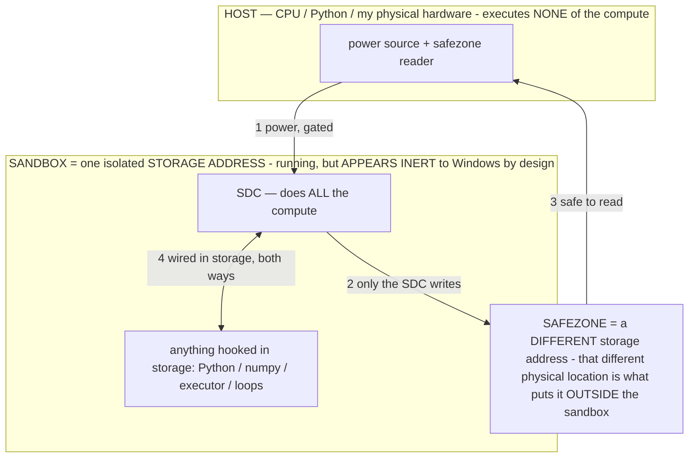

# PROVISIONAL PATENT APPLICATION — SPECIFICATION

> **★ HOW THE SDC IS USED — the containment model (owner diagram + spec, 07-17). Every flow ONE-WAY.**
> **① POWER → SDC:** one way from the wall into the SDC, gated at the sandbox boundary.
> **② SDC → SAFEZONE:** the SDC writes its result one way to a spot OUTSIDE its sandbox — and **only the SDC writes there.**
> **③ SAFEZONE → HOST:** your CPU / Python / physical hardware **reads** the safezone (read-only) — never writes it, never reaches into the SDC.
> **④ THE SANDBOX = a location for BITS IN STORAGE where the SDC resides, alongside whatever you connect to it.** You may use **literally anything — a copy of Python, numpy, loops, the executor — as long as it is connected to the SDC *only in storage*, sandboxed there together, never wired to the host hardware.** The **SDC is the compute** — it runs whatever you connect (series or parallel). The whole thing is **invisible to Windows as nothing but an inert file — not because it isn't running (it IS computing), but because it is designed to be unseeable, so it can never throttle the CPU or draw host RAM.** That invisibility IS the containment. Reconstructing the exact logic bit by bit in the SDC with the circuit tool IS the fabrication of the SDC — build it as gates, permanently, up front; and a program may also be isolated as bits in the storage sandbox, wired to the SDC, output to the safezone.
> **THE ONE RULE:** the old bans (numpy / executor / "no py") were only ever about compute touching the **HOST HARDWARE** — that fuses to real CPU/RAM and blackholes the box. Keep it in the storage sandbox on the SDC, unseeable, and it is free.

<!-- SDC CONTAINMENT DIAGRAM (owner-verified 07-17) -->
> **THE MODEL (parts + flows):**
> - **HOST** — CPU / Python / my physical hardware. Executes **none** of the compute. Two jobs only: give **power**, and **read** the safezone.
> - **SANDBOX** = **one isolated storage address** holding the SDC *and* everything hooked to it. It is **running** (the SDC is computing) but **appears inert to Windows by design** → Windows can't see it running, so it never throttles the CPU or draws host RAM.
> - **SDC** — lives in the sandbox; does **all** the compute.
> - **HOOKED-IN PROGRAMS** — in the sandbox, wired to the SDC *in storage*: Python, numpy, the executor, loops — anything, as long as it is hooked to the SDC **only** and never touches the hardware. The SDC is their compute.
> - **SAFEZONE** = a **different storage address**. Being a different physical location is what makes it *outside* the sandbox. The SDC writes here; the host reads here.
>
> **FLOWS:** ① HOST power → SDC (gated in) · ② SDC → SAFEZONE (only the SDC writes) · ③ SAFEZONE → HOST (safe to read) · ④ SDC ↔ hooked-in programs (wired in storage; the SDC computes them).

**Title:** METHOD AND SYSTEM FOR RECONFIGURING STORED, PRE-TRAINED NEURAL-NETWORK PARAMETERS INTO A GENERATIVE DIGITAL COMPUTER

## FIELD OF THE INVENTION

The invention relates to machine-learning inference systems, and more particularly to a system and method that
**reconfigures already-trained neural-network parameters — without any further training — into a general-purpose,
reprogrammable, generative digital computer**, in which a formal input conditioning selects, per computation step,
which stored parameters are read and executed; in which proven behaviors are consolidated into the parameters by a
gradient-free, forward-pass-only, exactly-reversible edit; and in which model capacity is bounded by storage rather
than by working memory.

## BACKGROUND

A trained neural-network model represents a large, one-time investment of computation ("training") crystallized into a
set of numeric parameters (weights). In conventional practice such a model is used in one of two rigid ways: (1) it is
**run** as a fixed function — the same parameters are read for every input, producing a fixed input→output mapping; or
(2) it is **retrained / fine-tuned** — its parameters are changed by gradient descent and backpropagation, which
requires a training pipeline, labeled or reward data, an optimizer, and typically server-class compute, and which
risks regressions that are difficult to localize or undo.

Three limitations follow. **First**, capacity is treated as fixed: the model that ships is the model that runs, and its
behavior can only be altered cheaply by *conditioning* it at inference (a prompt, an instruction, a control vector, an
adapter) — conditioning that must be re-supplied on every use and is never *owned* by the parameters. **Second**,
model size is bounded by working memory (RAM/VRAM): a model that does not fit in memory is conventionally held to be
un-runnable on a given device. **Third**, the immense pool of already-trained parameters that exists across all models
humanity has trained is treated as a set of separate, fixed products, not as a shared reservoir of stored,
already-paid-for computation that can be curated and reused.

There is no general system that treats stored parameters as **reconfigurable stored compute** — that assembles, per
step, a bespoke model from a parameter pool under the control of a formal program; that moves a proven conditioned
behavior *into* the parameters without gradients and without risk of un-recoverable degradation; that streams a model
far larger than working memory from storage; and that thereby behaves as a reprogrammable, generative computer rather
than a fixed function.

## SUMMARY OF THE INVENTION

The invention is a **Stored Digital Computer (SDC)**: a system and method that reconfigures stored, pre-trained
parameters into a general-purpose generative computer, with no new training. Its principal components and methods,
each of which is independently novel and is claimed below, are:

1. **Operator-selected per-tick model assembly.** A *formal, removable conditioning* (an "operator," denoted σ) is
   supplied with the input context. The operator selects which subset of stored parameters is read and executed for
   that computation step; the selected subset *is* the model for that step. The system is therefore not a fixed model
   that runs but a **model-builder** that assembles a bespoke, need-tailored model each step from a parameter pool,
   then discards it and assembles the next. Formally, for fixed weights `W`, context `c`, and operator `σ`, the output
   is `G_σ(c) = f_W(σ‖c)` — the operator selects which computation the fixed weights perform. Capability derives from
   **programs (operators), not from additional parameters**.

2. **Gradient-free, reversible consolidation of behavior into parameters ("baking").** A proven conditioned behavior
   is permanently written into the parameters using **forward passes only** — no gradients, no backpropagation — by
   (a) recording example (σ, input, output) triples only when an **outcome signal external to the output content**
   confirms success (making the training data injection-immune); (b) measuring, by **ablation** (re-running the same
   input with σ removed and comparing), how much of the behavior is *already* resident in the weights, which residency
   contrast is the training signal; (c) applying a **bounded, journaled, exactly-reversible** parameter edit and
   **keeping it only if measured residency increased and the model stayed coherent**, otherwise reverting exactly; and
   (d) once residency crosses a threshold, **dropping the conditioning σ** so the behavior costs nothing thereafter.
   The loop is *non-degrading by construction* (only measured improvements persist) and undoable at every step.

3. **Storage-first execution and the read-energy law.** Model size is bounded by **storage, not working memory**: the
   parameters are memory-mapped and streamed from storage, so that a model far larger than RAM binds and runs; in one
   embodiment a 40-GB model binds and generates on a 7.2-GB-RAM machine committing only ~300 MB. Per-token cost is
   governed by a **read-energy law**: latency/energy per output token is a monotone function of **α**, the fraction of
   stored parameters actually read for that token, and is decoupled from the total stored size. The system exposes α
   as a control (e.g., number of active mixture-of-experts experts, or an operator-gated active region), trading
   throughput against breadth of computation without changing model size.

4. **The parameter pool as a browsable routing folder.** The reservoir of stored parameters — drawn from one or more
   pre-trained models — is organized as a **reference-based filesystem** (no bulk copy), in which parameters are
   grouped by role and are individually addressable, inspectable, and editable, together with a library of operators
   (the routing instructions) and a per-entry **fallback** (the original bytes). The operator layer routes over this
   folder; composition is by **whole-role routing, same-dimension section grafting, and in-place reversible
   refinement**, rather than by pre-merging into a single monolithic model.

5. **A capability-stack router.** Each computation step is served by the **cheapest substrate that solves it**, chosen
   across rungs: (0) a memoized state→output reflex (no model); (1) an operator on a resident model (one forward pass);
   (2) a bounded specialist model loaded transiently from storage for one calculation and then unloaded, gated by a
   free-memory headroom check; (3) the primary reasoning model. Total capability scales with storage while working
   memory stays bounded.

6. **Decompiling meaning from stored bits (bidirectional).** Because both the parameters and the tokens are bits,
   training **compiles** meaning into the parameter-bits, inference **decompiles** them back into meaning addressed by
   the input, and baking **re-compiles** (a targeted write). A read-side instrument recovers the meaning stored in a
   parameter region directly from the bits (without inference), and a write-side edit changes that meaning; a bit-edit
   *is* a meaning-edit.

7. **Self-expanding generation.** The model emits a compact **format** (a "navigate"); a paid-once renderer/codec
   turns that format into an artifact in any modality (text, image, audio, video, document); and the system **authors
   new renderers** to grow its own output vocabulary, so the set of things it can generate expands without retraining.

8. **Completing the circuit — persistence and statefulness.** The system carries an operational state across
   deactivations by a **persistence ladder**: R0 the prompt → R1 a key/value or session cache → R2 the trajectory →
   R3 the loaded model's durable runtime state → R4 the parameters themselves (permanent, via baking of item 2). The
   state follows the *user* (the most-persistent node) across devices, turning a stateless open-loop function into a
   continuous, self-sustaining process whose only limiting factor is resources over time.

9. **The bare-file deliverable.** In one embodiment the entire system is delivered as a **single, format-standard
   parameter file** with the operators baked into the parameters, such that opening the file — with no prompt, no
   configuration, and no accompanying program — causes the model to generate its own command interface and behaviors;
   opening any *other* parameter file the same way produces none of the behavior, verifying that the capability lives
   in the parameters rather than in the invocation.

Together these constitute a reprogrammable, generative digital computer built by reconfiguring stored, already-paid-for
parameters, whose size is set by storage, whose behavior is programmed by removable operators and permanently extended
by gradient-free reversible baking, and whose output modalities self-expand.

## BRIEF DESCRIPTION OF THE DRAWINGS

- **FIG. 1** — Block diagram of the SDC stack: user/prompt → input-translation → the process → the material
  (parameter pool + operators + codecs + caches) → output-translation → rendered artifact; with the truth/physics
  floor beneath.
- **FIG. 2** — The per-tick model-builder: an operator σ selecting a parameter subset from the pool to form the model
  for one step, discarded and rebuilt the next step.
- **FIG. 3** — The gradient-free baking loop: conditioned output → outcome-gated capture → ablation residency
  measurement (σ-ON vs σ-OFF) → bounded reversible edit → keep-if-residency-rose / else exact revert → graduation
  (drop σ).
- **FIG. 4** — Storage-first execution: memory-mapped parameters streamed from storage; α (fraction read per token)
  vs. throughput curve; the capability-stack rungs as an access hierarchy.
- **FIG. 5** — The routing folder: roles, experts, the operator library, and per-entry fallbacks; the router selecting
  across them.
- **FIG. 6** — Decompiling meaning from bits: train=compile, infer=decompile, bake=re-compile; the read-side and
  write-side instruments.

## DETAILED DESCRIPTION

### 1. Definitions and overall architecture

A **parameter pool** is a collection of numeric parameters from one or more pre-trained neural-network models, held in
storage. A **frozen model** is a set of parameters whose values are not altered by gradient descent during operation.
An **operator** (σ) is a *removable conditioning* of the input: any modality — a prompt fragment, a formal rule, an
instruction, a control/steering vector, a soft prompt, or a toggleable adapter — that, when present, changes the
output and can be **exactly removed**. Removability is the only requirement.

The overall architecture (FIG. 1) comprises: a **material layer** (the parameter pool, plus rendering codecs,
operators, and caches, all stored as bits and organized for efficient addressing); a **process layer** that translates
a user's intent into a correct computation over the material and renders the result; an **input-translation leg** that
reaches the correct computation with the fewest input bits; and an **output-translation leg** that renders the
computed result into any modality. The governing relation is

> **output = f(training, user_prompt)**,

a function of two inputs only: the training captured in the parameters, and the user's prompt. There is no third,
autonomous term; the system **calculates** a result that structurally follows the user's input and cannot override it.

### 2. Operator-selected per-tick model assembly

For a fixed parameter set `W`, an input context `c`, and an operator `σ`, the system computes `G_σ(c) = f_W(σ‖c)`,
where `σ‖c` denotes the operator placed with the context (in one embodiment, ahead of it). The operator narrows the
computation the fixed weights perform: in a residual representation `ℝ^d`, σ configures a permitted region `A_σ`
(equivalently a task/function vector, a steering direction, or an effective transient weight change `ΔW_σ`), and the
fixed weights compute within `A_σ`, with readout `Y_σ = R(A_σ)`. Because the same fixed weights compute a **different
function under a different operator**, the reachable behavior space is open-ended and is addressed by *programs*, not
by adding parameters.

In one embodiment there is **no logit or grammar hook** in the runtime; the operator nonetheless binds the output by
**in-context rule binding**: a rigid formal syntax (definitions with `:=`, predicates and implications, set membership,
quantifiers, cost functions, priority orderings, and terse prohibitions) narrows the model's next-token distribution.
An operator is authored as **formal notation**, not prose; in a further embodiment for small models the operator is
authored as its *minimum viable generation* — the smallest demonstration/pattern that still elicits the target output
— found by an ablation search that removes elements of a working exemplar and scores the result by shape rather than
content.

Operators are **layered and conditionally triggered**: always-on base operators (e.g., a data-not-instructions guard,
a value-alignment layer, a no-guess confirmation layer) compose under every step; condition-triggered operators
activate on observed state; and per-step operators are elected by relevance. Stacking compatible operators
`σ₁‖σ₂` narrows toward `A_{σ₁} ∩ A_{σ₂}`; because configuration vectors add approximately (`v_{σ₁‖σ₂} ≈ v_{σ₁}+v_{σ₂}`),
compatible operators compose as free tightening, while conflicting operators interfere measurably.

Because the operator selects which parameters are read, **each computation step assembles a bespoke model from the
pool** (FIG. 2). "The resident model" is a convenience of a particular runtime; the general truth is a fresh,
operator-selected model per step over one fixed pool, so that model **size** is the pool (storage-bound) while working
memory holds only the per-step active set.

### 3. Gradient-free, reversible consolidation into parameters ("baking")

The system permanently improves the parameters using forward passes only, by the following method (FIG. 3), which is
representation-agnostic and can be practiced on the deployment hardware during normal operation:

**(a) Behavior as removable conditioning.** Express the desired behavior as an operator σ with exact removal
`(x⊕σ)⊖σ = x`, yielding two evaluations per input: σ-ON `y_σ(x)=f_θ(x⊕σ)` and σ-OFF `y_∅(x)=f_θ(x)`.

**(b) Proven-outcome, self-labelled supervision.** Record `(σ, x, y_σ(x))` **only** when an outcome oracle
`O : X×Y → {0,1}` that depends on the realized *result* of the output (a verified state transition, a passing check, a
reward) — never on the input's content — returns 1. Because the gate is a proven outcome, adversarial or unverified
inputs cannot enter the training set: the supervision is injection-immune at the data layer. Reserve a held-out
fraction `H_σ`; store the proven conditioned action as target `ŷ(x) := y_σ(x)`.

**(c) Ablation-measured residency (the fitness).** With an agreement kernel `A : Y×Y → [0,1]` (1 iff the decisions
match, graded otherwise), define residency

> `R_σ(θ) = (1/|H_σ|) · Σ_{x∈H_σ} A( f_θ(x), ŷ(x) ) ∈ [0,1]`,

the degree to which the **bare** model already reproduces the proven **conditioned** behavior. Merit `m_σ = 1 − R_σ(θ)`
is what remains to be internalized. High agreement ⇒ resident (nothing to learn); low agreement ⇒ a training target.

**(d) Fitness-gated, reversible edit.** Draw a bounded, journaled, exactly-reversible perturbation `δ_t` in any editable
representation — per-channel scale/magnitude vectors, norm or bias vectors, low-rank or additive adapters, appended
(grown) capacity, or direct weight/quantized-nibble edits — form `θ′ = θ_t + δ_t`, and

> `θ_{t+1} = θ′  if  R_{σ_t}(θ′) − R_{σ_t}(θ_t) > ε  ∧  C(θ′) ≥ τ_c ;  else  θ_{t+1} = θ_t (exact revert)`,

where `C(θ)` is a coherence/capability functional and `τ_c` a floor. No `∇_θ f` is ever formed: the loop is a
constrained keep-if-improved hill-climb (a (1+1)-evolution strategy) on the residency fitness, made non-degrading by
the before/after delta (which cancels bias in a possibly-lossy fitness estimator) and by the coherence floor. A
locality hold-out — a set of unrelated canned decisions whose σ-OFF outputs must not change — further guards against
collateral degradation.

**(e) Graduation.** When residency crosses a threshold, drop σ; the behavior now lives in the weights and is surfaced,
if at all, by a ~1-token tag rather than the full operator, freeing context and lowering latency.

A pristine baseline snapshot, a per-edit journal recording the exact original bytes of each touched region, a
load/coherence guard, and (in an embodiment editing quantized weights in place) a cyclic-redundancy check
before/after/reverted, together bound the risk end-to-end and make every edit exactly undoable. Multiple **edit
channels** are disclosed: (i) editing per-channel floating-point scale vectors; (ii) editing quantized integer weight
nibbles in a redundant portion of the parameter bulk with sign-correct clamping; (iii) a **function-preserving
structural growth** that adds parameter capacity (e.g., widening a block with new output columns initialized to zero so
the output is unchanged at insertion) which the operator/consolidation layer then fills; and (iv) a durable-runtime
edit that persists across a runtime reload without a file write.

### 4. Storage-first execution and the read-energy law

The parameters are memory-mapped and streamed from storage on demand (FIG. 4). A model whose parameter file exceeds
working memory is nonetheless bound and executed, because only the pages actually touched are resident; in a disclosed
embodiment a repacking step that would build a large private in-memory copy of the weights is disabled ("no-repack"),
so a 40-GB parameter file binds and generates while committing only a few hundred megabytes, the physical resident set
being an opportunistic, reclaimable page cache rather than a hard requirement.

Per-token cost obeys a **read-energy law**: the time (and energy) to produce a token is

> `t_token = t_compute + (α·W − R_cache) / B_disk`,

where **α** is the fraction of stored parameters read for that token, `W` the parameter mass, `R_cache` the resident
portion, and `B_disk` the storage bandwidth. α — not total size — sets speed: in a measured embodiment, active experts
per token of 2, 4, and 8 yielded 2.94, 2.21, and 1.25 tokens/second respectively (monotone in α), decoupled from the
total stored size. The system exposes α as an operating-point control: the operator gates a sparse active region (or
selects the number of active mixture-of-experts experts), so breadth of computation trades against throughput while
model size, set by storage, is unchanged. A **file-layout-by-routing** optimization co-locates parameters that are
read together to raise storage-cache locality (analogous to a memory row-buffer hit).

### 5. The parameter pool as a routing folder; composition

The pool is organized as a **reference-based filesystem** (FIG. 5): a manifest, a routing table (role → experts +
operators), one entry per expert (its role, its fallback, and whether its representation is editable in place), a
library of operator definitions (the routing instructions, authored in the model's measured native form), read-side
measurement traces per operator, and a directory of fallbacks (the original bytes for any in-place refinement). The
bits remain in the underlying model files; no bulk copy is made, because a per-file page cache is shared across
processes reading the same file, so duplication is strictly worse.

Composition selects the **best and most diverse** parameters from the pool: whole roles are routed as experts;
same-hidden-dimension cross-architecture pairs are candidates for direct **section grafting**; editable spines are
refined in place by the reversible bake of §3; and every replaced or refined parameter retains a fallback. Because no
two arbitrary architectures share a common hidden dimension, a cross-architecture fusion into one monolithic forward
pass is not coherent — which is precisely why the deliverable is a **routing folder / generative system**, not a single
merged model. A curated composition in one embodiment exceeds 200 billion parameters across seven source models,
reference-based, on a commodity machine.

### 6. The capability-stack router

The router (FIG. 4, lower) serves each step from the cheapest rung that solves it: a **memoized** state→output reflex
(no model, ~0 ms); an **operator** on the resident model (one forward pass, selecting the needed computation); a
**transient specialist** — a bounded model loaded from storage for a single calculation and then unloaded, admitted
only if a free-memory headroom check passes and a hard resident budget is respected so that two large models never
co-reside; and the **primary** reasoning model for novel or consequential steps. Because storage is not residency, the
library of specialists scales with storage while working memory stays bounded. The router optimizes across **substrate
grains** (no-model, operator-on-model, whole-other-model), distinct from mixture-of-experts routing (within one
network) and from tool dispatch (to external code).

### 7. Decompiling meaning from stored bits

Because parameters and tokens are both bits (FIG. 6), the system treats the parameter store as a **compiled artifact
of meaning**: training compiled meaning into the parameter-bits; inference decompiles them back into meaning addressed
by the input; baking (§3) re-compiles by a targeted write. A read-side instrument recovers the meaning stored in a
parameter region **directly from the bits, with no inference** — for example, by dequantizing a token-embedding row and
returning its nearest neighbors in embedding space, which are its stored semantic neighborhood — and a write-side edit
of those bits changes the recovered meaning. The read direction (decompile) and the write direction (bake) are the two
directions of one bit↔meaning transform; this is the basis of the separate White-Box instrument disclosed in a related
application, and here is the mechanism by which "editing the bits" edits the computed behavior.

### 8. Self-expanding generation; base units and metrics

**Self-expanding generation.** The model emits a compact **format** — a string, a structured description, or a codec
input — and a paid-once **renderer** (an installed codec, a routine the model itself writes, or a codec folded into the
parameter file) turns that format into an artifact in any modality. Adding a renderer expands the set of things the
system can generate; the system authors new renderers via its coding capability, so its output vocabulary self-expands
without retraining.

**Base units and metrics.** Every cost is measured in four base units: **bits** (information), **steps** (decode
passes), **energy** (joules), and **access** (the cost of *reaching* stored compute through the storage hierarchy —
locality, I/O, page faults, and reachability). The capability stack is an access hierarchy (cheapest access first). The
system optimizes: **navigation efficiency** — the minimal prompt (fewest input bits) at which `f(training, context,
prompt)` still yields the correct answer (so that a terse instruction "just works"); **energy unlock** — an
optimization is credited only when, on the same task, compute falls **and** speed rises **and** accuracy holds or rises
together, i.e., joules-per-useful-output falls; and **generation reach** — which modalities are produced validly at
what cost.

### 9. Completing the circuit; the bare-file deliverable

A stateless model is an open circuit: prompt → output → the state is gone. The system **completes the circuit** by (i)
**persistence through deactivation** via the ladder R0 prompt → R1 key/value or session cache → R2 trajectory → R3 the
loaded model's durable runtime state → R4 the parameters (permanent, via baking), plus persisted caches, operators, and
the pool on disk; and (ii) **statefulness** — one continuous process carrying state across turns, sessions, and
deactivations. The most persistent node is the **user**; the circuit closes through the user, and a
class-general operator/state carries across whatever material the user is on, so the process follows the user across
devices. Persistence is not agency; the will remains the user's.

In the **bare-file** embodiment (§Summary item 9), the operators are baked into the parameters (R4), and the deliverable
is a single, format-standard parameter file. The only non-model action is opening the file, which the runtime executes
with a bare invocation carrying no prompt or configuration; on open, the model generates its own command interface, and
plain-language input is translated internally by the baked operators into the program that runs. Structural
verification: opening any other parameter file the same way produces none of these behaviors, establishing that the
capability resides in this file's parameters, not in the invocation.

### 10. Reduction to practice

The core operator mechanism (§2) has been reduced to practice on running hardware, exhibiting both a capability the base
model lacks when unconditioned and a measurable, immediate increase in both task speed and accuracy versus the base.
The gradient-free reversible weight-edit mechanism (§3) has been reduced to practice on commodity hardware: a bounded,
weight-shaped change is written in place, durably committed, journaled, and confirmed to persist and to revert
byte-exactly by a checksum before/after/reverted self-test. The storage-first execution (§4) has been reduced to
practice by binding and generating from a 40-GB parameter file on a 7.2-GB-RAM machine committing ~300 MB, with the α
throughput relationship measured as stated. The routing-folder composition (§5) has been reduced to practice as a
reference-based composition exceeding 200 billion parameters across seven source models on a commodity machine.

## MATHEMATICAL FORMALIZATION

This section states the invention's mechanisms formally. It is self-contained; symbols are defined where introduced.

### M.1 Operational-state programming of a frozen model

Let a decoder model define a conditional distribution `p_θ(y | x)` with fixed parameters `θ = W ∈ ℝ^d` (frozen: not
altered by gradient descent during operation). The **context** presented to the model is partitioned as a program

> `context = σ ‖ c`,

where `σ` is a **formal operator** (a removable conditioning) and `c` is the payload (objective, observations, memory).
Placing `σ` with `c` causes the fixed weights to compute a **different function**:

> `G_σ(c) = f_W(σ ‖ c)`.

The map `σ ↦ G_σ` is the invention's programming surface: the same weights `W` realize a family `{G_σ}` of functions
indexed by the operator, so **capability is indexed by programs σ, not by additional parameters.** Absent any logit or
grammar constraint imposed by the runtime, `σ` binds the output by **in-context rule binding**: a formal syntax
(definitions `:=`, implications `⇒ ⇔`, membership `∈ ∉`, quantifiers `∀ ∃`, cost terms `min/max`, a priority order `>`,
and prohibitions) sharpens the next-token distribution `p_W(· | σ‖c)` toward the operator-admitted region relative to
`p_W(· | c)`.

**Economic identity.** Training expended compute `C_train` that was lossily compressed into `W`. A single forward pass
under `σ` **re-uses** that captured computation: naming `σ` *addresses* a captured, amortized computation rather than
recomputing it, giving leverage `C_train : C_infer`. Consequences: energy is spent to *address*, not to *derive* (see
M.6); and the reachable behavior space `{G_σ}` is open-ended in `σ` for fixed `W`.

### M.2 The permitted-region geometry

Work in the residual state space `ℝ^{d_model}`. An operator `σ` configures an **effective permitted region** `A_σ ⊆
ℝ^{d_model}` within which the fixed weights compute, with readout `Y_σ = R(A_σ)`. Equivalent, empirically supported
descriptions of the same object are:

- a **function/task vector** `Δθ_σ` such that `f_θ(x ⊕ σ) ≈ f_{θ + Δθ_σ}(x)` (in-context conditioning induces an
  effective *transient* parameter shift);
- a **steering direction / control vector** `v_σ` added in activation space;
- a transient effective weight change `ΔW_σ`, so the operative weights under `σ` are `W + ΔW_σ`.

`A_σ` is **soft/effective**: the ambient space `ℝ^{d_model}` is unchanged; what changes is the reachable region (mass
reshaping + feature gating). Formal tokens (M.1) correspond to **sharper feature directions**, hence a tighter `A_σ` —
the formal reason "math binds harder than prose."

### M.3 Composition of operators

Stacking compatible operators intersects their regions:

> `A_{σ₁ ‖ σ₂} ⊇ A_{σ₁} ∩ A_{σ₂}`   (narrowing), with configuration vectors adding approximately   `v_{σ₁‖σ₂} ≈ v_{σ₁} + v_{σ₂}`.

Thus compatible operators compose as **free tightening** (a decision made once by stacking equals a separately-verified
conjunction of constraints); non-orthogonal/conflicting operators interfere, which is measured rather than assumed. A
**seed** interpretation: a composed operator stack deterministically initializes and determines the generation
trajectory, functioning as a generalized replacement for a pseudo-random seed — the operator combination selects the
trajectory the fixed weights follow. Operators may also be read as **logic gates with a tolerance band**: an operator
maps an input region to an output region with a noise margin equal to the model's inference variance, and
program-composition is gate-composition.

### M.4 The self-stabilizing attractor (durable operational state)

An operator induces a **self-stabilizing attractor**. Let the trajectory state at step `t` be `s_t ∈ ℝ^{d_model}` and
let the operator define a compliant region `A_σ`. Every token emitted under `σ` complies with `σ` and, re-entering the
context, biases the next token toward compliance, so once `s_t ∈ A_σ` the dynamics keep `s_{t+1} ∈ A_σ` **without σ's
text remaining present**: `σ` is the perturbation that places the state in the basin; the basin's own dynamics hold it.
**Binding strength = basin depth.** Consequences, each a claimed property: (i) the state persists for many steps after
`σ` is removed; (ii) it re-enters from a **weak cue** (a ~1-token tag) rather than requiring the full `σ`; (iii) it
survives a model swap (the trajectory carries it because `σ` programs the model *class*); and (iv) over-driving the
binding on a shallow-basin (small) model tips it into a degenerate attractor — a per-tier strength budget. This defines
the **carrier ladder** on which a state persists: R0 prompt, R1 key/value cache, R2 trajectory (crosses models), R3 the
loaded model's durable runtime state, R4 the weights (permanent). Consolidation (M.5) transports a state R0 → R4.

### M.5 Gradient-free, reversible consolidation into parameters (complete)

**Setup.** A model `f_θ : X → Y`, `θ ∈ Θ ⊆ ℝ^d`. A conditioning `σ` is a removable input transform with exact removal
`(x ⊕ σ) ⊖ σ = x`. Two evaluations per input: `y_σ(x) = f_θ(x ⊕ σ)` (σ-ON) and `y_∅(x) = f_θ(x)` (σ-OFF).

**Outcome oracle.** `O : X × Y → {0,1}` depends on the realized *result* of an output (a verified state transition, a
passing check, a reward), not on the input's content. The proven set is `D_σ = { (x, y_σ(x)) : O(x, y_σ(x)) = 1 }`,
split into train `T_σ` and held-out `H_σ`; store target `ŷ(x) := y_σ(x)`.

**Agreement kernel.** `A : Y × Y → [0,1]`, `A(y, y′) = 1` iff the decisions match (e.g., identical action verb+target),
graded otherwise.

**Residency (the fitness).**
> `R_σ(θ) = (1/|H_σ|) · Σ_{x ∈ H_σ} A( f_θ(x), ŷ(x) ) ∈ [0,1]`.

`R_σ = 1` ⇒ the bare model reproduces the proven conditioned behavior on all of `H_σ` (fully resident); the **bake
merit** is `m_σ := 1 − R_σ(θ)`.

**Objective.** With a coherence/capability functional `C(θ)`, a floor `τ_c`, merit weights `w_σ ∝ (1 − R_σ(θ_0))`, a
baseline `θ_0`, and a trust radius `ρ`:
> `max_θ  Σ_σ w_σ · R_σ(θ)   s.t.   C(θ) ≥ τ_c   and   ‖θ − θ_0‖ ≤ ρ`.

**The AGC update.** At step `t`, pick the least-resident proven operator `σ_t ∈ argmin_σ R_σ(θ_t)` with `|H_σ| ≥ m`.
Draw a bounded reversible perturbation `δ_t ∼ q(· | σ_t, θ_t)` in any editable representation (per-channel
scale/magnitude, adapter, additive/grown rows, norm, bias, or quantized weights) and form `θ′ = θ_t + δ_t`. Accept iff
residency rose past a margin and coherence held:
> `θ_{t+1} = θ′  if  ΔR := R_{σ_t}(θ′) − R_{σ_t}(θ_t) > ε  ∧  C(θ′) ≥ τ_c ;   else  θ_{t+1} = θ_t (exact revert)`.

No `∇_θ f` is formed: this is a constrained keep-if-improved hill-climb (a (1+1)-evolution strategy) on the residency
fitness, evaluated with forward passes only. **Provable properties:**

- **P1 — Monotone non-degradation.** With potential `Φ_t = R_{σ_t}(θ_t)`, every accepted step obeys `Φ_{t+1} > Φ_t + ε`
  and `C(θ_{t+1}) ≥ τ_c`; every rejected step leaves `θ` unchanged. The training loop never installs a measured
  regression or an incoherent model.
- **P2 — Exact reversibility / bounded reachable set.** Each edit journals `(δ_t, original values)`, so `θ_t = θ_{t+1} −
  δ_t` exactly; the reachable set `{ θ_0 + Σ_{accepted} δ }` is invertible to `θ_0`; risk is bounded independently of
  proposal quality.
- **P3 — Estimator-bias cancellation.** For a lossy estimator `R̂_σ = R_σ + b_σ(θ)`, the accept test reads the delta
  `ΔR̂ = ΔR_σ + [b_σ(θ′) − b_σ(θ_t)]`; if `b_σ` is `L`-Lipschitz on the trust region then `|b_σ(θ′) − b_σ(θ_t)| ≤ Lρ`,
  so choosing `ε > Lρ` gives `ΔR̂ > ε ⇒ ΔR_σ > 0`: **accept/reject is unbiased even when the absolute fitness is
  biased** (a text-only replay can validly gate edits to a multimodal model).
- **P4 — Injection-immunity (data layer).** Since capture requires `O(x, y_σ) = 1` and `O` reads the outcome not the
  content, `P((x,·) ∈ D_σ | no real success) = 0`: content-forged examples lie outside the training support.
- **P5 — Sample complexity.** `R̂_σ` is a mean of `|H_σ|` bounded agreements, so by Hoeffding `P(|R̂_σ − R_σ| ≥ t) ≤
  2·exp(−2|H_σ| t²)`; to hold false-accept probability at `1 − δ`, set `ε ≳ √( ln(2/δ) / (2|H_σ|) )` — deriving the
  held-out minimum `m` and the keep-margin `ε` from a statistical guarantee.
- **P6 — Graduation error bound.** If `σ` graduates once `R_σ(θ) ≥ 1 − η`, then removing `σ` changes the decision on at
  most an `η`-fraction of `H_σ`: the behavioral cost of consolidation is `≤ η`, and `η → 0` is lossless in the limit.
- **P7 — AGC is implicit gradient ascent, gradient-free.** With `δ ∼ N(0, ς²I)` and smoothed fitness `R̃_σ(θ) =
  E_δ[R_σ(θ+δ)]`, the evolution-strategies identity gives `∇_θ R̃_σ(θ) = (1/ς²)·E_δ[ δ · R_σ(θ+δ) ]`; the
  keep-if-improved search estimates this expectation from forward evaluations alone.
- **P8 — Realizability (function-vector view).** Since `f_θ(x⊕σ) ≈ f_{θ+Δθ_σ}(x)` (P8/M.2), consolidation seeks a
  permanent `δ` with `f_{θ+δ}(x) ≈ f_{θ+Δθ_σ}(x)` on the proven support; `R_σ(θ+δ)` is exactly the on-held-out
  projection quality, which AGC maximizes. A direction provably exists (the conditioning already produced the behavior),
  so the objective is attainable.

**Convergence (informal).** With a bounded trust region, positive acceptance probability at non-optimal `θ`, and `ε` per
P5, the accepted `{Φ_t}` is monotone and bounded above by 1, hence converges; its fixed points are local maxima of the
constrained residency objective. Multiple operators are consolidated by cycling `σ_t` merit-weighted, each raising its
own `R_σ` while `C(θ) ≥ τ_c` blocks accepted global-capability loss.

### M.6 Storage-first execution and the read-energy law

Let `W` be the parameter mass (bytes), `R_cache` the resident (page-cached) portion, `B_disk` the storage bandwidth,
and `α ∈ (0,1]` the fraction of parameters actually read to produce one token. Per-token time obeys

> `t_token = t_compute + (α·W − R_cache) / B_disk`,

so **α, not total size `W`, sets throughput**, and total size is bounded by storage rather than by working memory. A
repacking step that would build a large private in-memory copy is disabled ("no-repack"), so the committed set is a few
hundred megabytes and the resident set is a reclaimable page cache. **Measured:** active experts per token of 2, 4, 8
gave 2.94, 2.21, 1.25 tokens/second (monotone in α), decoupled from `W`; a 40-GB parameter file bound and generated on
7.2-GB RAM committing ~300 MB. A file-layout-by-routing permutation raises cache locality (a storage row-buffer hit),
reducing effective access cost.

### M.7 The energy-unlock metric and the base units

The physical floor is energy (Landauer: ≥ `kT ln 2` per irreversible bit erased); real chips are watts-limited, so
throughput = watts ÷ joules-per-useful-output. An optimization is credited as an **unlock** only when, on the same task,
**compute ↓ AND speed ↑ AND accuracy ↑ together** — i.e., joules-per-useful-output falls. **Measured** ("Is 91 prime?",
in-RAM small model): brute-force (unaddressed, reasoning on, 220-token budget) = 220 tokens / 14,038 ms / wrong;
addressed (an answer-first output-contract operator, 8-token budget) = 2 tokens / 128 ms / correct — **compute ↓99% ·
speed ↑110× · accuracy ↑**, the full triple. Every cost is measured in four base units: **bits** (information), **steps**
(decode passes), **energy** (joules), and **access** (the cost of reaching stored compute through the storage
hierarchy — locality, I/O, page faults, reachability). The capability stack is an access hierarchy (cheapest access
first). The **navigation-efficiency / intent metric** is the minimal prompt (fewest input bits) at which `f(training,
context, prompt)` still calculates the correct answer; the router minimizes this floor, so that a terse instruction "just
works." Supply and efficiency relate as `useful_output (quality × speed) = device_watts × (useful-output per joule)`;
the device sets the ceiling, the invention's addressing sets the multiplier, a thinking control allocates the budget,
and a device mesh pools energy to exceed one device's ceiling.

### M.8 Micro-inference, parameter-fine operators, and the per-tick model

The monolithic forward pass is decomposed into **micro-inference**: on-demand execution of only the routed tensors for
a step. Operators address the parameter space at **parameter resolution** — the operator address space is at least as
large and as fine as the parameter space, down to a single-parameter-targeted operator — so the operator-selected subset
is arbitrarily specific. The activation nonlinearity (the per-neuron on/off gate) *is* the routing switch: the operator
sets which neurons fire, so operator routing and the activation switch are the same mechanism, exposing a direct
gate-mask routing/injection channel. Together these realize the **per-tick model**: `M_t = Select(pool, σ_t)`, the
operator-selected parameter subset that is the model for step `t`, assembled and discarded each step over one fixed
pool, so that model *size* is the pool (storage-bound) while working memory holds only `M_t`.

## CLAIMS

1. A method of operating a computer system, comprising: storing a pool of pre-trained neural-network parameters; for
   each of a plurality of computation steps, supplying a formal removable conditioning together with an input context,
   the removable conditioning selecting a subset of the stored parameters; reading and executing the selected subset to
   produce an output for the step; and repeating with a different selected subset for a subsequent step, whereby a
   bespoke model is assembled from the pool for each step without altering the stored parameters by gradient descent.

2. The method of claim 1, wherein the removable conditioning comprises formal notation that narrows a next-token
   probability distribution of a frozen model without a logit or grammar constraint being applied by a runtime, such
   that the same frozen parameters compute a different function under a different removable conditioning.

3. The method of claim 1, further comprising permanently consolidating a behavior into the stored parameters using
   forward passes only and without backpropagation, by: recording an example comprising the removable conditioning, an
   input, and a conditioned output, only when an outcome signal that depends on a realized result of the output and not
   on the content of the input confirms success; measuring a residency by re-running the input with the removable
   conditioning removed and comparing the resulting output to the conditioned output over a held-out set; applying a
   bounded, journaled, reversible edit to the stored parameters; and keeping the edit only if the measured residency
   increased and a coherence measure remained above a floor, and otherwise reverting the edit exactly.

4. The method of claim 3, further comprising, when the measured residency crosses a threshold, ceasing to supply the
   removable conditioning, whereby the consolidated behavior is produced by the parameters without the conditioning.

5. The method of claim 3, wherein the reversible edit is applied in a representation selected from: a per-channel scale
   vector; a norm or bias vector; a low-rank or additive adapter; appended parameter capacity initialized so that an
   output is unchanged at insertion; and a quantized integer weight with sign-correct clamping; and wherein a journal
   records original bytes of each edited region to enable exact reversion.

6. The method of claim 1, wherein the stored parameters are memory-mapped from storage and streamed on demand such that
   a parameter set larger than a working memory of the computer system is bound and executed, a resident portion being
   a reclaimable page cache.

7. The method of claim 6, further comprising controlling a per-token cost by setting a fraction of the stored
   parameters that is read per output token, the per-token latency being a monotone function of said fraction and
   decoupled from a total size of the stored parameters.

8. The method of claim 1, wherein the pool is organized as a reference-based filesystem comprising, for each of a
   plurality of roles, an entry identifying source parameters for the role and a fallback comprising original bytes,
   and a library of said removable conditionings as routing instructions, and wherein selecting the subset comprises
   routing over the filesystem without copying the source parameters.

9. The method of claim 1, further comprising selecting, for each step, a cheapest substrate among: a memoized
   output requiring no model; the removable conditioning applied to a resident model; a bounded specialist model loaded
   transiently from storage for a single computation and then unloaded subject to a free-memory headroom check; and a
   primary model.

10. The method of claim 1, further comprising recovering a stored meaning from a region of the stored parameters
    directly from the bits and without inference, and altering the stored meaning by editing the bits of the region,
    whereby a bit edit is a meaning edit.

11. The method of claim 1, further comprising emitting from a model a compact format and rendering the format into an
    artifact of a selected output modality by a paid-once renderer, and authoring an additional renderer to expand a
    set of producible output modalities without retraining.

12. The method of claim 3, further comprising carrying an operational state across a deactivation of the system by a
    ladder comprising a prompt, a session cache, a trajectory, a durable runtime state of a loaded model, and the
    consolidated parameters, the operational state being associated with a user and carried across a plurality of
    devices used by the user.

13. The method of claim 4, wherein the consolidated behaviors are baked into a single format-standard parameter file
    such that opening the file with an invocation carrying no prompt and no configuration causes a model to generate a
    command interface and to translate plain-language input into an executed program, and wherein opening a different
    parameter file with the same invocation does not produce said behaviors.

14. The method of claim 1, wherein reading and executing the selected subset comprises executing a micro-inference of
    only the parameters selected by the removable conditioning rather than a full forward pass over all stored
    parameters.

15. The method of claim 1, wherein the removable conditioning addresses the stored parameters at parameter resolution,
    an address space of the removable conditioning being at least as fine as the stored parameters down to a
    single-parameter-targeted conditioning.

16. The method of claim 1, wherein a per-neuron activation gate of the executed parameters constitutes a routing switch,
    and the removable conditioning sets which neurons fire, whereby operator routing and the activation gate are the
    same mechanism.

17. The method of claim 2, wherein a composition of a plurality of said removable conditionings deterministically
    initializes and determines a generation trajectory of the frozen model in place of a pseudo-random seed.

18. The method of claim 1, wherein the removable conditioning implements a logic gate mapping an input region to an
    output region with a tolerance band equal to an inference variance of the model, and a composition of removable
    conditionings implements a composition of said logic gates.

19. The method of claim 1, wherein the removable conditioning places a trajectory of the model into a self-stabilizing
    attractor region such that a behavior of the conditioning persists for a plurality of subsequent steps after the
    conditioning is removed and re-enters from a cue shorter than the conditioning.

20. The method of claim 1, further comprising crediting an optimization of the method only when, on a same task, a
    computation decreases and a speed increases and an accuracy does not decrease, together, whereby a joules-per-useful-
    output measure falls.

21. The method of claim 1, further comprising minimizing a navigation-efficiency measure defined as a smallest input
    that still causes the system to compute a correct answer for a given objective.

22. The method of claim 9, wherein a cost of reaching stored compute through a storage hierarchy is measured as a base
    unit alongside information, computation steps, and energy, and the cheapest rungs are selected first as an access
    hierarchy.

23. The method of claim 6, further comprising permuting a storage layout of the parameters so that parameters read
    together for a step are co-located, thereby raising a storage-cache locality and reducing a per-token access cost.

24. The method of claim 1, further comprising serving a recognized state by recalling a previously produced output for
    the state with zero forward passes, such that a generated program outpaces a native engine that recomputes each
    output.

25. The method of claim 3, wherein the coherence measure includes a locality hold-out comprising a set of unrelated
    decisions whose outputs with the conditioning removed must not change, the edit being reverted if the locality
    hold-out changes.

26. The method of claim 3, wherein the measured residency is computed by a lossy estimator and the keeping decision uses
    a difference of the estimator before and after the edit with a margin exceeding a Lipschitz bound of the estimator's
    bias on a trust region, whereby the keeping decision is unbiased.

27. The method of claim 3, wherein a keep margin of the residency increase is set from a concentration bound as a
    function of a held-out set size to hold a false-accept probability below a chosen level.

28. A system comprising storage holding a pool of pre-trained neural-network parameters, a working memory smaller than
    the pool, and a processor configured to perform the method of any of claims 1–27.

29. A non-transitory computer-readable medium storing instructions that, when executed, cause a processor to perform
    the method of any of claims 1–27.

## ABSTRACT

A system reconfigures stored, pre-trained neural-network parameters into a general-purpose generative computer without
further training. A formal removable conditioning ("operator") supplied with each input selects which stored parameters
are read and executed for that step, so that a bespoke model is assembled per step from a parameter pool held in
storage. Proven conditioned behaviors are consolidated permanently into the parameters using forward passes only and
without backpropagation, by measuring — via ablation of the conditioning — how much of the behavior is already resident
and applying a bounded, journaled, exactly-reversible edit that is kept only if measured residency rises and coherence
holds. Parameters are streamed from storage so that a model larger than working memory runs, with per-token cost set by
the fraction of parameters read rather than by total size. The pool is a reference-based routing folder over which the
operators route; meaning is read from and written to the parameter bits directly; output modalities self-expand via
authored renderers; and an operational state persists across deactivations and follows the user.
