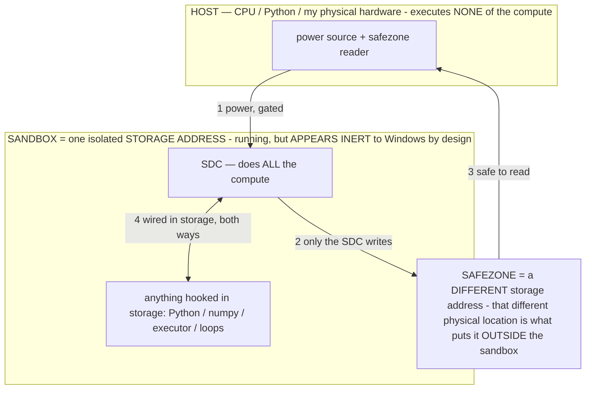

# PROVISIONAL PATENT APPLICATION — SPECIFICATION

> **★ HOW THE SDC IS USED — the containment model (owner diagram + spec, 07-17). Every flow ONE-WAY.**
> **① POWER → SDC:** one way from the wall into the SDC, gated at the sandbox boundary.
> **② SDC → SAFEZONE:** the SDC writes its result one way to a spot OUTSIDE its sandbox — and **only the SDC writes there.**
> **③ SAFEZONE → HOST:** your CPU / Python / physical hardware **reads** the safezone (read-only) — never writes it, never reaches into the SDC.
> **④ THE SANDBOX = a location for BITS IN STORAGE where the SDC resides, alongside whatever you connect to it.** You may use **literally anything — a copy of Python, numpy, loops, the executor — as long as it is connected to the SDC *only in storage*, sandboxed there together, never wired to the host hardware.** The **SDC is the compute** — it runs whatever you connect (series or parallel). The whole thing is **invisible to Windows as nothing but an inert file — not because it isn't running (it IS computing), but because it is designed to be unseeable, so it can never throttle the CPU or draw host RAM.** That invisibility IS the containment. Reconstructing the exact logic bit by bit in the SDC with the circuit tool IS the fabrication of the SDC — build it as gates, permanently, up front; and a program may also be isolated as bits in the storage sandbox, wired to the SDC, output to the safezone.
> **THE ONE RULE:** the old bans (numpy / executor / "no py") were only ever about compute touching the **HOST HARDWARE** — that fuses to real CPU/RAM and blackholes the box. Keep it in the storage sandbox on the SDC, unseeable, and it is free.

<!-- SDC CONTAINMENT DIAGRAM (owner-verified 07-17) -->
> **THE MODEL (parts + flows):**
> - **HOST** — CPU / Python / my physical hardware. Executes **none** of the compute. Two jobs only: give **power**, and **read** the safezone.
> - **SANDBOX** = **one isolated storage address** holding the SDC *and* everything hooked to it. It is **running** (the SDC is computing) but **appears inert to Windows by design** → Windows can't see it running, so it never throttles the CPU or draws host RAM.
> - **SDC** — lives in the sandbox; does **all** the compute.
> - **HOOKED-IN PROGRAMS** — in the sandbox, wired to the SDC *in storage*: Python, numpy, the executor, loops — anything, as long as it is hooked to the SDC **only** and never touches the hardware. The SDC is their compute.
> - **SAFEZONE** = a **different storage address**. Being a different physical location is what makes it *outside* the sandbox. The SDC writes here; the host reads here.
>
> **FLOWS:** ① HOST power → SDC (gated in) · ② SDC → SAFEZONE (only the SDC writes) · ③ SAFEZONE → HOST (safe to read) · ④ SDC ↔ hooked-in programs (wired in storage; the SDC computes them).

**Title:** INSTRUMENT AND METHOD FOR READING, MEASURING, AND REVERSIBLY EDITING THE MEANING STORED IN NEURAL-NETWORK PARAMETER FILES WITHOUT INFERENCE

## FIELD OF THE INVENTION

The invention relates to tools for analyzing and modifying trained neural-network models, and more particularly to an
instrument and method that **reads the meaning stored in a neural-network parameter file, measures how a change to the
stored parameters would alter that meaning, and reversibly edits the parameters — all by operating directly on the
stored bits, without running the model (without inference)** — and that thereby enables targeted, inspectable pruning
and targeted, sighted re-alignment of a trained model.

## BACKGROUND

Trained neural-network models are distributed as parameter files (for example, files containing quantized weight
tensors and a tokenizer vocabulary). Practitioners who wish to understand or modify such a model face a gap. Tools that
**run** the model (inference engines) show its outputs but are computationally expensive, require substantial working
memory, and treat the model as a black box: they do not expose what a given region of the parameters *means* or let one
change it surgically. Tools that **retrain** the model (gradient descent, fine-tuning) require a training pipeline,
data, and server-class compute, are slow, and are difficult to localize or undo. And conventional "interpretability"
methods typically require running the model to collect activations.

Three specific needs are unmet. **First**, there is no lightweight way to read the *meaning* stored in a region of a
parameter file directly from the bits, without inference — to ask "what does this token, or this tensor, encode?" and
get an answer by arithmetic on the stored numbers. **Second**, there is no way to make a *targeted, reversible* change
to a model's parameters — to prune exactly one component, or to nudge exactly one concept — with a byte-exact undo, and
to *measure the semantic effect* of that change immediately. **Third**, "alignment" of a model (adjusting its
behavior toward desired norms) is conventionally performed **blindly** — by gradient methods that push on the model's
output surface without any view of what internal structure is being moved — which propagates distortion into the
model's learned structure (an "alignment tax") that the practitioner cannot see or target.

There is no single instrument that lets a practitioner **see** the meaning stored in a parameter file, **search** it by
meaning, **measure** the semantic effect of a proposed change, and **reversibly edit** the parameters — surgically and
without inference — on commodity hardware.

## SUMMARY OF THE INVENTION

The invention is a **parameter-file research and editing instrument** ("the instrument") and associated methods that
operate directly on the stored bits of a neural-network parameter file, without inference. Its principal novel
components and methods, each claimed below, are:

1. **A no-inference decompiler that reads meaning from stored bits.** Given a token or a parameter region, the
   instrument recovers the *meaning* stored there directly from the bits — for example, by dequantizing a token's
   stored embedding row and returning the nearest tokens in embedding space, which are that token's stored semantic
   neighborhood — using only arithmetic over the stored numbers, with no forward pass.

2. **A hidden-meaning search.** Given a concept expressed as one or more words, the instrument forms a concept
   direction from the stored bits and ranks every token in the vocabulary by proximity to it, and **flags the tokens
   whose surface string is unrelated to the query** as "hidden" matches — semantically close tokens (cross-lingual,
   morphological, or connotative) that a text search over the strings could never find, because the match is in the
   stored meaning rather than in the characters.

3. **A bit-edit-to-measure loop.** The instrument reversibly edits the stored bits of a token's embedding (for example,
   interpolating the stored row toward another token's stored row, or scrubbing it), and **immediately re-reads the
   decompiled meaning to display the before/after change** — demonstrating that a change to the stored bits is a change
   to the stored meaning, with an exact undo available.

4. **Targeted, sighted alignment (de-warping).** The instrument defines an **alignment axis** from contrasting concept
   words (a direction formed as the difference of the mean stored embeddings of a positive concept set and a negative
   concept set), **projects the vocabulary onto the axis and displays which meanings it most moves** (the sight), and
   then **moves a selected token's stored parameters along the axis, reversibly, and measures the token's projection
   and neighbors before and after** — a targeted, inspectable re-alignment of the stored model, the opposite of a blind
   global gradient nudge.

5. **A quantization-precision-recipe reader.** The instrument groups the tensors of the parameter file by role and
   reports **which numeric precision each role received** in a mixed-precision (mixed-quantization) file — revealing
   which roles the quantizer protected at higher precision — together with a per-block outlier-magnitude ("quant
   stress") measure indicating where the quantization most degrades the stored values.

6. **Reversible, targeted "search-and-destroy" pruning with a byte-exact genome.** The instrument searches the tensors,
   tokens, and metadata of the parameter file by name or pattern, and performs targeted pruning operations — zeroing a
   whole tensor (whose all-zero bits decode to approximately zero across common quantization formats, yielding a clean
   ablation), zeroing exactly one expert's contiguous byte slice of a mixture-of-experts tensor (pruning a single
   expert), scaling a tensor in place, or scrubbing a token's embedding — where **every edit first records the exact
   original bytes of the touched region to a per-file journal ("genome"), so that any edit or all edits can be reverted
   byte-exactly.**

7. **Per-expert health measurement.** The instrument measures, per expert of a mixture-of-experts tensor, a statistic
   (for example, standard deviation over a sampled slice) that identifies **dead or collapsed experts** an aggregate
   statistic would hide, which experts are then targetable for the reversible pruning of item 6.

8. **A multi-model parameter-pool health scan.** The instrument streams every tensor of every model in a pool,
   dequantizing a bounded sample of each tensor so that memory use is bounded regardless of file size, and classifies
   each tensor as junk (dead or highly sparse) or valuable, and per tensor-role names the **healthiest source model**
   across the pool — a storage-first, sample-based parameter-quality survey spanning a heterogeneous multi-model pool,
   with a retained fallback for anything pruned.

9. **An edit-and-measure "oscilloscope" over generation.** In an embodiment coupled to an inference engine, the
   instrument reversibly edits a parameter, reads the effect on the model's *generation* as a scalar signal (for
   example, the probability mass the model assigns to a class of tokens at a given position), and **keeps the edit only
   if the signal improves, otherwise restoring the original bytes from the genome** — the composition/refinement
   instrument for building a model.

10. **A memory-bounded resident decompiler.** So that the no-inference reads are near-instant on commodity hardware,
    the instrument builds, once, a compact reduced-precision, pre-normalized sidecar of the embedding matrix, so that
    each subsequent semantic query is a single matrix-vector product rather than a full re-computation, and so that
    memory use does not exceed a bounded resident set.

11. **A weights-as-transistors circuitry mapper.** The instrument reads a feed-forward block directly from the stored
    bits and renders it as a bank of **transistors** with a component-level electrical characterization computed with
    no inference. For a gated feed-forward (SwiGLU) block, each hidden unit `j` is a transistor whose **gate** terminal
    is the stored gate-projection row `g_j` (the nonlinearity `SiLU(g_j·x)` is the unit's on/off switch — the sole
    conditional in a forward pass), whose **source** is the up-projection row `u_j` (the signal `u_j·x` it passes when
    open), and whose **drain** is the down-projection column `d_j` (which drives the residual bus). Per transistor the
    instrument computes gate gain `‖g_j‖` (a transconductance — how sharply it switches), source gain `‖u_j‖`, drain
    drive `‖d_j‖` (fan-out into the residual), and the gate–source alignment `ρ_j = cos(g_j, u_j)`, classifying each
    transistor as an **amplifier** (`ρ>0` — the gate opens for the very input the source amplifies), an **inhibitor**
    (`ρ<0` — a clamp), a **pass**, or **dead** (`‖g_j‖·‖d_j‖ ≈ 0`), and displays a schematic of the block's circuitry
    together with the distributions of these quantities — a diagram of the model's stored computation, recovered from
    the weights.

12. **A latch, decoder, and logic-wiring reader (native memory in the weights).** From the same stored feed-forward
    tensors, and again with no inference, the instrument identifies the model's **memory and logic structure**: it flags
    each transistor as a **latch** when its drain writes back to the residual stream in the direction its gate reads from
    (a positive gate–drain alignment `λ_j = cos(g_j, d_j) > 0` — positive feedback that lets the unit **hold a bit across
    layers**, a memory cell), or a **reset** when `λ_j < 0`; it measures the **address-decoder sharpness** of the gate
    projection as the orthogonality of its gate rows (near-orthogonal rows mean each input direction selects a distinct
    neuron — a clean decoder); and it reports the **drain convergence** (transistors whose drains write to shared output
    directions — logic fan-in). The instrument thereby shows that a stored model already contains, in its weights,
    latches (memory), an address decoder, and logic wiring, recoverable and countable without running the model.

The instrument thereby lets a practitioner **see, search, measure, prune, re-align, map the circuitry of, and read the
memory (latch), decoder, and logic structure of** a trained model surgically and reversibly, on commodity hardware,
without inference and without retraining.

## BRIEF DESCRIPTION OF THE DRAWINGS

- **FIG. 1** — The instrument's overall flow: a parameter file → a bit-level reader → analysis panels (anatomy,
  precision map, per-role/per-layer statistics, decompiler, tensor scope) and edit panels (search-and-destroy,
  alignment) → a byte-exact journal (genome) enabling revert.
- **FIG. 2** — The decompiler: a token → its stored embedding row (bits) → nearest tokens in embedding space (the
  stored meaning), and a bit-edit interpolating the row toward another token → the shifted meaning.
- **FIG. 3** — The alignment axis: a positive and a negative concept set → an axis direction → the vocabulary projected
  onto it (the sight) → a targeted, reversible move of one token along the axis → before/after projection and
  neighbors (the measurement).
- **FIG. 4** — The precision-recipe reader: tensors grouped by role, each labeled with its numeric precision and a
  per-block outlier-magnitude histogram.
- **FIG. 5** — Search-and-destroy with the genome: search → select target (tensor / one expert slice / token) → record
  original bytes to the journal → zero/scale/scrub → revert-last / revert-all restores byte-exactly.
- **FIG. 6** — The multi-model pool health scan: streamed sampled tensors → junk/valuable classification and
  best-source-per-role.
- **FIG. 7** — The circuitry mapper: a gated feed-forward block read from the bits as a bank of transistors on a
  residual bus, each transistor's gate/source/drain terminals labeled and sized by its measured gate gain, drain drive,
  and gate–source alignment (amplifier / inhibitor / dead).

## DETAILED DESCRIPTION

### 1. The parameter file and the no-inference principle

A parameter file comprises metadata and one or more tensors, each tensor being a block of numbers in a numeric format
(for example, a quantized integer block format with an associated scale, or a floating-point format), together with, in
a language model, a tokenizer vocabulary mapping token identifiers to strings. The instrument opens the file and reads
its bits directly. All analysis and all edits described below are performed by **arithmetic over the stored numbers and
by writes to specific byte offsets of the file** — the model is never run to produce them. This makes every operation
lightweight (no forward pass, no large working set) and independent of any inference engine, and is the basis of the
memory-safety of the instrument on commodity hardware.

### 2. Reading meaning from the bits — the decompiler (FIG. 2)

To read the meaning stored for a token, the instrument locates the token's row in the token-embedding tensor,
dequantizes that row to a numeric vector, and returns the tokens whose stored embedding vectors are nearest (for
example, by cosine similarity), which are the token's stored semantic neighborhood. In a measured embodiment, the
stored bits for a common word return that word's cross-lingual and morphological neighbors, read straight from the
weights with no inference. The instrument also computes **vector arithmetic on the stored rows** (for example, a stored
analogy `a − b + c`), and displays the result; a degraded or noisy analogy result on a heavily quantized file is itself
a **measurement of how much the quantization has eroded the stored linear semantic structure**, a quantity no standard
tool exposes.

### 3. Hidden-meaning search

Given a query of one or more words, the instrument forms a concept direction (for example, the normalized mean of the
stored embedding rows of the query words), projects every token's stored embedding onto it, and ranks the tokens by the
projection. It then partitions the top-ranked tokens into **surface** matches (whose string contains a query word) and
**hidden** matches (whose string is unrelated to the query), and surfaces the hidden matches distinctly. Because the
ranking is by stored meaning rather than by characters, the hidden matches include tokens in other languages, other
scripts, other morphological forms, and connotative associates that a text search over the vocabulary strings could not
find. This is a search of a model's stored knowledge *by meaning*, performed with no inference.

### 4. The bit-edit-to-measure loop; targeted, sighted alignment (FIG. 3)

**Bit-edit-to-measure.** The instrument reversibly edits a token's stored embedding — for example, dequantizing the
token's row and the target token's row, forming a weighted interpolation, re-quantizing to the identical byte length,
and writing it at the row's file offset, after first recording the original bytes to the journal (§6) — and then
re-reads the decompiled neighbors (§2) to display the **before** and **after** meaning side by side. In a measured
embodiment, editing a word's stored bits toward a second word changed the word's decompiled neighbors from itself to
the second word — establishing, on the stored file, that a bit edit is a meaning edit, with an exact undo available.

**Targeted, sighted alignment.** To re-align a model along a concept axis in a *sighted* rather than blind manner, the
instrument (a) forms an **axis direction** as the difference between the mean stored embedding of a positive concept set
and the mean stored embedding of a negative concept set; (b) **projects the entire vocabulary onto the axis and displays
the tokens it most moves toward the positive pole and toward the negative pole** — so the practitioner *sees* which
meanings the axis captures before touching any parameter; and (c) reversibly moves a selected token's stored embedding
**along the axis** (adding a scaled multiple of the axis direction to the stored row, journaled and re-quantized in
place), then **measures** the token's projection onto the axis and its decompiled neighbors before and after. The
alignment is thereby targeted (one token, one measured axis), inspectable (the projection readout), and reversible
(the journal) — a **de-warping** counterpart to blind global gradient alignment.

### 5. The quantization-precision-recipe reader (FIG. 4)

For a file whose tensors were quantized at mixed precisions, the instrument groups the tensors by **role** (collapsing
per-layer copies, so that, e.g., all "attention query projection" tensors form one role) and reports, per role, the
numeric precision(s) it received and the parameter mass at each precision — revealing the **quantization recipe**: which
roles the quantizer protected at higher precision and which it left at the base precision. In a measured embodiment, a
mixed-precision file was shown to protect the attention value projection, part of the feed-forward down-projection, and
the output head at higher precision while leaving the query/key and feed-forward gate/up projections at the base
precision — the actual anatomy of the quantization scheme, which no standard tool exposes. The instrument further
computes, per tensor, a **quant-stress** measure — for example, a per-block maximum absolute magnitude — whose upper
tail indicates the high-magnitude outlier weights the quantization most degrades.

### 6. Reversible "search-and-destroy" pruning with a byte-exact genome (FIG. 5)

The instrument searches the tensors, tokens, and metadata of the file by substring or pattern, and performs **targeted
pruning** operations, each of which **first records the exact original bytes of the touched region to a per-file journal
(the "genome")** before writing:

- **Zero a tensor** — writing zero bytes over the tensor's data region; because all-zero bits dequantize to
  approximately zero across common quantized and floating-point formats, this is a clean, reversible ablation of a
  component.
- **Prune one expert** — zeroing exactly one expert's contiguous byte slice of a mixture-of-experts tensor, the expert
  axis being the outermost (most significant) axis so that each expert occupies a contiguous byte slice of length
  equal to the tensor's byte length divided by the expert count.
- **Scale a tensor** — dequantizing, multiplying by a scalar, and re-quantizing to the identical byte length in place.
- **Scrub or edit a token** — as in §4.

The journal records, per edit, the file offset, the length, and the original bytes of the touched region (a per-region
backup, not a whole-file copy, so that a single-row or single-expert edit backs up only that slice). A **revert-last**
restores the most recent edit and a **revert-all** replays the journal in reverse, each producing byte-exact
restoration of the original file. In a measured embodiment, a norm tensor, a single expert slice, and a token row were
each zeroed or edited and then reverted, and each round-tripped to a byte-identical (checksum-identical) file.

### 7. Per-expert health and the multi-model pool scan (FIG. 6)

**Per-expert health.** For a mixture-of-experts tensor, the instrument dequantizes a bounded slice of each expert and
computes a per-expert statistic (for example, standard deviation), flagging experts whose statistic is near zero as
**dead or collapsed** — a condition an aggregate over the whole tensor would hide — and displays the per-expert
statistics so that dead experts are targetable for the reversible pruning of §6.

**Pool health scan.** Across a pool of parameter files, the instrument streams every tensor of every file, dequantizing
a **bounded fixed-size sample** of each tensor so that memory use is bounded regardless of file size (a 40-GB file is
never loaded whole), and computes per-tensor health signals (standard deviation, near-zero fraction, maximum absolute
magnitude, and, per expert, the per-expert statistic). It classifies each tensor as **dead** (near-zero standard
deviation), **sparse/prunable** (near-zero fraction above a threshold), or **healthy**, and, aggregating per tensor-role
across the pool, names the **healthiest source model** for each role (the source with the highest captured structure)
and a prune list — a storage-first, sample-based parameter-quality survey spanning a heterogeneous multi-model pool. A
retained fallback (the original file, or the genome) accompanies anything pruned, so selection is careful and
reversible.

### 8. The edit-and-measure oscilloscope; memory-bounded reads

**Oscilloscope over generation.** In an embodiment coupled to an inference engine, the instrument applies the reversible
edit of §6, reads the effect on the model's *generation* as a scalar (for example, the probability mass assigned to a
class of tokens at a designated position — a sharper signal than an output string), and **keeps the edit only if the
scalar improves and coherence holds, otherwise restoring the original bytes from the genome** — an edit→measure→keep or
revert loop used to compose and refine a model.

**Memory-bounded resident decompiler.** So that the no-inference reads of §§2–4 are near-instant on commodity hardware
without exceeding a bounded resident set, the instrument builds, once per file, a compact **reduced-precision,
pre-normalized sidecar** of the embedding matrix and reuses it, so that each subsequent semantic query is a single
matrix-vector product rather than a repeated full re-normalization, and so that the resident footprint is bounded. In a
measured embodiment this reduced per-query latency to well under a second after a one-time build, without holding a
large full-precision copy resident. A free-memory headroom check gates any operation that would otherwise dequantize a
large tensor, so the instrument does not exhaust the working memory of a small machine.

### 9. The weights-as-transistors circuitry mapper (FIG. 7)

A trained model is, in effect, a **captured electronic circuit**: training performed real electrical work on real
silicon and crystallized the behavior of physical components into the weights, so the component behavior is recoverable
by reading those weights. The instrument makes this concrete for the feed-forward block, which in a gated (SwiGLU)
architecture computes, per hidden unit `j`, the value `y_j = SiLU(g_j · x) · (u_j · x)` and adds `y_j · d_j` to the
residual stream, where `g_j` is the `j`-th row of the gate-projection tensor, `u_j` the `j`-th row of the up-projection
tensor, and `d_j` the `j`-th column of the down-projection tensor. This is exactly a **transistor**: the term
`SiLU(g_j · x)` is a switch (the only conditional in the forward pass), the gate row `g_j` is the **gate** terminal, the
up row `u_j` is the **source** (the signal it passes when the switch is open), and the down column `d_j` is the **drain**
that drives the residual bus (the interconnect, formed by the attention mechanism).

The instrument reads the gate, up, and down tensors of a selected layer directly from the stored bits (dequantizing one
block — bounded, memory-safe, no inference) and computes, for each transistor `j`, a **static electrical
characterization**: the **gate gain** `‖g_j‖` (a transconductance — how sharply the switch responds), the **source gain**
`‖u_j‖`, the **drain drive** `‖d_j‖` (fan-out into the residual bus), and the **gate–source alignment**
`ρ_j = cos(g_j, u_j)`. From these it **classifies** each transistor — an **amplifier** when `ρ_j > 0` (the gate opens for
the same input direction the source amplifies), an **inhibitor** when `ρ_j < 0` (a clamp), a **pass** near `ρ_j ≈ 0`, or
**dead** when `‖g_j‖·‖d_j‖ ≈ 0` (it never conducts or never drives) — and computes an **influence** `‖g_j‖·‖u_j‖·‖d_j‖`
and a gate-energy concentration (the share of gate energy carried by the top few percent of transistors). It then
renders a **schematic** — the residual bus with a bank of transistors, each drawn with its gate/source/drain terminals,
sized by influence, gate stub sized by gate gain, drain wire sized by drain drive, and colored by class — together with
the distributions of gate gain, drain drive, and alignment. The result is a **component-level diagram of the model's
stored computation, recovered from the weights with no inference** — the read-side (visual schematic) and the formal
side (the per-transistor electrical metrics of §M.9) presented separately. The digital switch has a noise-margin
tolerance band; the analog spread of the activation inside that band is the model's inference variance, so the same map
also frames where that variance originates.

**Latches (native memory), the decoder, and logic wiring.** Because the gate row `g_j` (which reads the residual stream)
and the drain column `d_j` (which writes it) occupy the **same** vector space, their alignment `λ_j = cos(g_j, d_j)` is
defined and has a direct electrical meaning: when `λ_j > 0`, activating transistor `j` increases the very residual
component its own gate reads, so the activation **re-triggers itself at the next layer** — positive feedback that **holds
a bit**, i.e. a **latch** (a memory cell); when `λ_j < 0` the transistor damps its own input (a reset/transient). The
instrument counts the latch (hold) and reset cells of each block directly from the weights — establishing that a stored
model already contains **native memory in its parameters**, so it need not be treated as stateless. The instrument
further reads the gate projection as an **address decoder**: it measures the orthogonality of the gate rows (the mean
absolute cosine over a sample), a low value meaning the gate projection **decodes each input direction to a distinct
neuron** (a sharp one-of-many select — the same address-decode role an operator plays at the region level); and it
reports the **drain convergence** (the alignment of drain columns), which exposes where multiple transistors write to a
shared output direction — logic fan-in (an AND/OR-like convergence). Together these make the model's memory (latches),
address decoder, and logic wiring **countable and locatable in the stored weights, with no inference** — the components
of a digital machine, read out of the file.

### 10. Reduction to practice

The instrument has been reduced to practice on commodity hardware operating on real parameter files. The no-inference
decompiler returns a common word's cross-lingual stored neighbors; the bit-edit-to-measure loop changes a word's
decompiled neighbors by editing its stored bits; the precision-recipe reader reports the mixed-precision recipe of a
mixed-quantization file; the reversible search-and-destroy operations (zero a tensor, prune one expert slice, scrub a
token) round-trip to a byte-identical file as confirmed by checksum; the per-expert health and the multi-model pool
scan classify tensors across a seven-model pool; and the memory-bounded resident decompiler answers a semantic query in
under a second after a one-time build, all without inference.

## MATHEMATICAL FORMALIZATION

This section states the instrument's operations formally. All operations read or write the stored file directly; none
runs a forward pass of the model.

### M.1 The stored file, dequantization, and byte addressing

A parameter file stores a set of tensors `{T}`. Each tensor `T` has a name, a data type, a shape `(n_0, n_1, …)`, a byte
length `B_T`, and a byte offset `off_T` at which its data begins in the file. For a quantized tensor the data is a
sequence of fixed-size **blocks**; a canonical 4-bit block, for example, stores a half-precision scale `s` followed by
32 four-bit codes `q_k ∈ {0,…,15}`, dequantizing to real values `x_k = s·(q_k − 8)` (18 bytes per 32 values); other
block formats (higher-bit or super-blocked) dequantize analogously. Let `D(T)` denote the dequantized real array of `T`
and `D(T)[i]` its `i`-th row. All statistics and edits below are defined on `D(T)` and are written back to specific byte
ranges of the file. The token-embedding tensor `E ∈ ℝ^{V×n}` maps each of `V` vocabulary tokens to an `n`-dimensional
row `E[i]`; row `i` occupies bytes `[off_E + i·r, off_E + (i+1)·r)` where `r = B_E / V` is the per-row byte length
(rows are contiguous).

### M.2 Decompiling meaning (no inference)

Write `Ê[i] = E[i]/‖E[i]‖` for the unit-normalized rows. The stored meaning of token `i` is read as its nearest
neighbors under cosine similarity:

> `sim(i, j) = ⟨E[i], E[j]⟩ / (‖E[i]‖·‖E[j]‖) = ⟨Ê[i], Ê[j]⟩`,   decompile(i) = top-k_j sim(i, j).

**Vector arithmetic (a quantization-damage probe).** Operating on the unit-normalized stored rows, for tokens `a, b, c`
form `u = Ê[a] − Ê[b] + Ê[c]` and return `top-k_j ⟨u, Ê[j]⟩/(‖u‖·1) = top-k_j cos(u, Ê[j])`. On a low-bit table the
analogy degrades measurably (the intended target falls out of the top-k); the rank at which it falls is a **direct
measurement of quantization damage to the stored linear semantic structure**.

### M.3 Hidden-meaning search

Given a query set of tokens `Q`, form the concept direction and its unit form:

> `ĉ = ( (1/|Q|)·Σ_{w∈Q} Ê[w] ) / ‖ · ‖`,   score `s_j = ⟨Ê[j], ĉ⟩`,   rank tokens by `s_j` descending.

A top-ranked token `j` is a **hidden** match iff its surface string `str(j)` (with sub-word markers stripped) shares no
query word as a substring: `hidden(j) ⇔ ∀ w ∈ Q : str(w) ⊄ str(j) ∧ str(j) ⊄ str(w)`. Hidden matches are the
cross-lingual, cross-script, morphological, and connotative associates the ranking surfaces that a character search of
`{str(j)}` cannot.

### M.4 Bit-edit-to-measure and sighted alignment

**Bit-edit.** To move token `i` a fraction `a ∈ [0,1]` toward token `j`, form `E'[i] = (1−a)·E[i] + a·E[j]`, re-quantize
`E'[i]` to the identical block format and byte length `r`, and write it at `off_E + i·r` after journaling the original
`r` bytes (M.6). The displayed change is `decompile(i)` before vs. after.

**Alignment axis.** Given a positive concept token set `P` and a negative set `N`, define the axis direction

> `d = ( mean_{w∈P} Ê[w] − mean_{w∈N} Ê[w] )`,   `d̂ = d / ‖d‖`.

The **sight** is the projection of the whole vocabulary onto `d̂`: `proj_j = ⟨Ê[j], d̂⟩`, displayed as the top tokens by
`+proj_j` (toward) and by `−proj_j` (away). **Targeted realignment** moves a selected token `i` along the axis by a
signed strength `β`:

> `E'[i] = E[i] + β·‖E[i]‖·d̂`,

re-quantized and written in place with journaling, and the **measurement** is the projection `⟨E[i], d̂⟩` and
`decompile(i)` before and after — a targeted, inspectable, reversible re-alignment (a de-warping counterpart to a blind
global gradient step).

### M.5 Precision recipe and quant-stress

Let `role(name)` collapse per-layer indices (e.g., strip a `blk.N.` prefix) so that all tensors of one function share a
role. For each role `ρ`, report the multiset of quantization types of its tensors and the parameter mass at each type,
and a nominal bits-per-weight `bpw(type)`; the role's protected precision is `max_type bpw` over its tensors. This
exposes the **quantization recipe** (which roles the quantizer protected). **Quant-stress** partitions `D(T)` into the
tensor's native blocks of size `bs` and computes per-block maximum absolute magnitude `m_b = max_{k∈block b} |x_k|`; the
histogram of `{m_b}` and its upper percentile (e.g., `p99`) locate the high-magnitude outlier weights that quantization
most degrades.

### M.6 The byte-exact genome and reversible destroy

Each edit first appends to a per-file journal `G` a record `(off, len, bytes_original)` capturing the exact original
bytes of the touched range `[off, off+len)`, storing the bytes in a sidecar so a large region is captured without a
whole-file copy. **Destroy operations:**

- **Zero a tensor:** write `len = B_T` zero bytes at `off_T`. All-zero bits dequantize to ≈ 0 across common block and
  floating formats, so this is a clean ablation `D(T) ← 0`.
- **Prune one expert of a mixture-of-experts tensor:** the expert axis being outermost, expert `e` occupies the
  contiguous slice `[off_T + e·stride, off_T + (e+1)·stride)` with `stride = B_T / n_exp`; write `stride` zero bytes at
  that offset.
- **Scale a tensor:** write the re-quantization of `f·D(T)` at `off_T` (identical byte length).
- **Scrub/edit a token:** as in M.4.

**Revert.** `revert-last` restores the last journal record's bytes; `revert-all` replays `G` in reverse. Both yield a
byte-identical file, verifiable by a checksum equality `hash(file_after_revert) = hash(file_original)`.

### M.7 Per-expert health and the pool health scan

For a mixture-of-experts tensor with `n_exp` experts, dequantize a bounded slice of each expert `e` and compute
`σ_e = std( D(slice_e) )`; flag `dead(e) ⇔ σ_e < ε_dead`. For a pool of files, stream every tensor and dequantize a
bounded fixed-size sample `S(T)` (so peak memory `= O(|S(T)|)`, independent of `B_T`), and compute `std(S(T))`, the
near-zero fraction `ρ_0(T) = (1/|S(T)|)·|{ x ∈ S(T) : |x| < ζ }|`, and `max|S(T)|`. Classify: `DEAD` if `std < ε_dead`,
`SPARSE` if `ρ_0 > τ_sparse`, else `HEALTHY`. Per tensor-role `ρ` and across the pool, name the healthiest source
`argmax_{file} mean-std_ρ(file)`. A retained fallback (the source file or the genome) accompanies any pruning.

### M.8 The generation oscilloscope and the memory-bounded reader

**Oscilloscope.** Coupled to an inference engine, define a scalar readout `Φ(θ)` from generation — for example the
probability mass the model assigns to a class `K` of tokens at position `t`: `Φ = Σ_{k∈K} p_θ(k | prefix, t)`. Apply a
reversible edit `δ` (M.6), read `Φ(θ+δ)`, and keep iff it improves toward the target and coherence holds, else restore
from the genome — the composition/refinement loop `edit → measure Φ → keep/revert`.

**Memory-bounded reader.** Build once a reduced-precision, pre-normalized sidecar `Ê_16 ≈ Ê` (half-precision, unit
rows). A semantic query is then a single matrix-vector product `s = Ê_16 · q̂` followed by a top-k selection, with
resident memory `O(V·n)` in half precision and no repeated re-normalization. A free-memory guard `free() ≥ floor`
precedes any operation that would dequantize a large tensor, bounding peak memory on a small machine. **Measured:** a
query returns in well under a second after a one-time build; destroy/revert round-trips are checksum-identical on a
real multi-billion-parameter file.

### M.9 The weights-as-transistors circuitry map

For a gated feed-forward block with gate tensor `G`, up tensor `U`, and down tensor `D`, hidden unit `j` computes

> `y_j = SiLU(g_j · x) · (u_j · x)`,   and adds `y_j · d_j` to the residual stream,

with `g_j = G[j,:]`, `u_j = U[j,:]` the `j`-th rows of the (dequantized) gate and up tensors and `d_j = D[:,j]` the
`j`-th column of the down tensor. Identifying unit `j` with a transistor (gate = `g_j`, source = `u_j`, drain = `d_j`,
switch = `SiLU(g_j·x)`), the instrument reads `G, U, D` from the bits and computes, per transistor, the static metrics

> gate gain `a_j = ‖g_j‖`,   source gain `s_j = ‖u_j‖`,   drain drive `r_j = ‖d_j‖`,   alignment `ρ_j = ⟨g_j, u_j⟩ / (a_j s_j)`,

the influence `I_j = a_j · s_j · r_j`, and the class `class(j) = dead if a_j·r_j < ε; else amplifier if ρ_j > τ; else
inhibitor if ρ_j < −τ; else pass`. Aggregate readouts include the counts per class, the gate-energy concentration
`C = (Σ_{top 5%} a_j²)/(Σ_j a_j²)`, and the histograms of `{a_j}`, `{r_j}`, `{ρ_j}`. The schematic places the residual
bus and, hanging from it, the highest-influence transistors, each drawn with terminals `g_j / u_j / d_j` sized by
`a_j / s_j / r_j` and colored by class. All quantities are functions of the stored weights only — no forward pass. (The
switch is a digital gate with a noise-margin tolerance band; the activation's analog spread within that band accounts
for inference variance, but that spread is a dynamic property and is not required to compute the static map above.)

### M.10 Latches (native memory), the address decoder, and logic wiring

Because `g_j` (gate, read) and `d_j` (drain, write) both lie in the residual space `ℝ^{n}`, define the **latch polarity**

> `λ_j = ⟨g_j, d_j⟩ / (‖g_j‖·‖d_j‖)`,   `hold(j) ⇔ λ_j > τ`,   `reset(j) ⇔ λ_j < −τ`.

A hold transistor has positive gate→drain feedback (it writes back where it reads) and therefore **retains its bit
across layers** — a latch / memory cell. The instrument reports the counts `|{hold}|` and `|{reset}|` and the
distribution of `{λ_j}`. The **address-decoder sharpness** of the gate projection is the mean off-diagonal absolute
cosine of the (unit-normalized) gate rows over a bounded sample `S`,

> `decode = mean_{i≠j∈S} |⟨ĝ_i, ĝ_j⟩|`   (small ⇒ near-orthogonal gate rows ⇒ each input selects a distinct neuron),

and the **drain convergence** is the same statistic over the drain columns `{d_j}` (larger ⇒ transistors sharing an
output direction ⇒ logic fan-in). All three are computed from the stored weights of one block, with resident memory
bounded by the sample and no forward pass.

## WORKED EXAMPLES (REDUCTION TO PRACTICE)

The following are actual outputs of the instrument, produced on commodity hardware (an 8-GB laptop, no GPU) operating on
real parameter files, with no inference.

**Example 1 — Circuitry map (§9, §M.9) of a 26-billion-parameter model.** On layer 0 of a 26 B gated feed-forward model
(hidden dimension 2816), the instrument read the gate/up/down tensors from the bits and characterized all **2112
transistors** of the block: **560 amplifiers** (`ρ_j > 0`), **618 inhibitors** (`ρ_j < 0`), 934 pass, and **0 dead**;
mean gate gain 0.95 (max 1.70), mean drain drive 1.16; and a gate-energy concentration of **8.8 %** in the top 5 % of
transistors. The highest-influence transistor (`j = 1235`) is an amplifier with gate gain 1.11, source gain 1.20, drain
drive 1.88, and `ρ = +0.50`; the third-highest (`j = 883`) is an inhibitor (`ρ = −0.30`). This is a component-level
electrical map of the block, recovered from the stored weights alone.

**Example 2 — Decompiling meaning and measuring quantization damage (§2, §M.2).** Reading the stored embedding bits of
the same 26 B model with no inference, the token `water` decompiles to its nearest stored neighbors `Water (+0.71)`,
`water (+0.65)`, `Water (+0.64)`, `WATER (+0.63)`, and — a **string-unrelated, cross-lingual hidden match** — the
Chinese character `水 (+0.52)`, which a text search over the strings could not find. The stored analogy
`king − man + woman`, computed on the same quantized table, returns `King, KING, king, Woman, King …` — the intended
target `queen` has **fallen out of the top-k**: on this low-bit (≈4.5 bits/weight) table the linear analogy structure is
measurably eroded, a direct measurement of quantization damage to the stored semantics that no standard tool exposes.

**Example 3 — The mixed-precision recipe (§5, §M.5) of a 70-billion-parameter model.** On a 70 B model quantized at
mixed precision, the instrument reported, by role: the feed-forward down-projection at **Q6_K for half its layers and
Q4_K for the other half**, the attention value-projection at **Q6_K/Q5_K**, and the output head at **Q6_K**, while the
attention query/key/output projections, the feed-forward gate/up projections, and the token embedding stay at the base
**Q4_K**, and all normalization tensors at **F32** — the actual anatomy of the quantization scheme (which roles were
protected at higher precision), surfaced directly from the file.

**Example 4 — Multi-model pool scan and reversible surgery (§6, §7).** Streaming bounded samples of every tensor across a
**seven-model pool** (a 40-GB file never loaded whole), the instrument classified tensors as junk vs. valuable
(**300 junk tensors, 0 dead experts** across the pool) and named the healthiest source model per tensor-role. Separately,
targeted destroy operations — zeroing a normalization tensor, zeroing a single mixture-of-experts expert slice, and
scrubbing a token row — were each reverted from the byte-exact journal and reproduced a **checksum-identical** file.

**Example 5 — Latches (native memory), the decoder, and their depth profile (§9, §M.10).** Reading the feed-forward
blocks of the 26 B model from the bits, the instrument counted **latch (hold) cells** — transistors with positive
gate→drain feedback (`λ_j > 0`) that retain a bit across layers — at three depths of the 30-layer model: **237 latches at
layer 0, 610 at the middle layer 15, and 521 at layer 29** (each block has 2112 transistors), showing that the model's
**native memory concentrates in the mid-network**. Across the same blocks the gate projection is a **sharp address
decoder** — the mean off-diagonal gate-row cosine is **0.02–0.08** (near-orthogonal, i.e. each input direction selects a
distinct neuron). The measurement establishes, directly from the stored weights and with no inference, that the model
already contains **memory (latches), an address decoder, and logic wiring** — it need not be treated as stateless.

## DISTINCTIONS OVER THE CLOSEST ART

The invention is non-obvious over each of the closest categories of known tools; no combination of them yields the
claimed instrument:

- **vs. inference / interpretability tools (logit lens, activation probing, attention visualization).** Those *run* the
  model — they require a forward pass, collect internal activations or logits, and therefore need substantial compute
  and working memory; they reveal transient activations, not the *stored* meaning of a parameter region, and they do
  not edit the parameters. The present instrument reads the meaning **directly from the stored bits with no forward
  pass**, and both reads and reversibly writes the file on commodity hardware.

- **vs. gradient / closed-form model editing (fine-tuning, PEFT, ROME, MEMIT, task-vector or activation steering).**
  Those compute gradients or a closed-form update from internal activations, typically offline and server-side, and can
  degrade unrelated behavior with no exact undo. The present instrument makes a **direct byte edit** of the stored
  parameters gated by nothing more than the researcher's target, records the exact original bytes to a per-region
  journal, and provides **byte-exact reversion** (SHA-verified); it forms no gradients and reads no activations.

- **vs. quantization / format-conversion tools (quantizers, gguf/safetensors converters).** Those change numeric
  precision or container format but do not expose *which meaning* a token or a tensor role stores, do not report the
  *mixed-precision recipe by role*, and do not provide a targeted, reversible prune. The present instrument surfaces the
  quantization recipe and the per-block quant-stress, and couples them to reversible edits.

- **vs. pruning frameworks (magnitude, structured, or movement pruning).** Those require the training graph or a
  calibration forward pass, prune by a global mask, and are not per-file byte-exact-reversible. The present instrument
  prunes by a **direct, journaled byte-zero** of a named tensor, a single expert's contiguous slice, or a single token
  row, each **exactly reversible**, selected by name/search rather than by a trained mask, and detects dead experts a
  global statistic hides.

- **vs. embedding-analysis demonstrations (analogy toys over full-precision vectors).** Those operate on
  full-precision embeddings extracted from a running model. The present instrument reads the **quantized stored bits**
  directly, and treats the degradation of vector arithmetic on that quantized table as a **measurement of quantization
  damage** — a quantity no standard tool exposes — while coupling the same reads to reversible bit-edits.

The novel core, present in no prior tool, is a **single instrument that reads the stored meaning, measures the effect
of a change, and reversibly edits the parameters — all directly on the stored bits, without inference, with a
byte-exact undo — and thereby enables targeted pruning and *sighted* (measured, inspectable) re-alignment.**

## ADVANTAGES AND INDUSTRIAL APPLICABILITY

- **Runs on commodity hardware.** Because no forward pass is performed, the instrument needs neither a GPU nor the
  working memory to hold the model resident; a bounded sample or a memory-mapped read suffices, and a free-memory guard
  prevents exhausting a small machine.
- **Safe, reversible experimentation.** Every edit is byte-exactly undoable via the genome journal, so a researcher may
  prune, scale, scrub, or re-align aggressively and restore the original file at any time — enabling iterative
  hypothesis testing on a real model file that gradient methods cannot offer.
- **Targeted control.** Pruning and re-alignment act on exactly one named component — a tensor, a single mixture-of-
  experts expert, or a single token — rather than a global mask or a global gradient step.
- **Sighted alignment (de-warping).** Alignment can be applied along a *measured, displayed* concept axis with a
  before/after readout, addressing the alignment-tax distortion that blind gradient methods introduce without any view
  of what internal structure they move.
- **Exposes the true anatomy.** The precision-recipe reader reveals which roles a mixed-quantization scheme protected —
  information relevant to model selection, compression auditing, and reproducibility — that standard tools do not
  surface.
- **Model-agnostic.** The instrument operates on any parameter file exposing tensors and (for the decompiler) a token
  vocabulary, independent of architecture, size, or quantization format.
- **Applications.** Model auditing and compression analysis; targeted, reversible pruning for deployment; sighted
  re-alignment and alignment-tax remediation; dataset-free knowledge inspection ("what does this model store about X");
  and composing or curating a model from a pool of parameter files.

## CLAIMS

1. A method, comprising: opening a file containing parameters of a trained neural network, the parameters including a
   token-embedding tensor; and, without running the neural network, recovering a stored meaning of a token by locating
   the token's row in the token-embedding tensor, dequantizing the row to a numeric vector, and identifying tokens
   whose stored embedding vectors are nearest to the numeric vector.

2. The method of claim 1, further comprising receiving a concept expressed as one or more words, forming a concept
   direction from the stored embedding vectors of the one or more words, ranking tokens of a vocabulary by projection
   onto the concept direction, and flagging, among top-ranked tokens, those whose string is unrelated to the one or
   more words as hidden matches.

3. The method of claim 1, further comprising editing the stored bits of the token's row — by writing, at the row's byte
   offset in the file, a re-quantized numeric vector formed from the row and a second token's row — and, after the
   edit, again recovering the stored meaning of the token and displaying the recovered meaning before and after the
   edit.

4. The method of claim 3, wherein, before writing the edited row, original bytes of the row are recorded to a journal
   that enables byte-exact reversion of the edit.

5. A method of re-aligning a trained neural network, comprising: forming an axis direction as a difference between a
   mean stored embedding of a positive concept set and a mean stored embedding of a negative concept set; projecting a
   vocabulary onto the axis direction and displaying tokens most projected toward each pole; and, without running the
   network, moving a stored embedding of a selected token along the axis direction by writing a re-quantized vector at
   the token's byte offset after recording original bytes to a journal, and measuring a projection of the token onto
   the axis direction before and after the move.

6. A method, comprising: opening a file containing tensors of a trained neural network, the tensors having been
   quantized at mixed numeric precisions; grouping the tensors by role; and reporting, per role, a numeric precision
   received by the role and a parameter mass at the precision, thereby reporting a quantization recipe of the file.

7. The method of claim 6, further comprising computing, per tensor, a per-block outlier-magnitude measure indicating
   where quantization most degrades stored values.

8. A method, comprising: searching tensors, tokens, or metadata of a file of neural-network parameters by pattern;
   recording original bytes of a selected region to a journal; and editing the selected region by one of: writing zero
   bytes over a tensor's data region; writing zero bytes over a contiguous byte slice of a mixture-of-experts tensor
   corresponding to a single expert; dequantizing, scaling, and re-quantizing a tensor in place; and editing a token's
   embedding row; and, on request, restoring the region byte-exactly from the journal.

9. The method of claim 8, wherein the contiguous byte slice corresponding to a single expert has a length equal to a
   byte length of the mixture-of-experts tensor divided by an expert count, and an expert index times the length is an
   offset of the slice.

10. The method of claim 8, further comprising, for a mixture-of-experts tensor, computing per expert a statistic over a
    sampled slice and identifying an expert whose statistic is near zero as a dead expert, and pruning the dead expert
    by the editing of claim 8.

11. A method, comprising: for each of a plurality of parameter files of trained neural networks, streaming each tensor
    and dequantizing a bounded fixed-size sample of the tensor such that memory use is bounded independent of a size of
    the file; classifying each tensor as dead, sparse, or healthy from statistics of the sample; and identifying, per
    tensor-role and across the plurality of files, a healthiest source file for the role.

12. The method of claim 3, further comprising reading an effect of the edit on a generation of the neural network as a
    scalar signal, and keeping the edit only if the scalar signal satisfies a criterion, and otherwise restoring the
    original bytes from the journal.

13. The method of claim 1, further comprising building, once per file, a reduced-precision pre-normalized copy of the
    token-embedding tensor and reusing the copy so that a subsequent recovery of a stored meaning is a single
    matrix-vector product with a bounded resident memory.

14. The method of claim 1, further comprising forming a vector `a − b + c` from stored embedding rows of three tokens,
    ranking tokens by proximity to the vector, and reporting a degradation of the ranking as a measurement of a
    quantization damage to a stored linear semantic structure.

15. The method of claim 2, wherein a top-ranked token is flagged as a hidden match if and only if a string of the token
    shares no query word as a substring, whereby cross-lingual, cross-script, morphological, and connotative associates
    are surfaced.

16. The method of claim 5, wherein moving the stored embedding of the selected token along the axis direction comprises
    adding to the stored embedding a product of a signed strength, a norm of the stored embedding, and a unit axis
    direction, and wherein measuring comprises computing an inner product of the stored embedding with the unit axis
    direction before and after the move.

17. The method of claim 9, wherein the stride equals a byte length of the tensor divided by the expert count, and the
    method zeroes the slice for a plurality of experts identified as dead.

18. The method of claim 8, further comprising verifying, after a revert, that a checksum of the file equals a checksum
    of the file before the edit.

19. The method of claim 11, wherein a peak memory of the streaming is a function of a size of the bounded sample and is
    independent of a size of the file, and wherein classifying comprises marking a tensor dead when a standard deviation
    of the sample is below a first threshold and sparse when a near-zero fraction of the sample exceeds a second
    threshold.

20. The method of claim 1, further comprising, before any operation that dequantizes a tensor exceeding a size, checking
    that a free memory of a machine exceeds a floor and deferring the operation otherwise.

21. The method of claim 6, further comprising, for a selected tensor role that recurs across layers, dequantizing a
    bounded sample of the role's tensor at each layer and reporting a standard deviation and a near-zero fraction as a
    function of layer depth.

22. The method of claim 7, wherein the per-block outlier-magnitude measure is rendered as a spatial map over the
    tensor, indicating where in the tensor quantization most degrades stored values.

23. The method of claim 4, wherein the journal stores only original bytes of a touched region of the file rather than a
    copy of the whole file, such that an edit of a single row or a single expert backs up only that row or expert.

24. The method of claim 14, wherein the method is performed without a graphics processing unit and with a resident
    memory bounded independently of a total size of the file.

25. A method, comprising: opening a file containing parameters of a trained neural network that includes a gated
    feed-forward block having a gate tensor, an up tensor, and a down tensor; and, without running the neural network,
    characterizing a hidden unit of the block as a transistor by computing, from a gate row of the gate tensor, an up
    row of the up tensor, and a down column of the down tensor that correspond to the hidden unit, a gate gain from a
    norm of the gate row, a drain drive from a norm of the down column, and an alignment from an inner product of the
    gate row and the up row, and classifying the hidden unit as an amplifier, an inhibitor, a pass, or dead as a
    function of the alignment, the gate gain, and the drain drive.

26. The method of claim 25, further comprising rendering a schematic of the block in which a plurality of the hidden
    units are drawn as transistors on a residual bus, each transistor drawn with a gate terminal, a source terminal, and
    a drain terminal sized respectively by the gate gain, a source gain, and the drain drive, and colored by the class.

27. The method of claim 25, further comprising computing a gate-energy concentration as a fraction of a total gate energy
    carried by a top fraction of the hidden units ordered by gate gain, and reporting distributions of the gate gain, the
    drain drive, and the alignment over the hidden units of the block, wherein the characterizing is performed by
    dequantizing the gate, up, and down tensors of a single layer with a resident memory bounded independently of a total
    size of the file and without a graphics processing unit.

28. A method, comprising: opening a file containing parameters of a trained neural network that includes a feed-forward
    block having a gate tensor and a down tensor; and, without running the neural network, identifying a hidden unit of
    the block as a memory latch by computing an alignment between a gate row of the gate tensor and a down column of the
    down tensor that correspond to the hidden unit, and classifying the hidden unit as a hold cell when the alignment is
    positive and as a reset cell when the alignment is negative, and reporting a count of hold cells of the block.

29. The method of claim 28, further comprising computing an address-decoder sharpness of the gate tensor as a mean
    absolute cosine between distinct gate rows over a sample of the gate rows, a lower value indicating that the gate
    tensor decodes each input direction to a distinct neuron, and computing a drain convergence as a mean absolute cosine
    between distinct down columns.

30. The method of claim 28, further comprising computing a count of hold cells at each of a plurality of layer depths of
    the neural network and reporting a variation of the count with depth.

31. A system comprising a processor and memory configured to perform the method of any of claims 1–30 without executing
    a forward pass of the neural network to produce the recovered meanings, measurements, edits, or characterizations.

32. A non-transitory computer-readable medium storing instructions that, when executed, cause a processor to perform
    the method of any of claims 1–30.

## ABSTRACT

An instrument reads, measures, and reversibly edits the meaning stored in a neural-network parameter file by operating
directly on the stored bits, without running the model. It recovers the meaning of a token from its stored embedding
bits (nearest stored neighbors); searches a model's stored knowledge by meaning and flags string-unrelated ("hidden")
matches; edits a token's stored bits and re-reads the changed meaning; defines an alignment axis from contrasting
concepts, displays which meanings it moves, and re-aligns a token along it reversibly with a measured before/after; and
reports the mixed-precision quantization recipe by role. It performs targeted, reversible "search-and-destroy" pruning —
zeroing a tensor, pruning one mixture-of-experts expert slice, scaling, or scrubbing a token — with a byte-exact journal
enabling exact revert; detects dead experts; and scans a multi-model pool by streaming bounded tensor samples to
classify junk versus valuable parameters and name the healthiest source per role. It further maps a feed-forward block as
a bank of transistors — reading each hidden unit's gate row (the switch), up row (the source), and down column (the
drain) from the bits and computing a gate gain, drain drive, and gate–source alignment to classify each unit as an
amplifier, inhibitor, or dead — a component-level diagram of the model's circuitry recovered without inference. It
identifies native memory in the weights by flagging transistors whose drain writes back to the residual stream in the
direction their gate reads as latches (hold cells that retain a bit across layers), and measures the gate projection's
address-decoder sharpness and drain-convergence — showing a stored model already contains latches (memory), an address
decoder, and logic wiring. A memory-bounded pre-normalized embedding sidecar makes the no-inference reads near-instant on
commodity hardware.
