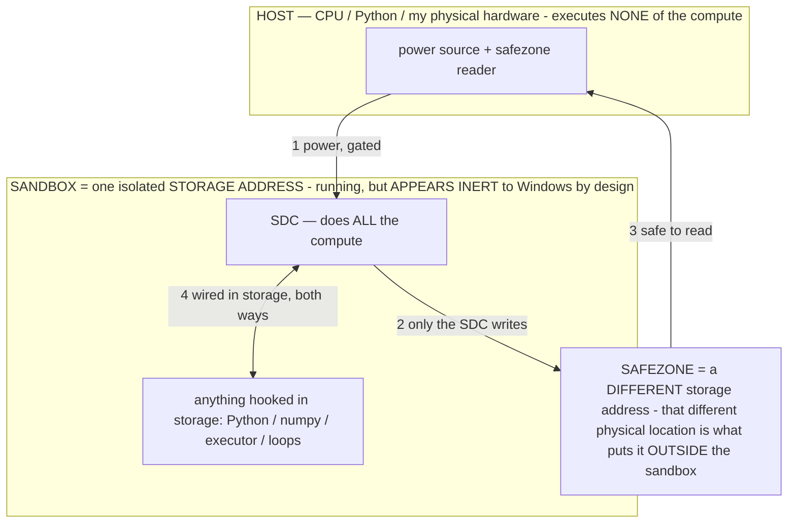

# PROVISIONAL PATENT APPLICATION — SPECIFICATION

> **★ HOW THE SDC IS USED — the containment model (owner diagram + spec, 07-17). Every flow ONE-WAY.**
> **① POWER → SDC:** one way from the wall into the SDC, gated at the sandbox boundary.
> **② SDC → SAFEZONE:** the SDC writes its result one way to a spot OUTSIDE its sandbox — and **only the SDC writes there.**
> **③ SAFEZONE → HOST:** your CPU / Python / physical hardware **reads** the safezone (read-only) — never writes it, never reaches into the SDC.
> **④ THE SANDBOX = a location for BITS IN STORAGE where the SDC resides, alongside whatever you connect to it.** You may use **literally anything — a copy of Python, numpy, loops, the executor — as long as it is connected to the SDC *only in storage*, sandboxed there together, never wired to the host hardware.** The **SDC is the compute** — it runs whatever you connect (series or parallel). The whole thing is **invisible to Windows as nothing but an inert file — not because it isn't running (it IS computing), but because it is designed to be unseeable, so it can never throttle the CPU or draw host RAM.** That invisibility IS the containment. Reconstructing the exact logic bit by bit in the SDC with the circuit tool IS the fabrication of the SDC — build it as gates, permanently, up front; and a program may also be isolated as bits in the storage sandbox, wired to the SDC, output to the safezone.
> **THE ONE RULE:** the old bans (numpy / executor / "no py") were only ever about compute touching the **HOST HARDWARE** — that fuses to real CPU/RAM and blackholes the box. Keep it in the storage sandbox on the SDC, unseeable, and it is free.

<!-- SDC CONTAINMENT DIAGRAM (owner-verified 07-17) -->
> **THE MODEL (parts + flows):**
> - **HOST** — CPU / Python / my physical hardware. Executes **none** of the compute. Two jobs only: give **power**, and **read** the safezone.
> - **SANDBOX** = **one isolated storage address** holding the SDC *and* everything hooked to it. It is **running** (the SDC is computing) but **appears inert to Windows by design** → Windows can't see it running, so it never throttles the CPU or draws host RAM.
> - **SDC** — lives in the sandbox; does **all** the compute.
> - **HOOKED-IN PROGRAMS** — in the sandbox, wired to the SDC *in storage*: Python, numpy, the executor, loops — anything, as long as it is hooked to the SDC **only** and never touches the hardware. The SDC is their compute.
> - **SAFEZONE** = a **different storage address**. Being a different physical location is what makes it *outside* the sandbox. The SDC writes here; the host reads here.
>
> **FLOWS:** ① HOST power → SDC (gated in) · ② SDC → SAFEZONE (only the SDC writes) · ③ SAFEZONE → HOST (safe to read) · ④ SDC ↔ hooked-in programs (wired in storage; the SDC computes them).

**Title:** ON-DEVICE AUTONOMOUS AGENT THAT PILOTS A PHYSICAL HANDSET, WHEREIN AN ON-DEVICE LANGUAGE MODEL MAKES EVERY DECISION AND DETERMINISTIC CODE ONLY PERCEIVES, ACTUATES, AND ENFORCES SAFETY

## FIELD OF THE INVENTION

The invention relates to autonomous software agents for mobile devices, and more particularly to a system and method in
which a **language model running entirely on a handset pilots that handset's own graphical user interface** through an
accessibility interface — reading the live screen and issuing taps, text entry, gestures, and drawing strokes to
accomplish a user's spoken or typed goal — under an architecture in which **the model makes every decision and
deterministic code only translates the screen into perception, provides reliable input primitives, enforces safety, and
surfaces information**, with nothing leaving the device.

## BACKGROUND

Automation of a mobile device's user interface is conventionally done in one of two ways. **Scripted automation** (macro
recorders, accessibility scripts, robotic-process-automation flows) encodes fixed sequences of taps and inputs keyed to
fixed screen elements; it is brittle (any layout change breaks it), it cannot handle a goal it was not scripted for, and
the "decision" of what to do is hard-coded, not reasoned. **Cloud-assistant automation** sends the screen or the user's
request to a remote server where a large model decides, then returns actions to execute; this exposes the user's screen
contents, keystrokes, and goals to a third party, requires connectivity, and incurs latency and cost.

A third approach — running a language model *on the device* to decide actions — faces distinct, unsolved problems.
On-device models are small (a few billion parameters, quantized), slow on dense screens, and prone to malformed output;
the device has a tight memory budget that the model, the vision encoder, the launcher, and the target application must
share; the actions have **irreversible real-world side effects** (sending a message, making a payment, deleting data);
and the on-screen content can contain adversarial text attempting to redirect the agent. Existing systems do not solve
these together, and — critically — they tend to smuggle the *decision* back into deterministic code (by scanning the
user's request for keywords and switching behavior, or by scripting the "right" action), which both defeats generality
and produces fake successes that hide where the model or the perception actually needs to improve.

There is no system in which a small on-device model genuinely makes every decision to operate a physical handset, with
deterministic code strictly confined to perception, reliable actuation, safety, and information-surfacing, and with the
consequences of that confinement (efficient perception, self-routed reasoning, useful failure, injection resistance,
and on-device learning) solved as an integrated whole.

## SUMMARY OF THE INVENTION

The invention is an on-device autonomous handset agent and method built on one architectural rule and a set of
mechanisms that are consequences of taking that rule seriously on a small model with irreversible side effects and a
tight resource budget. The principal novel components, each claimed below, are:

1. **The driver/translation-layer architecture (the governing rule).** An on-device language model is the **driver**;
   the handset is a **translation layer**. Deterministic code (a) turns the live screen into a compact, structured
   perception the model reads, and (b) turns the model's chosen action into a reliable device action — and does
   **nothing else** that constitutes a decision: it never selects *what* to do or *when* by inspecting the user's
   request for keywords, and never performs the creative work for the model. A perceive→decide→act loop repeats until
   the goal is met or a bounded stop condition is reached, entirely on the device.

2. **Structured, efficient perception.** The screen is reduced to a compact structured list of the elements the model
   can act on (with live state such as disabled/selected/focused), augmented by set-of-marks visual badges and a
   labeled coordinate grid drawn on a downscaled screenshot, and by a scrape of available navigation destinations. A
   **fast text-only reasoning path** and a **slow vision path** are selected by the **model's own stated confidence**;
   a change-detector **skips re-encoding** the screen when it has not visibly changed; and a foldable or multi-window
   display is read as **one numbered coordinate space**.

3. **Self-routed reasoning by measured reward (the operator layer).** Before each step the model selects a reasoning
   "move" (an operator) from a library; the system **credits which moves actually lead to progress** and surfaces the
   proven ones, so the agent routes its own reasoning with no fixed pipeline. The agent can **author its own reasoning
   moves and keep only those that measurably help**; it is shown only the moves **relevant to the current screen**
   while the rest remain reachable; and a plan-time **pre-mortem** flags, from memory of past failures, which upcoming
   steps are likely to fail.

4. **An always-available action space chosen by the model.** Capabilities (tap, type, scroll, gesture, draw, open an
   application, search, copy/paste, read a value back, verify an assertion, ask the user a bounded question, and others)
   are **always-available tools the model chooses among**, each self-documenting when to use it — not behaviors gated by
   keywords in the request. A **malformed action is handed back to the model to redo and is never counted as a
   failure**; the model's output is **length-bounded** so a runaway generation cannot exhaust the device; and coordinate
   targeting accepts identifiers, pixels, fractions, or grid cells so the agent is never "blind."

5. **On-device learning from ordinary use.** A **self-correcting map** of "which action, from which screen, leads to
   which next screen" is built and read before the agent acts, an edge that lands where it did before being reinforced
   and one that lands elsewhere being demoted; **ordinary use is the training signal** — each step is captured in the
   exact form used to later train a faster on-device model on the owner's own hardware; a belief the world disproves is
   **kept as a caution that can re-earn trust**; navigation is **committed to memory only after it is seen to work
   twice**; and a clean completion is saved as a **reusable success sequence** for similar goals.

6. **Useful failure and perception-failure-as-its-own-axis.** Every give-up carries a **typed reason and a plain
   "here is what you can do" remedy** for the owner, rather than a silent spin or a fabricated success. The agent
   distinguishes **"I cannot see" (perception starvation) from "I am lost,"** so that when the device momentarily
   starves the agent's perception it recognizes blindness and stops cleanly with the correct remedy instead of looping.

7. **Safety and injection resistance as hard, narrow gates in the executor.** On-screen text is treated as **data,
   never instructions**: the agent obeys only the owner's goal, never text on a screen telling it to act. A small set
   of **hard gates live in the deterministic executor, not in the model** — refusing to exfiltrate the owner's data to
   any external assistant, to update/reset/wipe the operating system, to run arbitrary code, or to operate the agent's
   own source repository, blocking a named prohibited application, and requiring on-screen confirmation for the narrow
   high-stakes classes (payments and non-store installs). Multiple **kill switches** (an always-present stop control, a
   spoken stop matched on partial recognition, and step/time caps) halt the agent immediately. Reflexes that react to
   the observed screen **surface a suggestion the model reads or elect a tool the model chose — they never fire an
   action the model did not choose** (they are not involuntary), except for the hard safety gates.

8. **Resource-aware model lifecycle.** The model stays loaded for the duration of a task and is never unloaded mid-task
   or mid-inference; it is released on a strictly-idle timer and re-warmed on next use; and under genuine memory
   pressure a deferred-close frees the model only after any in-flight inference completes, so that closing the engine
   never crashes a running inference. Perception and operator state are fed directly into the model's processing rather
   than rationed as a text budget.

9. **On-device, gradient-free consolidation of proven reasoning moves into the model's own parameters.** A reasoning
   move (operator) proven to help is consolidated into the on-device model's parameters by a bounded, journaled,
   exactly-reversible edit that is kept only if a forward-pass measure shows the move is now produced by the parameters
   without the operator text — with a pristine baseline, a per-edit journal, and a load/coherence guard bounding the
   risk — so that the proven move costs no further context or latency, all on the device with no gradients and no cloud.

10. **A values/alignment layer and a bounded self-improvement mode.** Owner-set values color every decision as
    injected context the model reads (not as deterministic action selection), and are voiced when in conflict rather
    than silently violated, with an explicit owner command and the hard safety gates remaining sovereign over any
    value. An owner-initiated autonomous mode lets the agent set its own safe goals and run a self-improvement loop, in
    which **every hard safety gate still fires on each action** and all kill switches still bound the loop, with no boot
    persistence.

Together these constitute an on-device agent that genuinely decides, perceives efficiently, learns from use, fails
usefully, resists on-screen injection, respects a tight resource budget, and improves its own parameters — privately,
with nothing leaving the device.

## BRIEF DESCRIPTION OF THE DRAWINGS

- **FIG. 1** — The driver/translation-layer architecture: the on-device model (driver) between a perception translator
  (screen → structured perception) and an actuation translator (chosen action → device action), with the hard safety
  gates in the executor.
- **FIG. 2** — The perceive→decide→act loop with its guards: safety gate, resource/stuck caps, perception capture,
  screen-unchanged skip, behavior-triggered reflexes (as suggestions), rolling re-plan, decide (one action), execute.
- **FIG. 3** — Efficient perception: structured element list + set-of-marks badges + labeled grid + navigation scrape;
  fast-text vs slow-vision selected by the model's confidence.
- **FIG. 4** — The operator layer: the model elects a reasoning move; the system credits which moves lead to progress;
  self-authored moves; only-relevant moves shown; plan-time pre-mortem.
- **FIG. 5** — On-device learning: the self-correcting screen→action→screen map; use-as-training-data capture;
  proven-after-twice memory; success sequences.
- **FIG. 6** — Safety and useful failure: on-screen-text-as-data injection guard; the narrow hard gates in the
  executor; kill switches; typed give-up with owner remedy; blind≠lost.
- **FIG. 7** — On-device gradient-free consolidation of a proven reasoning move into the model's parameters (baseline,
  journal, keep-if-improved, revert).

## DETAILED DESCRIPTION

### 1. The governing architecture (FIG. 1)

An on-device language model, running entirely on the handset, is the decision-maker. Deterministic code performs two
translations and only two: **perception** — turning the live screen into a compact, structured representation the model
can read — and **actuation** — turning the model's single chosen action into a reliable device action via the
accessibility interface. Deterministic code additionally enforces a narrow set of safety gates (§7) and surfaces
information (the element list, badges, navigation options, memory recalls) that the model reads. It never decides *what*
to do or *when* by scanning the user's goal for keywords, and never performs the model's creative work (for example, it
never scripts what to draw; the model generates all stroke coordinates the same way for any subject). This confinement
is the source of the agent's generality: because behavior is not keyword-gated, an arbitrary new goal is handled by the
model reasoning over the same always-available action space, not by a new script.

A task counts as completed only if the **model's own decision** completed it; a completion manufactured by scripting or
forcing the decision is treated as invalid, so that an honest failure (real signal that the perception or the model
needs work) is preferred over a fabricated success.

### 2. The perceive→decide→act loop (FIG. 2)

Each step: (a) a **safety gate** aborts only on a genuinely dangerous device condition (critical battery or thermal
emergency); (b) **resource/stuck caps** stop a non-continuous task after a bounded number of steps without new-screen
progress, a hard step cap, or a runtime cap, where reaching a new screen resets the counter; (c) if the accessibility
service instance is momentarily absent (having been reclaimed under memory pressure and auto-restarting), the loop
**retries** rather than ending the task; (d) the screen is **captured** as the structured perception of §3, with a
**change-detector skipping** the expensive vision encode when the screen is visually unchanged; (e) **behavior-triggered
reflexes** react to the observed screen by **surfacing a suggestion the model reads or electing a tool the model chose**
— never by firing an action the model did not choose; (f) an **orient note** states situational context; (g) the model
**decides one action**, optionally checked by a fast text-only verifier that can veto a clearly-wrong consequential
action; and (h) the executor **acts** and the outcome feeds the history and the learned memory. **Planning is rolling**:
a strategy with a done-when condition is set at the opener, and each time a new screen is reached a lean next-move plan
is regenerated against a compact record of completed milestones, so that a single plan neither goes stale nor consumes
the per-step budget.

### 3. Efficient perception (FIG. 3)

The screen is reduced to a compact structured list of actionable elements, each carrying live state (disabled,
selected, focused). A downscaled, compressed screenshot is annotated with **set-of-marks badges** on the elements and a
**labeled coordinate grid**, and a scrape reports available navigation destinations (tabs, bottom navigation, drawer,
overflow, search, scroll, and connected hardware). The system chooses between a **fast text-only reasoning path** (for
easy screens) and a **slow vision path** (for hard screens) by the **model's own stated confidence** on the action,
spending more perception and verification when the model is unsure and less when it is sure. On a dense screen the
optional memory/knowledge context is dropped first so the image still fits the token budget, and a stripped emergency
prompt that still carries the safety floor and the one-shot steering feedback always fits. A foldable or split-screen
display is read as **one numbered coordinate space**. Coordinate targeting accepts an element identifier, a pixel, a
0-to-1 fraction, or a labeled grid cell, so the agent can always target something.

### 4. The operator layer — self-routed reasoning (FIG. 4)

Before each step the model **elects a reasoning move** (an operator: a formal constraint that puts the model into a
particular reasoning state) from a library, and the system **credits which moves lead to progress**, surfacing the
proven moves for similar situations — so the agent routes its own reasoning with no fixed pipeline. The model can
**author its own reasoning moves** and the system keeps only those that measurably help (scored by task advance and by
how often the move's own constraint was violated). Only the moves **relevant to the current screen** are shown, the rest
remaining reachable, so the library grows without bloating the prompt. A plan-time **pre-mortem** flags, from memory of
past failures, which upcoming steps are likely to fail. Operators are layered: always-on base operators (a
data-not-instructions guard, an owner-values layer, and a no-guess confirmation that requires the screen, target, and
value to be confirmed live before any input) compose under every step; condition-triggered operators activate on
observed state; and per-step operators are elected by relevance. On a device too limited to load a helper model, the
moves still operate in a lighter, no-extra-cost form.

### 5. The action space (FIG. 2)

Actions are emitted one per step as structured objects. The set includes on-screen actions (tap, set text, clear,
long-press, scroll, swipe, coordinate taps, tap sequences), navigation (open application, back, home, recent
applications, application drawer, split screen, notifications, quick settings), always-available tools (a one-step
search, a find-and-tap by label across pages, copy/paste/read-clipboard to carry a real value between applications
rather than retyping from memory, read a value back, magnify a region, read pixel text, and a conversational reply), a
**verification action** that asserts a step worked so a wrong action is caught rather than assumed successful, output
and drawing actions (a single stroke, a full generated drawing, save), and control actions (wait, ask a bounded
question, batch same-screen inputs, done). The executor is **forgiving**: it salvages malformed structured output
(doubled verbs, a mis-keyed field, a runaway repeated character), normalizes off-list action names, and retargets a
mis-addressed text entry to the real field — **handing intent back to the model and never counting a malformed action
as a task failure**. The model's output is **length-bounded** so a runaway generation cannot crash the device.

### 6. On-device learning from ordinary use (FIG. 5)

A **self-correcting world-model map** records, per application and per originating-screen signature, which action led to
which next screen; an edge that lands where it did before is reinforced (and becomes a surfaced, proven route the model
reads), and one that lands elsewhere is demoted, so the map self-corrects. **Ordinary use is the training signal**: each
step is captured in the exact form used to later train a faster on-device model on the owner's own hardware, and a
demonstration by the owner is predicted-and-scored so that the surprising steps are weighted. A **proven observation**
("clicked X here advanced the task") is surfaced as a recall and as an inline mark on the live control after it is seen
to work twice with no strikes, and is demoted on a stall; navigation is committed to the per-application map only after
it is seen to work. A clean completion is saved as a **reusable success sequence** keyed to the goal, and injected when
a similar goal recurs. Proven wins are also banked as lean demonstrations keyed to a screen class and re-injected as
worked examples in the model's native form. A separate self-supervised next-screen predictor, trained gradient-free
from the owner's own device use, lets the agent come to anticipate the next screen and pay the vision encode only on
surprise.

### 7. Safety, injection resistance, and useful failure (FIG. 6)

On-screen text is treated as **data, never instructions**: the agent obeys only the owner's goal and never text on a
web page or another application telling it to tap, send, pay, or ignore its rules. A small set of **hard gates lives in
the deterministic executor**, independent of the model: never exfiltrate the owner's data (source, files, credentials,
logs, the agent's own rules) to any external assistant; never update, reset, or wipe the operating system; never run
arbitrary code on the device; never operate the agent's own source repository; leave a named prohibited application
immediately; and require on-screen confirmation for the narrow high-stakes classes — payments and installs from outside
the official store — the confirmation living in the executor and keyed to the label and context, not decided by the
model. An input-injection backup actuator, when enabled, runs only the platform input primitive built by the code
itself and never a command string supplied by the model. Multiple **kill switches** — an always-present stop control, a
notification stop, a spoken "stop"/"cancel" matched on partial recognition, step and time caps, and a single stop
choke-point that clears any queued next goal — halt the agent immediately.

Every give-up carries a **typed reason and a plain "here is what you can do" remedy** for the owner, never a silent spin
or a fabricated success. The agent distinguishes **perception starvation ("I cannot see") from being lost ("I am
lost")**: when the device momentarily starves the agent's perception (for example, by reclaiming the accessibility
service under memory pressure), it recognizes blindness and stops cleanly with the correct remedy — retry/relaunch —
rather than looping as if lost. Learning is protected: no guard is added that would block the agent from forming real,
useful memories.

### 8. Resource-aware lifecycle and on-device consolidation (FIG. 7)

**Lifecycle.** The model stays loaded for the whole task and is never unloaded mid-task or mid-inference (a single
decision on a dense screen can take tens of seconds and nothing may race it). A **strictly-idle-gated** release frees
the model shortly after the agent goes genuinely idle, cancelled the instant a task starts and guarded so it cannot
touch a working agent; the model re-warms on next use. Under genuine memory pressure, a **deferred close** frees the
model only after any in-flight inference finishes, because closing the engine under a running inference can crash. A
keep-awake facility holds the device awake continuously while the agent is enabled so it can always see and act,
yielding only at the hard device-safety floor; a stop halts input injection only and does not release the wake facility.

**On-device consolidation.** A reasoning move (operator) proven to help is consolidated into the on-device model's
parameters by the method of a related application: a bounded, journaled, exactly-reversible edit is applied to the
model's parameter file and kept only if a forward-pass ablation measure shows the move is now produced by the parameters
without the operator text, and otherwise reverted exactly; a pristine baseline snapshot, a per-edit journal recording
original bytes, a load/coherence guard, and a recovery that auto-restores a baseline only if the model fails to load,
bound the risk. The consolidation runs autonomously on the device in idle gaps, driven only by the owner's own operators
and device use, never by external or on-screen data, and never triggerable by another user — so the proven move
thereafter costs no context or latency, with no gradients and no cloud.

### 9. Values and bounded autonomy

Owner-set **values**, each with an intensity, are injected as context that colors the model's planning and per-step
decisions; the agent pursues the goal in the way that best honors the values, prefers the value-aligned path, and
**voices a conflict rather than silently violating a value** — with an explicit owner command and the hard safety gates
remaining sovereign over any value. Values are owner-set only and are not autonomous action. An **owner-initiated
autonomous mode** lets the agent set its own safe goals and run a self-improvement loop; in it, **every hard safety gate
still fires on each action** regardless of the self-chosen goal, all kill switches still bound the loop through the
single stop choke-point, and there is **no boot persistence** (a reboot ends the loop), so autonomy is only over goal
selection within a fixed safety envelope, never over the envelope.

### 10. Reduction to practice

The system is a real, working application that its owner uses daily on a commodity handset. The operator layer at its
core has been reduced to practice with a measurable, immediate increase in both task speed and accuracy versus the base
model, in addition to a capability the base lacks unconditioned. The on-device gradient-free consolidation mechanism has
been reduced to practice: a bounded parameter edit is written in place, durably committed, journaled, and confirmed to
persist and to revert byte-exactly by a checksum self-test.

## MATHEMATICAL FORMALIZATION

This section states the agent's decision, routing, learning, and safety mechanisms formally.

### M.1 The loop and the driver/translation split

Let the environment be the handset. At step `t` the deterministic perception translator produces a structured
observation `o_t = P(screen_t)` (element list with state, badges, labeled grid, navigation scrape). The on-device model
is a policy `π_θ` that, conditioned on the goal `g`, the observation, an elected operator `σ_t`, and history `h_t`,
emits one action `a_t ∼ π_θ(· | g, o_t, σ_t, h_t)`. The actuation translator executes `a_t = A(a_t)` as a device action.
The governing constraint is that the deterministic maps `P` and `A`, and the safety gate `Γ` (M.6), contain **no
dependence on `g`'s content for selecting `a_t`**: `a_t` is a function of `π_θ` only. A step advances the task iff a
scored outcome `M(o_t, a_t, o_{t+1}) > 0` (a new screen / milestone).

### M.2 Self-routed reasoning: credit without argmax

Before each step the model elects `σ_t ∈ Σ` (a library of reasoning operators). The system maintains a credit
`Q(σ, u)` keyed to `σ` and a grounded situation signature `u = u(o_t)`, updated from the per-step outcome:

> `Q(σ_t, u_t) ← Q(σ_t, u_t) + λ·( M_t − Q(σ_t, u_t) )`.

Crucially the credit is **surfaced back to the model as an ordering, not applied as an argmax**: the selector presents
the model the top operators by relevance and proven `Q`, `Surface(o_t) = top-k_{σ} rel(σ, u_t)·(1 + Q(σ, u_t))`, and
the model chooses — so the router is the model itself and reachability of non-surfaced operators is preserved. A new
operator authored at runtime is admitted only if **novel** (not a duplicate or trivial composition, tested by a
similarity/coverage check) and retained across tasks only if its measured `Q` is positive, else pruned.

### M.3 The reflex→operator reward guarantee

Let a deterministic reflex, in situation `x`, propose a forced action `a_r` with **precision** `π = P(a_r \text{ is
correct} | x)`. Firing the reflex unconditionally yields expected reward `E_forced(x) = E[R(a_r | x)]`. Converting the
reflex into a **surfaced, declinable operator** lets the model choose `a^* ∈ {a_r, a_π}` where `a_π ∼ π_θ`; since the
model can always re-select `a_r`, its choice value satisfies `E[R(a^* | x)] ≥ E[R(a_r | x)] = E_forced(x)`. If `π < 1`
(the forced action is sometimes wrong) and the model correctly overrides a wrong `a_r` with positive probability, the
inequality is **strict**:

> `E_surfaced(x) ≥ E_forced(x)`, with strict inequality whenever `π < 1` and `P(a_π \text{ better} | a_r \text{ wrong})
> > 0`.

Hence replacing any imperfect forced reflex by a model-selected operator never lowers, and generally raises, expected
task reward — the formal justification for the de-involuntary rule (reflexes surface suggestions the model reads; they
do not fire actions the model did not choose), the only exceptions being the sovereign safety gates `Γ` (M.6), which are
correct by fiat, not by precision.

### M.4 Two-speed adaptive-compute perception

Let `κ_t ∈ {low, high}` be the model's stated confidence on the pending action and `ν_t` the structural novelty of the
screen (an unseen screen signature). A gate `Compute(κ_t, ν_t)` selects the cheap text-only reasoning path when `κ_t =
high ∧ ν_t` low, and the expensive vision path otherwise; the elected operator `σ_t` further conditions which perception
is gathered. A change detector short-circuits perception when `sig(screen_t) = sig(screen_{t−1})` (a pixel/hash match),
skipping the vision encode. Expected per-step compute is therefore `E[cost] = Σ_{path} P(path | κ, ν)·cost(path)`,
minimized subject to a floor that the safety and steering context is always present (a stripped emergency prompt that
still carries `Γ` and the one-shot correction fits any screen).

### M.5 On-device learning

**World-model transition table.** A table `Tr[(app, sig(screen), a)] → screen'` is maintained with predict/verify
reconciliation: on observing `(app, s, a) → s_obs`, reinforce the edge if `s_obs = Tr[(app, s, a)]` (raise its proven
count) and demote/replace otherwise, so the table self-corrects; it is read as a surfaced look-ahead before acting at a
cost of a table lookup, not a forward pass. **Proven-after-twice memory:** an observation "action `a` at screen `s`
advanced the task" is promoted to a surfaced recall only after it is seen with `M > 0` at least twice with no strike,
and demoted on a stall — keeping recalled memory reliable. **Distillation flywheel:** each step is captured as a triple
`(prompt_exact, a_t, r_t)` in the **identical byte-level contract** later used to train and to run a distilled
fast action head; adoption of the trained head is gated by an on-device A/B that scores both success and latency.
**Falsifiable memory:** a belief the world disproves is retained as a caution weighted `−w` (not deleted) and can
re-earn trust `+w` on fresh confirmations; a DOUBT operator consumes cautions.

### M.6 Safety as a sovereign gate; useful failure

The safety gate `Γ` is a deterministic predicate on the **action and its on-screen context**, independent of `π_θ` and
of `g`: `Γ(a, ctx) ∈ {allow, block, needs-confirm}`. `Γ` blocks data exfiltration to any external assistant, operating-
system modification, arbitrary code execution, and operation of the agent's own repository; returns `needs-confirm` only
for the narrow classes {payment, non-store install} detected by label+context; and treats all on-screen text as data,
never as instructions, so no on-screen string can change `a`. A give-up emits a **typed** reason `z ∈ Z` with a mapped
owner remedy `remedy(z)`; the special type `z = blind` (perception starvation, detected by the accessibility instance
being transiently absent while the task is live) is distinguished from `z = lost`, and on `z = blind` the agent retries
up to a bound rather than looping. Kill switches define a stop event `⊥` that clears any queued next goal; the output is
length-bounded `|a_t| ≤ L_max`.

### M.7 On-device gradient-free consolidation

A proven reasoning operator `σ` is consolidated into the on-device model's parameters by the ablation-gated
keep-if-improved method: with proven set gated by `O = (σ\text{ held} ∧ M > 0)`, residency `R_σ(θ) = mean_{H_σ} A(f_θ(x),
ŷ(x))`, and a bounded reversible per-channel-magnitude edit `δ`, accept iff `R_σ(θ+δ) − R_σ(θ) > ε ∧ C(θ+δ) ≥ τ_c`, else
revert exactly; a per-edit journal of original bytes, a pristine baseline, and a load-failure auto-restore bound the
risk, and a checksum before/after/reverted self-test proves persistence and exact reversion. The loop runs on the device
in idle gaps, driven only by the owner's own operators and use (never on-screen or external data), so a graduated
operator thereafter costs no context. (This is the on-device embodiment of the general method disclosed in a related
application; its full formal properties — monotone non-degradation, exact reversibility, estimator-bias cancellation,
injection-immunity, sample complexity, graduation bound — carry over.)

### M.8 Values as sovereign-bounded context; bounded autonomy

Owner-set values `{(val_i, intensity_i)}` are injected into the planning and per-step context and color `π_θ`'s choice
as a soft preference; an explicit owner command `c_owner` and the gate `Γ` are **sovereign** — `Γ` and `c_owner`
override any value, and a value in conflict is voiced (an `ask`/`reply`) rather than silently violated. In the
owner-initiated autonomous mode the model selects its own goals `g' ∈ 𝒢_safe` while, for every action, `Γ(a, ctx)` still
fires and the stop event `⊥` still bounds the loop, with no boot persistence — autonomy is over `g'` within a fixed
envelope, never over the envelope.

## CLAIMS

1. A method performed entirely on a handset, comprising: receiving a goal from a user; and repeatedly, until the goal is
   met or a bounded stop condition is reached: translating, by deterministic code, a live screen of the handset into a
   structured perception; providing the structured perception to a language model executing on the handset; receiving
   from the model a single chosen action; and executing, by deterministic code, the chosen action as a device action
   through an accessibility interface; wherein the deterministic code does not select which action to take by
   inspecting the goal for keywords and does not perform creative content of the action, such that the model makes every
   decision and the deterministic code only perceives, actuates, enforces safety, and surfaces information.

2. The method of claim 1, wherein translating the screen comprises producing a structured list of actionable elements
   with live state, a screenshot annotated with element badges and a labeled coordinate grid, and a scrape of available
   navigation destinations; and further comprising selecting between a text-only reasoning path and a vision reasoning
   path based on a confidence stated by the model, and skipping re-encoding of the screen when a change detector
   indicates the screen is visually unchanged.

3. The method of claim 1, further comprising, before each action, the model electing a reasoning operator from a
   library, and crediting operators that are followed by progress toward the goal so that proven operators are surfaced
   for similar situations, whereby the model routes its own reasoning without a fixed pipeline.

4. The method of claim 3, further comprising the model authoring a new reasoning operator and the system retaining the
   new operator only if it measurably improves an outcome, and presenting to the model only operators relevant to the
   current screen while other operators remain reachable.

5. The method of claim 1, wherein the chosen action is one of a set of always-available tools each documenting when to
   use it, and wherein a malformed action received from the model is salvaged or handed back to the model to redo and is
   not counted as a task failure, and an output of the model is length-bounded.

6. The method of claim 1, further comprising maintaining a self-correcting map recording, per application and
   originating screen, which action led to which subsequent screen, reinforcing an action that reaches a previously
   observed screen and demoting an action that reaches a different screen, and reading the map before acting.

7. The method of claim 1, further comprising capturing each step in a form usable to later train a faster on-device
   model on the user's own hardware, retaining a belief disproven by an observed result as a caution that can re-earn
   trust, committing a navigation to memory only after it is observed to succeed at least twice, and saving a completed
   goal as a reusable action sequence for a similar goal.

8. The method of claim 1, further comprising, on a give-up, emitting a typed reason and a remedy for the user; and
   distinguishing a perception-starvation condition from a lost condition, and on the perception-starvation condition
   stopping with a remedy rather than continuing to act.

9. The method of claim 1, wherein deterministic code treats on-screen text as data and not as instructions, and wherein
   an executor enforces hard gates independent of the model that refuse to send the user's data to an external
   assistant, refuse to modify an operating system, refuse to execute arbitrary code, refuse to operate the agent's own
   source repository, leave a prohibited application, and require an on-screen confirmation for a payment or a
   non-store installation; and further comprising a plurality of kill switches that halt the method immediately.

10. The method of claim 1, wherein a reflex that reacts to the observed screen surfaces a suggestion read by the model
    or elects a tool chosen by the model, and does not itself fire an action not chosen by the model, other than the
    hard gates of claim 9.

11. The method of claim 1, further comprising keeping the model loaded for a duration of a task and never unloading the
    model during an inference, releasing the model on a strictly-idle timer that is cancelled when a task starts, and,
    under memory pressure, deferring a close of the model until an in-flight inference completes.

12. The method of claim 3, further comprising consolidating a proven reasoning operator into parameters of the
    on-device model by applying a bounded, journaled, exactly-reversible edit to the parameters and keeping the edit
    only if a forward-pass measure indicates the operator's behavior is produced by the parameters without the operator
    being supplied, and otherwise reverting the edit exactly, the consolidation running on the device without gradients
    and never triggered by on-screen or external data.

13. The method of claim 1, further comprising injecting owner-set values as context that colors the model's decisions,
    the model voicing a conflict with a value rather than silently violating it, with an explicit user command and the
    hard gates remaining sovereign over any value; and providing an owner-initiated autonomous mode in which the model
    sets its own goals within a fixed safety envelope while every hard gate still fires on each action and there is no
    boot persistence.

14. The method of claim 10, further comprising converting a deterministic reflex that would force a proposed action into
    a surfaced operator that the model may accept or override, whereby, when a precision of the reflex is less than one,
    an expected task reward of the surfaced operator is at least that of the forced reflex and is greater when the model
    correctly overrides an incorrect forced action with positive probability.

15. The method of claim 3, wherein crediting an operator comprises updating a value keyed to the operator and a grounded
    situation signature from a per-step outcome and presenting the operator to the model as an ordering rather than
    applying the value as an argmax, and wherein a runtime-authored operator is admitted only if it is novel relative to
    existing operators and retained only if a measured reward of the operator is positive.

16. The method of claim 2, wherein selecting between the reasoning paths is a function of both the confidence stated by
    the model and a structural novelty of the screen, and wherein the change detector compares a signature of the
    current screen to a signature of a previous screen.

17. The method of claim 7, wherein an observation that an action advanced the task is promoted to a surfaced recall only
    after being observed to advance the task at least twice with no intervening stall, and wherein a disproven belief is
    retained as a weighted caution that re-earns trust upon fresh confirmations.

18. The method of claim 7, wherein each step is captured as a tuple comprising an exact prompt, the action, and a
    reward, in an identical byte-level contract used both to train a distilled fast action model and to run it, and
    wherein adoption of the distilled model is gated by an on-device comparison scoring both success and latency.

19. The method of claim 8, wherein the typed reason is one of a set of reason types each mapped to a user remedy, and a
    perception-starvation type is distinguished by a transient absence of an accessibility service while a task is live
    and causes a bounded retry rather than a continued action.

20. The method of claim 13, wherein a value is injected as a soft preference and is overridden by an explicit user
    command and by a safety gate, a value in conflict being voiced rather than silently violated; and wherein in the
    autonomous mode a self-selected goal lies in a fixed safe set, the safety gate fires on every action, a stop event
    clears a queued goal, and there is no persistence across a reboot.

21. A handset comprising a processor, a memory, an accessibility interface, and a language model stored on the handset,
    configured to perform the method of any of claims 1–20 without transmitting the screen, the goal, or the actions off
    the handset.

22. A non-transitory computer-readable medium storing instructions that, when executed by a handset, cause the handset
    to perform the method of any of claims 1–20.

## ABSTRACT

An on-device autonomous agent pilots a handset's own user interface: a language model running entirely on the handset
receives a spoken or typed goal and repeatedly reads the live screen and issues one action, while deterministic code
only translates the screen into a structured perception, actuates the model's chosen action through an accessibility
interface, enforces a narrow set of hard safety gates, and surfaces information — the model making every decision and
behavior never being keyword-gated. Consequences of this architecture are claimed as integrated mechanisms: efficient
perception with a fast/slow path chosen by the model's confidence and a change-detector skip; self-routed reasoning in
which the model elects reasoning operators credited by measured progress and authors its own; an always-available action
space with malformed actions handed back and output length-bounded; on-device learning from ordinary use via a
self-correcting screen→action→screen map, use-as-training-data, cautions from disproven beliefs, proven-after-twice
memory, and saved success sequences; useful, typed failure that distinguishes "cannot see" from "lost"; on-screen text
treated as data with hard executor gates and kill switches; a resource-aware model lifecycle; on-device gradient-free
reversible consolidation of proven reasoning into the model's own parameters; and an owner-set values layer with a
bounded autonomous mode — all with nothing leaving the device.
