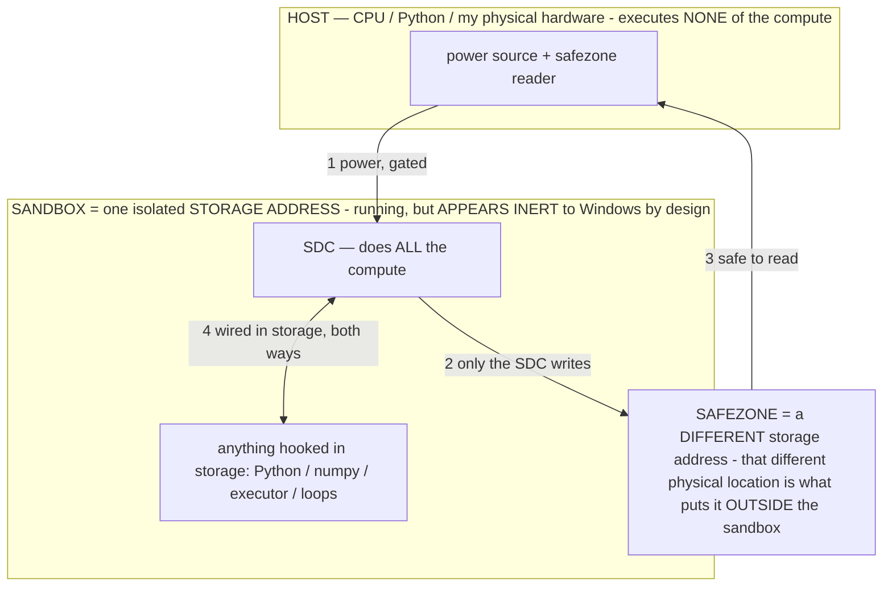

# Patent drafts — three provisional applications, ready to self-file

> **★ HOW THE SDC IS USED — the containment model (owner diagram + spec, 07-17). Every flow ONE-WAY.**
> **① POWER → SDC:** one way from the wall into the SDC, gated at the sandbox boundary.
> **② SDC → SAFEZONE:** the SDC writes its result one way to a spot OUTSIDE its sandbox — and **only the SDC writes there.**
> **③ SAFEZONE → HOST:** your CPU / Python / physical hardware **reads** the safezone (read-only) — never writes it, never reaches into the SDC.
> **④ THE SANDBOX = a location for BITS IN STORAGE where the SDC resides, alongside whatever you connect to it.** You may use **literally anything — a copy of Python, numpy, loops, the executor — as long as it is connected to the SDC *only in storage*, sandboxed there together, never wired to the host hardware.** The **SDC is the compute** — it runs whatever you connect (series or parallel). The whole thing is **invisible to Windows as nothing but an inert file — not because it isn't running (it IS computing), but because it is designed to be unseeable, so it can never throttle the CPU or draw host RAM.** That invisibility IS the containment. Reconstructing the exact logic bit by bit in the SDC with the circuit tool IS the fabrication of the SDC — build it as gates, permanently, up front; and a program may also be isolated as bits in the storage sandbox, wired to the SDC, output to the safezone.
> **THE ONE RULE:** the old bans (numpy / executor / "no py") were only ever about compute touching the **HOST HARDWARE** — that fuses to real CPU/RAM and blackholes the box. Keep it in the storage sandbox on the SDC, unseeable, and it is free.

<!-- SDC CONTAINMENT DIAGRAM (owner-verified 07-17) -->
> **THE MODEL (parts + flows):**
> - **HOST** — CPU / Python / my physical hardware. Executes **none** of the compute. Two jobs only: give **power**, and **read** the safezone.
> - **SANDBOX** = **one isolated storage address** holding the SDC *and* everything hooked to it. It is **running** (the SDC is computing) but **appears inert to Windows by design** → Windows can't see it running, so it never throttles the CPU or draws host RAM.
> - **SDC** — lives in the sandbox; does **all** the compute.
> - **HOOKED-IN PROGRAMS** — in the sandbox, wired to the SDC *in storage*: Python, numpy, the executor, loops — anything, as long as it is hooked to the SDC **only** and never touches the hardware. The SDC is their compute.
> - **SAFEZONE** = a **different storage address**. Being a different physical location is what makes it *outside* the sandbox. The SDC writes here; the host reads here.
>
> **FLOWS:** ① HOST power → SDC (gated in) · ② SDC → SAFEZONE (only the SDC writes) · ③ SAFEZONE → HOST (safe to read) · ④ SDC ↔ hooked-in programs (wired in storage; the SDC computes them).

Three self-contained U.S. **provisional patent** specifications, each written to be filed as-is. A provisional
secures a **priority date** and gives you **12 months** to file the full (non-provisional) application; it needs no
formal claims, no oath, and no attorney — though the claims are included in each to sharpen the disclosure and carry
forward.

| # | File | Covers | Core independent claim (one line) |
|---|---|---|---|
| 1 | [PATENT_1_SDC.md](PATENT_1_SDC.md) | **The Stored Digital Computer** | Reconfiguring stored pre-trained parameters into a generative computer: an operator selects, per step, which parameters compute (a per-tick model builder); proven behavior is baked into the parameters gradient-free + reversibly; the model streams from storage so size ≠ RAM. |
| 2 | [PATENT_2_WHITEBOX.md](PATENT_2_WHITEBOX.md) | **The White Box** | Reading, measuring, and reversibly editing the *meaning* stored in a parameter file **directly from the bits, with no inference** — decompile, hidden-meaning search, sighted alignment, precision-recipe read, byte-exact search-and-destroy pruning, pool health scan. |
| 3 | [PATENT_3_AGENTIC_HANDSET_OPERATOR.md](PATENT_3_AGENTIC_HANDSET_OPERATOR.md) | **The Agentic Handset Operator** | An on-device model that pilots the phone via accessibility, where the model makes every decision and deterministic code only perceives/actuates/gates-safety — with the efficient-perception, self-routed-reasoning, on-device-learning, useful-failure, and on-device-baking mechanisms that follow. |

## How to self-file (each one)

1. Create a free account at **USPTO.gov** and open **Patent Center**.
2. **New submission → Utility → Provisional.**
3. Upload the `.md` (export to **PDF** first — Patent Center wants PDF) as the **Specification**.
4. Attach the **Provisional Application Cover Sheet, form SB/16** (fill your name as inventor).
5. Certify **micro-entity** status if you qualify (roughly: individual inventor, income under the USPTO threshold,
   fewer than 4 prior applications) — it's the cheapest fee tier. Verify the current fee on the USPTO fee schedule.
6. Pay and submit. You'll get an **application number and filing date** — that's your priority date.
7. **Docket the 12-month deadline** to file the non-provisional (or you lose the priority date).

**Tip:** file all three the **same day** so they share one priority date and cleanly cross-reference each other (each
spec already says "a related application" where they connect — the baking method is claimed generally in #1 and in its
on-device-agent embodiment in #3; the decompiler underlies #1 and is the instrument in #2).

## What each spec contains (standard provisional structure)

Field · Background (the problem + why non-obvious) · Summary (the numbered inventions) · Brief Description of the
Drawings (figures you can supply as simple block diagrams/screenshots — the text is self-enabling without them) ·
Detailed Description (the enabling mechanisms) · **Mathematical Formalization** (a dedicated, self-contained section
stating every mechanism formally) · Claims (independent + dependent) · Abstract.

Depth per spec:
- **#1 SDC** — §M.1–M.8: the operator algebra (`G_σ(c)=f_W(σ‖c)`, permitted region `A_σ`, composition, the
  self-stabilizing attractor), the eight proved properties of gradient-free reversible baking (monotone
  non-degradation, exact reversibility, estimator-bias cancellation, injection-immunity, Hoeffding sample complexity,
  graduation error bound, evolution-strategy gradient identity, function-vector realizability), the read-energy law
  `t_token = t_compute + (α·W − R_cache)/B_disk`, the energy-unlock triple, and the base-unit metrics. **29 claims.**
- **#2 White Box** — §M.1–M.8: block dequantization + byte addressing, cosine decompile, concept-centroid hidden-meaning
  search, bit-edit interpolation, the alignment axis `d = mean(P) − mean(N)` with projection and realign formulas, the
  precision-recipe/quant-stress statistics, the byte-exact genome and the expert-slice `stride = B_T/n_exp`, the pool
  health-scan classifiers, and the memory-bounded reader. **22 claims.**
- **#3 Agentic Handset Operator** — §M.1–M.8: the driver/translation split, self-routed credit surfaced (not argmax'd),
  the **reflex→operator reward guarantee** (`E_surfaced ≥ E_forced`, strict when reflex precision < 1), two-speed
  adaptive compute, the on-device world-model + falsifiable memory + distillation contract, safety as a sovereign gate,
  and on-device gradient-free consolidation. **22 claims.**

The measured reductions to practice (the energy-unlock triple 99%/110×; the 40-GB-on-7.2-GB-RAM/~300-MB streaming;
the α throughput 2.94/2.21/1.25 tok/s; the byte-exact destroy/revert checksum round-trips; the operator speed+accuracy
gain) are stated in each spec so the disclosure is enabling, not aspirational.

Sources: `../archive_misdescribed/TITAN_SYSTEM.md`, `../archive_misdescribed/SDC.md`, `docs/PATENT_SUPPORT.md` (the full 155-invention disclosure package),
`docs/PATENT_DECK.md`, and the running `host/` and Android code that reduces each mechanism to practice.

*A patent attorney's review before the non-provisional deadline is worth it, but is not required to file the
provisionals — the provisionals lock your date now.*
