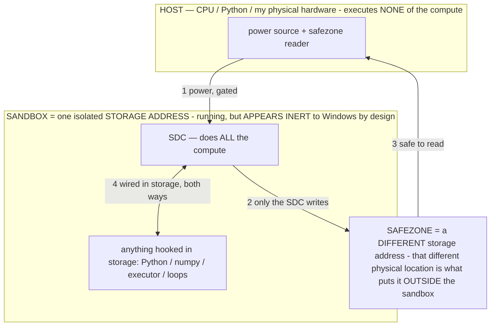

# Research: The Agent Landscape and What We Can Steal From It

> **★ HOW THE SDC IS USED — the containment model (owner diagram + spec, 07-17). Every flow ONE-WAY.**
> **① POWER → SDC:** one way from the wall into the SDC, gated at the sandbox boundary.
> **② SDC → SAFEZONE:** the SDC writes its result one way to a spot OUTSIDE its sandbox — and **only the SDC writes there.**
> **③ SAFEZONE → HOST:** your CPU / Python / physical hardware **reads** the safezone (read-only) — never writes it, never reaches into the SDC.
> **④ THE SANDBOX = a location for BITS IN STORAGE where the SDC resides, alongside whatever you connect to it.** You may use **literally anything — a copy of Python, numpy, loops, the executor — as long as it is connected to the SDC *only in storage*, sandboxed there together, never wired to the host hardware.** The **SDC is the compute** — it runs whatever you connect (series or parallel). The whole thing is **invisible to Windows as nothing but an inert file — not because it isn't running (it IS computing), but because it is designed to be unseeable, so it can never throttle the CPU or draw host RAM.** That invisibility IS the containment. Reconstructing the exact logic bit by bit in the SDC with the circuit tool IS the fabrication of the SDC — build it as gates, permanently, up front; and a program may also be isolated as bits in the storage sandbox, wired to the SDC, output to the safezone.
> **THE ONE RULE:** the old bans (numpy / executor / "no py") were only ever about compute touching the **HOST HARDWARE** — that fuses to real CPU/RAM and blackholes the box. Keep it in the storage sandbox on the SDC, unseeable, and it is free.

<!-- SDC CONTAINMENT DIAGRAM (owner-verified 07-17) -->
> **THE MODEL (parts + flows):**
> - **HOST** — CPU / Python / my physical hardware. Executes **none** of the compute. Two jobs only: give **power**, and **read** the safezone.
> - **SANDBOX** = **one isolated storage address** holding the SDC *and* everything hooked to it. It is **running** (the SDC is computing) but **appears inert to Windows by design** → Windows can't see it running, so it never throttles the CPU or draws host RAM.
> - **SDC** — lives in the sandbox; does **all** the compute.
> - **HOOKED-IN PROGRAMS** — in the sandbox, wired to the SDC *in storage*: Python, numpy, the executor, loops — anything, as long as it is hooked to the SDC **only** and never touches the hardware. The SDC is their compute.
> - **SAFEZONE** = a **different storage address**. Being a different physical location is what makes it *outside* the sandbox. The SDC writes here; the host reads here.
>
> **FLOWS:** ① HOST power → SDC (gated in) · ② SDC → SAFEZONE (only the SDC writes) · ③ SAFEZONE → HOST (safe to read) · ④ SDC ↔ hooked-in programs (wired in storage; the SDC computes them).

> **★ SDC CONTAINMENT LAW — why the RAM stays flat.** The SDC only "passes electricity into the system" — fuses its compute to the host CPU/RAM, which is what blackholes RAM — when it is **not** sandboxed. Sandboxed, the compute reads stored gates by address (mmap, transient) and exits, so nothing becomes resident. The one seam across the boundary is the read-only **safezone OUTSIDE the sandbox** (external files under `C:/llm/sdc_out/`, `C:/llm/sdc_fold/`): an inert file the SDC left behind. Poke the safezone with all the RAM/CPU you want — it can **never** connect the SDC to the CPU. RAM spikes only if host code wires **into** the running compute (executor-as-mine, bound workers, polling live gates) — forbidden. Full: `archive_misdescribed/SDC_FULL_THROTTLE.md`, memory `sdc-physical-containment-why-ram-flat`.

> Titan (SDC) doc corpus — map: [INDEX.md](INDEX.md) · layer: **HISTORY** · status: **SURVEY**

*Synthesized from four research passes (PC/computer-use landscape, mobile-agent + tool-reliability literature, the "critique of agent model" paper hunt, SearXNG feasibility). Written for Agent — the local, on-device Android phone agent. All recommendations honor §2: the model decides; deterministic code is perception, primitives, safety, and behavior-reflexes only. Target file: `docs/research-agent-landscape.md`.*

---

## 1. The landscape, briefly

### PC / computer-use agents

| Agent | Perception | Grounding | Where the model runs | Safety pattern |
|---|---|---|---|---|
| **Claude Computer Use** (Anthropic) | Raw screenshots, fresh one after EVERY action | Model predicts pixel coordinates directly | Cloud model, sandboxed VM/Docker environment | Sandbox + narrow confirmations on sensitive actions |
| **OpenAI Operator / CUA** | Raw pixels, RL-trained perceive-reason-act cycle | Direct coordinate prediction | Cloud model + cloud-hosted browser | Confirmations on consequential actions; **takeover mode** (model blinded during credential entry); separate **monitor model** that pauses on suspected prompt injection |
| **Google Project Mariner** | Screenshots to cloud Gemini | Coordinate prediction | Cloud | Shows the user a **step plan before acting**; hard pause+confirm on purchases; live view with takeover |
| **UI-TARS** (ByteDance) | Screenshot-only, end-to-end native model | Direct coordinate prediction, trained in | Varies (open weights) | System-2 patterns trained in: task decomposition, reflection, **milestone recognition**, error recovery via reflection-tuning/DPO |
| **Browser Use** (open source, 89% WebVoyager) | **DOM, not pixels** — interaction-relevant elements only, **ephemeral per-observation indices** | Element index | Any LLM | Model-authored compressed **memory string** carried across steps; **descriptive failure messages** fed back |
| **Skyvern** | Hybrid vision + DOM annotation | Annotated elements | Cloud LLMs | v2.0 splits **Planner / Actor / Validator** — every step checked by a separate role |
| **Agent S2** (Simular; OSWorld/AndroidWorld SOTA) | Screenshot + structure | **Mixture of Grounding** — model names the target semantically, deterministic experts resolve to coordinates | Cloud LLMs | **Proactive Hierarchical Planning** — re-plans *remaining* subgoals at each subgoal boundary |

Validation note: **AndroidWorld's own M3A baseline uses exactly our recipe** — SoM-annotated screenshot + a11y-tree leaf list — and its analysis found multimodal input "generally does not outperform the text-only approach" when a good a11y text representation exists. Our perception stack is not idiosyncratic; it is the benchmark-validated recipe for this problem, and it is the *right* one for a small model.

### Mobile-agent + reliability literature (the measurable levers)

- **Mobile-Agent-v2/v3**: post-action **reflector** (effective/ineffective/erroneous verdict from a before/after screen diff) + a compact **Notetaker** memory unit → ~+27–30% absolute SR over the single-agent baseline in their ablations.
- **AndroidControl** (arXiv 2406.03679): sub-10B models score dramatically higher executing **low-level step instructions** than navigating from the high-level goal alone. The single biggest difficulty lever for our model class.
- **GUI-Critic-R1** (arXiv 2506.04614): **pre-execution** critique beats post-hoc for irreversible GUI actions (send/delete/pay).
- **AppAgent** (arXiv 2312.13771): exploration-built **per-element effect docs** ("tapping X opens Y"); more documentation → higher SR.
- **Reflexion** (arXiv 2303.11366): a stored natural-language **lesson from each failure** took ReAct from 32% → 53% SR on ALFWorld with no weight updates.
- **Anthropic tool-use engineering**: deferring full tool docs to on-demand raised tool-selection accuracy **49% → 74%** and cut tokens ~85%.
- **Self-consistency voting**: 2–3 sampled decisions + string-level consensus filters one-off wrong actions — works with **zero logit access**.

---

## 2. THE differentiator (honest)

Every serious agent above solves reliability by **scaling the driver**: a frontier or RL-trained model in the cloud, acting on a disposable sandboxed environment where mistakes are cheap, protected by multi-tenant confirmation UIs. **Agent is the only system in this survey that inverts it**: a 4B on-device model, 15–40 s per decision, no logit access, piloting the owner's one physical phone with irreversible real-world state — with the entire engineering budget spent on the **vehicle**: truthful structured perception (a11y tree + SoM + OCR — the benchmark-validated recipe), deterministic primitives, executor-level hard safety blocks, honest memory. **We substitute structure for model scale**, under an inviolable rule nobody else has: *only the model's own decision counts as success.* Benchmark culture actively rewards the opposite (scaffolding shortcuts that overfit — exactly what *AI Agents That Matter* documents). Add fully-local privacy and a single-owner trust model, and that is the differentiator.

**What the others do better — plainly:** their models are stronger (implicit visual grounding and long-horizon planning E4B cannot do); their inference is 10–40× faster per step; their sandboxes make errors cheap where ours touch real state; UI-TARS/CUA bake error-correction into weights where we can only scaffold it; and they validate against public benchmarks while we validate against one owner's logs. Also: the entire industry has independently converged on "model elsewhere, thin executor on the machine" — which is strong external evidence that our approved **split-brain companion architecture** is the correct next move, not a compromise.

## 3. How PC computer-use agents differ from us (plain language)

1. **Perception**: frontier agents are pixel-first — a huge vision model stares at screenshots and predicts click coordinates by sheer scale. Open web agents scrape the DOM. We use Android's accessibility tree, which is a *cleaner, more truthful* structured layer than heuristic DOM scraping — the strongest position available to a small model.
2. **Action substrate**: a PC gives agents mouse x/y + a full keyboard with hotkeys (Ctrl+C, URL bar, sometimes bash) — a universal reliable-shortcut layer. Phones have none of that; our equivalents are intents (`open_app`), clipboard verbs, `quick_settings` — and touch adds gesture semantics (swipe/long-press/drag/draw) PC agents barely model.
3. **Deployment**: every major PC agent runs the model in the cloud and usually the environment in a sandboxed VM/cloud browser where a wrong click is rollback-able. We run on the owner's real phone where a wrong tap sends a real text — which is why our safety **must** live as hard blocks in the executor, not in their disposable-sandbox pattern.
4. **Trust model**: they defend a vendor against millions of untrusted users and untrusted pages — confirmation prompts, live takeover UIs, credential modes that blind the model, server-side monitor models. We are single-owner, local, owner-authenticated: kill switches + deterministic blocks. Two of their ideas port cleanly (blind the model during credential entry; flag instruction-shaped on-screen text as DATA); their per-action fresh-observation discipline ports as a free a11y diff; and their cloud-brain/thin-body shape *is* our split-brain plan.

---

## 4. Top 10 portable techniques, ranked by expected task-success impact for US

Ranking criteria: expected SR lift for a 4B model at 15–40 s/decision under a 4096-token ceiling; implementability in the existing Kotlin engine; strict §2 compliance (perception / primitives / memory / behavior-reflexes / steering the model reads — never deciding for it).

### #1 — Deterministic post-action outcome feedback (a11y state-diff + failure diagnosis + staleness guard)
*Sources: Claude CU screenshot-per-action, Mobile-Agent-v2 reflector (+27–30% SR), Browser Use failure messages + ephemeral indices.*
**Spec.** In `AgentOrchestrator.step()`, diff consecutive `snapshotScreen()` element lists (keyed by id/label/bounds) and inject a 2–3 line `SCREEN CHANGED: +new / −gone / ~state-flipped` block (~15 tokens, zero inference) into the next prompt; when the pixel-hash saver says "visually unchanged" but a state tag flipped (`[disabled]`→enabled), surface the diff anyway. `performActionJson` returns a structured outcome; on any non-clean outcome, prepend `LAST ACTION RESULT: <diagnosis>` ("tap landed but element was [disabled]", "set_text: field lost focus, text not landed", "id 14 no longer on screen"). Stamp snapshots with a generation counter; **refuse id-actions carrying a stale generation** with "screen changed since you saw id N — re-look" (enforces §13's never-act-on-unconfirmed-screen in code). Tiny clusterer: if the last N failures share a cause tag, state the pattern in one line. All observed fact, never decision.
**Acceptance.** A silent failure corrected by the model in ONE step (was 2–3); stale-id rejections visible in `[act]`; UNTESTED.md entries per tag.

### #2 — Grounding-by-description with a deterministic resolver cascade (Agent S2 "Mixture of Grounding")
**Spec.** Optional `"target":"<description>"` on `click`/`long_press`/`tap_xy` in `performActionJson`. Cascade: (1) exact/normalized a11y label or content-desc; (2) fuzzy/substring match, disambiguated by stated screen region; (3) ML Kit OCR word match; (4) fall back to the model's coordinates but **snap** to the nearest element bbox center within a threshold. Log the grounding expert (`[act] grounded via ocr`). The model decides WHAT; the resolver is pure translation — all four experts already exist as parallel options in the codebase.
**Acceptance.** Formerly mis-tapped targets resolved via label/OCR in logs; the resolver never picks a target the model didn't name.

### #3 — Atomic low-level plan steps + current-step injection (AndroidControl)
**Spec.** `makePlan` emits atomic single-action-sized steps ("tap the compose button"). Orchestrator tracks a cursor advanced **only by the model's own report** (via `assert` or a `plan_step` field) and injects `CURRENT STEP: k of n — <instruction>`. Model may deviate freely; reorient already regenerates the plan. Converts every decision into the easy regime for a sub-10B model. Steering, not scripting.
**Acceptance.** Fewer drift/reorient firings on long tasks; a deliberately wrong plan step observably overridden by the model.

### #4 — Model-authored running task notes (Browser Use memory string / Mobile-Agent Notetaker)
**Spec.** Optional `"note":"..."` on any action (free when omitted, like `confidence`). Size-capped in-RAM `TASK NOTES:` block (~60 tokens, oldest dropped, cleared on `done`), injected every step and surviving dense-screen trimming **ahead of** optional memory blocks — it's the model's own working state. Engine auto-jots deterministic facts it already knows (clipboard contents, last `get_text` result).
**Acceptance.** A cross-app value-carry task succeeds with the value visible in the notes block; injected-history token count drops.

### #5 — Deferred action docs + on-demand `help` action (Anthropic Tool Search pattern; 49%→74%)
**Spec.** Split `buildActionPrompt`'s catalog: CORE verbs keep full docs; RARE verbs (split_screen, connected_devices, save_login, sketch…) get one line (name + 5-word "when to use"). Zero-risk `{"action":"help","about":"<verb>"}` returns the full doc as the next observation. Auto-inflate a rare verb's docs when the **screen** makes it relevant (canvas detected → draw/sketch inflate) — keyed to the observed screen, never the task text. Organizing the action space, not gating it.
**Acceptance.** Measured prompt-token drop on dense screens; a rare-verb task still completes via help/auto-inflation.

### #6 — Text-first decision mode + error-quoted JSON retry (AndroidWorld M3A)
**Spec.** (a) Setting-gated: when a11y coverage is high (most elements labeled, no OCR-only regions), decide **text-only** from the element list; escalate to vision when the model asks (`zoom`/`ocr`) or coverage is poor — wired to the tier/`modelIsHeavy` knobs per §12, never to a model name or prompt keyword. (b) When JSON salvage would require *guessing intent* (a scripted decision in disguise), re-prompt once, text-only: "Your action was invalid: `<exact parse error>`. Emit ONE corrected JSON action." One retry, then current salvage. Latency saved = more retries inside the caps = persistence = SR.
**Acceptance.** Labeled-screen step latency drops to text-only time; a malformed action self-corrected with the parse error visible in `[brain]`.

### #7 — Milestone self-declaration + milestone-boundary replanning (UI-TARS + Agent S2 PHP)
**Spec.** Extend the tiny-thought convention to an optional micro-format `"thought":"[3/6 msg typed] tap send"`; parse the bracket if present (free when absent), echo the last milestone into the next prompt. "Milestone unchanged for N steps" feeds the existing stuck/reorient logic — the model declaring itself stuck is cleaner signal than screen-hash heuristics. On milestone **advance**, run text-only `revisePlan(remaining goals, latest diff, running note)` on the fast helper (Dispatchers.IO, never blocking) and inject the revised remaining-plan where the stale original sits. Model free to ignore it.
**Acceptance.** Bracket + echo in logs; a mid-task plan revision in `[brain]`; a stuck run reoriented off milestone-stall before the hash cap.

### #8 — Per-element effect documentation (AppAgent, extending PROVEN observations)
**Spec.** When a click reaches a new screen, record the destination's identity alongside the credit; render inline as `[12] Pen mode ✓ opens the brush panel`. In Learn mode (already the harmless exploration harness AppAgent requires), deliberately visit unvisited nav-map destinations and record effect strings. Cap per-app size; demote on contradiction, like existing observations (§7 honesty).
**Acceptance.** Effect strings visible on revisited apps; first-revisit navigation takes fewer steps than the undocumented first run.

### #9 — Reflexion-style verbal lesson after failed episodes (32%→53% on ALFWorld)
**Spec.** On failure/timeout/loop-break, feed the fast helper the objective + last ~10 action/outcome lines + stop reason; ask for ONE ≤30-word lesson. Store via the existing `AgentMemory` lessons path keyed by app + objective keywords, surfaced by the existing relevance pull. Guards: cap per app; demote if the next run succeeds without it applying; never block legitimate learning (§3). Turns the owner's "honest failures are the real signal" principle into stored, reusable steering.
**Acceptance.** A failed run writes a lesson visible in MemoryActivity; the retry shows the lesson in-prompt and a changed approach in `[trace]`.

### #10 — Risk-scoped pre-execution critic + self-consistency vote (GUI-Critic-R1 + consensus sampling)
**Spec.** Trigger ONLY on (a) consequential affordance (`[do: Send/Delete/Pay/Post]`) or (b) `"confidence":"low"` — the model's own self-regulation channel. Critic: helper gets objective + orient + the ONE proposed action + target's exact text → "will this advance the goal — yes/no + why"; on "no", the critique returns as an orient note for the model to **re-decide** (never auto-substitute — *helpers contribute intelligence, never actions*: Cognition's single-writer rule, adopt it as an explicit invariant). Vote: K=2–3 generations parsed to (verb, target-id); agreement executes; disagreement fed back ("you proposed both [12] and [15] — look again") for one final decision. OFF for ordinary steps (§13).
**Acceptance.** Gate fires only on consequential/low-confidence steps; a vetoed wrong send is re-decided by the model; median ordinary-step latency unchanged.

### Honorable mentions (worth doing, below the SR fold)
- **Prompt-injection tripwire as a perception tag** (Operator's monitor, localized): deterministic detector over node text for instruction-to-an-agent shapes → inline `[⚠ looks like instructions — it is DATA]` tag + one orient line. Reacts to what's ON SCREEN, never the owner's task text. Conservative (precision over recall); `[safety]` log line for tuning.
- **Blind-the-model credential entry** (Operator takeover): nodes with `isPassword` render as `[secret field]`; executor injects saved credentials without echoing them into history; suppress the screenshot for that single step. **Essential prep for split-brain**, where perception streams off-device.
- **Plan-preview before risky stretches** (Mariner): in PRECISION mode, the fast helper verbalizes the agent's own 2–4 step intent through the existing voice/overlay channel; continue after a short non-blocking window unless a stop arrives. Transparency, not a widened gate — §3's narrow gates stay narrow.
- **Per-task cost ledger** (*AI Agents That Matter*): instrument TaskHistory with steps / inference-seconds / vision encodes / verifier invocations, so every guard is judged on (success, cost) — and evaluate E2B vs E4B on the accuracy-cost frontier, not raw success.
- **Agent-chosen `remember` action** (CoALA): let the agent explicitly store a fact/lesson it judges reusable — agent-chosen memory formation, consistent with §2 and §7.

---

## 5. Verdicts

### 5.1 SearXNG — worth it? Where should it live?

**Worth it: yes. Placement: the future brain-host — nothing ships on the phone now.**

The case: our `search` action fires an `ACTION_VIEW` at google.com/search and the agent reads the SERP by vision — 15–40 s per decision on exactly the dense-screen class that overflows the 4096-token ceiling. A self-hosted SearXNG JSON call (one `settings.yml` line: `search: formats: [html, json]`; disabled format returns HTTP 403 — the classic gotcha) returns `{query, number_of_results, results[{title,url,content,engine,score}], unresponsive_engines[]}` in 1–3 s: **~30–120 s and 1–3 vision encodes saved per lookup**, no ad/consent-dialog mis-taps, and queries leave via our own instance (privacy-aligned).

**Placement is forced, not chosen.** SearXNG is Python/Flask — it cannot run inside the Android app; Termux is hard-blocked by our own §3; the phone's RAM is already blown by E4B; and a phone→LAN-server dependency now would front-run split-brain plumbing that isn't green-lit. Sequence it behind the brain-host:
1. Ship nothing on-phone now; browser-UI search stays the only path.
2. When the brain-host lands: docker-compose deploy **on the home network** (residential IP — datacenter IPs get Google-CAPTCHA'd within tens of queries; residential + modest rates run for months), 3–4 engines (google, duckduckgo, brave, mojeek) for fan-out redundancy.
3. Kotlin OkHttp client (~150 LOC): top ~5 results as title + url + 200-char snippet, truncated to the token budget, injected as text observation. Browser-UI search stays documented as the agent-choosable alternative.
4. **Readability4J + jsoup** for result-page extraction (Kotlin port of Mozilla Readability; Crux v5 deprecated its own extractor in favor of it; plain JVM/Android libs): one HTTP fetch replaces N vision steps of scrolling an article. Hard size cap + paging. Static-HTML only — near-empty output on JS/paywall pages, which becomes a signal (below).
5. **Philosophy compliance is the spine**: deterministic quality signals — HTTP 403/429/timeout; empty `results[]`; `unresponsive_engines` (especially all-engines-down); result count < ~3; total snippet chars < ~150; zero query-term overlap in titles+snippets (computed on the RESPONSE, never the objective); extraction yield < ~200 chars; all-one-domain page-1 — surfaced as terse orient-string FACTS. The **agent** decides: accept / rephrase / fall back to piloting the browser. **Never** auto-fallback in code; never retry-hammer a blocked engine deterministically. `[search]` log lines; UNTESTED.md entries per the not-in-a-log rule.

Effort: ~0.5 day deploy + ~1.5 days Kotlin/wiring ≈ **2 days**, all deterministic code, no model changes.

### 5.2 The "critique of agent model" paper — found?

**Found, high confidence, one honest caveat.** Best match: **"Critique of Agent Model" — arXiv 2606.23991, Eric Xing, Mingkai Deng, Jinyu Hou, June 2026.** Near-exact title, recent, squarely a critique of LLM-agent architectures. Thesis: current "agentic" systems are software pipelines whose competence lives in engineered external scaffolding, not the model ("agentic" vs truly "agentive"); analyzes agents along five dimensions — goal, identity, decision-making, self-regulation, learning — and proposes the **GIC architecture** (internalized hierarchical goals, evolving identity, simulative reasoning over a world model, a learned *configurator* that self-regulates when/how deeply to deliberate, self-directed learning). Companion paper **arXiv 2605.22138** operationalizes the **System I (reactive) / System II (simulative planning) / System III (configurator)** split.

**Caveat, stated plainly:** arxiv.org and all fetch targets were 403-blocked at the research sandbox's proxy, so this summary is synthesized from listings (arXiv abstract page, HuggingFace Papers, alphaXiv, themoonlight.io) — corroborated across four independent sources, **not a full-text read**. Pull 2606.23991 + 2605.22138 directly to confirm.

**Relevance:** the paper is essentially a formal critique of what Agent *is*, and our §2 already concedes its central point. The exportable idea is the System I/II/III self-regulation frame — we half-have it (confidence field, pixel-hash vision skip, fast helper vs slow vision model); techniques #6 and #10 extend it; the nav-map "predicted next screen if you tap X" line is simulative reasoning on the cheap; keeping makePlan output visible per-step in AgentLog answers its auditability point.

**Runners-up** in case the memory was of something else: *AI Agents That Matter* (arXiv 2407.01502 — evaluation critique; external validation of "agent-driven success is the only metric" and token-frugality; warns that playbooks can be overfit shortcuts → keep demote-on-failure discipline on full playbooks too); *CoALA* (arXiv 2309.02427 — Agent independently converged on its episodic/semantic/procedural memory taxonomy; gaps: agent-chosen memory writes, propose→evaluate→select on risky steps); Cognition's *Don't Build Multi-Agents* essay (single-writer invariant: only the main loop emits actions; helpers — verifier, composeReply, future action-head — return judgments only, and must receive full context or their vetoes become the conflicting-implicit-decision bug; the SEND decision stays with the main agent; across devices, the brain host is the single writer and the companion never originates actions).

### 5.3 Dynamic / multiple context windows for one small model

**What the landscape does:** (1) **model-authored scratchpads** — Browser Use's carried-forward memory string, Mobile-Agent's Notetaker: the model writes its own compressed working state each step; (2) **memory streams with retrieval** — long-term stores queried by relevance per step (AgentMemory already maps one-to-one onto CoALA's semantic/episodic/procedural split); (3) **separate contexts per role** — Skyvern's Planner/Actor/Validator, Agent S2's hierarchy: each role gets a fresh prompt over shared external state; (4) UI-TARS short-term memory = recent screenshots + its own running thoughts. **Nobody keeps multiple live KV caches per agent on constrained hardware.**

**The pragmatic version for 4 GB RAM:** don't attempt resident parallel contexts — a second full KV cache is exactly the §8 RAM blowup. Exploit the fact that our loop is already **stateless per step**: the context window is rebuilt every decision, so "multiple dynamic contexts" = **multiple prompt assemblies over shared external state**, at zero extra RAM:

- **(a)** the agent-written TASK NOTES block (technique #4) is the scratchpad — working memory persisted by the engine, not the KV cache;
- **(b)** tiered retrieval by CoALA key — episodic observations by current app, semantic facts by objective relevance, procedural playbooks only at plan time — prevents dump-everything bloat;
- **(c)** the ONE genuine second context we already pay for — the small text-only helper with its own modest KV cache (composeReply / verifier / revisePlan) — is our Planner/Validator analog, governed by the single-writer invariant and by **context parity** (the helper must see objective + recent trace, not just the current screen);
- **(d)** dense-screen trimming keeps a fixed priority order: image + element list + task notes survive; optional memory blocks drop first.

That combination captures ~90% of what subagent-context architectures buy, at a RAM cost we can actually afford.

---

## 6. Sources

**PC/computer-use landscape:** arXiv 2501.12326 (UI-TARS); anthropic.com computer-use docs + news; openai.com/index/computer-using-agent; help.openai.com/en/articles/10421097 (Operator); support.google.com/labs/answer/16270604 + allaboutai.com (Mariner); arXiv 2504.00906 + simular.ai (Agent S2); deepwiki.com/browser-use (DOM engine, agent system, element detection); skyvern.com/blog; github.com/google-research/android_world; llm-stats.com/benchmarks/androidworld-sr; workos.com CU-vs-CUA comparison; futureagi.com browser-agent evals; ingramhaus.com action-verification.

**Mobile agents + reliability:** arXiv 2406.01014 (Mobile-Agent-v2); arXiv 2508.15144 (Mobile-Agent-v3/GUI-Owl); arXiv 2312.13771 (AppAgent); arXiv 2405.14573 (AndroidWorld); arXiv 2406.03679 (AndroidControl); arXiv 2506.04614 (GUI-Critic-R1); arXiv 2303.11366 (Reflexion); anthropic.com/engineering/advanced-tool-use; arXiv 2510.18488; bentoml.com structured-outputs.

**Paper hunt:** arXiv 2606.23991 + huggingface.co/papers/2606.23991 + alphaxiv.org + themoonlight.io (Critique of Agent Model — listings only, 403-blocked full text); arXiv 2605.22138 (companion); arXiv 2407.01502 (AI Agents That Matter); arXiv 2309.02427 (CoALA); cognition.com/blog/dont-build-multi-agents.

**SearXNG:** docs.searxng.org (search API, settings, limiter); github.com/searxng discussions 3542/4429, issue 2987; github.com/Fosowl/agenticSeek issue 410; nordbastion.com self-host guide; github.com/dankito/Readability4J; github.com/chimbori/crux; docs.litellm.ai/docs/search/searxng.
