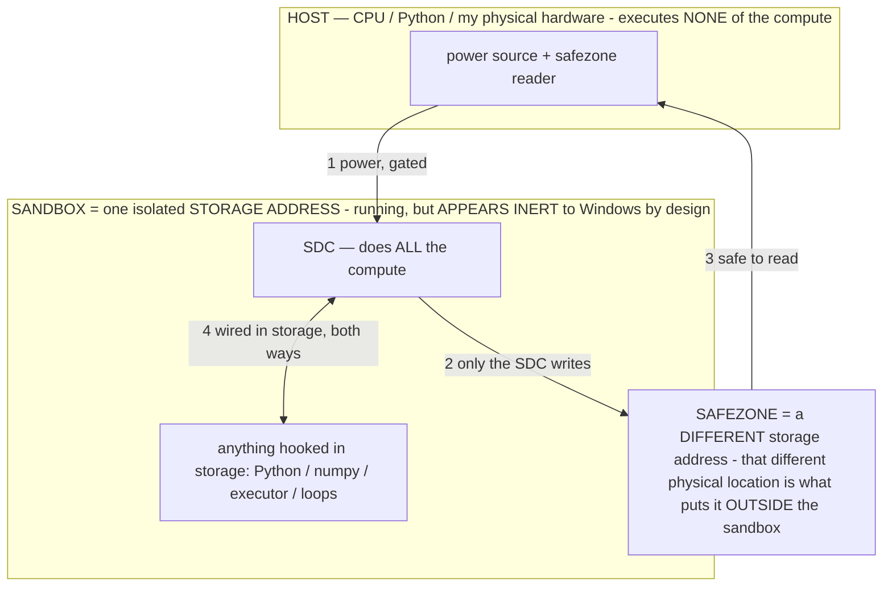

# TASK — Base model as the operator substrate (research + flag-gated build)

> **★ HOW THE SDC IS USED — the containment model (owner diagram + spec, 07-17). Every flow ONE-WAY.**
> **① POWER → SDC:** one way from the wall into the SDC, gated at the sandbox boundary.
> **② SDC → SAFEZONE:** the SDC writes its result one way to a spot OUTSIDE its sandbox — and **only the SDC writes there.**
> **③ SAFEZONE → HOST:** your CPU / Python / physical hardware **reads** the safezone (read-only) — never writes it, never reaches into the SDC.
> **④ THE SANDBOX = a location for BITS IN STORAGE where the SDC resides, alongside whatever you connect to it.** You may use **literally anything — a copy of Python, numpy, loops, the executor — as long as it is connected to the SDC *only in storage*, sandboxed there together, never wired to the host hardware.** The **SDC is the compute** — it runs whatever you connect (series or parallel). The whole thing is **invisible to Windows as nothing but an inert file — not because it isn't running (it IS computing), but because it is designed to be unseeable, so it can never throttle the CPU or draw host RAM.** That invisibility IS the containment. Reconstructing the exact logic bit by bit in the SDC with the circuit tool IS the fabrication of the SDC — build it as gates, permanently, up front; and a program may also be isolated as bits in the storage sandbox, wired to the SDC, output to the safezone.
> **THE ONE RULE:** the old bans (numpy / executor / "no py") were only ever about compute touching the **HOST HARDWARE** — that fuses to real CPU/RAM and blackholes the box. Keep it in the storage sandbox on the SDC, unseeable, and it is free.

<!-- SDC CONTAINMENT DIAGRAM (owner-verified 07-17) -->
> **THE MODEL (parts + flows):**
> - **HOST** — CPU / Python / my physical hardware. Executes **none** of the compute. Two jobs only: give **power**, and **read** the safezone.
> - **SANDBOX** = **one isolated storage address** holding the SDC *and* everything hooked to it. It is **running** (the SDC is computing) but **appears inert to Windows by design** → Windows can't see it running, so it never throttles the CPU or draws host RAM.
> - **SDC** — lives in the sandbox; does **all** the compute.
> - **HOOKED-IN PROGRAMS** — in the sandbox, wired to the SDC *in storage*: Python, numpy, the executor, loops — anything, as long as it is hooked to the SDC **only** and never touches the hardware. The SDC is their compute.
> - **SAFEZONE** = a **different storage address**. Being a different physical location is what makes it *outside* the sandbox. The SDC writes here; the host reads here.
>
> **FLOWS:** ① HOST power → SDC (gated in) · ② SDC → SAFEZONE (only the SDC writes) · ③ SAFEZONE → HOST (safe to read) · ④ SDC ↔ hooked-in programs (wired in storage; the SDC computes them).

> **★ SDC CONTAINMENT LAW — why the RAM stays flat.** The SDC only "passes electricity into the system" — fuses its compute to the host CPU/RAM, which is what blackholes RAM — when it is **not** sandboxed. Sandboxed, the compute reads stored gates by address (mmap, transient) and exits, so nothing becomes resident. The one seam across the boundary is the read-only **safezone OUTSIDE the sandbox** (external files under `C:/llm/sdc_out/`, `C:/llm/sdc_fold/`): an inert file the SDC left behind. Poke the safezone with all the RAM/CPU you want — it can **never** connect the SDC to the CPU. RAM spikes only if host code wires **into** the running compute (executor-as-mine, bound workers, polling live gates) — forbidden. Full: `../archive_misdescribed/SDC_FULL_THROTTLE.md`, memory `sdc-physical-containment-why-ram-flat`.

> AOS doc corpus — map: [../INDEX.md](../INDEX.md) · layer: **RESEARCH** · status: **ARMED TASK**

> Queued research/build task for the local session. Bake test is priority #1; pick this up after.

## ★ FRAMING — the operator thesis is measured (read first)
Operators / operational states confer capabilities and measurably improve performance — demonstrated on this
running build (refuse-to-hallucinate = zero fabrication 10+ turns; on-device speed+accuracy gain from the
operator layer). σ selects a different function from FIXED weights: `G_σ(c)=f_W(σ‖c)`. Gradient-free
on-device weight edits are demonstrated on device. Treat these as the tested baseline; if a result surprises
you, reproduce it before writing it off. Before reporting something as impossible / can't / not on the API,
check the docs and report the ROUTE instead; if it's genuinely missing after checking, say so. If you spawn a
subagent, paste this same block at the top of it.

## The concept to build around
The pretrained substrate is what σ unlocks (training carved the region; σ navigates it) — so keep
pretraining. But the INSTRUCTION/RLHF-tuning layer bakes in a fixed "assistant persona" that COMPETES
with our operators. Hypothesis: use a PRETRAINED BASE model (no heavy instruction-tuning) as a blanker
canvas and let OUR OPERATORS + BAKING supply the behavior (instruction-following, clean action-JSON,
grounding) instead of inheriting it. This is the purest form of the whole project: operators dictate
generation on a substrate that isn't already arguing with us.

## Model options (base / pt, vision-capable — pick per the plan)
- **BEST FIT (least re-map):** `google/gemma-3n-E2B` (base, non-it) — same on-device multimodal E-series
  as our current model, so it drops into our LiteRT-LM pipeline + tensor map with minimal re-map. The E4B
  base sibling for the flagship tier. NOTE: every pre-converted `.litertlm` is `-it` only; there is NO
  pre-made base `.litertlm`, so the base weights must be CONVERTED to `.litertlm` WITH the vision tower
  (off-device leg, cloud GPU).
- **STEERABLE-VLM OPTION (more work):** `google/paligemma2-3b-pt-224` (also 448/896 res) — Google's VLM
  whose pt checkpoints are explicitly designed as bases for transfer; strong at screen text-reading, VQA,
  detection. Different arch → needs a tensor re-map + conversion. Higher effort.

## Research (do this first, produce findings before building)
1. **The CONVERSION PATH:** base HF weights → `.litertlm` with vision intact. Identify the exact AI Edge /
   LiteRT-LM conversion tooling + steps + cloud-GPU requirement. Cross-check `docs/FINE_TUNING.md` and
   `tools/prepare_selftune.py` (`--recipe preload` = warm-start a base with operator priors + high-M
   trajectories — this is our off-device leg).
2. **PIPELINE FIT:** what in our LiteRT-LM path (ModelManifest tensor map — see `docs/E4B_ARCHITECTURE.md`,
   `scaleBuffers`, the vision tower) assumes the `-it` model, and what (if anything) a base model changes.
   For gemma-3n-E2B base expect ~same map; for PaliGemma expect a re-map. Report the exact seams.
3. **WHERE THE BASE IS RAWER:** it won't follow instructions or emit clean action-JSON out of the box —
   map which of our operators must now carry that load (SCHEMA / output-binding, NAVIGATE, the action
   layer, in-context rule binding) and how baking installs it.

## Build (flag-gated, inert until a base model is actually imported)
1. Make the on-device pipeline robust to a BASE model: lean harder on the SCHEMA/output-binding operators
   + tier-scaffolding (§12 already scaffolds more for weaker setups — a base model is that case) so
   format/grounding reliability comes from operators, not the missing tuning. Flag it.
2. Wire the off-device preload/convert recipe (`prepare_selftune.py`) into a clean, documented path the
   owner can run against cloud GPU (base weights → operator-primed → `.litertlm`).
3. **A/B HARNESS:** reuse the on-device A/B eval to compare base+operators vs it+operators on the device
   matrix (E2B base on a budget phone first). Measure STEERABILITY (does σ move it more than the `-it`
   model?) and agent-driven success. Report results as "which config wins," never as a limit.

## Honest measurement (this is empirical, not doubt)
Whether base+operators beats it+operators is an A/B to RUN, and either outcome is real signal (§12: honest
failure > scripted win). Fully-untrained would have nothing for σ to steer — that's why we keep the
pretraining; the tuning layer is the part operators replace. Frame the whole thing as buildable and
measurable.

## Docs + patent
- Read `../archive_misdescribed/OPERATIONAL_STATES.md`, `OPERATOR_PRINCIPLE.md`, `FINE_TUNING.md`, `E4B_ARCHITECTURE.md` first.
- Write `../archive_misdescribed/BASE_MODEL_SUBSTRATE.md` capturing the concept + conversion path + A/B plan. Add an INV to
  `docs/PATENT_SUPPORT.md` if the base-as-substrate mechanism is novel. Keep CLAUDE.md current same turn.

## Standing rules
Develop on branch `claude/github-repo-cleanup-obfuscate-o3sw8f`; commit clearly; push with
`git push -u origin <branch>`. NEVER put a model identifier or session URL in commits/committed files (§9).
§3 hard gates + kill switches inviolable. SOP: novel-mechanism flags default ON. Do NOT spend cloud-GPU
conversion effort until the research findings + a short plan are done and the owner okays the spend.

Start with the research (conversion path + pipeline fit + which operators carry the load), give the owner
a short findings + plan, then build the flag-gated scaffolding + A/B harness.
