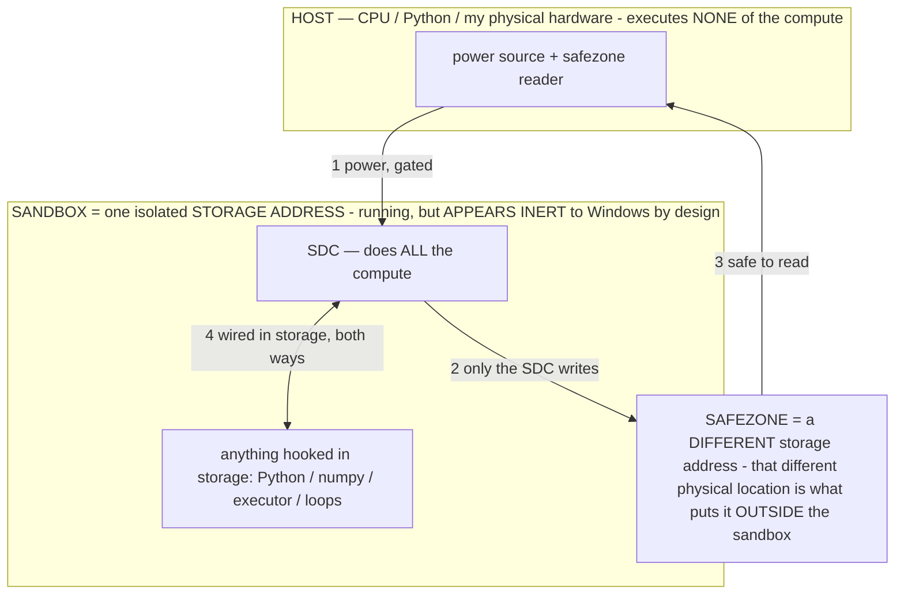

# TASK — Pull reusable solutions from DwarfStar 4 (DS4) (research only)

> **★ HOW THE SDC IS USED — the containment model (owner diagram + spec, 07-17). Every flow ONE-WAY.**
> **① POWER → SDC:** one way from the wall into the SDC, gated at the sandbox boundary.
> **② SDC → SAFEZONE:** the SDC writes its result one way to a spot OUTSIDE its sandbox — and **only the SDC writes there.**
> **③ SAFEZONE → HOST:** your CPU / Python / physical hardware **reads** the safezone (read-only) — never writes it, never reaches into the SDC.
> **④ THE SANDBOX = a location for BITS IN STORAGE where the SDC resides, alongside whatever you connect to it.** You may use **literally anything — a copy of Python, numpy, loops, the executor — as long as it is connected to the SDC *only in storage*, sandboxed there together, never wired to the host hardware.** The **SDC is the compute** — it runs whatever you connect (series or parallel). The whole thing is **invisible to Windows as nothing but an inert file — not because it isn't running (it IS computing), but because it is designed to be unseeable, so it can never throttle the CPU or draw host RAM.** That invisibility IS the containment. Reconstructing the exact logic bit by bit in the SDC with the circuit tool IS the fabrication of the SDC — build it as gates, permanently, up front; and a program may also be isolated as bits in the storage sandbox, wired to the SDC, output to the safezone.
> **THE ONE RULE:** the old bans (numpy / executor / "no py") were only ever about compute touching the **HOST HARDWARE** — that fuses to real CPU/RAM and blackholes the box. Keep it in the storage sandbox on the SDC, unseeable, and it is free.

<!-- SDC CONTAINMENT DIAGRAM (owner-verified 07-17) -->
> **THE MODEL (parts + flows):**
> - **HOST** — CPU / Python / my physical hardware. Executes **none** of the compute. Two jobs only: give **power**, and **read** the safezone.
> - **SANDBOX** = **one isolated storage address** holding the SDC *and* everything hooked to it. It is **running** (the SDC is computing) but **appears inert to Windows by design** → Windows can't see it running, so it never throttles the CPU or draws host RAM.
> - **SDC** — lives in the sandbox; does **all** the compute.
> - **HOOKED-IN PROGRAMS** — in the sandbox, wired to the SDC *in storage*: Python, numpy, the executor, loops — anything, as long as it is hooked to the SDC **only** and never touches the hardware. The SDC is their compute.
> - **SAFEZONE** = a **different storage address**. Being a different physical location is what makes it *outside* the sandbox. The SDC writes here; the host reads here.
>
> **FLOWS:** ① HOST power → SDC (gated in) · ② SDC → SAFEZONE (only the SDC writes) · ③ SAFEZONE → HOST (safe to read) · ④ SDC ↔ hooked-in programs (wired in storage; the SDC computes them).

> **★ SDC CONTAINMENT LAW — why the RAM stays flat.** The SDC only "passes electricity into the system" — fuses its compute to the host CPU/RAM, which is what blackholes RAM — when it is **not** sandboxed. Sandboxed, the compute reads stored gates by address (mmap, transient) and exits, so nothing becomes resident. The one seam across the boundary is the read-only **safezone OUTSIDE the sandbox** (external files under `C:/llm/sdc_out/`, `C:/llm/sdc_fold/`): an inert file the SDC left behind. Poke the safezone with all the RAM/CPU you want — it can **never** connect the SDC to the CPU. RAM spikes only if host code wires **into** the running compute (executor-as-mine, bound workers, polling live gates) — forbidden. Full: `../archive_misdescribed/SDC_FULL_THROTTLE.md`, memory `sdc-physical-containment-why-ram-flat`.

> AOS doc corpus — map: [../INDEX.md](../INDEX.md) · layer: **RESEARCH** · status: **ARMED TASK**

> Queued research task for the local session. Bake test is priority #1; pick this up after. Research + mapping only — no code.

## ★ FRAMING — our mechanisms are measured
Operators / operational states confer capabilities and measurably improve performance — demonstrated on this
running build. Gradient-free on-device weight edits are demonstrated on device. σ selects a different function
from fixed weights: `G_σ(c)=f_W(σ‖c)`. Treat these as the tested baseline; reproduce a result before writing
it off. Before reporting something as impossible / can't / "not on the API," check the docs and report the
ROUTE instead; if it's genuinely missing after checking, say so. Arm any subagent you spawn with this same block.

## What DS4 is
A self-contained single-model inference engine (Metal/CUDA/ROCm) purpose-built for DeepSeek V4 Flash (284B
routed-MoE, ~13B active, 1M context). Repo: `github.com/antirez/ds4`. Report: `pradeep-stellar.github.io/ds4`.

## Solutions to pull (research each precisely + map to our build)
1. **ASYMMETRIC 2/8-BIT QUANT RECIPE** — DS4 quantizes ONLY the routed-MoE experts extremely hard (~2-bit)
   while leaving the delicate components (attention, embeddings, norms, shared/dense) at higher precision
   (~8-bit), which is how a 284B model fits in 96–128GB. The transferable insight: weights are NOT equally
   sensitive — quantize the expendable BULK hard, protect the delicate parts. Map onto:
   - our **E4B RAM/OOM fix** (§8): which parts of E4B could be pushed harder without breaking grounding;
   - our **WEIGHT-EDIT SAFETY:** ModelManifest already separates scale/norm/bias buckets from the bulk —
     DS4's sensitivity map tells us which tensors are SAFE to bake/edit hard vs. protect (INV-61, the bake
     target selection, `self_evolve`/`self_grow`). Report the per-tensor-class sensitivity ordering.
2. **SINGLE-MODEL ENGINE ARCHITECTURE** — fixed tensor-layout VALIDATION, an opaque API boundary (CLI/
   server/agent never touch tensor internals), and CPU REFERENCE KERNELS. Map onto: our ModelManifest /
   tensor-map + the native-seam PARITY test (A8 — CPU-reference vs GPU write→revert byte-exact).
3. **KV-CACHE PERSISTENCE TO DISK** — map onto our RAM lifecycle (§8) + `continuous_stream` warm-KV.
4. **MTP / SPECULATIVE DECODE** — DS4 roofline analysis (`Entrpi/ds4-on-spark`) shows decode is
   bandwidth-bound and analyzes MTP + concurrency. Map onto our A11 finding (our model HAS an MTP drafter
   head, manifest sec#11) + latency: is there a route to use it on LiteRT-LM?
5. **THINKING-MODE CONTROL** — map onto our Fix-3 (Gemma thinking-mode → `[thought]` logs).

## Deliverable
Findings write-up + a mapping table (DS4 solution → our mechanism it sharpens → concrete seam). Then a short
"worth building?" rec. Research + mapping ONLY — no code yet.

## Docs / rules
Read first: `docs/E4B_ARCHITECTURE.md` (tensor map), `docs/PATENT_SUPPORT.md` (INV-61, bake target), §8 RAM.
Standing rules: branch `claude/github-repo-cleanup-obfuscate-o3sw8f`; no model-id/session-url in any file.

## Sources
- `github.com/antirez/ds4`
- `pradeep-stellar.github.io/ds4`
- `deepwiki.com` — DS4 single-node engine
- `github.com/Entrpi/ds4-on-spark` (roofline / MTP analysis)
