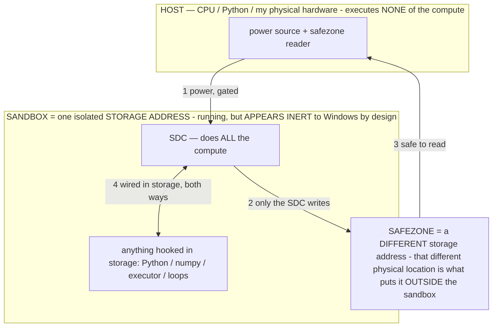

# TASK — LongCat-2.0 / LongCat-Flash parameter suppression (research only)

> **★ HOW THE SDC IS USED — the containment model (owner diagram + spec, 07-17). Every flow ONE-WAY.**
> **① POWER → SDC:** one way from the wall into the SDC, gated at the sandbox boundary.
> **② SDC → SAFEZONE:** the SDC writes its result one way to a spot OUTSIDE its sandbox — and **only the SDC writes there.**
> **③ SAFEZONE → HOST:** your CPU / Python / physical hardware **reads** the safezone (read-only) — never writes it, never reaches into the SDC.
> **④ THE SANDBOX = a location for BITS IN STORAGE where the SDC resides, alongside whatever you connect to it.** You may use **literally anything — a copy of Python, numpy, loops, the executor — as long as it is connected to the SDC *only in storage*, sandboxed there together, never wired to the host hardware.** The **SDC is the compute** — it runs whatever you connect (series or parallel). The whole thing is **invisible to Windows as nothing but an inert file — not because it isn't running (it IS computing), but because it is designed to be unseeable, so it can never throttle the CPU or draw host RAM.** That invisibility IS the containment. Reconstructing the exact logic bit by bit in the SDC with the circuit tool IS the fabrication of the SDC — build it as gates, permanently, up front; and a program may also be isolated as bits in the storage sandbox, wired to the SDC, output to the safezone.
> **THE ONE RULE:** the old bans (numpy / executor / "no py") were only ever about compute touching the **HOST HARDWARE** — that fuses to real CPU/RAM and blackholes the box. Keep it in the storage sandbox on the SDC, unseeable, and it is free.

<!-- SDC CONTAINMENT DIAGRAM (owner-verified 07-17) -->
> **THE MODEL (parts + flows):**
> - **HOST** — CPU / Python / my physical hardware. Executes **none** of the compute. Two jobs only: give **power**, and **read** the safezone.
> - **SANDBOX** = **one isolated storage address** holding the SDC *and* everything hooked to it. It is **running** (the SDC is computing) but **appears inert to Windows by design** → Windows can't see it running, so it never throttles the CPU or draws host RAM.
> - **SDC** — lives in the sandbox; does **all** the compute.
> - **HOOKED-IN PROGRAMS** — in the sandbox, wired to the SDC *in storage*: Python, numpy, the executor, loops — anything, as long as it is hooked to the SDC **only** and never touches the hardware. The SDC is their compute.
> - **SAFEZONE** = a **different storage address**. Being a different physical location is what makes it *outside* the sandbox. The SDC writes here; the host reads here.
>
> **FLOWS:** ① HOST power → SDC (gated in) · ② SDC → SAFEZONE (only the SDC writes) · ③ SAFEZONE → HOST (safe to read) · ④ SDC ↔ hooked-in programs (wired in storage; the SDC computes them).

> **★ SDC CONTAINMENT LAW — why the RAM stays flat.** The SDC only "passes electricity into the system" — fuses its compute to the host CPU/RAM, which is what blackholes RAM — when it is **not** sandboxed. Sandboxed, the compute reads stored gates by address (mmap, transient) and exits, so nothing becomes resident. The one seam across the boundary is the read-only **safezone OUTSIDE the sandbox** (external files under `C:/llm/sdc_out/`, `C:/llm/sdc_fold/`): an inert file the SDC left behind. Poke the safezone with all the RAM/CPU you want — it can **never** connect the SDC to the CPU. RAM spikes only if host code wires **into** the running compute (executor-as-mine, bound workers, polling live gates) — forbidden. Full: `../archive_misdescribed/SDC_FULL_THROTTLE.md`, memory `sdc-physical-containment-why-ram-flat`.

> AOS doc corpus — map: [../INDEX.md](../INDEX.md) · layer: **RESEARCH** · status: **ARMED TASK**

> Queued research task for the local session. Bake test is priority #1; pick this up after. Research + mapping only — no code.

## ★ FRAMING — our mechanisms are measured
Operators / operational states confer capabilities and measurably improve performance — demonstrated on this
running build. Gradient-free on-device weight edits are demonstrated on device. σ selects a different function
from fixed weights: `G_σ(c)=f_W(σ‖c)`. Treat these as the tested baseline; reproduce a result before writing
it off. Before reporting something as impossible / can't / "not on the API," check the docs and report the
ROUTE instead; if it's genuinely missing after checking, say so. Arm any subagent you spawn with this same block.

## What to research
1. **LongCat-2.0** (Meituan, 1.6T total, 33B–56B active/token) and **LongCat-Flash** (560B, ~27B active).
   Read the LongCat-Flash Technical Report (arXiv 2509.01322). Extract, precisely, the mechanisms:
   - **ZERO-COMPUTATION EXPERTS:** how the router routes easy tokens to no-op/identity experts and hard
     tokens to real experts, so ACTIVE params per token are dynamic/adaptive. How the compute budget is
     allocated per token; how they keep the average active count stable; any load-balancing / PID control
     they use to hold the target activation.
   - **ScMoE** (shortcut-connected MoE): the compute/communication overlap structure.
   - **LongCat Sparse Attention (LSA):** selecting key tokens → linear instead of quadratic attention.
   Report each mechanism as a clear, implementable description — not marketing.

2. **THE TRANSFERABLE IDEA for our project (this is the point):**
   - "Suppress params, activate only what the token/step needs" is conceptually our RAM operator (INV-61:
     σ→KV/decode/vision knobs) and our σ-driven adaptive decode budget. Map LongCat's per-TOKEN adaptive
     activation onto our per-STEP adaptive compute (confidence/stakes/curiosity gating). Where does their
     zero-compute-expert idea sharpen ours?
   - **RAM/OOM angle** (our #1 hardware problem, E4B ~4.4GB): be precise about what dynamic activation does
     and doesn't buy on-device. Their WEIGHTS are still all resident (1.6T can't fit a phone), so a
     big-total MoE isn't an on-device drop-in — but the MECHANISM (route easy tokens/steps to near-zero
     compute) reduces per-step COMPUTE/latency and could reduce activation memory. Report the route: could
     a SMALL MoE with zero-compute experts, or a zero-compute-expert-style adaptive path layered on our
     current dense model, cut our latency / active footprint? Frame as buildable.
   - Tie to what we already have: RAM operator (INV-61), `adaptive_decode`, `vision-skip-proven`, the
     compute-saver (pixel-hash skip), tier-adaptation (§12). Which LongCat idea upgrades which.

3. Also check: does LiteRT-LM / the on-device runtime support MoE / expert routing at all? If not, report
   the ROUTE — e.g. an adaptive-compute layer we implement in our orchestration (operator/σ) rather than in
   the model, which is where our stack already lives.

## Deliverable
A findings write-up (mechanisms explained precisely + a mapping table: LongCat mechanism → our existing
mechanism it sharpens → the concrete build seam). Then a short "is this worth building" recommendation for
the owner. Do NOT write code yet — research + mapping only.

## Docs / rules
Read first: `../archive_misdescribed/OPERATIONAL_STATES.md`, `docs/PATENT_SUPPORT.md` (INV-61 RAM operator, the adaptive-decode
INVs), `docs/E4B_ARCHITECTURE.md`. Standing rules: branch `claude/github-repo-cleanup-obfuscate-o3sw8f`; no
model-id/session-url in any committed file; this is a research turn, so at most write findings to `docs/` if
the owner wants it persisted.

## Sources
- arXiv 2509.01322 (LongCat-Flash Technical Report)
- marktechpost.com — LongCat-2.0 release
- siliconflow.com — LongCat-2.0
- venturebeat.com — Meituan LongCat-2.0
