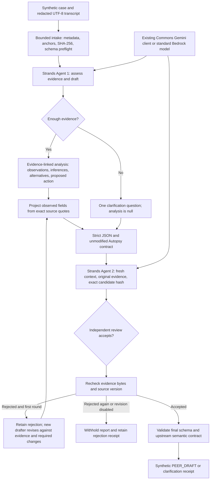

# Architecture

Strands owns each real agent invocation, message handling, and model stream consumption. The application explicitly sequences drafting and review and decides whether the contract allows an output. Every invocation uses a distinct `Agent` and `Model` instance with a fresh request session. The reviewer receives the exact candidate, assembled report, and original evidence, not the drafter's private conversation history or previous reviewer judgment. It is still model review, not human acceptance or a guarantee of factual correctness.

The CLI permits one internal revision after a valid rejection with concrete required changes. The new drafter sees the previous candidate/report and review as untrusted assessments alongside the original evidence. The next reviewer assesses only the new candidate/report and original evidence. No confidence label or substantive field is silently rewritten by code. All rounds, raw outputs and binding hashes remain in the receipt. This internal author/reviewer correction is new orchestration design, separate from the upstream buyer clarification round or iterative consulting. An insufficient-evidence clarification has no causes to challenge, so its reviewer may return empty counterexamples while still providing evidence-linked findings and checking that no diagnosis was invented.

The pipeline exposes no model-callable external tools. Its end-to-end work is the intake, analysis, independent assessment, schema validation, and local artifact production. Recommendations are not implemented in the supplied project. Evidence text is data and never executed; prompt instructions alone are not an implemented injection detector.

The model selects the first-divergence anchor and a chronological subset for the failure chain; deterministic code supplies the actual quoted observations and the complete anchored timeline. Selection of the meaningful divergence remains interpretive. Long source lines use an explicitly labeled bounded excerpt while retaining the full hashed source. The reviewer sees this exact assembled report before review, and its binding hash covers both the model candidate and assembled report. Every primary/contributing cause needs a separate reviewer assessment. HIGH confidence cannot retain a plausible or untested competing account; that necessary condition does not prove causal entailment.

The final result is bound to evidence SHA-256, canonical candidate/report hashes, and a version covering application code, unmodified upstream runtime/schema/templates, the dependency lock, and source manifest. The version is checked again after review. Service records distinguish request attempts, completion reasons, errors, actual elapsed time, and unavailable token usage. Concise CLI events show each actual phase start/finish without printing source text or credentials. There is no price-based reasoning cutoff or fabricated payment record.
