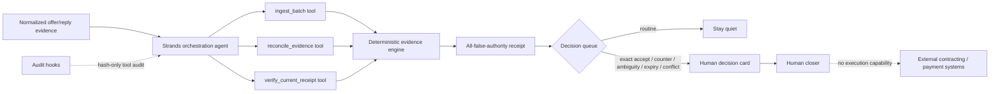

# Architecture

## Trust and authority boundary

The model never determines commercial truth. Strands selects deterministic tools; the tools validate normalized evidence and produce a receipt. `HUMAN_CLOSING_READY` means only that a human-reviewed response exactly matches the current offer before expiry. The relay has no capability to sign, execute a contract, create checkout/invoices, charge, start fulfillment, or recognize revenue.

The independent receipt digest and source batch are separate trust inputs during verification. The receipt's own SHA-256 is only an integrity checksum, never authenticity by itself.
