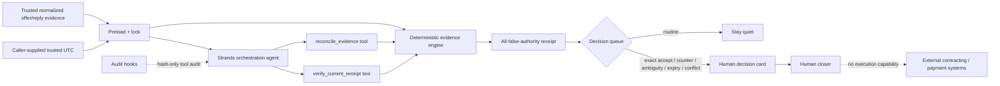

# Architecture

## Trust and authority boundary

The model never determines commercial truth. The CLI preloads normalized evidence and caller-supplied trusted UTC before orchestration, then locks evidence ingestion for that run. Strands selects deterministic read/decision tools; the tools validate normalized evidence and produce a receipt. The model cannot replace the trusted batch or choose the clock used by reconciliation/current verification.

`HUMAN_CLOSING_READY` means only that a human-reviewed response exactly matches the current offer before expiry. The relay has no capability to sign, execute a contract, create checkout/invoices, charge, start fulfillment, or recognize revenue.

The independent receipt digest, source batch, and caller-supplied current UTC are separate trust inputs during current verification. The receipt's own SHA-256 is only an integrity checksum, never authenticity by itself. Historical integrity verification remains available separately and is not treated as current authority.

Receipt outputs are create-exclusive so a later run cannot silently replace the claim-time evidence file. Audit hooks record SDK exceptions and cancellations as failures and retain only hashes/metadata rather than raw commercial evidence.
