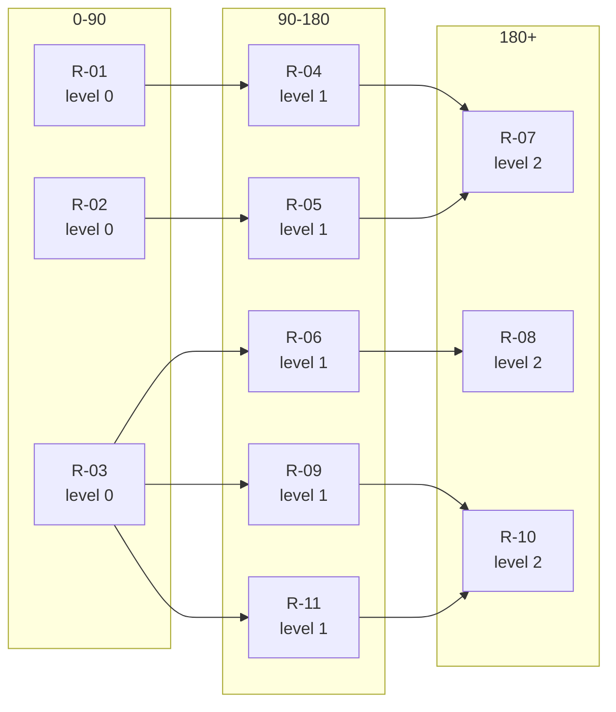

# Roadmap dependency consistency check

**Work order:** UIOWA-115  
**Roadmap:** `RM-CONSISTENT-v1`  
**Content digest:** `bd046e78095113dad303cd93ae9b701fce85a1f006ce95e09950f4bf95eed205`

> SYNTHETIC. Every recommendation, phase placement and prerequisite here is FICTION written to exercise the checker. Nothing is a University roadmap, a University recommendation, or a University finding.

> **On ordering.** This check reports dependency LEVELS, never a single execution order. Items sharing a level have no dependency path between them and may proceed in parallel. Serialising them would be a loss of real information, not a simplification.

| items | edges | errors | unknown | open questions | info |
|---|---|---|---|---|---|
| 11 | 10 | **0** | 0 | 1 | 8 |

`errors` must reach zero. `unknown` means the roadmap does not contain enough information to decide - it is not a pass and it is not a failure, and no repair the checker can apply will clear it.

## Work that can proceed in parallel

Items in the same row have no dependency path between them in either direction. Scheduling them one after another would add time the graph does not require.

| phase | level | items that may run at the same time |
|---|---|---|
| 0-90 | 0 | `R-01`, `R-02`, `R-03` |
| 90-180 | 1 | `R-04`, `R-05`, `R-06`, `R-09`, `R-11` |
| 180+ | 2 | `R-07`, `R-08`, `R-10` |

## Open questions

**`shared_prerequisite`**

Item 'R-03' is a prerequisite for 3 other items (R-06, R-09, R-11). It is a chokepoint: if it slips, all of them slip.

## Informational

**`schedule_slack`**

Item 'R-04' is in '90-180'; its prerequisites would allow '0-90'. That is float, not an error - phases carry capacity and timing that the dependency graph does not know about.

**`schedule_slack`**

Item 'R-05' is in '90-180'; its prerequisites would allow '0-90'. That is float, not an error - phases carry capacity and timing that the dependency graph does not know about.

**`schedule_slack`**

Item 'R-06' is in '90-180'; its prerequisites would allow '0-90'. That is float, not an error - phases carry capacity and timing that the dependency graph does not know about.

**`schedule_slack`**

Item 'R-07' is in '180+'; its prerequisites would allow '90-180'. That is float, not an error - phases carry capacity and timing that the dependency graph does not know about.

**`schedule_slack`**

Item 'R-08' is in '180+'; its prerequisites would allow '90-180'. That is float, not an error - phases carry capacity and timing that the dependency graph does not know about.

**`schedule_slack`**

Item 'R-09' is in '90-180'; its prerequisites would allow '0-90'. That is float, not an error - phases carry capacity and timing that the dependency graph does not know about.

**`schedule_slack`**

Item 'R-10' is in '180+'; its prerequisites would allow '90-180'. That is float, not an error - phases carry capacity and timing that the dependency graph does not know about.

**`schedule_slack`**

Item 'R-11' is in '90-180'; its prerequisites would allow '0-90'. That is float, not an error - phases carry capacity and timing that the dependency graph does not know about.

## Dependency graph

A Graphviz version is written alongside this report as `graph.dot`.
