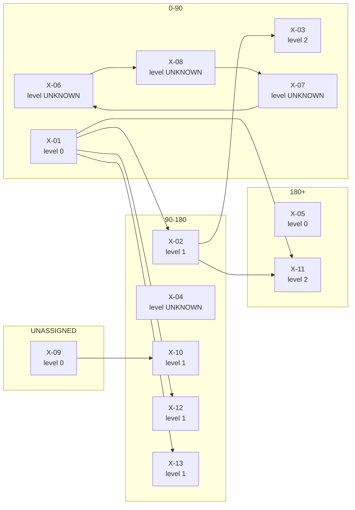

# Roadmap dependency consistency check

**Work order:** UIOWA-115  
**Roadmap:** `RM-INCONSISTENT-v1`  
**Content digest:** `39c540bce82749859d1c1b3a2bd8d42b6d6f23ad90b1aa600d6e4d93b0341883`

> SYNTHETIC and deliberately inconsistent. Each item exercises one failure the checker must name precisely. Not a University roadmap.

> **On ordering.** This check reports dependency LEVELS, never a single execution order. Items sharing a level have no dependency path between them and may proceed in parallel. Serialising them would be a loss of real information, not a simplification.

| items | edges | errors | unknown | open questions | info |
|---|---|---|---|---|---|
| 13 | 10 | **4** | 3 | 1 | 7 |

`errors` must reach zero. `unknown` means the roadmap does not contain enough information to decide - it is not a pass and it is not a failure, and no repair the checker can apply will clear it.

## Work that can proceed in parallel

Items in the same row have no dependency path between them in either direction. Scheduling them one after another would add time the graph does not require.

| phase | level | items that may run at the same time |
|---|---|---|
| 90-180 | 1 | `X-02`, `X-10`, `X-12`, `X-13` |

Level could not be determined for `X-04`, `X-06`, `X-07`, `X-08` - each depends on something unresolved, unreadable or caught in a loop.

## Errors - exact edges to repair

**`dependency_cycle`**

These 3 items depend on each other in a loop, so none of them can start: X-06 -> X-07 -> X-08. Every edge listed below is an equally valid cut - the checker will not choose which dependency is the wrong one.

- *(applyable)* Remove prerequisite 'X-06' from 'X-08'.
- *(applyable)* Remove prerequisite 'X-07' from 'X-06'.
- *(applyable)* Remove prerequisite 'X-08' from 'X-07'.

**`missing_prerequisite`** — edge `X-99` → `X-04`

Item 'X-04' requires 'X-99', which this roadmap does not define. The reference is not treated as satisfied.

- *(needs a planner)* Define 'X-99' as a roadmap item, if the dependency is real.
- *(applyable)* Or remove the reference to 'X-99' from 'X-04', if it was a typo or a dropped item.

**`phase_inversion`** — edge `X-02` → `X-03`

Item 'X-03' sits in '0-90' but requires 'X-02', which cannot complete before '90-180'. No execution order satisfies this.

- *(applyable)* Move 'X-03' to '90-180' - the earliest phase consistent with its prerequisites.
- *(needs a planner)* Or move 'X-02' to '0-90' or earlier, if that work can genuinely start sooner.

**`self_dependency`** — edge `X-05` → `X-05`

Item 'X-05' lists itself as a prerequisite, so it can never start.

- *(applyable)* Remove 'X-05' from its own prerequisites.

## Unknown - the roadmap does not say

**`feasibility_unknown`**

Whether 'X-04' is placed consistently cannot be determined: its own prerequisite list could not be fully read or resolved. This is not the same as being placed correctly.

**`feasibility_unknown`**

Whether 'X-10' is placed consistently cannot be determined: something it depends on is unassigned, unresolved or caught in a loop. This is not the same as being placed correctly.

**`unassigned_phase`**

Item 'X-09' has no phase. It stays UNASSIGNED; the checker will not place it in the first phase or anywhere else.

- *(needs a planner)* A planner must assign a phase to 'X-09'.

## Open questions

**`shared_prerequisite`**

Item 'X-01' is a prerequisite for 4 other items (X-02, X-11, X-12, X-13). It is a chokepoint: if it slips, all of them slip.

## Informational

**`duplicate_prerequisite`** — edge `X-01` → `X-11`

Item 'X-11' lists prerequisite 'X-01' more than once; the repeat was removed and reported, not silently collapsed.

**`redundant_edge`** — edge `X-01` → `X-11`

Item 'X-11' lists 'X-01' directly, but already reaches it through X-02. The direct edge can be removed without changing the plan.

- *(needs a planner)* Optional tidy-up: remove 'X-01' from 'X-11'.

**`schedule_slack`**

Item 'X-02' is in '90-180'; its prerequisites would allow '0-90'. That is float, not an error - phases carry capacity and timing that the dependency graph does not know about.

**`schedule_slack`**

Item 'X-05' is in '180+'; its prerequisites would allow '0-90'. That is float, not an error - phases carry capacity and timing that the dependency graph does not know about.

**`schedule_slack`**

Item 'X-11' is in '180+'; its prerequisites would allow '90-180'. That is float, not an error - phases carry capacity and timing that the dependency graph does not know about.

**`schedule_slack`**

Item 'X-12' is in '90-180'; its prerequisites would allow '0-90'. That is float, not an error - phases carry capacity and timing that the dependency graph does not know about.

**`schedule_slack`**

Item 'X-13' is in '90-180'; its prerequisites would allow '0-90'. That is float, not an error - phases carry capacity and timing that the dependency graph does not know about.

## Dependency graph

A Graphviz version is written alongside this report as `graph.dot`.
