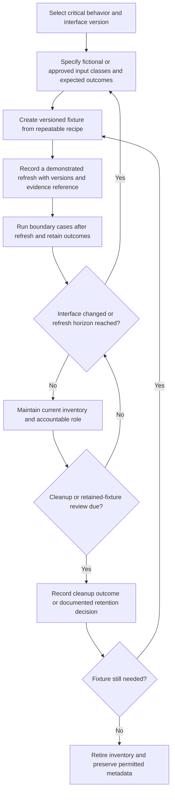

# Test-data readiness — grouped-interview worksheet

**UIOWA-047. Editable assessment instrument. All worked examples below are fictional.** No University findings or actual appointments are represented. Use organizational roles, not employee ratings. Keep confidential values out of evidence notes; collect a reference and a minimal description instead.

## Assessment header

| Field | Entry |
|---|---|
| Service / organizational group | UNKNOWN |
| Assessment snapshot / cutoff with timezone | UNKNOWN |
| Contract or interface revision / source locator | UNKNOWN |
| Selected critical behaviors and reason for selection | UNKNOWN |
| Fixture owner role / substitute role | UNKNOWN |
| Evidence custodian / access route agreed by the organization | UNKNOWN |
| Known sampling limits / omitted systems | UNKNOWN |
| Assessor / reviewer | UNKNOWN |

A grouped discussion with people who specify behavior, maintain fixtures, execute tests and support changes can complete this instrument without scheduling one meeting per individual. These are role suggestions, not assignments or availability claims.

## Lifecycle diagram

Text equivalent: select behavior and contract; specify input class and expected outcome; create/version; demonstrate refresh; record later boundary-case runs; revisit when contract or freshness changes; at the cleanup/review horizon, record the outcome or retention decision; retire or recreate. Recreation begins a new maintenance cycle. Written steps alone do not demonstrate that any step succeeded.

## Interview and evidence matrix

Complete one row per sampled fixture or service; copy rows for additional evidence. Keep `Documented`, `Observed record`, `Contradicted` and `UNKNOWN` distinct in notes. A locator means title/version/section, record ID or other precise source reference, not a pasted sensitive payload.

| Practice / question | Evidence requested | Concrete testing limitation to investigate | Record / status | Owner role | Effort / dependencies | Proportionate improvement |
|---|---|---|---|---|---|---|
| Which service-critical boundary conditions are selected, and why? | Requirement-to-case mapping with expected behavior and selected interface revision. | Important boundary may be absent from the sampled catalog; do not generalize to all testing. | UNKNOWN | Service analyst + test maintainer | UNKNOWN; business-rule clarification may be needed. | Add one representative boundary specification before increasing fixture volume. |
| Can another practitioner construct the same fixture? | Recipe version and one refresh/recreation receipt. | A named fixture or written recipe may not be repeatable in practice. | UNKNOWN | Fixture-maintaining team | UNKNOWN; dependencies and environment assumptions. | Capture inputs, versions, outcome and reproducible generation steps. |
| What happens when an interface changes? | Contract revision history, fixture version and matching run records. | Old-version passes may no longer exercise the current contract. | UNKNOWN | Interface owner + fixture maintainer | UNKNOWN; dependency team coordination. | Connect interface changes to a targeted fixture review and rerun. |
| How are refresh intervals chosen? | Service-specific cadence, trigger rationale and recent refresh history. | Old fixtures may underrepresent current behavior; a fixed arbitrary cadence may waste effort. | UNKNOWN | Service owner | UNKNOWN; data-generation cost and change frequency. | Agree cadence and change-triggered refresh appropriate to this service. |
| Can a successful test run be linked to this fixture generation? | Run time, fixture version, contract version, outcome and reference. | A pass before refresh or on a different version cannot support this generation. | UNKNOWN | Test-system maintainer | UNKNOWN; run metadata support. | Retain version-linked post-refresh results. |
| What follows a failed or unreferenced latest run? | Triage record, resolution rationale and subsequent rerun. | Earlier success may conceal current uncertainty or a reproducible failure. | UNKNOWN | Owning development team | UNKNOWN; distinguish fixture defect from application defect. | Preserve failure context; investigate before claiming current support. |
| How is cleanup demonstrated, and what does it remove? | Cleanup scope, due time, result, generation link, retention decision where needed. | Complete cleanup may conflict with active inventory; old cleanup may be reused for a recreated generation. | UNKNOWN | Fixture steward + environment maintainer | UNKNOWN; disposal/retention policy dependencies belong in UIOWA-059. | Record outcome and update inventory; start a new cycle after recreation. |
| Who maintains fixtures when staff or services change? | Role ownership, substitute ownership and recent handoff record. | Fixture may be technically useful but operationally orphaned. | UNKNOWN | Accountable service team | UNKNOWN; knowledge transfer and capacity. | Assign a team role and brief handoff, not an individual performance score. |
| What does maintaining this fixture actually cost? | Approximate refresh/review/cleanup effort for one cycle, uncertainty and shared dependencies. | An improvement may be unrealistic or double-count the same work across findings. | UNKNOWN | Service owner + maintainer | UNKNOWN; do not substitute zero. | Estimate a range outside the calculator and enter an agreed cycle estimate when available. |

## Fictional boundary specifications and maintenance plan

These expected outcomes are invented exercise rules, not University business requirements. Before using the instrument in a real assessment, replace them with source-linked organizational requirements. The generator deliberately leaves one selected case unspecified and several cases without usable current evidence.

| Fixture / contract | Fictional input class / expected behavior | Evidence scenario | Testing limitation | Practical next action / dependency | Illustrative cycle effort and owner |
|---|---|---|---|---|---|
| SYN-ESS-01 / SYN-enrollment v3 | SYN-STUDENT-A withdrawal one second after an invented cutoff; use documented late-request branch without altering prior enrollment. | Fresh version-aligned refresh and later successful run. | A single sampled boundary supports only its stated behavior. | Ask whether before/at/after variants are represented; requires agreed cutoff semantics. | 2.5 hours per whole fixture cycle; fictional student-systems steward. |
| SYN-ESS-01 / SYN-enrollment v3 | Repeat SYN-REQUEST-1; create only one enrollment and return a stable duplicate result. | Successful later run. | Does not establish behavior for all concurrent request patterns. | Sample realistic retry timing; requires interface retry contract. | Same 2.5-hour fixture estimate, not an additional 2.5 hours. |
| Selected ESS Unicode case | A fictional identifier with canonically equivalent character forms; organizational rule must define whether these are equal or distinct. | No specification or run in supplied catalog. | Expected behavior cannot be evaluated yet; avoid inventing normalization policy. | Clarify the interface rule, write a fixture specification, then run it. | UNKNOWN until rule and test harness are known. |
| SYN-RIS-01 / SYN-award v2 | Renewal exactly at an invented funding-period boundary; use explicitly chosen boundary branch. | A successful run follows an old refresh, but the supplied seven-day horizon has expired. | Old supporting evidence does not establish current fixture coverage. | Refresh and rerun; depends on controlled funding-period input generation. | 4 hours per whole fixture cycle; fictional research-systems maintainer. |
| SYN-RIS-01 / SYN-award v2 | Replay the same fictional award import; keep a single award and original provenance. | Specification exists, but no run receipt; cleanup horizon also passed. | Duplication behavior and cleanup are not demonstrated. | Capture a run and review cleanup scope; the cleanup is not proof of a privacy violation. | Same 4-hour fixture estimate; coordinate with data-handling lane. |
| SYN-IAM-01 / SYN-identity v5 | Fictional contractor reaches declared expiry instant; transition entitlement with traceable evidence. | Newer failed run supersedes earlier success. | Current sampled evidence records failure, not a diagnosed production defect. | Investigate fixture/application/time-rule causes and retain a rerun. | 1.5 hours per whole fixture cycle; fictional identity steward. |
| SYN-IAM-01 / SYN-identity v5 | Fictional role change removes obsolete entitlement; repeated deprovision should be idempotent. | Role change has a passing record; repeated deprovision has no run. | A pass on one case does not fill the other case's evidence gap. | Record repeated-delivery result, including harmless repetition. | Same 1.5-hour fixture estimate. |
| SYN-IAM-LEGACY / v4 against current v5 | Legacy role-change fixture retained from old interface. | Old-version records; owner, recipe and effort unspecified. | Old pass cannot be treated as v5 support; maintenance continuity is unknown. | Reconcile current use, assign a role, then migrate or retire; depends on interface owner. | UNKNOWN, never zero. |

## Facilitator exercises and expected interpretation

**Recreation exercise.** Add a successful cleanup before a later refresh, then set the new cleanup due time before the assessment cutoff. The fixture can have current post-refresh run evidence, but the earlier generation's cleanup must not clear the new cleanup obligation. Expected reason: `CLEANUP_NOT_DEMONSTRATED`; not `ACTIVE_AFTER_CLEANUP`.

**Written-versus-observed exercise.** Preserve `recipe_ref`, remove `refreshes`, and retain the run. The recipe remains documented intent; current support becomes unknown. Ask for an actual refresh receipt rather than silently asserting either readiness or failure.

**Version-change exercise.** Change the fixture's declared interface revision without updating the refresh and case receipts. The recorded historical run remains visible, but the current evidence does not become supported. Ask for a deliberate migration and new evidence, not a cosmetic version-label edit.

**Contradictory outcomes exercise.** Add a second current fixture for the same case with a recorded failure. Keep both `supported_by` and `failure_recorded_by`; do not average, take the best result, or turn the conflict into an organizational ranking.

**Boundary-time exercise.** Run at the precise refresh horizon and one second later. The first remains within the declared interval; the second becomes overdue. Record timezone explicitly. A run at the exact same instant as refresh does not prove that it occurred afterward.

## Finding and improvement record template

| Field | Entry |
|---|---|
| Finding candidate ID / source fixture / case | UNKNOWN |
| What supplied evidence establishes | UNKNOWN |
| What remains unobserved or contradicted | UNKNOWN |
| Sampling and applicability limit | UNKNOWN |
| Specific service/testing consequence | UNKNOWN |
| Improvement option / alternative / reason to defer | UNKNOWN |
| Accountable role and prerequisite decision | UNKNOWN |
| One-time effort / recurring fixture-cycle effort / uncertainty | UNKNOWN |
| Demonstration that would close the evidence gap | UNKNOWN |
| Review disposition / source locator | UNKNOWN |

Do not convert an interview prompt, fictional report row or missing observation into a finding without real source review and applicability judgment. Preserve attribution, record scope and separate data-handling questions for the relevant assessment lane.
