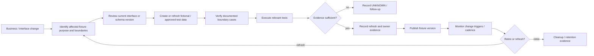

# Test-data refresh lifecycle

The lifecycle is designed to expose maintenance evidence without assuming a particular test framework, database, CI platform, or vendor.

## Evidence checkpoints

| Stage | Evidence question | Do not infer |
| --- | --- | --- |
| Purpose | What behavior is the fixture meant to exercise? | That a dataset is representative merely because it exists |
| Boundary definition | Which edge conditions are required and why? | Universal boundary cases across ESS, RIS, and IAM |
| Interface alignment | Which schema/API/event version does the fixture target? | Compatibility when one side of the version comparison is unknown |
| Refresh | When was the fixture refreshed and what triggers refresh? | Staleness when cadence or last-refresh evidence is absent |
| Execution | Which tests or workflows actually used the fixture? | Production quality from a passing synthetic rehearsal alone |
| Cleanup | How is obsolete/temporary test data removed? | Successful cleanup from a written policy without evidence |
| Retention | What governs fixture retention and retirement? | A compliance conclusion; this engagement is practice-focused |

## Trigger examples

Reasonable triggers can be calendar-based, event-based, or both:

- interface/schema change;
- business-rule change;
- newly identified boundary condition;
- production defect revealing an unrepresented case;
- periodic refresh where source-like distributions or code tables evolve; or
- ownership/service transition.

The assessor records the declared cadence and versions. It does not prescribe one refresh interval.
