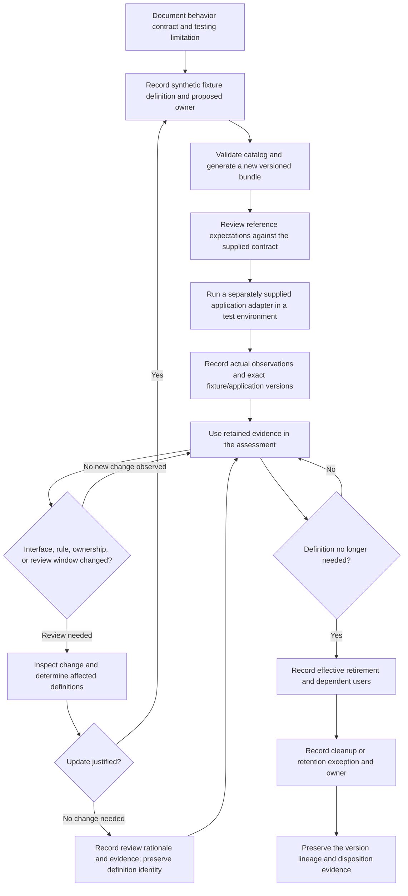

# Test-data refresh and retirement lifecycle

This editable process model describes a proposed practice. It does not schedule
work, assign a real person's availability, or change any data store.

The application adapter and application execution in this diagram are separate
future activities, not functions implemented or executed by this kit.

## Handoffs and their evidence

| Step | Proposed responsible role | Evidence to retain | A plan does not establish |
|---|---|---|---|
| Define | Behavior owner with fixture maintainer | Rule/contract revision, purpose, representative partitions, omissions. | That examples are representative of all services. |
| Create | Fixture maintainer | Definition version/digest, generator version, bundle manifest, synthetic-data origin note. | That the application was tested. |
| Review | Practitioner familiar with the behavior | Expectation review and reasoned disagreements. | That an approval click was substantive review. |
| Execute | Test-environment operator | Adapter/application versions, actual outputs, environment, timestamps, run location. | That a generated reference output came from the application. |
| Refresh | Fixture maintainer and interface owner | Trigger/change, affected definitions, exact changed version, checks, completion record. | That the scheduled cadence actually occurred. |
| Retire | Maintainer with dependent service owners | Effective date, dependencies, replacement version or reason no replacement exists. | That obsolete copies were removed. |
| Dispose/retain | Data/evidence custodian | Cleanup disposition or justified retention exception, location, date, accountable role. | That this tool deleted or retained anything externally. |

## Trigger examples

A fixture review may be triggered by a changed interface or behavior rule,
a previously omitted boundary discovered during testing, an ownership change,
failed generation/verification, a defect that the sample missed, or the
caller-selected review window. A version-label change can be harmless; review
semantic changes rather than equating every version difference with a defect.

A justified no-change review is useful evidence. Keep it separate from a
regeneration claim: there may be no new fixture bytes, even though the reviewer
completed meaningful work. This v1 catalog has a completed-refresh date and
pointer, not a separate no-change-review date field. Record that distinction in
the worksheet; do not change `last_refreshed` to imply a regeneration that did
not happen. A future schema extension should model the two events explicitly.

## Version-preservation rule

Generation writes a fresh directory and never overwrites an existing bundle.
Old versions can therefore be reproduced while a proposed revision is reviewed.
The tool is not a retention-policy engine and is not an evidence archive:
external custodianship, retention decisions, and actual cleanup remain separate.

A retired fixture's source remains available in this synthetic rehearsal to
illustrate lineage. The lack of an active-refresh warning for a retired
fixture does not waive cleanup questions or prove that its dependent users
have migrated to a replacement.
