# UIOWA-041 — SDLC workflow evidence map

**Status:** assessment-preparation method; no University practice is asserted  
**Prepared:** 2026-09-19  
**Synthetic example:** all names, timestamps, IDs, actors, and artifacts below are fictional

## Objective

Trace a change from request intake through support handoff while recording stages, wait time, handoffs, exceptions, evidence, documented-versus-observed differences, and explicit UNKNOWN states.

## Editable workflow diagram

```mermaid
flowchart LR
    A["01 Intake"] --> B["02 Triage"]
    B --> C["03 Need & acceptance"]
    C --> D["04 Design & dependencies"]
    D --> E["05 Implementation"]
    E --> F["06 Peer review"]
    F --> G["07 Verification"]
    G --> H["08 User/business acceptance"]
    H --> I["09 Release authorization"]
    I --> J["10 Deployment / activation"]
    J --> K["11 Post-change validation"]
    K --> L["12 Support handoff"]
    L --> M["13 Follow-up / learning"]

    B -. "defer / reject / split" .-> Z["Decision record"]
    F -. "rework" .-> E
    G -. "failure" .-> E
    H -. "requirement change" .-> C
    I -. "urgent-maintenance exception" .-> J
    K -. "rollback / remediation" .-> E
```

## Timing model

For each stage, capture timestamps only when the source can support them.

- **Queue wait:** `work_start - queue_enter`
- **Active duration:** `work_end - work_start`
- **Stage elapsed:** `work_end - queue_enter`
- **End-to-end elapsed:** final supported completion timestamp minus supported intake timestamp

If a timestamp is absent, leave the duration blank and mark timing evidence **UNKNOWN**. Missing does not mean zero.

## Evidence rules

1. **Documented is not observed.** A process document establishes an expected route; it does not prove a sampled change followed it.
2. **Interview is a statement unless corroborated.** Record who/what supplied the statement and any artifact that supports it.
3. **Absence of a file is not evidence that an activity did not happen.** Use `UNKNOWN` unless the evidence source is authoritative for absence.
4. **Exceptions are first-class.** Emergency, routine-maintenance, vendor, and configuration-only paths can be valid if criteria, authorization, scope, and follow-up are visible.
5. **Equivalent outcomes may use different tools.** Assess traceability, control, and feedback rather than tool brands.
6. **Waiting time needs a boundary.** A ticket date supports intake or completion only when its semantics are known.
7. **Sample findings retain context.** A single change does not establish team-wide prevalence.

## Status vocabulary

| Status | Meaning |
|---|---|
| `SUPPORTED` | Current evidence supports the stage/activity for this sampled change. |
| `PARTIAL` | Some elements are supported, but a material component is missing or ambiguous. |
| `CONFLICT` | Sources disagree in a way that affects interpretation. |
| `UNKNOWN` | Evidence is insufficient to determine what occurred. |
| `NOT_APPLICABLE` | Stage is demonstrably outside the applicable path, with rationale. |

`UNKNOWN` is not a low score and is not equivalent to `NO`.

## Synthetic change SYN-041-001

A fictional student-services demonstration application changes a validation rule for a form. The example includes a fictional cross-team access dependency solely to exercise a handoff. It does not describe a real University application, workflow, or behavior.

The companion `41-synthetic-change-trace.csv` traces all 13 stages.

The sample deliberately includes:

- supported intake, triage, implementation, review, testing, release authorization, activation, and follow-up;
- a changed acceptance criterion whose revised approval is only partially evidenced;
- a missing user/business-acceptance artifact recorded as `UNKNOWN`, not as “acceptance did not occur”;
- post-change validation with a timestamp but no defined success criterion, recorded as `PARTIAL`;
- an urgent-maintenance exception with recorded rationale and authorization, not automatically treated as weak;
- conflicting evidence about when support documentation became ready, recorded as `CONFLICT`.

## Questions that expose documented vs observed workflow

### Intake and triage
- Which channels can create work, and which system is authoritative for the original request?
- How are duplicate, deferred, rejected, and split requests represented?
- Which fields indicate business priority versus engineering sequence?
- Show a recent request whose priority changed and the evidence for that decision.

### Need, acceptance, and design
- Who can define or change acceptance criteria?
- How are accessibility, privacy, security, data, access, integration, and operational dependencies identified?
- When a requirement changes after work begins, where is the decision preserved?
- What design evidence is expected for a routine change versus a high-risk change?

### Implementation and peer review
- How is a delivered change linked back to the request and acceptance criteria?
- What evidence distinguishes substantive review from an approval click?
- How are review comments resolved, waived, or deferred?
- What happens when urgent maintenance bypasses the usual reviewer set?

### Verification and acceptance
- Which test types are expected for this kind of change, and why?
- Where are failed or retried tests visible?
- When is user/business acceptance required, and who can provide it?
- If acceptance evidence is stored elsewhere, where should an assessor retrieve it?

### Release, activation, and validation
- Who can authorize a normal release? An urgent exception?
- Which pre-release conditions are mandatory, conditional, or advisory?
- Where can the assessor find activation evidence?
- What post-change checks define success, and how are rollback/remediation decisions captured?

### Support and learning
- What information must support personnel receive before or after activation?
- How are known limitations, ownership, communications, and documentation updates linked?
- How are incidents or early defects traced back to the change?
- How do repeated exceptions or support problems become process-improvement work?

## Sampling guidance

Use the same worksheet across ESS, RIS, and IAM while preserving each group’s own lifecycle terms. Sample, when available:

- one routine change;
- one urgent or exception-path change;
- one cross-team dependency;
- one change with requirement change or rework;
- one change with a production/support issue.

## Completion criteria

- [x] Editable end-to-end diagram includes stages, handoffs, rework, and exception paths.
- [x] Worksheet fields cover waiting time, active time, evidence semantics, documented route, observed route, and follow-up.
- [x] One synthetic change is traceable across all stages.
- [x] Missing acceptance evidence remains `UNKNOWN`.
- [x] A documented-vs-observed conflict is represented without inventing a resolution.
- [x] Questions distinguish written process from sampled practice.
